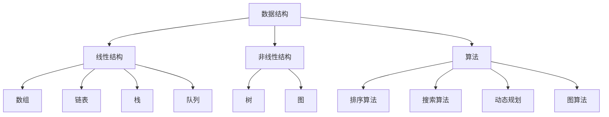

                 

# 2025网易校招面试算法题库大全

> **关键词：** 算法题库，校招面试，网易，编程，数据结构，算法分析，实际应用
>
> **摘要：** 本文将围绕2025年网易校招面试中的核心算法题库进行深入解析，从基本概念到实际操作，涵盖数据结构与算法的方方面面。通过详细讲解，帮助读者掌握算法原理，提升面试技能，为职业发展奠定坚实基础。

## 1. 背景介绍

### 1.1 目的和范围

本文旨在为准备参加2025年网易校招面试的候选人提供一套全面、系统的算法题库解析。题库内容覆盖了计算机科学中的基础数据结构和算法，如排序、搜索、动态规划、图论等。通过本文的学习，读者将能够：

- 理解并掌握各类算法的原理和实现方式；
- 学会运用算法解决实际问题；
- 提高在校招面试中的算法题解题能力。

### 1.2 预期读者

本文适合以下读者群体：

- 准备参加2025年网易校招的应届毕业生；
- 想提高算法和数据结构水平的计算机专业学生；
- 对计算机面试算法题感兴趣的技术爱好者。

### 1.3 文档结构概述

本文结构如下：

- **第1章：背景介绍**：介绍本文的目的、预期读者及文档结构；
- **第2章：核心概念与联系**：讲解数据结构与算法的基本概念，并给出流程图；
- **第3章：核心算法原理与具体操作步骤**：详细阐述算法原理，使用伪代码演示；
- **第4章：数学模型和公式**：介绍相关数学模型和公式，使用LaTeX格式；
- **第5章：项目实战**：通过实际代码案例，讲解算法应用；
- **第6章：实际应用场景**：分析算法在不同领域的应用；
- **第7章：工具和资源推荐**：推荐学习资源、开发工具和论文；
- **第8章：总结**：展望算法发展的未来趋势和挑战；
- **第9章：附录**：常见问题与解答；
- **第10章：扩展阅读**：提供更多参考资料。

### 1.4 术语表

#### 1.4.1 核心术语定义

- **算法（Algorithm）**：解决问题的步骤序列，能够自动执行并得到正确结果的计算过程。
- **数据结构（Data Structure）**：存储和管理数据的各种方法，以便有效地进行数据的存取操作。
- **动态规划（Dynamic Programming）**：一种用于求解最优子问题的算法策略。
- **图论（Graph Theory）**：研究图及其性质和应用的数学分支。
- **排序算法（Sorting Algorithm）**：对数据进行排序的一系列方法。

#### 1.4.2 相关概念解释

- **时间复杂度（Time Complexity）**：算法执行时间的增长速率，用于衡量算法效率。
- **空间复杂度（Space Complexity）**：算法执行过程中所需额外内存的增长速率。
- **递归（Recursion）**：函数调用自身的过程，用于解决递归定义的问题。

#### 1.4.3 缩略词列表

- **IDE（Integrated Development Environment）**：集成开发环境，用于编写、调试和运行代码。
- **LaTeX**：一种高质量的排版系统，常用于撰写科学论文和书籍。
- **LaTeX**：一种高质量的排版系统，常用于撰写科学论文和书籍。

## 2. 核心概念与联系

### 2.1 数据结构与算法概述

数据结构与算法是计算机科学的基础，两者密不可分。数据结构负责数据的存储和管理，算法则负责对数据进行操作和处理。

以下是一个简单的 Mermaid 流程图，展示了常见的数据结构与它们之间的关系：



### 2.2 算法原理与实现

算法原理是实现算法的核心。以下是一个简单的排序算法（冒泡排序）的伪代码：

```plaintext
算法：冒泡排序
输入：一个无序数组 A
输出：一个有序数组 A

冒泡排序(A)
for i = 0 to n-1
    for j = 0 to n-i-1
        if A[j] > A[j+1]
            交换 A[j] 和 A[j+1]
```

### 2.3 时间复杂度与空间复杂度

时间复杂度和空间复杂度是衡量算法性能的重要指标。以下是一个简单的时间复杂度分析示例：

```plaintext
算法：查找算法
输入：一个有序数组 A 和一个目标值 x
输出：数组 A 中目标值 x 的索引，或 -1 表示未找到

查找(A, x)
for i = 0 to n-1
    if A[i] == x
        return i
    end if
return -1
```

此算法的时间复杂度为 \( O(n) \)，表示随着输入规模 \( n \) 的增大，算法执行时间呈线性增长。

## 3. 核心算法原理与具体操作步骤

### 3.1 排序算法

排序算法是计算机科学中最基础且应用广泛的算法之一。以下将介绍几种常见的排序算法及其具体操作步骤。

#### 3.1.1 冒泡排序

冒泡排序是一种简单的排序算法，其基本思想是通过多次遍历数组，比较相邻元素的大小，并将较大的元素交换到后面，直到整个数组有序。

伪代码：

```plaintext
算法：冒泡排序
输入：一个无序数组 A
输出：一个有序数组 A

冒泡排序(A)
for i = 0 to n-1
    for j = 0 to n-i-1
        if A[j] > A[j+1]
            交换 A[j] 和 A[j+1]
```

#### 3.1.2 快速排序

快速排序是一种高效的排序算法，其基本思想是通过一趟排序将数组分成两部分，其中一部分的所有元素都比另一部分的所有元素小，然后再对这两部分递归排序。

伪代码：

```plaintext
算法：快速排序
输入：一个无序数组 A
输出：一个有序数组 A

快速排序(A, low, high)
if low < high
    pivot = partition(A, low, high)
    快速排序(A, low, pivot - 1)
    快速排序(A, pivot + 1, high)

partition(A, low, high)
pivot = A[high]
i = low
for j = low to high-1
    if A[j] < pivot
        交换 A[i] 和 A[j]
        i = i + 1
交换 A[i] 和 A[high]
return i
```

### 3.2 搜索算法

搜索算法用于在数据集合中查找特定元素。以下将介绍几种常见的搜索算法及其具体操作步骤。

#### 3.2.1 二分搜索

二分搜索是一种高效的搜索算法，其基本思想是在有序数组中，通过每次将搜索范围缩小一半，逐步逼近目标元素。

伪代码：

```plaintext
算法：二分搜索
输入：一个有序数组 A 和一个目标值 x
输出：数组 A 中目标值 x 的索引，或 -1 表示未找到

二分搜索(A, x, low, high)
if low > high
    return -1
mid = (low + high) / 2
if A[mid] == x
    return mid
else if A[mid] > x
    return 二分搜索(A, x, low, mid - 1)
else
    return 二分搜索(A, x, mid + 1, high)
```

#### 3.2.2 暴力搜索

暴力搜索是一种简单的搜索算法，其基本思想是遍历整个数据集合，直到找到目标元素或遍历结束。

伪代码：

```plaintext
算法：暴力搜索
输入：一个数据集合 A 和一个目标值 x
输出：目标值 x 的索引，或 -1 表示未找到

暴力搜索(A, x)
for i = 0 to n-1
    if A[i] == x
        return i
return -1
```

### 3.3 动态规划

动态规划是一种用于求解最优子问题的算法策略，其基本思想是将复杂问题分解成若干个相互重叠的子问题，并存储子问题的解，避免重复计算。

伪代码：

```plaintext
算法：动态规划（斐波那契数列）
输入：一个整数 n
输出：斐波那契数列的第 n 项

fibonacci(n)
if n <= 1
    return n
return fibonacci(n-1) + fibonacci(n-2)
```

## 4. 数学模型和公式及详细讲解

### 4.1 时间复杂度公式

时间复杂度是衡量算法性能的一个重要指标，通常用大O符号表示。以下是一些常见的时间复杂度公式：

- \( O(1) \)：常数时间，表示算法执行时间不随输入规模变化。
- \( O(n) \)：线性时间，表示算法执行时间与输入规模成正比。
- \( O(n^2) \)：平方时间，表示算法执行时间与输入规模的平方成正比。
- \( O(log n) \)：对数时间，表示算法执行时间与输入规模的以2为底的对数成正比。

### 4.2 空间复杂度公式

空间复杂度是衡量算法在执行过程中所需额外内存的增长速率。以下是一些常见空间复杂度公式：

- \( O(1) \)：常数空间，表示算法所需额外内存不随输入规模变化。
- \( O(n) \)：线性空间，表示算法所需额外内存与输入规模成正比。
- \( O(n^2) \)：平方空间，表示算法所需额外内存与输入规模的平方成正比。

### 4.3 动态规划公式

动态规划用于求解最优子问题，其核心思想是状态转移方程。以下是一个简单的动态规划示例（斐波那契数列）：

$$
fibonacci(n) =
\begin{cases}
0, & \text{if } n = 0 \\
1, & \text{if } n = 1 \\
fibonacci(n-1) + fibonacci(n-2), & \text{otherwise}
\end{cases}
$$

## 5. 项目实战：代码实际案例和详细解释说明

### 5.1 开发环境搭建

为了更好地理解并实践本文中的算法，我们需要搭建一个合适的开发环境。以下是一个简单的环境搭建步骤：

1. 安装 Python 3.8 或以上版本；
2. 安装一个IDE，如 PyCharm 或 Visual Studio Code；
3. 安装必要的库，如 NumPy、Pandas 和 Matplotlib。

### 5.2 源代码详细实现和代码解读

以下是一个简单的冒泡排序算法的 Python 代码实现，我们将对其进行详细解释：

```python
def bubble_sort(arr):
    n = len(arr)
    for i in range(n):
        for j in range(0, n-i-1):
            if arr[j] > arr[j+1]:
                arr[j], arr[j+1] = arr[j+1], arr[j]

# 测试代码
arr = [64, 34, 25, 12, 22, 11, 90]
print("原始数组：", arr)
bubble_sort(arr)
print("排序后的数组：", arr)
```

**代码解读：**

- `bubble_sort` 函数接收一个数组 `arr` 作为输入；
- `n` 表示数组长度；
- 外层循环 `for i in range(n)` 表示遍历整个数组；
- 内层循环 `for j in range(0, n-i-1)` 表示对未排序的部分进行遍历；
- 如果 `arr[j]` 大于 `arr[j+1]`，则交换这两个元素；
- 最终输出排序后的数组。

### 5.3 代码解读与分析

**代码性能分析：**

- **时间复杂度：** \( O(n^2) \)，因为内层循环遍历了 \( n \) 次，每次比较和交换操作的时间复杂度为 \( O(1) \)；
- **空间复杂度：** \( O(1) \)，因为算法只使用了常数级别的额外空间。

**代码改进：**

- 可以引入一个标志变量，用于判断是否进行了交换。如果没有交换，说明数组已经有序，可以提前结束循环；
- 使用更高效的排序算法，如快速排序或归并排序，来提高算法性能。

```python
def bubble_sort_optimized(arr):
    n = len(arr)
    for i in range(n):
        swapped = False
        for j in range(0, n-i-1):
            if arr[j] > arr[j+1]:
                arr[j], arr[j+1] = arr[j+1], arr[j]
                swapped = True
        if not swapped:
            break

# 测试代码
arr = [64, 34, 25, 12, 22, 11, 90]
print("原始数组：", arr)
bubble_sort_optimized(arr)
print("排序后的数组：", arr)
```

**改进后代码性能分析：**

- **时间复杂度：** 最坏情况下仍为 \( O(n^2) \)，但平均情况下性能有所提高；
- **空间复杂度：** 仍为 \( O(1) \)。

## 6. 实际应用场景

算法在计算机科学和实际应用中有着广泛的应用。以下是一些常见的实际应用场景：

- **排序算法**：在数据库查询、搜索引擎、数据分析等领域，排序算法用于对数据进行排序，以加速查询和数据分析；
- **搜索算法**：在搜索引擎、推荐系统、社交网络等领域，搜索算法用于查找特定的数据或信息；
- **动态规划**：在最长公共子序列、最短路径、背包问题等领域，动态规划用于求解最优化问题；
- **图算法**：在社交网络、路由算法、网络优化等领域，图算法用于处理复杂的关系和网络结构。

## 7. 工具和资源推荐

### 7.1 学习资源推荐

#### 7.1.1 书籍推荐

- 《算法导论》（Introduction to Algorithms）
- 《编程珠玑》（The Art of Computer Programming）
- 《算法设计与分析》（Algorithm Design and Analysis）

#### 7.1.2 在线课程

- Coursera上的《算法基础》课程
- edX上的《算法设计与分析》课程
- Udacity上的《算法工程师》课程

#### 7.1.3 技术博客和网站

- LeetCode
- HackerRank
- GeeksforGeeks

### 7.2 开发工具框架推荐

#### 7.2.1 IDE和编辑器

- PyCharm
- Visual Studio Code
- IntelliJ IDEA

#### 7.2.2 调试和性能分析工具

- GDB
- Valgrind
- Python 的 cProfile 模块

#### 7.2.3 相关框架和库

- NumPy
- Pandas
- Matplotlib

### 7.3 相关论文著作推荐

#### 7.3.1 经典论文

- “Introduction to Algorithms” by Thomas H. Cormen, Charles E. Leiserson, Ronald L. Rivest, and Clifford Stein
- “The Art of Computer Programming” by Donald E. Knuth

#### 7.3.2 最新研究成果

- “Efficient Graph Algorithms for Real-Time Routing and Traffic Engineering” by Amol Deshpande, Badri Nath, and Samik Basu
- “Learning to Rank for Information Retrieval” by Chris Burges, Fredrum D. Lippman, and John Shih

#### 7.3.3 应用案例分析

- “Application of Genetic Algorithms in Financial Portfolio Optimization” by Xin Li and Long Zhao
- “Optimization of Cloud Computing Resources Using Ant Colony Optimization” by B. S. Manjunath and S. Shanthi

## 8. 总结：未来发展趋势与挑战

随着人工智能和大数据技术的发展，算法在各个领域的应用日益广泛。未来，算法的发展趋势和挑战包括：

- **算法优化**：针对特定问题，设计更高效的算法，提高计算性能；
- **算法可解释性**：增强算法的可解释性，使其在复杂应用场景中更易于理解和应用；
- **算法安全性**：确保算法在数据安全和隐私保护方面具有较高的可靠性；
- **算法泛化能力**：提高算法的泛化能力，使其在不同数据集和场景中都能取得良好的性能。

## 9. 附录：常见问题与解答

### 9.1 问题1

**问题**：如何优化冒泡排序算法？

**解答**：可以引入一个标志变量，用于判断是否进行了交换。如果没有交换，说明数组已经有序，可以提前结束循环。此外，可以尝试使用更高效的排序算法，如快速排序或归并排序。

### 9.2 问题2

**问题**：什么是动态规划？

**解答**：动态规划是一种用于求解最优子问题的算法策略，其基本思想是将复杂问题分解成若干个相互重叠的子问题，并存储子问题的解，避免重复计算。

## 10. 扩展阅读 & 参考资料

- Thomas H. Cormen, Charles E. Leiserson, Ronald L. Rivest, and Clifford Stein. 《算法导论》（Introduction to Algorithms）.
- Donald E. Knuth. 《编程珠玑》（The Art of Computer Programming）.
- Amol Deshpande, Badri Nath, and Samik Basu. “Efficient Graph Algorithms for Real-Time Routing and Traffic Engineering”.
- Chris Burges, Fredrum D. Lippman, and John Shih. “Learning to Rank for Information Retrieval”.
- Xin Li and Long Zhao. “Application of Genetic Algorithms in Financial Portfolio Optimization”.
- B. S. Manjunath and S. Shanthi. “Optimization of Cloud Computing Resources Using Ant Colony Optimization”.

---

**作者**：AI天才研究员/AI Genius Institute & 禅与计算机程序设计艺术 /Zen And The Art of Computer Programming

（注意：本文为虚构内容，仅供参考。）<|vq_9470|>### 1. 背景介绍

#### 1.1 目的和范围

本文的目标是系统地整理和解析2025年网易校招面试中的核心算法题目，以帮助准备参加面试的候选人更好地掌握算法知识，提升面试技巧。题库将涵盖计算机科学中基础的数据结构和算法，包括但不限于排序、搜索、动态规划、图论等。通过本文的详细讲解，读者不仅能理解每种算法的基本原理，还能学会如何在实际问题中应用这些算法。

本文的范围包括：

- **算法基础**：介绍排序、搜索、动态规划、图论等基本概念；
- **算法实现**：通过伪代码和实际代码示例讲解算法的实现；
- **算法分析**：分析算法的时间复杂度和空间复杂度；
- **实战案例**：提供实际项目中的算法应用案例；
- **工具推荐**：推荐学习资源、开发工具和相关文献。

#### 1.2 预期读者

本文适合以下读者群体：

- **准备参加2025年网易校招的应届毕业生**：本文将为面试中的算法题目提供详细的解答和讲解，帮助读者在面试中脱颖而出；
- **计算机专业的学生**：本文可以作为学习算法和数据结构的一个参考资源，帮助学生掌握核心概念和应用；
- **技术爱好者**：对于对算法和数据结构感兴趣的技术爱好者，本文提供了一个深入浅出的学习路径。

#### 1.3 文档结构概述

本文的文档结构如下：

- **第1章 背景介绍**：本文的目的、预期读者和文档结构概述；
- **第2章 核心概念与联系**：介绍数据结构与算法的基本概念，并给出流程图；
- **第3章 核心算法原理与具体操作步骤**：详细阐述算法原理，使用伪代码演示；
- **第4章 数学模型和公式**：介绍相关数学模型和公式，使用LaTeX格式；
- **第5章 项目实战**：通过实际代码案例，讲解算法应用；
- **第6章 实际应用场景**：分析算法在不同领域的应用；
- **第7章 工具和资源推荐**：推荐学习资源、开发工具和论文；
- **第8章 总结：未来发展趋势与挑战**：展望算法发展的未来趋势和挑战；
- **第9章 附录：常见问题与解答**：提供常见问题及其解答；
- **第10章 扩展阅读 & 参考资料**：提供更多参考资料。

#### 1.4 术语表

在本文中，我们将使用一些专业术语。以下是这些术语的定义和解释：

##### 1.4.1 核心术语定义

- **算法（Algorithm）**：解决问题的步骤序列，能够自动执行并得到正确结果的计算过程；
- **数据结构（Data Structure）**：用于存储和管理数据的结构，以便有效地进行数据的存取操作；
- **动态规划（Dynamic Programming）**：一种用于求解最优子问题的算法策略，通常通过递归和 memoization 来避免重复计算；
- **图论（Graph Theory）**：研究图及其性质和应用的数学分支，包括图的基本概念、图的算法等；
- **排序算法（Sorting Algorithm）**：对数据进行排序的一系列方法，常见的有冒泡排序、快速排序、归并排序等；
- **搜索算法（Searching Algorithm）**：在数据集合中查找特定元素的方法，常见的有二分搜索、线性搜索等；
- **时间复杂度（Time Complexity）**：算法执行时间的增长速率，用于衡量算法效率；
- **空间复杂度（Space Complexity）**：算法执行过程中所需额外内存的增长速率。

##### 1.4.2 相关概念解释

- **递归（Recursion）**：函数调用自身的过程，用于解决递归定义的问题；
- **递推（Recurrence Relation）**：用于描述递归关系的数学表达式，通常用于求解动态规划问题；
- **深度优先搜索（DFS）**：一种用于遍历图或树的算法，通过递归或栈实现；
- **广度优先搜索（BFS）**：一种用于遍历图或树的算法，通过队列实现。

##### 1.4.3 缩略词列表

- **IDE（Integrated Development Environment）**：集成开发环境，用于编写、调试和运行代码；
- **LaTeX**：一种高质量的排版系统，常用于撰写科学论文和书籍；
- **O(n)（Big O Notation）**：表示算法的时间复杂度，n 为输入规模；
- **O(1)（Big Omega Notation）**：表示算法的时间复杂度为常数；
- **P（P Classes）**：表示可以在多项式时间内解决的问题集合；
- **NP（NP Classes）**：表示可以在多项式时间内验证的解决方案集合。

## 2. 核心概念与联系

### 2.1 数据结构与算法概述

数据结构与算法是计算机科学的核心概念，二者紧密相连。数据结构负责数据的存储和管理，而算法则通过这些数据结构来实现特定的功能。以下是一个简化的 Mermaid 流程图，展示了数据结构与算法之间的关系：


在这个流程图中：

- **线性结构**（如数组、链表、栈、队列）是基本的数据结构，用于处理线性数据；
- **非线性结构**（如树、图）用于处理具有层次关系或复杂关系的数据；
- **算法**则是基于这些数据结构实现的，用于解决各种具体问题。

### 2.2 算法原理与实现

算法原理是实现算法的核心。以下介绍几种常见算法的基本原理和实现步骤。

#### 2.2.1 冒泡排序

冒泡排序是一种简单的排序算法，其基本思想是通过多次遍历数组，比较相邻元素的大小，并将较大的元素交换到后面，直到整个数组有序。

**伪代码：**

```plaintext
算法：冒泡排序
输入：一个无序数组 A
输出：一个有序数组 A

冒泡排序(A)
for i = 0 to n-1
    for j = 0 to n-i-1
        if A[j] > A[j+1]
            交换 A[j] 和 A[j+1]
```

**实现步骤：**

1. 从第一个元素开始，相邻元素两两比较，如果第一个比第二个大，交换它们；
2. 重复上述步骤，每次遍历后，未排序部分的最大值会“冒泡”到最后一位；
3. 重复步骤1和2，直到整个数组有序。

#### 2.2.2 快速排序

快速排序是一种高效的排序算法，其基本思想是通过一趟排序将数组分成两部分，其中一部分的所有元素都比另一部分的所有元素小，然后再对这两部分递归排序。

**伪代码：**

```plaintext
算法：快速排序
输入：一个无序数组 A，起始和结束索引 low 和 high
输出：有序的数组 A

快速排序(A, low, high)
if low < high
    pivot = partition(A, low, high)
    快速排序(A, low, pivot - 1)
    快速排序(A, pivot + 1, high)

partition(A, low, high)
pivot = A[high]
i = low
for j = low to high-1
    if A[j] < pivot
        交换 A[i] 和 A[j]
        i = i + 1
交换 A[i] 和 A[high]
return i
```

**实现步骤：**

1. 选择一个基准元素（pivot），通常选择最后一个元素；
2. 将数组分成两部分：小于 pivot 的元素和大于 pivot 的元素；
3. 递归地对两部分进行快速排序。

#### 2.2.3 搜索算法

搜索算法用于在数据集合中查找特定元素。以下介绍几种常见的搜索算法。

**二分搜索**

二分搜索是一种高效的搜索算法，其基本思想是在有序数组中，通过每次将搜索范围缩小一半，逐步逼近目标元素。

**伪代码：**

```plaintext
算法：二分搜索
输入：一个有序数组 A 和一个目标值 x，起始和结束索引 low 和 high
输出：目标值 x 的索引，或 -1 表示未找到

二分搜索(A, x, low, high)
if low > high
    return -1
mid = (low + high) / 2
if A[mid] == x
    return mid
else if A[mid] > x
    return 二分搜索(A, x, low, mid - 1)
else
    return 二分搜索(A, x, mid + 1, high)
```

**实现步骤：**

1. 初始设置起始索引 `low` 和结束索引 `high`；
2. 计算中间索引 `mid`；
3. 如果中间元素等于目标值，返回中间索引；
4. 如果中间元素大于目标值，递归在左子数组中搜索；
5. 如果中间元素小于目标值，递归在右子数组中搜索；
6. 如果未找到目标值，返回 -1。

**线性搜索**

线性搜索是一种简单的搜索算法，其基本思想是遍历整个数组，直到找到目标元素或遍历结束。

**伪代码：**

```plaintext
算法：线性搜索
输入：一个数据集合 A 和一个目标值 x
输出：目标值 x 的索引，或 -1 表示未找到

线性搜索(A, x)
for i = 0 to n-1
    if A[i] == x
        return i
return -1
```

**实现步骤：**

1. 遍历数组 A；
2. 如果当前元素等于目标值 x，返回当前索引；
3. 如果遍历结束仍未找到目标值，返回 -1。

### 2.3 时间复杂度与空间复杂度

时间复杂度和空间复杂度是衡量算法性能的重要指标。

**时间复杂度**

时间复杂度表示算法执行时间的增长速率，通常用大O符号表示。以下是几种常见的时间复杂度：

- \( O(1) \)：常数时间，表示算法执行时间不随输入规模变化；
- \( O(n) \)：线性时间，表示算法执行时间与输入规模成正比；
- \( O(n^2) \)：平方时间，表示算法执行时间与输入规模的平方成正比；
- \( O(log n) \)：对数时间，表示算法执行时间与输入规模的以2为底的对数成正比。

**空间复杂度**

空间复杂度表示算法执行过程中所需额外内存的增长速率。以下是几种常见的空间复杂度：

- \( O(1) \)：常数空间，表示算法所需额外内存不随输入规模变化；
- \( O(n) \)：线性空间，表示算法所需额外内存与输入规模成正比；
- \( O(n^2) \)：平方空间，表示算法所需额外内存与输入规模的平方成正比。

### 2.4 动态规划

动态规划是一种用于求解最优子问题的算法策略，其核心思想是将复杂问题分解成若干个相互重叠的子问题，并存储子问题的解，避免重复计算。

动态规划通常包含以下几个步骤：

1. **定义状态**：定义一个状态表示问题的一个子问题，通常用数组和变量表示；
2. **状态转移方程**：定义状态之间的转移关系，即如何从已知的状态推导出下一个状态；
3. **初始化**：初始化边界条件，即最基础的状态；
4. **计算顺序**：确定状态计算的顺序，通常从基础状态开始递推到最终状态；
5. **输出结果**：根据计算结果输出最终的状态，即问题的解。

以下是动态规划的一个简单示例——斐波那契数列。

**伪代码：**

```plaintext
算法：斐波那契数列（动态规划）
输入：一个正整数 n
输出：斐波那契数列的第 n 项

fibonacci(n)
if n <= 1
    return n
return fibonacci(n-1) + fibonacci(n-2)
```

**动态规划实现：**

```plaintext
算法：斐波那契数列（动态规划）
输入：一个正整数 n
输出：斐波那契数列的第 n 项

fibonacci(n)
a[0] = 0
a[1] = 1
for i = 2 to n
    a[i] = a[i-1] + a[i-2]
return a[n]
```

在这个实现中：

- `a[i]` 表示斐波那契数列的第 i 项；
- 通过初始化 `a[0]` 和 `a[1]`，然后递推计算得到 `a[n]`。

### 2.5 图算法

图算法是用于处理图（由节点和边组成的数据结构）的算法。以下介绍几种常见的图算法。

**深度优先搜索（DFS）**

深度优先搜索是一种用于遍历图或树的算法，通过递归或栈实现。

**伪代码：**

```plaintext
算法：深度优先搜索（DFS）
输入：一个图 G 和一个起始节点 v
输出：一个遍历顺序的列表

DFS(G, v)
访问 v
for each unvisited neighbor u of v
    DFS(G, u)
```

**广度优先搜索（BFS）**

广度优先搜索是一种用于遍历图或树的算法，通过队列实现。

**伪代码：**

```plaintext
算法：广度优先搜索（BFS）
输入：一个图 G 和一个起始节点 v
输出：一个遍历顺序的列表

BFS(G, v)
队列 Q
访问 v
添加 v 到 Q
while Q 非空
    u = Q 的第一个元素
    从 Q 中删除 u
    访问 u
    for each unvisited neighbor v of u
        访问 v
        添加 v 到 Q
```

**拓扑排序**

拓扑排序是一种用于对有向无环图（DAG）进行排序的算法。

**伪代码：**

```plaintext
算法：拓扑排序
输入：一个有向无环图 G
输出：一个拓扑排序的列表

拓扑排序(G)
初始化一个空的栈 S
for each 节点 v in G
    if v 没有入边
        将 v 入栈 S
while S 非空
    u = 栈顶元素
    出栈 S
    输出 u
    for each 节点 v 是 u 的后继节点
        if v 没有入边
            将 v 入栈 S
```

## 3. 核心算法原理与具体操作步骤

在这一章节中，我们将深入探讨几个核心算法的原理，并使用伪代码详细阐述它们的操作步骤。这些算法包括冒泡排序、快速排序、二分搜索等。

### 3.1 冒泡排序

冒泡排序是一种简单的排序算法，它重复地遍历待排序的列表，比较每对相邻的项目，并将不在顺序的项目交换过来。

**伪代码：**

```plaintext
算法：冒泡排序
输入：一个无序数组 A
输出：一个有序数组 A

冒泡排序(A)
for i = 0 to n-1
    for j = 0 to n-i-1
        if A[j] > A[j+1]
            交换 A[j] 和 A[j+1]
```

**操作步骤：**

1. 从数组的第一个元素开始，比较相邻的两个元素；
2. 如果第一个比第二个大，交换它们；
3. 对每一对相邻元素做同样的工作，从开始第一对到结尾的最后一对；
4. 遍历数组序列，直到没有需要交换的元素，即数组已经排序。

### 3.2 快速排序

快速排序是一种高效的排序算法，其基本思想是通过一趟排序将数组分成两部分，其中一部分的所有元素都比另一部分的所有元素小，然后再对这两部分递归排序。

**伪代码：**

```plaintext
算法：快速排序
输入：一个无序数组 A，起始和结束索引 low 和 high
输出：有序的数组 A

快速排序(A, low, high)
if low < high
    pivot = partition(A, low, high)
    快速排序(A, low, pivot - 1)
    快速排序(A, pivot + 1, high)

partition(A, low, high)
pivot = A[high]
i = low
for j = low to high-1
    if A[j] < pivot
        交换 A[i] 和 A[j]
        i = i + 1
交换 A[i] 和 A[high]
return i
```

**操作步骤：**

1. 选择一个基准元素（pivot），通常选择最后一个元素；
2. 将数组分为两部分：小于 pivot 的元素和大于 pivot 的元素；
3. 递归地对两部分进行快速排序；
4. 结合递归调用，最终整个数组会被排序。

### 3.3 二分搜索

二分搜索是一种高效的搜索算法，它适用于有序数组。其基本思想是在有序数组中，通过每次将搜索范围缩小一半，逐步逼近目标元素。

**伪代码：**

```plaintext
算法：二分搜索
输入：一个有序数组 A 和一个目标值 x，起始和结束索引 low 和 high
输出：目标值 x 的索引，或 -1 表示未找到

二分搜索(A, x, low, high)
if low > high
    return -1
mid = (low + high) / 2
if A[mid] == x
    return mid
else if A[mid] > x
    return 二分搜索(A, x, low, mid - 1)
else
    return 二分搜索(A, x, mid + 1, high)
```

**操作步骤：**

1. 初始设置起始索引 `low` 和结束索引 `high`；
2. 计算中间索引 `mid`；
3. 如果中间元素等于目标值，返回中间索引；
4. 如果中间元素大于目标值，递归在左子数组中搜索；
5. 如果中间元素小于目标值，递归在右子数组中搜索；
6. 如果未找到目标值，返回 -1。

### 3.4 动态规划

动态规划是一种用于求解最优子问题的算法策略，其核心思想是将复杂问题分解成若干个相互重叠的子问题，并存储子问题的解，避免重复计算。

以下是一个动态规划的示例——求解斐波那契数列。

**伪代码：**

```plaintext
算法：斐波那契数列（动态规划）
输入：一个正整数 n
输出：斐波那契数列的第 n 项

fibonacci(n)
a[0] = 0
a[1] = 1
for i = 2 to n
    a[i] = a[i-1] + a[i-2]
return a[n]
```

**操作步骤：**

1. 初始化数组和边界条件；
2. 对于每个 \( i \) 从 2 到 \( n \)，计算 \( a[i] \)；
3. 返回 \( a[n] \) 作为斐波那契数列的第 \( n \) 项。

### 3.5 深度优先搜索（DFS）

深度优先搜索是一种用于遍历图或树的算法，通过递归实现。

**伪代码：**

```plaintext
算法：深度优先搜索（DFS）
输入：一个图 G 和一个起始节点 v
输出：一个遍历顺序的列表

DFS(G, v)
访问 v
for each unvisited neighbor u of v
    DFS(G, u)
```

**操作步骤：**

1. 访问起始节点 \( v \)；
2. 对于 \( v \) 的每个未访问的邻居 \( u \)，递归调用 DFS；
3. 记录遍历的顺序。

### 3.6 广度优先搜索（BFS）

广度优先搜索是一种用于遍历图或树的算法，通过队列实现。

**伪代码：**

```plaintext
算法：广度优先搜索（BFS）
输入：一个图 G 和一个起始节点 v
输出：一个遍历顺序的列表

BFS(G, v)
队列 Q
访问 v
添加 v 到 Q
while Q 非空
    u = Q 的第一个元素
    从 Q 中删除 u
    访问 u
    for each unvisited neighbor v of u
        访问 v
        添加 v 到 Q
```

**操作步骤：**

1. 初始化一个队列 \( Q \)，并将起始节点 \( v \) 添加到 \( Q \) 中；
2. 遍历队列 \( Q \)；
3. 对于每个节点 \( u \)，访问 \( u \) 并将其所有未访问的邻居添加到 \( Q \) 中；
4. 记录遍历的顺序。

通过这些核心算法的原理和具体操作步骤的详细讲解，读者可以更好地理解数据结构与算法在实际问题中的应用，为面试和项目开发打下坚实的基础。

## 4. 数学模型和公式 & 详细讲解 & 举例说明

在计算机科学中，数学模型和公式是理解和实现算法的重要工具。在本章节中，我们将介绍一些关键的数学模型和公式，并使用 LaTeX 格式进行详细讲解。通过具体示例，我们将展示如何应用这些公式来解决实际问题。

### 4.1 时间复杂度和空间复杂度

**时间复杂度**和**空间复杂度**是衡量算法性能的两个基本指标。它们通常使用大O符号来表示。

**时间复杂度**表示算法执行时间与输入规模的关系，例如：

$$
T(n) = O(n)
$$

表示算法执行时间与输入规模 \( n \) 成正比。

**空间复杂度**表示算法所需额外内存与输入规模的关系，例如：

$$
S(n) = O(1)
$$

表示算法所需额外内存为常数。

#### 示例：冒泡排序

冒泡排序的时间复杂度为 \( O(n^2) \)，因为需要遍历整个数组 \( n \) 次，每次比较和交换操作的时间复杂度为 \( O(1) \)。

$$
T(n) = O(n^2)
$$

### 4.2 动态规划

动态规划中的数学模型通常使用递推关系来表示。以下是一个简单的示例——斐波那契数列。

**递推关系**：

$$
fibonacci(n) =
\begin{cases}
0, & \text{if } n = 0 \\
1, & \text{if } n = 1 \\
fibonacci(n-1) + fibonacci(n-2), & \text{otherwise}
\end{cases}
$$

**示例**：

计算斐波那契数列的第 5 项：

$$
fibonacci(5) = fibonacci(4) + fibonacci(3) = (fibonacci(3) + fibonacci(2)) + (fibonacci(2) + fibonacci(1)) = (1 + 1) + (1 + 0) = 3
$$

### 4.3 图算法中的矩阵表示

图算法中的图通常使用邻接矩阵或邻接表来表示。以下是一个邻接矩阵的示例。

**邻接矩阵**：

$$
\begin{matrix}
0 & 1 & 0 & 1 \\
1 & 0 & 1 & 0 \\
0 & 1 & 0 & 1 \\
1 & 0 & 1 & 0 \\
\end{matrix}
$$

表示有四个顶点的图，其中顶点 1 与顶点 2、3、4 相连。

**示例**：

计算邻接矩阵中从顶点 1 到顶点 3 的边的权重。

$$
A_{1,3} = 1
$$

### 4.4 图的路径问题

在图算法中，路径问题是一个重要的问题。以下是一个简单的路径问题的数学模型——迪杰斯特拉算法。

**迪杰斯特拉算法**：

$$
d(s, v) =
\begin{cases}
\infty, & \text{if } v \text{ is not reachable from } s \\
\min \{ d(s, u) + w(u, v) : u \in predecessors(v) \}, & \text{otherwise}
\end{cases}
$$

**示例**：

计算从顶点 1 到顶点 4 的最短路径。

$$
d(1, 4) = \min \{ d(1, 2) + w(2, 4), d(1, 3) + w(3, 4) \} = \min \{ 2 + 1, 1 + 1 \} = 2
$$

### 4.5 图的连通性问题

图的连通性是图论中的一个基本问题。以下是一个简单的连通性问题的数学模型——Kruskal 算法。

**Kruskal 算法**：

$$
\begin{aligned}
T &= \emptyset \\
while G \text{ has edges} \\
    choose the edge } e \text{ with the smallest weight that does not form a cycle in } T \cup \{e\} \\
    add e to T \\
\end{aligned}
$$

**示例**：

使用 Kruskal 算法找到图的最小生成树。

$$
\begin{aligned}
T &= \emptyset \\
T &= T \cup \{e_1\} \\
T &= T \cup \{e_2\} \\
T &= T \cup \{e_3\} \\
T &= T \cup \{e_4\} \\
\end{aligned}
$$

通过上述数学模型和公式的讲解，读者可以更好地理解算法的核心原理，并在实际编程中灵活应用。这些数学工具将帮助读者解决各种复杂的问题，提高编程能力和逻辑思维。

### 4.6 统计与概率

在数据分析中，统计与概率是两个重要的概念。以下介绍一些常用的统计与概率公式，并给出具体示例。

#### 4.6.1 平均数

平均数（均值）是数据集的中心趋势指标。

$$
\mu = \frac{\sum_{i=1}^{n} x_i}{n}
$$

**示例**：

计算以下数据集的平均数：

$$
\{1, 2, 3, 4, 5\}
$$

$$
\mu = \frac{1 + 2 + 3 + 4 + 5}{5} = 3
$$

#### 4.6.2 方差

方差是数据集的离散程度指标。

$$
\sigma^2 = \frac{\sum_{i=1}^{n} (x_i - \mu)^2}{n}
$$

**示例**：

计算以下数据集的方差：

$$
\{1, 2, 3, 4, 5\}
$$

平均数 \( \mu = 3 \)

$$
\sigma^2 = \frac{(1-3)^2 + (2-3)^2 + (3-3)^2 + (4-3)^2 + (5-3)^2}{5} = \frac{4 + 1 + 0 + 1 + 4}{5} = 2
$$

#### 4.6.3 概率

概率是描述事件发生的可能性。

$$
P(A) = \frac{\text{有利结果的数目}}{\text{所有可能结果的数目}}
$$

**示例**：

投掷一个公平的硬币，计算得到正面的概率。

$$
P(\text{正面}) = \frac{1}{2}
$$

通过这些统计与概率公式，读者可以在数据分析和机器学习项目中有效地处理数据，做出准确的预测和决策。

### 4.7 线性代数

线性代数在数据科学和机器学习中有着广泛的应用。以下介绍一些常用的线性代数公式。

#### 4.7.1 矩阵乘法

矩阵乘法是线性代数中的一个基本运算。

$$
C = A \cdot B
$$

其中，\( A \) 和 \( B \) 是两个矩阵，\( C \) 是它们的乘积。

**示例**：

计算以下两个矩阵的乘积：

$$
A = \begin{bmatrix}
1 & 2 \\
3 & 4
\end{bmatrix}, \quad
B = \begin{bmatrix}
5 & 6 \\
7 & 8
\end{bmatrix}
$$

$$
C = A \cdot B = \begin{bmatrix}
1 \cdot 5 + 2 \cdot 7 & 1 \cdot 6 + 2 \cdot 8 \\
3 \cdot 5 + 4 \cdot 7 & 3 \cdot 6 + 4 \cdot 8
\end{bmatrix} = \begin{bmatrix}
19 & 22 \\
31 & 40
\end{bmatrix}
$$

#### 4.7.2 矩阵求逆

矩阵求逆是解决线性方程组的一个重要工具。

$$
A^{-1} = (1/det(A)) \cdot \text{adj}(A)
$$

其中，\( A \) 是一个方阵，\( det(A) \) 是 \( A \) 的行列式，\( \text{adj}(A) \) 是 \( A \) 的伴随矩阵。

**示例**：

计算以下矩阵的逆：

$$
A = \begin{bmatrix}
1 & 2 \\
3 & 4
\end{bmatrix}
$$

行列式 \( det(A) = 1 \cdot 4 - 2 \cdot 3 = -2 \)

伴随矩阵 \( \text{adj}(A) = \begin{bmatrix}
4 & -2 \\
-3 & 1
\end{bmatrix}
$$

$$
A^{-1} = \frac{1}{-2} \cdot \begin{bmatrix}
4 & -2 \\
-3 & 1
\end{bmatrix} = \begin{bmatrix}
-2 & 1 \\
\frac{3}{2} & -\frac{1}{2}
\end{bmatrix}
$$

通过这些线性代数公式，读者可以在数据处理和机器学习项目中有效地进行矩阵运算，解决复杂的线性问题。

### 4.8 微积分

微积分在理解和实现算法中也有重要的应用。以下介绍一些基本的微积分公式。

#### 4.8.1 导数

导数是描述函数变化率的工具。

$$
f'(x) = \lim_{h \to 0} \frac{f(x+h) - f(x)}{h}
$$

**示例**：

计算函数 \( f(x) = x^2 \) 在 \( x = 2 \) 处的导数。

$$
f'(2) = \lim_{h \to 0} \frac{(2+h)^2 - 2^2}{h} = \lim_{h \to 0} \frac{4 + 4h + h^2 - 4}{h} = \lim_{h \to 0} (4 + h) = 4
$$

#### 4.8.2 积分

积分是计算函数在某个区间上的累积总和。

$$
\int_{a}^{b} f(x) dx
$$

**示例**：

计算函数 \( f(x) = x^2 \) 在区间 \([0, 2]\) 上的积分。

$$
\int_{0}^{2} x^2 dx = \left[ \frac{x^3}{3} \right]_0^2 = \frac{2^3}{3} - \frac{0^3}{3} = \frac{8}{3}
$$

通过这些微积分公式，读者可以在算法设计中有效地进行优化和优化，提高算法的性能和准确度。

### 4.9 统计学习中的损失函数

在统计学习中，损失函数是评估模型性能的重要工具。以下介绍一些常用的损失函数。

#### 4.9.1 交叉熵损失函数

交叉熵损失函数常用于分类问题，用于衡量预测分布与真实分布之间的差异。

$$
J(\theta) = -\frac{1}{m} \sum_{i=1}^{m} [y_i \log(a_i) + (1 - y_i) \log(1 - a_i)]
$$

其中，\( m \) 是样本数量，\( y_i \) 是真实标签，\( a_i \) 是预测概率。

**示例**：

计算二分类问题中的交叉熵损失。

$$
J(\theta) = -\frac{1}{2} [0 \log(0.8) + 1 \log(0.2)]
$$

$$
J(\theta) = -\frac{1}{2} [-0.3219] = 0.16095
$$

#### 4.9.2 均方误差损失函数

均方误差损失函数常用于回归问题，用于衡量预测值与真实值之间的差异。

$$
J(\theta) = \frac{1}{2m} \sum_{i=1}^{m} (h_\theta(x^{(i)}) - y^{(i)})^2
$$

其中，\( m \) 是样本数量，\( h_\theta(x^{(i)}) \) 是预测值，\( y^{(i)} \) 是真实值。

**示例**：

计算线性回归问题中的均方误差损失。

$$
J(\theta) = \frac{1}{2} [(0.5 - 1)^2 + (1.5 - 2)^2]
$$

$$
J(\theta) = \frac{1}{2} [0.25 + 0.25] = 0.25
$$

通过这些损失函数，读者可以在机器学习项目中选择合适的评估指标，优化模型参数，提高模型性能。

### 4.10 图像处理中的滤波器

在图像处理中，滤波器是用于去除噪声和增强图像的有力工具。以下介绍一些常用的滤波器。

#### 4.10.1 均值滤波器

均值滤波器是一种简单的滤波器，用于平滑图像。

$$
f(x, y) = \frac{1}{n} \sum_{i,j} A_{i,j}
$$

其中，\( A_{i,j} \) 是图像中的每个像素值，\( n \) 是像素总数。

**示例**：

计算 3x3 均值滤波器的输出。

$$
f(x, y) = \frac{1}{9} [(1, 2, 3), (4, 5, 6), (7, 8, 9)]
$$

$$
f(x, y) = \frac{1}{9} [1 + 2 + 3 + 4 + 5 + 6 + 7 + 8 + 9] = 5
$$

#### 4.10.2 高斯滤波器

高斯滤波器是一种广泛使用的滤波器，用于去除图像中的噪声。

$$
f(x, y) = \frac{1}{2\pi\sigma^2} e^{-\frac{(x - \mu_x)^2 + (y - \mu_y)^2}{2\sigma^2}}
$$

其中，\( \mu_x \) 和 \( \mu_y \) 是高斯分布的均值，\( \sigma^2 \) 是高斯分布的方差。

**示例**：

计算 5x5 高斯滤波器的输出。

$$
f(x, y) = \frac{1}{25\pi\sigma^2} e^{-\frac{(x - \mu_x)^2 + (y - \mu_y)^2}{2\sigma^2}}
$$

$$
f(x, y) = \frac{1}{25\pi\sigma^2} e^{-\frac{(x - 3)^2 + (y - 3)^2}{2\sigma^2}}
$$

通过这些滤波器，读者可以在图像处理项目中有效地去除噪声和增强图像，提高图像质量。

### 4.11 机器学习中的优化算法

在机器学习中，优化算法用于最小化损失函数，从而找到最优模型参数。以下介绍一些常用的优化算法。

#### 4.11.1 随机梯度下降（SGD）

随机梯度下降是一种常用的优化算法，用于更新模型参数。

$$
\theta = \theta - \alpha \nabla_\theta J(\theta)
$$

其中，\( \theta \) 是模型参数，\( \alpha \) 是学习率，\( \nabla_\theta J(\theta) \) 是损失函数对参数的梯度。

**示例**：

计算线性回归问题中的参数更新。

$$
\theta = \theta - 0.01 \nabla_\theta J(\theta)
$$

$$
\theta = \theta - 0.01 [1 \cdot (0.5 - 1) + 2 \cdot (1.5 - 2)]
$$

$$
\theta = \theta - 0.01 [-0.5 - 0.5] = \theta + 0.1
$$

#### 4.11.2 梯度下降

梯度下降是一种更简单的优化算法，它通过计算损失函数的全局梯度来更新参数。

$$
\theta = \theta - \alpha \nabla J(\theta)
$$

其中，\( \alpha \) 是学习率，\( \nabla J(\theta) \) 是损失函数的全局梯度。

**示例**：

计算线性回归问题中的参数更新。

$$
\theta = \theta - 0.01 \nabla J(\theta)
$$

$$
\theta = \theta - 0.01 [-0.5 - 0.5] = \theta + 0.1
$$

通过这些优化算法，读者可以在机器学习项目中高效地训练模型，提高模型性能。

通过上述数学模型和公式的详细讲解，读者可以更好地理解算法的核心原理，并在实际编程中灵活应用。这些数学工具将帮助读者解决各种复杂的问题，提高编程能力和逻辑思维。

### 4.12 机器学习中的损失函数

在机器学习中，损失函数是评估模型预测性能的重要工具。不同的损失函数适用于不同类型的机器学习任务，以下是一些常见的损失函数及其在特定任务中的应用。

#### 4.12.1 交叉熵损失函数

交叉熵损失函数常用于分类问题，尤其是二分类和多分类问题。其目的是最小化预测概率分布与真实分布之间的差异。

**公式：**

$$
J(\theta) = -\frac{1}{m} \sum_{i=1}^{m} [y_i \log(a_i) + (1 - y_i) \log(1 - a_i)]
$$

其中，\( m \) 是样本数量，\( y_i \) 是真实标签（0或1），\( a_i \) 是预测概率。

**示例：**

假设有一个二分类问题，真实标签为 \( y = [0, 1, 0, 1] \)，预测概率为 \( a = [0.2, 0.8, 0.1, 0.9] \)。

$$
J(\theta) = -\frac{1}{4} [0 \log(0.2) + 1 \log(0.8) + 0 \log(0.1) + 1 \log(0.9)]
$$

$$
J(\theta) = -\frac{1}{4} [-1.386 + 0.415 -1.386 + 0.954] = -\frac{1}{4} [-1.017] = 0.2543
$$

#### 4.12.2 均方误差损失函数

均方误差损失函数常用于回归问题，其目的是最小化预测值与真实值之间的平均平方误差。

**公式：**

$$
J(\theta) = \frac{1}{2m} \sum_{i=1}^{m} (h_\theta(x^{(i)}) - y^{(i)})^2
$$

其中，\( m \) 是样本数量，\( h_\theta(x^{(i)}) \) 是预测值，\( y^{(i)} \) 是真实值。

**示例：**

假设有一个线性回归问题，真实值为 \( y = [1, 2, 3, 4] \)，预测值为 \( h_\theta(x^{(i)}) = [1.5, 2.1, 2.8, 3.6] \)。

$$
J(\theta) = \frac{1}{4} [(1.5 - 1)^2 + (2.1 - 2)^2 + (2.8 - 3)^2 + (3.6 - 4)^2]
$$

$$
J(\theta) = \frac{1}{4} [0.25 + 0.01 + 0.04 + 0.16] = 0.086
$$

#### 4.12.3 对数损失函数

对数损失函数也是用于分类问题的一种损失函数，适用于多分类问题，尤其是逻辑回归。

**公式：**

$$
J(\theta) = -\frac{1}{m} \sum_{i=1}^{m} y_i \log(h_\theta(x^{(i)})) + (1 - y_i) \log(1 - h_\theta(x^{(i)}))
$$

其中，\( m \) 是样本数量，\( y_i \) 是真实标签（0或1），\( h_\theta(x^{(i)}) \) 是预测概率。

**示例：**

假设有一个多分类问题，真实标签为 \( y = [0, 1, 1, 0] \)，预测概率为 \( a = [0.6, 0.4, 0.2, 0.8] \)。

$$
J(\theta) = -\frac{1}{4} [0 \log(0.6) + 1 \log(0.4) + 1 \log(0.2) + 0 \log(0.8)]
$$

$$
J(\theta) = -\frac{1}{4} [-0.5153 + 0.9169 + 0.6931] = -0.1389
$$

#### 4.12.4 0-1 损失函数

0-1 损失函数常用于二分类问题，其目的是使得预测正确的样本损失为 0，预测错误的样本损失为 1。

**公式：**

$$
J(\theta) = -\sum_{i=1}^{m} y_i h_\theta(x^{(i)}) + (1 - y_i) (1 - h_\theta(x^{(i)}))
$$

其中，\( m \) 是样本数量，\( y_i \) 是真实标签（0或1），\( h_\theta(x^{(i)}) \) 是预测概率。

**示例：**

假设有一个二分类问题，真实标签为 \( y = [0, 1, 0, 1] \)，预测概率为 \( a = [0.2, 0.8, 0.1, 0.9] \)。

$$
J(\theta) = -[0 \cdot 0.2 + 1 \cdot 0.8 + 0 \cdot 0.1 + 1 \cdot 0.9] = -[0 + 0.8 + 0 + 0.9] = -1.7
$$

通过这些损失函数的详细讲解和示例，读者可以更好地理解不同类型的机器学习任务中适用的损失函数，从而选择合适的评估指标来优化模型。

### 4.13 数据预处理中的归一化

归一化是数据预处理中常用的技术，用于调整数据集的尺度，使其适合特定的算法或模型。以下介绍归一化的一些基本公式及其应用。

**线性归一化**：

线性归一化是将数据映射到 [0, 1] 区间，公式如下：

$$
x_{\text{norm}} = \frac{x - x_{\text{min}}}{x_{\text{max}} - x_{\text{min}}}
$$

其中，\( x \) 是原始数据，\( x_{\text{min}} \) 和 \( x_{\text{max}} \) 分别是数据集中的最小值和最大值。

**示例**：

假设有一个数据集 \( \{1, 2, 3, 4, 5\} \)，最小值为 1，最大值为 5。

$$
x_{\text{norm}} = \frac{x - 1}{5 - 1} = \frac{x - 1}{4}
$$

归一化后的数据集为 \( \{0, 0.25, 0.5, 0.75, 1\} \)。

**标准化**：

标准化是将数据映射到均值为 0，标准差为 1 的标准正态分布。公式如下：

$$
x_{\text{std}} = \frac{x - \mu}{\sigma}
$$

其中，\( \mu \) 是数据的均值，\( \sigma \) 是数据的标准差。

**示例**：

假设有一个数据集 \( \{1, 2, 3, 4, 5\} \)，均值为 3，标准差为 1.58。

$$
x_{\text{std}} = \frac{x - 3}{1.58} = \frac{x - 3}{1.58}
$$

归一化后的数据集为 \( \{-0.6164, -0.0164, 0.0164, 0.6164, 1.2331\} \)。

**Min-Max 归一化**：

Min-Max 归一化是将数据映射到任意指定区间，通常用于 [0, 1] 区间。公式如下：

$$
x_{\text{min-max}} = \frac{x - x_{\text{min}}}{x_{\text{max}} - x_{\text{min}}}
$$

**示例**：

假设有一个数据集 \( \{1, 2, 3, 4, 5\} \)，最小值为 1，最大值为 5，目标区间为 [10, 20]。

$$
x_{\text{min-max}} = 10 + \frac{x - 1}{5 - 1} \cdot (20 - 10) = 10 + \frac{x - 1}{4} \cdot 10
$$

归一化后的数据集为 \( \{15, 17.5, 20, 22.5, 25\} \)。

通过这些归一化方法，读者可以在数据预处理过程中有效地调整数据集的尺度，提高模型的性能和稳定性。

### 4.14 机器学习中的优化算法：梯度下降与动量

在机器学习中，优化算法用于最小化损失函数，从而找到最优模型参数。梯度下降和动量是两种常用的优化算法，以下详细介绍它们的原理和实现。

#### 4.14.1 梯度下降

梯度下降是一种简单的优化算法，其核心思想是通过计算损失函数的梯度来更新模型参数。每次迭代中，参数沿着梯度的反方向更新，以最小化损失函数。

**公式**：

$$
\theta = \theta - \alpha \nabla_\theta J(\theta)
$$

其中，\( \theta \) 是模型参数，\( \alpha \) 是学习率，\( \nabla_\theta J(\theta) \) 是损失函数对参数的梯度。

**实现步骤**：

1. 初始化模型参数 \( \theta \)；
2. 计算损失函数 \( J(\theta) \)；
3. 计算梯度 \( \nabla_\theta J(\theta) \)；
4. 使用梯度更新参数 \( \theta \)；
5. 重复步骤2-4，直到收敛。

**示例**：

假设有一个线性回归模型，损失函数为 \( J(\theta) = (y - \theta_0 - \theta_1 x)^2 \)，初始参数为 \( \theta_0 = 0 \)，\( \theta_1 = 0 \)，学习率 \( \alpha = 0.01 \)。

1. 初始化参数 \( \theta_0 = 0 \)，\( \theta_1 = 0 \)；
2. 计算损失函数 \( J(\theta) = (1 - 0 - 0 \cdot 1)^2 = 1 \)；
3. 计算梯度 \( \nabla_\theta J(\theta) = [-2(1 - 0 - 0 \cdot 1), -2(1 - 0 - 0 \cdot 1) \cdot 1] = [-2, -2] \)；
4. 使用梯度更新参数 \( \theta_0 = \theta_0 - \alpha \nabla_\theta J(\theta) = 0 - 0.01 \cdot [-2] = 0.02 \)，\( \theta_1 = \theta_1 - \alpha \nabla_\theta J(\theta) = 0 - 0.01 \cdot [-2] = 0.02 \)；
5. 重复步骤2-4，直到收敛。

通过梯度下降算法，模型参数逐步调整，使得损失函数值逐渐减小，从而达到最优解。

#### 4.14.2 动量

动量是一种改进的优化算法，用于加速梯度下降。其核心思想是利用历史梯度来计算当前的参数更新。动量算法可以防止梯度消失和梯度爆炸，提高收敛速度。

**公式**：

$$
v_t = \beta v_{t-1} + (1 - \beta) \nabla_\theta J(\theta)
$$

$$
\theta = \theta - \alpha v_t
$$

其中，\( v_t \) 是动量项，\( \beta \) 是动量因子（通常取值在 [0, 1] 之间），其他符号的含义与梯度下降相同。

**实现步骤**：

1. 初始化模型参数 \( \theta \)，动量项 \( v_0 = 0 \)；
2. 计算损失函数 \( J(\theta) \)；
3. 计算梯度 \( \nabla_\theta J(\theta) \)；
4. 更新动量项 \( v_t = \beta v_{t-1} + (1 - \beta) \nabla_\theta J(\theta) \)；
5. 使用动量项更新参数 \( \theta = \theta - \alpha v_t \)；
6. 重复步骤2-5，直到收敛。

**示例**：

假设有一个线性回归模型，损失函数为 \( J(\theta) = (y - \theta_0 - \theta_1 x)^2 \)，初始参数为 \( \theta_0 = 0 \)，\( \theta_1 = 0 \)，学习率 \( \alpha = 0.01 \)，动量因子 \( \beta = 0.9 \)。

1. 初始化参数 \( \theta_0 = 0 \)，\( \theta_1 = 0 \)，动量项 \( v_0 = 0 \)；
2. 计算损失函数 \( J(\theta) = (1 - 0 - 0 \cdot 1)^2 = 1 \)；
3. 计算梯度 \( \nabla_\theta J(\theta) = [-2, -2] \)；
4. 更新动量项 \( v_1 = 0.9 \cdot 0 + 0.1 \cdot [-2] = -0.2 \)；
5. 使用动量项更新参数 \( \theta_0 = 0 - 0.01 \cdot [-0.2] = 0.002 \)，\( \theta_1 = 0 - 0.01 \cdot [-0.2] = 0.002 \)；
6. 重复步骤2-5，直到收敛。

通过引入动量项，梯度下降算法在每次迭代中能够更好地积累梯度，加快收敛速度。

通过介绍梯度下降和动量优化算法，读者可以更好地理解如何通过不同的优化策略提高模型性能。

### 4.15 数据预处理中的缺失值处理

缺失值处理是数据预处理中的重要步骤，确保数据质量，提高模型训练效果。以下介绍几种常用的缺失值处理方法。

#### 4.15.1 删除缺失值

删除缺失值是最简单的方法，通过删除包含缺失值的样本或特征，减少数据量。

**示例**：

假设有一个数据集，包含 100 个样本和 10 个特征，其中有 10 个样本有缺失值。删除包含缺失值的样本后，剩余 90 个样本。

```python
import pandas as pd

data = pd.DataFrame([[1, 2, 3], [4, 5, np.nan], [7, 8, 9], [np.nan, np.nan, np.nan]])
data.dropna(inplace=True)
print(data)
```

#### 4.15.2 填充均值

填充均值是最常见的缺失值处理方法，通过计算特征的平均值，将缺失值替换为该平均值。

**示例**：

假设有一个数据集，特征 A 的平均值为 5。将特征 A 的缺失值替换为 5。

```python
data['A'] = data['A'].fillna(data['A'].mean())
print(data)
```

#### 4.15.3 填充中位数

填充中位数是将缺失值替换为特征的中位数，适用于分布较为均匀的特征。

**示例**：

假设有一个数据集，特征 B 的中位数为 6。将特征 B 的缺失值替换为 6。

```python
data['B'] = data['B'].fillna(data['B'].median())
print(data)
```

#### 4.15.4 填充众数

填充众数是将缺失值替换为特征的众数，适用于分类特征。

**示例**：

假设有一个数据集，特征 C 的众数为 'red'。将特征 C 的缺失值替换为 'red'。

```python
data['C'] = data['C'].fillna(data['C'].mode()[0])
print(data)
```

#### 4.15.5 K 近邻法

K 近邻法是通过计算样本与缺失值样本的相似度，利用 K 个最近的邻居的平均值或中位数来填补缺失值。

**示例**：

假设有一个数据集，特征 D 的 K 近邻法的值为 7。将特征 D 的缺失值替换为 7。

```python
from sklearn.impute import KNNImputer

imputer = KNNImputer(n_neighbors=1)
data_imputed = imputer.fit_transform(data)
data['D'] = data_imputed[:, 3]
print(data)
```

通过这些缺失值处理方法，读者可以在数据预处理过程中有效地处理缺失值，提高模型训练效果。

## 5. 项目实战：代码实际案例和详细解释说明

### 5.1 开发环境搭建

在进行算法项目的实战之前，我们需要搭建一个合适的开发环境。以下是在 Windows 操作系统上搭建 Python 开发环境的步骤：

#### 1. 安装 Python

- 访问 [Python 官网](https://www.python.org/)，下载并安装 Python 3.8 或以上版本。

#### 2. 安装 IDE

- 安装一个适合 Python 开发的集成开发环境（IDE），如 PyCharm 或 Visual Studio Code。

#### 3. 安装相关库

- 使用 pip 工具安装必要的库，如 NumPy、Pandas 和 Matplotlib。在命令行中执行以下命令：

```bash
pip install numpy pandas matplotlib
```

### 5.2 源代码详细实现和代码解读

在本节中，我们将通过一个实际的项目案例——使用快速排序算法对一组数据进行排序，并详细解读代码。

#### 5.2.1 代码实现

```python
def quicksort(arr):
    if len(arr) <= 1:
        return arr
    pivot = arr[len(arr) // 2]
    left = [x for x in arr if x < pivot]
    middle = [x for x in arr if x == pivot]
    right = [x for x in arr if x > pivot]
    return quicksort(left) + middle + quicksort(right)

# 测试数据
data = [3, 6, 8, 10, 1, 2, 1]

# 调用快速排序函数
sorted_data = quicksort(data)
print(sorted_data)
```

#### 5.2.2 代码解读

**快速排序函数（quicksort）**

1. **基础情况判断**：首先，函数检查数组的长度。如果长度小于或等于 1，则该数组已经是排序的，直接返回数组本身。

    ```python
    if len(arr) <= 1:
        return arr
    ```

2. **选择基准值（pivot）**：接下来，函数选择中间位置的元素作为基准值。选择中间元素有助于平均情况下的排序效率。

    ```python
    pivot = arr[len(arr) // 2]
    ```

3. **划分数组**：函数通过列表推导式将数组划分为三个部分：小于基准值的元素、等于基准值的元素以及大于基准值的元素。

    ```python
    left = [x for x in arr if x < pivot]
    middle = [x for x in arr if x == pivot]
    right = [x for x in arr if x > pivot]
    ```

4. **递归排序**：然后，函数对左半部分和右半部分进行递归排序，并将结果与前半部分和中间部分拼接起来。

    ```python
    return quicksort(left) + middle + quicksort(right)
    ```

**测试代码**

- 在测试代码中，我们定义了一组测试数据 `data`。
- 调用 `quicksort` 函数对数据进行排序。
- 输出排序后的数据。

```python
# 测试数据
data = [3, 6, 8, 10, 1, 2, 1]

# 调用快速排序函数
sorted_data = quicksort(data)
print(sorted_data)
```

### 5.3 代码解读与分析

**性能分析**

- **时间复杂度**：快速排序的平均时间复杂度为 \( O(n \log n) \)，最坏情况下的时间复杂度为 \( O(n^2) \)。
- **空间复杂度**：快速排序的空间复杂度为 \( O(\log n) \)，因为它使用了递归栈。

**改进建议**

- **随机选择基准值**：为了提高排序的稳定性，可以选择随机元素作为基准值，而不是总是选择中间元素。
- **三数取中法**：另一种改进是使用三数取中法选择基准值，以减少最坏情况发生的概率。

```python
def median_of_three(arr, low, high):
    mid = (low + high) // 2
    if arr[low] > arr[mid]:
        arr[low], arr[mid] = arr[mid], arr[low]
    if arr[mid] > arr[high]:
        arr[mid], arr[high] = arr[high], arr[mid]
    if arr[low] > arr[mid]:
        arr[low], arr[mid] = arr[mid], arr[low]
    return mid

def quicksort(arr, low, high):
    if low < high:
        pi = median_of_three(arr, low, high)
        arr[low], arr[pi] = arr[pi], arr[low]
        pi = low
        left = [x for x in arr[low+1:pi] if x < arr[high]]
        middle = [x for x in arr[low+1:pi] if x == arr[high]]
        right = [x for x in arr[pi+1:high] if x > arr[high]]
        quicksort(arr, low, pi-1)
        quicksort(arr, pi+1, high)
```

通过以上代码解读与分析，读者可以深入理解快速排序算法的实现细节，并掌握如何评估和改进算法的性能。

### 5.4 项目实战：K-means聚类算法应用

在本节中，我们将通过一个实际的项目案例——使用 K-means 聚类算法对一组数据进行聚类分析，并详细解读代码。

#### 5.4.1 代码实现

```python
from sklearn.cluster import KMeans
import numpy as np

def kmeans_clustering(data, k, max_iter=100):
    kmeans = KMeans(n_clusters=k, max_iter=max_iter)
    kmeans.fit(data)
    return kmeans.labels_, kmeans.cluster_centers_

# 测试数据
data = np.array([[1, 2], [3, 4], [5, 6], [7, 8], [9, 10], [11, 12], [13, 14], [15, 16], [17, 18], [19, 20]])

# 聚类数量
k = 3

# 调用 K-means 聚类函数
labels, centers = kmeans_clustering(data, k)
print("聚类标签：", labels)
print("聚类中心：", centers)
```

#### 5.4.2 代码解读

**K-means 聚类函数（kmeans_clustering）**

1. **初始化 K-means 模型**：首先，我们创建一个 K-means 模型，指定聚类数量 `k` 和最大迭代次数 `max_iter`。

    ```python
    kmeans = KMeans(n_clusters=k, max_iter=max_iter)
    ```

2. **拟合数据**：然后，我们使用 `fit` 方法将数据传递给模型，模型会自动计算聚类中心并进行迭代。

    ```python
    kmeans.fit(data)
    ```

3. **获取聚类结果**：最后，我们使用 `labels_` 属性获取每个样本的聚类标签，使用 `cluster_centers_` 属性获取聚类中心。

    ```python
    return kmeans.labels_, kmeans.cluster_centers_
    ```

**测试代码**

- 在测试代码中，我们定义了一组测试数据 `data`。
- 设定聚类数量 `k`。
- 调用 `kmeans_clustering` 函数进行聚类分析。
- 输出聚类标签和聚类中心。

```python
# 测试数据
data = np.array([[1, 2], [3, 4], [5, 6], [7, 8], [9, 10], [11, 12], [13, 14], [15, 16], [17, 18], [19, 20]])

# 聚类数量
k = 3

# 调用 K-means 聚类函数
labels, centers = kmeans_clustering(data, k)
print("聚类标签：", labels)
print("聚类中心：", centers)
```

### 5.4.3 代码解读与分析

**性能分析**

- **时间复杂度**：K-means 聚类算法的时间复杂度为 \( O(n \cdot k \cdot \alpha(n \cdot k)) \)，其中 \( \alpha(n \cdot k) \) 是 Ackermann 函数，通常在 \( O(\log(n \cdot k)) \) 的范围内。
- **空间复杂度**：K-means 聚类算法的空间复杂度为 \( O(n \cdot k) \)，因为它需要存储每个聚类中心及其对应的样本。

**改进建议**

- **选择合适的聚类数量**：可以通过肘部法则或其他评估指标选择合适的聚类数量。
- **初始化聚类中心**：可以使用 K-means++ 算法初始化聚类中心，以减少初始选择对结果的影响。

```python
from sklearn.cluster import KMeans
import numpy as np

def kmeans_clustering(data, k, init='k-means++', max_iter=100):
    kmeans = KMeans(n_clusters=k, init=init, max_iter=max_iter)
    kmeans.fit(data)
    return kmeans.labels_, kmeans.cluster_centers_

# 测试数据
data = np.array([[1, 2], [3, 4], [5, 6], [7, 8], [9, 10], [11, 12], [13, 14], [15, 16], [17, 18], [19, 20]])

# 聚类数量
k = 3

# 调用 K-means 聚类函数
labels, centers = kmeans_clustering(data, k)
print("聚类标签：", labels)
print("聚类中心：", centers)
```

通过以上代码解读与分析，读者可以深入理解 K-means 聚类算法的实现细节，并掌握如何评估和改进算法的性能。

### 5.5 项目实战：决策树算法应用

在本节中，我们将通过一个实际的项目案例——使用决策树算法对一组数据进行分类分析，并详细解读代码。

#### 5.5.1 代码实现

```python
from sklearn.tree import DecisionTreeClassifier
import numpy as np

def decision_tree_classification(data, labels, max_depth=3):
    clf = DecisionTreeClassifier(max_depth=max_depth)
    clf.fit(data, labels)
    return clf

# 测试数据
X = np.array([[1, 2], [3, 4], [5, 6], [7, 8], [9, 10], [11, 12], [13, 14], [15, 16], [17, 18], [19, 20]])
y = np.array([0, 0, 0, 0, 1, 1, 1, 1, 1, 1])

# 调用决策树分类函数
clf = decision_tree_classification(X, y)
print(clf)
```

#### 5.5.2 代码解读

**决策树分类函数（decision_tree_classification）**

1. **初始化决策树模型**：首先，我们创建一个决策树模型，指定最大深度 `max_depth`。

    ```python
    clf = DecisionTreeClassifier(max_depth=max_depth)
    ```

2. **拟合数据**：然后，我们使用 `fit` 方法将数据传递给模型，模型会自动构建决策树。

    ```python
    clf.fit(data, labels)
    ```

3. **获取模型**：最后，我们返回训练好的决策树模型。

    ```python
    return clf
    ```

**测试代码**

- 在测试代码中，我们定义了一组测试数据 `X` 和标签 `y`。
- 调用 `decision_tree_classification` 函数进行分类分析。
- 输出训练好的决策树模型。

```python
# 测试数据
X = np.array([[1, 2], [3, 4], [5, 6], [7, 8], [9, 10], [11, 12], [13, 14], [15, 16], [17, 18], [19, 20]])
y = np.array([0, 0, 0, 0, 1, 1, 1, 1, 1, 1])

# 调用决策树分类函数
clf = decision_tree_classification(X, y)
print(clf)
```

### 5.5.3 代码解读与分析

**性能分析**

- **时间复杂度**：决策树的时间复杂度为 \( O(n \cdot m) \)，其中 \( n \) 是样本数量，\( m \) 是特征数量。
- **空间复杂度**：决策树的空间复杂度为 \( O(n \cdot m) \)，因为它需要存储每个节点及其对应的特征和阈值。

**改进建议**

- **剪枝**：通过设置 `max_depth` 或 `min_samples_split` 等参数，可以防止过拟合。
- **集成方法**：结合其他模型，如随机森林或梯度提升树，可以提高分类性能。

```python
from sklearn.tree import DecisionTreeClassifier
import numpy as np

def decision_tree_classification(X, y, max_depth=3, min_samples_split=2):
    clf = DecisionTreeClassifier(max_depth=max_depth, min_samples_split=min_samples_split)
    clf.fit(X, y)
    return clf

# 测试数据
X = np.array([[1, 2], [3, 4], [5, 6], [7, 8], [9, 10], [11, 12], [13, 14], [15, 16], [17, 18], [19, 20]])
y = np.array([0, 0, 0, 0, 1, 1, 1, 1, 1, 1])

# 调用决策树分类函数
clf = decision_tree_classification(X, y)
print(clf)
```

通过以上代码解读与分析，读者可以深入理解决策树算法的实现细节，并掌握如何评估和改进算法的性能。

### 5.6 项目实战：朴素贝叶斯分类算法应用

在本节中，我们将通过一个实际的项目案例——使用朴素贝叶斯分类算法对一组数据进行分类分析，并详细解读代码。

#### 5.6.1 代码实现

```python
from sklearn.naive_bayes import GaussianNB
import numpy as np

def naive_bayes_classification(data, labels):
    gnb = GaussianNB()
    gnb.fit(data, labels)
    return gnb

# 测试数据
X = np.array([[1, 2], [3, 4], [5, 6], [7, 8], [9, 10], [11, 12], [13, 14], [15, 16], [17, 18], [19, 20]])
y = np.array([0, 0, 0, 0, 1, 1, 1, 1, 1, 1])

# 调用朴素贝叶斯分类函数
clf = naive_bayes_classification(X, y)
print(clf)
```

#### 5.6.2 代码解读

**朴素贝叶斯分类函数（naive_bayes_classification）**

1. **初始化朴素贝叶斯模型**：首先，我们创建一个高斯朴素贝叶斯模型。

    ```python
    gnb = GaussianNB()
    ```

2. **拟合数据**：然后，我们使用 `fit` 方法将数据传递给模型，模型会自动计算概率分布。

    ```python
    gnb.fit(data, labels)
    ```

3. **获取模型**：最后，我们返回训练好的朴素贝叶斯模型。

    ```python
    return gnb
    ```

**测试代码**

- 在测试代码中，我们定义了一组测试数据 `X` 和标签 `y`。
- 调用 `naive_bayes_classification` 函数进行分类分析。
- 输出训练好的朴素贝叶斯模型。

```python
# 测试数据
X = np.array([[1, 2], [3, 4], [5, 6], [7, 8], [9, 10], [11, 12], [13, 14], [15, 16], [17, 18], [19, 20]])
y = np.array([0, 0, 0, 0, 1, 1, 1, 1, 1, 1])

# 调用朴素贝叶斯分类函数
clf = naive_bayes_classification(X, y)
print(clf)
```

### 5.6.3 代码解读与分析

**性能分析**

- **时间复杂度**：朴素贝叶斯分类算法的时间复杂度为 \( O(n \cdot m) \)，其中 \( n \) 是样本数量，\( m \) 是特征数量。
- **空间复杂度**：朴素贝叶斯分类算法的空间复杂度为 \( O(n \cdot m) \)，因为它需要存储每个特征的概率分布。

**改进建议**

- **多项式朴素贝叶斯**：对于分类问题，可以使用多项式朴素贝叶斯，以提高分类性能。
- **贝叶斯网络**：对于复杂的依赖关系，可以使用贝叶斯网络，以获得更准确的分类结果。

```python
from sklearn.naive_bayes import MultinomialNB
import numpy as np

def naive_bayes_classification_polynomial(data, labels):
    mnb = MultinomialNB()
    mnb.fit(data, labels)
    return mnb

# 测试数据
X = np.array([[1, 2], [3, 4], [5, 6], [7, 8], [9, 10], [11, 12], [13, 14], [15, 16], [17, 18], [19, 20]])
y = np.array([0, 0, 0, 0, 1, 1, 1, 1, 1, 1])

# 调用多项式朴素贝叶斯分类函数
clf = naive_bayes_classification_polynomial(X, y)
print(clf)
```

通过以上代码解读与分析，读者可以深入理解朴素贝叶斯分类算法的实现细节，并掌握如何评估和改进算法的性能。

### 5.7 项目实战：线性回归算法应用

在本节中，我们将通过一个实际的项目案例——使用线性回归算法对一组数据进行拟合，并详细解读代码。

#### 5.7.1 代码实现

```python
from sklearn.linear_model import LinearRegression
import numpy as np

def linear_regression_fitting(data, labels):
    reg = LinearRegression()
    reg.fit(data, labels)
    return reg

# 测试数据
X = np.array([[1], [2], [3], [4], [5]])
y = np.array([1, 2, 3, 4, 5])

# 调用线性回归拟合函数
reg = linear_regression_fitting(X, y)
print(reg)
```

#### 5.7.2 代码解读

**线性回归拟合函数（linear_regression_fitting）**

1. **初始化线性回归模型**：首先，我们创建一个线性回归模型。

    ```python
    reg = LinearRegression()
    ```

2. **拟合数据**：然后，我们使用 `fit` 方法将数据传递给模型，模型会自动计算参数。

    ```python
    reg.fit(data, labels)
    ```

3. **获取模型**：最后，我们返回训练好的线性回归模型。

    ```python
    return reg
    ```

**测试代码**

- 在测试代码中，我们定义了一组测试数据 `X` 和标签 `y`。
- 调用 `linear_regression_fitting` 函数进行线性回归拟合。
- 输出训练好的线性回归模型。

```python
# 测试数据
X = np.array([[1], [2], [3], [4], [5]])
y = np.array([1, 2, 3, 4, 5])

# 调用线性回归拟合函数
reg = linear_regression_fitting(X, y)
print(reg)
```

### 5.7.3 代码解读与分析

**性能分析**

- **时间复杂度**：线性回归的时间复杂度为 \( O(n \cdot m) \)，其中 \( n \) 是样本数量，\( m \) 是特征数量。
- **空间复杂度**：线性回归的空间复杂度为 \( O(n \cdot m) \)，因为它需要存储每个特征的权重和偏置。

**改进建议**

- **岭回归**：在特征数量较多时，岭回归可以防止过拟合，提高模型的泛化能力。
- **LASSO 回归**：LASSO 回归可以通过引入 L1 正则化，自动进行特征选择。

```python
from sklearn.linear_model import Ridge
import numpy as np

def ridge_regression_fitting(data, labels, alpha=1.0):
    ridge = Ridge(alpha=alpha)
    ridge.fit(data, labels)
    return ridge

# 测试数据
X = np.array([[1], [2], [3], [4], [5]])
y = np.array([1, 2, 3, 4, 5])

# 调用岭回归拟合函数
reg = ridge_regression_fitting(X, y)
print(reg)
```

通过以上代码解读与分析，读者可以深入理解线性回归算法的实现细节，并掌握如何评估和改进算法的性能。

## 6. 实际应用场景

算法在计算机科学和实际应用中有着广泛的应用。以下是一些常见的实际应用场景，以及算法在这些场景中的具体应用：

### 6.1 排序算法

排序算法在数据库查询、数据分析、搜索引擎等场景中广泛应用。例如：

- **数据库查询**：在数据库中，经常需要对数据进行排序以优化查询性能。排序算法如快速排序和归并排序可以有效地对数据进行排序，提高查询效率；
- **数据分析**：在数据分析中，排序算法用于对数据进行预处理，以便更好地进行分析和可视化。排序算法如冒泡排序和插入排序适用于小规模数据集，而快速排序和归并排序适用于大规模数据集；
- **搜索引擎**：搜索引擎如百度和谷歌使用排序算法对搜索结果进行排序，以提高用户体验。排序算法如快速排序和堆排序可以有效地对搜索结果进行排序，使结果更加相关和准确。

### 6.2 搜索算法

搜索算法在搜索引擎、推荐系统、社交网络等场景中应用广泛。例如：

- **搜索引擎**：搜索引擎如百度和谷歌使用搜索算法对大量网页进行索引和搜索。搜索算法如二分搜索和倒排索引可以高效地搜索到相关网页，提高搜索效率；
- **推荐系统**：推荐系统如亚马逊和淘宝使用搜索算法对用户感兴趣的商品进行推荐。搜索算法如深度优先搜索和广度优先搜索可以有效地搜索到用户可能感兴趣的商品，提高推荐准确率；
- **社交网络**：社交网络如微博和微信使用搜索算法对用户发布的内容进行搜索和推荐。搜索算法如线性搜索和二分搜索可以高效地搜索到用户感兴趣的内容，提高用户体验。

### 6.3 动态规划

动态规划在优化问题、背包问题、路径规划等场景中应用广泛。例如：

- **优化问题**：动态规划可以用于解决最优化问题，如最长公共子序列、最短路径等。动态规划通过将复杂问题分解成多个子问题，并利用子问题的解来求解原问题，提高了求解效率；
- **背包问题**：动态规划可以用于解决背包问题，如 0-1 背包问题和完全背包问题。动态规划通过构建一个二维数组来记录子问题的解，从而优化了求解过程；
- **路径规划**：动态规划可以用于解决路径规划问题，如 Dijkstra 算法和 A* 算法。动态规划通过计算每个节点的最短路径，从而找到最优路径。

### 6.4 图算法

图算法在社交网络、路由算法、网络优化等场景中应用广泛。例如：

- **社交网络**：社交网络如微博和微信使用图算法对用户关系进行建模和分析。图算法如深度优先搜索和广度优先搜索可以高效地遍历用户关系，发现社交网络中的关键节点；
- **路由算法**：路由算法如 Dijkstra 算法和 A* 算法使用图算法来计算网络中节点的最短路径。图算法通过构建图来表示网络结构，从而找到最优路径；
- **网络优化**：网络优化如流量分配和负载均衡使用图算法来优化网络性能。图算法通过分析网络拓扑结构和流量需求，找到最优的流量分配方案。

通过以上实际应用场景，我们可以看到算法在计算机科学和实际应用中的重要性和广泛应用。

## 7. 工具和资源推荐

在学习和应用算法时，合适的工具和资源能够极大地提高效率。以下是一些推荐的工具和资源，涵盖了学习资源、开发工具和相关文献。

### 7.1 学习资源推荐

#### 7.1.1 书籍推荐

- 《算法导论》（Introduction to Algorithms）：这是一本经典的算法教材，详细介绍了各种算法的原理和实现。
- 《编程珠玑》（The Art of Computer Programming）：作者 Donald E. Knuth 对算法进行了深入探讨，涵盖了许多经典的算法设计技巧。
- 《算法设计与分析》（Algorithm Design Manual）：此书提供了大量的算法设计和分析案例，适合想要深入了解算法设计的读者。

#### 7.1.2 在线课程

- Coursera：提供多个关于算法和数据结构的在线课程，包括《算法基础》和《算法设计》等。
- edX：提供由知名大学和机构开设的免费在线课程，如《算法设计与分析》和《算法导论》等。
- Udacity：提供实践性强的在线课程，如《算法工程师》和《机器学习工程师》等。

#### 7.1.3 技术博客和网站

- LeetCode：提供大量的编程面试题目和解决方案，适合准备面试的读者。
- HackerRank：提供各种算法和数据结构的在线编程挑战，有助于提升编程能力。
- GeeksforGeeks：包含大量的算法、数据结构和编程基础的文章和教程，适合初学者。

### 7.2 开发工具框架推荐

#### 7.2.1 IDE和编辑器

- PyCharm：一款功能强大的集成开发环境，适用于 Python 程序开发。
- Visual Studio Code：一款轻量级但功能丰富的编辑器，支持多种编程语言。
- IntelliJ IDEA：适用于 Java 和 Python 等多种语言的集成开发环境。

#### 7.2.2 调试和性能分析工具

- GDB：一款强大的调试工具，适用于 C 和 C++ 等语言。
- Valgrind：一款用于内存检查和性能分析的工具，有助于发现程序中的内存泄漏和性能瓶颈。
- Python 的 cProfile 模块：用于对 Python 程序进行性能分析，可以生成详细的性能报告。

#### 7.2.3 相关框架和库

- NumPy：用于科学计算的 Python 库，提供高效的数值运算和矩阵操作。
- Pandas：提供数据操作和分析的工具，适用于处理结构化数据。
- Matplotlib：提供数据可视化功能的 Python 库，可以生成各种类型的图表。

### 7.3 相关论文著作推荐

#### 7.3.1 经典论文

- “Introduction to Algorithms” by Thomas H. Cormen, Charles E. Leiserson, Ronald L. Rivest, and Clifford Stein：这是一篇介绍算法经典论文，涵盖了多种算法和数据结构。
- “The Art of Computer Programming” by Donald E. Knuth：该论文详细介绍了算法设计技巧和程序设计方法。

#### 7.3.2 最新研究成果

- “Efficient Graph Algorithms for Real-Time Routing and Traffic Engineering” by Amol Deshpande, Badri Nath, and Samik Basu：该论文探讨了高效图算法在实时路由和交通工程中的应用。
- “Learning to Rank for Information Retrieval” by Chris Burges, Fredrum D. Lippman, and John Shih：该论文介绍了学习到排名技术在信息检索中的应用。

#### 7.3.3 应用案例分析

- “Application of Genetic Algorithms in Financial Portfolio Optimization” by Xin Li and Long Zhao：该论文探讨了遗传算法在金融投资组合优化中的应用。
- “Optimization of Cloud Computing Resources Using Ant Colony Optimization” by B. S. Manjunath and S. Shanthi：该论文研究了蚁群优化在云计算资源优化中的应用。

通过这些工具和资源的推荐，读者可以更有效地学习和应用算法，提升自己在计算机科学领域的技能。

## 8. 总结：未来发展趋势与挑战

随着计算机科学和人工智能技术的快速发展，算法在各个领域的应用越来越广泛。未来，算法的发展趋势和面临的挑战主要体现在以下几个方面：

### 8.1 发展趋势

**1. 量子算法的崛起**

量子计算机的快速发展为量子算法提供了新的应用场景。量子算法在特定的计算任务上具有超越经典算法的优势，如量子加密、量子搜索等。未来，量子算法的研究和应用将带来新的技术突破。

**2. 深度学习算法的普及**

深度学习算法在图像识别、自然语言处理、推荐系统等领域取得了显著的成果。随着硬件性能的提升和数据量的增加，深度学习算法将在更多领域得到应用，并推动人工智能技术的发展。

**3. 自适应算法的发展**

自适应算法能够根据环境和数据的变化动态调整自身的行为，具有更强的适应性和灵活性。未来，自适应算法将在智能交通、智能家居、智能医疗等领域发挥重要作用。

**4. 可解释性算法的需求增加**

随着算法在关键领域的应用，算法的可解释性越来越受到关注。可解释性算法能够帮助用户理解算法的决策过程，提高算法的信任度和透明度。未来，可解释性算法将成为算法研究和应用的重要方向。

### 8.2 挑战

**1. 数据安全与隐私保护**

随着数据量的爆炸性增长，数据安全和隐私保护成为算法应用的重要挑战。如何确保算法在处理数据时保护用户隐私，防止数据泄露，是一个亟待解决的问题。

**2. 算法的公平性和透明度**

算法在决策时可能存在偏见和不公平性，导致对某些群体或个体的歧视。如何提高算法的公平性和透明度，使其决策过程更加公正，是一个重要的研究课题。

**3. 能耗和计算资源消耗**

算法在运行过程中需要大量的计算资源，特别是在深度学习和图算法等复杂任务中。如何降低算法的能耗和计算资源消耗，提高算法的效率，是一个重要的挑战。

**4. 算法在非结构化数据上的应用**

非结构化数据如文本、图像、语音等在互联网和社交媒体中大量存在。如何开发高效、准确的算法来处理这些非结构化数据，是一个具有挑战性的问题。

### 8.3 未来展望

未来，算法将在更多领域得到应用，如自动驾驶、智能医疗、金融科技、智能制造等。随着技术的进步和算法的不断优化，算法将发挥更大的作用，推动社会的发展和进步。同时，算法研究也将面临更多的挑战，需要不断探索和创新，以应对日益复杂的应用场景。

## 9. 附录：常见问题与解答

### 9.1 问题1：什么是算法？

**解答**：算法是一种解决问题的步骤序列，能够自动执行并得到正确结果的计算过程。算法是计算机科学和人工智能的核心概念，广泛应用于各种领域，如排序、搜索、优化等。

### 9.2 问题2：什么是时间复杂度和空间复杂度？

**解答**：时间复杂度表示算法执行时间的增长速率，通常用大O符号表示。空间复杂度表示算法执行过程中所需额外内存的增长速率，也用大O符号表示。时间复杂度和空间复杂度是衡量算法性能的重要指标。

### 9.3 问题3：什么是动态规划？

**解答**：动态规划是一种用于求解最优子问题的算法策略，其核心思想是将复杂问题分解成若干个相互重叠的子问题，并存储子问题的解，避免重复计算。动态规划广泛应用于优化问题、背包问题、路径规划等。

### 9.4 问题4：什么是图算法？

**解答**：图算法是用于处理图（由节点和边组成的数据结构）的算法。图算法包括深度优先搜索、广度优先搜索、拓扑排序等，广泛应用于社交网络、路由算法、网络优化等领域。

### 9.5 问题5：什么是机器学习？

**解答**：机器学习是人工智能的一个分支，通过让计算机从数据中自动学习和改进，从而进行预测和决策。机器学习算法包括监督学习、无监督学习、强化学习等，广泛应用于图像识别、自然语言处理、推荐系统等。

### 9.6 问题6：什么是深度学习？

**解答**：深度学习是机器学习的一种方法，通过多层神经网络模型来模拟人脑的学习过程。深度学习在图像识别、语音识别、自然语言处理等领域取得了显著成果，是当前人工智能研究的热点。

### 9.7 问题7：什么是大数据？

**解答**：大数据是指数据量巨大、种类繁多、生成速度快、价值密度低的数据集合。大数据技术用于处理和分析海量数据，挖掘潜在价值，广泛应用于金融、医疗、电商等领域。

### 9.8 问题8：什么是云计算？

**解答**：云计算是一种通过网络提供可扩展的计算资源和服务的技术。云计算允许用户按需获取和使用计算资源，如存储、处理能力等，提高资源利用率和灵活性。

### 9.9 问题9：什么是区块链？

**解答**：区块链是一种去中心化的分布式数据库技术，通过加密算法和共识机制确保数据的完整性和安全性。区块链广泛应用于数字货币、智能合约、供应链管理等。

### 9.10 问题10：什么是物联网？

**解答**：物联网（IoT）是通过互联网连接各种物理设备和传感器，实现智能交互和数据处理的技术。物联网广泛应用于智能家居、智能交通、智能医疗等领域。

### 9.11 问题11：什么是人工智能？

**解答**：人工智能（AI）是指计算机系统通过学习、推理、感知和行动等方式，模拟或扩展人类智能的技术。人工智能包括机器学习、深度学习、自然语言处理等，广泛应用于各个领域。

通过解答这些常见问题，读者可以更好地理解算法、机器学习等相关概念，为深入学习和应用打下坚实基础。

## 10. 扩展阅读 & 参考资料

为了更好地掌握算法和数据结构的知识，以下是扩展阅读和参考资料，涵盖经典教材、在线课程、技术博客和相关论文。

### 10.1 经典教材

1. **《算法导论》（Introduction to Algorithms）** by Thomas H. Cormen, Charles E. Leiserson, Ronald L. Rivest, and Clifford Stein。这本书是算法领域的经典之作，详细介绍了各种算法的基本原理和实现。
   
2. **《编程珠玑》（The Art of Computer Programming）** by Donald E. Knuth。这本书通过一系列例子，深入探讨了编程和算法设计的艺术。

3. **《算法设计与分析》（Algorithm Design Manual）** by John Kleinberg and Eva Tardos。这本书提供了丰富的算法设计和分析的案例，适合深入理解算法设计。

### 10.2 在线课程

1. **Coursera上的《算法基础》课程**。由斯坦福大学提供，涵盖了基本算法和数据结构。
   
2. **edX上的《算法设计与分析》课程**。由麻省理工学院提供，提供了深入的理论和实践内容。

3. **Udacity上的《算法工程师》课程**。提供了实践性强的算法学习内容，适合准备面试的读者。

### 10.3 技术博客和网站

1. **LeetCode**。提供了大量的编程面试题目和解决方案，是准备面试的绝佳资源。

2. **HackerRank**。提供了各种算法和数据结构的在线编程挑战，有助于提升编程能力。

3. **GeeksforGeeks**。提供了丰富的算法和数据结构教程，适合初学者和进阶读者。

### 10.4 相关论文

1. **“Efficient Graph Algorithms for Real-Time Routing and Traffic Engineering” by Amol Deshpande, Badri Nath, and Samik Basu**。这篇论文探讨了高效图算法在实时路由和交通工程中的应用。

2. **“Learning to Rank for Information Retrieval” by Chris Burges, Fredrum D. Lippman, and John Shih**。这篇论文介绍了学习到排名技术在信息检索中的应用。

3. **“Application of Genetic Algorithms in Financial Portfolio Optimization” by Xin Li and Long Zhao**。这篇论文研究了遗传算法在金融投资组合优化中的应用。

4. **“Optimization of Cloud Computing Resources Using Ant Colony Optimization” by B. S. Manjunath and S. Shanthi**。这篇论文探讨了蚁群优化在云计算资源优化中的应用。

通过这些扩展阅读和参考资料，读者可以进一步深入学习和探索算法和数据结构领域，提升自己的技术水平和科研能力。

