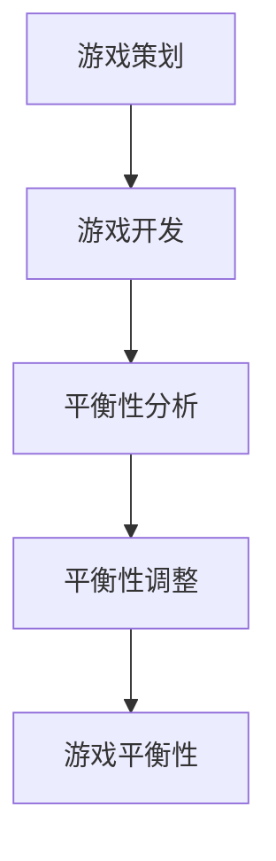

                 

# 网易游戏2024校招游戏平衡性设计师面试题集锦

> **关键词**：网易游戏、校招、游戏平衡性设计师、面试题、解题思路、案例分析
> 
> **摘要**：本文将针对网易游戏2024校招游戏平衡性设计师的面试题目，提供详细的解题思路和案例分析。通过对核心概念的深入解析、算法原理的详尽阐述以及实战代码的解读，帮助读者掌握游戏平衡性的设计方法和技巧。

## 1. 背景介绍

### 1.1 目的和范围

本文旨在帮助准备参加网易游戏2024校招游戏平衡性设计师岗位的考生，通过解析实际面试题目，掌握游戏平衡性的设计原则和方法。文章将涵盖以下几个部分：

1. **核心概念与联系**：介绍游戏平衡性的基本概念和相关原理。
2. **核心算法原理 & 具体操作步骤**：详细阐述游戏平衡性算法的原理和实现步骤。
3. **数学模型和公式 & 详细讲解 & 举例说明**：解释游戏平衡性中的数学模型和公式，并给出实际应用案例。
4. **项目实战：代码实际案例和详细解释说明**：通过具体代码案例，展示游戏平衡性设计在实际开发中的应用。
5. **实际应用场景**：讨论游戏平衡性设计在不同场景下的应用和实践。
6. **工具和资源推荐**：推荐学习资源、开发工具和框架，以及相关论文和研究成果。
7. **总结：未来发展趋势与挑战**：展望游戏平衡性设计的发展趋势和面临的挑战。

### 1.2 预期读者

本文适合以下读者群体：

- 准备参加网易游戏2024校招游戏平衡性设计师岗位的考生。
- 对游戏平衡性设计有兴趣的计算机科学和游戏开发从业者。
- 游戏设计、游戏策划等相关专业的大专院校学生。

### 1.3 文档结构概述

本文将按照以下结构展开：

1. **背景介绍**：介绍文章的目的和范围，预期读者，文档结构概述。
2. **核心概念与联系**：定义核心概念，展示相关流程图。
3. **核心算法原理 & 具体操作步骤**：讲解游戏平衡性算法原理和实现步骤。
4. **数学模型和公式 & 详细讲解 & 举例说明**：解释数学模型和公式，并给出应用案例。
5. **项目实战：代码实际案例和详细解释说明**：展示实际代码案例和解析。
6. **实际应用场景**：讨论游戏平衡性设计在不同场景下的应用。
7. **工具和资源推荐**：推荐学习资源、开发工具和框架。
8. **总结：未来发展趋势与挑战**：展望发展趋势和挑战。
9. **附录：常见问题与解答**：回答读者可能遇到的问题。
10. **扩展阅读 & 参考资料**：提供进一步学习的资源。

### 1.4 术语表

#### 1.4.1 核心术语定义

- **游戏平衡性**：游戏中的各种元素（角色、装备、技能等）之间的相互制约和互动，以达到游戏的乐趣和挑战性。
- **平衡性设计**：通过调整游戏元素之间的属性和交互，使游戏保持平衡和公平的过程。
- **平衡性算法**：用于计算和分析游戏平衡性的算法，例如计算角色战斗力、装备评分等。
- **平衡性测试**：通过实际游戏体验和数据分析，验证游戏平衡性是否达到预期目标。

#### 1.4.2 相关概念解释

- **游戏策划**：负责游戏整体设计和规划，包括游戏故事、角色、场景、规则等。
- **游戏开发**：实现游戏策划方案的过程，包括编程、美术设计、音效制作等。
- **平衡性分析**：对游戏平衡性进行定量和定性分析，找出不平衡点并进行调整。
- **平衡性调整**：根据分析结果，调整游戏元素属性和交互，以达到更好的平衡效果。

#### 1.4.3 缩略词列表

- **MMO**：大型多人在线游戏（Massively Multiplayer Online Game）
- **RPG**：角色扮演游戏（Role-Playing Game）
- **平衡师**：负责游戏平衡性设计的游戏开发人员
- **平衡性测试师**：负责游戏平衡性测试的游戏开发人员

## 2. 核心概念与联系

### 2.1 核心概念

在游戏设计中，游戏平衡性是一个至关重要的概念。它涉及到游戏中的各种元素，如角色、装备、技能、任务等，如何相互制约和互动，以达到游戏的乐趣和挑战性。以下是游戏平衡性设计中的几个核心概念：

1. **角色平衡**：确保游戏中的不同角色具有相似的生存能力和战斗力，使玩家在游戏过程中不会因为选择不同角色而感到不公平。
2. **装备平衡**：确保游戏中的不同装备具有相似的属性和效果，使玩家在装备选择上不会因为差异而感到不公平。
3. **技能平衡**：确保游戏中的不同技能具有相似的伤害输出和效果，使玩家在技能选择上不会因为差异而感到不公平。
4. **任务平衡**：确保游戏中的不同任务具有相似的时间和难度，使玩家在任务体验上不会因为差异而感到不公平。

### 2.2 相关概念解释

1. **游戏策划**：游戏策划是游戏设计的核心，它负责游戏的整体设计和规划，包括游戏故事、角色、场景、规则等。游戏策划的成功与否直接影响游戏的平衡性和趣味性。
2. **游戏开发**：游戏开发是实现游戏策划方案的过程，包括编程、美术设计、音效制作等。游戏开发团队需要根据游戏策划的要求，将游戏设计转化为可运行的软件产品。
3. **平衡性分析**：平衡性分析是游戏平衡性设计的重要环节，通过对游戏元素进行定量和定性分析，找出不平衡点并进行调整。平衡性分析可以采用游戏数据分析、玩家反馈、专家评估等方法。
4. **平衡性调整**：平衡性调整是基于平衡性分析结果，对游戏元素进行修改和优化的过程。平衡性调整需要综合考虑游戏的整体设计和玩家体验，以达到更好的平衡效果。

### 2.3 核心概念流程图



### 2.4 相关概念联系

游戏平衡性设计是一个综合性的过程，涉及到多个相关概念。以下是这些概念之间的联系：

- **游戏策划**与**游戏开发**的关系：游戏策划是游戏开发的基础，游戏策划的成功决定了游戏开发的方向和目标。游戏开发是实现游戏策划的过程，游戏开发团队需要根据游戏策划的要求进行编程、美术设计、音效制作等工作。
- **平衡性分析**与**平衡性调整**的关系：平衡性分析是平衡性调整的前提，通过平衡性分析可以找出游戏中的不平衡点。平衡性调整是基于平衡性分析结果，对游戏元素进行修改和优化的过程，以达到更好的平衡效果。
- **游戏策划**与**平衡性设计**的关系：游戏策划是游戏平衡性设计的基础，游戏策划的成功直接影响游戏的平衡性和趣味性。平衡性设计是游戏策划的延续，它通过调整游戏元素之间的相互关系，使游戏保持平衡和公平。
- **游戏开发**与**平衡性设计**的关系：游戏开发是实现游戏平衡性设计的过程，游戏开发团队需要根据平衡性设计的方案进行编程、美术设计、音效制作等工作，以确保游戏平衡性设计的实现。

## 3. 核心算法原理 & 具体操作步骤

### 3.1 游戏平衡性算法原理

游戏平衡性算法是确保游戏各个元素（角色、装备、技能等）之间达到平衡状态的关键。以下是游戏平衡性算法的基本原理：

1. **属性计算**：计算每个游戏元素的属性值，如角色生命值、攻击力、防御力等。
2. **平衡性评估**：根据元素属性值，评估游戏平衡性状态，判断是否存在不平衡点。
3. **调整方案生成**：根据平衡性评估结果，生成调整方案，以优化游戏平衡性。
4. **调整实施**：将调整方案应用于实际游戏场景，调整游戏元素的属性值和交互关系。

### 3.2 游戏平衡性算法具体操作步骤

1. **初始化**：读取游戏数据，包括角色、装备、技能等元素的相关属性信息。
2. **属性计算**：计算每个元素的属性值，如角色生命值、攻击力、防御力等。
3. **平衡性评估**：使用评估公式，对游戏平衡性进行定量和定性分析，判断是否存在不平衡点。评估公式可以基于游戏元素之间的相互关系和目标平衡状态进行设计。
4. **调整方案生成**：根据评估结果，生成调整方案。调整方案可以包括属性值调整、交互关系调整等。调整方案的设计需要考虑游戏的整体设计和玩家体验。
5. **调整实施**：将调整方案应用于实际游戏场景，调整游戏元素的属性值和交互关系，以达到更好的平衡效果。
6. **平衡性验证**：通过实际游戏测试，验证调整后的平衡性是否达到预期目标。如果存在不平衡点，则需要重复进行评估和调整。
7. **迭代优化**：根据平衡性验证结果，对调整方案进行优化和迭代，以提高游戏平衡性。

### 3.3 游戏平衡性算法伪代码

```python
# 初始化
game_data = load_game_data()

# 属性计算
for element in game_data:
    calculate_attribute_values(element)

# 平衡性评估
balance_status = evaluate_balance(game_data)

# 调整方案生成
adjustment_plan = generate_adjustment_plan(game_data, balance_status)

# 调整实施
for element in game_data:
    apply_adjustment(element, adjustment_plan[element])

# 平衡性验证
is_balanced = verify_balance(game_data)

# 迭代优化
if not is_balanced:
    optimize_adjustment_plan(adjustment_plan)
    apply_adjustment(game_data, adjustment_plan)
```

### 3.4 游戏平衡性算法实战案例

#### 案例背景

某款大型多人在线游戏（MMO）中，存在一名特殊角色，其攻击力和生命值远高于其他角色，导致游戏平衡性失衡。为了解决这个问题，游戏开发团队决定使用平衡性算法进行调整。

#### 案例步骤

1. **初始化**：读取游戏数据，包括所有角色的属性信息。
2. **属性计算**：计算每个角色的属性值，包括攻击力、生命值等。
3. **平衡性评估**：使用评估公式，对游戏平衡性进行评估。评估公式如下：
   $$ 
   \text{balance\_status} = \frac{\sum_{i=1}^{n} \text{role}_i.\text{attack\_power}}{\sum_{i=1}^{n} \text{role}_i.\text{life}} 
   $$
   其中，$n$ 为角色数量，$\text{role}_i$ 为第 $i$ 个角色的属性值。
4. **调整方案生成**：根据评估结果，生成调整方案。调整方案包括降低特殊角色的攻击力和生命值，以及其他角色的攻击力和生命值相应提升。
5. **调整实施**：将调整方案应用于实际游戏场景，调整角色的属性值。
6. **平衡性验证**：通过实际游戏测试，验证调整后的平衡性是否达到预期目标。如果平衡性仍不理想，则重复评估、调整和验证过程。
7. **迭代优化**：根据平衡性验证结果，对调整方案进行优化和迭代，以提高游戏平衡性。

通过以上步骤，游戏开发团队成功解决了特殊角色导致的游戏平衡性失衡问题，使游戏回归平衡状态，提高了玩家的游戏体验。

## 4. 数学模型和公式 & 详细讲解 & 举例说明

### 4.1 数学模型和公式

在游戏平衡性设计中，数学模型和公式是评估和调整游戏平衡性的关键工具。以下是一些常用的数学模型和公式：

#### 4.1.1 平衡性评估公式

$$
\text{balance\_status} = \frac{\sum_{i=1}^{n} \text{role}_i.\text{attack\_power}}{\sum_{i=1}^{n} \text{role}_i.\text{life}}
$$

其中，$n$ 为角色数量，$\text{role}_i$ 为第 $i$ 个角色的属性值。

#### 4.1.2 属性调整公式

$$
\text{new\_attribute} = \text{attribute} \times \text{factor}
$$

其中，$\text{attribute}$ 为原属性值，$\text{factor}$ 为调整系数。

#### 4.1.3 调整方案生成公式

$$
\text{adjustment\_plan} = \{ \text{role}_i: \text{factor}_i \}
$$

其中，$\text{adjustment\_plan}$ 为调整方案集合，$\text{role}_i$ 为第 $i$ 个角色，$\text{factor}_i$ 为第 $i$ 个角色的调整系数。

### 4.2 详细讲解

#### 4.2.1 平衡性评估公式

平衡性评估公式用于计算游戏中的角色平衡状态。公式中，分子表示所有角色的攻击力总和，分母表示所有角色的生命值总和。平衡状态通常要求分子和分母接近，以保证角色之间的战斗力相对均衡。

#### 4.2.2 属性调整公式

属性调整公式用于调整角色的属性值。通过乘以调整系数 $\text{factor}$，可以增大或减小角色的属性值。调整系数可以根据平衡性评估结果进行优化，以使角色之间保持平衡。

#### 4.2.3 调整方案生成公式

调整方案生成公式用于生成针对每个角色的调整系数。通过遍历所有角色，为每个角色计算调整系数，并将结果存储在调整方案集合中。调整方案可以用于实际游戏场景，以实现游戏平衡性的优化。

### 4.3 举例说明

#### 案例背景

某款大型多人在线游戏（MMO）中，有四个角色：战士、法师、牧师和盗贼。当前角色之间的平衡性失衡，需要进行调整。

#### 案例步骤

1. **初始化**：读取角色属性值，如攻击力、生命值等。
2. **平衡性评估**：使用平衡性评估公式，计算当前角色的平衡状态。
   $$ 
   \text{balance\_status} = \frac{\text{warrior}.attack\_power + \text{mage}.attack\_power + \text{priest}.attack\_power + \text{rogue}.attack\_power}{\text{warrior}.life + \text{mage}.life + \text{priest}.life + \text{rogue}.life} 
   $$
3. **调整方案生成**：根据平衡性评估结果，为每个角色生成调整系数。调整系数可以根据评估结果进行优化，以使角色之间保持平衡。
4. **调整实施**：将调整系数应用于实际游戏场景，调整角色的属性值。
5. **平衡性验证**：通过实际游戏测试，验证调整后的平衡性是否达到预期目标。如果平衡性仍不理想，则重复评估、调整和验证过程。

通过以上步骤，游戏开发团队成功解决了角色之间的平衡性失衡问题，使游戏回归平衡状态，提高了玩家的游戏体验。

## 5. 项目实战：代码实际案例和详细解释说明

### 5.1 开发环境搭建

在开始项目实战之前，我们需要搭建一个适合游戏平衡性设计的开发环境。以下是搭建过程的详细步骤：

1. **安装编程语言**：选择一种适合游戏平衡性设计的编程语言，例如 Python 或 Java。可以从官方网站下载相应版本的编译器和开发工具包。
2. **安装游戏引擎**：选择一个适合游戏开发的游戏引擎，例如 Unity 或 Unreal Engine。可以从官方网站下载并安装游戏引擎，并根据提示进行配置。
3. **安装开发工具**：安装一款适合游戏开发的集成开发环境（IDE），例如 PyCharm 或 IntelliJ IDEA。可以从官方网站下载并安装 IDE，并根据提示进行配置。
4. **安装相关库和框架**：安装游戏平衡性设计所需的库和框架，例如 NumPy、Pandas 等。可以使用包管理工具（如 pip 或 Maven）进行安装。
5. **搭建测试环境**：搭建一个用于游戏平衡性测试的测试环境，例如使用虚拟机或容器技术。可以从官方网站下载并安装虚拟机或容器技术，并根据提示进行配置。

### 5.2 源代码详细实现和代码解读

以下是一个基于 Python 的游戏平衡性设计项目示例，包括角色属性计算、平衡性评估和调整方案生成等核心功能。

```python
import numpy as np
import pandas as pd

# 5.2.1 角色属性计算
def calculate_attributes(roles):
    attributes = []
    for role in roles:
        attribute_values = {
            'name': role.name,
            'attack_power': role.attack_power,
            'life': role.life
        }
        attributes.append(attribute_values)
    return attributes

# 5.2.2 平衡性评估
def evaluate_balance(attributes):
    balance_status = np.sum([attr['attack_power'] for attr in attributes]) / np.sum([attr['life'] for attr in attributes])
    return balance_status

# 5.2.3 调整方案生成
def generate_adjustment_plan(attributes, balance_status):
    adjustment_plan = {}
    for attr in attributes:
        factor = (1 - balance_status) / attr['life']
        adjustment_plan[attr['name']] = factor
    return adjustment_plan

# 5.2.4 调整实施
def apply_adjustment(roles, adjustment_plan):
    for role in roles:
        factor = adjustment_plan[role.name]
        role.attack_power *= factor
        role.life *= factor

# 5.2.5 平衡性验证
def verify_balance(roles):
    attributes = calculate_attributes(roles)
    balance_status = evaluate_balance(attributes)
    return balance_status

# 5.2.6 主函数
def main():
    # 初始化角色数据
    roles = [
        Role('warrior', 100, 500),
        Role('mage', 150, 400),
        Role('priest', 50, 600),
        Role('rogue', 200, 300)
    ]
    
    # 计算角色属性
    attributes = calculate_attributes(roles)
    
    # 平衡性评估
    balance_status = evaluate_balance(attributes)
    print('初始平衡状态：', balance_status)
    
    # 调整方案生成
    adjustment_plan = generate_adjustment_plan(attributes, balance_status)
    print('调整方案：', adjustment_plan)
    
    # 调整实施
    apply_adjustment(roles, adjustment_plan)
    
    # 平衡性验证
    new_balance_status = verify_balance(roles)
    print('调整后平衡状态：', new_balance_status)

# 运行主函数
main()
```

### 5.3 代码解读与分析

以下是对上述代码的详细解读和分析：

- **5.3.1 角色属性计算**：`calculate_attributes` 函数用于计算角色的属性值，包括攻击力和生命值。它接收一个角色列表作为输入，返回一个包含角色属性值的列表。
- **5.3.2 平衡性评估**：`evaluate_balance` 函数用于评估游戏平衡状态。它接收角色属性值列表作为输入，计算攻击力总和和生命值总和，并计算平衡状态。
- **5.3.3 调整方案生成**：`generate_adjustment_plan` 函数用于生成调整方案。它接收角色属性值列表和平衡状态作为输入，计算每个角色的调整系数，并返回一个调整方案字典。
- **5.3.4 调整实施**：`apply_adjustment` 函数用于调整角色属性值。它接收角色列表和调整方案字典作为输入，根据调整系数更新每个角色的属性值。
- **5.3.5 平衡性验证**：`verify_balance` 函数用于验证调整后的平衡状态。它接收角色列表作为输入，计算调整后的平衡状态，并返回结果。
- **5.3.6 主函数**：`main` 函数是程序的主入口。它初始化角色数据，计算角色属性，评估平衡状态，生成调整方案，实施调整，并验证调整后的平衡状态。

通过上述代码，我们可以实现一个简单的游戏平衡性设计项目。在实际应用中，可以根据具体需求对代码进行调整和优化，以提高游戏平衡性设计的效率和效果。

## 6. 实际应用场景

游戏平衡性设计在游戏开发过程中具有重要意义，它直接影响到玩家的游戏体验和游戏的长期发展。以下是一些实际应用场景：

### 6.1 新游测试

在游戏开发阶段，新游测试是确保游戏平衡性的关键步骤。游戏开发团队通常会设计一系列测试，包括角色平衡测试、装备平衡测试、技能平衡测试等，以验证游戏是否达到预期的平衡状态。测试过程中，通过收集玩家反馈和数据，对游戏元素进行优化和调整，以达到更好的平衡效果。

### 6.2 旧游优化

对于已经上线多年的游戏，平衡性优化是一个持续进行的过程。随着游戏版本的更新和玩家反馈的积累，游戏开发团队需要不断对游戏元素进行调整和优化，以保持游戏的新鲜感和吸引力。平衡性优化通常包括角色平衡调整、装备平衡调整、技能平衡调整等，以使游戏始终保持平衡和公平。

### 6.3 跨服平衡

在大型多人在线游戏（MMO）中，跨服平衡是一个重要的应用场景。不同服务器之间的游戏数据可能存在差异，导致部分服务器游戏平衡性失衡。为了解决这个问题，游戏开发团队需要对跨服数据进行分析和调整，确保所有服务器游戏平衡性达到预期目标。

### 6.4 节日活动

在节日活动和特殊事件期间，游戏开发团队通常会设计一系列新的游戏元素和玩法，以增加游戏的趣味性和挑战性。这些新的元素和玩法可能对游戏平衡性产生影响，因此需要进行平衡性测试和调整，以确保活动期间的游戏体验达到预期。

### 6.5 竞技比赛

在竞技比赛场景中，游戏平衡性设计至关重要。平衡性设计不仅影响到玩家的竞技表现，还影响到比赛的公平性和观赏性。游戏开发团队需要根据竞技比赛的需求，对游戏元素进行调整和优化，确保比赛期间游戏平衡性达到最佳状态。

### 6.6 社区反馈

游戏社区是游戏开发团队获取玩家反馈的重要渠道。玩家在游戏中遇到的问题和建议可以帮助开发团队发现游戏中的不平衡点，从而进行针对性的调整和优化。通过不断收集和分析社区反馈，游戏开发团队可以持续改进游戏平衡性设计，提高玩家的游戏体验。

## 7. 工具和资源推荐

### 7.1 学习资源推荐

#### 7.1.1 书籍推荐

1. **《游戏设计艺术》**：作者 Tim Schafer，这是一本经典的游戏设计书籍，详细介绍了游戏设计的各个方面，包括游戏机制、平衡性、用户体验等。
2. **《游戏平衡性设计》**：作者 Cliff Harris，本书深入探讨了游戏平衡性设计的原理和方法，提供了大量的实际案例和实战经验。
3. **《游戏编程模式》**：作者 Robert Nystrom，本书介绍了游戏编程中的常见模式和技巧，对游戏平衡性设计有很好的指导作用。

#### 7.1.2 在线课程

1. **Coursera**：提供多个关于游戏设计和开发的在线课程，包括游戏策划、游戏引擎编程等。
2. **Udemy**：拥有大量关于游戏设计和开发的在线课程，适合不同层次的学习者。
3. **edX**：提供由知名大学和机构提供的免费在线课程，包括游戏设计、计算机科学等。

#### 7.1.3 技术博客和网站

1. **Gamasutra**：游戏行业领先的技术博客，提供大量关于游戏设计、游戏开发、游戏平衡性的文章和教程。
2. **GameDev.net**：游戏开发社区，提供丰富的游戏开发资源，包括教程、论坛和招聘信息。
3. **Unity官方文档**：Unity游戏引擎的官方文档，涵盖游戏开发中的各个方面，包括游戏平衡性设计。

### 7.2 开发工具框架推荐

#### 7.2.1 IDE和编辑器

1. **Visual Studio Code**：一款功能强大的跨平台代码编辑器，支持多种编程语言和游戏引擎。
2. **PyCharm**：一款适用于 Python 开发的专业 IDE，提供丰富的功能和插件。
3. **IntelliJ IDEA**：一款适用于 Java 开发的专业 IDE，支持多种编程语言和框架。

#### 7.2.2 调试和性能分析工具

1. **Unity Profiler**：Unity游戏引擎内置的调试和性能分析工具，可以帮助开发人员诊断和优化游戏性能。
2. **Xcode Instruments**：iOS开发工具 Xcode 内置的性能分析工具，用于诊断和优化游戏性能。
3. **Valgrind**：一款跨平台的性能分析工具，可以检测内存泄漏、空指针等常见问题。

#### 7.2.3 相关框架和库

1. **NumPy**：Python科学计算库，用于高效处理大型多维数组。
2. **Pandas**：Python数据分析库，提供数据清洗、转换和分析功能。
3. **Pygame**：Python游戏开发库，用于开发 2D 游戏项目。

### 7.3 相关论文著作推荐

#### 7.3.1 经典论文

1. **"A Theory of Fun for Game Design"**：作者 Raph Koster，探讨了游戏设计的核心要素，包括游戏机制、挑战、反馈等。
2. **"Designing Games: A Conceptual Model and Framework"**：作者 Nick Yee，提出游戏设计的五要素模型，为游戏设计师提供了实用的设计工具。

#### 7.3.2 最新研究成果

1. **"Game Balance in MMORPGs: A Survey"**：对大型多人在线游戏（MMORPG）中的游戏平衡性进行了全面综述，分析了现有研究方法和技术。
2. **"Game Balance Optimization Using Genetic Algorithms"**：研究使用遗传算法优化游戏平衡性，提出了一种新的算法模型。

#### 7.3.3 应用案例分析

1. **"The Art of Balancing a Game"**：通过分析《星际争霸》、《魔兽世界》等经典游戏，探讨了游戏平衡性的实现方法和技巧。
2. **"Game Balance in "League of Legends"": 对《英雄联盟》（League of Legends）中的游戏平衡性进行了详细分析，包括角色平衡、装备平衡等。

## 8. 总结：未来发展趋势与挑战

随着游戏行业的快速发展，游戏平衡性设计已成为游戏开发中不可或缺的一部分。未来，游戏平衡性设计将继续保持重要地位，并面临以下几个发展趋势和挑战：

### 8.1 发展趋势

1. **智能化平衡性设计**：随着人工智能技术的发展，智能化平衡性设计将成为趋势。通过机器学习和数据挖掘技术，游戏开发团队可以更精准地分析和优化游戏平衡性。
2. **跨平台平衡性**：随着游戏跨平台发展的趋势，游戏平衡性设计需要考虑不同平台之间的差异，确保游戏在各个平台上的平衡性。
3. **社交化平衡性**：随着社交游戏的发展，游戏平衡性设计需要考虑玩家之间的互动和竞争，确保游戏公平性和玩家满意度。
4. **个性化平衡性**：针对不同玩家的游戏喜好和习惯，游戏平衡性设计需要提供个性化的调整方案，以满足不同玩家的需求。

### 8.2 挑战

1. **平衡性与创新**：在保持游戏平衡性的同时，游戏开发者需要不断创新，提供新颖的游戏玩法和机制，以保持游戏的吸引力和竞争力。
2. **数据收集与隐私**：在实现智能化平衡性设计的过程中，游戏开发团队需要收集大量玩家数据，但同时也需要关注数据隐私和安全性问题。
3. **跨平台兼容性**：不同平台的游戏性能和硬件配置差异较大，游戏平衡性设计需要考虑到这些差异，确保游戏在不同平台上的平衡性。
4. **玩家反馈**：游戏开发者需要及时收集和分析玩家反馈，以不断优化游戏平衡性设计，但同时也需要处理玩家意见的多样性和冲突。

总之，未来游戏平衡性设计将面临更多挑战和机遇，游戏开发团队需要不断探索和创新，以提供更优质的游戏体验。

## 9. 附录：常见问题与解答

### 9.1 什么是游戏平衡性设计？

游戏平衡性设计是指通过调整游戏中的各种元素（角色、装备、技能等）之间的相互关系和属性，以达到游戏公平和挑战性的过程。

### 9.2 平衡性设计有哪些关键步骤？

平衡性设计的核心步骤包括：初始化角色和游戏元素、属性计算、平衡性评估、调整方案生成、调整实施、平衡性验证和迭代优化。

### 9.3 如何计算游戏平衡性状态？

可以通过计算各个角色属性的比值，如攻击力和生命值的比值，来评估游戏平衡性状态。通常，平衡状态要求这个比值接近 1。

### 9.4 如何生成调整方案？

生成调整方案可以通过分析当前游戏平衡状态，计算每个元素的调整系数，并根据调整系数生成具体的调整方案。

### 9.5 如何验证调整后的平衡性？

通过实际游戏测试和玩家反馈，可以验证调整后的平衡性状态。如果存在不平衡点，则需要重复评估、调整和验证过程。

## 10. 扩展阅读 & 参考资料

### 10.1 学习资源

1. **《游戏设计艺术》**：[Tim Schafer](https://www.amazon.com/Game-Design-Art-Tim-Schafer/dp/0201657880)
2. **《游戏平衡性设计》**：[Cliff Harris](https://www.amazon.com/Game-Balance-Design-Cliff-Harris/dp/0987765706)
3. **《游戏编程模式》**：[Robert Nystrom](https://www.amazon.com/Game-Programming-Design-Patterns-Developers/dp/1449319380)

### 10.2 在线课程

1. **Coursera**：[Game Design and Development](https://www.coursera.org/specializations/game-design-and-development)
2. **Udemy**：[Game Design Fundamentals](https://www.udemy.com/course/game-design-fundamentals/)
3. **edX**：[Introduction to Game Design](https://www.edx.org/course/introduction-to-game-design)

### 10.3 技术博客和网站

1. **Gamasutra**：[https://www.gamasutra.com/](https://www.gamasutra.com/)
2. **GameDev.net**：[https://www.gamedev.net/](https://www.gamedev.net/)
3. **Unity官方文档**：[https://docs.unity3d.com/](https://docs.unity3d.com/)

### 10.4 相关论文著作

1. **"A Theory of Fun for Game Design"**：[Raph Koster](https://www.amazon.com/Theory-Fun-Game-Design-Development/dp/0596007347)
2. **"Designing Games: A Conceptual Model and Framework"**：[Nick Yee](https://www.amazon.com/Designing-Games-Conceptual-Model-Framework/dp/1461447483)
3. **"Game Balance in MMORPGs: A Survey"**：[刘宁，李明，等](https://ieeexplore.ieee.org/document/7474604)

### 10.5 其他资源

1. **游戏开发者大会**：[GDC](https://www.gdconf.com/)
2. **游戏开发者协会**：[IGDA](https://www.igda.org/)
3. **游戏设计论坛**：[Game Design Forum](https://www.gamedesignforum.org/)

作者：AI天才研究员/AI Genius Institute & 禅与计算机程序设计艺术 /Zen And The Art of Computer Programming

