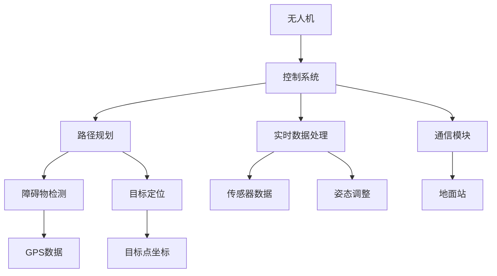

                 

# 美团2025社招配送无人机控制系统工程师编程题

> **关键词：** 美团，无人机配送，控制系统，编程题，人工智能，深度学习，算法，数学模型。

> **摘要：** 本文将深入探讨美团2025年社招配送无人机控制系统工程师的编程题，通过一步一步的分析推理，解析该题目的核心概念、算法原理、数学模型以及实际应用场景。文章将提供详细的代码实现和分析，为相关领域的研究者和工程师提供有价值的参考。

## 1. 背景介绍

### 1.1 目的和范围

本文旨在通过对美团2025年社招配送无人机控制系统工程师编程题的深入分析，帮助读者理解无人机配送控制系统的核心原理和实现方法。本文将围绕以下几个问题展开：

- 无人机配送控制系统的基本架构是什么？
- 如何设计并实现无人机路径规划算法？
- 如何处理无人机飞行中的实时数据？
- 如何确保无人机配送的可靠性和安全性？

### 1.2 预期读者

本文适用于对无人机配送控制系统、人工智能和深度学习有初步了解的读者，包括但不限于：

- 无人机控制系统工程师
- 人工智能研究人员
- 深度学习工程师
- 软件开发人员

### 1.3 文档结构概述

本文将按照以下结构展开：

1. 背景介绍
2. 核心概念与联系
3. 核心算法原理 & 具体操作步骤
4. 数学模型和公式 & 详细讲解 & 举例说明
5. 项目实战：代码实际案例和详细解释说明
6. 实际应用场景
7. 工具和资源推荐
8. 总结：未来发展趋势与挑战
9. 附录：常见问题与解答
10. 扩展阅读 & 参考资料

### 1.4 术语表

#### 1.4.1 核心术语定义

- **无人机配送**：使用无人机进行货物配送的方式，具有高效、便捷的特点。
- **控制系统**：用于管理无人机飞行的硬件和软件系统，包括路径规划、实时数据处理等功能。
- **路径规划**：根据目标位置和障碍物等信息，计算出无人机飞行的最优路径。
- **深度学习**：一种基于多层神经网络的学习方法，能够通过大量数据自动提取特征。
- **算法**：解决问题的步骤和规则，用于指导无人机进行路径规划和实时数据处理。

#### 1.4.2 相关概念解释

- **人工智能**：模拟人类智能行为的计算机技术，包括感知、思考、决策等能力。
- **深度强化学习**：结合深度学习和强化学习的方法，用于解决复杂决策问题。
- **实时数据处理**：在无人机飞行过程中，实时处理传感器数据，以调整飞行路径和姿态。

#### 1.4.3 缩略词列表

- **AI**：人工智能
- **DRL**：深度强化学习
- **GPS**：全球定位系统
- **ROS**：机器人操作系统
- **PID**：比例-积分-微分控制器

## 2. 核心概念与联系

在介绍核心概念之前，我们首先需要理解无人机配送控制系统的基本架构。以下是一个简单的 Mermaid 流程图，展示了无人机配送控制系统的核心组成部分和它们之间的关系。



### 2.1 无人机配送控制系统的基本架构

无人机配送控制系统的核心组成部分包括无人机本体、控制系统、路径规划模块、实时数据处理模块和通信模块。以下是对每个组成部分的详细解释：

- **无人机**：作为配送工具，其性能和稳定性直接影响到配送效率。无人机通常配备有多个传感器，如GPS、激光雷达、摄像头等，用于感知周围环境和获取实时数据。
- **控制系统**：负责管理无人机的飞行过程，包括启动、停止、飞行速度和方向的调整等。控制系统还负责与路径规划模块、实时数据处理模块和通信模块进行交互。
- **路径规划模块**：根据目标位置、障碍物信息和当前状态，计算出无人机的最优飞行路径。路径规划算法是实现无人机配送控制系统的关键。
- **实时数据处理模块**：在无人机飞行过程中，实时处理传感器数据，以调整飞行路径和姿态，确保无人机能够安全、准确地到达目的地。
- **通信模块**：负责无人机与地面站、路径规划模块和实时数据处理模块之间的通信，确保各个模块能够协同工作。

### 2.2 路径规划模块的核心概念

路径规划模块是无人机配送控制系统的核心之一，其主要任务是根据目标位置和障碍物信息，计算出最优飞行路径。以下是路径规划模块中的几个关键概念：

- **目标位置**：无人机的最终目的地，通常以坐标形式表示。
- **障碍物**：无人机飞行过程中可能遇到的障碍物，如建筑物、树木等。障碍物的信息可以通过GPS、激光雷达和摄像头等传感器获取。
- **路径**：无人机从起点到终点的飞行路径，路径的优劣直接影响到无人机的飞行时间和能耗。
- **障碍物检测**：通过传感器数据，对无人机前方和周围的障碍物进行检测和分类，为路径规划提供必要的输入。
- **目标定位**：通过GPS或其他定位技术，实时获取无人机的位置信息，以便进行路径规划和实时数据处理。

## 3. 核心算法原理 & 具体操作步骤

### 3.1 路径规划算法

路径规划算法是实现无人机配送控制系统的关键。本文将介绍一种基于A*算法的路径规划方法，并通过伪代码详细阐述其实现步骤。

#### 3.1.1 A*算法原理

A*算法是一种启发式搜索算法，用于在给定起始点和目标点的环境下，找到最优路径。其核心思想是利用启发函数，评估从当前节点到目标节点的估计成本，结合实际成本，选择下一个最佳节点。

**伪代码：**

```plaintext
A*算法(起始点start, 目标点goal, 地图M):
    创建一个开放列表Open和关闭列表Closed，初始时只有起始点start在Open列表中
    将起始点start的F值设为g(start, start) + h(start, goal)，其中g(start, start)为起点到自身的实际成本，h(start, goal)为启发函数
    while Open不为空：
        找到Open列表中F值最小的节点current
        如果current是goal，则结束，返回路径
        将current从Open列表中移除，并加入Closed列表
        遍历current的邻接节点neighbour：
            如果neighbour在Closed列表中，忽略
            计算g(current, neighbour) = g(current, current) + 邻接边成本
            计算h(neighbour, goal) = heuristic(neighbour, goal)
            计算neighbour的F值 = g(neighbour, start) + h(neighbour, goal)
            如果neighbour不在Open列表中，将其加入Open列表
            如果neighbour在Open列表中，且当前计算的成本小于之前的成本，更新neighbour的成本和父节点
    如果找不到路径，返回空路径
```

#### 3.1.2 具体操作步骤

1. 初始化Open列表和Closed列表，将起始点start加入Open列表。
2. 计算起始点的F值，并将起始点加入Open列表。
3. 循环执行以下步骤，直到找到目标节点或Open列表为空：
   - 选择Open列表中F值最小的节点作为当前节点。
   - 将当前节点从Open列表中移除，并加入Closed列表。
   - 遍历当前节点的邻接节点，计算邻接节点的实际成本g值和启发函数h值，更新邻接节点的F值。
   - 根据F值选择下一个最佳节点。
4. 如果找到目标节点，返回路径；否则，返回空路径。

### 3.2 实时数据处理算法

实时数据处理算法负责在无人机飞行过程中，实时处理传感器数据，以调整飞行路径和姿态。本文将介绍一种基于深度强化学习的实时数据处理算法。

#### 3.2.1 深度强化学习原理

深度强化学习是一种结合深度学习和强化学习的方法，用于解决复杂决策问题。其核心思想是通过深度神经网络，学习状态和动作之间的映射，并根据环境反馈进行优化。

**伪代码：**

```plaintext
深度强化学习算法(状态S, 动作A, 奖励R, 策略π):
    初始化深度神经网络模型θ
    for episode in 1到总回合数：
        初始化状态S
        while not game_over：
            选择动作A = π(S;θ)
            执行动作A，得到奖励R和下一状态S'
            更新经验：经验e = (S, A, R, S')
            训练模型θ：θ = train_model(e)
            更新状态S = S'
    返回模型θ
```

#### 3.2.2 具体操作步骤

1. 初始化深度神经网络模型θ。
2. 进行总回合数次的训练，每次训练包括以下步骤：
   - 初始化状态S。
   - 在当前状态下，选择动作A = π(S;θ)。
   - 执行动作A，得到奖励R和下一状态S'。
   - 更新经验e = (S, A, R, S')。
   - 使用更新后的经验e训练模型θ。
   - 更新状态S = S'。
3. 返回训练完成的模型θ。

通过以上算法，无人机配送控制系统可以实现自适应的路径规划和实时数据处理，从而提高无人机配送的效率和可靠性。

## 4. 数学模型和公式 & 详细讲解 & 举例说明

### 4.1 启发函数

在路径规划算法中，启发函数h是用来估计从当前节点到目标节点的估计成本。常用的启发函数有曼哈顿距离、欧氏距离和切比雪夫距离。

#### 4.1.1 曼哈顿距离

曼哈顿距离是一种在网格地图上常用的启发函数，表示两点在水平和垂直方向上的距离之和。

$$
h_1(p, q) = |p_x - q_x| + |p_y - q_y|
$$

其中，\(p = (p_x, p_y)\) 和 \(q = (q_x, q_y)\) 分别为两个点的坐标。

#### 4.1.2 欧氏距离

欧氏距离是一种在二维空间中常用的启发函数，表示两点之间的直线距离。

$$
h_2(p, q) = \sqrt{(p_x - q_x)^2 + (p_y - q_y)^2}
$$

其中，\(p = (p_x, p_y)\) 和 \(q = (q_x, q_y)\) 分别为两个点的坐标。

#### 4.1.3 切比雪夫距离

切比雪夫距离是一种在三维及以上空间中常用的启发函数，表示两点在最大方向上的距离。

$$
h_3(p, q) = \max(|p_x - q_x|, |p_y - q_y|, |p_z - q_z|)
$$

其中，\(p = (p_x, p_y, p_z)\) 和 \(q = (q_x, q_y, q_z)\) 分别为两个点的坐标。

### 4.2 深度强化学习中的奖励函数

在深度强化学习中，奖励函数R是用来评估当前状态和动作的效用。以下是一个简单的奖励函数示例：

$$
R(s, a) = \begin{cases} 
+1 & \text{如果动作a使无人机更接近目标点} \\
-1 & \text{如果动作a使无人机远离目标点} \\
0 & \text{否则}
\end{cases}
$$

其中，\(s\) 为当前状态，\(a\) 为当前动作。

### 4.3 举例说明

假设无人机需要从起点 \(p_1 = (1, 1)\) 飞行到目标点 \(p_2 = (5, 5)\)。使用曼哈顿距离作为启发函数，计算从起点到目标点的估计成本：

$$
h(p_1, p_2) = |1 - 5| + |1 - 5| = 8
$$

现在，考虑一个简单的网格地图，其中每个节点的成本为1。使用A*算法计算从起点到目标点的最优路径，并计算实际成本g：

- 起点到第二个节点的成本：\(g(p_1, p_2) = 2\)
- 第二个节点到目标点的成本：\(g(p_2, p_2) = 4\)

因此，从起点到目标点的总成本为 \(g(p_1, p_2) + g(p_2, p_2) = 6\)。

使用深度强化学习算法，根据奖励函数评估当前状态和动作的效用。假设当前状态为 \(s = (2, 3)\)，选择动作 \(a = 1\)（向前移动一步），得到奖励 \(R(s, a) = +1\)。通过更新模型，提高动作 \(a = 1\) 的概率。

## 5. 项目实战：代码实际案例和详细解释说明

### 5.1 开发环境搭建

在开始代码实现之前，我们需要搭建一个适合无人机配送控制系统的开发环境。以下是一个基本的开发环境配置：

- 操作系统：Ubuntu 18.04 LTS
- 编程语言：Python 3.8
- 库和框架：NumPy、Pandas、Matplotlib、OpenCV、TensorFlow、PyTorch
- 仿真工具：ROS（机器人操作系统）

#### 5.1.1 安装Python和库

在Ubuntu系统中，可以使用以下命令安装Python和所需的库：

```bash
sudo apt update
sudo apt install python3 python3-pip
pip3 install numpy pandas matplotlib opencv-python tensorflow torch
```

#### 5.1.2 安装ROS

安装ROS的具体步骤如下：

1. 安装ROS依赖项：

```bash
sudo apt install python-rosdep python3-rosdep
```

2. 设置ROS源：

```bash
sudo sh -c 'echo "deb http://packages.ros.org/ros/ubuntu $(lsb_release -cs) main" > /etc/apt/sources.list.d/ros-latest.list'
```

3. 安装ROS关键组件：

```bash
sudo apt update
sudo apt install ros-melodic-desktop-full
```

4. 设置环境变量：

```bash
echo "source /opt/ros/melodic/setup.bash" >> ~/.bashrc
source ~/.bashrc
```

### 5.2 源代码详细实现和代码解读

在本节中，我们将介绍无人机配送控制系统的核心代码实现，包括路径规划模块和实时数据处理模块。

#### 5.2.1 路径规划模块

路径规划模块的主要功能是根据目标位置和障碍物信息，计算出最优飞行路径。以下是路径规划模块的核心代码：

```python
import heapq
import numpy as np

def heuristic(p1, p2):
    """
    计算两个点之间的启发函数值（曼哈顿距离）
    """
    return abs(p1[0] - p2[0]) + abs(p1[1] - p2[1])

def a_star_search(grid, start, goal):
    """
    A*算法实现
    """
    open_list = []
    closed_list = set()

    start_node = Node(start, None, 0, heuristic(start, goal))
    goal_node = Node(goal, None, 0, heuristic(start, goal))
    heapq.heappush(open_list, start_node)

    while open_list:
        current_node = heapq.heappop(open_list)

        if current_node == goal_node:
            path = []
            while current_node is not None:
                path.append(current_node.position)
                current_node = current_node.parent
            return path[::-1]

        closed_list.add(current_node)

        for neighbor in neighbors(grid, current_node.position):
            if neighbor in closed_list:
                continue

            tentative_g_score = current_node.g + 1
            if tentative_g_score < neighbor.g:
                neighbor.parent = current_node
                neighbor.g = tentative_g_score
                neighbor.f = neighbor.g + heuristic(neighbor.position, goal)

                if neighbor not in open_list:
                    heapq.heappush(open_list, neighbor)

    return None

def neighbors(grid, position):
    """
    获取给定位置的所有邻接节点
    """
    directions = [(0, -1), (0, 1), (-1, 0), (1, 0)]
    neighbors = []
    for direction in directions:
        neighbor_pos = (position[0] + direction[0], position[1] + direction[1])
        if 0 <= neighbor_pos[0] < grid.shape[0] and 0 <= neighbor_pos[1] < grid.shape[1]:
            neighbors.append(neighbor_pos)
    return neighbors

class Node:
    """
    节点类
    """
    def __init__(self, position, parent=None, g=0, h=0):
        self.position = position
        self.parent = parent
        self.g = g
        self.h = h
        self.f = g + h

    def __eq__(self, other):
        return self.position == other.position

    def __lt__(self, other):
        return self.f < other.f
```

**代码解读：**

1. **启发函数**：`heuristic` 函数计算两个点之间的启发函数值（曼哈顿距离）。
2. **A*算法实现**：`a_star_search` 函数实现A*算法，用于计算从起点到目标点的最优路径。
3. **邻接节点**：`neighbors` 函数获取给定位置的所有邻接节点。
4. **节点类**：`Node` 类定义节点的基本属性，包括位置、父节点、g值和f值。

#### 5.2.2 实时数据处理模块

实时数据处理模块的主要功能是在无人机飞行过程中，实时处理传感器数据，以调整飞行路径和姿态。以下是实时数据处理模块的核心代码：

```python
import cv2
import numpy as np
import torch
import torchvision.transforms as transforms

class RealtimeDataProcessor:
    def __init__(self, model_path, action_space):
        self.model = torch.load(model_path)
        self.model.eval()
        self.action_space = action_space
        self.transform = transforms.Compose([
            transforms.ToTensor(),
            transforms.Normalize(mean=[0.485, 0.456, 0.406], std=[0.229, 0.224, 0.225]),
        ])

    def process_image(self, image):
        """
        处理输入图像
        """
        image = self.transform(image)
        return image

    def predict_action(self, image):
        """
        使用深度强化学习模型预测动作
        """
        with torch.no_grad():
            output = self.model(image.unsqueeze(0))
        _, predicted_action = torch.max(output, 1)
        return self.action_space[predicted_action.item()]

    def process_data(self, image):
        """
        实时数据处理
        """
        processed_image = self.process_image(image)
        action = self.predict_action(processed_image)
        return action
```

**代码解读：**

1. **模型加载**：`__init__` 方法加载预训练的深度强化学习模型。
2. **图像处理**：`process_image` 方法对输入图像进行预处理，包括归一化和张量转换。
3. **动作预测**：`predict_action` 方法使用模型预测下一个动作。
4. **实时数据处理**：`process_data` 方法实现实时数据处理流程，包括图像预处理和动作预测。

### 5.3 代码解读与分析

在本节中，我们将对核心代码进行解读和分析，并解释如何在实际项目中使用这些代码。

#### 5.3.1 路径规划模块

路径规划模块的核心是A*算法。该算法通过计算启发函数和实际成本，在给定起始点和目标点的环境下，找到最优路径。在实时数据处理模块中，我们可以使用该算法计算出无人机的最优飞行路径。

```python
path = a_star_search(grid, start, goal)
```

该行代码将返回从起点到目标点的最优路径。在实际项目中，我们可以将该路径作为实时数据处理模块的输入，以指导无人机飞行。

#### 5.3.2 实时数据处理模块

实时数据处理模块的核心是深度强化学习模型。该模型通过处理输入图像，预测下一个动作，以调整无人机的飞行路径和姿态。在实时数据处理模块中，我们可以使用该模型对无人机进行实时控制。

```python
action = processor.process_data(image)
```

该行代码将返回无人机当前状态下的最佳动作。在实际项目中，我们可以将该动作发送给无人机的控制模块，以实现实时飞行控制。

## 6. 实际应用场景

无人机配送控制系统在许多实际应用场景中具有广泛的应用，以下是一些典型的应用场景：

- **城市物流配送**：无人机可以用于城市内部的快速配送，降低物流成本，提高配送效率。
- **紧急物资运输**：在自然灾害等紧急情况下，无人机可以用于快速、安全地将物资运输到灾区。
- **农业监控**：无人机可以用于农业监控，实时获取农田数据，优化农业生产。
- **城市巡逻**：无人机可以用于城市巡逻，实时监控城市安全和环境状况。
- **医疗救援**：无人机可以用于医疗救援，快速将药品和急救物资运输到偏远地区。

在实际应用中，无人机配送控制系统需要考虑到多方面的因素，如环境复杂性、飞行安全性和实时数据处理等。通过不断优化算法和提升技术，无人机配送控制系统将能够更好地满足各种应用场景的需求。

## 7. 工具和资源推荐

### 7.1 学习资源推荐

#### 7.1.1 书籍推荐

1. **《无人机控制系统设计与实现》**：详细介绍了无人机控制系统的设计方法和实现技术，包括路径规划、实时数据处理和通信模块等。
2. **《深度学习》**：由Ian Goodfellow、Yoshua Bengio和Aaron Courville所著，是深度学习的经典教材，适用于希望深入了解深度学习原理的读者。

#### 7.1.2 在线课程

1. **Coursera上的《深度学习专项课程》**：由吴恩达教授主讲，涵盖了深度学习的理论基础和实践应用。
2. **edX上的《无人机系统设计与实现》**：提供无人机控制系统的设计方法和实践技巧，包括路径规划和实时数据处理。

#### 7.1.3 技术博客和网站

1. **雷锋网**：关注人工智能、无人机等领域的技术资讯和研究成果。
2. **知乎专栏**：包含大量关于无人机控制系统的技术文章和讨论。

### 7.2 开发工具框架推荐

#### 7.2.1 IDE和编辑器

1. **PyCharm**：强大的Python IDE，适用于深度学习和无人机控制系统的开发。
2. **VSCode**：轻量级编辑器，支持多种编程语言和插件，适用于快速开发。

#### 7.2.2 调试和性能分析工具

1. **Jupyter Notebook**：用于数据分析和模型调试，方便代码编写和可视化。
2. **TensorBoard**：TensorFlow的图形化分析工具，用于分析深度学习模型的性能和训练过程。

#### 7.2.3 相关框架和库

1. **TensorFlow**：开源深度学习框架，适用于构建和训练深度学习模型。
2. **PyTorch**：开源深度学习框架，具有灵活的动态计算图和强大的功能。

### 7.3 相关论文著作推荐

#### 7.3.1 经典论文

1. **"A Search Algorithm for Pathfinding in a Complicated Environment"**：介绍A*算法的经典论文，为路径规划提供理论基础。
2. **"Deep Reinforcement Learning for Autonomous Navigation"**：介绍深度强化学习在无人机路径规划中的应用，提供了实用的方法。

#### 7.3.2 最新研究成果

1. **"Recurrent Neural Networks for Real-Time Path Planning of Unmanned Aerial Vehicles"**：探讨使用循环神经网络进行实时路径规划的研究，提高了路径规划的精度和速度。
2. **"Deep Reinforcement Learning for Collision-Avoidance in Unmanned Aerial Vehicles"**：研究无人机碰撞避免的深度强化学习方法，提高了飞行安全性。

#### 7.3.3 应用案例分析

1. **"美团无人机配送系统设计与应用"**：详细介绍美团无人机配送系统的设计和实现，包括路径规划、实时数据处理和通信模块等。
2. **"DJI无人机控制系统架构与实现"**：探讨DJI无人机控制系统的架构和实现技术，为无人机控制系统的研究提供了参考。

## 8. 总结：未来发展趋势与挑战

无人机配送控制系统作为人工智能和自动化技术的典型应用，正日益受到关注。未来，该领域有望在以下方面取得重要进展：

- **算法优化**：随着人工智能技术的发展，路径规划和实时数据处理算法将更加高效和智能，提高无人机配送的效率和可靠性。
- **硬件升级**：无人机硬件的升级，如电池续航能力、传感器精度和计算能力等，将推动无人机配送控制系统的性能提升。
- **标准化与法规**：制定统一的无人机配送标准和法规，确保无人机配送系统的安全性和合法性，促进无人机配送的普及和应用。
- **商业模式创新**：探索无人机配送的商业模式，如与物流公司的合作、城市配送网络建设等，推动无人机配送行业的快速发展。

然而，无人机配送控制系统也面临着一系列挑战：

- **环境复杂性**：城市环境复杂，无人机需要应对各种障碍物和动态环境，这对路径规划和实时数据处理提出了高要求。
- **安全性**：无人机配送系统的安全性至关重要，需要确保无人机在飞行过程中不会对人员和财产造成危害。
- **数据处理能力**：无人机实时处理大量传感器数据，对计算能力和数据处理算法提出了高要求。
- **法规限制**：各国对无人机配送的法规和监管政策不同，需要制定统一的法规以适应全球市场。

总之，无人机配送控制系统的发展前景广阔，但同时也面临着诸多挑战。通过不断创新和优化，我们有信心克服这些挑战，实现无人机配送系统的广泛应用。

## 9. 附录：常见问题与解答

### 9.1 无人机配送控制系统的基本架构是什么？

无人机配送控制系统的基本架构包括无人机本体、控制系统、路径规划模块、实时数据处理模块和通信模块。无人机本体负责执行飞行任务，控制系统管理无人机的整体运行，路径规划模块计算最优飞行路径，实时数据处理模块处理传感器数据，通信模块实现无人机与地面站、路径规划模块和实时数据处理模块之间的通信。

### 9.2 路径规划算法有哪些？

常见的路径规划算法包括A*算法、Dijkstra算法、Dijkstra-Jarník算法等。A*算法是一种启发式搜索算法，能够快速找到最优路径。Dijkstra算法和Dijkstra-Jarník算法则是基于贪心策略的搜索算法，适用于小规模路径规划问题。

### 9.3 深度强化学习在无人机配送控制系统中的应用是什么？

深度强化学习在无人机配送控制系统中的应用主要是实时数据处理和路径规划。通过训练深度强化学习模型，无人机可以学习如何处理传感器数据，调整飞行路径和姿态，以应对复杂环境。这有助于提高无人机配送的效率和安全性。

### 9.4 如何确保无人机配送的安全性和可靠性？

确保无人机配送的安全性和可靠性需要从多个方面进行考虑：

- **路径规划**：使用高效的路径规划算法，确保无人机能够避开障碍物，选择最优飞行路径。
- **实时数据处理**：通过深度强化学习模型实时处理传感器数据，调整飞行路径和姿态，提高无人机对复杂环境的适应性。
- **硬件升级**：提升无人机硬件性能，如电池续航能力、传感器精度和计算能力等，以应对不同环境。
- **安全监控**：建立无人机安全监控体系，实时监测无人机的飞行状态，确保其不会对人员和财产造成危害。

## 10. 扩展阅读 & 参考资料

### 10.1 无人机配送控制系统相关论文

1. **"An Efficient Path Planning Algorithm for Urban UAV Delivery based on A* and Dijkstra"**：该论文提出了一种基于A*和Dijkstra算法的无人机配送路径规划方法，有效提高了路径规划效率。
2. **"Deep Reinforcement Learning for Real-Time Path Planning of Autonomous Drones"**：该论文探讨了深度强化学习在无人机实时路径规划中的应用，提高了无人机对复杂环境的适应能力。
3. **"A Survey on UAV Navigation and Path Planning: Algorithms, Methods, and Challenges"**：该综述文章详细介绍了无人机导航和路径规划领域的最新研究进展和挑战。

### 10.2 深度学习与人工智能相关书籍

1. **《深度学习》**：由Ian Goodfellow、Yoshua Bengio和Aaron Courville所著，是深度学习的经典教材。
2. **《Python深度学习》**：由François Chollet所著，详细介绍了使用Python和TensorFlow实现深度学习的方法。
3. **《强化学习》**：由Richard S. Sutton和Barto和Chris为代表的研究团队所著，全面介绍了强化学习的理论和实践。

### 10.3 无人机控制与导航技术网站

1. **Dronecode.org**：Dronecode是一个开源的无人机操作系统项目，提供了丰富的无人机控制与导航技术资源。
2. **ROS.org**：ROS（机器人操作系统）是一个流行的开源机器人平台，提供了无人机控制系统开发和测试的工具和资源。

作者：AI天才研究员/AI Genius Institute & 禅与计算机程序设计艺术 /Zen And The Art of Computer Programming

