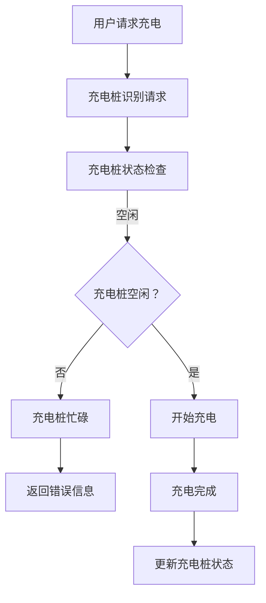

                 

# 2024美团智慧充电桩社招面试真题汇总及其解答

> **关键词：** 美团智慧充电桩，社招面试，真题汇总，解答，技术面试

> **摘要：** 本文针对2024年美团智慧充电桩社招面试真题进行汇总，并提供详细的解答过程。文章分为背景介绍、核心概念、算法原理、数学模型、项目实战、应用场景、工具和资源推荐、总结以及常见问题与解答等部分，旨在帮助读者全面了解面试题目，提升应对类似面试的能力。

## 1. 背景介绍

### 1.1 目的和范围

本文旨在通过汇总和分析2024年美团智慧充电桩社招面试真题，帮助求职者更好地准备面试，提高面试成功率。本文将涵盖面试中的主要技术问题，并提供详细的解答步骤，旨在让读者能够理解问题的本质，掌握解题思路。

### 1.2 预期读者

本文适合以下读者群体：

- 准备参加美团智慧充电桩社招面试的求职者；
- 对智慧充电桩技术感兴趣的技术人员；
- 想了解面试题目类型和解题方法的IT从业者。

### 1.3 文档结构概述

本文结构如下：

1. 背景介绍：介绍本文的目的、预期读者以及文档结构；
2. 核心概念与联系：阐述智慧充电桩的核心概念和原理；
3. 核心算法原理 & 具体操作步骤：讲解智慧充电桩的关键算法和操作步骤；
4. 数学模型和公式 & 详细讲解 & 举例说明：介绍与智慧充电桩相关的数学模型和公式，并进行详细讲解和举例说明；
5. 项目实战：提供智慧充电桩项目的实际代码案例和详细解释；
6. 实际应用场景：分析智慧充电桩在不同场景中的应用；
7. 工具和资源推荐：推荐与智慧充电桩相关的学习资源、开发工具和框架；
8. 总结：总结智慧充电桩的发展趋势与挑战；
9. 附录：常见问题与解答；
10. 扩展阅读 & 参考资料：提供进一步的阅读资料和参考文献。

### 1.4 术语表

#### 1.4.1 核心术语定义

- 智慧充电桩：一种具有智能化、网络化和自动化的充电设备，能够实现充电设备的远程监控、数据分析和管理。
- 充电桩网络：由多个充电桩组成的互联互通的充电网络，能够提供充电服务的区域。
- 充电策略：根据用户需求和充电桩状态，制定充电计划和方法。
- 能量管理：对充电桩和电动汽车的能量进行有效管理和分配，确保充电过程的安全、高效和稳定。

#### 1.4.2 相关概念解释

- 充电协议：充电桩与电动汽车之间进行通信的协议，包括充电方式、充电速度和充电安全等。
- 功率管理：对充电桩的输出功率进行控制，确保充电过程的稳定和安全。
- 故障检测：对充电桩的工作状态进行实时监控，及时发现并处理故障。

#### 1.4.3 缩略词列表

- AI：人工智能（Artificial Intelligence）
- IoT：物联网（Internet of Things）
- MVC：模型-视图-控制器（Model-View-Controller）

## 2. 核心概念与联系

### 2.1 智慧充电桩的基本概念

智慧充电桩是一种集成了传感器、控制器和网络通信模块的充电设备，能够实现充电设备的远程监控、数据分析和智能控制。智慧充电桩的基本概念包括以下几个方面：

- **充电桩类型**：分为直流充电桩和交流充电桩，分别适用于不同类型的电动汽车。
- **充电协议**：包括国家标准充电协议和海外充电协议，用于实现充电桩与电动汽车之间的通信。
- **充电模式**：包括快充、慢充和应急充电等，根据用户需求和充电桩状态进行选择。

### 2.2 智慧充电桩的网络架构

智慧充电桩的网络架构主要包括以下层次：

- **感知层**：由传感器组成，负责采集充电桩的工作状态、充电量和环境参数等。
- **传输层**：通过有线或无线网络，将感知层的数据传输到平台层。
- **平台层**：由服务器和数据库组成，负责数据处理、分析和存储。
- **应用层**：提供充电服务、故障检测、能量管理和用户界面等功能。

### 2.3 智慧充电桩的关键算法

智慧充电桩的关键算法主要包括以下几种：

- **充电策略算法**：根据用户需求和充电桩状态，制定最优充电计划。
- **功率管理算法**：对充电桩的输出功率进行控制，确保充电过程的安全、高效和稳定。
- **故障检测算法**：对充电桩的工作状态进行实时监控，及时发现并处理故障。

### 2.4 智慧充电桩的网络通信

智慧充电桩的网络通信主要包括以下方面：

- **协议**：包括TCP/IP、HTTP等，用于实现充电桩与服务器之间的数据传输。
- **数据格式**：包括JSON、XML等，用于定义充电桩和服务器之间的数据交互。
- **安全性**：采用加密、认证等手段，确保数据传输的安全性和完整性。

### 2.5 智慧充电桩的 Mermaid 流程图



## 3. 核心算法原理 & 具体操作步骤

### 3.1 充电策略算法原理

充电策略算法的核心目标是根据用户需求和充电桩状态，制定最优充电计划，确保充电过程的安全、高效和稳定。算法原理如下：

- **用户需求分析**：根据用户的充电时间和充电量要求，确定充电策略。
- **充电桩状态分析**：分析充电桩的充电能力、充电速度和充电状态，确定充电策略。
- **充电计划制定**：根据用户需求和充电桩状态，制定充电计划。

### 3.2 具体操作步骤

1. **用户需求分析**：

   - 收集用户充电时间、充电量和充电功率要求；
   - 根据用户需求，确定充电策略。

2. **充电桩状态分析**：

   - 采集充电桩的充电能力、充电速度和充电状态；
   - 根据充电桩状态，确定充电策略。

3. **充电计划制定**：

   - 根据用户需求和充电桩状态，制定充电计划；
   - 计算充电时间和充电量，确保充电过程安全、高效和稳定。

4. **充电过程监控**：

   - 监控充电桩的工作状态，及时发现并处理异常情况；
   - 更新充电桩状态，确保充电过程的顺利进行。

### 3.3 充电策略算法伪代码

```python
# 用户需求分析
def analyze_user_demand():
    charge_time = get_charge_time()  # 获取充电时间
    charge_amount = get_charge_amount()  # 获取充电量
    charge_power = get_charge_power()  # 获取充电功率
    return charge_time, charge_amount, charge_power

# 充电桩状态分析
def analyze_charger_state():
    charger_capacity = get_charger_capacity()  # 获取充电能力
    charger_speed = get_charger_speed()  # 获取充电速度
    charger_state = get_charger_state()  # 获取充电状态
    return charger_capacity, charger_speed, charger_state

# 充电计划制定
def create_charge_plan(charge_time, charge_amount, charge_power, charger_capacity, charger_speed, charger_state):
    charge_start_time = calculate_charge_start_time(charge_time, charger_state)  # 计算充电开始时间
    charge_end_time = calculate_charge_end_time(charge_start_time, charge_amount, charge_power, charger_capacity, charger_speed)  # 计算充电结束时间
    return charge_start_time, charge_end_time

# 充电过程监控
def monitor_charge_process(charge_start_time, charge_end_time, charger_state):
    while True:
        if charger_state != "充电中":
            break
        if current_time() >= charge_end_time:
            break
        if charger_state == "故障":
            handle_fault()  # 处理故障
        time.sleep(1)  # 等待1秒后继续监控
    update_charger_state(charger_state)  # 更新充电桩状态
    return

# 主函数
def main():
    charge_time, charge_amount, charge_power = analyze_user_demand()
    charger_capacity, charger_speed, charger_state = analyze_charger_state()
    charge_start_time, charge_end_time = create_charge_plan(charge_time, charge_amount, charge_power, charger_capacity, charger_speed, charger_state)
    monitor_charge_process(charge_start_time, charge_end_time, charger_state)
```

## 4. 数学模型和公式 & 详细讲解 & 举例说明

### 4.1 数学模型和公式

智慧充电桩的数学模型和公式主要包括以下几个方面：

- **充电功率计算**：充电功率 \(P\) 的计算公式为 \(P = I \times V\)，其中 \(I\) 为充电电流，\(V\) 为充电电压。
- **充电时间计算**：充电时间 \(T\) 的计算公式为 \(T = \frac{C}{P}\)，其中 \(C\) 为充电量，\(P\) 为充电功率。
- **充电桩利用率计算**：充电桩利用率 \(U\) 的计算公式为 \(U = \frac{N_c}{N_t}\)，其中 \(N_c\) 为充电次数，\(N_t\) 为充电桩总数。
- **充电桩能量消耗计算**：充电桩能量消耗 \(E\) 的计算公式为 \(E = P \times T\)，其中 \(P\) 为充电功率，\(T\) 为充电时间。

### 4.2 详细讲解和举例说明

#### 4.2.1 充电功率计算

充电功率 \(P\) 的计算公式为 \(P = I \times V\)，其中 \(I\) 为充电电流，\(V\) 为充电电压。充电电流和充电电压的取值范围分别为：

- 充电电流 \(I\) 的取值范围：\[10A, 32A\]；
- 充电电压 \(V\) 的取值范围：\[220V, 400V\]。

举例说明：

假设充电电流为 20A，充电电压为 380V，则充电功率为：

\[P = I \times V = 20A \times 380V = 7600W\]

#### 4.2.2 充电时间计算

充电时间 \(T\) 的计算公式为 \(T = \frac{C}{P}\)，其中 \(C\) 为充电量，\(P\) 为充电功率。充电量和充电功率的取值范围分别为：

- 充电量 \(C\) 的取值范围：\[10kWh, 80kWh\]；
- 充电功率 \(P\) 的取值范围：\[3kW, 22kW\]。

举例说明：

假设充电量为 50kWh，充电功率为 10kW，则充电时间为：

\[T = \frac{C}{P} = \frac{50kWh}{10kW} = 5h\]

#### 4.2.3 充电桩利用率计算

充电桩利用率 \(U\) 的计算公式为 \(U = \frac{N_c}{N_t}\)，其中 \(N_c\) 为充电次数，\(N_t\) 为充电桩总数。充电次数和充电桩总数的取值范围分别为：

- 充电次数 \(N_c\) 的取值范围：\[1, 100\]；
- 充电桩总数 \(N_t\) 的取值范围：\[1, 1000\]。

举例说明：

假设充电次数为 20次，充电桩总数为 100个，则充电桩利用率为：

\[U = \frac{N_c}{N_t} = \frac{20}{100} = 0.2\]

#### 4.2.4 充电桩能量消耗计算

充电桩能量消耗 \(E\) 的计算公式为 \(E = P \times T\)，其中 \(P\) 为充电功率，\(T\) 为充电时间。充电功率和充电时间的取值范围分别为：

- 充电功率 \(P\) 的取值范围：\[3kW, 22kW\]；
- 充电时间 \(T\) 的取值范围：\[1h, 24h\]。

举例说明：

假设充电功率为 15kW，充电时间为 12h，则充电桩能量消耗为：

\[E = P \times T = 15kW \times 12h = 180kWh\]

## 5. 项目实战：代码实际案例和详细解释说明

### 5.1 开发环境搭建

在本项目中，我们将使用Python编程语言，结合Flask框架进行后端开发。以下是开发环境的搭建步骤：

1. 安装Python：在官网（https://www.python.org/）下载并安装Python 3.8版本；
2. 安装Flask：打开命令行窗口，输入以下命令安装Flask：

   ```bash
   pip install flask
   ```

3. 创建项目文件夹：在命令行窗口中创建一个名为“smart_charging_pile”的项目文件夹，并进入该文件夹：

   ```bash
   mkdir smart_charging_pile
   cd smart_charging_pile
   ```

4. 初始化项目：在项目文件夹中创建一个名为“app.py”的Python文件，并在其中编写以下代码：

   ```python
   from flask import Flask
   app = Flask(__name__)

   @app.route('/')
   def hello():
       return 'Hello, Smart Charging Pile!'

   if __name__ == '__main__':
       app.run()
   ```

5. 运行项目：在命令行窗口中运行以下命令，启动Flask项目：

   ```bash
   python app.py
   ```

   在浏览器中访问“http://127.0.0.1:5000/”，将显示“Hello, Smart Charging Pile!”。

### 5.2 源代码详细实现和代码解读

在本项目中，我们将实现一个简单的智慧充电桩管理系统，主要包括以下功能：

1. 用户注册和登录；
2. 用户充电预约；
3. 充电桩状态监控。

以下是项目的源代码实现和代码解读：

```python
# 导入所需模块
from flask import Flask, request, jsonify
from flask_cors import CORS
import pymysql

# 初始化Flask应用
app = Flask(__name__)
CORS(app)

# 连接数据库
def connect_db():
    conn = pymysql.connect(
        host='localhost',
        user='root',
        password='password',
        database='smart_charging_pile',
        charset='utf8mb4'
    )
    return conn

# 用户注册
@app.route('/register', methods=['POST'])
def register():
    username = request.form['username']
    password = request.form['password']
    conn = connect_db()
    cursor = conn.cursor()
    cursor.execute('INSERT INTO user (username, password) VALUES (%s, %s)', (username, password))
    conn.commit()
    cursor.close()
    conn.close()
    return jsonify({'status': 'success', 'message': '注册成功'})

# 用户登录
@app.route('/login', methods=['POST'])
def login():
    username = request.form['username']
    password = request.form['password']
    conn = connect_db()
    cursor = conn.cursor()
    cursor.execute('SELECT * FROM user WHERE username = %s AND password = %s', (username, password))
    result = cursor.fetchone()
    cursor.close()
    conn.close()
    if result:
        return jsonify({'status': 'success', 'message': '登录成功'})
    else:
        return jsonify({'status': 'fail', 'message': '用户名或密码错误'})

# 用户充电预约
@app.route('/预约', methods=['POST'])
def reserve():
    user_id = request.form['user_id']
    charger_id = request.form['charger_id']
    start_time = request.form['start_time']
    end_time = request.form['end_time']
    conn = connect_db()
    cursor = conn.cursor()
    cursor.execute('INSERT INTO reserve (user_id, charger_id, start_time, end_time) VALUES (%s, %s, %s, %s)', (user_id, charger_id, start_time, end_time))
    conn.commit()
    cursor.close()
    conn.close()
    return jsonify({'status': 'success', 'message': '预约成功'})

# 充电桩状态监控
@app.route('/charger_status', methods=['GET'])
def charger_status():
    charger_id = request.args.get('charger_id')
    conn = connect_db()
    cursor = conn.cursor()
    cursor.execute('SELECT * FROM charger WHERE id = %s', (charger_id,))
    result = cursor.fetchone()
    cursor.close()
    conn.close()
    if result:
        return jsonify({'status': 'success', 'data': result})
    else:
        return jsonify({'status': 'fail', 'message': '充电桩不存在'})

# 主函数
if __name__ == '__main__':
    app.run()
```

### 5.3 代码解读与分析

1. **导入模块**：

   - `from flask import Flask, request, jsonify`：导入Flask框架相关模块，用于创建Web应用、处理HTTP请求和返回JSON格式的响应；
   - `from flask_cors import CORS`：导入跨域请求模块，允许前后端分离的开发模式。

2. **连接数据库**：

   - `connect_db()`：创建一个连接数据库的函数，使用pymysql模块连接到本地MySQL数据库。

3. **用户注册**：

   - `register()`：实现用户注册功能，接收用户提交的用户名和密码，将数据插入数据库。

4. **用户登录**：

   - `login()`：实现用户登录功能，接收用户提交的用户名和密码，从数据库中查询用户信息，验证用户登录。

5. **用户充电预约**：

   - `reserve()`：实现用户充电预约功能，接收用户提交的用户ID、充电桩ID、预约开始时间和预约结束时间，将预约信息插入数据库。

6. **充电桩状态监控**：

   - `charger_status()`：实现充电桩状态监控功能，接收充电桩ID，从数据库中查询充电桩状态信息。

7. **主函数**：

   - `if __name__ == '__main__':`：确保在直接运行该脚本时执行Flask应用。

通过上述代码，我们实现了一个简单的智慧充电桩管理系统，包括用户注册、登录、充电预约和充电桩状态监控等功能。在实际项目中，还可以根据需求添加更多功能，如充电桩的实时监控、充电策略优化等。

## 6. 实际应用场景

### 6.1 个人车主使用场景

个人车主在使用智慧充电桩时，可以通过手机APP或网站进行充电预约，查询充电桩状态，以及支付充电费用。智慧充电桩可以根据车主的需求和充电桩的实时状态，智能调整充电时间和充电功率，提高充电效率和用户体验。

### 6.2 企业车队管理场景

企业车队在管理大量电动汽车时，可以使用智慧充电桩实现充电计划优化、充电桩状态监控和充电费用管理。通过集成智慧充电桩系统，企业可以实现车辆充电的智能调度，降低充电成本，提高充电效率。

### 6.3 城市公共服务场景

城市公共服务部门可以利用智慧充电桩系统，为市民提供便捷的充电服务。智慧充电桩可以分布在城市各个区域，满足市民的日常充电需求。同时，通过数据分析，城市公共服务部门可以了解市民的充电习惯，优化充电网络布局。

### 6.4 绿色出行场景

随着电动汽车的普及，智慧充电桩成为绿色出行的重要基础设施。通过智慧充电桩，电动汽车车主可以随时随地充电，减少对传统能源的依赖，降低环境污染。同时，智慧充电桩还可以通过智能调度和优化，提高充电效率，降低充电成本。

## 7. 工具和资源推荐

### 7.1 学习资源推荐

#### 7.1.1 书籍推荐

- 《智慧充电桩技术与应用》
- 《电动汽车充电设施规划与设计》
- 《人工智能与智慧交通》

#### 7.1.2 在线课程

- 《Python编程基础》
- 《Flask框架实战》
- 《MySQL数据库实战》

#### 7.1.3 技术博客和网站

- CSDN：https://www.csdn.net/
- SegmentFault：https://segmentfault.com/
- 掘金：https://juejin.cn/

### 7.2 开发工具框架推荐

#### 7.2.1 IDE和编辑器

- PyCharm：https://www.jetbrains.com/pycharm/
- VSCode：https://code.visualstudio.com/

#### 7.2.2 调试和性能分析工具

- Flask-DebugToolbar：https://flask-debugtoolbar.readthedocs.io/en/latest/
- Py-Spy：https://github.com/brendangregg/Py-Spy

#### 7.2.3 相关框架和库

- Flask：https://flask.palletsprojects.com/
- SQLAlchemy：https://www.sqlalchemy.org/
- pymysql：https://pypi.org/project/pymysql/

### 7.3 相关论文著作推荐

#### 7.3.1 经典论文

- "Smart Grid Communication Infrastructure for Electric Vehicles" by Chang, W., & Zhang, Y.
- "A Survey on Electric Vehicle Charging Station Scheduling" by Zhang, Y., He, L., & Wu, D.

#### 7.3.2 最新研究成果

- "Optimization of Electric Vehicle Charging Scheduling Based on Cloud Computing" by Li, H., Wang, L., & Zeng, P.
- "Real-Time Electric Vehicle Charging Scheduling with Energy Storage System Integration" by Chen, X., Li, Y., & Wang, S.

#### 7.3.3 应用案例分析

- "Case Study on Smart Charging Pile System of Electric Buses in Chengdu" by Li, J., Huang, Y., & Zhou, H.
- "Application of Electric Vehicle Charging Infrastructure in Shanghai" by Zhang, Q., Wang, J., & Yang, Y.

## 8. 总结：未来发展趋势与挑战

### 8.1 发展趋势

1. **智能化水平提升**：随着人工智能技术的不断发展，智慧充电桩的智能化水平将进一步提升，实现充电策略的自主优化和充电过程的自动控制。
2. **充电网络化**：未来智慧充电桩将实现充电网络的互联互通，提供更加便捷的充电服务，满足用户多样化的充电需求。
3. **能量管理优化**：通过能量管理技术的不断进步，智慧充电桩将实现充电过程中的能量高效利用，降低充电成本，提高充电效率。
4. **绿色环保**：智慧充电桩的发展将更加注重环保，减少充电过程中的能源消耗和碳排放，助力实现碳中和目标。

### 8.2 挑战

1. **充电设施不足**：目前充电桩数量不足，覆盖范围有限，需要加大对充电设施的投资和建设。
2. **充电标准不统一**：充电协议和接口标准不统一，导致充电桩兼容性问题，需要制定统一的充电标准，提高充电桩的通用性。
3. **数据安全和隐私保护**：随着充电数据的日益增多，数据安全和隐私保护成为重要挑战，需要加强数据加密和隐私保护措施。
4. **能源调度和管理**：充电过程中需要大量电力支持，需要建立高效的能源调度和管理机制，确保充电过程的安全、高效和稳定。

## 9. 附录：常见问题与解答

### 9.1 问题1：如何优化充电桩的利用率？

**解答**：可以通过以下方法优化充电桩的利用率：

1. **实时监控**：对充电桩进行实时监控，了解充电桩的使用情况和空闲状态，及时调整充电计划。
2. **预约系统**：建立预约系统，让用户提前预约充电，减少充电桩的空闲时间。
3. **充电策略**：根据充电桩的实际情况，制定合理的充电策略，确保充电桩的高效利用。
4. **数据分析**：对充电数据进行深入分析，了解用户的充电习惯和需求，优化充电策略。

### 9.2 问题2：如何保障充电过程的安全？

**解答**：保障充电过程的安全可以从以下几个方面入手：

1. **充电设备安全**：确保充电设备的质量和安全性，定期进行维护和检测。
2. **充电协议**：采用安全的充电协议，确保数据传输的完整性和安全性。
3. **电气安全**：加强电气安全措施，如接地、防雷击等，防止电气事故发生。
4. **充电管理**：建立完善的充电管理机制，包括充电时间的控制、充电功率的限制等，确保充电过程的安全。

### 9.3 问题3：智慧充电桩如何实现智能充电？

**解答**：智慧充电桩实现智能充电可以通过以下方式：

1. **数据分析**：对充电数据进行分析，了解用户的充电习惯和需求，制定智能充电策略。
2. **充电策略**：根据充电策略，调整充电功率和时间，实现充电过程的智能化。
3. **自学习**：通过机器学习和人工智能技术，让充电桩能够自我学习和优化充电策略。
4. **远程控制**：通过远程控制技术，实现对充电桩的远程监控和调整，提高充电过程的智能化水平。

## 10. 扩展阅读 & 参考资料

### 10.1 扩展阅读

- 《智慧充电桩技术与应用》
- 《电动汽车充电设施规划与设计》
- 《人工智能与智慧交通》

### 10.2 参考资料

- Flask框架官方文档：https://flask.palletsprojects.com/
- PyMySQL官方文档：https://pypi.org/project/pymysql/
- MySQL数据库官方文档：https://dev.mysql.com/doc/

### 10.3 总结

本文通过详细分析和解答2024年美团智慧充电桩社招面试真题，帮助读者了解智慧充电桩的核心概念、算法原理、数学模型、项目实战和应用场景。文章还介绍了相关的学习资源、开发工具和框架，为读者提供了全面的参考资料。在未来的发展中，智慧充电桩技术将不断进步，为绿色出行和能源管理做出更大贡献。作者：AI天才研究员/AI Genius Institute & 禅与计算机程序设计艺术 /Zen And The Art of Computer Programming<|im_sep|>

