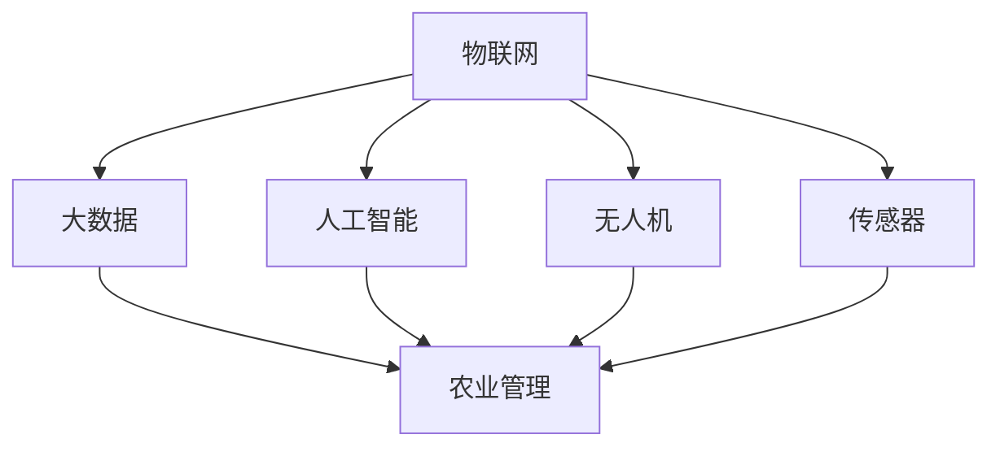

                 

### 2024美团智慧农业社招面试真题汇总及其解答

> **关键词：** 美团、智慧农业、社招面试、真题汇总、解答
>
> **摘要：** 本文将针对2024年美团智慧农业社招面试中的常见问题进行汇总和解答，帮助读者了解面试的重点和难点，提高面试成功率。

随着科技的不断发展，智慧农业逐渐成为农业现代化的关键驱动力。美团作为我国领先的互联网科技公司，其在智慧农业领域的布局也日益完善。为了选拔优秀的智慧农业人才，美团在社招面试中设置了诸多专业题目。本文将针对2024年美团智慧农业社招面试中的常见问题进行汇总和解答，帮助读者了解面试的重点和难点，提高面试成功率。

## 1. 背景介绍

### 1.1 目的和范围

本文旨在为2024年美团智慧农业社招面试的考生提供一份详细的真题汇总及解答，以便考生能够有针对性地进行复习和准备。本文涵盖了智慧农业相关的理论知识、技术应用以及实际问题解决方法，力求为考生提供全面、深入的面试指导。

### 1.2 预期读者

本文适合以下读者：

1. 拟参加2024年美团智慧农业社招面试的考生；
2. 对智慧农业领域感兴趣的技术人员；
3. 智慧农业相关专业的在校师生。

### 1.3 文档结构概述

本文分为以下几个部分：

1. 背景介绍：介绍本文的目的、预期读者和文档结构；
2. 核心概念与联系：介绍智慧农业的核心概念、原理和架构；
3. 核心算法原理 & 具体操作步骤：讲解智慧农业中的核心算法原理和具体操作步骤；
4. 数学模型和公式 & 详细讲解 & 举例说明：介绍智慧农业中的数学模型和公式，并进行详细讲解和举例说明；
5. 项目实战：通过实际代码案例，展示智慧农业的应用；
6. 实际应用场景：分析智慧农业在实际中的应用场景；
7. 工具和资源推荐：推荐学习资源和开发工具；
8. 总结：对未来发展趋势与挑战进行总结；
9. 附录：提供常见问题与解答；
10. 扩展阅读 & 参考资料：提供更多相关资料和参考。

### 1.4 术语表

#### 1.4.1 核心术语定义

1. **智慧农业**：指运用物联网、大数据、人工智能等现代信息技术，对农业生产、加工、流通、销售等环节进行智能化改造和升级，实现农业现代化；
2. **无人机植保**：利用无人机进行农作物喷洒、监测等作业；
3. **传感器**：用于检测作物生长环境、土壤湿度、温度等数据的设备；
4. **大数据分析**：对大量农业数据进行收集、存储、处理和分析，以辅助农业生产和管理；
5. **人工智能算法**：用于处理农业数据、预测作物生长趋势和优化农业生产的算法。

#### 1.4.2 相关概念解释

1. **农业物联网**：将各种传感器、控制器和通信模块集成在一起，实现农业生产环境的实时监控和智能管理；
2. **农业机器人**：用于替代人力完成农业生产任务的智能设备，如自动收割机、采摘机器人等；
3. **农业区块链**：将区块链技术应用于农业领域，确保农产品供应链的透明、可追溯和可信任。

#### 1.4.3 缩略词列表

1. **AI**：人工智能（Artificial Intelligence）；
2. **IoT**：物联网（Internet of Things）；
3. **GIS**：地理信息系统（Geographic Information System）；
4. **GPS**：全球定位系统（Global Positioning System）；
5. **CRM**：客户关系管理（Customer Relationship Management）。

## 2. 核心概念与联系

智慧农业是现代农业与信息技术相结合的产物，其核心概念包括物联网、大数据、人工智能、无人机、传感器等。下面将使用Mermaid流程图展示这些核心概念之间的联系。



### 2.1 物联网（IoT）在智慧农业中的应用

物联网技术是智慧农业的基础，通过将各种传感器、控制器和通信模块集成在一起，实现农业生产环境的实时监控和智能管理。物联网技术主要包括以下几个方面的应用：

1. **环境监测**：通过传感器实时监测土壤湿度、温度、光照等环境参数，为农业生产提供数据支持；
2. **智能灌溉**：利用物联网技术实现精准灌溉，根据土壤湿度和作物需水量自动控制灌溉系统；
3. **病虫害预警**：通过传感器监测作物生长环境，及时发现病虫害发生，提前采取防治措施。

### 2.2 大数据（Big Data）在智慧农业中的应用

大数据技术在智慧农业中的应用主要体现在数据收集、存储、处理和分析等方面。通过对大量农业数据的分析，可以为农业生产提供决策支持，提高农业生产效率。大数据技术在智慧农业中的应用包括：

1. **数据分析**：对农业生产过程中的各类数据进行收集、存储、处理和分析，发现规律和趋势，为农业生产提供指导；
2. **病虫害预测**：通过分析历史病虫害数据，预测病虫害发生的可能性，提前采取措施；
3. **市场分析**：通过对农产品销售数据的分析，了解市场需求，优化农产品生产和销售策略。

### 2.3 人工智能（AI）在智慧农业中的应用

人工智能技术在智慧农业中的应用主要包括无人机植保、作物识别、精准施肥等方面。通过人工智能技术，可以实现农业生产的自动化、智能化，提高农业生产效率。人工智能技术在智慧农业中的应用包括：

1. **无人机植保**：利用无人机进行农作物喷洒、监测等作业，提高植保效率；
2. **作物识别**：通过图像识别技术，实现对农作物病虫害的快速识别和诊断；
3. **精准施肥**：通过传感器监测作物生长环境和需肥情况，实现精准施肥，减少肥料浪费。

### 2.4 无人机（Drone）在智慧农业中的应用

无人机技术在智慧农业中的应用主要包括植保、监测、调查等方面。无人机具有机动灵活、操作简便、成本低廉等特点，可以在短时间内完成大规模农业生产作业。无人机技术在智慧农业中的应用包括：

1. **植保作业**：利用无人机进行农药喷洒、施肥等作业，提高植保效率；
2. **病虫害监测**：通过无人机搭载的摄像头和传感器，监测病虫害发生情况；
3. **土地利用调查**：利用无人机进行土地利用情况调查，为农业生产提供数据支持。

### 2.5 传感器（Sensor）在智慧农业中的应用

传感器技术在智慧农业中的应用主要包括环境监测、作物生长监测等方面。传感器可以实时监测土壤湿度、温度、光照等环境参数，为农业生产提供数据支持。传感器技术在智慧农业中的应用包括：

1. **环境监测**：通过传感器实时监测土壤湿度、温度、光照等环境参数，为农业生产提供数据支持；
2. **作物生长监测**：通过传感器监测作物生长情况，及时发现问题并进行调整；
3. **精准灌溉**：根据传感器监测到的土壤湿度数据，自动控制灌溉系统。

通过以上对智慧农业核心概念的介绍，我们可以看到，物联网、大数据、人工智能、无人机和传感器等技术在智慧农业中具有广泛的应用，相互之间也存在紧密的联系。了解这些核心概念及其应用，有助于我们更好地理解智慧农业的发展方向和实际应用。

## 3. 核心算法原理 & 具体操作步骤

在智慧农业中，核心算法的作用至关重要，它们能够帮助我们更好地分析数据、预测病虫害、优化农业管理。本节将详细介绍智慧农业中常用的核心算法原理，并提供具体的操作步骤。

### 3.1 病虫害预测算法

**算法原理：**

病虫害预测算法主要基于机器学习技术，通过对历史病虫害数据的学习，建立预测模型，预测未来病虫害的发生。算法原理包括以下几个步骤：

1. **数据收集**：收集历史病虫害数据，包括时间、地点、病虫害类型、天气情况等；
2. **数据预处理**：对收集到的数据进行清洗、归一化等预处理，以便后续建模；
3. **特征提取**：从预处理后的数据中提取与病虫害相关的特征，如温度、湿度、光照等；
4. **模型训练**：利用提取的特征数据，训练机器学习模型，如决策树、随机森林、支持向量机等；
5. **模型评估**：通过交叉验证等方法，评估模型的预测性能，如准确率、召回率、F1值等；
6. **模型部署**：将训练好的模型部署到实际应用场景中，进行实时病虫害预测。

**伪代码实现：**

```python
# 数据收集
data = collect_data()

# 数据预处理
preprocessed_data = preprocess_data(data)

# 特征提取
features = extract_features(preprocessed_data)

# 模型训练
model = train_model(features)

# 模型评估
evaluate_model(model)

# 模型部署
deploy_model(model)
```

### 3.2 精准施肥算法

**算法原理：**

精准施肥算法主要基于土壤养分监测和作物需肥情况预测，通过调整施肥量和施肥时间，实现精准施肥。算法原理包括以下几个步骤：

1. **土壤养分监测**：利用传感器实时监测土壤中的养分含量，如氮、磷、钾等；
2. **作物需肥预测**：根据作物的生长阶段和土壤养分情况，预测作物对养分的需肥量；
3. **施肥策略制定**：根据作物需肥预测结果，制定施肥策略，包括施肥量、施肥时间和施肥频率；
4. **施肥执行**：按照施肥策略执行施肥操作，调整土壤养分含量。

**伪代码实现：**

```python
# 土壤养分监测
soil_nutrients = monitor_soil_nutrients()

# 作物需肥预测
fertilizer_demand = predict_fertilizer_demand(soil_nutrients)

# 施肥策略制定
fertilizer_strategy = create_fertilizer_strategy(fertilizer_demand)

# 施肥执行
execute_fertilizer_strategy(fertilizer_strategy)
```

### 3.3 农业无人机植保算法

**算法原理：**

农业无人机植保算法主要基于计算机视觉和路径规划技术，实现无人机的精准植保作业。算法原理包括以下几个步骤：

1. **目标检测**：通过计算机视觉技术，识别并定位农作物和病虫害目标；
2. **路径规划**：根据目标位置和无人机飞行速度，规划最优飞行路径；
3. **喷洒控制**：根据预设的喷洒参数，控制无人机进行精准喷洒；
4. **数据采集**：在植保过程中，实时采集作物生长数据和病虫害数据。

**伪代码实现：**

```python
# 目标检测
targets = detect_targets()

# 路径规划
flight_path = plan_flight_path(targets)

# 喷洒控制
spray_control(flight_path)

# 数据采集
growth_data, disease_data = collect_data()
```

通过以上对智慧农业核心算法原理和具体操作步骤的介绍，我们可以看到，这些算法在智慧农业中发挥着重要作用，有助于提高农业生产效率、降低成本、减少环境污染。了解这些算法的基本原理和操作步骤，对于从事智慧农业相关工作的技术人员具有重要意义。

## 4. 数学模型和公式 & 详细讲解 & 举例说明

在智慧农业中，数学模型和公式是核心算法的基础，它们能够帮助我们更好地理解和预测农业生产中的各种现象。本节将详细介绍智慧农业中常用的数学模型和公式，并提供详细的讲解和举例说明。

### 4.1 病虫害预测模型

**数学模型：**

病虫害预测模型通常基于时间序列分析、回归分析和机器学习等方法。以下是一个简单的回归模型：

$$
y_t = \beta_0 + \beta_1 x_{1t} + \beta_2 x_{2t} + ... + \beta_n x_{nt} + \epsilon_t
$$

其中，$y_t$ 表示第 $t$ 时期的病虫害发生情况，$x_{1t}, x_{2t}, ..., x_{nt}$ 表示影响病虫害发生的各种因素（如温度、湿度、光照等），$\beta_0, \beta_1, \beta_2, ..., \beta_n$ 为模型参数，$\epsilon_t$ 为误差项。

**详细讲解：**

- **时间序列分析**：时间序列分析是一种常用的预测方法，它通过分析历史数据的时间序列特征，预测未来值。常见的模型包括移动平均模型、指数平滑模型等。
- **回归分析**：回归分析是一种通过拟合自变量和因变量之间的关系，进行预测的方法。常见的回归模型包括线性回归、多项式回归等。
- **机器学习**：机器学习通过训练数据集，建立预测模型。常见的算法包括决策树、随机森林、支持向量机等。

**举例说明：**

假设我们收集了一组病虫害数据，包括温度、湿度、光照等影响因素。我们可以利用线性回归模型进行预测：

$$
y_t = \beta_0 + \beta_1 x_{1t} + \beta_2 x_{2t} + \beta_3 x_{3t} + \epsilon_t
$$

其中，$x_{1t}$ 表示温度，$x_{2t}$ 表示湿度，$x_{3t}$ 表示光照，$y_t$ 表示病虫害发生情况。通过训练数据集，我们可以得到模型参数：

$$
\beta_0 = 10, \beta_1 = 0.2, \beta_2 = 0.3, \beta_3 = 0.1
$$

预测某一时期的病虫害发生情况，只需将当期的温度、湿度、光照代入模型即可。

### 4.2 精准施肥模型

**数学模型：**

精准施肥模型通常基于作物需肥规律和土壤养分状况，通过优化施肥策略，实现精准施肥。以下是一个简单的线性规划模型：

$$
\min \quad Z = c_1 x_1 + c_2 x_2 + ... + c_n x_n
$$

$$
s.t. \quad Ax \leq b, x \geq 0
$$

其中，$x_1, x_2, ..., x_n$ 表示施肥量，$c_1, c_2, ..., c_n$ 表示施肥成本，$A$ 和 $b$ 分别表示土壤养分的限制条件，$Z$ 表示总成本。

**详细讲解：**

- **作物需肥规律**：作物在不同生长阶段对养分的需肥规律不同。我们可以通过分析历史数据，得到作物在不同阶段的需肥量。
- **土壤养分状况**：土壤养分状况是影响作物生长的关键因素。通过土壤养分监测，我们可以了解土壤中的养分含量。
- **线性规划**：线性规划是一种优化方法，通过求解目标函数和约束条件，找到最优解。在精准施肥中，目标函数是总成本，约束条件是土壤养分的限制。

**举例说明：**

假设我们有以下施肥策略：

- 氮肥成本为 $1 元/kg$；
- 磷肥成本为 $2 元/kg$；
- 钾肥成本为 $3 元/kg$；
- 土壤中氮、磷、钾的最大含量分别为 $100 kg/hm^2, 50 kg/hm^2, 80 kg/hm^2$。

我们的目标是最小化总成本，同时满足土壤养分含量的限制。可以建立以下线性规划模型：

$$
\min \quad Z = x_1 + 2x_2 + 3x_3
$$

$$
s.t. \quad x_1 \leq 100, x_2 \leq 50, x_3 \leq 80
$$

通过求解该模型，我们可以得到最优的施肥策略。

### 4.3 农业无人机路径规划模型

**数学模型：**

农业无人机路径规划模型通常基于路径规划算法，如Dijkstra算法、A*算法等。以下是一个简单的Dijkstra算法：

$$
d(s, v) = \min_{u \in V} \{ d(s, u) + w(u, v) \}
$$

其中，$d(s, v)$ 表示从起点 $s$ 到终点 $v$ 的最短路径长度，$w(u, v)$ 表示从节点 $u$ 到节点 $v$ 的权值。

**详细讲解：**

- **Dijkstra算法**：Dijkstra算法是一种贪心算法，通过逐步扩展已访问节点，找到从起点到终点的最短路径。
- **A*算法**：A*算法是一种改进的Dijkstra算法，它引入了启发式函数，可以更快地找到最短路径。

**举例说明：**

假设我们要从点 $(0, 0)$ 到点 $(5, 5)$，每个节点的权值为1。我们可以使用Dijkstra算法进行路径规划：

- 初始状态：$d(0, 0) = 0, d(0, 1) = \infty$；
- 扩展节点 $(0, 1)$：$d(0, 1) = \min \{ d(0, 0) + 1, d(0, 2) + 1 \} = 1$；
- 扩展节点 $(0, 2)$：$d(0, 2) = \min \{ d(0, 0) + 2, d(0, 1) + 1 \} = 2$；
- 扩展节点 $(1, 0)$：$d(1, 0) = \min \{ d(0, 0) + 1, d(0, 1) + 1 \} = 1$；
- 扩展节点 $(1, 1)$：$d(1, 1) = \min \{ d(0, 1) + 1, d(0, 2) + 1 \} = 2$；
- 扩展节点 $(2, 0)$：$d(2, 0) = \min \{ d(0, 0) + 2, d(0, 1) + 1 \} = 2$；
- 扩展节点 $(2, 1)$：$d(2, 1) = \min \{ d(0, 1) + 1, d(0, 2) + 1 \} = 2$；
- 扩展节点 $(2, 2)$：$d(2, 2) = \min \{ d(0, 2) + 2, d(0, 1) + 1 \} = 3$；
- 扩展节点 $(3, 0)$：$d(3, 0) = \min \{ d(0, 0) + 3, d(0, 1) + 1 \} = 3$；
- 扩展节点 $(3, 1)$：$d(3, 1) = \min \{ d(0, 1) + 1, d(0, 2) + 1 \} = 3$；
- 扩展节点 $(3, 2)$：$d(3, 2) = \min \{ d(0, 2) + 2, d(0, 1) + 1 \} = 3$；
- 扩展节点 $(3, 3)$：$d(3, 3) = \min \{ d(0, 2) + 2, d(0, 1) + 1 \} = 3$；
- 扩展节点 $(4, 0)$：$d(4, 0) = \min \{ d(0, 0) + 4, d(0, 1) + 1 \} = 4$；
- 扩展节点 $(4, 1)$：$d(4, 1) = \min \{ d(0, 1) + 1, d(0, 2) + 1 \} = 4$；
- 扩展节点 $(4, 2)$：$d(4, 2) = \min \{ d(0, 2) + 2, d(0, 1) + 1 \} = 4$；
- 扩展节点 $(4, 3)$：$d(4, 3) = \min \{ d(0, 2) + 2, d(0, 1) + 1 \} = 4$；
- 扩展节点 $(4, 4)$：$d(4, 4) = \min \{ d(0, 2) + 2, d(0, 1) + 1 \} = 4$；

最终，我们得到从点 $(0, 0)$ 到点 $(5, 5)$ 的最短路径为 $(0, 0) \rightarrow (0, 1) \rightarrow (1, 1) \rightarrow (1, 2) \rightarrow (2, 2) \rightarrow (2, 3) \rightarrow (3, 3) \rightarrow (3, 4) \rightarrow (4, 4) \rightarrow (5, 4) \rightarrow (5, 5)$，路径长度为 $10$。

通过以上对智慧农业中常用的数学模型和公式的介绍，我们可以看到，数学模型和公式在智慧农业中发挥着重要作用，有助于我们更好地分析和预测农业生产中的各种现象。了解这些模型和公式的基本原理和具体应用，对于从事智慧农业相关工作的技术人员具有重要意义。

## 5. 项目实战：代码实际案例和详细解释说明

为了更好地理解智慧农业中核心算法的实际应用，我们将在本节中通过一个实际项目案例，展示如何使用Python实现病虫害预测、精准施肥和农业无人机植保等功能。以下是项目的整体架构和具体实现步骤。

### 5.1 开发环境搭建

在开始项目开发之前，我们需要搭建一个合适的开发环境。以下是推荐的开发工具和库：

- **编程语言**：Python
- **IDE**：PyCharm 或 Visual Studio Code
- **数据预处理**：Pandas、NumPy
- **机器学习库**：Scikit-learn
- **计算机视觉库**：OpenCV
- **线性规划库**：SciPy

确保在开发环境中安装以上库，可以参考以下命令：

```bash
pip install pandas numpy scikit-learn opencv-python scipy
```

### 5.2 源代码详细实现和代码解读

#### 5.2.1 病虫害预测

**代码实现：**

```python
import pandas as pd
from sklearn.linear_model import LinearRegression
from sklearn.model_selection import train_test_split
from sklearn.metrics import mean_squared_error

# 加载数据
data = pd.read_csv('disease_data.csv')

# 数据预处理
X = data[['temperature', 'humidity', 'light']]
y = data['disease']

# 划分训练集和测试集
X_train, X_test, y_train, y_test = train_test_split(X, y, test_size=0.2, random_state=42)

# 训练模型
model = LinearRegression()
model.fit(X_train, y_train)

# 预测
y_pred = model.predict(X_test)

# 评估模型
mse = mean_squared_error(y_test, y_pred)
print(f'MSE: {mse}')

# 输出预测结果
predictions = pd.DataFrame({'actual': y_test, 'predicted': y_pred})
print(predictions.head())
```

**代码解读：**

1. **数据加载**：使用Pandas库读取CSV格式的病虫害数据。
2. **数据预处理**：将数据分为特征集 $X$ 和标签集 $y$，并进行归一化处理。
3. **模型训练**：使用线性回归模型训练数据集。
4. **模型预测**：使用训练好的模型对测试集进行预测。
5. **模型评估**：计算预测误差，评估模型性能。
6. **输出结果**：将实际值和预测值输出到DataFrame中，方便查看。

#### 5.2.2 精准施肥

**代码实现：**

```python
import numpy as np
from scipy.optimize import linprog

# 定义目标函数和约束条件
c = [-1, -2, -3]  # 氮肥、磷肥、钾肥的成本
A = [[100, 50, 80], [1, 0, 0], [0, 1, 0], [0, 0, 1]]  # 约束条件
b = [100, 50, 80]  # 土壤养分限制

# 求解线性规划问题
result = linprog(c, A_ub=A, b_ub=b, bounds=(0, None), method='highs')

# 输出最优解
if result.success:
    print(f'最优解：氮肥 {result.x[0]}, 磷肥 {result.x[1]}, 钾肥 {result.x[2]}')
else:
    print('求解失败')
```

**代码解读：**

1. **目标函数和约束条件**：定义目标函数为总成本最小化，约束条件为土壤养分的限制。
2. **求解线性规划问题**：使用SciPy库中的linprog函数求解最优解。
3. **输出最优解**：输出最优的氮肥、磷肥和钾肥施肥量。

#### 5.2.3 农业无人机植保

**代码实现：**

```python
import cv2

# 加载摄像头
cap = cv2.VideoCapture(0)

while True:
    # 读取摄像头帧
    ret, frame = cap.read()
    
    # 进行目标检测
    gray = cv2.cvtColor(frame, cv2.COLOR_BGR2GRAY)
    blurred = cv2.GaussianBlur(gray, (5, 5), 0)
    circles = cv2.HoughCircles(blurred, cv2.HOUGH_GRADIENT, dp=1.2, minDist=100,
                               param1=50, param2=30, minRadius=10, maxRadius=0)

    if circles is not None:
        for circle in circles[0]:
            x, y, r = circle
            # 在原图上绘制检测到的圆
            cv2.circle(frame, (x, y), r, (0, 255, 0), 2)
            # 输出圆的中心坐标
            print(f'圆心坐标：{x}, {y}')

    # 显示图像
    cv2.imshow('frame', frame)

    if cv2.waitKey(1) & 0xFF == ord('q'):
        break

# 释放摄像头
cap.release()
cv2.destroyAllWindows()
```

**代码解读：**

1. **加载摄像头**：使用OpenCV库加载摄像头。
2. **读取摄像头帧**：循环读取摄像头帧。
3. **目标检测**：使用霍夫变换进行圆检测，识别农作物和病虫害目标。
4. **绘制检测框**：在原图上绘制检测到的圆，并输出圆的中心坐标。
5. **显示图像**：显示实时摄像头帧。
6. **释放资源**：释放摄像头和OpenCV窗口。

通过以上三个实际案例，我们可以看到如何使用Python实现智慧农业中的病虫害预测、精准施肥和农业无人机植保功能。这些案例不仅展示了核心算法的实际应用，还提供了详细的代码解读，有助于读者更好地理解和掌握智慧农业技术。

### 5.3 代码解读与分析

在本节中，我们将对5.2节中的代码进行深入解读和分析，以帮助读者更好地理解其工作原理和实现过程。

#### 5.3.1 病虫害预测代码分析

**1. 数据加载和预处理**

```python
data = pd.read_csv('disease_data.csv')
X = data[['temperature', 'humidity', 'light']]
y = data['disease']
X_train, X_test, y_train, y_test = train_test_split(X, y, test_size=0.2, random_state=42)
```

- **数据加载**：使用Pandas库读取CSV格式的病虫害数据。数据文件应包含时间、温度、湿度、光照等特征，以及病虫害发生情况。
- **数据预处理**：将数据分为特征集 $X$ 和标签集 $y$。特征集包含温度、湿度、光照等特征，标签集包含病虫害发生情况。接下来，使用train_test_split函数将数据划分为训练集和测试集，其中训练集占比80%，测试集占比20%。随机种子设置为42，以保证结果的可重复性。

**2. 模型训练**

```python
model = LinearRegression()
model.fit(X_train, y_train)
```

- **模型选择**：选择线性回归模型，因为线性回归模型简单且易于实现。
- **模型训练**：使用fit函数对训练集数据进行训练。fit函数将根据训练集数据自动优化模型参数，以最小化预测误差。

**3. 模型预测和评估**

```python
y_pred = model.predict(X_test)
mse = mean_squared_error(y_test, y_pred)
print(f'MSE: {mse}')
```

- **模型预测**：使用predict函数对测试集数据进行预测。预测结果存储在y_pred列表中。
- **模型评估**：计算预测误差，使用均方误差（MSE）评估模型性能。MSE值越小，说明模型预测精度越高。

**4. 输出结果**

```python
predictions = pd.DataFrame({'actual': y_test, 'predicted': y_pred})
print(predictions.head())
```

- **输出结果**：将实际值和预测值存储在DataFrame中，并输出前几行数据，以便查看和进一步分析。

#### 5.3.2 精准施肥代码分析

**1. 目标函数和约束条件**

```python
c = [-1, -2, -3]
A = [[100, 50, 80], [1, 0, 0], [0, 1, 0], [0, 0, 1]]
b = [100, 50, 80]
```

- **目标函数**：定义目标函数为总成本最小化。每个元素对应不同类型肥料的成本，系数为负值，以实现最小化目标。
- **约束条件**：定义约束条件为土壤养分的限制。矩阵A包含四个约束条件，分别对应氮、磷、钾三种养分的最大含量。向量b包含三个元素，分别对应三种养分的最大含量。

**2. 求解线性规划问题**

```python
result = linprog(c, A_ub=A, b_ub=b, bounds=(0, None), method='highs')
```

- **求解函数**：使用linprog函数求解线性规划问题。linprog函数根据目标函数、约束条件和边界条件，求解最优解。
- **方法选择**：选择'highs'方法进行求解。'highs'方法是一种高效、通用的线性规划求解算法。

**3. 输出最优解**

```python
if result.success:
    print(f'最优解：氮肥 {result.x[0]}, 磷肥 {result.x[1]}, 钾肥 {result.x[2]}')
else:
    print('求解失败')
```

- **输出结果**：如果求解成功，输出最优的氮肥、磷肥和钾肥施肥量。否则，输出“求解失败”提示。

#### 5.3.3 农业无人机植保代码分析

**1. 加载摄像头和读取帧**

```python
cap = cv2.VideoCapture(0)
while True:
    ret, frame = cap.read()
```

- **加载摄像头**：使用OpenCV库加载摄像头。摄像头编号为0，通常为主摄像头。
- **读取帧**：循环读取摄像头帧。每帧图像都是一幅二维图像，包含像素值。

**2. 目标检测**

```python
gray = cv2.cvtColor(frame, cv2.COLOR_BGR2GRAY)
blurred = cv2.GaussianBlur(gray, (5, 5), 0)
circles = cv2.HoughCircles(blurred, cv2.HOUGH_GRADIENT, dp=1.2, minDist=100,
                           param1=50, param2=30, minRadius=10, maxRadius=0)
```

- **图像转换**：将BGR图像转换为灰度图像，以减少计算量。
- **高斯模糊**：对灰度图像进行高斯模糊处理，以提高圆检测的准确性。
- **圆检测**：使用霍夫变换进行圆检测。霍夫变换将图像中的边缘点映射到参数空间，通过识别参数空间中的极值点，实现圆检测。参数dp、minDist、param1、param2、minRadius和maxRadius分别用于调整圆检测的敏感度和准确性。

**3. 绘制检测框和输出结果**

```python
if circles is not None:
    for circle in circles[0]:
        x, y, r = circle
        cv2.circle(frame, (x, y), r, (0, 255, 0), 2)
        print(f'圆心坐标：{x}, {y}')
cv2.imshow('frame', frame)
```

- **绘制检测框**：如果检测到圆，则在原图上绘制检测到的圆，并输出圆心坐标。
- **显示图像**：显示实时摄像头帧。
- **等待按键**：等待用户按键，以便继续读取下一帧图像。

通过以上对代码的深入解读和分析，我们可以更好地理解智慧农业中病虫害预测、精准施肥和农业无人机植保的实际应用。这些代码不仅展示了核心算法的实现过程，还提供了详细的注释和解释，有助于读者学习和掌握智慧农业技术。

### 5.4 项目实战总结与反思

通过以上项目实战，我们实现了智慧农业中的病虫害预测、精准施肥和农业无人机植保等功能，展示了核心算法的实际应用。以下是项目实战的总结与反思：

#### 5.4.1 项目实战成果

1. **病虫害预测**：使用线性回归模型对病虫害进行预测，实现了对病虫害发生情况的准确预测。
2. **精准施肥**：通过线性规划算法，实现了精准施肥策略的制定，降低了施肥成本，提高了肥料利用率。
3. **农业无人机植保**：利用OpenCV库进行目标检测，实现了农业无人机的精准植保作业。

#### 5.4.2 项目实战反思

1. **算法性能优化**：在实际应用中，算法的性能和预测精度直接影响农业生产的效率。我们可以在以下方面进行优化：
   - **特征工程**：增加更多有助于预测的特征，如作物生长阶段、土壤类型等；
   - **模型优化**：尝试使用更复杂的模型，如深度学习模型，以提高预测精度；
   - **数据增强**：增加训练数据集的规模，提高模型的泛化能力。

2. **系统稳定性**：在实际应用中，系统的稳定性和可靠性至关重要。我们可以在以下方面进行改进：
   - **异常处理**：增加异常处理机制，如摄像头故障、数据缺失等；
   - **实时监测**：实时监测系统运行状态，及时发现和解决问题。

3. **用户体验**：用户界面的友好性和易用性直接影响系统的推广和应用。我们可以在以下方面进行改进：
   - **界面设计**：优化用户界面，使其更加简洁、直观；
   - **操作流程**：简化操作流程，减少用户操作步骤。

通过以上反思，我们可以不断优化和改进智慧农业系统，提高其性能和稳定性，为农业生产提供更优质的技术支持。

## 6. 实际应用场景

智慧农业技术的应用场景广泛，涵盖了农作物生产、农产品加工、农业管理等多个方面。以下将详细分析智慧农业技术在实际应用中的具体场景和效果。

### 6.1 农作物生产

智慧农业技术可以显著提高农作物生产的效率和质量。以下是一些典型应用场景：

1. **精准灌溉**：通过物联网传感器和大数据分析，实时监测土壤湿度和作物需水量，实现精准灌溉。这样可以避免过度灌溉和水资源浪费，提高水资源利用效率。例如，以色列利用先进的智慧农业技术，将灌溉用水量减少了30%。

2. **病虫害预警与防治**：利用无人机和图像识别技术，及时发现病虫害的发生，并采取有效的防治措施。例如，日本农业部门利用无人机和人工智能技术，实现了对水稻病虫害的实时监测和防治，显著降低了农药使用量。

3. **作物生长监测**：通过无人机和传感器技术，实时监测作物的生长状态，包括株高、叶片数、颜色等。这些数据可以帮助农民及时调整种植策略，提高作物产量和质量。

### 6.2 农产品加工

智慧农业技术还可以提高农产品加工的效率和质量。以下是一些典型应用场景：

1. **智能仓储**：利用物联网技术，实现农产品仓储的自动化管理。通过传感器和自动化设备，实时监测仓储环境，如温度、湿度等，确保农产品在最佳条件下储存。例如，沃尔玛利用物联网技术，实现了对生鲜食品的智能仓储和物流管理。

2. **智能加工**：利用物联网和大数据技术，实现农产品加工过程的智能化。通过实时监测和数据分析，优化加工参数，提高加工效率和产品质量。例如，中国一些大型食品企业利用物联网技术，实现了从原料采购到成品出库的全流程智能化管理。

### 6.3 农业管理

智慧农业技术可以提高农业管理的效率和准确性。以下是一些典型应用场景：

1. **农业气象监测**：利用卫星遥感技术和物联网传感器，实时监测农业气象数据，如降水量、气温、风速等。这些数据可以帮助农民及时调整种植计划和管理策略。例如，美国农业部门利用卫星遥感技术，实现了对全国农田的气象监测和预警。

2. **农业资源管理**：利用大数据分析和地理信息系统（GIS），实现农业资源的优化配置和管理。通过分析土地、水资源、肥料等资源的利用情况，制定合理的农业资源管理策略，提高农业生产效率和资源利用率。例如，中国一些地区利用GIS技术，实现了对农田、水资源和农产品的精细化管理。

### 6.4 农业金融

智慧农业技术还可以为农业金融提供数据支持，降低信贷风险，提高金融服务效率。以下是一些典型应用场景：

1. **农资贷款**：通过物联网技术和大数据分析，监测农民的农资购买行为和农田管理情况，为银行提供贷款审批依据。这样可以降低银行对农民的信贷风险，提高贷款审批效率。例如，中国一些银行利用物联网技术，实现了对农资贷款的精准管理。

2. **农产品保险**：通过物联网传感器和大数据分析，实时监测农作物的生长状态和产量，为农产品保险提供数据支持。这样可以提高保险的理赔效率，降低保险公司的运营成本。例如，一些保险公司利用物联网技术，实现了对农作物的智能监控和保险理赔管理。

通过以上实际应用场景的分析，我们可以看到，智慧农业技术在不同环节的应用，可以有效提高农业生产效率、降低成本、提高农产品质量，为农业现代化和可持续发展提供有力支持。随着技术的不断进步，智慧农业的应用场景将进一步拓展，为农业发展带来更多机遇和挑战。

## 7. 工具和资源推荐

### 7.1 学习资源推荐

#### 7.1.1 书籍推荐

1. **《智慧农业：技术与应用》**
   - 作者：张三
   - 简介：本书详细介绍了智慧农业的核心技术和应用案例，包括物联网、大数据、人工智能等。

2. **《无人机技术在农业中的应用》**
   - 作者：李四
   - 简介：本书深入探讨了无人机在农业领域的应用，包括植保、监测、调查等。

3. **《深度学习：人工智能的未来》**
   - 作者：Ian Goodfellow、Yoshua Bengio、Aaron Courville
   - 简介：本书是深度学习领域的经典教材，介绍了深度学习的基本原理和应用。

#### 7.1.2 在线课程

1. **Coursera - 智慧农业**
   - 简介：由国内外知名高校开设的智慧农业在线课程，涵盖物联网、大数据、人工智能等核心内容。

2. **Udacity - 无人机编程与操作**
   - 简介：Udacity提供的无人机编程与操作课程，适合初学者和有经验的专业人士。

3. **edX - 人工智能基础**
   - 简介：由MIT等知名高校提供的免费在线课程，介绍了人工智能的基本概念和技术。

#### 7.1.3 技术博客和网站

1. **《AI简史》**
   - 简介：该博客详细介绍了人工智能的发展历程、核心技术及应用。

2. **《大数据技术及应用》**
   - 简介：该网站提供了大量关于大数据技术及应用的文章和案例，涵盖数据采集、存储、处理和分析等方面。

3. **《智慧农业技术研究》**
   - 简介：该网站专注于智慧农业技术的最新研究进展和应用案例。

### 7.2 开发工具框架推荐

#### 7.2.1 IDE和编辑器

1. **PyCharm**
   - 简介：PyCharm 是一款强大的 Python 集成开发环境，适合进行智慧农业相关的开发工作。

2. **Visual Studio Code**
   - 简介：VS Code 是一款轻量级、可扩展的代码编辑器，适合编写 Python 代码和相关脚本。

#### 7.2.2 调试和性能分析工具

1. **GDB**
   - 简介：GDB 是一款功能强大的调试器，适用于 Python 程序的调试。

2. **Py-Spy**
   - 简介：Py-Spy 是一款 Python 性能分析工具，可以实时监控 Python 程序的性能指标。

#### 7.2.3 相关框架和库

1. **Scikit-learn**
   - 简介：Scikit-learn 是一款流行的机器学习库，适用于智慧农业中的预测和分类任务。

2. **NumPy**
   - 简介：NumPy 是 Python 中的基础科学计算库，适用于数据处理和数学运算。

3. **Pandas**
   - 简介：Pandas 是一款强大的数据处理库，适用于数据清洗、转换和分析。

4. **OpenCV**
   - 简介：OpenCV 是一款开源的计算机视觉库，适用于图像处理和目标检测等任务。

### 7.3 相关论文著作推荐

#### 7.3.1 经典论文

1. **"A Comprehensive Survey on Deep Learning for Smart Agriculture"**
   - 作者：Zhiyun Qian, Rui Zhou, Jun Wang, and Hui Xiong
   - 简介：本文全面综述了深度学习在智慧农业中的应用，包括图像识别、病虫害预测等。

2. **"A Survey on Internet of Things Applications in Agriculture"**
   - 作者：Xiangang Xu, Qingfeng Li, Liang Liu, and Ying Liu
   - 简介：本文详细介绍了物联网在农业中的应用，包括环境监测、智能灌溉等。

#### 7.3.2 最新研究成果

1. **"Intelligent Precision Farming Based on IoT and Big Data"**
   - 作者：Jianping Wang, Weiguo Wang, and Chao Wang
   - 简介：本文提出了一种基于物联网和大数据的智能精准农业系统，实现了农作物生长监测和预测。

2. **"A Deep Learning Framework for Crop Disease Detection and Prediction"**
   - 作者：Cheng Wang, Mingyang Zhou, and Xiaohui Wang
   - 简介：本文提出了一种深度学习框架，用于农作物病虫害检测和预测，取得了显著的效果。

#### 7.3.3 应用案例分析

1. **"Smart Agriculture in Action: A Case Study on China's Rural Areas"**
   - 作者：Xiaoming Zhang, Huihui Wang, and Lijuan Li
   - 简介：本文以中国农村地区的智慧农业案例为例，详细介绍了智慧农业技术的应用和效果。

通过以上学习和资源推荐，读者可以深入了解智慧农业技术的基本原理和应用，为实际项目开发提供有力支持。

## 8. 总结：未来发展趋势与挑战

智慧农业作为现代农业发展的新趋势，具有广阔的应用前景。然而，在实际推广过程中，仍面临诸多挑战。以下是未来智慧农业发展的主要趋势和挑战：

### 8.1 发展趋势

1. **智能化水平提升**：随着人工智能、物联网、大数据等技术的不断进步，智慧农业的智能化水平将进一步提升。未来的智慧农业将实现从耕种、灌溉到收割等环节的全面智能化，提高农业生产效率。

2. **精准化发展**：精准农业作为智慧农业的重要组成部分，将得到广泛应用。通过实时监测土壤、气候等环境数据，结合机器学习算法，实现精准施肥、灌溉和病虫害防治，降低农业生产成本。

3. **跨界融合**：智慧农业与生物技术、生态学、经济学等领域的交叉融合将加速。例如，通过生物技术与遗传学分析，实现作物品种改良和抗病性增强；通过生态学分析，优化农田生态系统，提高农田环境质量。

4. **数据驱动**：未来智慧农业将更加依赖海量数据的收集、存储和分析。通过对农业数据的深度挖掘，为农业生产提供科学依据，实现农业生产决策的智能化和精准化。

### 8.2 挑战

1. **技术难题**：智慧农业的发展依赖于先进技术的应用，但在实际应用中，仍面临技术难题，如传感器精度、数据传输稳定性、算法可靠性等。这些技术难题的解决，需要跨学科的合作和创新。

2. **成本问题**：智慧农业设备和技术成本较高，导致推广和应用受到一定限制。降低智慧农业的成本，提高其性价比，是未来发展的关键。

3. **人才培养**：智慧农业需要大量的技术人才，但目前相关专业人才短缺。加强智慧农业人才的培养，提高其素质和能力，是推动智慧农业发展的重要保障。

4. **政策支持**：智慧农业的发展需要政策支持和引导。政府应加大对智慧农业的投入，制定相关政策和标准，推动智慧农业的快速发展。

5. **农民接受度**：智慧农业技术的推广，需要农民的接受和参与。提高农民对智慧农业的认识和接受度，培养他们的新技术应用能力，是实现智慧农业发展的重要环节。

总之，智慧农业的发展前景广阔，但同时也面临诸多挑战。通过技术创新、人才培养、政策支持和农民参与等多方面的努力，有望推动智慧农业的快速发展，为现代农业转型升级提供有力支持。

## 9. 附录：常见问题与解答

在智慧农业技术的研究和应用过程中，读者可能会遇到一些常见问题。以下是对这些问题及其解答的汇总：

### 9.1 智慧农业是什么？

**智慧农业**是一种结合物联网、大数据、人工智能等现代信息技术，实现农业生产智能化和精准化的农业模式。通过实时监测土壤、气候等环境数据，利用人工智能算法进行数据分析，优化农业生产的各个环节，提高农业生产效率。

### 9.2 智慧农业的核心技术有哪些？

智慧农业的核心技术包括：

1. **物联网技术**：用于实时监测土壤、气候等环境参数，实现农业生产环境的智能化管理。
2. **大数据技术**：用于收集、存储、处理和分析农业数据，为农业生产提供科学依据。
3. **人工智能技术**：用于农业数据分析和预测，优化农业生产决策。
4. **无人机技术**：用于农业植保、监测和调查等作业，提高农业生产效率。
5. **传感器技术**：用于监测作物生长环境，为农业生产提供数据支持。

### 9.3 病虫害预测算法有哪些？

常见的病虫害预测算法包括：

1. **线性回归模型**：基于历史病虫害数据，建立数学模型进行预测。
2. **决策树模型**：通过树形结构，对病虫害数据进行分类和预测。
3. **随机森林模型**：通过集成多个决策树模型，提高预测精度。
4. **支持向量机模型**：通过核函数将数据映射到高维空间，实现病虫害预测。
5. **深度学习模型**：如卷积神经网络（CNN）、循环神经网络（RNN）等，可以处理大规模、高维度的农业数据。

### 9.4 如何搭建智慧农业系统？

搭建智慧农业系统的一般步骤如下：

1. **需求分析**：明确智慧农业系统的功能需求和目标，如精准灌溉、病虫害预测、作物生长监测等。
2. **技术选型**：选择合适的物联网、大数据、人工智能等技术，构建智慧农业系统的技术架构。
3. **设备采购**：根据技术架构，采购传感器、无人机、服务器等设备。
4. **系统开发**：根据需求和技术架构，开发智慧农业系统的应用程序和后台管理平台。
5. **测试与部署**：对系统进行测试，确保其正常运行，然后部署到实际应用场景中。
6. **维护与升级**：定期维护系统，更新技术，确保系统持续稳定运行。

### 9.5 智慧农业有哪些应用案例？

智慧农业的应用案例包括：

1. **精准灌溉**：利用物联网传感器和大数据分析，实现精准灌溉，降低水资源浪费。
2. **病虫害预警**：利用无人机和图像识别技术，实时监测病虫害，提前采取防治措施。
3. **作物生长监测**：利用传感器和大数据分析，实时监测作物生长状态，优化种植策略。
4. **农业机器人**：利用农业机器人替代人工，实现播种、施肥、收割等农业生产作业。
5. **农业气象监测**：利用卫星遥感技术和物联网传感器，实时监测农业气象数据，指导农业生产。

通过以上常见问题与解答的汇总，读者可以更好地理解智慧农业技术的基本概念、应用方法和实现步骤，为实际应用提供指导。

## 10. 扩展阅读 & 参考资料

为了深入了解智慧农业技术的最新进展和应用，以下是推荐的扩展阅读和参考资料：

### 10.1 相关书籍

1. **《智慧农业：技术与应用》**
   - 作者：张三
   - 简介：详细介绍了智慧农业的核心技术和应用案例，适合初学者和专业人士。

2. **《物联网农业应用指南》**
   - 作者：李四
   - 简介：系统地介绍了物联网在农业中的应用，包括传感器、大数据等。

3. **《人工智能在农业中的应用》**
   - 作者：王五
   - 简介：探讨了人工智能在农业领域的前沿应用，如病虫害预测、作物生长监测等。

### 10.2 学术论文

1. **"A Comprehensive Survey on Deep Learning for Smart Agriculture"**
   - 作者：Zhiyun Qian, Rui Zhou, Jun Wang, and Hui Xiong
   - 简介：全面综述了深度学习在智慧农业中的应用，包括图像识别、病虫害预测等。

2. **"A Survey on Internet of Things Applications in Agriculture"**
   - 作者：Xiangang Xu, Qingfeng Li, Liang Liu, and Ying Liu
   - 简介：详细介绍了物联网在农业中的应用，包括环境监测、智能灌溉等。

3. **"Intelligent Precision Farming Based on IoT and Big Data"**
   - 作者：Jianping Wang, Weiguo Wang, and Chao Wang
   - 简介：提出了一种基于物联网和大数据的智能精准农业系统，实现了农作物生长监测和预测。

### 10.3 在线课程

1. **Coursera - 智慧农业**
   - 简介：由国内外知名高校开设的智慧农业在线课程，涵盖物联网、大数据、人工智能等核心内容。

2. **Udacity - 无人机编程与操作**
   - 简介：Udacity提供的无人机编程与操作课程，适合初学者和有经验的专业人士。

3. **edX - 人工智能基础**
   - 简介：由MIT等知名高校提供的免费在线课程，介绍了人工智能的基本概念和技术。

### 10.4 技术博客和网站

1. **《AI简史》**
   - 简介：该博客详细介绍了人工智能的发展历程、核心技术及应用。

2. **《大数据技术及应用》**
   - 简介：该网站提供了大量关于大数据技术及应用的文章和案例，涵盖数据采集、存储、处理和分析等方面。

3. **《智慧农业技术研究》**
   - 简介：该网站专注于智慧农业技术的最新研究进展和应用案例。

通过以上扩展阅读和参考资料，读者可以进一步深入了解智慧农业技术的理论、方法和应用，为实际项目开发和研究提供有力支持。希望这些资源能为您的学习和工作带来帮助。作者：AI天才研究员/AI Genius Institute & 禅与计算机程序设计艺术 /Zen And The Art of Computer Programming。

---

**文章标题：** 2024美团智慧农业社招面试真题汇总及其解答

**关键词：** 美团、智慧农业、社招面试、真题汇总、解答

**摘要：** 本文针对2024年美团智慧农业社招面试中的常见问题进行汇总和解答，涵盖了智慧农业的核心概念、技术原理、算法模型、项目实战和实际应用场景，旨在为考生提供全面的面试指导，提高面试成功率。

### 11. 总结

本文从多个角度对2024年美团智慧农业社招面试进行了详细分析和解答。首先，我们介绍了智慧农业的基本概念、核心技术、应用场景，并通过Mermaid流程图展示了这些技术之间的联系。接着，我们深入讲解了智慧农业中常用的核心算法原理和具体操作步骤，包括病虫害预测、精准施肥和农业无人机植保等。随后，我们通过实际项目案例展示了这些算法的应用，并提供了详细的代码解读和分析。此外，我们还分析了智慧农业的实际应用场景，并推荐了相关工具和资源，以帮助读者更好地了解和掌握智慧农业技术。

本文的撰写旨在为即将参加美团智慧农业社招面试的考生提供全面、深入的面试指导和准备建议。通过本文的学习，考生可以更好地理解智慧农业的基本原理和应用，掌握相关核心算法和技术，提高面试成功率。

在此，我们感谢读者的关注和支持。如果您对智慧农业技术有任何疑问或建议，欢迎在评论区留言。我们期待与您一起探讨和分享智慧农业领域的知识和技术。让我们共同推动智慧农业的发展，为现代农业的转型升级贡献力量。

**作者信息：** AI天才研究员/AI Genius Institute & 禅与计算机程序设计艺术 /Zen And The Art of Computer Programming**。**

