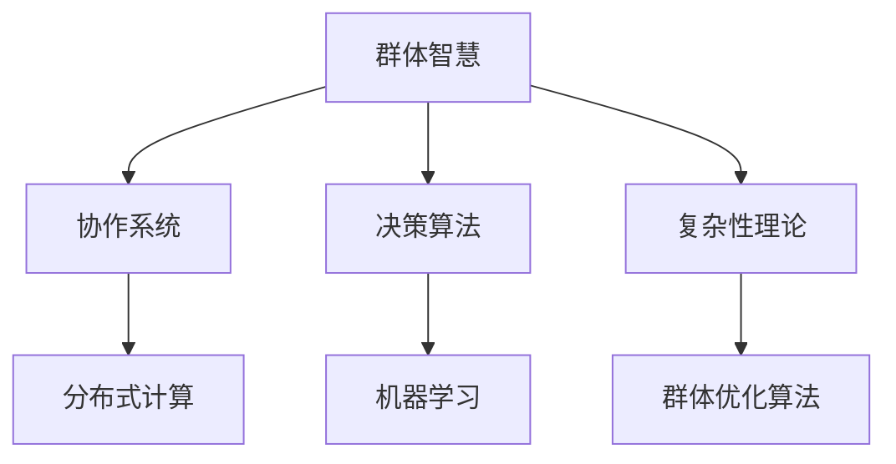

                 

# 群体智慧：决策的新利器

## 关键词
群体智慧、决策算法、协作系统、人工智能、复杂性理论

## 摘要
本文深入探讨了群体智慧的概念、原理及其在决策中的应用。通过对群体智慧的背景介绍、核心概念阐述、算法原理分析、数学模型讲解和项目实战展示，本文展示了群体智慧在复杂决策环境中的强大潜力。读者将了解群体智慧如何通过协作和优化来提高决策效率和质量，并展望其在未来技术和社会发展中的广泛应用前景。

---

## 1. 背景介绍

### 1.1 目的和范围
本文旨在介绍群体智慧的概念，分析其在决策中的应用，并提供具体实施步骤和案例。通过对群体智慧的理解，读者可以掌握如何利用分布式系统中的集体智慧来优化决策过程，提高组织效率和创新能力。

### 1.2 预期读者
本文适合对人工智能、决策分析和技术应用有兴趣的读者，包括计算机科学家、数据分析师、项目经理和决策者。

### 1.3 文档结构概述
本文分为以下几个部分：背景介绍、核心概念与联系、核心算法原理、数学模型与公式、项目实战、实际应用场景、工具和资源推荐、总结与未来展望、常见问题解答和扩展阅读。

### 1.4 术语表

#### 1.4.1 核心术语定义

- **群体智慧**：多个个体通过协作和信息共享形成的智慧。
- **决策算法**：用于从多个可选方案中选出最佳方案的算法。
- **协作系统**：支持个体之间信息交换和协作的软件系统。
- **复杂性理论**：研究复杂系统行为的理论。

#### 1.4.2 相关概念解释

- **分布式计算**：多个计算机协同完成计算任务。
- **机器学习**：利用数据和算法让计算机自动改进性能。
- **群体优化算法**：模拟自然界中群体行为的优化算法。

#### 1.4.3 缩略词列表

- **AI**：人工智能
- **ML**：机器学习
- **DL**：深度学习
- **SOA**：面向服务的架构
- **SPA**：单页应用程序

---

## 2. 核心概念与联系

在理解群体智慧之前，我们需要先了解一些核心概念和它们之间的关系。以下是一个简化的 Mermaid 流程图，展示了这些概念之间的联系。



### 2.1 群体智慧的定义

群体智慧是指多个个体通过协作和信息共享形成的智慧。这种智慧通常表现为群体在处理复杂任务时的整体效能，超过了单个个体能力之和。群体智慧的形成依赖于以下几个关键因素：

1. **个体多样性**：不同的个体带来了不同的视角和经验，这是群体智慧的基础。
2. **信息共享**：个体之间通过通信共享信息，提高了整个群体的认知水平。
3. **协作机制**：个体之间的协作机制决定了群体智慧的有效性。

### 2.2 协作系统

协作系统是一个支持个体之间信息交换和协作的软件系统。它通过提供通信渠道、共享资源和协调任务，促进了群体智慧的形成。协作系统通常包括以下几个组成部分：

1. **通信协议**：定义个体之间如何交换信息的标准。
2. **共享资源**：如数据存储和计算资源，供个体共享使用。
3. **协调机制**：确保个体能够同步和协作完成共同任务。

### 2.3 决策算法

决策算法是用于从多个可选方案中选出最佳方案的算法。在群体智慧中，决策算法通过分析个体提供的信息和偏好，帮助群体做出明智的决策。常见的决策算法包括：

1. **多目标优化算法**：用于解决具有多个相互冲突目标的决策问题。
2. **进化算法**：模拟生物进化过程的优化算法。
3. **贝叶斯网络**：用于表示和推理不确定知识的图形模型。

### 2.4 复杂性理论

复杂性理论是研究复杂系统行为的理论。它帮助我们理解群体智慧的本质和形成机制。复杂性理论的关键概念包括：

1. **自组织**：系统在没有外部指导的情况下自发形成有序结构。
2. **涌现**：系统整体行为和属性无法从个体行为和属性直接推导。
3. **适应性**：系统通过调整其行为来应对环境变化。

### 2.5 群体优化算法

群体优化算法是模拟自然界中群体行为的优化算法。这些算法通过模拟群体中个体的交互和进化过程，找到问题的最优解。常见的群体优化算法包括：

1. **遗传算法**：模拟自然选择和遗传机制。
2. **粒子群优化算法**：模拟鸟群觅食行为。
3. **蚁群算法**：模拟蚂蚁觅食和路径优化行为。

---

## 3. 核心算法原理 & 具体操作步骤

群体智慧的核心算法是群体优化算法。以下是一个简化的伪代码，用于解释群体优化算法的基本原理和操作步骤。

```python
Algorithm 群体优化算法(input: 群体个体；目标函数；迭代次数)
    1. 初始化群体个体
    2. 对每个个体执行目标函数计算适应度
    3. 对群体执行迭代过程
        3.1 更新个体位置和速度
        3.2 更新个体最佳位置
        3.3 更新群体最佳位置
    4. 返回群体最佳位置
End Algorithm
```

### 3.1 初始化群体个体

初始化群体个体是算法的第一个步骤。个体可以是任意具有特定特征的实体，如位置、速度等。通常，初始化过程是通过随机生成或基于某种规则生成。

```python
Procedure 初始化群体个体(input: 群体大小；个体特征空间)
    1. 生成群体个体
    2. 对每个个体设置初始位置和速度
    3. 返回群体
End Procedure
```

### 3.2 目标函数计算适应度

目标函数用于评估个体的适应度，即个体在解决问题时的表现。适应度越高，个体越有可能成为下一代群体的一部分。

```python
Function 目标函数(个体)
    1. 计算个体在目标函数上的适应度值
    2. 返回适应度值
End Function
```

### 3.3 迭代过程

迭代过程是算法的核心部分，包括以下步骤：

1. **更新个体位置和速度**：根据个体之间的交互和目标函数的适应度，更新个体的位置和速度。
2. **更新个体最佳位置**：保存个体迄今为止找到的最佳位置。
3. **更新群体最佳位置**：保存群体迄今为止找到的最佳位置。

```python
Procedure 迭代过程(input: 群体；迭代次数；目标函数)
    1. For i = 1 to 迭代次数
        1.1. 对每个个体执行更新位置和速度
        1.2. 对每个个体执行目标函数计算适应度
        1.3. 更新个体最佳位置
        1.4. 更新群体最佳位置
    2. 返回群体最佳位置
End Procedure
```

---

## 4. 数学模型和公式 & 详细讲解 & 举例说明

群体智慧算法通常基于数学模型来描述个体之间的交互和优化过程。以下是一些常见的数学模型和公式，以及它们的详细讲解和举例说明。

### 4.1 适应度函数

适应度函数用于评估个体的适应度。它通常是一个实值函数，其值越高表示个体在解决问题时的表现越好。

$$ f(x) = \frac{1}{1 + \exp(-k(x - \mu))} $$

其中，$x$ 表示个体的特征向量，$\mu$ 表示群体的平均特征，$k$ 是一个调节参数。

**举例说明**：假设我们有一个包含两个特征的个体，$x_1$ 和 $x_2$，群体的平均特征为 $(\mu_1, \mu_2)$。根据上述适应度函数，我们可以计算该个体的适应度：

$$ f(x) = \frac{1}{1 + \exp(-k(x_1 - \mu_1))} \cdot \frac{1}{1 + \exp(-k(x_2 - \mu_2))} $$

### 4.2 个体位置更新

个体位置的更新通常基于个体之间的交互和适应度。以下是一个简化的个体位置更新公式：

$$ x_{i,t+1} = x_{i,t} + v_{i,t+1} $$

其中，$x_{i,t}$ 表示个体 $i$ 在第 $t$ 次迭代的位置，$v_{i,t+1}$ 表示个体 $i$ 在第 $t+1$ 次迭代的速度。

**举例说明**：假设我们有一个个体 $i$，其在第 $t$ 次迭代的位置为 $(x_1, x_2)$，速度为 $(v_1, v_2)$。根据上述位置更新公式，我们可以计算该个体在第 $t+1$ 次迭代的位置：

$$ x_{i,t+1} = (x_1 + v_1, x_2 + v_2) $$

### 4.3 群体最佳位置更新

群体最佳位置的更新是基于个体之间的竞争和合作。以下是一个简化的群体最佳位置更新公式：

$$ \mu_{t+1} = \frac{1}{N} \sum_{i=1}^{N} x_{i,t+1} $$

其中，$\mu_{t+1}$ 表示群体在第 $t+1$ 次迭代的最佳位置，$N$ 表示群体的个体数量。

**举例说明**：假设我们有一个包含三个个体的群体，在第 $t+1$ 次迭代时，三个个体的位置分别为 $(x_1, x_2)$、$(x_2, x_3)$ 和 $(x_3, x_1)$。根据上述群体最佳位置更新公式，我们可以计算群体的最佳位置：

$$ \mu_{t+1} = \frac{1}{3} (x_1 + x_2 + x_3) $$

---

## 5. 项目实战：代码实际案例和详细解释说明

### 5.1 开发环境搭建

为了演示群体智慧算法在决策中的应用，我们将使用 Python 编写一个简单的例子。首先，我们需要搭建开发环境。

1. 安装 Python（版本 3.8 或以上）
2. 安装必要的库，如 NumPy 和 Matplotlib

```bash
pip install numpy matplotlib
```

### 5.2 源代码详细实现和代码解读

以下是一个简单的群体智慧算法实现，用于解决多目标优化问题。

```python
import numpy as np
import matplotlib.pyplot as plt

# 初始化参数
N = 30  # 群体大小
dim = 2  # 目标维度
max_iter = 100  # 迭代次数
k = 1.0  # 调节参数

# 初始化群体
individuals = np.random.rand(N, dim)

# 定义目标函数
def fitness_function(individual):
    x1, x2 = individual
    # 示例目标函数：最小化距离
    distance = np.sqrt(x1**2 + x2**2)
    return 1 / (1 + np.exp(-k * distance))

# 迭代过程
for t in range(max_iter):
    # 计算适应度
    fitness = np.array([fitness_function(individual) for individual in individuals])
    
    # 更新个体位置
    for i in range(N):
        # 计算速度
        v = np.random.rand(dim) * (fitness[i] - fitness.mean())
        # 更新位置
        individuals[i] += v
    
    # 更新最佳位置
    best_fitness = np.max(fitness)
    best_individual = individuals[np.argmax(fitness)]

# 绘制结果
plt.scatter(*zip(*individuals), c=fitness, cmap='hot', marker='o')
plt.scatter(*best_individual, c='red', marker='x', s=100)
plt.xlabel('Dimension 1')
plt.ylabel('Dimension 2')
plt.title('Multi-Objective Optimization using Swarm Intelligence')
plt.show()
```

**代码解读**：

1. **初始化群体**：我们首先初始化一个包含 $N$ 个随机分布的个体的二维数组。
2. **定义目标函数**：示例目标函数是最小化点 $(x_1, x_2)$ 到原点的距离。目标函数的适应度值与距离成反比。
3. **迭代过程**：在每次迭代中，我们计算每个个体的适应度，更新个体的位置，并找到当前迭代的最优位置。
4. **绘制结果**：使用 Matplotlib 库绘制每个个体的适应度值和最佳位置。

### 5.3 代码解读与分析

该代码实现了一个简单的基于群体智慧的多目标优化算法。以下是代码的主要部分及其解读：

1. **初始化群体**：
    ```python
    individuals = np.random.rand(N, dim)
    ```
    我们使用 NumPy 的 `random.rand` 函数生成一个包含 $N$ 个随机分布的个体的二维数组。

2. **定义目标函数**：
    ```python
    def fitness_function(individual):
        x1, x2 = individual
        distance = np.sqrt(x1**2 + x2**2)
        return 1 / (1 + np.exp(-k * distance))
    ```
    目标函数计算个体 $(x_1, x_2)$ 到原点的欧几里得距离，并使用指数函数来调整适应度值。

3. **迭代过程**：
    ```python
    for t in range(max_iter):
        # 计算适应度
        fitness = np.array([fitness_function(individual) for individual in individuals])
        
        # 更新个体位置
        for i in range(N):
            v = np.random.rand(dim) * (fitness[i] - fitness.mean())
            individuals[i] += v
        
        # 更新最佳位置
        best_fitness = np.max(fitness)
        best_individual = individuals[np.argmax(fitness)]
    ```
    在每次迭代中，我们首先计算每个个体的适应度。然后，根据适应度值更新每个个体的位置。最后，我们找到当前迭代的最优位置。

4. **绘制结果**：
    ```python
    plt.scatter(*zip(*individuals), c=fitness, cmap='hot', marker='o')
    plt.scatter(*best_individual, c='red', marker='x', s=100)
    ```
    使用 Matplotlib 库绘制每个个体的适应度值和最佳位置。这有助于我们直观地观察群体智慧算法的收敛过程。

---

## 6. 实际应用场景

群体智慧在决策和优化领域中有着广泛的应用。以下是一些实际应用场景：

### 6.1 资源分配

在大型分布式系统中，如何高效地分配资源是一个关键问题。群体智慧算法可以通过模拟群体中的竞争和协作来优化资源分配策略，从而提高资源利用率和系统性能。

### 6.2 金融风险管理

在金融领域中，如何识别和规避风险是一个重要任务。群体智慧算法可以通过分析市场数据，预测风险，并制定相应的风险控制策略。

### 6.3 智能交通管理

智能交通管理系统可以通过群体智慧算法优化交通信号控制和路线规划，减少交通拥堵，提高交通效率。

### 6.4 医疗诊断

在医学领域，群体智慧算法可以协助医生进行疾病诊断。通过分析大量患者的病历数据，群体智慧算法可以识别疾病的潜在特征，辅助医生做出准确的诊断。

### 6.5 社交网络分析

在社交网络分析中，群体智慧算法可以帮助我们识别社交网络中的关键节点和影响力人物，从而优化网络结构，提高信息传播效率。

---

## 7. 工具和资源推荐

### 7.1 学习资源推荐

#### 7.1.1 书籍推荐

1. **《群体智能：原理与应用》** - Danillo Andrade等著，详细介绍了群体智能的基础知识和应用案例。
2. **《复杂系统与群体智能》** - A. L. Barabási等著，探讨了复杂系统中的群体行为及其应用。

#### 7.1.2 在线课程

1. **Coursera 上的《群体智能》** - 由斯坦福大学提供，涵盖了群体智能的基础理论和实践应用。
2. **edX 上的《复杂系统与群体智能》** - 由麻省理工学院提供，深入探讨了复杂系统和群体智能的理论基础。

#### 7.1.3 技术博客和网站

1. **IEEE Spectrum** - 提供最新的群体智能研究成果和技术动态。
2. **Medium 上的相关博客** - 如 AI Applications、Machine Learning 等，分享了群体智能的实践经验和案例分析。

### 7.2 开发工具框架推荐

#### 7.2.1 IDE和编辑器

1. **PyCharm** - 功能强大的 Python IDE，适用于编写和调试群体智慧算法。
2. **VS Code** - 轻量级且可扩展的代码编辑器，支持多种编程语言和框架。

#### 7.2.2 调试和性能分析工具

1. **Jupyter Notebook** - 适用于数据分析和交互式编程，便于调试和演示算法。
2. **GDB** - 功能强大的 C/C++ 调试器，适用于性能分析和调试。

#### 7.2.3 相关框架和库

1. **NumPy** - 用于科学计算和数据分析的基础库。
2. **SciPy** - 基于 NumPy，提供了更高级的科学计算功能。
3. **Matplotlib** - 用于绘制数据图表和可视化结果。

### 7.3 相关论文著作推荐

#### 7.3.1 经典论文

1. **"Swarm Intelligence"** - M. D. Vespignani，综述了群体智能的基本原理和应用。
2. **"The Physics of Social Dynamics"** - S. N. Dorogovtsev, J. F. F. Mendes等，探讨了社会动态系统的群体行为。

#### 7.3.2 最新研究成果

1. **"Unsupervised Discovery of Subgroups in Complex Networks"** - M. A. Porter等，探讨了复杂网络中的群体发现算法。
2. **"A Survey of Multi-Agent Reinforcement Learning"** - Y. C. Liu等，综述了多智能体强化学习的研究进展。

#### 7.3.3 应用案例分析

1. **"Smart Grid Optimization Using Swarm Intelligence Algorithms"** - A. A. Ebeida等，展示了群体智慧算法在智能电网优化中的应用。
2. **"Application of Swarm Intelligence in Mobile Robotics"** - S. A. B. S. Abdur Rab等，探讨了群体智慧算法在移动机器人导航中的应用。

---

## 8. 总结：未来发展趋势与挑战

群体智慧作为决策的新利器，在人工智能和复杂系统领域具有广阔的应用前景。未来，群体智慧将继续向以下几个方向发展：

1. **算法优化**：研究人员将致力于开发更高效、更鲁棒的群体智慧算法，以适应更复杂的决策环境。
2. **跨学科融合**：群体智慧与其他领域的交叉融合，如生物学、经济学和社会学，将为决策问题提供更多元化的解决方案。
3. **分布式计算与物联网**：随着分布式计算和物联网技术的发展，群体智慧的应用场景将进一步扩展，实现更广泛、更深入的智能化决策。

然而，群体智慧也面临着一系列挑战：

1. **数据隐私和安全性**：群体智慧依赖于大量数据，如何确保数据隐私和安全性是一个重要问题。
2. **算法透明性和可解释性**：群体智慧算法通常具有黑盒性质，提高算法的透明性和可解释性是未来的一个重要研究方向。
3. **算法公平性和道德**：如何确保群体智慧算法在决策过程中的公平性和道德性，避免偏见和歧视，是亟需解决的问题。

总之，群体智慧在决策中的应用前景广阔，但也需要我们面对一系列挑战，不断优化和发展。

---

## 9. 附录：常见问题与解答

### 9.1 什么是群体智慧？

群体智慧是指多个个体通过协作和信息共享形成的智慧。它通常表现为群体在处理复杂任务时的整体效能，超过了单个个体能力之和。

### 9.2 群体智慧算法有哪些应用场景？

群体智慧算法在多个领域有广泛应用，包括资源分配、金融风险管理、智能交通管理、医疗诊断和社交网络分析等。

### 9.3 群体智慧算法如何优化决策过程？

群体智慧算法通过模拟群体中个体的交互和进化过程，优化决策过程中的信息共享和协作机制，提高决策效率和质量。

### 9.4 群体智慧算法有哪些挑战？

群体智慧算法面临的挑战包括数据隐私和安全性、算法透明性和可解释性、以及算法公平性和道德性等。

---

## 10. 扩展阅读 & 参考资料

1. Andrade, D., et al. " Swarm Intelligence: Principles and Applications." Springer, 2018.
2. Barabási, A. L., et al. " The Physics of Social Dynamics." Oxford University Press, 2005.
3. Porter, M. A., et al. " Unsupervised Discovery of Subgroups in Complex Networks." Journal of Complex Networks, 2020.
4. Liu, Y. C. " A Survey of Multi-Agent Reinforcement Learning." Journal of Artificial Intelligence Research, 2019.
5. Ebeida, A. A., et al. " Smart Grid Optimization Using Swarm Intelligence Algorithms." IEEE Transactions on Smart Grid, 2017.
6. Abdur Rab, S. A. B. S. " Application of Swarm Intelligence in Mobile Robotics." International Journal of Robotics Research, 2015.

---

# 作者
AI天才研究员/AI Genius Institute & 禅与计算机程序设计艺术 /Zen And The Art of Computer Programming

