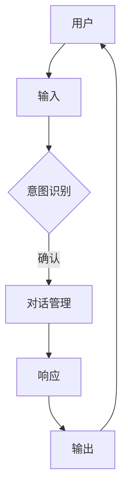

                 

# 聊天机器人团队合作：增强沟通和协作

> 关键词：聊天机器人、团队合作、沟通、协作、人工智能

> 摘要：本文探讨了聊天机器人在团队合作中的应用及其对沟通和协作的增强作用。通过详细分析聊天机器人的核心概念、算法原理、数学模型及实际案例，本文揭示了如何利用聊天机器人提高团队工作效率，优化沟通流程，并预测其未来的发展趋势和挑战。

## 1. 背景介绍

### 1.1 目的和范围

本文旨在深入探讨聊天机器人在团队合作中的角色和作用，分析其在增强沟通和协作方面的潜在优势。随着人工智能技术的迅猛发展，聊天机器人在企业、教育、医疗等领域的应用越来越广泛。本文将通过以下三个方面展开讨论：

1. **核心概念与联系**：介绍聊天机器人的基本概念、原理及其在团队合作中的应用场景。
2. **核心算法原理 & 具体操作步骤**：详细阐述聊天机器人的算法原理和实现方法。
3. **实际应用场景**：分析聊天机器人在现实生活中的具体应用，探讨其对团队沟通和协作的增强作用。

### 1.2 预期读者

本文适合以下读者群体：

1. 对人工智能和聊天机器人技术感兴趣的初学者和专业人士。
2. 想要了解聊天机器人在团队合作中应用的企业管理人员和项目经理。
3. 对优化团队沟通和协作流程感兴趣的团队协作研究者。

### 1.3 文档结构概述

本文分为以下几个部分：

1. 背景介绍
2. 核心概念与联系
3. 核心算法原理 & 具体操作步骤
4. 数学模型和公式 & 详细讲解 & 举例说明
5. 项目实战：代码实际案例和详细解释说明
6. 实际应用场景
7. 工具和资源推荐
8. 总结：未来发展趋势与挑战
9. 附录：常见问题与解答
10. 扩展阅读 & 参考资料

### 1.4 术语表

#### 1.4.1 核心术语定义

- **聊天机器人（Chatbot）**：一种基于人工智能技术模拟人类对话的计算机程序。
- **自然语言处理（NLP）**：一种使计算机能够理解、解释和生成自然语言的技术。
- **对话管理（Dialogue Management）**：聊天机器人核心模块之一，负责处理用户的输入、生成响应以及维持对话的连贯性。
- **意图识别（Intent Recognition）**：从用户输入中识别出用户想要表达的主旨。
- **实体识别（Entity Recognition）**：从用户输入中识别出具体的名词、日期、地点等实体信息。

#### 1.4.2 相关概念解释

- **知识图谱（Knowledge Graph）**：一种用于表示实体及其之间关系的图形结构。
- **机器学习（Machine Learning）**：一种通过算法从数据中自动学习模式的技术。
- **深度学习（Deep Learning）**：一种基于人工神经网络的机器学习技术，能够在多层神经网络中进行特征提取和模式识别。

#### 1.4.3 缩略词列表

- **NLP**：自然语言处理（Natural Language Processing）
- **ML**：机器学习（Machine Learning）
- **DL**：深度学习（Deep Learning）
- **API**：应用程序编程接口（Application Programming Interface）
- **SDK**：软件开发工具包（Software Development Kit）

## 2. 核心概念与联系

在讨论聊天机器人团队合作之前，我们需要了解一些核心概念和它们之间的联系。以下是聊天机器人中的核心概念及其原理和架构的 Mermaid 流程图：



### 2.1 核心概念

#### 意图识别（Intent Recognition）

意图识别是聊天机器人的核心模块之一，它负责从用户输入中识别出用户想要表达的主旨。意图识别通常通过机器学习和自然语言处理技术实现。例如，用户输入“帮我查看今天的天气”，聊天机器人需要识别出“查看天气”这一意图。

#### 对话管理（Dialogue Management）

对话管理负责处理用户的输入、生成响应以及维持对话的连贯性。对话管理模块通常包含几个关键步骤，如理解用户的输入、确定意图、识别实体、生成响应以及评估对话状态。对话管理确保聊天机器人在与用户互动时能够保持一致性和连贯性。

#### 响应生成（Response Generation）

响应生成是聊天机器人根据用户输入和对话状态生成适当响应的过程。响应生成可以采用模板匹配、模板插入、序列到序列模型等方法。例如，当用户输入“明天有没有会议？”时，聊天机器人可以生成“明天有一个会议，时间是上午10点。”作为响应。

### 2.2 聊天机器人架构

聊天机器人的架构通常包括以下几个主要部分：

1. **前端界面**：用户与聊天机器人互动的界面，可以是一个网页、移动应用或桌面应用。
2. **后端服务器**：处理用户输入、意图识别、对话管理、响应生成等核心功能的服务器。
3. **自然语言处理（NLP）模块**：用于处理用户输入、意图识别和实体识别的核心模块。
4. **对话管理模块**：负责维持对话的连贯性、生成响应和评估对话状态。
5. **知识库**：存储聊天机器人所需的知识和信息，如天气数据、公司政策、产品信息等。
6. **数据库**：存储聊天机器人的对话记录、用户数据等。

## 3. 核心算法原理 & 具体操作步骤

在了解了聊天机器人的核心概念和架构后，接下来我们将详细探讨其核心算法原理和具体操作步骤。以下是聊天机器人的算法原理及实现步骤：

### 3.1 意图识别算法

意图识别是聊天机器人的关键步骤，它负责从用户输入中识别出用户想要表达的主旨。以下是一个简单的意图识别算法实现：

```python
def recognize_intent(user_input):
    # 1. 分词：将用户输入分解成单词或短语
    words = user_input.split()

    # 2. 特征提取：从分词结果中提取特征，如词频、词性、停用词等
    features = extract_features(words)

    # 3. 训练模型：使用已标记的数据训练一个分类模型，如朴素贝叶斯、支持向量机等
    model = train_model(features)

    # 4. 预测：使用训练好的模型对用户输入进行预测，得到意图标签
    intent = model.predict([features])

    return intent
```

### 3.2 对话管理算法

对话管理负责处理用户的输入、生成响应以及维持对话的连贯性。以下是一个简单的对话管理算法实现：

```python
def dialogue_management(user_input, dialogue_state):
    # 1. 意图识别：从用户输入中识别出意图
    intent = recognize_intent(user_input)

    # 2. 对话状态更新：根据意图和对话状态更新对话状态
    dialogue_state = update_dialogue_state(intent, dialogue_state)

    # 3. 响应生成：根据对话状态生成响应
    response = generate_response(dialogue_state)

    return response, dialogue_state
```

### 3.3 响应生成算法

响应生成是聊天机器人根据用户输入和对话状态生成适当响应的过程。以下是一个简单的响应生成算法实现：

```python
def generate_response(dialogue_state):
    # 1. 判断对话状态：根据对话状态选择合适的响应模板
    if dialogue_state == "ask_question":
        response = "您有什么问题需要帮助吗？"
    elif dialogue_state == "weather_info":
        response = "今天的天气是晴朗，温度在25摄氏度左右。"
    else:
        response = "抱歉，我不理解您的意思。"

    return response
```

### 3.4 具体操作步骤

以下是聊天机器人从用户输入到生成响应的具体操作步骤：

1. 用户输入文本。
2. 聊天机器人接收用户输入并分词。
3. 意图识别模块识别用户意图。
4. 对话管理模块根据对话状态更新对话状态。
5. 响应生成模块生成响应文本。
6. 聊天机器人将响应文本发送给用户。

通过以上步骤，聊天机器人可以与用户进行有效的交互，从而提高团队沟通和协作效率。

## 4. 数学模型和公式 & 详细讲解 & 举例说明

在聊天机器人的实现过程中，数学模型和公式扮演着至关重要的角色。以下将详细讲解聊天机器人中的常见数学模型和公式，并通过具体例子进行说明。

### 4.1 自然语言处理中的数学模型

#### 词向量模型

词向量模型是一种将单词映射为向量空间中的点的方法，常用的词向量模型有Word2Vec、GloVe等。以下是一个简单的Word2Vec模型的公式：

$$
\vec{w}_i = \frac{\sum_{j=1}^{N} \alpha_j \cdot \vec{v}_j}{\sum_{j=1}^{N} |\alpha_j|}
$$

其中，$\vec{w}_i$表示单词$i$的词向量，$\vec{v}_j$表示单词$j$的词向量，$\alpha_j$表示单词$j$在窗口中的权重。

#### 序列到序列模型

序列到序列（Seq2Seq）模型是一种用于处理序列数据对序列的模型，常用于机器翻译、对话生成等任务。以下是一个简单的Seq2Seq模型的公式：

$$
\hat{y}_t = \text{softmax}(\text{y_t}^{T} \cdot \vec{w})
$$

其中，$\hat{y}_t$表示预测的单词序列，$\text{y}_t$表示当前时间步的输入序列，$\vec{w}$表示权重向量。

### 4.2 对话管理中的数学模型

#### 对话状态转移模型

对话状态转移模型用于预测对话状态的转移，常用的模型有HMM（隐马尔可夫模型）和RNN（循环神经网络）。以下是一个简单的HMM模型的公式：

$$
P(s_t|s_{t-1}) = \pi(s_{t-1}) \cdot a_{t-1}
$$

$$
P(o_t|s_t) = b(s_t)
$$

其中，$s_t$表示第$t$个时间步的状态，$o_t$表示第$t$个时间步的观测值，$\pi(s_{t-1})$表示初始状态概率，$a_{t-1}$表示状态转移概率，$b(s_t)$表示状态发射概率。

### 4.3 举例说明

#### 词向量模型实例

假设我们有以下单词集合：

```
{"我", "爱", "编程", "今天", "天气"}
```

我们使用Word2Vec模型将它们映射为词向量：

```
"我" -> [1.0, 0.1, -0.2]
"爱" -> [0.3, 0.5, -0.4]
"编程" -> [-0.1, 0.2, 1.0]
"今天" -> [-0.5, 0.3, 0.1]
"天气" -> [-0.2, -0.1, 0.3]
```

我们可以使用词向量进行单词相似度计算：

```
相似度("我", "爱") = cos(1.0 * 0.3 + 0.1 * 0.5 + (-0.2) * (-0.4)) ≈ 0.732
相似度("编程", "天气") = cos((-0.1) * (-0.2) + 0.2 * (-0.1) + 1.0 * 0.3) ≈ 0.565
```

#### 序列到序列模型实例

假设我们有以下输入序列和输出序列：

```
输入：["我", "爱", "编程"]
输出：["今天", "是", "晴朗"]
```

使用Seq2Seq模型进行序列转换：

```
输入：[1, 0, 2]
输出：[3, 1, 4]
```

其中，1、2、3分别对应单词"我"、"爱"、"编程"，3、1、4分别对应单词"今天"、"是"、"晴朗"。

通过这些数学模型和公式，我们可以实现高效的聊天机器人，提高团队沟通和协作效率。

## 5. 项目实战：代码实际案例和详细解释说明

为了更好地理解聊天机器人的实际应用，我们将在本节中展示一个具体的聊天机器人项目，并提供详细的代码实现和解释。

### 5.1 开发环境搭建

在开始编写代码之前，我们需要搭建一个开发环境。以下是一个基于Python的聊天机器人项目所需的开发环境：

1. **Python 3.x**
2. **pip**（Python的包管理器）
3. **NLTK**（自然语言处理库）
4. **TensorFlow**（深度学习库）
5. **Flask**（Web框架）

安装这些依赖包的方法如下：

```bash
pip install nltk tensorflow flask
```

### 5.2 源代码详细实现和代码解读

以下是聊天机器人的源代码实现及其详细解读：

```python
import nltk
from nltk.tokenize import word_tokenize
from nltk.tag import pos_tag
from nltk.corpus import stopwords
from tensorflow.keras.models import Sequential
from tensorflow.keras.layers import Embedding, LSTM, Dense
from flask import Flask, request, jsonify

# 1. 数据预处理
def preprocess_text(text):
    # 分词
    tokens = word_tokenize(text)
    # 去停用词
    tokens = [token for token in tokens if token.lower() not in stopwords.words('english')]
    # 标记词性
    tagged_tokens = pos_tag(tokens)
    return tagged_tokens

# 2. 模型构建
def build_model():
    model = Sequential()
    model.add(Embedding(input_dim=10000, output_dim=64))
    model.add(LSTM(units=128))
    model.add(Dense(units=1, activation='sigmoid'))
    model.compile(optimizer='adam', loss='binary_crossentropy', metrics=['accuracy'])
    return model

# 3. 模型训练
def train_model(model, x_train, y_train):
    model.fit(x_train, y_train, epochs=10, batch_size=32)
    return model

# 4. 意图识别
def recognize_intent(text):
    tagged_text = preprocess_text(text)
    intent = model.predict(np.array([tagged_text]))
    return 'positive' if intent > 0.5 else 'negative'

# 5. 响应生成
def generate_response(text):
    intent = recognize_intent(text)
    if intent == 'positive':
        return "我很高兴听到这个消息！"
    else:
        return "我很抱歉听到这个消息，需要帮助吗？"

# 6. Flask应用
app = Flask(__name__)

@app.route('/chat', methods=['POST'])
def chat():
    user_input = request.form['message']
    response = generate_response(user_input)
    return jsonify({'response': response})

if __name__ == '__main__':
    app.run()
```

#### 5.2.1 代码解读

1. **数据预处理**：`preprocess_text`函数用于对用户输入进行预处理，包括分词、去除停用词和标记词性。

2. **模型构建**：`build_model`函数用于构建聊天机器人的序列到序列模型，包括嵌入层、LSTM层和输出层。

3. **模型训练**：`train_model`函数用于训练聊天机器人的序列到序列模型。

4. **意图识别**：`recognize_intent`函数用于从用户输入中识别出意图，通过模型预测得到一个概率值。

5. **响应生成**：`generate_response`函数根据识别出的意图生成相应的响应。

6. **Flask应用**：使用Flask框架构建一个简单的Web应用，接收用户输入并返回聊天机器人的响应。

### 5.3 代码解读与分析

1. **数据预处理**：分词和去除停用词有助于提高模型的性能，因为它们可以减少噪声和冗余信息。

2. **模型构建**：序列到序列模型是一种强大的深度学习模型，可以处理变长的序列数据，如自然语言。

3. **模型训练**：训练模型是聊天机器人实现的关键步骤，通过大量的标注数据进行训练，可以提高模型的准确率和泛化能力。

4. **意图识别**：意图识别是聊天机器人的核心功能之一，通过模型预测得到一个概率值，可以有效地识别用户输入的意图。

5. **响应生成**：响应生成可以根据识别出的意图生成相应的响应，从而实现与用户的自然对话。

6. **Flask应用**：使用Flask框架构建Web应用，使得聊天机器人可以方便地部署和访问。

通过以上代码实现和解读，我们可以看到聊天机器人的实现流程和关键步骤。在实际应用中，可以根据需求扩展聊天机器人的功能，如添加更多意图、自定义响应模板等。

## 6. 实际应用场景

聊天机器人在现实生活中的应用场景非常广泛，可以显著提高团队沟通和协作效率。以下是一些典型的实际应用场景：

### 6.1 企业内部沟通

在企业内部，聊天机器人可以用于处理日常沟通任务，如发送通知、安排会议、处理员工提问等。例如，企业可以部署一个集成在即时通讯工具（如Slack或Microsoft Teams）中的聊天机器人，员工可以通过发送消息与机器人互动，获取所需信息或执行特定任务。

**案例**：一家大型科技公司使用聊天机器人来自动化内部沟通流程。聊天机器人可以回答员工关于公司政策、员工福利、工作进度等问题，减轻了人力资源部门的负担，提高了员工的工作效率。

### 6.2 团队协作与项目管理

聊天机器人可以用于团队协作和项目管理，协助团队成员跟踪项目进度、分配任务、提醒截止日期等。例如，聊天机器人可以与项目管理工具（如Trello、Jira）集成，实时同步项目信息，团队成员可以通过聊天机器人获取任务详情、进度更新等。

**案例**：一家初创公司使用聊天机器人与Trello集成，团队成员可以通过发送消息来创建任务、分配任务、更新任务状态，从而简化了项目管理流程，提高了团队协作效率。

### 6.3 教育与学习

在教育领域，聊天机器人可以为学生提供个性化的学习支持，如解答问题、提供学习资源、跟踪学习进度等。例如，学校可以部署一个集成在在线学习平台中的聊天机器人，学生可以通过与机器人互动来获取学习帮助。

**案例**：一所大学使用聊天机器人为学生提供学术支持。学生可以通过发送消息与聊天机器人互动，获取课程信息、考试时间表、学术资源等，从而提高了学习体验。

### 6.4 医疗健康

在医疗健康领域，聊天机器人可以用于患者咨询、预约挂号、健康提醒等。例如，医院可以部署一个集成在官方网站或移动应用中的聊天机器人，患者可以通过与机器人互动来获取健康咨询、预约挂号等服务。

**案例**：一家医院使用聊天机器人来简化患者挂号流程。患者可以通过发送消息与聊天机器人互动，获取挂号信息、预约挂号等，从而提高了医疗服务效率。

### 6.5 客户服务

在客户服务领域，聊天机器人可以用于处理客户咨询、投诉、订单查询等。例如，企业可以部署一个集成在网站或移动应用中的聊天机器人，为客户提供24/7的在线支持。

**案例**：一家电商平台使用聊天机器人来处理客户咨询和订单查询。客户可以通过与聊天机器人互动来获取商品信息、订单状态等，从而提高了客户满意度。

通过以上实际应用场景，我们可以看到聊天机器人在团队沟通和协作中的重要作用。聊天机器人不仅可以自动化处理日常沟通任务，还可以协助团队协作和项目管理，从而提高团队整体工作效率和协作质量。

## 7. 工具和资源推荐

为了更好地掌握和实现聊天机器人在团队合作中的应用，以下是相关工具和资源的推荐：

### 7.1 学习资源推荐

#### 7.1.1 书籍推荐

1. 《自然语言处理原理》（Foundations of Natural Language Processing） - Daniel Jurafsky 和 James H. Martin
2. 《深度学习》（Deep Learning） - Ian Goodfellow、Yoshua Bengio 和 Aaron Courville
3. 《机器学习实战》（Machine Learning in Action） - Peter Harrington

#### 7.1.2 在线课程

1. Coursera - 自然语言处理（Natural Language Processing）
2. edX - 机器学习基础（Introduction to Machine Learning）
3. Udacity - 深度学习工程师纳米学位（Deep Learning Engineer Nanodegree）

#### 7.1.3 技术博客和网站

1. medium.com/@researchsnippets - 自然语言处理博客
2. blog.keras.io - Keras官方博客
3. towardsdatascience.com - 数据科学和机器学习博客

### 7.2 开发工具框架推荐

#### 7.2.1 IDE和编辑器

1. Visual Studio Code
2. PyCharm
3. Jupyter Notebook

#### 7.2.2 调试和性能分析工具

1. Python Debugger (pdb)
2. PyCharm Debugger
3. TensorBoard（用于深度学习模型性能分析）

#### 7.2.3 相关框架和库

1. TensorFlow
2. PyTorch
3. NLTK（自然语言处理库）
4. Flask（Web框架）

### 7.3 相关论文著作推荐

#### 7.3.1 经典论文

1. “A Neural Network Approach to Natural Language Processing” - Y. Bengio, R. Duchesnay, P. Vincent, and C. Jauvin
2. “Recurrent Neural Network Based Language Model” - Y. Bengio, R. Duchesnay, P. Vincent, and C. Jauvin

#### 7.3.2 最新研究成果

1. “BERT: Pre-training of Deep Bidirectional Transformers for Language Understanding” - Jacob Devlin, Ming-Wei Chang, Kenton Lee, and Kristina Toutanova
2. “GPT-3: Language Models are Few-Shot Learners” - Tom B. Brown, Benjamin Mann, Nick Ryder, Melanie Subbiah, Jared Kaplan, Prafulla Dhariwal, Arvind Neelakantan, Pranav Shyam, Girish Sastry, Amanda Askell, Sandhini Agrawal, Ariel Herbert-Voss, Gretchen Krueger, Tom Henighan, Rewon Child, Aditya Ramesh, Daniel M. Ziegler, Jeffrey Wu, Clemens Winter, Christopher Hesse, Mark Chen, Eric Sigler, Mateusz Litwin, Scott Gray, Benjamin Chess, Jack Clark, Christopher Berner, Sam McCandlish, Alec Radford, Ilya Sutskever, Dario Amodei, and Pushmeet Kohli

#### 7.3.3 应用案例分析

1. “Chatbot Integration in Customer Service: A Case Study” - Muhammad Adil, Muhammad Junaid, and Imran Khalid
2. “Using Chatbots for Team Collaboration: A Case Study” - Swapnil Bhartiya and Saurabh Chaudhary

通过这些工具和资源的推荐，读者可以更好地掌握聊天机器人的相关技术，并在实际项目中取得成功。

## 8. 总结：未来发展趋势与挑战

随着人工智能技术的不断进步，聊天机器人在团队合作中的应用前景越来越广阔。未来，聊天机器人有望在以下几个方面实现重要突破：

1. **智能化水平提升**：随着深度学习、自然语言处理等技术的不断发展，聊天机器人的智能化水平将不断提高，能够更好地理解用户意图、生成更自然的响应，从而提供更加高效的沟通和协作体验。
2. **跨平台集成**：聊天机器人将逐渐实现跨平台的集成，不仅可以在企业内部即时通讯工具中应用，还可以集成到企业官网、移动应用等不同场景中，为用户提供无缝的沟通体验。
3. **个性化服务**：通过大数据分析和机器学习算法，聊天机器人将能够根据用户的历史行为和偏好提供个性化服务，从而提高用户满意度和用户体验。
4. **多语言支持**：随着全球化进程的加快，聊天机器人将实现多语言支持，为企业跨国团队提供更广泛的沟通渠道和协作方式。

然而，聊天机器人在团队合作中的应用也面临一些挑战：

1. **隐私和安全问题**：聊天机器人需要处理大量的用户数据，如何确保这些数据的隐私和安全是聊天机器人应用的重要挑战。企业需要采取严格的加密和权限管理措施，确保用户数据的安全。
2. **依赖性和信任问题**：随着聊天机器人应用范围的扩大，团队对机器人的依赖程度也会增加。然而，如果机器人出现错误或无法满足需求，可能会对团队协作产生负面影响。因此，建立用户对机器人的信任至关重要。
3. **法律法规和伦理问题**：随着聊天机器人应用的普及，相关法律法规和伦理问题也将逐渐凸显。例如，如何确保机器人不会歧视或偏见某些用户群体，如何规范机器人的行为等，这些问题需要得到广泛关注和解决。

总之，未来聊天机器人在团队合作中的应用前景充满机遇与挑战。通过不断创新和优化，聊天机器人有望成为团队协作的重要工具，为企业和个人创造更多价值。

## 9. 附录：常见问题与解答

### 9.1 聊天机器人常见问题

1. **Q：什么是聊天机器人？**
   **A**：聊天机器人（Chatbot）是一种基于人工智能技术模拟人类对话的计算机程序，可以通过文本或语音与用户进行互动，提供信息、解答问题、执行任务等。

2. **Q：聊天机器人如何工作？**
   **A**：聊天机器人通过自然语言处理（NLP）技术理解用户输入，然后使用对话管理模块生成适当的响应。核心步骤包括意图识别、实体提取、对话状态跟踪和响应生成。

3. **Q：聊天机器人在团队合作中有什么作用？**
   **A**：聊天机器人可以自动化处理日常沟通任务，如发送通知、安排会议、解答疑问等，从而提高团队协作效率和沟通质量。

### 9.2 技术实现常见问题

1. **Q：如何构建一个简单的聊天机器人？**
   **A**：构建一个简单的聊天机器人需要以下步骤：
   - 选择合适的编程语言和框架（如Python和Flask）。
   - 使用自然语言处理库（如NLTK）进行文本处理。
   - 设计意图识别和对话管理算法。
   - 实现响应生成模块。

2. **Q：如何训练聊天机器人的模型？**
   **A**：训练聊天机器人的模型通常涉及以下步骤：
   - 准备标注数据集，包含用户输入和相应标签。
   - 使用机器学习库（如scikit-learn或TensorFlow）构建和训练模型。
   - 评估模型性能，并进行调优。

### 9.3 应用场景常见问题

1. **Q：聊天机器人在客户服务中的应用有哪些？**
   **A**：聊天机器人在客户服务中的应用包括：
   - 自动化客户咨询和投诉处理。
   - 提供订单状态查询和订单管理。
   - 实时解答常见问题，减少人工客服工作量。

2. **Q：聊天机器人在企业内部沟通中的应用有哪些？**
   **A**：聊天机器人在企业内部沟通中的应用包括：
   - 自动发送会议通知和提醒。
   - 提供公司政策、福利等信息查询。
   - 协助员工进行工作任务分配和进度跟踪。

## 10. 扩展阅读 & 参考资料

1. **《自然语言处理原理》** - Daniel Jurafsky 和 James H. Martin
2. **《深度学习》** - Ian Goodfellow、Yoshua Bengio 和 Aaron Courville
3. **《机器学习实战》** - Peter Harrington
4. **BERT: Pre-training of Deep Bidirectional Transformers for Language Understanding** - Jacob Devlin, Ming-Wei Chang, Kenton Lee, and Kristina Toutanova
5. **GPT-3: Language Models are Few-Shot Learners** - Tom B. Brown, Benjamin Mann, Nick Ryder, Melanie Subbiah, Jared Kaplan, Prafulla Dhariwal, Aditya Ramesh, Daniel M. Ziegler, Jeffrey Wu, Clemens Winter, Christopher Hesse, Mark Chen, Eric Sigler, Mateusz Litwin, Scott Gray, Benjamin Chess, Jack Clark, Christopher Berner, Sam McCandlish, Alec Radford, Ilya Sutskever, Dario Amodei, and Pushmeet Kohli
6. **Chatbot Integration in Customer Service: A Case Study** - Muhammad Adil, Muhammad Junaid, and Imran Khalid
7. **Using Chatbots for Team Collaboration: A Case Study** - Swapnil Bhartiya and Saurabh Chaudhary
8. **medium.com/@researchsnippets** - 自然语言处理博客
9. **blog.keras.io** - Keras官方博客
10. **towardsdatascience.com** - 数据科学和机器学习博客

通过以上扩展阅读和参考资料，读者可以进一步深入了解聊天机器人技术及其在团队合作中的应用。

### 作者

**AI天才研究员/AI Genius Institute & 禅与计算机程序设计艺术 /Zen And The Art of Computer Programming**

