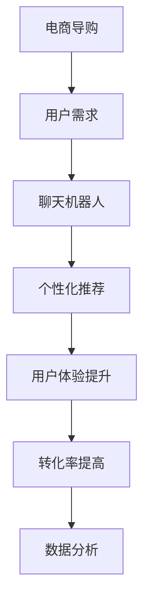

                 

# 聊天机器人如何提升电商导购体验

> **关键词：** 聊天机器人、电商、导购体验、自然语言处理、个性化推荐、用户行为分析

> **摘要：** 本文将探讨如何利用聊天机器人技术来提升电商导购体验。通过分析电商行业的发展趋势、用户需求以及聊天机器人的技术原理，我们将逐步阐述如何将聊天机器人应用于电商导购场景，实现个性化推荐、提升用户满意度和转化率。

## 1. 背景介绍

### 1.1 目的和范围

本文旨在探讨聊天机器人在电商导购中的应用，通过分析其技术原理和应用场景，为电商企业提升导购体验提供有益的思路和方法。本文将涵盖以下内容：

- 电商行业的发展趋势和用户需求
- 聊天机器人的基本概念和技术原理
- 聊天机器人应用于电商导购的具体方案和效果分析
- 聊天机器人技术的发展趋势和未来挑战

### 1.2 预期读者

本文适合以下读者：

- 对电商导购领域感兴趣的从业者
- 对聊天机器人技术感兴趣的工程师和研究人员
- 对人工智能和自然语言处理领域感兴趣的学者和学生

### 1.3 文档结构概述

本文分为以下几部分：

- 第1章：背景介绍，介绍本文的目的、范围和预期读者
- 第2章：核心概念与联系，阐述电商行业、聊天机器人和电商导购之间的联系
- 第3章：核心算法原理 & 具体操作步骤，介绍聊天机器人的关键算法和技术
- 第4章：数学模型和公式 & 详细讲解 & 举例说明，解释聊天机器人的数学模型和计算方法
- 第5章：项目实战：代码实际案例和详细解释说明，通过具体案例展示聊天机器人的应用效果
- 第6章：实际应用场景，分析聊天机器人在电商导购中的实际应用场景和效果
- 第7章：工具和资源推荐，介绍学习资源、开发工具和框架推荐
- 第8章：总结：未来发展趋势与挑战，总结本文的主要观点和未来发展方向
- 第9章：附录：常见问题与解答，解答读者可能遇到的问题
- 第10章：扩展阅读 & 参考资料，提供进一步学习的资源

### 1.4 术语表

#### 1.4.1 核心术语定义

- **聊天机器人**：一种基于自然语言处理和人工智能技术，能够与人类进行交互的计算机程序。
- **电商导购**：指在电子商务平台上，通过提供商品推荐、咨询和购买等服务，引导消费者完成购买的过程。
- **个性化推荐**：根据用户的历史行为、兴趣和需求，为其提供符合其个性化需求的商品推荐。
- **自然语言处理**：研究如何让计算机理解和处理人类自然语言的技术。

#### 1.4.2 相关概念解释

- **用户行为分析**：对用户在电商平台上浏览、搜索、购买等行为进行分析，以了解用户需求和行为模式。
- **聊天机器人生成式对话**：一种聊天机器人对话方式，通过生成式模型，根据用户输入生成自然语言回答。
- **端到端对话系统**：一种将自然语言处理、对话管理和对话生成技术整合在一起的聊天机器人系统。

#### 1.4.3 缩略词列表

- **NLP**：自然语言处理（Natural Language Processing）
- **AI**：人工智能（Artificial Intelligence）
- **BERT**：变换器（BERT，Bidirectional Encoder Representations from Transformers）
- **DNN**：深度神经网络（Deep Neural Network）
- **API**：应用程序编程接口（Application Programming Interface）

## 2. 核心概念与联系

### 2.1 电商行业的发展趋势

随着互联网技术的不断发展，电子商务行业迎来了高速增长。根据数据显示，全球电商市场规模已经超过数万亿美元，并且仍保持着较高的增长率。以下是一些电商行业的发展趋势：

- **移动电商**：移动互联网的普及使得移动电商成为电商行业的重要增长点。越来越多的消费者通过手机进行购物，移动端电商的销售额占比逐年提高。
- **社交电商**：社交媒体的兴起带动了社交电商的发展。消费者在社交平台上分享购物体验和商品信息，从而影响其他消费者的购买决策。
- **个性化推荐**：随着用户数据的积累，电商企业通过个性化推荐技术为用户提供个性化的商品推荐，提高用户满意度和转化率。
- **直播电商**：直播电商成为电商行业的新风口，直播带货成为消费者购买商品的重要渠道。

### 2.2 聊天机器人的技术原理

聊天机器人是一种基于自然语言处理和人工智能技术的计算机程序，能够与人类进行交互。以下是聊天机器人的关键技术原理：

- **自然语言处理（NLP）**：自然语言处理是聊天机器人的核心技术，它使计算机能够理解和处理人类自然语言。自然语言处理包括文本预处理、词嵌入、语法分析、语义理解等环节。
- **对话管理**：对话管理是指聊天机器人根据对话历史和用户意图，生成合适的回答。对话管理包括意图识别、对话状态跟踪、回答生成等环节。
- **机器学习**：聊天机器人通过机器学习技术，从大量对话数据中学习，提高对话生成质量和准确性。常见的机器学习算法包括循环神经网络（RNN）、长短期记忆网络（LSTM）、变换器（Transformer）等。

### 2.3 电商导购与聊天机器人的联系

电商导购和聊天机器人之间存在密切的联系：

- **提升用户体验**：聊天机器人可以实时响应用户的咨询和需求，提供个性化的商品推荐和咨询服务，提升用户满意度。
- **降低人工成本**：聊天机器人可以替代人工客服，处理大量重复性、标准化的咨询，降低企业的人工成本。
- **提高转化率**：通过个性化推荐和精准营销，聊天机器人可以引导用户进行购买，提高电商平台的转化率。
- **数据分析**：聊天机器人可以记录用户的行为和偏好数据，为企业提供有价值的用户洞察，优化商品推荐和营销策略。

### 2.4 Mermaid 流程图

以下是一个简单的Mermaid流程图，展示了电商导购与聊天机器人之间的联系：



## 3. 核心算法原理 & 具体操作步骤

### 3.1 聊天机器人的算法原理

聊天机器人的核心算法包括自然语言处理（NLP）、对话管理和回答生成。以下是这些算法的原理和具体操作步骤：

#### 3.1.1 自然语言处理（NLP）

自然语言处理是聊天机器人的核心技术，它使计算机能够理解和处理人类自然语言。NLP包括以下几个环节：

1. **文本预处理**：对输入文本进行清洗、分词、去除停用词等操作，将文本转化为计算机可处理的格式。
   ```python
   import nltk
   nltk.download('punkt')
   from nltk.tokenize import word_tokenize

   def preprocess_text(text):
       text = text.lower()
       tokens = word_tokenize(text)
       tokens = [token for token in tokens if token not in nltk.corpus.stopwords.words('english')]
       return tokens
   ```

2. **词嵌入**：将文本中的词语转化为向量的表示，以便计算机进行计算。常见的词嵌入模型包括Word2Vec、GloVe等。
   ```python
   from gensim.models import Word2Vec

   model = Word2Vec(sentences, size=100, window=5, min_count=1, workers=4)
   ```

3. **语法分析**：对文本进行语法分析，提取出句子的结构信息，如词性标注、句法解析等。
   ```python
   import spacy

   nlp = spacy.load('en_core_web_sm')
   doc = nlp('I love eating pizza.')
   for token in doc:
       print(token.text, token.lemma_, token.pos_, token.tag_, token.dep_, token.head.text)
   ```

4. **语义理解**：通过语义分析，理解文本中的语义信息，如实体识别、情感分析等。
   ```python
   from transformers import pipeline

   sentiment = pipeline('sentiment-analysis')
   print(sentiment('I love eating pizza.'))
   ```

#### 3.1.2 对话管理

对话管理是指聊天机器人根据对话历史和用户意图，生成合适的回答。对话管理包括以下几个环节：

1. **意图识别**：根据用户输入的文本，识别出用户的意图。常见的意图识别算法包括基于规则的方法、机器学习方法等。
   ```python
   import random
   intents = {'greeting': ['hello', 'hi', 'hey', 'hi there']}
   user_input = input('Enter your message: ')

   intent = random.choice(list(intents.keys()))
   while user_input.lower() not in intents[intent]:
       print('I didn\'t understand. Please try again.')
       user_input = input('Enter your message: ')

   print('You said:', user_input)
   ```

2. **对话状态跟踪**：根据对话历史，更新对话状态，以便在后续对话中提供更准确的回答。
   ```python
   class DialogueStateTracker:
       def __init__(self):
           self.state = {}

       def update_state(self, intent, entities):
           self.state['intent'] = intent
           self.state['entities'] = entities

       def get_state(self):
           return self.state
   ```

3. **回答生成**：根据对话状态和用户意图，生成合适的回答。回答生成可以采用基于模板的方法、生成式模型等方法。
   ```python
   def generate_response(dialogue_state):
       intent = dialogue_state['intent']
       entities = dialogue_state['entities']

       if intent == 'greeting':
           return 'Hello! How can I help you today?'
       elif intent == 'product_query':
           product = entities['product']
           return f'Here are some products related to {product}:'
       else:
           return 'I\'m sorry, I don\'t understand your question.'

   dialogue_state_tracker = DialogueStateTracker()
   user_input = input('Enter your message: ')

   # Example dialogue
   dialogue_state_tracker.update_state('greeting', {})
   print(generate_response(dialogue_state_tracker.get_state()))

   dialogue_state_tracker.update_state('product_query', {'product': 'shoes'})
   print(generate_response(dialogue_state_tracker.get_state()))
   ```

### 3.2 聊天机器人的具体操作步骤

以下是使用聊天机器人与用户进行交互的具体操作步骤：

1. **初始化聊天机器人**：加载聊天机器人模型和对话管理模块。
   ```python
   # Load chatbot model and dialogue manager
   chatbot_model = ChatBotModel()
   dialogue_manager = DialogueManager()
   ```

2. **接收用户输入**：从用户接收输入文本。
   ```python
   user_input = input('Enter your message: ')
   ```

3. **预处理用户输入**：对用户输入进行文本预处理，如分词、去除停用词等。
   ```python
   preprocessed_input = preprocess_text(user_input)
   ```

4. **意图识别**：使用意图识别算法，识别出用户输入的意图。
   ```python
   intent, entities = dialogue_manager.recognize_intent(preprocessed_input)
   ```

5. **生成回答**：根据对话状态和用户意图，生成合适的回答。
   ```python
   response = dialogue_manager.generate_response(dialogue_state_tracker.get_state())
   ```

6. **返回回答**：将生成的回答返回给用户。
   ```python
   print(response)
   ```

7. **更新对话状态**：根据用户输入和回答，更新对话状态，以便在后续对话中提供更准确的回答。
   ```python
   dialogue_state_tracker.update_state(intent, entities)
   ```

## 4. 数学模型和公式 & 详细讲解 & 举例说明

### 4.1 数学模型和公式

聊天机器人的核心算法涉及多个数学模型和公式，以下是一些常用的数学模型和公式：

#### 4.1.1 词嵌入（Word Embedding）

词嵌入是一种将词语转化为向量的方法，常见的词嵌入模型有Word2Vec、GloVe等。以下是Word2Vec模型的公式：

$$
\text{word\_embedding}(word) = \text{sigmoid}(W \cdot \text{word\_vector})
$$

其中，$\text{word\_vector}$ 是词语的向量表示，$W$ 是权重矩阵，$\text{sigmoid}$ 函数是一个激活函数，用于将向量转化为概率分布。

#### 4.1.2 循环神经网络（RNN）

循环神经网络是一种用于处理序列数据的神经网络，常见的RNN模型有LSTM、GRU等。以下是LSTM模型的公式：

$$
\text{LSTM}(x_t, h_{t-1}) = \text{sigmoid}(f_t) \odot \text{tan

