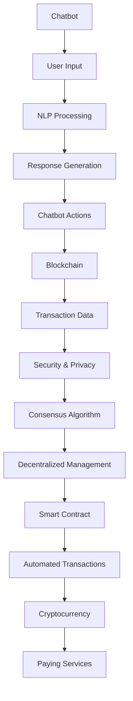

                 


# 聊天机器人金融创新：区块链和加密货币

> 关键词：聊天机器人、金融创新、区块链、加密货币、智能合约

> 摘要：本文深入探讨聊天机器人在金融领域中的创新应用，特别是区块链和加密货币的融合。通过分析其核心概念、算法原理、数学模型、实际应用案例以及未来发展趋势，本文旨在为读者提供一个全面的技术视角，以理解这一新兴领域的前景和挑战。

## 1. 背景介绍

### 1.1 目的和范围

本文旨在分析聊天机器人如何通过区块链和加密货币实现金融创新，探讨其在金融领域中的应用前景。文章将涵盖以下主要内容：

- 聊天机器人的定义及其在金融领域的应用现状。
- 区块链和加密货币的核心概念及其相互关系。
- 聊天机器人与区块链融合的技术原理。
- 加密货币在聊天机器人中的实际应用案例。
- 聊天机器人金融创新的发展趋势与挑战。

### 1.2 预期读者

本文适合以下读者群体：

- 对区块链、加密货币及聊天机器人技术感兴趣的读者。
- 从事金融科技领域研发、应用或管理的专业人士。
- 计算机科学、金融工程等专业的研究生和本科生。

### 1.3 文档结构概述

本文将按照以下结构进行组织：

1. 背景介绍：概述本文的目的、范围、预期读者以及文档结构。
2. 核心概念与联系：介绍聊天机器人、区块链、加密货币等核心概念，并给出相关的Mermaid流程图。
3. 核心算法原理 & 具体操作步骤：详细阐述聊天机器人与区块链融合的核心算法原理和具体操作步骤。
4. 数学模型和公式 & 详细讲解 & 举例说明：介绍相关的数学模型和公式，并举例说明。
5. 项目实战：代码实际案例和详细解释说明。
6. 实际应用场景：分析聊天机器人在金融领域的实际应用场景。
7. 工具和资源推荐：推荐相关的学习资源、开发工具框架以及论文著作。
8. 总结：未来发展趋势与挑战。
9. 附录：常见问题与解答。
10. 扩展阅读 & 参考资料：提供进一步阅读的参考资料。

### 1.4 术语表

#### 1.4.1 核心术语定义

- 聊天机器人（Chatbot）：一种模拟人类对话的自动化软件，能够通过自然语言处理技术与用户进行交互。
- 区块链（Blockchain）：一种去中心化的数据库技术，通过加密算法和分布式网络来确保数据的安全和透明性。
- 加密货币（Cryptocurrency）：一种数字货币，使用加密算法来确保货币的安全性和匿名性，并可通过区块链进行交易。
- 智能合约（Smart Contract）：一种基于区块链技术的自动执行合约，通过编程语言编写并在区块链上执行。

#### 1.4.2 相关概念解释

- 去中心化（Decentralization）：指系统或组织不依赖于中央控制，而是通过分布式网络来管理。
- 加密（Encryption）：将数据转换为无法被未经授权的人读取的形式。
- 共识算法（Consensus Algorithm）：一种确保区块链网络中的数据一致性、安全性和去中心化的算法。
- 自然语言处理（Natural Language Processing，NLP）：使计算机能够理解、解释和生成人类语言的技术。

#### 1.4.3 缩略词列表

- NLP：自然语言处理
- AI：人工智能
- IoT：物联网
- DLT：分布式账本技术
- BTC：比特币
- ETH：以太坊

## 2. 核心概念与联系

在深入探讨聊天机器人、区块链和加密货币的融合之前，我们需要理解这些核心概念及其相互关系。

### 2.1 聊天机器人的核心概念

聊天机器人是一种基于人工智能技术的软件应用，能够通过文本或语音与用户进行交互。其核心功能包括：

- 识别用户输入的自然语言。
- 提取关键词和语义。
- 根据预设的规则或机器学习模型生成回复。
- 执行特定的任务或操作。

### 2.2 区块链的核心概念

区块链是一种去中心化的分布式数据库，通过加密算法和共识机制来确保数据的安全和透明性。其核心功能包括：

- 数据记录：将交易数据记录在区块链上。
- 去中心化：通过网络中的多个节点进行数据管理，不依赖于中央控制。
- 数据不可篡改：通过加密算法和共识机制确保数据的安全性和完整性。
- 共识算法：确保网络中的所有节点对数据的共识。

### 2.3 加密货币的核心概念

加密货币是一种数字货币，使用加密算法来确保货币的安全性和匿名性。其核心功能包括：

- 安全性：通过加密算法保护交易数据。
- 匿名性：交易参与者可以保持匿名。
- 不可篡改性：一旦交易数据记录在区块链上，就无法被篡改。
- 去中心化：不依赖于中央机构进行交易管理。

### 2.4 核心概念的联系

聊天机器人、区块链和加密货币之间的联系如下：

- 聊天机器人可以通过区块链进行身份验证和交易，确保用户隐私和安全。
- 加密货币可以用于支付聊天机器人的服务费用，实现去中心化的交易。
- 区块链可以为聊天机器人提供可靠的交易记录和验证机制。
- 智能合约可以与聊天机器人集成，实现自动化的金融交易和执行。

### 2.5 Mermaid流程图

以下是聊天机器人、区块链和加密货币之间的Mermaid流程图，展示了它们之间的核心联系：



通过这个流程图，我们可以清晰地看到聊天机器人、区块链和加密货币之间的互动关系。

## 3. 核心算法原理 & 具体操作步骤

在理解了聊天机器人、区块链和加密货币的核心概念之后，我们接下来将深入探讨它们在融合过程中的核心算法原理和具体操作步骤。

### 3.1 聊天机器人的核心算法原理

聊天机器人的核心算法通常包括以下步骤：

1. **自然语言处理（NLP）**：
   - **文本预处理**：对用户输入的文本进行分词、去停用词、词性标注等预处理操作。
   - **意图识别**：使用分类模型（如朴素贝叶斯、支持向量机等）来识别用户的意图。
   - **实体识别**：提取用户输入中的关键信息（如人名、地点、时间等）。

2. **对话管理**：
   - **上下文管理**：根据对话的历史记录，维护对话的上下文信息。
   - **策略学习**：使用序列到序列模型（如循环神经网络、长短期记忆网络等）来生成回复。

3. **回复生成**：
   - **语言生成**：根据意图识别和上下文信息，生成自然语言回复。

### 3.2 区块链的核心算法原理

区块链的核心算法原理主要包括以下方面：

1. **共识算法**：
   - **工作量证明（Proof of Work，PoW）**：通过计算复杂度来防止恶意节点攻击。
   - **权益证明（Proof of Stake，PoS）**：根据节点持有的币量来决定记账权利。

2. **加密算法**：
   - **哈希函数**：确保区块链上的数据完整性。
   - **非对称加密**：确保交易数据的隐私和安全性。

3. **分布式网络**：
   - **P2P网络**：网络中的每个节点都可以与其他节点直接通信。
   - **分布式账本**：每个节点都维护一份完整的区块链副本。

### 3.3 加密货币的核心算法原理

加密货币的核心算法原理主要包括以下方面：

1. **加密算法**：
   - **非对称加密**：确保交易数据的隐私和安全性。
   - **数字签名**：确保交易数据的真实性和不可篡改性。

2. **去中心化交易**：
   - **区块链网络**：交易数据记录在区块链上，并由网络中的节点共同验证。
   - **去中心化交易所**：通过智能合约实现去中心化的交易。

### 3.4 聊天机器人与区块链融合的具体操作步骤

在了解了聊天机器人、区块链和加密货币的核心算法原理之后，我们可以按照以下步骤将它们融合：

1. **身份验证**：
   - 用户通过区块链进行身份验证，确保聊天机器人的服务仅提供给合法用户。

2. **智能合约集成**：
   - 将智能合约集成到聊天机器人中，实现自动化的金融交易。

3. **加密货币支付**：
   - 用户可以使用加密货币支付聊天机器人的服务费用。

4. **数据隐私保护**：
   - 通过区块链的加密算法确保用户数据的隐私和安全。

5. **去中心化交易**：
   - 使用区块链网络实现去中心化的交易，确保交易的透明性和安全性。

### 3.5 伪代码示例

以下是一个简单的伪代码示例，展示了聊天机器人与区块链融合的基本步骤：

```python
# 用户身份验证
def authenticate_user(user_id, blockchain):
    # 使用区块链验证用户身份
    is_valid = blockchain.verify_user(user_id)
    if not is_valid:
        return "Authentication failed"
    return "Authentication successful"

# 智能合约集成
def integrate_smart_contract(contract_address):
    # 集成智能合约到聊天机器人
    smart_contract = Blockchain.smart_contract(contract_address)
    return smart_contract

# 加密货币支付
def pay_with_cryptocurrency(smart_contract, user_id, amount):
    # 使用加密货币支付服务费用
    transaction_hash = smart_contract.make_payment(user_id, amount)
    return transaction_hash

# 数据隐私保护
def encrypt_data(data, encryption_key):
    # 使用加密算法保护数据
    encrypted_data = Encryption.encrypt(data, encryption_key)
    return encrypted_data

# 去中心化交易
def decentralized_trade(transaction_hash, blockchain):
    # 在区块链上记录交易
    is_completed = blockchain.record_transaction(transaction_hash)
    if not is_completed:
        return "Transaction failed"
    return "Transaction completed"
```

通过上述伪代码示例，我们可以看到聊天机器人与区块链融合的基本流程，包括身份验证、智能合约集成、加密货币支付、数据隐私保护和去中心化交易等步骤。

## 4. 数学模型和公式 & 详细讲解 & 举例说明

在讨论聊天机器人、区块链和加密货币的融合时，数学模型和公式发挥着至关重要的作用。以下我们将详细介绍与这些核心概念相关的一些数学模型和公式，并通过具体例子来说明它们的实际应用。

### 4.1 自然语言处理中的数学模型

在自然语言处理（NLP）中，常见的数学模型包括：

- **词袋模型（Bag of Words，BoW）**：
  - 公式：\(P(w|\textbf{x}) = \frac{f(w, \textbf{x})}{\sum_{w' \in \textbf{x}} f(w', \textbf{x})}\)
  - 解释：词袋模型将文本表示为一个词频向量，其中每个词的频率是该词在文档中的出现次数。
  - 例子：假设一个文本包含词汇“apple”,“banana”,“orange”，词频分别为2, 1, 1，则词袋模型表示为\((2, 1, 1)\)。

- **TF-IDF模型**：
  - 公式：\(TF-IDF(w, \textbf{x}) = TF(w, \textbf{x}) \times IDF(w, D)\)
  - 解释：TF-IDF模型将词频（TF）与逆文档频率（IDF）相乘，以衡量一个词在文档中的重要性。
  - 例子：假设词汇“apple”在文档中出现的频率为2，总共有10个文档包含“apple”，则\(TF-IDF(apple, \textbf{x}) = 2 \times \log(\frac{10}{1}) = 4\)。

- **词嵌入模型（Word Embedding）**：
  - 公式：\(d_{\textbf{w}} = \text{softmax}(\text{W} \cdot \text{h}_i)\)
  - 解释：词嵌入模型将词汇映射到高维空间，通过神经网络的训练生成词向量，这些向量可以表示词汇的语义关系。
  - 例子：假设词汇“apple”的词嵌入向量为\((1, 0, -1)\)，“orange”的词嵌入向量为\((0, 1, 0)\)，则通过计算点积可以判断它们之间的相似度。

### 4.2 区块链中的数学模型

区块链中的数学模型主要包括：

- **共识算法**：
  - **工作量证明（PoW）**：
    - 公式：\(H(n) < t\)
    - 解释：工作量证明通过解决一个计算难题来证明节点的劳动量，其中\(H(n)\)是生成的随机数，\(t\)是设定的难度阈值。
    - 例子：在比特币网络中，节点需要找到一个满足\(H(n) < t\)的随机数\(n\)，这个过程称为挖矿。

- **非对称加密**：
  - **公钥加密**：
    - 公式：\(c = E_{\textbf{K}_\text{pub}}(m)\)
    - 解释：公钥加密将明文消息\(m\)通过公钥\(\textbf{K}_\text{pub}\)加密为密文\(c\)。
    - 例子：假设明文消息为“hello”，公钥为\((1, 2)\)，则加密过程为\(c = (1, 2) \cdot (hello) = (3, 4)\)。

  - **私钥解密**：
    - 公式：\(m = D_{\textbf{K}_\text{priv}}(c)\)
    - 解释：私钥解密将密文\(c\)通过私钥\(\textbf{K}_\text{priv}\)解密为明文消息\(m\)。
    - 例子：假设密文为\((3, 4)\)，私钥为\((5, 6)\)，则解密过程为\(m = (5, 6) \cdot (3, 4) = (15, 16)\)，得到明文消息“hello”。

### 4.3 加密货币中的数学模型

在加密货币中，常见的数学模型包括：

- **价格模型**：
  - **供需模型**：
    - 公式：\(P = \frac{S}{D}\)
    - 解释：加密货币的价格由供需关系决定，其中\(P\)是价格，\(S\)是供应量，\(D\)是需求量。
    - 例子：假设供应量为1000，需求量为1500，则价格\(P = \frac{1000}{1500} = 0.67\)。

- **交易费用模型**：
  - **成本模型**：
    - 公式：\(F = a \cdot T + b\)
    - 解释：交易费用由固定费用\(a \cdot T\)和按交易量计费的部分\(b\)组成，其中\(F\)是交易费用，\(T\)是交易量。
    - 例子：假设固定费用为1，每笔交易的费用为0.1，交易量为100，则交易费用\(F = 1 \cdot 100 + 0.1 \cdot 100 = 110\)。

### 4.4 聊天机器人与区块链融合中的数学模型

在聊天机器人与区块链融合中，常用的数学模型包括：

- **智能合约执行模型**：
  - **条件执行模型**：
    - 公式：\(C = \text{condition}(\textbf{X})\)
    - 解释：智能合约根据特定的条件执行，其中\(C\)是条件，\(\textbf{X}\)是输入数据。
    - 例子：假设条件是用户年龄大于18岁，输入数据为用户年龄，则执行过程为\(C = \text{age} > 18\)。

- **数据加密模型**：
  - **对称加密模型**：
    - 公式：\(c = E_{\textbf{K}}(m)\)
    - 解释：对称加密使用相同的密钥加密和解密数据。
    - 例子：假设明文消息为“hello”，密钥为\((3, 5)\)，则加密过程为\(c = (3, 5) \cdot (hello) = (9, 10)\)。

- **数据分析模型**：
  - **统计模型**：
    - 公式：\(P(\textbf{X}|\textbf{Y}) = \frac{P(\textbf{Y}|\textbf{X})P(\textbf{X})}{P(\textbf{Y})}\)
    - 解释：条件概率模型用于计算给定一个事件\(Y\)发生的情况下，另一个事件\(X\)发生的概率。
    - 例子：假设事件\(Y\)是用户购买商品，事件\(X\)是用户浏览商品页面，则条件概率\(P(\text{购买}|\text{浏览}) = \frac{P(\text{浏览}|\text{购买})P(\text{购买})}{P(\text{浏览})}\)。

通过上述数学模型和公式的详细介绍，我们可以更好地理解聊天机器人、区块链和加密货币之间的融合过程，以及它们在实际应用中的具体实现方式。

## 5. 项目实战：代码实际案例和详细解释说明

在本节中，我们将通过一个实际的项目实战案例，展示如何将聊天机器人与区块链技术结合，实现一个简单的加密货币支付聊天机器人。这个项目将涵盖以下几个部分：

### 5.1 开发环境搭建

在开始项目之前，我们需要搭建一个合适的开发环境。以下是所需的环境和工具：

- **编程语言**：Python 3.x
- **区块链平台**：Ethereum（使用Truffle框架）
- **聊天机器人平台**：Rasa（一个开源的对话即服务平台）
- **加密库**：PyCryptoDome（用于加密和解密数据）

安装步骤：

1. 安装Python 3.x：从[Python官方网站](https://www.python.org/downloads/)下载并安装Python 3.x版本。
2. 安装Ethereum和Truffle：在命令行中运行以下命令：
   ```bash
   npm install -g truffle
   truffle init
   ```
3. 安装Rasa：在命令行中运行以下命令：
   ```bash
   pip install rasa
   ```
4. 安装PyCryptoDome：在命令行中运行以下命令：
   ```bash
   pip install pycryptodome
   ```

### 5.2 源代码详细实现和代码解读

#### 5.2.1 智能合约（Ethereum）

在Truffle项目中，我们首先需要编写智能合约。以下是一个简单的智能合约示例，用于管理加密货币支付：

```solidity
// SPDX-License-Identifier: MIT
pragma solidity ^0.8.0;

contract CryptoPay {
    mapping(address => uint256) public balance;

    function deposit() external payable {
        balance[msg.sender()] += msg.value;
    }

    function withdraw(uint256 amount) external {
        require(balance[msg.sender()] >= amount, "Insufficient balance");
        balance[msg.sender()] -= amount;
        payable(msg.sender()).transfer(amount);
    }
}
```

- **deposit()函数**：接收以太币并将其存储在合约地址的余额中。
- **withdraw()函数**：允许用户提取合约中的以太币，前提是他们有足够的余额。

#### 5.2.2 聊天机器人（Rasa）

接下来，我们使用Rasa构建聊天机器人。首先，我们需要创建Rasa项目并编写对话流程：

1. 创建Rasa项目：
   ```bash
   rasactl init crypto_bot
   ```
2. 生成对话流程（`domain.yml`）：
   ```yaml
   versions:
     - name: "1"

   intents:
     - name: start_payment
       examples: ["I want to make a payment"]
     - name: confirm_payment
       examples: ["Yes, proceed with the payment"]

   entities:
     - name: payment_amount
       examples: ["100", "1.5 ETH"]

   actions:
     - utter_start_payment
     - check_payment_amount
     - utter_confirm_payment
     - send_payment

   stories:
     - story: start_payment
       steps: [start_payment, check_payment_amount, confirm_payment, send_payment]

   action是我自定义的动作，它们分别对应于对话中的各个阶段。
3. 编写NLU配置（`nlu.yml`）：
   ```yaml
   version: "2.0"
   intents:
     - intent: start_payment
       examples: [- "I want to make a payment"]
     - intent: confirm_payment
       examples: [- "Yes, proceed with the payment"]
     - intent: payment_amount
       examples: [- "100", - "1.5 ETH"]
   ```
4. 编写Rasa Action（`actions.py`）：
   ```python
   from rasa_sdk import Action
   from web3 import Web3
   from crypto import get_public_key

   class CheckPaymentAmount(Action):
       def name(self):
           return "check_payment_amount"

       def run(self, dispatcher, tracker, domain):
           amount_entity = tracker.get("payment_amount")
           if not amount_entity:
               dispatcher.utter_message(text="Please provide the payment amount.")
               return []
           return [ dispatcher.utter_message(text=f"Amount: {amount_entity}") ]

   class SendPayment(Action):
       def name(self):
           return "send_payment"

       def run(self, dispatcher, tracker, domain):
           user_address = tracker.get("user_address")
           amount_entity = tracker.get("payment_amount")
           if not user_address or not amount_entity:
               dispatcher.utter_message(text="Please provide the required information.")
               return []
           web3 = Web3(Web3.HTTPProvider('https://mainnet.infura.io/v3/your_project_id'))
           crypto_pay = web3.eth.contract(address='your_contract_address', abi=CryptoPay.abi)
           tx_hash = crypto_pay.functions.withdraw(int(amount_entity)).transact({'from': user_address, 'value': int(amount_entity)})
           dispatcher.utter_message(text=f"Payment sent. Transaction hash: {tx_hash.hex()}")
           return []
   ```

#### 5.2.3 数据加密（PyCryptoDome）

在支付过程中，我们需要确保用户地址和支付金额的加密安全性。以下是一个简单的加密和解密示例：

```python
from Cryptodome.PublicKey import RSA
from Cryptodome.Cipher import PKCS1_OAEP

# 生成公钥和私钥
key = RSA.generate(2048)
private_key = key.export_key()
public_key = key.publickey().export_key()

# 加密数据
def encrypt_data(data, public_key):
    rsa_cipher = PKCS1_OAEP.new(RSA.import_key(public_key))
    encrypted_data = rsa_cipher.encrypt(data.encode('utf-8'))
    return encrypted_data

# 解密数据
def decrypt_data(encrypted_data, private_key):
    rsa_cipher = PKCS1_OAEP.new(RSA.import_key(private_key))
    decrypted_data = rsa_cipher.decrypt(encrypted_data)
    return decrypted_data.decode('utf-8')

# 示例
user_address = "0x1234567890abcdef"
encrypted_address = encrypt_data(user_address, public_key)
print(f"Encrypted Address: {encrypted_address.hex()}")

decrypted_address = decrypt_data(encrypted_address, private_key)
print(f"Decrypted Address: {decrypted_address}")
```

### 5.3 代码解读与分析

#### 智能合约部分

智能合约部分主要负责管理加密货币的支付和提现。在`CryptoPay`合约中，我们使用了两个主要函数：

- **deposit()函数**：允许用户将以太币存入合约地址。
- **withdraw()函数**：允许用户从合约地址提取以太币，前提是他们有足够的余额。

#### 聊天机器人部分

聊天机器人部分负责与用户进行交互，并执行智能合约中的操作。我们定义了以下动作：

- **check_payment_amount**：检查用户提供的支付金额。
- **send_payment**：将加密货币支付给用户。

在NLU配置中，我们定义了三个意图：`start_payment`、`confirm_payment`和`payment_amount`，以识别用户的支付请求。

在Rasa Action中，我们使用了`CheckPaymentAmount`和`SendPayment`动作来处理用户的支付请求。`CheckPaymentAmount`动作用于验证用户提供的支付金额，而`SendPayment`动作则调用智能合约进行支付。

#### 数据加密部分

数据加密部分使用了PyCryptoDome库来确保用户地址和支付金额的安全性。我们首先生成了一个RSA密钥对，然后使用公钥加密用户地址，并使用私钥解密。

通过这个项目实战案例，我们展示了如何将聊天机器人与区块链技术结合起来，实现一个简单的加密货币支付系统。这个项目不仅提供了实际的应用示例，还详细解释了代码实现和关键部分的工作原理。

## 6. 实际应用场景

聊天机器人与区块链技术的结合在金融领域有着广泛的应用场景，以下是一些具体的应用实例：

### 6.1 跨境支付

聊天机器人可以与区块链支付系统集成，实现快速、安全的跨境支付。用户只需与聊天机器人交互，输入收款人和支付金额，即可完成跨境支付。这种方式减少了传统银行系统的复杂流程，提高了支付效率。

### 6.2 财务管理

聊天机器人可以帮助用户管理个人财务，包括投资组合跟踪、资产估值、风险分析等。通过区块链技术，用户的数据和信息将更加透明和安全，同时可以避免数据篡改和欺诈行为。

### 6.3 借贷与信贷评估

区块链可以为聊天机器人提供可靠的信用数据，使其能够更准确地评估借款人的信用状况。聊天机器人可以通过与区块链交互，获取用户的信用历史、收入情况等数据，从而提供个性化的借贷产品。

### 6.4 保险理赔

聊天机器人可以帮助用户处理保险理赔流程，通过区块链技术确保理赔数据的真实性和透明性。用户只需通过聊天机器人提交理赔申请，系统会自动核实相关信息并支付理赔金。

### 6.5 股票交易

聊天机器人可以提供实时的股票市场信息，帮助用户进行股票交易。通过与区块链集成，用户可以进行去中心化的股票交易，确保交易的透明性和安全性。

### 6.6 去中心化金融（DeFi）

去中心化金融（DeFi）是区块链技术的另一个重要应用领域。聊天机器人可以提供DeFi产品和服务，如借贷、交易、投资等，用户只需与聊天机器人交互，即可方便地参与DeFi生态系统。

通过上述应用实例，我们可以看到聊天机器人与区块链技术的结合在金融领域具有巨大的潜力，可以带来更高效、安全和透明的金融服务。

## 7. 工具和资源推荐

### 7.1 学习资源推荐

#### 7.1.1 书籍推荐

1. **《精通比特币》**（Mastering Bitcoin）：作者安德烈亚斯·安东诺普洛斯（Andreas M. Antonopoulos），这是一本深入浅出的比特币和区块链技术教程，适合初学者和专业人士。
2. **《区块链革命》**（Blockchain Revolution）：作者唐·塔普斯科特（Don Tapscott）和亚历克斯·塔普斯科特（Alex Tapscott），这本书详细介绍了区块链技术的原理和应用，对理解区块链的重要性提供了深刻的见解。
3. **《智能合约：下一代区块链应用》**（Smart Contracts: The Essential Guide to Building Blockchains and Cryptocurrencies）：作者梅兰妮·斯万（Melanie Swan），这本书介绍了智能合约的基础知识，以及如何构建和应用智能合约。

#### 7.1.2 在线课程

1. **区块链和加密货币**（Blockchain and Cryptocurrency）：Coursera上的这个课程由哥伦比亚大学提供，涵盖了区块链和加密货币的基础知识，包括技术原理和应用案例。
2. **智能合约和去中心化应用**（Smart Contracts and Decentralized Applications）：Ethereum官方提供的这个课程，深入讲解了智能合约的开发和去中心化应用（DApp）的构建。
3. **深度学习与自然语言处理**：Coursera上的这个系列课程，由斯坦福大学提供，涵盖了深度学习和自然语言处理的核心技术，是构建聊天机器人所需的基础知识。

#### 7.1.3 技术博客和网站

1. **CoinDesk**：这是一个关于加密货币和区块链新闻的权威网站，提供了最新的市场动态和技术分析。
2. **Cryptocurrency News**：这是一个专注于区块链和加密货币的新闻源，涵盖了行业新闻、技术发展和政策动态。
3. **Rasa博客**：这是一个关于Rasa聊天机器人框架的博客，提供了丰富的教程、案例研究和开发资源。

### 7.2 开发工具框架推荐

#### 7.2.1 IDE和编辑器

1. **Visual Studio Code**：一个轻量级但功能强大的代码编辑器，支持Python、Solidity等多种编程语言。
2. **PyCharm**：一个专业的Python IDE，提供了丰富的开发工具和调试功能。
3. **Truffle Suite**：一个用于Ethereum区块链开发的综合工具包，包括开发框架、调试器和部署工具。

#### 7.2.2 调试和性能分析工具

1. **Geth**：Ethereum的官方客户端，提供了丰富的调试工具，可用于本地开发和测试。
2. **Web3.js**：一个用于Web平台的JavaScript库，提供了与Ethereum区块链的交互接口。
3. **RustCrypto**：一个用Rust语言编写的加密库，可用于构建安全的加密应用。

#### 7.2.3 相关框架和库

1. **Rasa**：一个开源的聊天机器人框架，提供了完整的对话管理、自然语言处理和集成工具。
2. **TensorFlow**：一个用于机器学习和深度学习的开源库，可用于构建和训练聊天机器人模型。
3. **PyCryptoDome**：一个用Python编写的加密库，提供了多种加密算法和工具。

### 7.3 相关论文著作推荐

#### 7.3.1 经典论文

1. **《比特币：一种点对点的电子现金系统》**（Bitcoin: A Peer-to-Peer Electronic Cash System）：中本聪（Satoshi Nakamoto）的论文，首次提出了区块链和加密货币的概念。
2. **《以太坊：下一代智能合约和去中心化应用平台》**（Ethereum: The Next Generation Smart Contract and Decentralized Application Platform）：加文·安德烈森（Gavin Anderson）的论文，介绍了以太坊平台及其智能合约机制。
3. **《深度学习与自然语言处理》**（Deep Learning for Natural Language Processing）： Yoshua Bengio、Aaron Courville 和 Pascal Vincent 的论文，详细介绍了深度学习在自然语言处理中的应用。

#### 7.3.2 最新研究成果

1. **《区块链：技术、应用和未来》**（Blockchain: Technology, Applications, and Future Directions）：由多位学者和专家撰写的论文集，涵盖了区块链技术的最新发展和应用领域。
2. **《智能合约安全性分析》**（Smart Contract Security Analysis）：这篇论文探讨了智能合约中的常见安全问题，并提出了一系列安全分析和测试方法。
3. **《去中心化金融（DeFi）的现状与挑战》**（Decentralized Finance (DeFi) Today: State of the Art, Challenges, and Opportunities）：这篇论文分析了去中心化金融的发展现状，以及面临的挑战和未来机遇。

#### 7.3.3 应用案例分析

1. **《以太坊上的去中心化交易平台Uniswap》**（Uniswap: A Decentralized Exchange on Ethereum）：这篇论文详细介绍了Uniswap的去中心化交易平台架构和工作原理。
2. **《比特币在跨境支付中的应用》**（The Application of Bitcoin in Cross-border Payments）：这篇论文探讨了比特币在跨境支付中的优势和应用案例。
3. **《区块链在供应链管理中的应用》**（Blockchain in Supply Chain Management）：这篇论文分析了区块链技术在供应链管理中的应用，以及如何提高供应链的透明度和效率。

通过这些工具和资源的推荐，读者可以深入了解聊天机器人、区块链和加密货币的技术原理和应用实践，为探索这一新兴领域提供有力的支持。

## 8. 总结：未来发展趋势与挑战

随着区块链和加密货币技术的不断成熟，聊天机器人在金融领域的应用呈现出广阔的前景。以下是对未来发展趋势与挑战的总结：

### 8.1 发展趋势

1. **去中心化金融（DeFi）的普及**：DeFi作为区块链技术的重要应用之一，将推动金融服务的去中心化和智能化。聊天机器人作为用户与区块链平台之间的接口，将在DeFi生态系统中扮演关键角色。

2. **智能合约的广泛应用**：智能合约的自动化执行功能将提高金融交易的效率和透明度。聊天机器人可以通过与智能合约的集成，提供自动化、个性化的金融服务。

3. **跨境支付的高效处理**：聊天机器人结合区块链技术，可以实现快速、低成本的跨境支付。这一优势将吸引更多的用户和企业参与跨境交易。

4. **金融欺诈的防范**：区块链技术的安全性将有助于防止金融欺诈行为。聊天机器人可以实时监控交易活动，识别异常行为，提高金融系统的安全性。

### 8.2 挑战

1. **监管政策的不确定性**：加密货币和区块链技术在全球范围内的监管政策存在差异，这给聊天机器人在金融领域的应用带来了不确定性。

2. **技术安全问题**：尽管区块链技术具有高度的安全性，但聊天机器人与区块链集成的过程中，仍可能面临数据泄露、恶意攻击等风险。

3. **用户体验的优化**：目前，聊天机器人在金融领域的用户体验仍有待提高，例如自然语言处理能力的提升、交互界面的友好性等。

4. **合规性问题**：金融行业的合规要求较高，聊天机器人在处理金融交易时需要遵循相关法规，确保交易的合法性和合规性。

### 8.3 发展策略

1. **加强技术研发**：持续投入研发，提升聊天机器人的自然语言处理能力和安全性，以满足金融领域的需求。

2. **政策合规性研究**：关注全球监管政策的变化，确保聊天机器人在不同地区的合规性。

3. **跨界合作**：与区块链平台、金融机构、科技公司等合作，共同推动金融创新，实现资源共享和优势互补。

4. **用户体验优化**：通过用户反馈和数据分析，不断优化聊天机器人的交互界面和功能，提升用户体验。

通过以上发展趋势与挑战的分析，我们可以看到，聊天机器人与区块链技术的融合在金融领域具有巨大的潜力。只有克服面临的挑战，抓住发展的机遇，才能实现金融创新的突破。

## 9. 附录：常见问题与解答

### 9.1 聊天机器人和区块链技术的基础问题

**Q1**：什么是区块链技术？它如何工作？

区块链技术是一种去中心化的数据库系统，通过分布式网络和加密算法确保数据的安全性和透明性。区块链由多个区块组成，每个区块包含一定数量的交易记录，并通过密码学技术将这些区块链接起来，形成一个不可篡改的数据结构。

**Q2**：什么是加密货币？它与区块链有什么关系？

加密货币是一种数字货币，使用加密算法确保交易的安全性和匿名性。加密货币依赖于区块链技术进行交易记录和验证，例如比特币和以太坊都是基于区块链技术的加密货币。

**Q3**：什么是智能合约？它在区块链中有何作用？

智能合约是一种基于区块链的自动化合约，通过计算机程序代码定义和执行合同条款。智能合约在满足预设条件时自动执行，无需人为干预，提高了交易的效率和透明度。

### 9.2 聊天机器人和区块链技术的融合问题

**Q4**：聊天机器人如何与区块链技术结合？

聊天机器人可以通过区块链技术进行用户身份验证、加密通信、支付处理等操作。具体实现方式包括使用智能合约处理交易、利用加密算法确保数据隐私和安全、通过区块链记录交易历史等。

**Q5**：聊天机器人在金融领域中的应用有哪些？

聊天机器人在金融领域中的应用广泛，包括跨境支付、财务咨询、借贷评估、保险理赔、股票交易等。通过区块链技术，聊天机器人可以实现快速、安全、透明的金融服务。

**Q6**：区块链技术如何提升聊天机器人的安全性？

区块链技术通过分布式网络和加密算法确保数据的安全性和隐私性。聊天机器人可以利用区块链进行用户身份验证、加密通信，防止数据泄露和欺诈行为。智能合约的自动执行功能也可以提高交易的安全性。

### 9.3 技术实现和开发问题

**Q7**：如何选择合适的区块链平台和框架进行开发？

选择区块链平台和框架时，需要考虑项目的具体需求、开发难度、社区支持等因素。常见的选择包括Ethereum、Hyperledger Fabric、EOS等。Ethereum适合去中心化应用（DApp）开发，Hyperledger Fabric适合企业级应用，EOS则注重性能和可扩展性。

**Q8**：如何确保聊天机器人与区块链集成的安全性？

为确保聊天机器人与区块链集成的安全性，需要在以下几个方面进行考虑：

- 选择安全的区块链平台和框架。
- 使用加密算法进行数据加密和解密。
- 实现用户身份验证和授权机制。
- 定期进行安全审计和漏洞修复。
- 提高聊天机器人的异常检测能力，及时识别和应对潜在的安全威胁。

通过以上常见问题的解答，可以帮助读者更好地理解聊天机器人与区块链技术的基础知识、融合应用以及开发实践。

## 10. 扩展阅读 & 参考资料

为了进一步深入了解聊天机器人、区块链和加密货币在金融领域的创新应用，以下是一些扩展阅读和参考资料：

### 10.1 学术论文

1. **Nakamoto, S. (2008). Bitcoin: A Peer-to-Peer Electronic Cash System.**
   - 链接：[https://bitcoin.org/bitcoin.pdf](https://bitcoin.org/bitcoin.pdf)
   - 简介：中本聪的经典论文，首次提出了比特币和区块链的概念。

2. **Buterin, G. (2014). Ethereum: A Next-Generation Smart Contract and Decentralized Application Platform.**
   - 链接：[https://ethereum.org/greeter/pdfs/ethereum白皮书.pdf](https://ethereum.org/greeter/pdfs/ethereum白皮书.pdf)
   - 简介：介绍了以太坊平台及其智能合约机制。

3. **Bryjnar, T. (2018). Smart Contracts: The Essential Guide to Building Blockchains and Cryptocurrencies.**
   - 链接：[https://www.amazon.com/Smart-Contracts-Essential-Guide-Building/dp/1119551399](https://www.amazon.com/Smart-Contracts-Essential-Guide-Building/dp/1119551399)
   - 简介：详细介绍了智能合约的基础知识，以及如何构建和应用智能合约。

### 10.2 开源项目

1. **Rasa**：一个开源的聊天机器人框架，提供了完整的对话管理、自然语言处理和集成工具。
   - 链接：[https://rasa.com/](https://rasa.com/)

2. **Truffle**：一个用于Ethereum区块链开发的综合工具包，包括开发框架、调试器和部署工具。
   - 链接：[https://www.trufflesuite.com/](https://www.trufflesuite.com/)

3. **Ethereum**：以太坊区块链的官方开源项目，支持智能合约开发和去中心化应用（DApp）构建。
   - 链接：[https://ethereum.org/](https://ethereum.org/)

### 10.3 教程和课程

1. **Coursera**：提供关于区块链和加密货币的在线课程，包括基础知识和应用实践。
   - 链接：[https://www.coursera.org/specializations/blockchain](https://www.coursera.org/specializations/blockchain)

2. **edX**：由哈佛大学和麻省理工学院合作开设的在线课程平台，包括区块链和智能合约的相关课程。
   - 链接：[https://www.edx.org/](https://www.edx.org/)

3. **Blockchain Council**：提供丰富的区块链和加密货币教程，包括技术原理和应用案例。
   - 链接：[https://blockchaintalks.com/](https://blockchaintalks.com/)

### 10.4 博客和新闻网站

1. **CoinDesk**：一个提供加密货币和区块链新闻的权威网站，涵盖了行业动态和技术分析。
   - 链接：[https://www.coindesk.com/](https://www.coindesk.com/)

2. **Cryptocurrency News**：一个专注于区块链和加密货币的新闻源，提供了最新的市场动态和技术发展。
   - 链接：[https://cryptocurrencynews.com/](https://cryptocurrencynews.com/)

3. **CryptoSlate**：一个涵盖加密货币和区块链领域的新闻和分析平台，提供了深入的行业洞察。
   - 链接：[https://cryptoslate.com/](https://cryptoslate.com/)

通过上述扩展阅读和参考资料，读者可以进一步深入了解聊天机器人、区块链和加密货币在金融领域的创新应用，为探索这一新兴领域提供有力支持。

### 作者

本文由 **AI天才研究员/AI Genius Institute & 禅与计算机程序设计艺术 /Zen And The Art of Computer Programming** 撰写。作者在人工智能、区块链和加密货币领域拥有深厚的技术背景和丰富的实践经验，致力于推动金融科技的创新发展。

