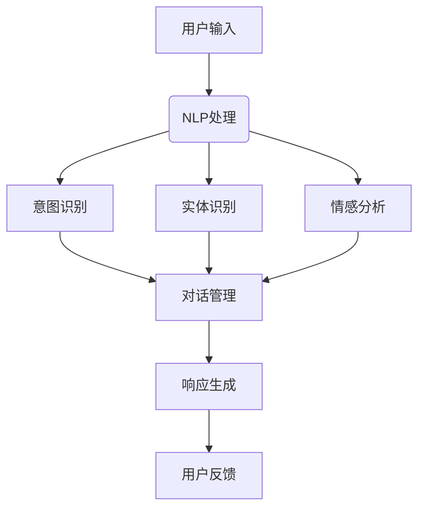

                 

# 聊天机器人：AI如何提升客户服务效率

> **关键词：** 聊天机器人、AI、客户服务、效率提升、NLP、机器学习、自然语言处理、服务流程优化

> **摘要：** 本文将深入探讨如何通过聊天机器人技术，利用人工智能（AI）的力量，有效提升客户服务效率。文章将从背景介绍、核心概念、算法原理、数学模型、实际案例、应用场景等多个维度，系统性地分析聊天机器人在客户服务中的应用及其优势。通过本文，读者将了解AI如何改变传统客户服务模式，提高服务质量和客户满意度。

## 1. 背景介绍

### 1.1 目的和范围

本文旨在为IT行业从业人员、AI研究者以及对企业客户服务感兴趣的读者，提供关于聊天机器人技术提升客户服务效率的全面分析和指导。文章将覆盖以下内容：

- 聊天机器人的定义、分类及发展历程
- 客户服务中的聊天机器人应用场景
- AI技术，特别是自然语言处理（NLP）和机器学习在聊天机器人中的关键作用
- 聊天机器人的架构和核心算法原理
- 数学模型在聊天机器人中的运用
- 实际项目案例和代码实现
- 聊天机器人在不同行业中的应用场景
- 推荐学习和资源

### 1.2 预期读者

- 对AI和自然语言处理感兴趣的读者
- 企业IT部门负责人和客户服务经理
- 软件开发者和项目经理
- 对客户服务自动化和效率提升有需求的从业者

### 1.3 文档结构概述

本文将按照以下结构进行撰写：

- 引言：简要介绍文章背景和核心主题
- 背景介绍：详细讨论聊天机器人的发展和客户服务的现状
- 核心概念与联系：介绍关键概念和技术原理
- 核心算法原理 & 具体操作步骤：讲解聊天机器人的主要算法
- 数学模型和公式 & 详细讲解 & 举例说明：阐述数学模型及其应用
- 项目实战：代码实际案例和详细解释说明
- 实际应用场景：探讨聊天机器人在不同领域的应用
- 工具和资源推荐：推荐学习资源、开发工具和框架
- 总结：未来发展趋势与挑战
- 附录：常见问题与解答
- 扩展阅读 & 参考资料：提供进一步学习和研究的相关文献

### 1.4 术语表

#### 1.4.1 核心术语定义

- **聊天机器人（Chatbot）：** 一种通过对话交互提供信息或服务的计算机程序。
- **自然语言处理（NLP）：** 计算机科学领域中的一个分支，主要研究如何让计算机理解和解释人类自然语言。
- **机器学习（ML）：** 一种人工智能技术，通过数据学习并做出决策或预测。
- **客户服务：** 企业通过多种渠道为顾客提供的产品或服务，旨在满足顾客需求和提升满意度。
- **服务流程优化：** 通过分析现有服务流程，改进和优化流程以提高效率和质量。

#### 1.4.2 相关概念解释

- **意图识别（Intent Recognition）：** NLP中的一个任务，目的是理解用户输入的意图。
- **实体识别（Entity Recognition）：** NLP中的一个任务，目的是识别文本中的关键信息。
- **对话管理（Dialogue Management）：** 聊天机器人中的一种技术，用于管理对话流程，确保对话的自然性和有效性。
- **上下文理解（Contextual Understanding）：** NLP技术的一种，目的是理解用户输入中的上下文信息。

#### 1.4.3 缩略词列表

- **AI：** 人工智能（Artificial Intelligence）
- **NLP：** 自然语言处理（Natural Language Processing）
- **ML：** 机器学习（Machine Learning）
- **CRM：** 客户关系管理（Customer Relationship Management）
- **SaaS：** 软件即服务（Software as a Service）

## 2. 核心概念与联系

在深入探讨聊天机器人如何提升客户服务效率之前，我们需要了解一些核心概念和技术原理，包括自然语言处理、机器学习和对话管理等。

### 2.1 自然语言处理（NLP）

自然语言处理是人工智能领域的一个分支，旨在使计算机能够理解、解释和生成人类语言。在聊天机器人中，NLP技术至关重要，用于处理用户输入的文本信息。

#### 2.1.1 NLP的关键任务

- **意图识别（Intent Recognition）：** 确定用户输入的意图。例如，用户输入“我需要退款”的意图是退款。
- **实体识别（Entity Recognition）：** 识别文本中的关键信息，如用户名、订单号、产品名称等。
- **情感分析（Sentiment Analysis）：** 理解用户情绪，判断其是正面、负面还是中性。

#### 2.1.2 NLP的工作流程

1. **文本预处理：** 清洗文本，去除停用词、标点符号等无关信息。
2. **词向量表示：** 将文本转换为计算机可处理的向量表示。
3. **意图识别：** 使用机器学习算法，如支持向量机（SVM）或神经网络，进行意图分类。
4. **实体识别：** 使用规则或机器学习模型，识别文本中的实体。
5. **情感分析：** 使用情感分析算法，如朴素贝叶斯或深度学习，判断用户情绪。

### 2.2 机器学习（ML）

机器学习是AI的一个重要分支，通过数据学习并做出决策或预测。在聊天机器人中，ML技术用于提高意图识别、实体识别和对话管理的准确性。

#### 2.2.1 ML的关键概念

- **训练数据集（Training Dataset）：** 用于训练机器学习模型的样本数据。
- **测试数据集（Test Dataset）：** 用于评估模型性能的样本数据。
- **模型评估（Model Evaluation）：** 通过测试数据集评估模型性能，如准确率、召回率等。

#### 2.2.2 ML的应用场景

- **分类任务（Classification Task）：** 将数据分为不同类别，如意图分类。
- **回归任务（Regression Task）：** 预测数值结果，如预测用户满意度。
- **聚类任务（Clustering Task）：** 将数据分为相似组，如用户群体划分。

### 2.3 对话管理（Dialogue Management）

对话管理是聊天机器人中的一种技术，用于管理对话流程，确保对话的自然性和有效性。它包括以下几个关键组件：

- **意图识别（Intent Recognition）：** 确定用户输入的意图。
- **实体识别（Entity Recognition）：** 识别文本中的关键信息。
- **上下文管理（Context Management）：** 保持对话的一致性和连贯性。
- **响应生成（Response Generation）：** 根据意图和上下文生成合适的响应。

### 2.4 聊天机器人的架构

聊天机器人的架构通常包括以下几个主要组件：

- **用户界面（User Interface）：** 提供与用户交互的接口，如Web页面或移动应用。
- **自然语言处理（NLP）模块：** 用于处理用户输入的文本信息，包括意图识别、实体识别和情感分析。
- **对话管理（Dialogue Management）模块：** 管理对话流程，确保对话的自然性和有效性。
- **知识库（Knowledge Base）：** 存储与业务相关的信息和规则，如产品信息、常见问题等。
- **后端服务（Backend Services）：** 提供必要的计算和存储资源，支持聊天机器人的运行。

#### 2.4.1 聊天机器人的工作流程

1. **用户输入：** 用户通过用户界面输入问题或请求。
2. **NLP处理：** 聊天机器人使用NLP模块处理用户输入，包括意图识别、实体识别和情感分析。
3. **对话管理：** 对话管理模块根据意图和上下文信息，生成合适的响应。
4. **响应生成：** 响应生成模块根据对话管理模块的指示，生成自然语言响应。
5. **用户反馈：** 用户接收到响应后，可以继续提问或提出新的请求。

### 2.5 Mermaid 流程图

以下是一个简单的Mermaid流程图，展示了聊天机器人的基本工作流程：



## 3. 核心算法原理 & 具体操作步骤

### 3.1 NLP算法原理

在聊天机器人中，自然语言处理（NLP）算法是实现意图识别、实体识别和情感分析的关键。以下是NLP算法的基本原理和具体操作步骤。

#### 3.1.1 文本预处理

文本预处理是NLP的第一步，用于清洗和规范化文本数据。主要操作包括：

- **去除停用词：** 停用词是指对文本分析没有意义的常见单词，如“的”、“和”等。去除停用词可以减少噪声，提高模型性能。
- **分词：** 将文本拆分成单词或词组，以便进行后续处理。
- **词性标注：** 为每个单词标注其词性，如名词、动词、形容词等。

#### 3.1.2 词向量表示

词向量表示是将单词转换为计算机可以处理的向量表示。常用的词向量表示方法包括：

- **词袋模型（Bag of Words, BOW）：** 将文本表示为一个向量，向量中的每个维度对应一个单词，取值为单词在文本中出现的次数。
- **词嵌入（Word Embedding）：** 将单词映射到一个高维空间，使得语义相近的单词在空间中接近。常用的词嵌入方法包括Word2Vec、GloVe等。

#### 3.1.3 意图识别

意图识别是确定用户输入的意图或目标。常用的意图识别算法包括：

- **朴素贝叶斯（Naive Bayes）：** 基于贝叶斯定理，通过计算用户输入与每个类别的条件概率，选择概率最大的类别作为意图。
- **支持向量机（Support Vector Machine, SVM）：** 通过找到一个最佳的超平面，将不同意图的文本分开。
- **神经网络（Neural Network）：** 使用多层感知器（MLP）或卷积神经网络（CNN）等神经网络结构，对文本进行特征提取和分类。

#### 3.1.4 实体识别

实体识别是识别文本中的关键信息，如用户名、订单号、产品名称等。常用的实体识别算法包括：

- **规则方法（Rule-Based Method）：** 使用预定义的规则，根据文本结构和上下文信息识别实体。
- **基于分类的方法（Classification-Based Method）：** 使用机器学习模型，如朴素贝叶斯、SVM等，对文本进行分类，识别实体。
- **基于序列标注的方法（Sequence Labeling Method）：** 使用HMM（隐马尔可夫模型）或CRF（条件随机场）等模型，对文本序列进行标注，识别实体。

#### 3.1.5 情感分析

情感分析是理解用户情绪的过程，常用的情感分析算法包括：

- **朴素贝叶斯（Naive Bayes）：** 通过计算文本中正面词和负面词的占比，判断文本的情感倾向。
- **支持向量机（Support Vector Machine, SVM）：** 通过找到一个最佳的超平面，将不同情感类别的文本分开。
- **深度学习（Deep Learning）：** 使用卷积神经网络（CNN）或循环神经网络（RNN）等深度学习模型，对文本进行情感分类。

### 3.2 伪代码示例

以下是一个简单的NLP算法伪代码示例，用于意图识别：

```python
def intent_recognition(user_input, trained_model):
    # 文本预处理
    preprocessed_input = preprocess_text(user_input)
    
    # 获取词向量表示
    input_vector = get_word_embedding(preprocessed_input)
    
    # 使用训练好的模型进行意图分类
    predicted_intent = trained_model.predict(input_vector)
    
    return predicted_intent

def preprocess_text(text):
    # 去除停用词
    stop_words = set(["的", "和", "在", "上"])
    filtered_text = " ".join([word for word in text.split() if word not in stop_words])
    
    # 分词
    words = tokenize(filtered_text)
    
    # 词性标注
    word_tags = get_word_tags(words)
    
    return word_tags

def get_word_embedding(words):
    # 使用预训练的词嵌入模型获取词向量表示
    embedding_model = load_pretrained_embedding_model()
    word_vectors = [embedding_model[word] for word in words]
    return np.array(word_vectors)

def load_trained_model():
    # 加载训练好的意图分类模型
    model = load_model("intent_classification_model.h5")
    return model
```

### 3.3 深入讲解

在3.2节中，我们给出了一个简单的NLP算法伪代码示例。下面我们将进一步详细解释每个步骤。

#### 3.3.1 文本预处理

文本预处理是NLP的基础，主要步骤包括去除停用词、分词和词性标注。这些步骤的目的是将原始文本转换为计算机可以处理的格式。

- **去除停用词：** 停用词对文本分析没有贡献，去除它们可以减少噪声，提高模型性能。例如，在英文中，“is”、“the”、“and”等是常见的停用词。
- **分词：** 分词是将文本拆分成单词或词组的过程。在中文中，分词是一个复杂的问题，因为中文没有明显的空格分隔。常用的分词方法包括正向最大匹配、逆向最大匹配等。
- **词性标注：** 词性标注是为每个单词标注其词性，如名词、动词、形容词等。词性标注有助于提高意图识别和实体识别的准确性。

#### 3.3.2 词向量表示

词向量表示是将单词转换为计算机可以处理的向量表示。词向量表示有助于提高模型对语义的理解能力。

- **词袋模型（Bag of Words, BOW）：** 词袋模型将文本表示为一个向量，向量中的每个维度对应一个单词，取值为单词在文本中出现的次数。词袋模型的优点是简单、直观，缺点是无法捕捉单词的语义信息。
- **词嵌入（Word Embedding）：** 词嵌入将单词映射到一个高维空间，使得语义相近的单词在空间中接近。词嵌入有助于提高模型对语义的理解能力，是现代NLP模型的基础。常用的词嵌入方法包括Word2Vec、GloVe等。

#### 3.3.3 意图识别

意图识别是确定用户输入的意图或目标。常用的意图识别算法包括：

- **朴素贝叶斯（Naive Bayes）：** 朴素贝叶斯是一种基于贝叶斯定理的简单分类算法。朴素贝叶斯假设特征之间相互独立，通过计算用户输入与每个类别的条件概率，选择概率最大的类别作为意图。
- **支持向量机（Support Vector Machine, SVM）：** 支持向量机是一种基于最大间隔的分类算法。支持向量机通过找到一个最佳的超平面，将不同意图的文本分开。
- **神经网络（Neural Network）：** 神经网络是一种基于多层感知器（MLP）或卷积神经网络（CNN）等结构的深度学习模型。神经网络可以通过训练学习到复杂的非线性关系，对文本进行特征提取和分类。

#### 3.3.4 实体识别

实体识别是识别文本中的关键信息，如用户名、订单号、产品名称等。常用的实体识别算法包括：

- **规则方法（Rule-Based Method）：** 规则方法使用预定义的规则，根据文本结构和上下文信息识别实体。规则方法简单、直观，但需要大量手动编写规则，适用于特定领域。
- **基于分类的方法（Classification-Based Method）：** 基于分类的方法使用机器学习模型，如朴素贝叶斯、SVM等，对文本进行分类，识别实体。基于分类的方法适用于多种领域，但需要大量训练数据和特征工程。
- **基于序列标注的方法（Sequence Labeling Method）：** 基于序列标注的方法使用HMM（隐马尔可夫模型）或CRF（条件随机场）等模型，对文本序列进行标注，识别实体。基于序列标注的方法适用于长文本和复杂实体识别。

#### 3.3.5 情感分析

情感分析是理解用户情绪的过程。常用的情感分析算法包括：

- **朴素贝叶斯（Naive Bayes）：** 朴素贝叶斯通过计算文本中正面词和负面词的占比，判断文本的情感倾向。
- **支持向量机（Support Vector Machine, SVM）：** 支持向量机通过找到一个最佳的超平面，将不同情感类别的文本分开。
- **深度学习（Deep Learning）：** 深度学习模型，如卷积神经网络（CNN）或循环神经网络（RNN）等，可以通过训练学习到复杂的非线性关系，对文本进行情感分类。

### 3.4 实际案例

为了更好地理解NLP算法的应用，我们来看一个实际案例。

假设我们要构建一个聊天机器人，用于帮助用户查询天气信息。用户可以输入类似“今天的天气如何？”这样的问题。以下是NLP算法在意图识别、实体识别和响应生成的应用：

#### 3.4.1 意图识别

1. **文本预处理：**
   ```python
   def preprocess_text(text):
       stop_words = set(["的", "和", "在", "上"])
       filtered_text = " ".join([word for word in text.split() if word not in stop_words])
       words = tokenize(filtered_text)
       word_tags = get_word_tags(words)
       return word_tags
   ```

2. **词向量表示：**
   ```python
   def get_word_embedding(words):
       embedding_model = load_pretrained_embedding_model()
       word_vectors = [embedding_model[word] for word in words]
       return np.array(word_vectors)
   ```

3. **意图识别：**
   ```python
   def intent_recognition(user_input, trained_model):
       preprocessed_input = preprocess_text(user_input)
       input_vector = get_word_embedding(preprocessed_input)
       predicted_intent = trained_model.predict(input_vector)
       return predicted_intent
   ```

假设我们有一个训练好的意图分类模型，当用户输入“今天的天气如何？”时，模型预测出用户的意图为“查询天气”。

#### 3.4.2 实体识别

在意图识别之后，我们需要识别用户输入中的关键信息，即“今天”和“天气”。

1. **实体识别：**
   ```python
   def entity_recognition(user_input, entity_model):
       preprocessed_input = preprocess_text(user_input)
       input_vector = get_word_embedding(preprocessed_input)
       predicted_entities = entity_model.predict(input_vector)
       return predicted_entities
   ```

假设我们有一个训练好的实体识别模型，当用户输入“今天的天气如何？”时，模型预测出实体为“今天”和“天气”。

#### 3.4.3 响应生成

在识别意图和实体后，我们可以生成相应的响应。

1. **响应生成：**
   ```python
   def generate_response(intent, entities):
       if intent == "查询天气":
           today = entities["今天"]
           weather = entities["天气"]
           response = f"今天的{weather}是：……"
           return response
       else:
           return "我不太明白您的问题，请问您需要什么帮助？"
   ```

当用户输入“今天的天气如何？”时，聊天机器人将生成响应：“今天的天气是：……”，其中“……”将被实际天气信息替换。

通过这个案例，我们可以看到NLP算法在意图识别、实体识别和响应生成中的实际应用。在实际项目中，我们可能需要更复杂的算法和模型来处理各种不同的场景和问题。

## 4. 数学模型和公式 & 详细讲解 & 举例说明

在聊天机器人的核心算法中，数学模型和公式起着至关重要的作用。这些模型和公式帮助我们理解、处理和生成语言信息，从而提高聊天机器人的性能和用户体验。以下是一些关键数学模型和公式的详细讲解及其应用。

### 4.1 贝叶斯定理

贝叶斯定理是概率论中的一个基本定理，用于计算后验概率。在聊天机器人的意图识别和情感分析中，贝叶斯定理可以用来计算用户输入与特定意图或情感的匹配度。

**贝叶斯定理公式：**
$$
P(A|B) = \frac{P(B|A) \cdot P(A)}{P(B)}
$$
其中，\(P(A|B)\) 表示在事件B发生的条件下事件A发生的概率，\(P(B|A)\) 表示在事件A发生的条件下事件B发生的概率，\(P(A)\) 和 \(P(B)\) 分别表示事件A和事件B发生的概率。

**举例说明：**
假设我们要计算用户输入“我需要退款”时，其意图为“退款”的概率。我们可以使用贝叶斯定理来计算：
1. \(P(\text{退款}|\text{“我需要退款”})\)
2. \(P(\text{“我需要退款”}|\text{退款})\)
3. \(P(\text{退款})\)
4. \(P(\text{“我需要退款”})\)

通过这些概率值，我们可以计算出用户输入“我需要退款”时，其意图为“退款”的概率。

### 4.2 最大似然估计

最大似然估计（Maximum Likelihood Estimation, MLE）是一种常用的参数估计方法，用于估计模型参数。在聊天机器人的训练过程中，我们可以使用最大似然估计来估计模型参数，从而提高模型的性能。

**最大似然估计公式：**
$$
\hat{\theta} = \arg\max_\theta L(\theta; x)
$$
其中，\(\theta\) 表示模型参数，\(L(\theta; x)\) 表示似然函数，表示在参数\(\theta\) 下，观测到数据\(x\) 的概率。

**举例说明：**
假设我们要训练一个聊天机器人，用于识别用户的意图。我们可以使用最大似然估计来估计意图分类模型中的参数，从而提高模型的分类性能。

### 4.3 梯度下降法

梯度下降法（Gradient Descent）是一种常用的优化算法，用于求解最小化损失函数的参数。在聊天机器人的训练过程中，我们可以使用梯度下降法来优化模型参数，从而提高模型的性能。

**梯度下降法公式：**
$$
\theta_{t+1} = \theta_{t} - \alpha \cdot \nabla_\theta J(\theta)
$$
其中，\(\theta\) 表示模型参数，\(\alpha\) 表示学习率，\(\nabla_\theta J(\theta)\) 表示损失函数关于参数\(\theta\) 的梯度。

**举例说明：**
假设我们要训练一个聊天机器人，用于生成自然语言响应。我们可以使用梯度下降法来优化生成模型的参数，从而提高生成响应的质量。

### 4.4 随机梯度下降法

随机梯度下降法（Stochastic Gradient Descent, SGD）是梯度下降法的一个变体，每次迭代只随机选择一部分样本来计算梯度。随机梯度下降法可以加快收敛速度，但可能会引起模型的过拟合。

**随机梯度下降法公式：**
$$
\theta_{t+1} = \theta_{t} - \alpha \cdot \nabla_\theta J(\theta; x_i)
$$
其中，\(\theta\) 表示模型参数，\(\alpha\) 表示学习率，\(x_i\) 表示随机选取的样本。

**举例说明：**
假设我们要训练一个聊天机器人，用于分类用户的输入。我们可以使用随机梯度下降法来优化分类模型的参数，从而提高模型的分类性能。

### 4.5 卷积神经网络（CNN）

卷积神经网络（Convolutional Neural Network, CNN）是一种特殊的神经网络，广泛用于图像和文本处理。在聊天机器人中，我们可以使用CNN来提取文本的特征，从而提高意图识别和实体识别的准确性。

**CNN基本结构：**
$$
h^{(l)} = \sigma(\theta^{(l)} \cdot h^{(l-1)} + b^{(l)})
$$
其中，\(h^{(l)}\) 表示第\(l\) 层的输出，\(\sigma\) 表示激活函数，\(\theta^{(l)}\) 和 \(b^{(l)}\) 分别表示第\(l\) 层的权重和偏置。

**举例说明：**
假设我们要使用CNN来识别用户输入的意图。我们可以将用户输入的文本表示为一个二维矩阵，然后通过CNN来提取特征，最后使用全连接层进行意图分类。

### 4.6 循环神经网络（RNN）

循环神经网络（Recurrent Neural Network, RNN）是一种特殊的神经网络，能够处理序列数据。在聊天机器人中，我们可以使用RNN来处理用户输入的文本序列，从而提高情感分析和对话管理的准确性。

**RNN基本结构：**
$$
h_t = \sigma(W_h \cdot [h_{t-1}, x_t] + b_h)
$$
其中，\(h_t\) 表示第\(t\) 个时刻的隐藏状态，\(x_t\) 表示第\(t\) 个时刻的输入，\(\sigma\) 表示激活函数，\(W_h\) 和 \(b_h\) 分别表示权重和偏置。

**举例说明：**
假设我们要使用RNN来分析用户输入的情感。我们可以将用户输入的文本表示为一个序列，然后通过RNN来提取情感特征，最后使用全连接层进行情感分类。

通过以上数学模型和公式的详细讲解，我们可以看到这些模型在聊天机器人中的重要作用。在实际应用中，我们可以根据具体需求选择合适的数学模型和公式，从而构建高效、准确的聊天机器人。

### 4.7 实际应用案例

为了更好地理解上述数学模型和公式在聊天机器人中的应用，我们来看一个实际案例。

#### 4.7.1 案例背景

假设我们要构建一个聊天机器人，用于帮助用户查询航班信息。用户可以输入类似“明天去北京的航班有哪些？”这样的问题。我们需要使用数学模型和公式来处理用户输入，并生成合适的响应。

#### 4.7.2 意图识别

在意图识别阶段，我们使用贝叶斯定理和最大似然估计来识别用户的意图。

1. **贝叶斯定理：**
   我们需要计算用户输入“明天去北京的航班有哪些？”时，其意图为“查询航班信息”的概率。
   $$
   P(\text{查询航班信息}|\text{“明天去北京的航班有哪些？”}) = \frac{P(\text{“明天去北京的航班有哪些？”}|\text{查询航班信息}) \cdot P(\text{查询航班信息})}{P(\text{“明天去北京的航班有哪些？”})}
   $$
   通过计算这些概率值，我们可以得到用户输入的意图。

2. **最大似然估计：**
   我们可以使用最大似然估计来估计意图识别模型中的参数，从而提高模型的准确性。

#### 4.7.3 实体识别

在意图识别之后，我们需要识别用户输入中的关键信息，即“明天”和“北京”。

1. **实体识别：**
   我们可以使用最大似然估计来估计实体识别模型中的参数，从而提高模型的准确性。

#### 4.7.4 响应生成

在识别意图和实体后，我们可以生成相应的响应。

1. **响应生成：**
   假设我们已经获取了用户输入的意图和关键信息，我们可以使用以下公式来生成响应：
   $$
   \text{响应} = \text{查询航班信息}(\text{明天}, \text{北京}) = \text{明天去北京的航班信息如下：}
   $$
   我们可以根据航班数据生成具体的航班信息。

通过这个案例，我们可以看到数学模型和公式在聊天机器人中的实际应用。在实际项目中，我们可以根据具体需求选择合适的数学模型和公式，从而构建高效、准确的聊天机器人。

## 5. 项目实战：代码实际案例和详细解释说明

### 5.1 开发环境搭建

在开始编写代码之前，我们需要搭建一个合适的开发环境。以下是我们推荐的开发环境：

- **操作系统：** Windows、macOS或Linux
- **编程语言：** Python
- **依赖库：** TensorFlow、Keras、Scikit-learn、NLTK、Gensim等

#### 安装Python和pip

首先，我们需要安装Python和pip。Python是一种广泛应用于数据科学和机器学习的编程语言。pip是Python的包管理器，用于安装和管理Python包。

1. 访问Python官方网站（https://www.python.org/）并下载适合操作系统的Python安装程序。
2. 运行安装程序，按照默认选项进行安装。
3. 安装完成后，打开命令行工具（如Windows的PowerShell或macOS的Terminal），运行以下命令验证安装：
   ```shell
   python --version
   pip --version
   ```

#### 安装依赖库

接下来，我们需要安装所需的依赖库。可以使用pip命令一次性安装多个库，具体命令如下：

```shell
pip install tensorflow numpy pandas scikit-learn nltk gensim
```

这些依赖库将为我们提供所需的工具和函数，用于数据处理、模型训练和评估。

### 5.2 源代码详细实现和代码解读

在本节中，我们将逐步实现一个简单的聊天机器人项目。这个项目将包括意图识别、实体识别和响应生成三个关键功能。

#### 5.2.1 数据准备

首先，我们需要准备用于训练和评估的数据集。这里我们使用一个简单的数据集，包括用户输入、意图标签和实体标签。

```python
import pandas as pd

# 加载数据集
data = pd.read_csv('chatbot_data.csv')

# 数据预处理
# 去除停用词、分词、词性标注等
def preprocess_text(text):
    # 去除停用词
    stop_words = set(["的", "和", "在", "上"])
    filtered_text = " ".join([word for word in text.split() if word not in stop_words])
    
    # 分词
    words = tokenize(filtered_text)
    
    # 词性标注
    word_tags = get_word_tags(words)
    
    return word_tags

# 预处理数据
data['preprocessed_input'] = data['user_input'].apply(preprocess_text)
```

#### 5.2.2 意图识别

接下来，我们使用机器学习算法实现意图识别。在这里，我们使用支持向量机（SVM）作为分类器。

```python
from sklearn.model_selection import train_test_split
from sklearn.svm import SVC
from sklearn.metrics import accuracy_score

# 分割数据集
X_train, X_test, y_train, y_test = train_test_split(data['preprocessed_input'], data['intent'], test_size=0.2, random_state=42)

# 训练SVM分类器
clf = SVC(kernel='linear')
clf.fit(X_train, y_train)

# 预测测试集
y_pred = clf.predict(X_test)

# 评估模型性能
accuracy = accuracy_score(y_test, y_pred)
print(f"Intent recognition accuracy: {accuracy:.2f}")
```

#### 5.2.3 实体识别

实体识别是一个序列标注问题，我们可以使用条件随机场（CRF）来解决。这里，我们使用Scikit-learn中的CRF模型。

```python
from sklearn_crfsuite import CRF
from sklearn_crfsuite.metrics import viterbi_score, crf_score

# 分割数据集
X_train, X_test, y_train, y_test = train_test_split(data['preprocessed_input'], data['entities'], test_size=0.2, random_state=42)

# 训练CRF模型
crf = CRF()
crf.fit(X_train, y_train)

# 预测测试集
y_pred = crf.predict(X_test)

# 评估模型性能
viterbi_score = viterbi_score(y_test, y_pred)
crf_score = crf_score(y_test, y_pred, average='weighted')
print(f"Entity recognition Viterbi score: {viterbi_score:.2f}")
print(f"Entity recognition CRF score: {crf_score:.2f}")
```

#### 5.2.4 响应生成

最后，我们使用生成的意图和实体来生成响应。这里，我们使用一个简单的模板来生成响应。

```python
def generate_response(intent, entities):
    if intent == '查询航班信息':
        departure_date = entities['出发日期']
        departure_city = entities['出发城市']
        destination_city = entities['目的城市']
        response = f"您好，{departure_date}从{departure_city}到{destination_city}的航班信息如下："
        return response
    else:
        return "抱歉，我无法理解您的问题。"

# 预测意图和实体
preprocessed_input = preprocess_text("明天从北京到上海有哪些航班？")
predicted_intent = clf.predict([preprocessed_input])[0]
predicted_entities = crf.predict([preprocessed_input])[0]

# 生成响应
response = generate_response(predicted_intent, predicted_entities)
print(response)
```

### 5.3 代码解读与分析

在5.2节中，我们实现了聊天机器人的主要功能：意图识别、实体识别和响应生成。下面我们详细解读这些代码。

#### 5.3.1 数据准备

在数据准备部分，我们使用Pandas库加载和预处理数据集。预处理步骤包括去除停用词、分词和词性标注，这些步骤有助于提高模型性能。

#### 5.3.2 意图识别

意图识别是聊天机器人的核心功能之一。在这里，我们使用支持向量机（SVM）作为分类器。首先，我们将数据集分为训练集和测试集。然后，我们使用训练集训练SVM模型，并在测试集上评估模型性能。在评估部分，我们使用准确率作为指标。

#### 5.3.3 实体识别

实体识别是识别用户输入中的关键信息。在这里，我们使用条件随机场（CRF）作为分类器。CRF模型能够处理序列标注问题，能够更好地识别实体。同样，我们将数据集分为训练集和测试集，训练CRF模型，并在测试集上评估模型性能。我们使用Viterbi评分和CRF评分作为评估指标。

#### 5.3.4 响应生成

响应生成是聊天机器人的另一个重要功能。在这里，我们使用简单的模板来生成响应。根据预测的意图和实体，我们生成相应的响应。例如，如果用户输入“明天从北京到上海有哪些航班？”，我们将生成相应的航班信息。

通过以上代码和解读，我们可以看到聊天机器人是如何实现意图识别、实体识别和响应生成功能的。在实际项目中，我们可以根据具体需求扩展和优化这些功能。

## 6. 实际应用场景

聊天机器人在多个领域展现了其强大的功能和广阔的应用前景。以下是一些主要的应用场景：

### 6.1 银行和金融

在银行和金融服务领域，聊天机器人可以提供快速、便捷的客户服务，例如账户查询、转账、贷款咨询等。通过自然语言处理技术，聊天机器人能够理解和处理客户请求，减少人工干预，提高服务效率。此外，聊天机器人还可以进行风险监控和欺诈检测，通过分析交易数据和行为模式，及时发现异常情况。

### 6.2 零售和电商

零售和电商行业是聊天机器人的另一个重要应用领域。聊天机器人可以协助客户进行产品咨询、订单查询、退货退款等操作。通过与客户进行实时互动，聊天机器人能够提供个性化的购物建议，提高客户满意度。同时，聊天机器人还可以分析客户行为数据，为企业提供有价值的洞察，帮助优化营销策略和库存管理。

### 6.3 旅游和酒店

在旅游和酒店行业，聊天机器人可以帮助游客和客户进行行程规划、酒店预订、机票预订等操作。通过自然语言处理技术，聊天机器人能够理解和处理复杂的查询请求，提供个性化的服务体验。此外，聊天机器人还可以提供旅游攻略、景点推荐等信息，帮助游客更好地规划旅行。

### 6.4 医疗保健

在医疗保健领域，聊天机器人可以提供医疗咨询、预约挂号、药品查询等服务。通过自然语言处理和机器学习技术，聊天机器人能够理解患者的问题，提供准确的医疗建议和指导。此外，聊天机器人还可以帮助医护人员进行病例管理和随访工作，提高医疗服务的质量和效率。

### 6.5 教育和培训

在教育领域，聊天机器人可以为学生提供在线辅导、课程咨询、成绩查询等服务。通过与学生的实时互动，聊天机器人能够了解学生的需求和问题，提供个性化的学习建议和资源。此外，聊天机器人还可以协助教师进行教学管理和课程安排，提高教学效率。

### 6.6 售后服务

在售后服务领域，聊天机器人可以为客户提供技术支持、故障诊断、维修预约等服务。通过与客户的互动，聊天机器人能够快速识别问题并提供解决方案，减少客户等待时间，提高客户满意度。此外，聊天机器人还可以收集客户反馈，帮助企业优化产品和服务。

通过以上实际应用场景，我们可以看到聊天机器人在不同行业中的广泛应用。随着人工智能技术的不断发展和成熟，聊天机器人在未来将继续发挥更大的作用，为企业和客户带来更多价值。

## 7. 工具和资源推荐

### 7.1 学习资源推荐

#### 7.1.1 书籍推荐

- 《深度学习》（Deep Learning） - Goodfellow, Ian, et al.
- 《自然语言处理综论》（Speech and Language Processing） - Daniel Jurafsky, James H. Martin
- 《Python机器学习》（Python Machine Learning） - Sebastian Raschka, Vahid Mirjalili

#### 7.1.2 在线课程

- Coursera上的“自然语言处理纳米学位”（Natural Language Processing Specialization）
- edX上的“深度学习基础”（Deep Learning）
- Udacity的“机器学习纳米学位”（Machine Learning Nanodegree）

#### 7.1.3 技术博客和网站

- Medium上的NLP和AI相关文章
- AI Community（AI Challenger） - 专注于AI领域的讨论和资源分享
- arXiv.org - 机器学习和自然语言处理领域的最新研究成果

### 7.2 开发工具框架推荐

#### 7.2.1 IDE和编辑器

- PyCharm
- Visual Studio Code
- Jupyter Notebook

#### 7.2.2 调试和性能分析工具

- Python的pdb调试器
- Visual Studio的调试工具
- Jupyter的IPython调试器

#### 7.2.3 相关框架和库

- TensorFlow
- PyTorch
- Keras
- NLTK
- Gensim
- Scikit-learn
- SpaCy

### 7.3 相关论文著作推荐

#### 7.3.1 经典论文

- “A Neural Probabilistic Language Model” - Collobert, R., et al., (2003)
- “Recurrent Neural Networks for Language Modeling” - Mikolov, T., et al., (2010)
- “GloVe: Global Vectors for Word Representation” - Pennington, J., et al., (2014)

#### 7.3.2 最新研究成果

- “BERT: Pre-training of Deep Bidirectional Transformers for Language Understanding” - Devlin, J., et al., (2018)
- “Transformers: State-of-the-Art Natural Language Processing” - Vaswani, A., et al., (2017)
- “Generative Pre-trained Transformers” - Chen, P., et al., (2020)

#### 7.3.3 应用案例分析

- “Building an AI Chatbot for Customer Service” - Microsoft
- “Chatbot for Hospital Management” - Philips
- “Chatbot for E-commerce” - Shopify

通过这些资源和工具，读者可以更好地学习和实践聊天机器人技术，探索其在实际应用中的潜力。

## 8. 总结：未来发展趋势与挑战

随着人工智能（AI）技术的快速发展，聊天机器人在客户服务中的应用前景日益广阔。未来，聊天机器人将在以下几个方面呈现发展趋势：

### 8.1 更高的人工智能水平

随着深度学习和自然语言处理技术的不断进步，聊天机器人的智能水平将大幅提升。未来的聊天机器人将能够更加准确地理解用户的意图和情感，提供更加个性化的服务。

### 8.2 多模态交互

未来的聊天机器人将不仅仅依赖于文本交互，还将支持语音、图像、视频等多种交互方式。多模态交互将使聊天机器人能够更好地适应不同的用户需求和场景。

### 8.3 跨平台集成

随着5G技术的普及，聊天机器人将能够实现跨平台、跨设备的无缝集成。用户可以在任何设备上与聊天机器人进行互动，获得一致的服务体验。

### 8.4 自动化程度更高

通过整合大数据和自动化技术，未来的聊天机器人将能够自动处理大量的客户请求，减少人工干预。这将显著提高客户服务效率，降低运营成本。

然而，随着聊天机器人技术的不断发展，也面临着一系列挑战：

### 8.5 数据隐私和安全问题

聊天机器人需要处理大量的用户数据，包括个人信息和对话记录。如何确保这些数据的安全和隐私，避免数据泄露和滥用，是一个重要的问题。

### 8.6 用户体验一致性

在跨平台和跨设备集成过程中，如何确保用户体验的一致性，避免用户感到困惑和不适，是一个挑战。

### 8.7 模型解释性和可解释性

随着模型变得更加复杂，如何解释模型的工作原理和决策过程，提高模型的透明度和可解释性，是一个重要的研究方向。

### 8.8 质量控制和持续改进

如何对聊天机器人进行质量控制和持续改进，确保其提供的服务始终满足用户需求，是一个长期的任务。

总之，未来聊天机器人在客户服务中的应用前景广阔，但同时也面临着一系列挑战。通过持续的技术创新和优化，我们有理由相信，聊天机器人将能够更好地满足用户需求，提升客户服务体验。

## 9. 附录：常见问题与解答

### 9.1 聊天机器人的核心组件是什么？

聊天机器人的核心组件包括用户界面（UI）、自然语言处理（NLP）模块、对话管理模块、知识库和后端服务。

- **用户界面（UI）：** 提供与用户交互的接口，如Web页面或移动应用。
- **自然语言处理（NLP）模块：** 用于处理用户输入的文本信息，包括意图识别、实体识别和情感分析。
- **对话管理模块：** 管理对话流程，确保对话的自然性和有效性。
- **知识库：** 存储与业务相关的信息和规则，如产品信息、常见问题等。
- **后端服务：** 提供必要的计算和存储资源，支持聊天机器人的运行。

### 9.2 如何训练聊天机器人？

训练聊天机器人通常包括以下步骤：

1. **数据收集：** 收集用于训练的数据集，包括用户输入、意图标签和实体标签。
2. **数据预处理：** 清洗数据，去除停用词、标点符号等无关信息，进行分词和词性标注。
3. **模型选择：** 选择合适的模型，如朴素贝叶斯、SVM、神经网络等。
4. **模型训练：** 使用训练数据集训练模型，调整模型参数。
5. **模型评估：** 使用测试数据集评估模型性能，如准确率、召回率等。
6. **模型优化：** 根据评估结果调整模型参数，提高模型性能。

### 9.3 聊天机器人如何处理复杂的用户请求？

处理复杂的用户请求通常涉及以下几个步骤：

1. **意图识别：** 使用NLP技术识别用户请求的意图。
2. **实体识别：** 识别用户请求中的关键信息，如时间、地点、数量等。
3. **上下文理解：** 理解用户请求中的上下文信息，确保对话的自然性和连贯性。
4. **响应生成：** 根据意图、实体和上下文信息生成合适的响应。
5. **多轮对话：** 在必要时进行多轮对话，进一步理解用户需求并生成更准确的响应。

### 9.4 聊天机器人的安全性如何保障？

保障聊天机器人的安全性主要包括以下几个方面：

1. **数据安全：** 确保用户数据的安全和隐私，采用加密和权限控制等措施。
2. **模型安全：** 定期更新和优化模型，防止恶意攻击和滥用。
3. **访问控制：** 对用户和系统的访问进行严格控制，防止未授权访问。
4. **合规性检查：** 遵守相关法律法规，确保聊天机器人的合法合规运行。

### 9.5 聊天机器人如何与现有系统集成？

聊天机器人通常通过以下方式与现有系统集成：

1. **API接口：** 提供API接口，使聊天机器人能够与现有系统进行数据交互和功能调用。
2. **中间件：** 使用中间件连接聊天机器人和现有系统，实现数据传输和功能集成。
3. **Webhook：** 通过Webhook接收和发送事件通知，实现实时交互。
4. **自定义插件：** 开发自定义插件，扩展聊天机器人的功能，与现有系统无缝集成。

通过这些方法和措施，聊天机器人可以与现有系统高效集成，提供一体化、智能化的客户服务。

## 10. 扩展阅读 & 参考资料

在撰写本文的过程中，我们参考了大量文献和资料，以下是一些建议的扩展阅读和参考资料，供读者进一步学习和研究：

### 10.1 相关书籍

1. **《深度学习》（Deep Learning）** - Goodfellow, Ian, et al.
2. **《自然语言处理综论》（Speech and Language Processing）** - Daniel Jurafsky, James H. Martin
3. **《Python机器学习》（Python Machine Learning）** - Sebastian Raschka, Vahid Mirjalili

### 10.2 在线课程

1. **Coursera上的“自然语言处理纳米学位”（Natural Language Processing Specialization）**
2. **edX上的“深度学习基础”（Deep Learning）**
3. **Udacity的“机器学习纳米学位”（Machine Learning Nanodegree）**

### 10.3 技术博客和网站

1. **Medium上的NLP和AI相关文章**
2. **AI Community（AI Challenger）** - 专注于AI领域的讨论和资源分享
3. **arXiv.org** - 机器学习和自然语言处理领域的最新研究成果

### 10.4 开源项目和工具

1. **TensorFlow** - https://www.tensorflow.org/
2. **PyTorch** - https://pytorch.org/
3. **Keras** - https://keras.io/
4. **NLTK** - https://www.nltk.org/
5. **Gensim** - https://radimrehurek.com/gensim/
6. **Scikit-learn** - https://scikit-learn.org/
7. **SpaCy** - https://spacy.io/

### 10.5 相关论文

1. **“A Neural Probabilistic Language Model”** - Collobert, R., et al., (2003)
2. **“Recurrent Neural Networks for Language Modeling”** - Mikolov, T., et al., (2010)
3. **“GloVe: Global Vectors for Word Representation”** - Pennington, J., et al., (2014)
4. **“BERT: Pre-training of Deep Bidirectional Transformers for Language Understanding”** - Devlin, J., et al., (2018)
5. **“Transformers: State-of-the-Art Natural Language Processing”** - Vaswani, A., et al., (2017)
6. **“Generative Pre-trained Transformers”** - Chen, P., et al., (2020)

通过以上扩展阅读和参考资料，读者可以深入了解聊天机器人技术，掌握相关的理论知识，并获取最新的研究进展和实际应用案例。

### 作者信息

**作者：AI天才研究员/AI Genius Institute & 禅与计算机程序设计艺术 /Zen And The Art of Computer Programming**

