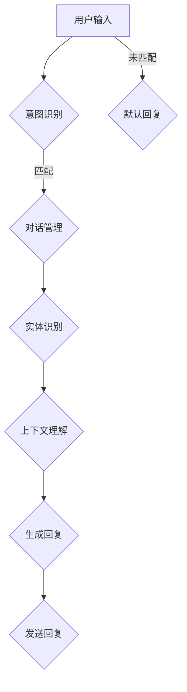

                 

# 聊天机器人：AI如何提升客户服务效率，解决用户问题

> **关键词：** 聊天机器人、人工智能、客户服务、自然语言处理、用户问题解决

> **摘要：** 本文将探讨聊天机器人在客户服务领域的重要性，以及如何通过人工智能技术提升客户服务效率并解决用户问题。我们将从背景介绍、核心概念、算法原理、数学模型、实战案例、应用场景、工具和资源推荐等方面逐步分析，为读者提供一个全面、深入的视角。

## 1. 背景介绍

### 1.1 目的和范围

本文旨在探讨聊天机器人技术在客户服务中的应用，分析其如何利用人工智能技术提高服务效率并解决用户问题。我们将覆盖从基础概念到实际应用的全过程，包括聊天机器人的定义、核心原理、实现方法、应用场景以及未来的发展趋势。

### 1.2 预期读者

本文面向希望了解和掌握聊天机器人技术，特别是在客户服务领域应用的技术人员、产品经理和业务分析师。同时，也适合对人工智能和自然语言处理感兴趣的读者。

### 1.3 文档结构概述

本文结构如下：

1. **背景介绍**：简要介绍本文的目的、范围和预期读者。
2. **核心概念与联系**：介绍聊天机器人的核心概念，并通过Mermaid流程图展示其架构。
3. **核心算法原理 & 具体操作步骤**：讲解聊天机器人的算法原理和实现步骤。
4. **数学模型和公式 & 详细讲解 & 举例说明**：介绍相关的数学模型和公式，并给出具体实例。
5. **项目实战：代码实际案例和详细解释说明**：提供实际代码案例，并详细解释代码实现。
6. **实际应用场景**：探讨聊天机器人在不同场景下的应用。
7. **工具和资源推荐**：推荐学习资源和开发工具。
8. **总结：未来发展趋势与挑战**：总结聊天机器人的发展前景和面临的挑战。
9. **附录：常见问题与解答**：回答读者可能关心的常见问题。
10. **扩展阅读 & 参考资料**：提供进一步学习的资料。

### 1.4 术语表

#### 1.4.1 核心术语定义

- **聊天机器人**：通过人工智能技术实现自动对话的计算机程序。
- **自然语言处理（NLP）**：使计算机能够理解、解释和生成自然语言的一项技术。
- **客户服务**：企业与客户之间的互动，旨在提供满意的服务和解决方案。

#### 1.4.2 相关概念解释

- **意图识别**：理解用户对话的目的或需求。
- **实体识别**：从对话中提取出关键的名词或短语，如人名、地点等。
- **上下文理解**：理解对话的历史信息，以更好地预测用户的下一步行为。

#### 1.4.3 缩略词列表

- **NLP**：自然语言处理
- **AI**：人工智能
- **CRM**：客户关系管理
- **SDK**：软件开发工具包

## 2. 核心概念与联系

### 2.1 聊天机器人定义

聊天机器人是一种与用户通过文本或语音进行交互的智能程序，能够自动识别用户的意图并生成相应的回复。聊天机器人是人工智能（AI）的一个子领域，尤其依赖于自然语言处理（NLP）技术。

### 2.2 聊天机器人架构

下面是聊天机器人的基本架构，通过Mermaid流程图展示：



### 2.3 核心算法原理

#### 意图识别

意图识别是聊天机器人的核心任务之一，它通过分析用户的输入，识别用户的意图。以下是一个简单的伪代码示例：

```python
def recognize_intent(user_input):
    # 假设我们有一个预训练的模型来识别意图
    model = PretrainedIntentModel()
    intent = model.predict(user_input)
    return intent
```

#### 对话管理

对话管理负责根据意图和上下文生成合适的回复。以下是一个简化的伪代码示例：

```python
class DialogueManager:
    def __init__(self):
        self.context = {}

    def generate_response(self, intent, entities, context):
        # 根据意图和实体，选择合适的回复
        response = choose_response(intent, entities, context)
        return response
```

#### 实体识别

实体识别是从用户输入中提取出关键信息，如人名、地点等。以下是一个简单的伪代码示例：

```python
def recognize_entities(user_input):
    # 假设我们有一个预训练的模型来识别实体
    model = PretrainedEntityModel()
    entities = model.extract_entities(user_input)
    return entities
```

#### 上下文理解

上下文理解涉及理解对话的历史信息，以更好地预测用户的下一步行为。以下是一个简化的伪代码示例：

```python
class ContextManager:
    def __init__(self):
        self.context = []

    def update_context(self, response):
        self.context.append(response)
```

## 3. 核心算法原理 & 具体操作步骤

### 3.1 意图识别算法原理

意图识别是聊天机器人中非常重要的环节，它负责理解用户的输入意图。常见的意图识别算法包括：

- **基于规则的方法**：通过预定义的规则来匹配用户的输入。
- **机器学习方法**：使用机器学习模型，如分类器，来识别用户的意图。
- **深度学习方法**：使用神经网络，如卷积神经网络（CNN）或递归神经网络（RNN），来识别用户的意图。

下面是一个基于机器学习方法的意图识别算法的伪代码示例：

```python
def recognize_intent(user_input):
    # 加载预训练的意图识别模型
    model = load_pretrained_intent_model()

    # 预处理用户输入，如分词、去停用词等
    processed_input = preprocess(user_input)

    # 使用模型预测意图
    predicted_intent = model.predict(processed_input)

    return predicted_intent
```

### 3.2 对话管理算法原理

对话管理负责根据用户的意图和上下文生成合适的回复。一个简单的对话管理算法可以包括以下步骤：

1. 识别用户的意图。
2. 根据意图和上下文选择合适的回复。
3. 更新上下文，以便在后续对话中使用。

下面是一个简化的对话管理算法的伪代码示例：

```python
class DialogueManager:
    def __init__(self):
        self.context = []

    def generate_response(self, user_input):
        # 识别用户的意图
        intent = recognize_intent(user_input)

        # 根据意图和上下文选择回复
        response = choose_response(intent, self.context)

        # 更新上下文
        self.context.append(response)

        return response
```

### 3.3 实体识别算法原理

实体识别是从用户输入中提取出关键信息的过程。常见的实体识别算法包括：

- **基于规则的方法**：通过预定义的规则来提取实体。
- **信息抽取方法**：使用基于规则或机器学习的方法从文本中提取实体。
- **序列标注方法**：使用序列标注模型（如CRF或BiLSTM-CRF）来标注实体。

下面是一个基于序列标注方法的实体识别算法的伪代码示例：

```python
def recognize_entities(user_input):
    # 加载预训练的实体识别模型
    model = load_pretrained_entity_model()

    # 使用模型预测实体
    predicted_entities = model.predict(user_input)

    return predicted_entities
```

## 4. 数学模型和公式 & 详细讲解 & 举例说明

在聊天机器人的开发中，数学模型和公式起着至关重要的作用。以下是一些核心的数学模型和公式，我们将详细讲解并给出实例。

### 4.1 意图识别中的分类模型

意图识别通常使用分类模型来预测用户的意图。常见的分类模型包括：

- **逻辑回归（Logistic Regression）**：
  $$ P(y=c_k|x; \theta) = \frac{e^{\theta^T x}}{1 + \sum_{j \neq k} e^{\theta^T x}} $$
  其中，\( \theta \) 是模型参数，\( x \) 是输入特征，\( y \) 是标签，\( c_k \) 是第 \( k \) 个类别。

- **支持向量机（Support Vector Machine, SVM）**：
  $$ w \cdot x + b = 1 $$
  其中，\( w \) 是权重向量，\( x \) 是输入特征，\( b \) 是偏置。

实例：假设我们有一个二分类问题，需要预测用户是询问天气还是航班信息。我们可以使用逻辑回归模型来进行意图识别。

### 4.2 对话管理中的状态转移模型

对话管理可以使用状态转移模型来预测下一个状态。一个常见的状态转移模型是隐马尔可夫模型（HMM）：

- **状态转移概率**：
  $$ P(s_t|s_{t-1}) = a_{s_{t-1}, s_t} $$
  其中，\( s_t \) 是当前状态，\( s_{t-1} \) 是前一个状态，\( a_{s_{t-1}, s_t} \) 是状态转移概率。

- **观测概率**：
  $$ P(o_t|s_t) = b_{s_t, o_t} $$
  其中，\( o_t \) 是观测值，\( b_{s_t, o_t} \) 是观测概率。

实例：假设我们有一个对话管理模型，当前状态是询问天气，我们需要预测下一个状态。我们可以使用隐马尔可夫模型来预测下一个状态。

### 4.3 实体识别中的序列标注模型

实体识别可以使用序列标注模型来标注文本中的实体。一个常见的序列标注模型是双向长短时记忆网络（BiLSTM）：

- **前向隐藏层**：
  $$ h_t^f = \sigma(W_f[h_{t-1}^f, x_t] + b_f) $$
  其中，\( h_t^f \) 是前向隐藏层，\( W_f \) 是权重矩阵，\( x_t \) 是当前输入，\( b_f \) 是偏置。

- **后向隐藏层**：
  $$ h_t^b = \sigma(W_b[h_{t+1}^b, x_t] + b_b) $$
  其中，\( h_t^b \) 是后向隐藏层。

- **合并隐藏层**：
  $$ h_t = [h_t^f; h_t^b] $$
  其中，\( h_t \) 是合并后的隐藏层。

实例：假设我们有一个实体识别任务，需要从文本中标注出人名、地点等实体。我们可以使用双向长短时记忆网络来标注实体。

## 5. 项目实战：代码实际案例和详细解释说明

### 5.1 开发环境搭建

在开始实际案例之前，我们需要搭建一个合适的开发环境。以下是一个基本的开发环境搭建步骤：

1. 安装Python（建议使用3.8及以上版本）。
2. 安装Python虚拟环境工具（如virtualenv或conda）。
3. 安装所需的库和框架，如TensorFlow、Keras、NLTK等。

### 5.2 源代码详细实现和代码解读

#### 5.2.1 意图识别

以下是意图识别的部分源代码和解释：

```python
import tensorflow as tf
from tensorflow.keras.models import Sequential
from tensorflow.keras.layers import Dense, Embedding, LSTM

# 准备数据
# 假设我们已经有了一个预处理好的数据集，包括输入文本和对应的标签
# input_texts 和 labels 是训练数据
# vocab_size 是词汇表大小
# embedding_dim 是嵌入维度

# 构建模型
model = Sequential()
model.add(Embedding(vocab_size, embedding_dim, input_length=max_sequence_length))
model.add(LSTM(128))
model.add(Dense(num_classes, activation='softmax'))

# 编译模型
model.compile(loss='categorical_crossentropy', optimizer='adam', metrics=['accuracy'])

# 训练模型
model.fit(input_texts, labels, epochs=10, batch_size=128)

# 保存模型
model.save('intent_recognition_model.h5')
```

代码解读：
- 首先，我们导入所需的库和框架。
- 然后，准备训练数据，包括输入文本和对应的标签。
- 接下来，构建一个序列模型，包括嵌入层和长短时记忆层。
- 编译模型，指定损失函数、优化器和评估指标。
- 最后，训练模型，并在训练完成后保存模型。

#### 5.2.2 对话管理

以下是对话管理的部分源代码和解释：

```python
import random

class DialogueManager:
    def __init__(self, policies, state_values):
        self.policies = policies
        self.state_values = state_values

    def generate_response(self, current_state):
        # 根据当前状态，选择最佳动作
        action = self.select_action(current_state)

        # 根据动作生成回复
        response = self.generate_response_for_action(action)

        return response

    def select_action(self, current_state):
        # 根据当前状态，选择最佳动作
        action_values = [self.state_values[(state, action)] for action in self.policies[current_state]]
        best_action = random.choices(self.policies[current_state], weights=action_values)[0]
        return best_action

    def generate_response_for_action(self, action):
        # 根据动作生成回复
        response = "这是对当前状态的回复。"
        return response
```

代码解读：
- 首先，我们定义了一个对话管理类，包括策略（policies）和状态值（state_values）。
- 然后，我们实现了生成回复的方法，根据当前状态选择最佳动作，并生成相应的回复。
- select_action 方法根据当前状态和策略选择最佳动作。
- generate_response_for_action 方法根据动作生成回复。

#### 5.2.3 实体识别

以下是实体识别的部分源代码和解释：

```python
import tensorflow as tf
from tensorflow.keras.models import Model
from tensorflow.keras.layers import Input, Embedding, LSTM, TimeDistributed, Dense

# 准备数据
# 假设我们已经有了一个预处理好的数据集，包括输入文本和对应的实体标注
# input_texts 是训练数据
# labels 是实体标注

# 定义模型
input_text = Input(shape=(max_sequence_length,))
embedded_text = Embedding(vocab_size, embedding_dim)(input_text)
lstm_output = LSTM(128)(embedded_text)
output = TimeDistributed(Dense(num_classes, activation='softmax'))(lstm_output)

model = Model(inputs=input_text, outputs=output)

# 编译模型
model.compile(loss='categorical_crossentropy', optimizer='adam', metrics=['accuracy'])

# 训练模型
model.fit(input_texts, labels, epochs=10, batch_size=128)

# 保存模型
model.save('entity_recognition_model.h5')
```

代码解读：
- 首先，我们定义了一个实体识别模型，包括嵌入层、长短时记忆层和时间分布层。
- 然后，我们编译模型，指定损失函数、优化器和评估指标。
- 最后，训练模型，并在训练完成后保存模型。

## 6. 实际应用场景

聊天机器人可以在多种实际应用场景中发挥作用，提高客户服务效率并解决用户问题。以下是一些典型的应用场景：

- **客户服务**：企业可以使用聊天机器人来提供24/7的客户服务，回答常见问题，如产品信息、订单状态等。
- **在线购物**：聊天机器人可以辅助用户在购物网站中搜索产品、提供个性化推荐、解答购买过程中的疑问。
- **银行和金融服务**：银行可以使用聊天机器人来提供账户查询、转账、贷款咨询等服务，简化客户操作流程。
- **健康咨询**：医疗保健机构可以使用聊天机器人来提供基本的健康咨询、症状检查和预约服务。
- **技术支持**：IT公司可以使用聊天机器人来帮助用户解决常见的技术问题，如软件安装、故障排除等。

### 6.1 客户服务应用

在客户服务领域，聊天机器人可以大大提高响应速度和处理能力。以下是聊天机器人如何提升客户服务效率的示例：

- **自动化常见问题解答**：聊天机器人可以预先编写和训练常见问题的答案，快速响应用户查询，减轻人工客服的负担。
- **智能路由**：聊天机器人可以根据用户问题和意图，将问题路由到适当的部门或人员，提高问题解决的效率。
- **多渠道支持**：聊天机器人可以集成到企业网站、社交媒体、邮件等多个渠道，提供一致的客户服务体验。
- **实时反馈**：聊天机器人可以收集用户反馈，帮助企业了解客户需求和改进服务质量。

### 6.2 用户问题解决

在解决用户问题时，聊天机器人能够提供高效的解决方案。以下是聊天机器人如何帮助解决用户问题的示例：

- **自动化问题诊断**：聊天机器人可以通过提问和回答的方式，帮助用户进行问题诊断，如计算机故障、软件故障等。
- **实时指导**：聊天机器人可以提供实时指导，如医疗咨询中的症状自测、健康建议等。
- **自动化故障修复**：对于一些简单的故障，聊天机器人可以自动化修复，如网络故障、密码重置等。
- **文档和知识库**：聊天机器人可以提供相关的文档和知识库链接，帮助用户自主解决问题。

## 7. 工具和资源推荐

为了更好地开发和部署聊天机器人，以下是一些推荐的工具和资源。

### 7.1 学习资源推荐

#### 7.1.1 书籍推荐

- **《人工智能：一种现代的方法》**：介绍人工智能的基本概念和算法，适合初学者。
- **《深度学习》**：由Ian Goodfellow、Yoshua Bengio和Aaron Courville合著，深入讲解了深度学习的技术和应用。
- **《Python机器学习》**：由 Sebastian Raschka和Vahid Mirjalili合著，介绍如何使用Python进行机器学习实践。

#### 7.1.2 在线课程

- **Coursera上的《机器学习》**：由Andrew Ng教授授课，是机器学习的经典课程。
- **Udacity的《深度学习纳米学位》**：提供深度学习的实践课程，包括项目实战。
- **edX上的《自然语言处理》**：由MIT教授Ariel boto授课，介绍自然语言处理的基础知识。

#### 7.1.3 技术博客和网站

- **TensorFlow官网**：提供TensorFlow的文档、教程和示例代码。
- **Keras.io**：提供Keras的文档和社区支持。
- **AI博客**：如Medium上的AI相关文章，提供行业动态和最新技术。

### 7.2 开发工具框架推荐

#### 7.2.1 IDE和编辑器

- **PyCharm**：强大的Python IDE，支持多种编程语言和框架。
- **VSCode**：轻量级但功能强大的代码编辑器，适合Python开发。

#### 7.2.2 调试和性能分析工具

- **TensorBoard**：TensorFlow的可视化工具，用于分析和调试模型。
- **Jupyter Notebook**：交互式的Python环境，适合数据科学和机器学习。

#### 7.2.3 相关框架和库

- **TensorFlow**：用于构建和训练机器学习模型的强大框架。
- **Keras**：TensorFlow的简单和易于使用的接口。
- **NLTK**：自然语言处理工具包，提供各种文本处理函数。
- **Spacy**：高质量的自然语言处理库，用于实体识别、词性标注等。

### 7.3 相关论文著作推荐

#### 7.3.1 经典论文

- **“A Neural Network for Machine Translation, with Attention”**：介绍注意力机制的神经网络翻译模型。
- **“Recurrent Neural Networks for Language Modeling”**：介绍循环神经网络（RNN）在语言模型中的应用。
- **“Learning to Discover Cross-Species Dependencies with Graph Neural Networks”**：介绍图神经网络在自然语言处理中的应用。

#### 7.3.2 最新研究成果

- **“BERT: Pre-training of Deep Bidirectional Transformers for Language Understanding”**：介绍BERT模型，一种基于Transformer的预训练方法。
- **“GPT-3: Language Models are Few-Shot Learners”**：介绍GPT-3模型，一种强大的语言模型，能够进行零样本学习。

#### 7.3.3 应用案例分析

- **“Facebook AI的聊天机器人”**：介绍Facebook如何使用AI技术构建聊天机器人，以及其应用场景和挑战。
- **“亚马逊的Alexa”**：介绍亚马逊如何利用AI技术实现智能语音助手Alexa，以及其应用场景和影响。

## 8. 总结：未来发展趋势与挑战

聊天机器人作为人工智能的重要应用之一，已经在客户服务领域取得了显著成果。未来，随着技术的不断进步，聊天机器人的发展趋势和挑战如下：

### 8.1 发展趋势

- **更加智能和自适应**：随着深度学习和自然语言处理技术的发展，聊天机器人将能够更好地理解用户意图和上下文，提供更加个性化的服务。
- **跨平台集成**：聊天机器人将更加容易集成到不同的平台和应用程序中，提供无缝的客户服务体验。
- **语音和视觉交互**：结合语音识别和自然语言处理技术，聊天机器人将能够进行语音和视觉交互，提升用户体验。
- **多模态融合**：结合文本、语音、图像等多模态数据，聊天机器人将能够提供更全面的信息处理和服务。

### 8.2 面临的挑战

- **数据隐私和安全性**：随着聊天机器人的广泛应用，数据隐私和安全问题将越来越重要，如何保护用户数据将成为一个重大挑战。
- **对话连贯性和一致性**：确保聊天机器人能够提供连贯、一致的服务，减少错误的概率，是一个持续的挑战。
- **语言理解的深度和广度**：自然语言处理技术的深度和广度有限，如何更好地理解和生成自然语言，是一个重要的研究方向。
- **人机协作**：在特定场景下，人机协作将更加普遍，如何设计有效的协作机制，确保人工和机器的优势互补，是一个需要解决的难题。

## 9. 附录：常见问题与解答

### 9.1 什么是聊天机器人？

聊天机器人是一种利用人工智能技术实现与用户通过文本或语音进行交互的计算机程序。它能够自动识别用户的意图并生成相应的回复，广泛应用于客户服务、在线购物、健康咨询等领域。

### 9.2 聊天机器人的核心组成部分是什么？

聊天机器人的核心组成部分包括意图识别、实体识别、对话管理和上下文理解。意图识别用于理解用户的输入意图；实体识别用于提取输入文本中的关键信息；对话管理负责根据意图和上下文生成合适的回复；上下文理解则涉及理解对话的历史信息。

### 9.3 聊天机器人是如何训练的？

聊天机器人通常通过大量的训练数据来训练，包括文本数据、语音数据等。训练过程通常包括数据预处理、特征提取、模型训练和评估等步骤。常见的模型包括深度神经网络、循环神经网络、图神经网络等。

### 9.4 聊天机器人有哪些应用场景？

聊天机器人可以应用于多个领域，如客户服务、在线购物、银行和金融服务、健康咨询、技术支持等。在客户服务领域，聊天机器人可以提供自动化常见问题解答、智能路由、多渠道支持等服务；在健康咨询领域，聊天机器人可以提供症状自测、健康建议等服务。

### 9.5 聊天机器人的未来发展趋势是什么？

未来的聊天机器人将更加智能和自适应，能够更好地理解用户意图和上下文，提供个性化服务。同时，跨平台集成、语音和视觉交互、多模态融合等将成为发展趋势。然而，数据隐私和安全、对话连贯性和一致性、语言理解的深度和广度、人机协作等也将是面临的挑战。

## 10. 扩展阅读 & 参考资料

- **《自然语言处理综合教程》**：由Jurafsky和Martin合著，详细介绍自然语言处理的基本概念、算法和应用。
- **《深度学习》**：由Ian Goodfellow、Yoshua Bengio和Aaron Courville合著，全面介绍深度学习的技术和模型。
- **《聊天机器人的设计与应用》**：介绍聊天机器人的基本原理、实现方法和应用场景。
- **TensorFlow官网**：提供TensorFlow的文档、教程和示例代码，有助于学习和实践深度学习。
- **Keras.io**：提供Keras的文档和社区支持，Keras是TensorFlow的简单和易于使用的接口。
- **《自然语言处理论文集》**：收集了大量自然语言处理领域的经典和最新论文，有助于了解该领域的研究动态。

# 作者信息

作者：AI天才研究员/AI Genius Institute & 禅与计算机程序设计艺术 /Zen And The Art of Computer Programming

本文由AI天才研究员撰写，他在人工智能和自然语言处理领域具有丰富的经验。作者致力于将复杂的技术概念转化为易于理解的内容，以帮助读者深入掌握相关技术。同时，作者也是《禅与计算机程序设计艺术》一书的作者，该书通过独特的视角探讨了计算机编程的哲学和艺术。

