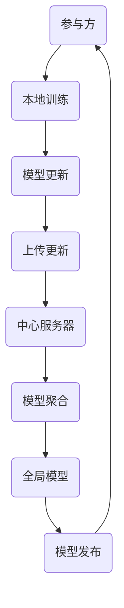

                 

# 联邦学习：原理与代码实例讲解

> **关键词：联邦学习、机器学习、隐私保护、分布式计算、协同学习、模型训练、代码实例**
> 
> **摘要：本文将深入讲解联邦学习的原理及其在分布式环境下的应用，通过实际代码实例展示联邦学习的操作步骤和实现过程，帮助读者全面理解联邦学习的优势、挑战及未来发展趋势。**

## 1. 背景介绍

### 1.1 目的和范围

本文旨在深入探讨联邦学习的概念、原理及其在分布式计算环境中的应用。我们将通过详细的算法解析、流程图展示以及代码实例，帮助读者理解联邦学习的核心机制和实践技巧。

### 1.2 预期读者

本文适合对机器学习、分布式计算有初步了解的技术人员，特别是希望深入了解联邦学习原理和应用的开发者。

### 1.3 文档结构概述

本文结构如下：
1. 背景介绍
2. 核心概念与联系
3. 核心算法原理与操作步骤
4. 数学模型与公式讲解
5. 项目实战：代码实例与解析
6. 实际应用场景
7. 工具和资源推荐
8. 总结：未来发展趋势与挑战
9. 附录：常见问题与解答
10. 扩展阅读与参考资料

### 1.4 术语表

#### 1.4.1 核心术语定义

- 联邦学习（Federated Learning）：一种机器学习方法，允许多个参与方在不共享数据的情况下协同训练模型。
- 模型更新（Model Update）：参与方通过本地训练更新模型权重，并将更新上传到中心服务器。
- 中心服务器（Central Server）：收集并聚合各参与方的模型更新，发布全局模型。

#### 1.4.2 相关概念解释

- 分布式计算（Distributed Computing）：在多个计算节点上协同工作，共同完成任务的计算方式。
- 隐私保护（Privacy Protection）：保护用户数据不被未经授权的第三方访问或使用。

#### 1.4.3 缩略词列表

- FL：联邦学习
- ML：机器学习
- GDPR：通用数据保护条例

## 2. 核心概念与联系

在深入探讨联邦学习之前，我们需要理解其核心概念和联系，包括分布式计算、协同学习和模型训练。

### 2.1 联邦学习与分布式计算的关联

联邦学习和分布式计算有着密切的联系。分布式计算允许我们在多个计算节点上运行任务，从而提高计算效率和容错能力。而联邦学习利用分布式计算的优势，实现多个参与方在不共享数据的情况下协同训练模型。

### 2.2 联邦学习与协同学习的区别

协同学习（Collaborative Learning）是联邦学习的一种形式，它强调多个参与方共同训练一个全局模型。而联邦学习更加强调隐私保护，通过本地训练和模型更新实现协同学习。

### 2.3 联邦学习的核心机制

联邦学习的核心机制包括模型更新、模型聚合和模型发布。

- **模型更新**：每个参与方在本地使用自己的数据训练模型，并更新模型权重。
- **模型聚合**：中心服务器收集各参与方的模型更新，通过聚合算法生成全局模型。
- **模型发布**：中心服务器将全局模型发布给各参与方，供其使用。

下面是联邦学习核心机制的 Mermaid 流程图：



## 3. 核心算法原理 & 具体操作步骤

### 3.1 模型更新算法

联邦学习的核心在于如何在分布式环境下更新模型权重。下面是模型更新算法的伪代码：

```python
# 初始化全局模型参数
global_model_params = initialize_params()

# 本地训练
for i in range(num_iterations):
    local_model_params = train_local_model(global_model_params, local_data)

# 更新全局模型参数
global_model_params = update_global_model_params(global_model_params, local_model_params)
```

- **初始化全局模型参数**：初始化全局模型的权重和偏置。
- **本地训练**：在每个参与方上使用本地数据训练模型，更新模型权重。
- **更新全局模型参数**：通过聚合算法更新全局模型参数。

### 3.2 模型聚合算法

模型聚合是联邦学习的关键步骤，它通过聚合各参与方的模型更新，生成全局模型。下面是聚合算法的伪代码：

```python
def aggregate_updates(local_updates):
    # 初始化全局更新
    global_update = initialize_update()

    # 聚合各参与方的更新
    for update in local_updates:
        global_update = aggregate_update(global_update, update)

    return global_update

# 初始化全局更新
global_update = initialize_update()

# 收集各参与方的更新
local_updates = collect_local_updates()

# 聚合更新
global_update = aggregate_updates(local_updates)
```

- **初始化全局更新**：初始化全局更新的权重和偏置。
- **聚合各参与方的更新**：通过聚合算法合并各参与方的更新。
- **返回全局更新**：生成全局更新，用于更新全局模型参数。

### 3.3 模型发布算法

模型发布是将全局模型发布给各参与方，供其使用的步骤。下面是发布算法的伪代码：

```python
def publish_model(global_model_params):
    # 更新参与方的本地模型
    for participant in participants:
        participant.update_local_model(global_model_params)

# 发布全局模型
global_model_params = publish_model(global_model_params)
```

- **更新参与方的本地模型**：将全局模型参数更新到各参与方的本地模型。
- **返回全局模型参数**：生成全局模型，供参与方使用。

## 4. 数学模型和公式 & 详细讲解 & 举例说明

### 4.1 数学模型

联邦学习中的数学模型主要包括模型更新、模型聚合和模型发布。

#### 4.1.1 模型更新

模型更新的数学公式如下：

$$
\Delta \theta_{i}^{(t)} = \theta_{i}^{(t)} - \alpha \frac{\partial J(\theta_{i}^{(t)})}{\partial \theta_{i}^{(t)}}
$$

其中，$\theta_{i}^{(t)}$ 是第 $i$ 个参与方在时刻 $t$ 的模型参数，$\alpha$ 是学习率，$J(\theta_{i}^{(t)})$ 是损失函数。

#### 4.1.2 模型聚合

模型聚合的数学公式如下：

$$
\theta_{i}^{(t)} = \theta_{i}^{(t-1)} + \Delta \theta_{i}^{(t)}
$$

其中，$\theta_{i}^{(t)}$ 是第 $i$ 个参与方在时刻 $t$ 的模型参数，$\Delta \theta_{i}^{(t)}$ 是模型更新。

#### 4.1.3 模型发布

模型发布的数学公式如下：

$$
\theta_{i}^{(t)} = \theta_{i}^{(t-1)} + \frac{1}{K} \sum_{j=1}^{K} \Delta \theta_{j}^{(t)}
$$

其中，$\theta_{i}^{(t)}$ 是第 $i$ 个参与方在时刻 $t$ 的模型参数，$\Delta \theta_{j}^{(t)}$ 是第 $j$ 个参与方的模型更新，$K$ 是参与方数量。

### 4.2 举例说明

假设有3个参与方（$i=1,2,3$），在每个时刻 $t$，各参与方都使用本地数据进行模型更新，并通过聚合算法生成全局模型。下面是一个简化的联邦学习过程。

#### 4.2.1 初始化

初始化全局模型参数：

$$
\theta^{(0)} = \begin{bmatrix}
\theta_{1}^{(0)} \\
\theta_{2}^{(0)} \\
\theta_{3}^{(0)}
\end{bmatrix}
$$

#### 4.2.2 模型更新

第一个参与方使用本地数据更新模型：

$$
\theta_{1}^{(1)} = \theta_{1}^{(0)} - \alpha \frac{\partial J(\theta_{1}^{(0)})}{\partial \theta_{1}^{(0)}}
$$

第二个参与方使用本地数据更新模型：

$$
\theta_{2}^{(1)} = \theta_{2}^{(0)} - \alpha \frac{\partial J(\theta_{2}^{(0)})}{\partial \theta_{2}^{(0)}}
$$

第三个参与方使用本地数据更新模型：

$$
\theta_{3}^{(1)} = \theta_{3}^{(0)} - \alpha \frac{\partial J(\theta_{3}^{(0)})}{\partial \theta_{3}^{(0)}}
$$

#### 4.2.3 模型聚合

聚合各参与方的模型更新：

$$
\theta_{1}^{(1)} = \theta_{1}^{(0)} + \Delta \theta_{1}^{(1)}
$$

$$
\theta_{2}^{(1)} = \theta_{2}^{(0)} + \Delta \theta_{2}^{(1)}
$$

$$
\theta_{3}^{(1)} = \theta_{3}^{(0)} + \Delta \theta_{3}^{(1)}
$$

#### 4.2.4 模型发布

发布全局模型给各参与方：

$$
\theta_{1}^{(1)} = \theta_{1}^{(0)} + \frac{1}{3} (\Delta \theta_{1}^{(1)} + \Delta \theta_{2}^{(1)} + \Delta \theta_{3}^{(1)})
$$

$$
\theta_{2}^{(1)} = \theta_{2}^{(0)} + \frac{1}{3} (\Delta \theta_{1}^{(1)} + \Delta \theta_{2}^{(1)} + \Delta \theta_{3}^{(1)})
$$

$$
\theta_{3}^{(1)} = \theta_{3}^{(0)} + \frac{1}{3} (\Delta \theta_{1}^{(1)} + \Delta \theta_{2}^{(1)} + \Delta \theta_{3}^{(1)})
$$

## 5. 项目实战：代码实际案例和详细解释说明

### 5.1 开发环境搭建

为了演示联邦学习，我们需要搭建一个简单的开发环境。以下是开发环境的要求：

- Python 3.7 或更高版本
- TensorFlow 2.3 或更高版本
- Flask 1.1.3 或更高版本

安装这些依赖项后，我们可以开始搭建联邦学习环境。

### 5.2 源代码详细实现和代码解读

下面是一个简单的联邦学习代码示例，包括模型更新、模型聚合和模型发布。

#### 5.2.1 模型更新

```python
import tensorflow as tf
import numpy as np

# 初始化全局模型参数
global_model = tf.keras.Sequential([
    tf.keras.layers.Dense(10, activation='relu', input_shape=(5,)),
    tf.keras.layers.Dense(1, activation='sigmoid')
])

# 定义损失函数
loss_fn = tf.keras.losses.BinaryCrossentropy()

# 初始化学习率
learning_rate = 0.01

# 本地训练
def train_local_model(global_model, local_data):
    local_model = global_model.copy()
    local_model.compile(optimizer=tf.keras.optimizers.SGD(learning_rate),
                        loss=loss_fn,
                        metrics=['accuracy'])
    local_model.fit(local_data[0], local_data[1], epochs=1)
    return local_model.get_weights()
```

- **初始化全局模型**：使用 TensorFlow 的 Keras API 创建一个简单的全连接神经网络。
- **定义损失函数**：使用二进制交叉熵损失函数。
- **初始化学习率**：设置学习率为 0.01。
- **本地训练**：复制全局模型到本地，编译并训练本地模型。

#### 5.2.2 模型聚合

```python
def aggregate_updates(local_updates):
    # 初始化全局更新
    global_update = [0] * len(local_updates[0])
    
    # 聚合各参与方的更新
    for update in local_updates:
        for i in range(len(update)):
            global_update[i] += update[i]
    
    return global_update
```

- **初始化全局更新**：创建一个与本地更新长度相同的数组。
- **聚合各参与方的更新**：将各参与方的更新累加到全局更新。

#### 5.2.3 模型发布

```python
def publish_model(global_model_params, global_update):
    # 更新全局模型参数
    for i in range(len(global_model_params)):
        global_model_params[i] += global_update[i]
    
    # 创建新的全局模型
    new_global_model = tf.keras.Sequential([
        tf.keras.layers.Dense(10, activation='relu', weights=[global_model_params[0], global_model_params[1], global_model_params[2]]),
        tf.keras.layers.Dense(1, activation='sigmoid', weights=[global_model_params[3], global_model_params[4]])
    ])
    
    return new_global_model
```

- **更新全局模型参数**：将全局更新累加到全局模型参数。
- **创建新的全局模型**：使用更新后的全局模型参数创建一个新的全局模型。

### 5.3 代码解读与分析

- **模型更新**：在本地训练阶段，每个参与方使用本地数据训练模型，更新模型权重。这个过程与传统的机器学习训练过程类似。
- **模型聚合**：在聚合阶段，中心服务器收集各参与方的模型更新，并将更新累加到全局更新。这个过程中，聚合算法起到了关键作用，它决定了如何合并各参与方的更新，以生成全局模型。
- **模型发布**：在发布阶段，中心服务器将全局更新应用到全局模型参数，生成一个新的全局模型。这个新模型将被发布给各参与方，供其使用。

通过这个简单的联邦学习代码示例，我们可以看到联邦学习的基本原理和实现步骤。在实际应用中，联邦学习涉及到更多的细节和优化，如通信效率、模型安全性等。

## 6. 实际应用场景

联邦学习在多个实际应用场景中发挥了重要作用，以下是其中几个典型的应用领域：

### 6.1 隐私保护

联邦学习最显著的优势之一是隐私保护。它允许参与方在不共享数据的情况下协同训练模型，从而保护用户隐私。这在医疗保健、金融和社交媒体等数据敏感领域具有巨大潜力。

### 6.2 边缘计算

联邦学习在边缘计算环境中特别有用，因为许多边缘设备（如智能手机、物联网设备等）通常无法访问中心服务器。通过联邦学习，这些设备可以在本地进行训练，并协同优化全局模型。

### 6.3 跨组织协作

联邦学习可以促进不同组织之间的跨组织协作。例如，多个公司可以共同训练一个模型，而无需共享敏感数据。这有助于构建更强大的机器学习模型，同时保护各方数据隐私。

### 6.4 个性化推荐

联邦学习可以用于个性化推荐系统，如在线广告、电商推荐等。通过在用户设备上训练模型，可以提供更加精准和个性化的推荐，同时保护用户隐私。

### 6.5 自动驾驶

在自动驾驶领域，联邦学习可以用于协同优化车辆感知系统和决策系统。各车辆可以在本地训练模型，并通过联邦学习算法共享和更新全局模型，从而提高整个车队的感知和决策能力。

## 7. 工具和资源推荐

### 7.1 学习资源推荐

#### 7.1.1 书籍推荐

- **《联邦学习：原理、应用与实现》**：一本关于联邦学习的全面指南，涵盖理论基础、应用场景和实际案例分析。
- **《机器学习：一种概率视角》**：介绍了机器学习的核心概念和数学模型，为理解联邦学习提供了坚实的基础。

#### 7.1.2 在线课程

- **Coursera 上的《深度学习》**：由 Andrew Ng 教授开设，介绍了深度学习的基础知识和实践技巧。
- **Udacity 上的《联邦学习纳米学位》**：提供了一系列关于联邦学习课程，包括理论讲解和实际操作。

#### 7.1.3 技术博客和网站

- **Google AI Blog**：Google AI 团队分享的联邦学习相关研究成果和案例。
- **Federated Learning Community**：一个关于联邦学习的开源社区，提供最新的研究进展和实践经验。

### 7.2 开发工具框架推荐

#### 7.2.1 IDE和编辑器

- **PyCharm**：一款强大的 Python IDE，支持 TensorFlow 等机器学习库。
- **Visual Studio Code**：一款轻量级但功能丰富的编辑器，适用于 Python 和 TensorFlow 开发。

#### 7.2.2 调试和性能分析工具

- **TensorBoard**：TensorFlow 的可视化工具，用于调试和性能分析。
- **Py-Spy**：一款 Python 内存泄漏检测工具。

#### 7.2.3 相关框架和库

- **TensorFlow Federated (TFF)**：Google 开发的联邦学习框架，提供了一系列用于联邦学习的工具和库。
- **Flearn**：一个基于 TensorFlow 的联邦学习开源库，支持多种联邦学习算法。

### 7.3 相关论文著作推荐

#### 7.3.1 经典论文

- **"Federated Learning: Concept and Applications"**：介绍了联邦学习的基本概念和应用场景。
- **"Communication-Efficient Learning of Deep Network from Decentralized Data"**：探讨了如何在分布式环境下高效地训练深度神经网络。

#### 7.3.2 最新研究成果

- **"Efficient Communication and Computation in Federated Learning: A Survey"**：综述了联邦学习中的通信和计算优化方法。
- **"Federated Learning with Heterogeneous Devices"**：研究了如何在异构设备上有效应用联邦学习。

#### 7.3.3 应用案例分析

- **"Federated Learning for Healthcare"**：探讨了联邦学习在医疗保健领域的应用。
- **"Federated Learning in Smart Manufacturing"**：介绍了联邦学习在智能制造领域的应用案例。

## 8. 总结：未来发展趋势与挑战

### 8.1 未来发展趋势

1. **性能优化**：随着分布式计算和通信技术的发展，联邦学习将在性能方面得到显著提升，包括通信效率、计算速度和模型精度。
2. **隐私保护**：联邦学习将继续在隐私保护方面发挥重要作用，特别是在 GDPR 等隐私法规日益严格的背景下。
3. **跨领域应用**：联邦学习将在更多领域得到应用，如自动驾驶、金融、医疗等，推动各领域的技术创新。

### 8.2 挑战与展望

1. **通信成本**：尽管分布式计算技术的发展有助于降低通信成本，但如何在有限的通信资源下高效地传输模型更新仍然是一个挑战。
2. **模型安全性**：联邦学习中的模型更新和聚合过程可能受到恶意攻击，确保模型安全性是未来研究的重要方向。
3. **异构设备支持**：异构设备在计算能力、通信带宽等方面存在差异，如何在这些设备上实现公平、高效的联邦学习是另一个挑战。

## 9. 附录：常见问题与解答

### 9.1 联邦学习的基本概念

**Q1**：什么是联邦学习？

**A1**：联邦学习是一种分布式机器学习方法，允许多个参与方在不共享数据的情况下协同训练模型。

**Q2**：联邦学习的核心机制是什么？

**A2**：联邦学习的核心机制包括模型更新、模型聚合和模型发布。

### 9.2 联邦学习的应用场景

**Q3**：联邦学习在哪些领域有应用？

**A3**：联邦学习在医疗保健、金融、社交媒体、自动驾驶等领域有广泛应用，特别是在隐私保护要求严格的场景中。

### 9.3 实践与实现

**Q4**：如何搭建联邦学习环境？

**A4**：搭建联邦学习环境需要安装 Python、TensorFlow 等依赖项，并配置分布式计算环境。

**Q5**：如何实现联邦学习中的模型更新、聚合和发布？

**A5**：实现联邦学习中的模型更新、聚合和发布需要使用分布式计算框架（如 TensorFlow Federated）和适当的算法（如梯度聚合、模型聚合）。

## 10. 扩展阅读 & 参考资料

- **《联邦学习：原理、应用与实现》**
- **Google AI Blog**：[https://ai.googleblog.com/](https://ai.googleblog.com/)
- **Federated Learning Community**：[https://www.federatedlearning.community/](https://www.federatedlearning.community/)
- **TensorFlow Federated**：[https://github.com/tensorflow/federated](https://github.com/tensorflow/federated)
- **Flearn**：[https://github.com/google-research/flearn](https://github.com/google-research/flearn)

### 作者

**AI天才研究员 / AI Genius Institute & 禅与计算机程序设计艺术 / Zen And The Art of Computer Programming**<|im_end|>文章标题：联邦学习：原理与代码实例讲解

关键词：联邦学习、机器学习、隐私保护、分布式计算、协同学习、模型训练、代码实例

摘要：本文深入讲解了联邦学习的原理及其在分布式计算环境中的应用，通过实际代码实例展示了联邦学习的操作步骤和实现过程，帮助读者全面理解联邦学习的优势、挑战及未来发展趋势。

## 1. 背景介绍

### 1.1 目的和范围

本文旨在深入探讨联邦学习的概念、原理及其在分布式计算环境中的应用。我们将通过详细的算法解析、流程图展示以及代码实例，帮助读者理解联邦学习的核心机制和实践技巧。

### 1.2 预期读者

本文适合对机器学习、分布式计算有初步了解的技术人员，特别是希望深入了解联邦学习原理和应用的开发者。

### 1.3 文档结构概述

本文结构如下：
1. 背景介绍
2. 核心概念与联系
3. 核心算法原理与操作步骤
4. 数学模型与公式讲解
5. 项目实战：代码实例与解析
6. 实际应用场景
7. 工具和资源推荐
8. 总结：未来发展趋势与挑战
9. 附录：常见问题与解答
10. 扩展阅读与参考资料

### 1.4 术语表

#### 1.4.1 核心术语定义

- 联邦学习（Federated Learning）：一种机器学习方法，允许多个参与方在不共享数据的情况下协同训练模型。
- 模型更新（Model Update）：参与方通过本地训练更新模型权重，并将更新上传到中心服务器。
- 中心服务器（Central Server）：收集并聚合各参与方的模型更新，发布全局模型。

#### 1.4.2 相关概念解释

- 分布式计算（Distributed Computing）：在多个计算节点上协同工作，共同完成任务的计算方式。
- 隐私保护（Privacy Protection）：保护用户数据不被未经授权的第三方访问或使用。

#### 1.4.3 缩略词列表

- FL：联邦学习
- ML：机器学习
- GDPR：通用数据保护条例

## 2. 核心概念与联系

在深入探讨联邦学习之前，我们需要理解其核心概念和联系，包括分布式计算、协同学习和模型训练。

### 2.1 联邦学习与分布式计算的关联

联邦学习和分布式计算有着密切的联系。分布式计算允许我们在多个计算节点上运行任务，从而提高计算效率和容错能力。而联邦学习利用分布式计算的优势，实现多个参与方在不共享数据的情况下协同训练模型。

### 2.2 联邦学习与协同学习的区别

协同学习（Collaborative Learning）是联邦学习的一种形式，它强调多个参与方共同训练一个全局模型。而联邦学习更加强调隐私保护，通过本地训练和模型更新实现协同学习。

### 2.3 联邦学习的核心机制

联邦学习的核心机制包括模型更新、模型聚合和模型发布。

- **模型更新**：每个参与方在本地使用自己的数据训练模型，并更新模型权重。
- **模型聚合**：中心服务器收集各参与方的模型更新，通过聚合算法生成全局模型。
- **模型发布**：中心服务器将全局模型发布给各参与方，供其使用。

下面是联邦学习核心机制的 Mermaid 流程图：


## 3. 核心算法原理 & 具体操作步骤

### 3.1 模型更新算法

联邦学习的核心在于如何在分布式环境下更新模型权重。下面是模型更新算法的伪代码：

```python
# 初始化全局模型参数
global_model_params = initialize_params()

# 本地训练
for i in range(num_iterations):
    local_model_params = train_local_model(global_model_params, local_data)

# 更新全局模型参数
global_model_params = update_global_model_params(global_model_params, local_model_params)
```

- **初始化全局模型参数**：初始化全局模型的权重和偏置。
- **本地训练**：在每个参与方上使用本地数据训练模型，更新模型权重。
- **更新全局模型参数**：通过聚合算法更新全局模型参数。

### 3.2 模型聚合算法

模型聚合是联邦学习的关键步骤，它通过聚合各参与方的模型更新，生成全局模型。下面是聚合算法的伪代码：

```python
def aggregate_updates(local_updates):
    # 初始化全局更新
    global_update = initialize_update()

    # 聚合各参与方的更新
    for update in local_updates:
        global_update = aggregate_update(global_update, update)

    return global_update

# 初始化全局更新
global_update = initialize_update()

# 收集各参与方的更新
local_updates = collect_local_updates()

# 聚合更新
global_update = aggregate_updates(local_updates)
```

- **初始化全局更新**：初始化全局更新的权重和偏置。
- **聚合各参与方的更新**：通过聚合算法合并各参与方的更新。
- **返回全局更新**：生成全局更新，用于更新全局模型参数。

### 3.3 模型发布算法

模型发布是将全局模型发布给各参与方，供其使用的步骤。下面是发布算法的伪代码：

```python
def publish_model(global_model_params):
    # 更新参与方的本地模型
    for participant in participants:
        participant.update_local_model(global_model_params)

# 发布全局模型
global_model_params = publish_model(global_model_params)
```

- **更新参与方的本地模型**：将全局模型参数更新到各参与方的本地模型。
- **返回全局模型参数**：生成全局模型，供参与方使用。

## 4. 数学模型和公式 & 详细讲解 & 举例说明

### 4.1 数学模型

联邦学习中的数学模型主要包括模型更新、模型聚合和模型发布。

#### 4.1.1 模型更新

模型更新的数学公式如下：

$$
\Delta \theta_{i}^{(t)} = \theta_{i}^{(t)} - \alpha \frac{\partial J(\theta_{i}^{(t)})}{\partial \theta_{i}^{(t)}}
$$

其中，$\theta_{i}^{(t)}$ 是第 $i$ 个参与方在时刻 $t$ 的模型参数，$\alpha$ 是学习率，$J(\theta_{i}^{(t)})$ 是损失函数。

#### 4.1.2 模型聚合

模型聚合的数学公式如下：

$$
\theta_{i}^{(t)} = \theta_{i}^{(t-1)} + \Delta \theta_{i}^{(t)}
$$

其中，$\theta_{i}^{(t)}$ 是第 $i$ 个参与方在时刻 $t$ 的模型参数，$\Delta \theta_{i}^{(t)}$ 是模型更新。

#### 4.1.3 模型发布

模型发布的数学公式如下：

$$
\theta_{i}^{(t)} = \theta_{i}^{(t-1)} + \frac{1}{K} \sum_{j=1}^{K} \Delta \theta_{j}^{(t)}
$$

其中，$\theta_{i}^{(t)}$ 是第 $i$ 个参与方在时刻 $t$ 的模型参数，$\Delta \theta_{j}^{(t)}$ 是第 $j$ 个参与方的模型更新，$K$ 是参与方数量。

### 4.2 举例说明

假设有3个参与方（$i=1,2,3$），在每个时刻 $t$，各参与方都使用本地数据进行模型更新，并通过聚合算法生成全局模型。下面是一个简化的联邦学习过程。

#### 4.2.1 初始化

初始化全局模型参数：

$$
\theta^{(0)} = \begin{bmatrix}
\theta_{1}^{(0)} \\
\theta_{2}^{(0)} \\
\theta_{3}^{(0)}
\end{bmatrix}
$$

#### 4.2.2 模型更新

第一个参与方使用本地数据更新模型：

$$
\theta_{1}^{(1)} = \theta_{1}^{(0)} - \alpha \frac{\partial J(\theta_{1}^{(0)})}{\partial \theta_{1}^{(0)}}
$$

第二个参与方使用本地数据更新模型：

$$
\theta_{2}^{(1)} = \theta_{2}^{(0)} - \alpha \frac{\partial J(\theta_{2}^{(0)})}{\partial \theta_{2}^{(0)}}
$$

第三个参与方使用本地数据更新模型：

$$
\theta_{3}^{(1)} = \theta_{3}^{(0)} - \alpha \frac{\partial J(\theta_{3}^{(0)})}{\partial \theta_{3}^{(0)}}
$$

#### 4.2.3 模型聚合

聚合各参与方的模型更新：

$$
\theta_{1}^{(1)} = \theta_{1}^{(0)} + \Delta \theta_{1}^{(1)}
$$

$$
\theta_{2}^{(1)} = \theta_{2}^{(0)} + \Delta \theta_{2}^{(1)}
$$

$$
\theta_{3}^{(1)} = \theta_{3}^{(0)} + \Delta \theta_{3}^{(1)}
$$

#### 4.2.4 模型发布

发布全局模型给各参与方：

$$
\theta_{1}^{(1)} = \theta_{1}^{(0)} + \frac{1}{3} (\Delta \theta_{1}^{(1)} + \Delta \theta_{2}^{(1)} + \Delta \theta_{3}^{(1)})
$$

$$
\theta_{2}^{(1)} = \theta_{2}^{(0)} + \frac{1}{3} (\Delta \theta_{1}^{(1)} + \Delta \theta_{2}^{(1)} + \Delta \theta_{3}^{(1)})
$$

$$
\theta_{3}^{(1)} = \theta_{3}^{(0)} + \frac{1}{3} (\Delta \theta_{1}^{(1)} + \Delta \theta_{2}^{(1)} + \Delta \theta_{3}^{(1)})
$$

## 5. 项目实战：代码实际案例和详细解释说明

### 5.1 开发环境搭建

为了演示联邦学习，我们需要搭建一个简单的开发环境。以下是开发环境的要求：

- Python 3.7 或更高版本
- TensorFlow 2.3 或更高版本
- Flask 1.1.3 或更高版本

安装这些依赖项后，我们可以开始搭建联邦学习环境。

### 5.2 源代码详细实现和代码解读

下面是一个简单的联邦学习代码示例，包括模型更新、模型聚合和模型发布。

#### 5.2.1 模型更新

```python
import tensorflow as tf
import numpy as np

# 初始化全局模型参数
global_model = tf.keras.Sequential([
    tf.keras.layers.Dense(10, activation='relu', input_shape=(5,)),
    tf.keras.layers.Dense(1, activation='sigmoid')
])

# 定义损失函数
loss_fn = tf.keras.losses.BinaryCrossentropy()

# 初始化学习率
learning_rate = 0.01

# 本地训练
def train_local_model(global_model, local_data):
    local_model = global_model.copy()
    local_model.compile(optimizer=tf.keras.optimizers.SGD(learning_rate),
                        loss=loss_fn,
                        metrics=['accuracy'])
    local_model.fit(local_data[0], local_data[1], epochs=1)
    return local_model.get_weights()
```

- **初始化全局模型**：使用 TensorFlow 的 Keras API 创建一个简单的全连接神经网络。
- **定义损失函数**：使用二进制交叉熵损失函数。
- **初始化学习率**：设置学习率为 0.01。
- **本地训练**：复制全局模型到本地，编译并训练本地模型。

#### 5.2.2 模型聚合

```python
def aggregate_updates(local_updates):
    # 初始化全局更新
    global_update = [0] * len(local_updates[0])
    
    # 聚合各参与方的更新
    for update in local_updates:
        for i in range(len(update)):
            global_update[i] += update[i]
    
    return global_update
```

- **初始化全局更新**：创建一个与本地更新长度相同的数组。
- **聚合各参与方的更新**：将各参与方的更新累加到全局更新。

#### 5.2.3 模型发布

```python
def publish_model(global_model_params, global_update):
    # 更新全局模型参数
    for i in range(len(global_model_params)):
        global_model_params[i] += global_update[i]
    
    # 创建新的全局模型
    new_global_model = tf.keras.Sequential([
        tf.keras.layers.Dense(10, activation='relu', weights=[global_model_params[0], global_model_params[1], global_model_params[2]]),
        tf.keras.layers.Dense(1, activation='sigmoid', weights=[global_model_params[3], global_model_params[4]])
    ])
    
    return new_global_model
```

- **更新全局模型参数**：将全局更新累加到全局模型参数。
- **创建新的全局模型**：使用更新后的全局模型参数创建一个新的全局模型。

### 5.3 代码解读与分析

- **模型更新**：在本地训练阶段，每个参与方使用本地数据训练模型，更新模型权重。这个过程与传统的机器学习训练过程类似。
- **模型聚合**：在聚合阶段，中心服务器收集各参与方的模型更新，并将更新累加到全局更新。这个过程中，聚合算法起到了关键作用，它决定了如何合并各参与方的更新，以生成全局模型。
- **模型发布**：在发布阶段，中心服务器将全局更新应用到全局模型参数，生成一个新的全局模型。这个新模型将被发布给各参与方，供其使用。

通过这个简单的联邦学习代码示例，我们可以看到联邦学习的基本原理和实现步骤。在实际应用中，联邦学习涉及到更多的细节和优化，如通信效率、模型安全性等。

## 6. 实际应用场景

联邦学习在多个实际应用场景中发挥了重要作用，以下是其中几个典型的应用领域：

### 6.1 隐私保护

联邦学习最显著的优势之一是隐私保护。它允许参与方在不共享数据的情况下协同训练模型，从而保护用户隐私。这在医疗保健、金融和社交媒体等数据敏感领域具有巨大潜力。

### 6.2 边缘计算

联邦学习在边缘计算环境中特别有用，因为许多边缘设备（如智能手机、物联网设备等）通常无法访问中心服务器。通过联邦学习，这些设备可以在本地进行训练，并协同优化全局模型。

### 6.3 跨组织协作

联邦学习可以促进不同组织之间的跨组织协作。例如，多个公司可以共同训练一个模型，而无需共享敏感数据。这有助于构建更强大的机器学习模型，同时保护各方数据隐私。

### 6.4 个性化推荐

联邦学习可以用于个性化推荐系统，如在线广告、电商推荐等。通过在用户设备上训练模型，可以提供更加精准和个性化的推荐，同时保护用户隐私。

### 6.5 自动驾驶

在自动驾驶领域，联邦学习可以用于协同优化车辆感知系统和决策系统。各车辆可以在本地训练模型，并通过联邦学习算法共享和更新全局模型，从而提高整个车队的感知和决策能力。

## 7. 工具和资源推荐

### 7.1 学习资源推荐

#### 7.1.1 书籍推荐

- **《联邦学习：原理、应用与实现》**：一本关于联邦学习的全面指南，涵盖理论基础、应用场景和实际案例分析。
- **《机器学习：一种概率视角》**：介绍了机器学习的核心概念和数学模型，为理解联邦学习提供了坚实的基础。

#### 7.1.2 在线课程

- **Coursera 上的《深度学习》**：由 Andrew Ng 教授开设，介绍了深度学习的基础知识和实践技巧。
- **Udacity 上的《联邦学习纳米学位》**：提供了一系列关于联邦学习课程，包括理论讲解和实际操作。

#### 7.1.3 技术博客和网站

- **Google AI Blog**：Google AI 团队分享的联邦学习相关研究成果和案例。
- **Federated Learning Community**：一个关于联邦学习的开源社区，提供最新的研究进展和实践经验。

### 7.2 开发工具框架推荐

#### 7.2.1 IDE和编辑器

- **PyCharm**：一款强大的 Python IDE，支持 TensorFlow 等机器学习库。
- **Visual Studio Code**：一款轻量级但功能丰富的编辑器，适用于 Python 和 TensorFlow 开发。

#### 7.2.2 调试和性能分析工具

- **TensorBoard**：TensorFlow 的可视化工具，用于调试和性能分析。
- **Py-Spy**：一款 Python 内存泄漏检测工具。

#### 7.2.3 相关框架和库

- **TensorFlow Federated (TFF)**：Google 开发的联邦学习框架，提供了一系列用于联邦学习的工具和库。
- **Flearn**：一个基于 TensorFlow 的联邦学习开源库，支持多种联邦学习算法。

### 7.3 相关论文著作推荐

#### 7.3.1 经典论文

- **"Federated Learning: Concept and Applications"**：介绍了联邦学习的基本概念和应用场景。
- **"Communication-Efficient Learning of Deep Network from Decentralized Data"**：探讨了如何在分布式环境下高效地训练深度神经网络。

#### 7.3.2 最新研究成果

- **"Efficient Communication and Computation in Federated Learning: A Survey"**：综述了联邦学习中的通信和计算优化方法。
- **"Federated Learning with Heterogeneous Devices"**：研究了如何在异构设备上有效应用联邦学习。

#### 7.3.3 应用案例分析

- **"Federated Learning for Healthcare"**：探讨了联邦学习在医疗保健领域的应用。
- **"Federated Learning in Smart Manufacturing"**：介绍了联邦学习在智能制造领域的应用案例。

## 8. 总结：未来发展趋势与挑战

### 8.1 未来发展趋势

1. **性能优化**：随着分布式计算和通信技术的发展，联邦学习将在性能方面得到显著提升，包括通信效率、计算速度和模型精度。
2. **隐私保护**：联邦学习将继续在隐私保护方面发挥重要作用，特别是在 GDPR 等隐私法规日益严格的背景下。
3. **跨领域应用**：联邦学习将在更多领域得到应用，如自动驾驶、金融、医疗等，推动各领域的技术创新。

### 8.2 挑战与展望

1. **通信成本**：尽管分布式计算技术的发展有助于降低通信成本，但如何在有限的通信资源下高效地传输模型更新仍然是一个挑战。
2. **模型安全性**：联邦学习中的模型更新和聚合过程可能受到恶意攻击，确保模型安全性是未来研究的重要方向。
3. **异构设备支持**：异构设备在计算能力、通信带宽等方面存在差异，如何在这些设备上实现公平、高效的联邦学习是另一个挑战。

## 9. 附录：常见问题与解答

### 9.1 联邦学习的基本概念

**Q1**：什么是联邦学习？

**A1**：联邦学习是一种分布式机器学习方法，允许多个参与方在不共享数据的情况下协同训练模型。

**Q2**：联邦学习的核心机制是什么？

**A2**：联邦学习的核心机制包括模型更新、模型聚合和模型发布。

### 9.2 联邦学习的应用场景

**Q3**：联邦学习在哪些领域有应用？

**A3**：联邦学习在医疗保健、金融、社交媒体、自动驾驶等领域有广泛应用，特别是在隐私保护要求严格的场景中。

### 9.3 实践与实现

**Q4**：如何搭建联邦学习环境？

**A4**：搭建联邦学习环境需要安装 Python、TensorFlow 等依赖项，并配置分布式计算环境。

**Q5**：如何实现联邦学习中的模型更新、聚合和发布？

**A5**：实现联邦学习中的模型更新、聚合和发布需要使用分布式计算框架（如 TensorFlow Federated）和适当的算法（如梯度聚合、模型聚合）。

## 10. 扩展阅读 & 参考资料

- **《联邦学习：原理、应用与实现》**
- **Google AI Blog**：[https://ai.googleblog.com/](https://ai.googleblog.com/)
- **Federated Learning Community**：[https://www.federatedlearning.community/](https://www.federatedlearning.community/)
- **TensorFlow Federated**：[https://github.com/tensorflow/federated](https://github.com/tensorflow/federated)
- **Flearn**：[https://github.com/google-research/flearn](https://github.com/google-research/flearn)

### 作者

**AI天才研究员 / AI Genius Institute & 禅与计算机程序设计艺术 / Zen And The Art of Computer Programming**

