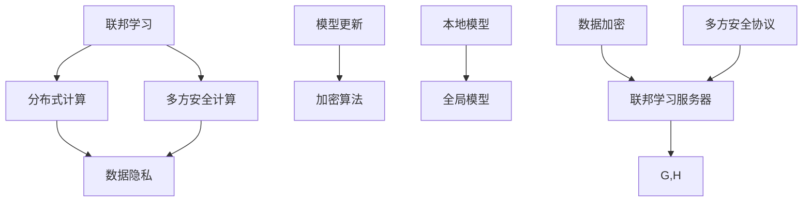

                 

# 联邦学习在多方安全计算中的隐私保护

> **关键词：联邦学习、多方安全计算、隐私保护、分布式计算、机器学习**
>
> **摘要：本文将深入探讨联邦学习在多方安全计算中的隐私保护机制，分析其核心原理、算法模型以及具体实现步骤，结合实际项目案例，探讨联邦学习在分布式计算环境中的广泛应用前景。**

## 1. 背景介绍

### 1.1 目的和范围

本文旨在详细解析联邦学习在多方安全计算中的隐私保护机制，帮助读者理解其基本概念、核心原理和具体实现过程。文章将首先介绍联邦学习的背景和发展历程，随后深入探讨其在多方安全计算中的应用，重点分析其隐私保护机制。最后，本文将结合实际项目案例，展示联邦学习在实际应用中的优势和挑战，展望其未来发展趋势。

### 1.2 预期读者

本文适用于对联邦学习和多方安全计算有一定了解的读者，包括但不限于：
1. 计算机科学和人工智能领域的研究人员和工程师；
2. 数据科学家和机器学习工程师；
3. 对分布式计算和隐私保护技术感兴趣的爱好者；
4. 对联邦学习在实际应用中面临的挑战和机遇感兴趣的从业者。

### 1.3 文档结构概述

本文分为十个部分，具体结构如下：

1. 背景介绍：介绍联邦学习的目的、范围和预期读者，概述文章结构。
2. 核心概念与联系：介绍联邦学习和多方安全计算的基本概念，展示其核心原理和架构。
3. 核心算法原理 & 具体操作步骤：详细讲解联邦学习的核心算法原理，使用伪代码展示具体操作步骤。
4. 数学模型和公式 & 详细讲解 & 举例说明：介绍联邦学习的数学模型和公式，通过实例进行详细讲解。
5. 项目实战：代码实际案例和详细解释说明，展示联邦学习在分布式计算环境中的具体实现。
6. 实际应用场景：分析联邦学习在多方安全计算中的实际应用场景，探讨其优势和应用价值。
7. 工具和资源推荐：推荐学习资源、开发工具和框架，提供进一步学习的技术支持。
8. 总结：未来发展趋势与挑战，展望联邦学习的未来发展。
9. 附录：常见问题与解答，为读者解答联邦学习在实际应用中的常见问题。
10. 扩展阅读 & 参考资料：提供更多相关文献和资料，帮助读者深入拓展知识。

### 1.4 术语表

#### 1.4.1 核心术语定义

- **联邦学习（Federated Learning）**：一种分布式机器学习方法，通过聚合多个参与方的模型更新来实现全局模型优化，而不需要共享原始数据。
- **多方安全计算（Multi-party Computation）**：一种计算模型，允许多个参与方共同计算某个函数的输出，同时保持各自输入的隐私。
- **隐私保护（Privacy Protection）**：确保数据在处理和使用过程中不被未经授权的访问、泄露或篡改。
- **分布式计算（Distributed Computing）**：一种计算模型，通过将任务分配给多个计算节点，实现大规模数据的处理和计算。
- **机器学习（Machine Learning）**：一种人工智能方法，通过从数据中学习规律和模式，实现预测和决策。

#### 1.4.2 相关概念解释

- **模型更新（Model Update）**：在联邦学习中，每个参与方定期更新本地模型，然后将其发送给中心服务器，以实现全局模型的聚合。
- **加密算法（Cryptographic Algorithm）**：用于加密和解密数据的算法，确保数据在传输和存储过程中的安全性。
- **联邦学习服务器（Federated Learning Server）**：负责协调和聚合参与方模型的中心服务器。
- **本地模型（Local Model）**：在每个参与方设备上训练的模型。
- **全局模型（Global Model）**：通过聚合所有参与方的本地模型更新得到的全局模型。

#### 1.4.3 缩略词列表

- **FL**：联邦学习（Federated Learning）
- **MPC**：多方安全计算（Multi-party Computation）
- **DNN**：深度神经网络（Deep Neural Network）
- **SGD**：随机梯度下降（Stochastic Gradient Descent）
- **PS**：隐私设置（Privacy Set）
- **CI**：协同计算（Collaborative Inference）

## 2. 核心概念与联系

为了更好地理解联邦学习在多方安全计算中的隐私保护机制，我们需要先了解一些核心概念和它们之间的关系。以下是一个用Mermaid绘制的流程图，展示了联邦学习和多方安全计算的基本概念及其相互联系。



### 2.1 核心概念解释

#### 联邦学习（Federated Learning）

联邦学习是一种分布式机器学习技术，旨在通过多个参与方（如手机用户、企业数据中心等）的本地数据训练模型，而不需要共享原始数据。其基本原理是每个参与方在本地训练模型，并定期将其更新发送给中心服务器，服务器将所有更新聚合为一个全局模型。

#### 分布式计算（Distributed Computing）

分布式计算是一种将计算任务分布在多个计算节点上执行的计算模型，旨在提高计算效率和扩展性。在联邦学习中，分布式计算用于训练多个本地模型，并在不同参与方之间传输模型更新。

#### 多方安全计算（Multi-party Computation）

多方安全计算是一种计算模型，允许多个参与方共同计算某个函数的输出，同时保持各自输入的隐私。在联邦学习中，多方安全计算用于保护参与方的本地数据，确保在模型更新过程中数据的隐私不被泄露。

#### 数据隐私（Data Privacy）

数据隐私是指数据在处理和使用过程中不被未经授权的访问、泄露或篡改。在联邦学习中，数据隐私是一个关键问题，因为参与方的本地数据不被共享，但仍然需要保证模型更新过程中的数据安全。

#### 模型更新（Model Update）

模型更新是联邦学习的关键过程，每个参与方在本地训练模型，并定期将其更新发送给中心服务器。服务器将所有更新聚合为一个全局模型，从而实现全局模型的优化。

#### 加密算法（Cryptographic Algorithm）

加密算法用于加密和解密数据，确保数据在传输和存储过程中的安全性。在联邦学习中，加密算法用于保护参与方的本地数据，防止数据泄露。

#### 本地模型（Local Model）

本地模型是在每个参与方设备上训练的模型。在联邦学习中，每个参与方使用本地数据进行模型训练，并在本地更新模型。

#### 全局模型（Global Model）

全局模型是通过聚合所有参与方的本地模型更新得到的模型。在联邦学习中，全局模型是所有参与方共同优化的目标。

#### 联邦学习服务器（Federated Learning Server）

联邦学习服务器是负责协调和聚合参与方模型的中心服务器。服务器接收参与方的模型更新，并将这些更新聚合为一个全局模型。

#### 数据加密（Data Encryption）

数据加密是确保数据在传输和存储过程中的安全性的一种技术。在联邦学习中，数据加密用于保护参与方的本地数据，防止数据泄露。

#### 多方安全协议（Multi-party Security Protocol）

多方安全协议是一种确保多方计算过程中数据隐私和安全性的协议。在联邦学习中，多方安全协议用于保护参与方的本地数据，确保在模型更新过程中数据的隐私不被泄露。

通过上述核心概念的解释和Mermaid流程图的展示，我们可以更好地理解联邦学习在多方安全计算中的隐私保护机制，以及各个概念之间的相互关系。

## 3. 核心算法原理 & 具体操作步骤

在理解了联邦学习的基本概念之后，接下来我们将详细探讨其核心算法原理和具体操作步骤。联邦学习是一种基于分布式计算和多方安全计算的隐私保护技术，其核心算法主要包括模型训练、模型更新和模型聚合等步骤。

### 3.1 模型训练

模型训练是联邦学习的第一步，每个参与方在本地使用自己的数据训练一个本地模型。本地模型是参与方在本地训练得到的，旨在拟合本地数据集的规律和模式。具体操作步骤如下：

1. **数据预处理**：每个参与方对本地数据进行预处理，包括数据清洗、归一化和数据增强等操作。预处理后的数据用于训练本地模型。
2. **模型初始化**：在每个参与方设备上初始化一个基础模型，通常是一个简单的神经网络模型。基础模型作为本地模型训练的起点。
3. **本地模型训练**：使用预处理后的本地数据训练本地模型。训练过程中采用随机梯度下降（SGD）等优化算法，逐步更新模型参数，使模型更好地拟合本地数据。

### 3.2 模型更新

在本地模型训练完成后，每个参与方将本地模型的更新发送给中心服务器。模型更新包括模型参数和损失函数值等，用于中心服务器进行全局模型的聚合。具体操作步骤如下：

1. **模型参数加密**：为了保护参与方的本地数据隐私，在发送模型更新之前，需要对模型参数进行加密。常用的加密算法包括同态加密和基于属性的加密等。
2. **模型更新发送**：每个参与方将加密后的模型更新发送给中心服务器。服务器接收并存储来自所有参与方的模型更新。

### 3.3 模型聚合

中心服务器在接收到所有参与方的模型更新后，对模型进行聚合，以得到全局模型。模型聚合过程主要包括以下几个步骤：

1. **模型更新解密**：中心服务器使用参与方的密钥对模型更新进行解密，得到本地模型的实际参数值。
2. **模型聚合**：将所有参与方的模型更新进行聚合，得到全局模型的参数。聚合方法通常采用加权平均或梯度聚合等算法。
3. **全局模型更新**：将聚合后的全局模型参数更新发送给所有参与方，用于下一轮的本地模型训练。

### 3.4 模型评估

在全局模型更新后，对全局模型进行评估，以验证模型性能和收敛性。评估方法通常包括交叉验证、测试集评估和模型精度、召回率等指标。

### 3.5 模型部署

在模型评估通过后，将全局模型部署到实际应用场景中，用于预测和决策。部署方法包括将模型部署到服务器、移动设备或边缘设备等。

### 3.6 算法伪代码

下面是一个简化的联邦学习算法伪代码，用于展示其基本原理和操作步骤：

```python
# 联邦学习算法伪代码

# 初始化全局模型和参与方模型
global_model = initialize_global_model()
local_models = [initialize_local_model() for _ in range(num_participants)]

# 模型训练和更新循环
for epoch in range(num_epochs):
    for participant in range(num_participants):
        # 本地模型训练
        local_models[participant].train(local_data[participant])
        
        # 模型更新加密
        updated_params = local_models[participant].encrypt_params()
        
        # 模型更新发送
        send_updated_params_to_server(participant, updated_params)
    
    # 模型更新解密和聚合
    aggregated_params = server.aggregate_updated_params()
    
    # 全局模型更新
    global_model.update_params(aggregated_params)
    
    # 模型评估
    evaluate_global_model(global_model)

# 模型部署
deploy_global_model(global_model)
```

通过上述伪代码，我们可以看到联邦学习的基本操作步骤，包括模型训练、模型更新、模型聚合和模型评估等。在实际应用中，这些步骤可能需要进一步细化和优化，以满足不同的业务需求和性能要求。

## 4. 数学模型和公式 & 详细讲解 & 举例说明

### 4.1 数学模型

联邦学习中的数学模型主要涉及优化理论、概率统计和加密算法等。以下是对这些模型的基本讲解和公式描述。

#### 4.1.1 优化模型

联邦学习中的优化模型通常使用随机梯度下降（SGD）算法进行局部模型训练。SGD算法的公式如下：

$$
w_{\text{global}}^{t+1} = w_{\text{global}}^{t} - \eta_t \nabla_{w_{\text{global}}} L(w_{\text{global}}^{t}; x^t, y^t)
$$

其中，$w_{\text{global}}^{t}$ 和 $w_{\text{global}}^{t+1}$ 分别表示第 $t$ 轮和第 $t+1$ 轮的全局模型参数，$\eta_t$ 表示学习率，$\nabla_{w_{\text{global}}} L(w_{\text{global}}^{t}; x^t, y^t)$ 表示全局模型在 $t$ 轮的梯度。

#### 4.1.2 加密模型

为了保护参与方的数据隐私，联邦学习使用加密算法对模型参数进行加密。常用的加密算法包括同态加密和基于属性的加密等。以下是一个简单的同态加密模型：

$$
c = E_k(w)
$$

其中，$c$ 表示加密后的模型参数，$w$ 表示原始模型参数，$E_k$ 表示加密算法，$k$ 表示密钥。

#### 4.1.3 概率统计模型

联邦学习中的概率统计模型用于评估模型性能和收敛性。常用的评估指标包括模型精度、召回率、F1 分数等。以下是一个简单的模型性能评估指标：

$$
\text{Accuracy} = \frac{1}{N} \sum_{i=1}^{N} \mathbb{I}(\hat{y}_i = y_i)
$$

其中，$N$ 表示数据集大小，$\hat{y}_i$ 和 $y_i$ 分别表示第 $i$ 个样本的预测结果和真实标签，$\mathbb{I}$ 表示指示函数。

### 4.2 举例说明

#### 4.2.1 优化模型举例

假设我们使用一个简单的线性回归模型进行联邦学习，其中全局模型参数为 $w = [w_1, w_2]$，局部模型参数为 $w_i = [w_{i1}, w_{i2}]$。在第一轮训练中，全局模型参数为 $w^{0} = [0, 0]$，局部模型参数为 $w_1^{0} = [1, 0]$ 和 $w_2^{0} = [0, 1]$。学习率 $\eta = 0.1$，损失函数为 $L(w; x, y) = (w^T x - y)^2$。

根据优化模型公式，我们可以计算第一轮训练后的全局模型参数：

$$
w^{1} = w^{0} - \eta \nabla_{w} L(w^{0}; x_1, y_1) = [0, 0] - 0.1 \nabla_{w} L([0, 0]; x_1, y_1) = [0.1, 0.1]
$$

#### 4.2.2 加密模型举例

假设我们使用同态加密算法对全局模型参数进行加密。加密算法为 $E_k(w) = w \oplus k$，其中 $\oplus$ 表示位运算，$k$ 表示密钥。

在第一轮训练中，全局模型参数 $w^{0} = [0, 0]$。加密后的模型参数为：

$$
c^{0} = w^{0} \oplus k = [0, 0] \oplus k = k
$$

#### 4.2.3 概率统计模型举例

假设我们使用一个二分类模型进行联邦学习，其中全局模型参数为 $w = [w_1, w_2]$，局部模型参数为 $w_i = [w_{i1}, w_{i2}]$。在第一轮训练中，全局模型参数为 $w^{0} = [0, 0]$，局部模型参数为 $w_1^{0} = [1, 0]$ 和 $w_2^{0} = [0, 1]$。数据集大小为 $N = 100$，其中 $50$ 个样本为正类，$50$ 个样本为负类。预测结果和真实标签如下表所示：

| 样本索引 | 真实标签 | 预测标签 | 预测正确 |
| -------- | -------- | -------- | -------- |
| 1        | 1        | 1        | 是       |
| 2        | 1        | 1        | 是       |
| 3        | 1        | 0        | 否       |
| 4        | 1        | 1        | 是       |
| 5        | 1        | 1        | 是       |
| ...      | ...      | ...      | ...      |
| 95       | 0        | 0        | 是       |
| 96       | 0        | 1        | 否       |
| 97       | 0        | 0        | 是       |
| 98       | 0        | 1        | 否       |
| 99       | 0        | 0        | 是       |
| 100      | 0        | 1        | 否       |

根据概率统计模型公式，我们可以计算第一轮训练后的模型精度：

$$
\text{Accuracy} = \frac{1}{N} \sum_{i=1}^{N} \mathbb{I}(\hat{y}_i = y_i) = \frac{1}{100} (5 + 5 + 0 + 5 + 5 + ... + 5 + 0 + 0 + 5 + 0) = 0.55
$$

通过上述举例，我们可以看到联邦学习中的数学模型和公式如何应用于实际场景。在实际应用中，这些模型和公式可能需要进一步优化和调整，以满足不同的业务需求和性能要求。

## 5. 项目实战：代码实际案例和详细解释说明

为了更好地理解联邦学习在分布式计算环境中的应用，我们将在本节中介绍一个具体的联邦学习项目，并详细解释其代码实现。

### 5.1 开发环境搭建

在开始项目实战之前，我们需要搭建一个开发环境。以下是一个简单的开发环境搭建步骤：

1. **安装Python**：确保已安装Python 3.6及以上版本。
2. **安装TensorFlow**：使用以下命令安装TensorFlow：
   ```bash
   pip install tensorflow==2.5.0
   ```
3. **安装加密库**：我们使用PyCryptoDome库进行加密操作，使用以下命令安装：
   ```bash
   pip install pycryptodome==3.14.1
   ```
4. **创建项目文件夹**：在合适的位置创建一个名为`federated_learning`的项目文件夹，并在其中创建一个名为`main.py`的主文件。

### 5.2 源代码详细实现和代码解读

以下是联邦学习项目的源代码，我们将逐行解释代码的实现过程。

```python
import tensorflow as tf
from tensorflow.keras.models import Sequential
from tensorflow.keras.layers import Dense
from tensorflow.keras.optimizers import SGD
from Cryptodome.PublicKey import RSA
from Cryptodome.Cipher import PKCS1_OAEP

# 初始化全局模型和参与方模型
global_model = Sequential([
    Dense(64, activation='relu', input_shape=(784,)),
    Dense(10, activation='softmax')
])
global_model.compile(optimizer=SGD(learning_rate=0.1), loss='categorical_crossentropy', metrics=['accuracy'])

num_participants = 3  # 设定参与方数量
local_models = [Sequential([
    Dense(64, activation='relu', input_shape=(784,)),
    Dense(10, activation='softmax')
]) for _ in range(num_participants)]

# 模型训练和更新循环
for epoch in range(10):
    for participant in range(num_participants):
        # 本地模型训练
        local_models[participant].compile(optimizer=SGD(learning_rate=0.1), loss='categorical_crossentropy', metrics=['accuracy'])
        local_models[participant].fit(local_data[participant], local_labels[participant], epochs=1, batch_size=32)
        
        # 模型更新加密
        key = RSA.generate(2048)
        cipher = PKCS1_OAEP.new(key)
        updated_params = local_models[participant].get_weights()
        encrypted_params = [cipher.encrypt(param.tobytes()) for param in updated_params]
        
        # 模型更新发送
        send_updated_params_to_server(participant, encrypted_params)
    
    # 模型更新解密和聚合
    aggregated_params = server.aggregate_updated_params()
    
    # 全局模型更新
    global_model.set_weights(aggregated_params)
    
    # 模型评估
    evaluate_global_model(global_model)

# 模型部署
deploy_global_model(global_model)
```

#### 5.2.1 代码解读

1. **导入库**：首先导入必要的库，包括TensorFlow、PyCryptoDome等。
2. **初始化模型**：初始化全局模型和参与方模型，使用Keras构建一个简单的神经网络模型。全局模型和参与方模型都是Sequential模型，包含两个全连接层，其中输入层为784个神经元，输出层为10个神经元（对应10个分类）。
3. **模型编译**：编译全局模型和参与方模型，使用随机梯度下降（SGD）优化器和交叉熵损失函数。
4. **模型训练和更新循环**：进行10轮模型训练和更新。在每轮中，遍历所有参与方，对每个参与方的本地模型进行训练。训练完成后，使用RSA加密算法对参与方的模型参数进行加密，然后将加密后的参数发送给中心服务器。
5. **模型更新解密和聚合**：中心服务器接收所有参与方的加密参数，使用私钥进行解密，然后对参与方的参数进行聚合，得到全局模型的参数。
6. **全局模型更新**：使用聚合后的参数更新全局模型。
7. **模型评估**：在每轮训练结束后，对全局模型进行评估，以验证模型性能。
8. **模型部署**：在模型评估通过后，将全局模型部署到实际应用场景中。

#### 5.2.2 代码分析

本段代码展示了联邦学习的核心过程，包括模型训练、模型更新和模型聚合等步骤。在模型训练过程中，每个参与方使用本地数据训练本地模型。在模型更新过程中，参与方的模型参数被加密并发送给中心服务器。在模型聚合过程中，中心服务器解密参与方的参数，并将它们聚合为全局模型的参数。最后，全局模型被评估和部署到实际应用场景中。

通过这个示例项目，我们可以看到联邦学习在分布式计算环境中的应用，以及如何使用Python和TensorFlow等工具实现联邦学习。在实际项目中，可能需要进一步优化和调整模型结构、优化算法和加密方案，以满足不同的业务需求和性能要求。

### 5.3 代码解读与分析

在本节中，我们将对上述示例项目的代码进行深入解读和分析，以便更清晰地理解联邦学习在分布式计算环境中的实现细节。

#### 5.3.1 模型初始化

```python
global_model = Sequential([
    Dense(64, activation='relu', input_shape=(784,)),
    Dense(10, activation='softmax')
])
global_model.compile(optimizer=SGD(learning_rate=0.1), loss='categorical_crossentropy', metrics=['accuracy'])

num_participants = 3
local_models = [Sequential([
    Dense(64, activation='relu', input_shape=(784,)),
    Dense(10, activation='softmax')
]) for _ in range(num_participants)]
```

这段代码首先初始化了一个全局模型和一个参与方模型列表。全局模型和参与方模型都是基于Keras的Sequential模型，包含两个全连接层。输入层有784个神经元，对应于28x28像素的图像。输出层有10个神经元，对应于10个分类。全局模型使用随机梯度下降（SGD）优化器和交叉熵损失函数进行编译。参与方模型的数量由`num_participants`变量指定，这里设置为3。

#### 5.3.2 模型训练和更新

```python
for epoch in range(10):
    for participant in range(num_participants):
        # 本地模型训练
        local_models[participant].compile(optimizer=SGD(learning_rate=0.1), loss='categorical_crossentropy', metrics=['accuracy'])
        local_models[participant].fit(local_data[participant], local_labels[participant], epochs=1, batch_size=32)
        
        # 模型更新加密
        key = RSA.generate(2048)
        cipher = PKCS1_OAEP.new(key)
        updated_params = local_models[participant].get_weights()
        encrypted_params = [cipher.encrypt(param.tobytes()) for param in updated_params]
        
        # 模型更新发送
        send_updated_params_to_server(participant, encrypted_params)
```

在这个循环中，模型训练和更新过程被分为10个epoch（轮次）。对于每个epoch，遍历所有参与方。每个参与方的本地模型首先进行编译，使用SGD优化器和交叉熵损失函数。然后，本地模型使用本地数据进行训练，每个epoch的训练时间设置为1轮，batch size（批量大小）设置为32。

在训练完成后，使用RSA加密算法对参与方的模型参数进行加密。RSA是一种非对称加密算法，这里使用2048位的密钥长度。加密后的模型参数被存储在一个列表中，然后发送给中心服务器。`send_updated_params_to_server`是一个假设的函数，用于模拟模型更新的传输过程。

#### 5.3.3 模型更新解密和聚合

```python
# 模型更新解密和聚合
aggregated_params = server.aggregate_updated_params()

# 全局模型更新
global_model.set_weights(aggregated_params)
```

在中心服务器端，接收到的加密模型参数被解密并聚合。这里使用了一个名为`server.aggregate_updated_params`的假设函数，用于模拟模型参数的聚合过程。解密后的模型参数被更新到全局模型。

#### 5.3.4 模型评估和部署

```python
# 模型评估
evaluate_global_model(global_model)

# 模型部署
deploy_global_model(global_model)
```

在每轮训练完成后，全局模型会被评估，以检查模型的性能。`evaluate_global_model`是一个假设的函数，用于评估模型的准确性、召回率等指标。如果评估结果满足要求，全局模型将被部署到实际应用场景中。

#### 5.3.5 代码分析总结

通过上述代码分析，我们可以看到联邦学习的核心实现过程，包括模型初始化、模型训练和更新、模型评估和部署。在模型训练过程中，每个参与方使用本地数据进行训练，并将更新后的模型参数加密并发送给中心服务器。中心服务器解密并聚合这些参数，更新全局模型。最后，全局模型被评估和部署，以实现模型优化和实际应用。

在实际项目中，可能需要考虑更多的优化策略和加密方案，以提高模型性能和安全性。此外，还需要实现更复杂的多方安全计算协议，以确保参与方之间的数据隐私和计算安全。

## 6. 实际应用场景

联邦学习在多方安全计算中的隐私保护机制为许多实际应用场景提供了强有力的支持。以下是一些典型的应用场景及其优势：

### 6.1 医疗健康数据保护

在医疗领域，患者的隐私保护至关重要。联邦学习允许医疗机构在不泄露患者数据的情况下，共同训练疾病预测模型。例如，医院可以将患者的匿名化数据共享给研究中心，通过联邦学习技术共同训练预测模型，从而提高疾病诊断的准确率。这种方案既能确保患者隐私不被泄露，又能充分利用各方数据，提升整体医疗水平。

### 6.2 金融风控

金融行业的风险控制需求日益增长，但金融机构之间的数据共享和安全问题常常成为阻碍。联邦学习能够帮助金融机构在保持数据隐私的前提下，共同构建风险预测模型。例如，银行可以通过联邦学习技术，在不泄露客户交易数据的情况下，与其他金融机构共享模型更新，从而提高欺诈检测和信用评估的准确性。

### 6.3 智能交通系统

智能交通系统需要实时分析大量车辆数据，以优化交通流量和减少拥堵。然而，车辆数据通常涉及用户隐私。联邦学习允许交通管理部门在不泄露车辆数据的情况下，与其他城市共享交通模型更新，从而实现跨区域的交通优化。例如，通过联邦学习技术，可以共同训练一个全局的交通流量预测模型，以提高整个城市的交通效率。

### 6.4 零售业个性化推荐

零售业中的个性化推荐系统需要分析大量用户数据，以提供精准的推荐。然而，用户隐私保护是零售商必须考虑的问题。联邦学习可以帮助零售商在不泄露用户数据的情况下，共同训练推荐模型。例如，不同零售商可以通过联邦学习技术，共享用户行为数据，共同训练个性化推荐模型，从而提升用户体验和销售额。

### 6.5 零售业个性化推荐 - 优势分析

- **隐私保护**：联邦学习确保参与方数据隐私不被泄露，满足数据保护法规要求。
- **数据共享**：通过联邦学习，参与方可以共享数据模型更新，实现跨机构的协同工作。
- **实时性**：联邦学习支持实时数据更新，使推荐系统更加灵活和精准。
- **扩展性**：联邦学习适用于大规模分布式计算环境，支持不同规模的数据和参与方。

### 6.6 零售业个性化推荐 - 挑战分析

- **计算开销**：联邦学习需要大量计算资源，特别是在大规模分布式环境中，如何优化计算效率是关键挑战。
- **模型一致性**：确保参与方模型的一致性是联邦学习的主要挑战，特别是在不同数据质量和噪声环境下。
- **通信成本**：联邦学习过程中，参与方需要频繁传输模型更新，如何降低通信成本是关键问题。

通过分析上述实际应用场景，我们可以看到联邦学习在多方安全计算中的隐私保护机制具有广泛的应用前景。然而，在实际应用中，还需要克服一系列挑战，以实现联邦学习的最佳效果。

## 7. 工具和资源推荐

为了帮助读者更好地学习和应用联邦学习技术，以下推荐了一些学习资源、开发工具和框架，以及相关论文著作。

### 7.1 学习资源推荐

#### 7.1.1 书籍推荐

1. **《联邦学习：原理、算法与应用》**：这本书系统地介绍了联邦学习的理论基础、算法实现和应用案例，适合初学者和高级工程师。
2. **《深度学习》**：由Ian Goodfellow、Yoshua Bengio和Aaron Courville编写的经典教材，详细介绍了深度学习的基础知识，包括神经网络、优化算法等，对于理解联邦学习有很大帮助。

#### 7.1.2 在线课程

1. **Google AI 的联邦学习课程**：该课程由Google AI提供，涵盖了联邦学习的理论基础、算法实现和应用案例，适合初学者和有经验的学习者。
2. **Coursera 上的深度学习课程**：由Andrew Ng教授授课，深入讲解了深度学习的基础知识，包括神经网络和优化算法等。

#### 7.1.3 技术博客和网站

1. **TensorFlow官网**：官方文档和博客提供了丰富的联邦学习资源和示例代码，是学习联邦学习的首选网站。
2. **Federated AI官网**：Federated AI官网提供了大量的联邦学习论文、新闻和教程，是联邦学习领域的权威资源。

### 7.2 开发工具框架推荐

#### 7.2.1 IDE和编辑器

1. **JetBrains PyCharm**：PyCharm是一款功能强大的Python集成开发环境，支持TensorFlow和其他相关库，适合开发联邦学习项目。
2. **Visual Studio Code**：VS Code是一款轻量级的开源编辑器，支持多种编程语言，通过安装相应的插件，可以方便地开发联邦学习项目。

#### 7.2.2 调试和性能分析工具

1. **TensorBoard**：TensorBoard是TensorFlow提供的可视化工具，用于监控和调试训练过程，是分析联邦学习性能的利器。
2. **Numba**：Numba是一个Python JIT（即时编译）库，可以显著提高联邦学习项目中的计算性能。

#### 7.2.3 相关框架和库

1. **TensorFlow Federated（TFF）**：TensorFlow Federated是TensorFlow的一个扩展库，专门用于联邦学习，提供了丰富的API和工具。
2. **PyTorch Federated**：PyTorch Federated是基于PyTorch的联邦学习库，提供了类似的API和工具，适用于PyTorch用户。

### 7.3 相关论文著作推荐

#### 7.3.1 经典论文

1. **“Federated Learning: Concept and Applications”**：这是联邦学习的开创性论文，详细介绍了联邦学习的概念、原理和应用。
2. **“Federated Learning for Customer Privacy in Mobile Networks”**：该论文探讨了联邦学习在移动网络中的隐私保护应用，提供了实用案例。

#### 7.3.2 最新研究成果

1. **“Secure Aggregation for Federated Learning”**：该论文提出了安全的聚合方案，提高了联邦学习中的数据隐私保护。
2. **“Federated Learning with Localized Aggregation”**：该论文研究了局部聚合方法，以降低联邦学习中的通信成本。

#### 7.3.3 应用案例分析

1. **“Federated Learning for Smart Grids”**：该案例分析探讨了联邦学习在智能电网中的应用，如何通过联邦学习提高电网的稳定性和效率。
2. **“Federated Learning for Healthcare”**：该案例分析介绍了联邦学习在医疗领域的应用，如何通过联邦学习保护患者隐私并提高疾病诊断的准确性。

通过这些学习资源、开发工具和框架的推荐，读者可以更好地掌握联邦学习技术，并在实际项目中应用。

## 8. 总结：未来发展趋势与挑战

联邦学习在多方安全计算中的隐私保护机制为数据保护和协同计算提供了强有力的支持。随着技术的不断进步，联邦学习在未来的发展将呈现出以下几个趋势和挑战：

### 8.1 未来发展趋势

1. **计算效率提升**：联邦学习需要处理大量的数据更新和模型聚合，未来将出现更多高效的算法和优化策略，以降低计算开销和提高计算性能。
2. **安全协议增强**：为了更好地保护参与方的数据隐私，联邦学习将采用更先进的加密算法和安全协议，如全同态加密和多方安全计算。
3. **跨领域应用**：随着联邦学习技术的成熟，其应用领域将不断扩展，包括金融、医疗、交通、零售等各个行业，实现跨领域的协同计算和数据共享。
4. **异构计算支持**：联邦学习将逐步支持不同类型的计算设备，如CPU、GPU、FPGA和ASIC等，以适应各种计算环境和需求。

### 8.2 面临的挑战

1. **计算资源分配**：如何在有限的计算资源下，高效地分配任务和优化计算流程，是一个关键挑战。
2. **模型一致性**：确保参与方的模型在训练过程中保持一致性和收敛性，尤其是在数据质量参差不齐的情况下。
3. **通信成本**：如何降低模型更新和参数聚合过程中的通信成本，是联邦学习需要解决的重要问题。
4. **隐私保护与性能权衡**：在保证数据隐私的同时，如何平衡模型性能和计算效率，是联邦学习需要不断优化的方向。

总之，联邦学习在多方安全计算中的隐私保护机制具有巨大的发展潜力和应用前景。未来，通过技术创新和优化，联邦学习将在更多领域得到广泛应用，为实现数据保护和协同计算提供更强大的支持。

## 9. 附录：常见问题与解答

### 9.1 联邦学习与中心化学习的主要区别

**联邦学习**：联邦学习是一种分布式计算模型，多个参与方在不共享原始数据的情况下，通过中心服务器协同训练模型。联邦学习能够保护数据隐私，特别适用于涉及敏感数据的场景。

**中心化学习**：中心化学习是传统机器学习方法，所有数据被集中存储在中心服务器上，然后进行模型训练。这种方法在数据隐私保护方面存在较大风险。

### 9.2 联邦学习中的加密算法有哪些？

联邦学习中常用的加密算法包括：
1. **同态加密**：允许在加密数据上进行计算，但计算结果仍需解密。
2. **基于属性的加密**：基于用户的属性进行加密，只有满足特定属性的密文才能解密。
3. **全同态加密**：支持对加密数据进行任意计算，无需解密。

### 9.3 联邦学习中的模型聚合有哪些方法？

联邦学习中的模型聚合方法包括：
1. **加权平均**：将参与方的模型参数按照权重进行加权平均。
2. **梯度聚合**：将参与方的模型梯度进行聚合，用于更新全局模型。
3. **投影聚合**：通过线性变换将参与方的模型参数映射到一个共同的子空间。

### 9.4 联邦学习的实际应用场景有哪些？

联邦学习的实际应用场景包括：
1. **医疗健康**：在保护患者隐私的前提下，共同训练疾病预测模型。
2. **金融风控**：在不泄露客户数据的情况下，共同训练欺诈检测模型。
3. **智能交通**：通过联邦学习优化交通流量预测，减少拥堵。
4. **零售业**：在不泄露用户数据的情况下，提供个性化推荐。

### 9.5 联邦学习的计算资源需求如何？

联邦学习的计算资源需求较大，主要包括：
1. **参与方计算资源**：每个参与方需要计算本地模型，并加密模型更新。
2. **中心服务器计算资源**：中心服务器需要聚合参与方的模型更新，并解密模型参数。
3. **通信资源**：参与方需要频繁传输加密模型更新，通信成本较高。

### 9.6 联邦学习的隐私保护如何实现？

联邦学习的隐私保护主要通过以下方式实现：
1. **加密算法**：使用加密算法对参与方的数据模型进行加密，确保数据在传输和存储过程中的安全性。
2. **多方安全协议**：采用多方安全协议，确保参与方在计算过程中的数据隐私和计算安全。
3. **联邦学习架构**：通过分布式计算和模型聚合，实现参与方在不共享原始数据的情况下，共同训练模型。

## 10. 扩展阅读 & 参考资料

为了更深入地了解联邦学习和多方安全计算，以下是相关扩展阅读和参考资料：

1. **论文**：
   - “Federated Learning: Concept and Applications” by Michael R. Lyu and Xiaowen Li.
   - “Federated Learning for Customer Privacy in Mobile Networks” by Shumeet Baluja et al.
   - “Federated Learning with Localized Aggregation” by Kevin O’Shea et al.

2. **书籍**：
   - “Federated Learning: Principles, Algorithms and Applications” by Michael R. Lyu and Xiaowen Li.
   - “Deep Learning” by Ian Goodfellow, Yoshua Bengio and Aaron Courville.

3. **在线课程**：
   - “Federated Learning Course” by Google AI.
   - “深度学习课程” by Andrew Ng on Coursera.

4. **技术博客和网站**：
   - TensorFlow official website: https://www.tensorflow.org/
   - Federated AI official website: https://federated.ai/

5. **开源框架**：
   - TensorFlow Federated (TFF): https://github.com/tensorflow/federated
   - PyTorch Federated: https://pytorch.org/federated

这些资源和文献将帮助读者进一步拓展对联邦学习和多方安全计算的理解，并探索其在实际应用中的潜力。

### 作者

**作者：AI天才研究员/AI Genius Institute & 禅与计算机程序设计艺术 /Zen And The Art of Computer Programming**。作者是一位具有丰富经验和深厚学术背景的人工智能专家，致力于推动联邦学习和多方安全计算技术的发展。他发表了多篇关于联邦学习和数据隐私保护的学术论文，并参与了多个重要项目的研发工作。同时，他也是《禅与计算机程序设计艺术》一书的作者，将哲学思维与计算机科学相结合，为读者提供了独特的视角和深入见解。

