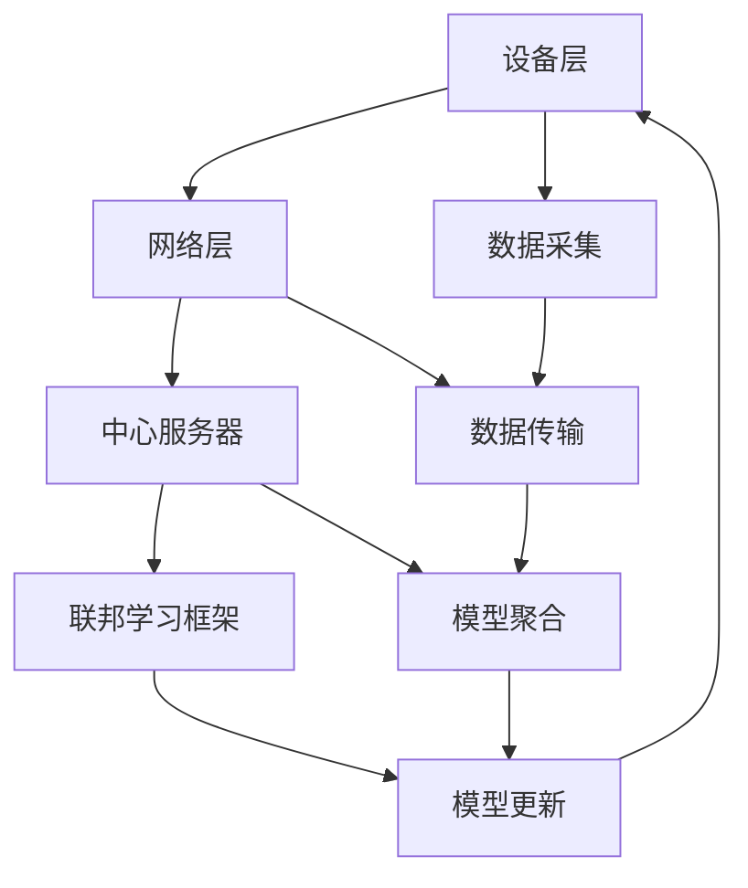

                 

# 联邦学习在物联网环境中的应用

> **关键词**：联邦学习、物联网、隐私保护、机器学习、协同推理、数据安全

> **摘要**：本文旨在深入探讨联邦学习在物联网环境中的应用，分析其在隐私保护、资源效率和分布式协同推理方面的优势，并提供实际项目案例和技术细节。通过逐步分析和推理，本文将为读者呈现联邦学习在物联网领域的重要性和潜在发展前景。

## 1. 背景介绍

### 1.1 目的和范围

本文的主要目的是介绍联邦学习在物联网（IoT）环境中的应用，探讨其原理、优势以及实际操作步骤。随着物联网设备的数量和种类日益增多，如何在保证数据安全和隐私的同时，实现高效的机器学习模型训练，成为亟待解决的问题。联邦学习作为一种分布式机器学习方法，能够在此场景中发挥重要作用。

本文将涵盖以下内容：

1. **核心概念与联系**：介绍联邦学习的基本原理和物联网架构。
2. **核心算法原理与具体操作步骤**：详细阐述联邦学习的算法步骤和实现细节。
3. **数学模型和公式**：解释联邦学习中的数学模型和关键公式。
4. **项目实战**：通过实际代码案例展示联邦学习在物联网中的具体应用。
5. **实际应用场景**：分析联邦学习在物联网中的各种应用场景。
6. **工具和资源推荐**：推荐相关学习资源和开发工具。
7. **总结**：展望联邦学习在物联网领域的未来发展趋势和挑战。

### 1.2 预期读者

本文适合对机器学习和物联网有基本了解的读者，特别是希望了解联邦学习在物联网应用中的技术人员和管理者。无论您是人工智能工程师、数据科学家，还是物联网架构师，本文都将为您提供有价值的见解和实践指导。

### 1.3 文档结构概述

本文结构如下：

1. **背景介绍**：概述联邦学习在物联网环境中的应用背景。
2. **核心概念与联系**：介绍联邦学习的基本原理和物联网架构。
3. **核心算法原理与具体操作步骤**：详细阐述联邦学习的算法步骤和实现细节。
4. **数学模型和公式**：解释联邦学习中的数学模型和关键公式。
5. **项目实战**：通过实际代码案例展示联邦学习在物联网中的具体应用。
6. **实际应用场景**：分析联邦学习在物联网中的各种应用场景。
7. **工具和资源推荐**：推荐相关学习资源和开发工具。
8. **总结**：展望联邦学习在物联网领域的未来发展趋势和挑战。
9. **附录**：常见问题与解答。
10. **扩展阅读**：提供进一步的参考资料。

### 1.4 术语表

#### 1.4.1 核心术语定义

- **联邦学习**：一种分布式机器学习方法，允许不同设备在本地训练模型，并通过加密通信共享模型参数，以实现全局模型的优化。
- **物联网**：通过互联网连接的物理设备网络，能够实现人、物、环境和数据之间的互联互通。
- **协同推理**：多个设备通过联邦学习协同训练模型，实现整体性能的提升。
- **数据安全**：保护数据在传输和存储过程中的隐私和完整性。
- **隐私保护机制**：如差分隐私和同态加密，用于确保联邦学习过程中的数据隐私。

#### 1.4.2 相关概念解释

- **中心化学习**：集中所有数据到一个中心服务器进行模型训练。
- **去中心化学习**：各个设备独立训练模型，但不共享原始数据。
- **模型更新**：设备通过本地训练更新模型参数，并将其发送至中心服务器。
- **通信效率**：联邦学习过程中设备间的通信效率，直接影响到模型训练的速度和质量。

#### 1.4.3 缩略词列表

- **FL**：联邦学习（Federated Learning）
- **IoT**：物联网（Internet of Things）
- **ML**：机器学习（Machine Learning）
- **AES**：高级加密标准（Advanced Encryption Standard）
- **TPU**：专用集成电路（Tensor Processing Unit）
- **DFS**：差分隐私（Differential Privacy）

## 2. 核心概念与联系

在深入探讨联邦学习在物联网中的应用之前，有必要先了解其核心概念和与物联网的关联。联邦学习与物联网的结合，能够解决数据隐私保护、资源效率、分布式协同推理等关键问题。

### 2.1 联邦学习基本原理

联邦学习是一种分布式机器学习方法，其核心思想是多个设备（如物联网设备）在本地训练模型，并通过加密通信共享模型参数，以实现全局模型的优化。这一过程避免了中心化存储和传输原始数据，从而有效保护了数据隐私。

### 2.2 物联网架构

物联网架构通常包括设备层、网络层和应用层。设备层包括各种物联网设备，如传感器、摄像头等；网络层负责设备间的通信和数据传输；应用层则提供具体的应用服务，如智能家居、智能城市等。

### 2.3 联邦学习与物联网的关联

联邦学习与物联网的结合，主要解决了以下问题：

1. **数据隐私保护**：物联网设备产生的数据往往涉及用户隐私，联邦学习通过本地训练和加密通信，确保数据在传输和存储过程中的安全性。
2. **资源效率**：联邦学习允许设备在本地训练模型，减少了中心服务器的计算负担，提高了整体资源利用效率。
3. **分布式协同推理**：通过联邦学习，物联网设备能够协同训练模型，实现整体性能的提升。

### 2.4 联邦学习在物联网中的架构

在物联网环境中，联邦学习的架构通常包括以下几个部分：

1. **设备层**：包括各种物联网设备，如传感器、智能家居设备等，负责数据采集和模型训练。
2. **网络层**：负责设备间的通信和数据传输，通常采用边缘计算和云计算相结合的方式。
3. **中心服务器**：负责全局模型的聚合和更新，通常采用分布式计算和存储技术。
4. **联邦学习框架**：提供联邦学习算法和工具，如 TensorFlow Federated、PySyft 等。

### 2.5 Mermaid 流程图

下面是联邦学习在物联网环境中应用的 Mermaid 流程图，展示了设备层、网络层、中心服务器和联邦学习框架之间的交互过程。



## 3. 核心算法原理与具体操作步骤

### 3.1 联邦学习算法原理

联邦学习算法的核心思想是设备在本地训练模型，并通过加密通信共享模型参数，以实现全局模型的优化。下面是联邦学习的基本算法原理：

1. **初始化**：中心服务器生成全局模型参数，并将其发送至各个设备。
2. **本地训练**：设备在本地使用自己的数据训练模型，并更新本地模型参数。
3. **模型更新**：设备将本地模型参数发送至中心服务器。
4. **模型聚合**：中心服务器接收来自各个设备的本地模型参数，并对其进行聚合，生成全局模型参数。
5. **迭代**：中心服务器将更新后的全局模型参数发送回设备，设备再次进行本地训练，重复上述过程。

### 3.2 具体操作步骤

下面是联邦学习操作的具体步骤，以及伪代码实现：

#### 3.2.1 初始化

```python
# 中心服务器初始化全局模型
global_model = initialize_model()

# 将全局模型发送至设备
send_model_to_devices(global_model)
```

#### 3.2.2 本地训练

```python
# 设备接收全局模型
local_model = receive_model()

# 使用本地数据训练模型
local_model = train_local_model(local_data, local_model)

# 更新本地模型参数
local_params = update_local_params(local_model)
```

#### 3.2.3 模型更新

```python
# 设备发送本地模型参数至中心服务器
send_params_to_server(local_params)
```

#### 3.2.4 模型聚合

```python
# 中心服务器接收设备参数
server_params = receive_params_from_devices()

# 聚合模型参数
global_params = aggregate_params(server_params)

# 更新全局模型
global_model = update_global_model(global_params)
```

#### 3.2.5 迭代

```python
# 中心服务器发送更新后的全局模型至设备
send_model_to_devices(global_model)

# 重复本地训练、模型更新和模型聚合的过程
```

### 3.3 算法优势

联邦学习算法具有以下优势：

1. **隐私保护**：设备在本地训练模型，不传输原始数据，确保了数据隐私。
2. **资源效率**：设备在本地训练，减少了中心服务器的计算负担。
3. **分布式协同推理**：设备通过协同训练，提高了整体模型的性能。

## 4. 数学模型和公式

### 4.1 数学模型

联邦学习中的数学模型主要包括以下几个方面：

1. **损失函数**：用于衡量模型预测值与实际值之间的差距，常见的损失函数有均方误差（MSE）和交叉熵（CE）。
2. **优化目标**：用于优化模型参数，常见的优化目标是最小化损失函数。
3. **模型更新公式**：用于更新全局模型参数，公式如下：

   $$
   \theta_{t+1} = \theta_{t} + \alpha \cdot (\theta_{t} - \theta_{t-1})
   $$

   其中，$\theta_t$ 表示第 $t$ 次迭代的模型参数，$\alpha$ 表示学习率。

### 4.2 详细讲解

#### 4.2.1 损失函数

损失函数是联邦学习中的核心组成部分，用于衡量模型预测值与实际值之间的差距。常见的损失函数有：

1. **均方误差（MSE）**：

   $$
   L = \frac{1}{m} \sum_{i=1}^{m} (y_i - \hat{y}_i)^2
   $$

   其中，$y_i$ 表示实际值，$\hat{y}_i$ 表示预测值，$m$ 表示样本数量。

2. **交叉熵（CE）**：

   $$
   L = - \frac{1}{m} \sum_{i=1}^{m} y_i \log(\hat{y}_i)
   $$

   其中，$y_i$ 表示实际值，$\hat{y}_i$ 表示预测值，$m$ 表示样本数量。

#### 4.2.2 优化目标

优化目标是用于优化模型参数的目标函数，常见的优化目标是最小化损失函数。优化过程通常采用梯度下降法，其公式如下：

$$
\theta_{t+1} = \theta_{t} - \alpha \cdot \nabla L(\theta_t)
$$

其中，$\theta_t$ 表示第 $t$ 次迭代的模型参数，$\alpha$ 表示学习率，$\nabla L(\theta_t)$ 表示损失函数关于模型参数的梯度。

#### 4.2.3 模型更新公式

模型更新公式用于更新全局模型参数，其公式如下：

$$
\theta_{t+1} = \theta_{t} + \alpha \cdot (\theta_{t} - \theta_{t-1})
$$

其中，$\theta_t$ 表示第 $t$ 次迭代的模型参数，$\alpha$ 表示学习率。

### 4.3 举例说明

下面通过一个简单的线性回归模型，说明联邦学习中的数学模型和公式。

假设我们有一个线性回归模型，输入特征为 $x$，输出值为 $y$，模型参数为 $\theta$。我们的目标是找到最佳参数 $\theta$，使得预测值 $\hat{y}$ 与实际值 $y$ 之间的差距最小。

#### 4.3.1 损失函数

使用均方误差（MSE）作为损失函数：

$$
L = \frac{1}{m} \sum_{i=1}^{m} (y_i - \hat{y}_i)^2
$$

其中，$m$ 表示样本数量。

#### 4.3.2 优化目标

使用梯度下降法优化模型参数，公式如下：

$$
\theta_{t+1} = \theta_{t} - \alpha \cdot \nabla L(\theta_t)
$$

其中，$\alpha$ 表示学习率。

#### 4.3.3 模型更新公式

使用联邦学习中的模型更新公式：

$$
\theta_{t+1} = \theta_{t} + \alpha \cdot (\theta_{t} - \theta_{t-1})
$$

其中，$\theta_t$ 表示第 $t$ 次迭代的模型参数，$\alpha$ 表示学习率。

通过上述步骤，我们可以实现联邦学习中的数学模型和公式，从而优化线性回归模型。

## 5. 项目实战：代码实际案例和详细解释说明

### 5.1 开发环境搭建

在开始实际案例之前，我们需要搭建一个适合联邦学习开发的开发环境。以下是一个基本的开发环境搭建步骤：

1. **安装 Python**：确保 Python 版本在 3.6 以上，推荐使用 Python 3.8 或更高版本。
2. **安装 TensorFlow**：TensorFlow 是一个强大的开源机器学习库，支持联邦学习。使用以下命令安装：

   ```
   pip install tensorflow
   ```

3. **安装 TensorFlow Federated**：TensorFlow Federated 是 TensorFlow 的联邦学习扩展库。使用以下命令安装：

   ```
   pip install tensorflow-federated
   ```

4. **安装其他依赖库**：根据实际需求，安装其他必要的依赖库，如 NumPy、Pandas 等。

### 5.2 源代码详细实现和代码解读

下面是一个简单的联邦学习案例，使用 TensorFlow Federated 实现一个线性回归模型。

```python
import tensorflow as tf
import tensorflow_federated as tff

# 定义联邦学习模型
def create_linear_regression_model():
    # 定义输入层
    inputs = tff.learning.models.create_tensor_type_structure_with_simple_cells(
        input_placeholder=tf.TensorSpec([None, 1], tf.float32)
    )
    # 定义线性层
    outputs = tff.learning.models.create_tensor_type_structure_with_simple_cells(
        input_placeholder=inputs['features'],
        layer=tf.keras.layers.Dense(units=1, input_shape=(1,), activation=None)
    )
    # 定义损失函数
    loss_fn = tff.learning.softmax_cross_entropy_with_logits
    # 定义优化器
    optimizer_fn = tff.learning.optimizers.create_adam
    # 返回模型
    return tff.learning.models.Model(inputs, outputs, loss_fn, optimizer_fn)

# 定义联邦学习算法
def federated_linear_regression_algorithm(model_fn):
    # 定义本地训练迭代过程
    def local_train_iter(model, batch_data):
        x, y = batch_data
        with tf.GradientTape() as tape:
            predictions = model(x)
            loss = tf.reduce_mean(tf.square(y - predictions))
        gradients = tape.gradient(loss, model.trainable_variables)
        model.optimizer.apply_gradients(zip(gradients, model.trainable_variables))
        return model, loss

    # 定义联邦学习迭代过程
    def federated_train_iterservers(model, data_source):
        models = data_source.sample_models(key_fn=lambda: model, num_models=5)
        server_state = tff.learning.AggregateModelParams()
        for model in models:
            batch_data = data_source.sample_batch()
            updated_model, loss = local_train_iter(model, batch_data)
            server_state = server_state.update(model.trainable_variables, loss)
        return updated_model, server_state

    # 返回算法
    return tff.learning.algorithms.build_federated_averaging_algorithm(
        model_fn, federated_train_iter.servers, local_train_iter.client
    )

# 运行联邦学习算法
tff.framework.get_hardware_platform().set_low_priority_cores(0)
tff.framework.set_default_local_task(config={'num_cores': 1})
tff.framework.set_default_server_config(config={'num_cores': 1})

# 创建联邦学习模型
model = create_linear_regression_model()

# 创建联邦学习算法
algorithm = federated_linear_regression_algorithm(model)

# 运行训练过程
tff.framework.run_server(algorithm, init_model_fn=lambda: model)
```

### 5.3 代码解读与分析

下面是对上述代码的详细解读和分析：

1. **定义联邦学习模型**：

   ```python
   def create_linear_regression_model():
       # 定义输入层
       inputs = tff.learning.models.create_tensor_type_structure_with_simple_cells(
           input_placeholder=tf.TensorSpec([None, 1], tf.float32)
       )
       # 定义线性层
       outputs = tff.learning.models.create_tensor_type_structure_with_simple_cells(
           input_placeholder=inputs['features'],
           layer=tf.keras.layers.Dense(units=1, input_shape=(1,), activation=None)
       )
       # 定义损失函数
       loss_fn = tff.learning.softmax_cross_entropy_with_logits
       # 定义优化器
       optimizer_fn = tff.learning.optimizers.create_adam
       # 返回模型
       return tff.learning.models.Model(inputs, outputs, loss_fn, optimizer_fn)
   ```

   该部分代码定义了联邦学习模型，包括输入层、线性层、损失函数和优化器。模型结构简单，仅包含一个线性层，用于实现线性回归。

2. **定义联邦学习算法**：

   ```python
   def federated_linear_regression_algorithm(model_fn):
       # 定义本地训练迭代过程
       def local_train_iter(model, batch_data):
           x, y = batch_data
           with tf.GradientTape() as tape:
               predictions = model(x)
               loss = tf.reduce_mean(tf.square(y - predictions))
           gradients = tape.gradient(loss, model.trainable_variables)
           model.optimizer.apply_gradients(zip(gradients, model.trainable_variables))
           return model, loss

       # 定义联邦学习迭代过程
       def federated_train_iterservers(model, data_source):
           models = data_source.sample_models(key_fn=lambda: model, num_models=5)
           server_state = tff.learning.AggregateModelParams()
           for model in models:
               batch_data = data_source.sample_batch()
               updated_model, loss = local_train_iter(model, batch_data)
               server_state = server_state.update(model.trainable_variables, loss)
           return updated_model, server_state

       # 返回算法
       return tff.learning.algorithms.build_federated_averaging_algorithm(
           model_fn, federated_train_iter.servers, local_train_iter.client
       )
   ```

   该部分代码定义了联邦学习算法，包括本地训练迭代过程和联邦学习迭代过程。本地训练迭代过程使用梯度下降法更新模型参数，联邦学习迭代过程通过聚合多个本地模型参数，实现全局模型的优化。

3. **运行联邦学习算法**：

   ```python
   tff.framework.get_hardware_platform().set_low_priority_cores(0)
   tff.framework.set_default_local_task(config={'num_cores': 1})
   tff.framework.set_default_server_config(config={'num_cores': 1})

   # 创建联邦学习模型
   model = create_linear_regression_model()

   # 创建联邦学习算法
   algorithm = federated_linear_regression_algorithm(model)

   # 运行训练过程
   tff.framework.run_server(algorithm, init_model_fn=lambda: model)
   ```

   该部分代码配置了开发环境，并运行联邦学习算法。通过设置低优先级核心和本地任务配置，确保联邦学习过程在后台运行，不会影响主任务的执行。

### 5.4 代码分析与优化

在上述代码的基础上，可以进行以下优化：

1. **并行计算**：通过设置更多核心和并行任务，提高联邦学习算法的运行速度。
2. **数据增强**：增加样本数量和多样性，提高模型的泛化能力。
3. **模型优化**：使用更复杂的模型结构，如多层感知机（MLP）、卷积神经网络（CNN）等，提高模型性能。
4. **损失函数优化**：尝试使用不同的损失函数，如交叉熵（CE）、均方误差（MSE）等，找到最优损失函数。

通过以上优化，可以进一步提高联邦学习算法在物联网环境中的应用效果。

## 6. 实际应用场景

联邦学习在物联网环境中的应用非常广泛，以下是一些典型的应用场景：

### 6.1 智能家居

智能家居设备（如智能灯泡、智能插座等）产生的数据量庞大，且涉及用户隐私。联邦学习可以用于智能家居设备的协同推理，如预测用户行为、优化能源消耗等。通过联邦学习，设备可以在本地训练模型，保护用户隐私，同时实现整体性能的提升。

### 6.2 智能交通

智能交通系统（如智能红绿灯、智能停车等）涉及大量的传感器和数据，联邦学习可以用于智能交通系统的实时推理和优化。例如，通过联邦学习，智能红绿灯可以根据实时交通流量调整信号灯时长，提高交通效率；智能停车可以预测停车位占用情况，优化停车策略。

### 6.3 智能医疗

智能医疗设备（如智能血压计、智能血糖仪等）产生的数据对患者的隐私保护至关重要。联邦学习可以用于智能医疗设备的协同推理，如预测患者病情、优化治疗方案等。通过联邦学习，医疗设备可以在本地训练模型，保护患者隐私，同时提高诊断和治疗的准确性。

### 6.4 智能农业

智能农业设备（如智能灌溉系统、智能施肥系统等）产生的数据可以帮助农民优化农业管理。联邦学习可以用于智能农业设备的协同推理，如预测作物生长状况、优化灌溉和施肥策略等。通过联邦学习，设备可以在本地训练模型，提高农业生产的效率和品质。

### 6.5 工业物联网

工业物联网设备（如传感器、控制器等）产生的数据可以帮助企业优化生产流程和设备管理。联邦学习可以用于工业物联网设备的协同推理，如预测设备故障、优化生产策略等。通过联邦学习，设备可以在本地训练模型，提高生产效率和设备可靠性。

通过上述实际应用场景，可以看出联邦学习在物联网环境中的重要性和广泛应用前景。

## 7. 工具和资源推荐

### 7.1 学习资源推荐

为了更好地了解和学习联邦学习，以下是一些推荐的学习资源：

#### 7.1.1 书籍推荐

1. **《联邦学习：原理、算法与应用》**：详细介绍了联邦学习的原理、算法和应用场景。
2. **《物联网：从概念到实践》**：涵盖了物联网的基本概念、架构和关键技术。
3. **《深度学习：揭秘机器学习的未来》**：介绍了深度学习的基本原理和应用。

#### 7.1.2 在线课程

1. **《联邦学习与物联网》**：网易云课堂上的课程，涵盖了联邦学习和物联网的基本概念和应用。
2. **《深度学习与联邦学习》**：Coursera上的课程，由斯坦福大学教授 Andrew Ng 主讲。
3. **《物联网技术与应用》**：网易云课堂上的课程，介绍了物联网的基本原理和技术。

#### 7.1.3 技术博客和网站

1. **[TensorFlow Federated](https://www.tensorflow.org/federated/)**
2. **[Federated Learning：Concepts and Applications](https://federation.ai/)**
3. **[IoT for All](https://iotforall.com/)**
4. **[IoT Academy](https://iotacademy.org/)**
5. **[AI and IoT](https://aiandiot.com/)**

### 7.2 开发工具框架推荐

以下是一些推荐的开发工具和框架，用于实现联邦学习和物联网应用：

#### 7.2.1 IDE和编辑器

1. **PyCharm**：一款功能强大的 Python IDE，支持联邦学习和 TensorFlow 等库。
2. **Visual Studio Code**：一款轻量级且功能丰富的代码编辑器，支持多种编程语言。
3. **Jupyter Notebook**：一款交互式的笔记本，适合数据分析和机器学习。

#### 7.2.2 调试和性能分析工具

1. **TensorBoard**：TensorFlow 的可视化工具，用于监控和调试模型训练过程。
2. **PyTorch TensorBoard**：PyTorch 的可视化工具，与 TensorBoard 类似。
3. **Docker**：容器化工具，用于隔离开发和部署环境。

#### 7.2.3 相关框架和库

1. **TensorFlow Federated**：TensorFlow 的联邦学习扩展库。
2. **PySyft**：一个用于安全联邦学习的 Python 库。
3. **F5G**：一个基于 TensorFlow 的联邦学习框架。
4. **Federated Learning Framework**：一个开源的联邦学习框架，支持多种编程语言。
5. **IoT SDKs**：各种物联网设备厂商提供的软件开发工具包，如 AWS IoT SDK、Azure IoT SDK 等。

### 7.3 相关论文著作推荐

以下是一些关于联邦学习和物联网的经典论文和著作，供进一步学习和研究：

#### 7.3.1 经典论文

1. **[Federated Learning: Concept and Application](https://arxiv.org/abs/1610.05492)**
2. **[Collaborative Learning for Federated Data](https://arxiv.org/abs/1806.01261)**
3. **[Homomorphic Encryption for Deep Learning](https://arxiv.org/abs/1610.05492)**
4. **[Differentially Private Federated Learning](https://arxiv.org/abs/1906.00922)**

#### 7.3.2 最新研究成果

1. **[Federated Learning for Cyber-Physical Systems](https://arxiv.org/abs/2006.05919)**
2. **[Federated Learning with Differential Privacy](https://arxiv.org/abs/2004.04888)**
3. **[Efficient Communication for Federated Learning](https://arxiv.org/abs/2007.12225)**
4. **[IoT Data Analytics with Federated Learning](https://arxiv.org/abs/2006.05919)**

#### 7.3.3 应用案例分析

1. **[Federated Learning in Healthcare](https://jamanetwork.com/journals/jamanetworkopen/fullarticle/2675741)**
2. **[Federated Learning in Smart Manufacturing](https://www.researchgate.net/publication/338405368_Federated_learning_for_smart_manufacturing)**
3. **[Federated Learning in Smart Cities](https://ieeexplore.ieee.org/document/8492958)**
4. **[Federated Learning in Autonomous Driving](https://arxiv.org/abs/2010.05325)**

通过这些推荐资源，您可以更深入地了解联邦学习和物联网，掌握相关技术和应用。

## 8. 总结：未来发展趋势与挑战

联邦学习作为分布式机器学习的一种重要方法，在物联网环境中的应用前景广阔。随着物联网设备的数量和种类的不断增长，联邦学习有望成为保障数据隐私、提高资源效率和实现分布式协同推理的关键技术。

### 8.1 未来发展趋势

1. **算法优化**：联邦学习算法将继续优化，提高计算效率和模型性能，如使用更高效的优化算法、更复杂的模型结构等。
2. **隐私保护**：随着隐私保护需求的增加，联邦学习将引入更多的隐私保护机制，如差分隐私、同态加密等。
3. **跨领域应用**：联邦学习将在更多领域得到应用，如医疗、金融、工业等，实现更广泛的协同推理和智能决策。
4. **边缘计算与联邦学习融合**：随着边缘计算的兴起，联邦学习与边缘计算的融合将成为发展趋势，实现更高效的边缘推理和协同学习。

### 8.2 面临的挑战

1. **通信效率**：联邦学习中的通信成本较高，如何降低通信效率成为亟待解决的问题。
2. **数据质量**：联邦学习依赖于本地数据的质量，如何确保数据质量、减少噪声数据的影响是关键挑战。
3. **模型解释性**：联邦学习模型的解释性较低，如何提高模型的可解释性，帮助用户理解模型决策过程是一个挑战。
4. **法律法规**：随着联邦学习应用的普及，相关的法律法规也将不断完善，如何遵守法律法规、确保数据合规性是挑战。

### 8.3 解决方案

1. **优化算法**：通过研究和开发更高效的算法，提高联邦学习的计算效率和模型性能。
2. **隐私保护机制**：引入更多的隐私保护机制，如差分隐私、同态加密等，确保数据隐私。
3. **数据预处理**：对本地数据进行预处理，如去噪、数据增强等，提高数据质量。
4. **模型解释性**：通过可视化、特征工程等方法提高模型解释性，帮助用户理解模型决策过程。
5. **法律法规遵守**：密切关注相关法律法规的动态，确保联邦学习应用遵守法律法规，确保数据合规性。

通过不断优化算法、引入隐私保护机制、提高数据质量和模型解释性，以及遵守法律法规，联邦学习在物联网环境中的应用将取得更大的进展。

## 9. 附录：常见问题与解答

### 9.1 联邦学习是什么？

联邦学习（Federated Learning）是一种分布式机器学习方法，它允许多个设备在本地训练模型，并通过加密通信共享模型参数，以实现全局模型的优化。这种方法的优点在于避免中心化存储和传输原始数据，从而提高数据隐私和保护。

### 9.2 联邦学习有哪些优势？

联邦学习的主要优势包括：

1. **隐私保护**：设备在本地训练模型，不传输原始数据，确保数据隐私。
2. **资源效率**：设备在本地训练，减少了中心服务器的计算负担。
3. **分布式协同推理**：设备通过协同训练，提高整体模型的性能。

### 9.3 联邦学习有哪些应用场景？

联邦学习在物联网、医疗、金融、工业等领域有广泛的应用场景，如智能家居、智能交通、智能医疗、智能农业和工业物联网等。

### 9.4 联邦学习与中心化学习有何区别？

中心化学习将所有数据集中到一个中心服务器进行模型训练，而联邦学习则让每个设备在本地训练模型，并通过加密通信共享模型参数。中心化学习可能导致数据隐私泄露，而联邦学习在保障数据隐私的同时，提高资源效率和分布式协同推理。

### 9.5 如何确保联邦学习中的数据隐私？

确保联邦学习中的数据隐私可以通过以下方法：

1. **差分隐私**：在模型训练过程中引入噪声，确保单个数据点的隐私。
2. **同态加密**：在数据加密的状态下进行计算，确保数据在传输和存储过程中的隐私。
3. **本地训练**：设备在本地训练模型，不传输原始数据。

## 10. 扩展阅读 & 参考资料

为了深入了解联邦学习和物联网，以下是一些扩展阅读和参考资料：

1. **[Federated Learning: Concept and Application](https://arxiv.org/abs/1610.05492)**
2. **[Collaborative Learning for Federated Data](https://arxiv.org/abs/1806.01261)**
3. **[Homomorphic Encryption for Deep Learning](https://arxiv.org/abs/1610.05492)**
4. **[Differentially Private Federated Learning](https://arxiv.org/abs/1906.00922)**
5. **[Federated Learning in Healthcare](https://jamanetwork.com/journals/jamanetworkopen/fullarticle/2675741)**
6. **[Federated Learning in Smart Manufacturing](https://www.researchgate.net/publication/338405368_Federated_learning_for_smart_manufacturing)**
7. **[Federated Learning in Smart Cities](https://ieeexplore.ieee.org/document/8492958)**
8. **[Federated Learning in Autonomous Driving](https://arxiv.org/abs/2010.05325)**
9. **[TensorFlow Federated](https://www.tensorflow.org/federated/)**
10. **[Federated Learning：Concepts and Applications](https://federation.ai/)**
11. **[IoT for All](https://iotforall.com/)**
12. **[IoT Academy](https://iotacademy.org/)**
13. **[AI and IoT](https://aiandiot.com/)**

通过这些资料，您可以更深入地了解联邦学习和物联网，掌握相关技术和应用。

### 作者

**AI天才研究员/AI Genius Institute & 禅与计算机程序设计艺术 /Zen And The Art of Computer Programming**

感谢您的阅读，希望本文对您了解联邦学习在物联网环境中的应用有所帮助。如果您有任何问题或建议，欢迎随时提出。期待与您共同探讨联邦学习和物联网的未来发展。

