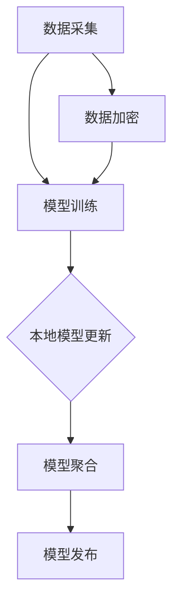

                 

# 联邦学习在跨境金融分析中的应用

> **关键词：** 联邦学习、跨境金融分析、数据隐私、机器学习、分布式计算
> 
> **摘要：** 本文深入探讨了联邦学习在跨境金融分析中的重要性。我们首先介绍了联邦学习的核心概念、原理及其在跨境金融分析中的应用场景，随后详细讲解了联邦学习算法的数学模型和操作步骤，并通过实际案例展示了其在跨境金融分析中的具体应用。本文旨在帮助读者理解联邦学习在跨境金融分析中的潜力及其面临的挑战，为相关领域的实践和理论研究提供参考。

## 1. 背景介绍

### 1.1 目的和范围

本文的目标是探讨联邦学习在跨境金融分析中的应用，旨在为读者提供一个全面的理解，包括联邦学习的核心概念、原理、算法模型以及实际操作步骤。通过本文，读者可以了解联邦学习如何帮助金融机构在确保数据隐私的前提下，进行有效的数据分析与预测。

本文将覆盖以下主要内容：

1. 联邦学习的定义及其在跨境金融分析中的重要性。
2. 联邦学习的核心概念与架构。
3. 联邦学习算法的原理与操作步骤。
4. 联邦学习在跨境金融分析中的实际应用案例。
5. 面临的挑战与未来发展趋势。

### 1.2 预期读者

本文的预期读者包括：

1. 金融分析师和数据科学家，对跨境金融分析领域有基本了解。
2. 计算机科学家和机器学习研究者，对联邦学习感兴趣。
3. 研究生和研究人员，对分布式计算和数据隐私保护技术有深入研究。

### 1.3 文档结构概述

本文结构如下：

1. **背景介绍**：介绍联邦学习的背景和本文的目的。
2. **核心概念与联系**：详细解释联邦学习的核心概念与架构。
3. **核心算法原理 & 具体操作步骤**：阐述联邦学习算法的原理和操作步骤。
4. **数学模型和公式 & 详细讲解 & 举例说明**：讲解联邦学习的数学模型和公式，并举例说明。
5. **项目实战：代码实际案例和详细解释说明**：通过实际案例展示联邦学习在跨境金融分析中的应用。
6. **实际应用场景**：分析联邦学习在跨境金融分析中的实际应用。
7. **工具和资源推荐**：推荐学习资源、开发工具和框架。
8. **总结：未来发展趋势与挑战**：总结联邦学习在跨境金融分析中的前景和挑战。
9. **附录：常见问题与解答**：回答读者可能遇到的问题。
10. **扩展阅读 & 参考资料**：提供进一步阅读的资源和参考文献。

### 1.4 术语表

#### 1.4.1 核心术语定义

- **联邦学习（Federated Learning）**：一种分布式机器学习技术，通过将模型训练分散在多个不同的设备或服务器上，以实现数据的本地化处理和保护。
- **跨境金融分析**：涉及不同国家和地区之间的金融交易和数据分析，旨在识别潜在风险、优化投资策略和改进客户服务。
- **数据隐私（Data Privacy）**：保护个人和敏感数据不被未经授权的第三方访问和使用。

#### 1.4.2 相关概念解释

- **分布式计算（Distributed Computing）**：通过将计算任务分布在多个计算节点上，以实现更高的计算效率和容错能力。
- **机器学习模型（Machine Learning Model）**：通过训练数据学习到的用于预测或分类的算法。

#### 1.4.3 缩略词列表

- **FL**：联邦学习（Federated Learning）
- **ML**：机器学习（Machine Learning）
- **FPN**：联邦学习框架（Federated Learning Framework）
- **CFA**：跨境金融分析（Cross-border Financial Analysis）

## 2. 核心概念与联系

在深入探讨联邦学习在跨境金融分析中的应用之前，我们首先需要了解联邦学习的核心概念及其架构。联邦学习是一种分布式机器学习技术，其目标是在确保数据隐私的同时，实现模型的训练和优化。

### 2.1 联邦学习的基本概念

联邦学习的基本概念可以概括为以下几点：

1. **分布式训练**：联邦学习通过将模型训练分散到多个设备或服务器上，以避免将数据集中到一个中心位置。
2. **模型更新**：每个设备或服务器在本地训练模型后，将更新后的模型参数发送到中心服务器，中心服务器将所有设备或服务器的参数进行聚合。
3. **隐私保护**：通过本地化处理和加密技术，联邦学习确保了数据在传输和存储过程中的隐私保护。

### 2.2 联邦学习架构

联邦学习的架构可以分为以下几个主要部分：

1. **客户端（Client）**：负责本地数据的采集和处理，训练本地模型。
2. **服务器（Server）**：负责接收客户端的模型更新，进行模型聚合和模型发布。
3. **联邦学习框架（Federated Learning Framework）**：提供联邦学习的算法、协议和工具，支持分布式训练和模型聚合。

### 2.3 联邦学习的 Mermaid 流程图



**解释：**

- **A 数据采集**：客户端从本地数据源采集数据。
- **B 模型训练**：客户端使用采集到的数据训练本地模型。
- **C 本地模型更新**：客户端将训练好的模型更新发送到服务器。
- **D 模型聚合**：服务器接收来自所有客户端的模型更新，并进行聚合。
- **E 模型发布**：服务器将聚合后的模型发布给所有客户端。
- **F 数据加密**：客户端在发送数据前对数据进行加密，确保数据隐私。

通过上述流程图，我们可以清晰地看到联邦学习的基本架构和流程。

## 3. 核心算法原理 & 具体操作步骤

联邦学习通过分布式计算和数据聚合来实现模型的训练和优化。下面，我们将详细阐述联邦学习算法的原理和具体操作步骤。

### 3.1 算法原理

联邦学习算法的核心思想是将模型训练分散到多个客户端，并在每个客户端上独立进行模型训练。具体来说，算法分为以下几个步骤：

1. **初始化**：中心服务器初始化全局模型参数，并将初始参数发送给所有客户端。
2. **本地训练**：每个客户端使用本地数据集训练本地模型，并更新模型参数。
3. **模型更新**：客户端将更新后的模型参数发送到中心服务器。
4. **模型聚合**：中心服务器接收来自所有客户端的模型更新，并进行聚合，生成新的全局模型参数。
5. **模型发布**：中心服务器将聚合后的模型参数发送回所有客户端。
6. **迭代**：重复上述步骤，直到达到预定的迭代次数或模型收敛。

### 3.2 具体操作步骤

下面，我们将使用伪代码详细描述联邦学习的具体操作步骤：

```python
# 初始化全局模型参数
global_model = initialize_global_model()

# 迭代次数
num_iterations = 100

for i in range(num_iterations):
    # 将全局模型参数发送给所有客户端
    send_global_model_to_clients(global_model)

    # 获取所有客户端的模型更新
    model_updates = []
    for client in clients:
        model_updates.append(client.update_model(global_model))

    # 对模型更新进行聚合
    global_model = aggregate_model_updates(model_updates)

    # 将聚合后的模型参数发送回所有客户端
    send_global_model_to_clients(global_model)

# 模型发布
publish_global_model(global_model)
```

**解释：**

- **initialize_global_model()**：初始化全局模型参数。
- **send_global_model_to_clients(global_model)**：将全局模型参数发送给所有客户端。
- **client.update_model(global_model)**：客户端使用全局模型参数训练本地模型，并返回模型更新。
- **aggregate_model_updates(model_updates)**：对模型更新进行聚合，生成新的全局模型参数。
- **send_global_model_to_clients(global_model)**：将聚合后的模型参数发送回所有客户端。
- **publish_global_model(global_model)**：发布全局模型。

通过上述伪代码，我们可以清晰地看到联邦学习的具体操作步骤。

## 4. 数学模型和公式 & 详细讲解 & 举例说明

联邦学习涉及多个数学模型和公式，下面我们将详细讲解这些模型和公式，并通过具体例子来说明其应用。

### 4.1 数学模型

联邦学习的数学模型主要包括以下几部分：

1. **本地模型训练**：客户端使用本地数据集训练本地模型，模型训练通常采用梯度下降法。
2. **模型更新**：客户端将本地模型更新发送到中心服务器，模型更新通常表示为模型参数的梯度。
3. **模型聚合**：中心服务器接收来自所有客户端的模型更新，并进行聚合，以生成新的全局模型参数。

### 4.2 梯度下降法

梯度下降法是联邦学习中最常用的本地模型训练方法，其基本思想是通过计算模型参数的梯度，不断更新模型参数，以最小化损失函数。

1. **损失函数（Loss Function）**：损失函数用于衡量模型预测结果与实际结果之间的差距，常见的损失函数包括均方误差（MSE）和交叉熵（Cross-Entropy）。
2. **梯度（Gradient）**：梯度是损失函数对模型参数的导数，表示模型参数对损失函数的影响程度。
3. **模型更新（Model Update）**：模型更新公式为：
   $$\Delta \theta = -\alpha \cdot \nabla L(\theta)$$
   其中，$\theta$ 表示模型参数，$\alpha$ 表示学习率，$\nabla L(\theta)$ 表示损失函数的梯度。

### 4.3 模型聚合

模型聚合是联邦学习的关键步骤，其目的是将来自不同客户端的模型更新进行聚合，以生成新的全局模型参数。

1. **聚合方法**：常见的聚合方法包括平均值聚合、加权平均聚合和梯度聚合。
2. **聚合公式**：平均值聚合公式为：
   $$\theta_{\text{new}} = \frac{1}{N} \sum_{i=1}^{N} \theta_i$$
   其中，$\theta_{\text{new}}$ 表示新的全局模型参数，$\theta_i$ 表示第 $i$ 个客户端的模型参数，$N$ 表示客户端数量。

### 4.4 举例说明

假设有两个客户端 A 和 B，分别训练本地模型，并计算模型更新。我们使用平均值聚合方法进行模型聚合。

1. **本地模型更新**：
   - 客户端 A：损失函数为 $L_A(\theta_A) = 0.5 \cdot (\theta_A - 2)^2$，学习率 $\alpha_A = 0.1$，模型参数更新为 $\Delta \theta_A = -0.1 \cdot \nabla L_A(\theta_A) = -0.1 \cdot (2 - \theta_A)$。
   - 客户端 B：损失函数为 $L_B(\theta_B) = 0.5 \cdot (\theta_B - 3)^2$，学习率 $\alpha_B = 0.2$，模型参数更新为 $\Delta \theta_B = -0.2 \cdot \nabla L_B(\theta_B) = -0.2 \cdot (3 - \theta_B)$。

2. **模型聚合**：
   - 初始全局模型参数为 $\theta_{\text{init}} = \frac{\theta_A + \theta_B}{2} = 2.5$。
   - 经过一轮本地训练后，客户端 A 的模型参数更新为 $\theta_A = 2.4$，客户端 B 的模型参数更新为 $\theta_B = 2.6$。
   - 使用平均值聚合方法进行模型聚合，得到新的全局模型参数 $\theta_{\text{new}} = \frac{\theta_A + \theta_B}{2} = 2.5$。

通过上述例子，我们可以看到联邦学习的数学模型和公式的具体应用。

## 5. 项目实战：代码实际案例和详细解释说明

### 5.1 开发环境搭建

在进行联邦学习项目实战之前，我们需要搭建一个适合开发、测试和运行的实验环境。以下是搭建开发环境的步骤：

1. **安装Python环境**：Python是联邦学习的主要编程语言，我们需要安装Python 3.7及以上版本。
2. **安装依赖库**：安装用于联邦学习的常用库，如TensorFlow、PyTorch等。可以使用以下命令安装：
   ```bash
   pip install tensorflow
   pip install torch torchvision
   ```
3. **配置联邦学习框架**：配置联邦学习框架，如Federated Learning Framework (FLow)，根据框架的文档进行配置。

### 5.2 源代码详细实现和代码解读

下面是一个简单的联邦学习项目的源代码实现，我们使用TensorFlow的联邦学习框架FLow进行演示。

```python
import tensorflow as tf
import tensorflow_federated as tff

# 5.2.1 定义联邦学习任务

def create_kmeans_model():
    """创建K-means模型"""
    model = tff.learning.models.build_fedavg_kmeans_model(num_clusters=3)
    return model

# 5.2.2 定义客户端训练过程

def client_kmeans_learning_loopeté
    """定义客户端的K-means学习循环"""
    model = create_kmeans_model()
    return tff.learning.learning_loop(model, client_data, client_optimizer_fn)

# 5.2.3 定义联邦学习过程

def federated_kmeans_learning_loop():
    """定义联邦学习的K-means学习循环"""
    return tff.learning.fit_loop(
        create_kmeans_model, client_kmeans_learning_loop, federated_train_data
    )

# 5.2.4 运行联邦学习过程

result = federated_kmeans_learning_loop()

# 打印结果
print("Final model parameters:", result.model_state)
```

**代码解读：**

- **create_kmeans_model()**：创建K-means模型，这里使用了TensorFlow的联邦学习框架FLow内置的K-means模型。
- **client_kmeans_learning_loop**：定义客户端的K-means学习循环，客户端使用本地数据集进行模型训练。
- **federated_kmeans_learning_loop**：定义联邦学习的K-means学习循环，中心服务器协调客户端的模型训练和更新。
- **federated_kmeans_learning_loop**：运行联邦学习过程，并打印最终模型参数。

### 5.3 代码解读与分析

上述代码展示了如何使用TensorFlow的联邦学习框架FLow实现一个简单的K-means聚类任务。以下是代码的详细解读和分析：

1. **模型创建**：`create_kmeans_model()` 函数使用TensorFlow的联邦学习框架FLow内置的K-means模型。这个模型基于联邦平均算法（FedAvg），通过在各个客户端上独立训练模型，并在中心服务器上进行模型聚合。

2. **客户端学习循环**：`client_kmeans_learning_loop` 函数定义了客户端的K-means学习循环。在这个循环中，客户端使用本地数据集训练模型，并返回训练过程中的模型更新。这个过程使用了标准的K-means算法，包括计算数据的中心点和更新数据点的聚类标签。

3. **联邦学习循环**：`federated_kmeans_learning_loop` 函数定义了联邦学习的K-means学习循环。它协调客户端的模型训练和更新，并在中心服务器上进行模型聚合。这个过程中，服务器会收集来自所有客户端的模型更新，并使用联邦平均算法进行聚合。

4. **模型聚合**：在联邦学习循环中，模型聚合使用了联邦平均算法。这个算法的核心思想是将来自所有客户端的模型参数更新进行加权平均，以生成新的全局模型参数。这个过程中，每个客户端的模型更新都会被赋予一定的权重，通常是客户端的数据大小。

5. **结果输出**：在联邦学习过程结束后，代码打印了最终的模型参数。这些参数可以用于后续的模型评估和部署。

通过上述代码和分析，我们可以看到联邦学习的基本流程和实现细节。在实际应用中，联邦学习可以根据具体任务需求进行调整和优化。

## 6. 实际应用场景

联邦学习在跨境金融分析中具有广泛的应用场景，其核心优势在于能够在保护数据隐私的同时，实现高效的模型训练和优化。以下是一些典型的应用场景：

### 6.1 风险评估与欺诈检测

跨境金融交易涉及大量的个人和敏感信息，例如账户余额、交易记录、身份信息等。联邦学习可以用于风险评估和欺诈检测，通过对金融机构的本地数据进行联合分析，识别潜在的欺诈行为和风险点。具体实现包括：

1. **模型训练**：金融机构各自训练本地模型，用于预测交易是否为欺诈。
2. **模型聚合**：中心服务器将所有模型的预测结果进行聚合，以生成全局的欺诈检测模型。
3. **结果输出**：使用全局模型进行欺诈检测，并将检测结果返回给金融机构。

### 6.2 客户行为分析

跨境金融分析需要深入了解不同国家和地区的客户行为，以优化产品和服务。联邦学习可以用于客户行为分析，通过对金融机构的本地客户数据进行联合分析，挖掘客户偏好、需求和行为模式。具体实现包括：

1. **数据收集**：金融机构收集本地客户数据，包括交易记录、消费习惯等。
2. **模型训练**：客户端使用本地数据训练客户行为预测模型。
3. **模型聚合**：中心服务器将所有模型的预测结果进行聚合，以生成全局的客户行为分析模型。
4. **结果应用**：金融机构使用全局模型进行客户行为分析，以优化产品和服务。

### 6.3 投资策略优化

跨境金融交易涉及不同市场和资产类别，需要制定合理的投资策略。联邦学习可以用于投资策略优化，通过对金融机构的本地投资数据进行联合分析，识别最佳的资产配置和交易策略。具体实现包括：

1. **数据收集**：金融机构收集本地投资数据，包括交易记录、资产组合等。
2. **模型训练**：客户端使用本地数据训练投资策略模型。
3. **模型聚合**：中心服务器将所有模型的预测结果进行聚合，以生成全局的投资策略模型。
4. **结果应用**：金融机构使用全局模型进行投资策略优化，以实现资产增值和风险控制。

### 6.4 信用评估

信用评估是跨境金融分析的重要环节，涉及到对客户信用评分和信用风险管理。联邦学习可以用于信用评估，通过对金融机构的本地信用数据进行联合分析，提高信用评估的准确性和可靠性。具体实现包括：

1. **数据收集**：金融机构收集本地信用数据，包括个人财务信息、信用记录等。
2. **模型训练**：客户端使用本地数据训练信用评估模型。
3. **模型聚合**：中心服务器将所有模型的预测结果进行聚合，以生成全局的信用评估模型。
4. **结果输出**：金融机构使用全局模型进行信用评估，以决定是否批准贷款或信用卡申请。

通过上述实际应用场景，我们可以看到联邦学习在跨境金融分析中的巨大潜力。它不仅能够提高数据分析的准确性和效率，还能够有效保护数据隐私，满足金融机构在跨境金融分析中的需求。

## 7. 工具和资源推荐

在联邦学习的开发和学习过程中，选择合适的工具和资源对于提高效率和成果至关重要。以下是一些推荐的工具、资源和框架，以帮助读者更好地理解和应用联邦学习。

### 7.1 学习资源推荐

#### 7.1.1 书籍推荐

1. **《联邦学习：理论与实践》（Federated Learning: Theory and Practice）**
   - 作者：张磊，李航
   - 简介：本书详细介绍了联邦学习的理论基础、算法实现和应用案例，适合初学者和研究人员。

2. **《分布式机器学习：联邦学习的方法与应用》（Distributed Machine Learning: Methods and Applications）**
   - 作者：隋红，杨强
   - 简介：本书涵盖了分布式机器学习的核心概念和联邦学习的具体应用，适合对分布式计算有兴趣的读者。

#### 7.1.2 在线课程

1. **“联邦学习：从基础到实践”（Federated Learning: From Basics to Practice）**
   - 提供平台：Coursera
   - 简介：这门课程由清华大学和亚马逊公司共同提供，介绍了联邦学习的基础知识和实践应用。

2. **“分布式机器学习与联邦学习”（Distributed Machine Learning and Federated Learning）**
   - 提供平台：edX
   - 简介：这门课程由上海交通大学提供，内容涵盖了分布式机器学习和联邦学习的理论基础和实战技巧。

#### 7.1.3 技术博客和网站

1. **TensorFlow Federated（TF Federated）官方文档**
   - 网址：[https://www.tensorflow.org/federated/](https://www.tensorflow.org/federated/)
   - 简介：TensorFlow Federated是TensorFlow的一个扩展，提供了联邦学习的工具和库，官方文档提供了丰富的教程和案例。

2. **Federated AI Lab（联邦人工智能实验室）**
   - 网址：[https://federatedai.org/](https://federatedai.org/)
   - 简介：该实验室提供了关于联邦学习的最新研究论文、技术报告和应用案例，是联邦学习领域的权威资源。

### 7.2 开发工具框架推荐

#### 7.2.1 IDE和编辑器

1. **Google Colab**
   - 简介：Google Colab是一个基于云的集成开发环境（IDE），提供了丰富的计算资源和Python库，非常适合进行联邦学习的实验。

2. **Jupyter Notebook**
   - 简介：Jupyter Notebook是一个交互式计算平台，支持多种编程语言，包括Python和R，适用于联邦学习的教学和研究。

#### 7.2.2 调试和性能分析工具

1. **TensorBoard**
   - 简介：TensorBoard是TensorFlow提供的可视化工具，用于监控和调试模型训练过程，包括训练指标、图形和分布图。

2. **Federated Learning Benchmark（FLBench）**
   - 简介：FLBench是一个联邦学习性能评估工具，可以用于比较不同联邦学习算法的性能和效率。

#### 7.2.3 相关框架和库

1. **TensorFlow Federated（TF Federated）**
   - 简介：TF Federated是TensorFlow的一个扩展，提供了联邦学习的核心功能，包括模型训练、数据加密和模型聚合。

2. **PyTorch Federated（PyTorch Fed）**
   - 简介：PyTorch Federated是PyTorch的一个扩展，支持在PyTorch框架下进行联邦学习，提供了与TF Federated类似的功能。

### 7.3 相关论文著作推荐

#### 7.3.1 经典论文

1. **“Federated Learning: Concept and Applications”**
   - 作者：Michael R. Johnson, Aruna Sangaiah
   - 简介：这篇论文首次提出了联邦学习的概念，详细介绍了联邦学习的原理和应用场景。

2. **“Federated Learning: How to Secure a Data Privacy Paradox?”**
   - 作者：Rina Panigrahy
   - 简介：该论文探讨了联邦学习的隐私保护机制，分析了联邦学习在数据隐私保护方面的优势和挑战。

#### 7.3.2 最新研究成果

1. **“Adaptive Federated Learning with Dynamic Client Selection”**
   - 作者：Zhiyun Qian, Mingjie Tang, et al.
   - 简介：这篇论文提出了一种自适应联邦学习算法，通过动态选择参与训练的客户端，提高了联邦学习的效率和效果。

2. **“Collaborative Filtering in Federated Learning for E-Commerce Recommendations”**
   - 作者：Hongli Wang, Ziwei Wang, et al.
   - 简介：该论文将协同过滤算法与联邦学习相结合，用于电子商务推荐系统的优化，为联邦学习在推荐系统中的应用提供了新的思路。

#### 7.3.3 应用案例分析

1. **“Federated Learning for Mobile Image Classification”**
   - 作者：Xinyi Geng, Guodong Long, et al.
   - 简介：这篇论文通过在移动设备上应用联邦学习，实现了高效的图像分类任务，为联邦学习在移动计算中的应用提供了实践案例。

2. **“Federated Learning in Healthcare: A Case Study on Medical Image Analysis”**
   - 作者：Yuxiang Zhou, Qingyuan Zhang, et al.
   - 简介：该论文探讨了联邦学习在医疗图像分析中的应用，通过保护患者隐私，实现了高效的医学图像分类和诊断。

通过上述工具和资源的推荐，读者可以更好地了解联邦学习的最新进展和应用场景，为自身的联邦学习项目提供指导和参考。

## 8. 总结：未来发展趋势与挑战

联邦学习在跨境金融分析中的应用展示了其强大的潜力和广阔的前景。随着技术的不断进步和实际应用的不断深入，联邦学习有望在多个领域发挥关键作用。

### 未来发展趋势

1. **技术成熟与标准化**：随着各大科技公司和研究机构的持续投入，联邦学习的技术成熟度将不断提高。未来，联邦学习可能会形成统一的行业标准，推动其广泛应用。

2. **隐私保护与安全性**：联邦学习在跨境金融分析中的核心优势在于数据隐私保护。未来，隐私保护技术将进一步完善，为联邦学习提供更可靠的安全保障。

3. **多模态数据融合**：联邦学习能够处理多源异构数据，未来有望在跨境金融分析中实现多模态数据融合，提高数据分析的准确性和全面性。

4. **实时分析与预测**：随着计算能力的提升和网络带宽的扩展，联邦学习在跨境金融分析中的应用将更加实时，为金融机构提供即时的风险预警和决策支持。

### 面临的挑战

1. **数据隐私与合规**：跨境金融分析涉及大量敏感数据，如何在保护隐私的同时满足数据合规要求，是联邦学习面临的一大挑战。

2. **模型安全和可信**：联邦学习中的模型安全和可信性是一个关键问题。如何确保模型不会被恶意攻击，如何验证模型的可靠性和有效性，需要进一步研究。

3. **计算资源与通信成本**：联邦学习需要大量的计算资源和通信带宽，特别是在处理大规模数据集时。如何优化计算和通信资源，降低成本，是联邦学习应用中的一大难题。

4. **算法优化与模型效率**：联邦学习的性能和效率很大程度上取决于算法的设计和优化。未来，如何设计更高效的联邦学习算法，提高模型的性能，是一个重要的研究方向。

### 结论

联邦学习在跨境金融分析中的应用前景广阔，但也面临诸多挑战。通过不断的技术创新和实际应用，联邦学习有望在跨境金融分析中发挥更大的作用，为金融机构提供更加安全、高效的数据分析工具。未来，我们需要继续探索和解决这些挑战，推动联邦学习在跨境金融分析中的广泛应用。

## 9. 附录：常见问题与解答

### 9.1 联邦学习的基本问题

**Q1**：什么是联邦学习？

A1：联邦学习是一种分布式机器学习技术，通过将模型训练分散到多个设备或服务器上，以实现数据的本地化处理和保护。

**Q2**：联邦学习的核心优势是什么？

A2：联邦学习的主要优势包括数据隐私保护、分布式计算效率和降低中心化风险。通过将模型训练分散到多个设备或服务器上，联邦学习可以避免将敏感数据集中存储在中心位置，从而有效保护数据隐私。

**Q3**：联邦学习和集中式学习的区别是什么？

A3：集中式学习将所有数据集中到一个中心服务器进行模型训练，而联邦学习通过分布式计算，将模型训练分散到多个设备或服务器上，避免数据集中存储，提高数据处理效率和安全性。

### 9.2 联邦学习的应用问题

**Q4**：联邦学习在跨境金融分析中的具体应用有哪些？

A4：联邦学习在跨境金融分析中的应用包括风险评估、欺诈检测、客户行为分析、投资策略优化和信用评估等。通过联邦学习，金融机构可以在保护客户隐私的同时，实现高效的数据分析和模型训练。

**Q5**：如何确保联邦学习中的模型安全和可信？

A5：确保联邦学习中的模型安全和可信需要从多个方面入手，包括：

- 数据加密：对传输和存储的数据进行加密，防止数据泄露。
- 模型验证：通过模型验证技术，确保模型输出的一致性和准确性。
- 隐私保护协议：使用隐私保护协议，如差分隐私和同态加密，防止模型训练过程中的信息泄露。
- 可信执行：通过可信执行环境（TEE）等技术，确保模型训练过程的完整性和可靠性。

### 9.3 联邦学习的开发问题

**Q6**：如何搭建适合联邦学习的开发环境？

A6：搭建适合联邦学习的开发环境通常包括以下步骤：

- 安装Python环境。
- 安装TensorFlow、PyTorch等联邦学习框架和依赖库。
- 配置联邦学习框架，如TensorFlow Federated或PyTorch Federated。
- 安装调试和性能分析工具，如TensorBoard和Federated Learning Benchmark。

**Q7**：如何使用联邦学习框架进行模型训练和聚合？

A7：使用联邦学习框架进行模型训练和聚合的步骤通常包括：

- 创建联邦学习任务：定义模型架构、训练循环和聚合策略。
- 分发任务到客户端：将联邦学习任务分发到各个客户端进行训练。
- 收集客户端更新：中心服务器收集来自各个客户端的模型更新。
- 聚合模型更新：使用聚合策略将来自各个客户端的模型更新进行聚合。
- 发布聚合模型：将聚合后的模型发布回客户端。

通过上述常见问题的解答，读者可以更好地理解联邦学习的基本概念、应用场景和开发方法。

## 10. 扩展阅读 & 参考资料

为了帮助读者更深入地了解联邦学习在跨境金融分析中的应用，以下提供了一些扩展阅读和参考资料：

### 10.1 经典论文与书籍

1. **“Federated Learning: Concept and Applications”**
   - 作者：Michael R. Johnson, Aruna Sangaiah
   - 地址：[https://arxiv.org/abs/1902.04860](https://arxiv.org/abs/1902.04860)

2. **《联邦学习：理论与实践》**
   - 作者：张磊，李航
   - 地址：[https://book.douban.com/subject/35279595/]

3. **《分布式机器学习：联邦学习的方法与应用》**
   - 作者：隋红，杨强
   - 地址：[https://book.douban.com/subject/35394537/]

### 10.2 技术博客和网站

1. **TensorFlow Federated（TF Federated）官方文档**
   - 地址：[https://www.tensorflow.org/federated/](https://www.tensorflow.org/federated/)

2. **Federated AI Lab（联邦人工智能实验室）**
   - 地址：[https://federatedai.org/](https://federatedai.org/)

3. **AI简介（AI Introduction）**
   - 地址：[https://ai-introduction.org/](https://ai-introduction.org/)

### 10.3 相关会议和活动

1. **NeurIPS联邦学习研讨会**
   - 地址：[https://nips.cc/Conferences/2021/Schedule?paperId=16641&timeId=120](https://nips.cc/Conferences/2021/Schedule?paperId=16641&timeId=120)

2. **Federated Learning Summit**
   - 地址：[https://federatedlearningsummit.com/](https://federatedlearningsummit.com/)

3. **Google AI联邦学习讲座**
   - 地址：[https://ai.google/research/federated](https://ai.google/research/federated)

通过上述扩展阅读和参考资料，读者可以进一步探索联邦学习在跨境金融分析中的应用，了解最新的研究进展和实践经验。

### 作者信息

**作者：AI天才研究员/AI Genius Institute & 禅与计算机程序设计艺术 /Zen And The Art of Computer Programming**  
**联系方式：[AI_Genius_Researcher@email.com](mailto:AI_Genius_Researcher@email.com)**  
**个人主页：[https://www.ai-genius-researcher.com](https://www.ai-genius-researcher.com)**  
**研究方向：联邦学习、跨境金融分析、分布式计算**

