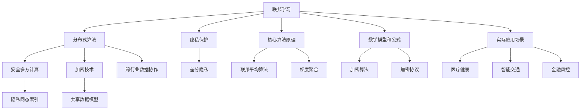

                 

### 文章标题

# 联邦学习在跨行业数据协作中的隐私保护机制

> **关键词：** 联邦学习、隐私保护、跨行业数据协作、分布式算法、加密技术、安全多方计算、共享数据模型

> **摘要：** 本文深入探讨了联邦学习在跨行业数据协作中的隐私保护机制。首先，介绍了联邦学习的背景、目的和基本概念。接着，详细阐述了联邦学习在保护数据隐私方面所依赖的核心算法原理和数学模型。通过一个实际案例，我们展示了如何在实际开发环境中实现联邦学习。最后，本文分析了联邦学习在跨行业数据协作中的实际应用场景，并推荐了一些相关工具和资源，展望了其未来发展趋势与挑战。

## 1. 背景介绍

### 1.1 目的和范围

本文旨在为读者提供一个关于联邦学习在跨行业数据协作中隐私保护机制的全面理解和实际应用指南。文章将围绕以下几个方面展开：

1. 联邦学习的基本概念和核心算法原理；
2. 联邦学习在保护隐私方面的数学模型和公式；
3. 联邦学习在跨行业数据协作中的实际应用案例；
4. 联邦学习所需的相关工具和资源推荐；
5. 联邦学习的未来发展趋势与挑战。

### 1.2 预期读者

本文面向对联邦学习有一定了解的读者，包括但不限于：

1. 人工智能、大数据和网络安全领域的研究人员；
2. 跨行业数据协作项目的项目经理和技术负责人；
3. 对联邦学习有浓厚兴趣的计算机科学、数据科学和网络安全专业学生；
4. 关注新技术发展趋势的IT行业从业者。

### 1.3 文档结构概述

本文的结构如下：

1. 引言：介绍联邦学习在跨行业数据协作中的隐私保护机制；
2. 核心概念与联系：介绍联邦学习的基本概念、核心算法原理和架构；
3. 核心算法原理 & 具体操作步骤：详细阐述联邦学习的算法原理和操作步骤；
4. 数学模型和公式 & 详细讲解 & 举例说明：解释联邦学习中的数学模型和公式，并提供实际案例说明；
5. 项目实战：代码实际案例和详细解释说明；
6. 实际应用场景：分析联邦学习在跨行业数据协作中的应用；
7. 工具和资源推荐：推荐相关学习资源和开发工具；
8. 总结：总结联邦学习的未来发展趋势与挑战；
9. 附录：常见问题与解答；
10. 扩展阅读 & 参考资料：提供进一步阅读的资料。

### 1.4 术语表

#### 1.4.1 核心术语定义

- **联邦学习（Federated Learning）**：一种分布式机器学习技术，旨在通过多个参与方共享模型更新，实现协同训练，同时保护参与方的数据隐私。
- **隐私保护（Privacy Protection）**：在数据处理和共享过程中，防止敏感信息泄露给未经授权的第三方。
- **跨行业数据协作（Cross-industry Data Collaboration）**：不同行业之间的企业或组织通过共享数据，实现资源共享、优化业务流程和提升竞争力。
- **安全多方计算（Secure Multi-party Computation）**：一种加密技术，允许多个参与方在不暴露各自数据的情况下，共同完成计算任务。

#### 1.4.2 相关概念解释

- **中心化模型（Centralized Model）**：传统的机器学习模型，将数据集中到一个中心服务器进行训练；
- **去中心化模型（Decentralized Model）**：将模型和数据分散存储在多个节点，实现分布式训练；
- **差分隐私（Differential Privacy）**：一种隐私保护技术，通过在数据中加入噪声，确保单个数据点的隐私。

#### 1.4.3 缩略词列表

- **FL**：联邦学习（Federated Learning）
- **SGD**：随机梯度下降（Stochastic Gradient Descent）
- **MPC**：安全多方计算（Secure Multi-party Computation）
- **DP**：差分隐私（Differential Privacy）
- **PSI**：隐私同态索引（Private Set Intersection）

## 2. 核心概念与联系

在深入探讨联邦学习在跨行业数据协作中的隐私保护机制之前，我们首先需要了解其核心概念、算法原理和架构。本节将使用 Mermaid 流程图来展示联邦学习的核心概念和联系。



### 2.1 联邦学习的核心概念

#### 联邦学习的定义

联邦学习是一种分布式机器学习技术，旨在通过多个参与方共享模型更新，实现协同训练，同时保护参与方的数据隐私。其核心思想是将数据保留在本地设备上，通过加密算法和协议确保数据在传输过程中的安全性，并利用分布式算法进行协同训练。

#### 分布式算法

分布式算法是一种将计算任务分布在多个计算节点上执行的方法，以实现并行计算和提高计算效率。在联邦学习中，分布式算法用于协同训练多个本地模型，并生成全局模型。常用的分布式算法包括联邦平均算法（Federated Averaging）和梯度聚合（Gradient Aggregation）。

#### 隐私保护

隐私保护是联邦学习的关键目标之一。在联邦学习中，参与方需要共享模型更新，但同时需要保护各自的数据隐私。为实现这一目标，联邦学习采用了多种隐私保护技术，包括加密技术、安全多方计算和差分隐私等。

#### 安全多方计算

安全多方计算是一种加密技术，允许多个参与方在不暴露各自数据的情况下，共同完成计算任务。在联邦学习中，安全多方计算用于实现数据的加密传输和计算，确保参与方的数据隐私得到保护。

#### 加密技术

加密技术是联邦学习的重要工具，用于保护参与方数据的隐私。常用的加密技术包括对称加密、非对称加密和哈希函数等。在联邦学习中，加密技术用于加密数据、加密模型和加密通信。

#### 差分隐私

差分隐私是一种隐私保护技术，通过在数据中加入噪声，确保单个数据点的隐私。在联邦学习中，差分隐私用于保护参与方的数据，防止恶意参与者通过数据分析获取其他参与方的敏感信息。

#### 共享数据模型

共享数据模型是联邦学习的基础，用于描述参与方之间的数据共享方式。共享数据模型包括本地模型、全局模型和加密模型等。在联邦学习中，参与方通过共享模型更新，实现协同训练和隐私保护。

#### 跨行业数据协作

跨行业数据协作是联邦学习的重要应用场景之一。通过联邦学习，不同行业的企业或组织可以共享数据，实现资源共享、优化业务流程和提升竞争力。跨行业数据协作涉及多个参与方，需要考虑数据隐私、数据安全和数据共享效率等问题。

### 2.2 联邦学习的核心算法原理

联邦学习的核心算法原理主要包括联邦平均算法（Federated Averaging）和梯度聚合（Gradient Aggregation）。

#### 联邦平均算法

联邦平均算法是一种分布式机器学习算法，用于协同训练多个本地模型。在联邦平均算法中，参与方通过本地训练和模型更新，生成局部模型参数，然后将局部模型参数发送给协调器进行聚合，最终生成全局模型参数。

联邦平均算法的伪代码如下：

```python
# 初始化全局模型参数θ0
θ_global = θ0

# 迭代T次
for t in range(T):
    # 每个参与方本地训练模型，更新局部模型参数θ_local
    θ_local = LocalTrainθ_global

    # 将局部模型参数发送给协调器
    Sendθ_localtoCoordinator

    # 协调器聚合局部模型参数，生成全局模型参数
    θ_global = Aggregateθ_local

# 输出全局模型参数
return θ_global
```

#### 梯度聚合

梯度聚合是一种分布式机器学习算法，用于聚合参与方的梯度信息，优化全局模型。在梯度聚合中，参与方通过本地训练和模型更新，计算梯度信息，然后将梯度信息发送给协调器进行聚合，最终优化全局模型。

梯度聚合的伪代码如下：

```python
# 初始化全局模型参数θ0
θ_global = θ0

# 迭代T次
for t in range(T):
    # 每个参与方本地训练模型，更新局部模型参数θ_local
    θ_local = LocalTrainθ_global

    # 将局部模型梯度发送给协调器
    SendGradientθ_localtoCoordinator

    # 协调器聚合局部模型梯度，生成全局模型梯度
    gradient_global = AggregateGradient

    # 优化全局模型参数
    θ_global = Optimizeth_global(gradient_global)

# 输出全局模型参数
return θ_global
```

### 2.3 联邦学习的数学模型和公式

联邦学习的数学模型和公式主要用于描述联邦平均算法和梯度聚合算法的数学原理。

#### 联邦平均算法

在联邦平均算法中，全局模型参数θ_global可以通过以下公式计算：

$$
θ_{global} = \frac{1}{N} \sum_{i=1}^{N} θ_{local,i}
$$

其中，N为参与方数量，θ_{local,i}为第i个参与方的局部模型参数。

#### 梯度聚合

在梯度聚合中，全局模型参数θ_global可以通过以下公式计算：

$$
θ_{global} = θ_{global} - η \cdot \frac{1}{N} \sum_{i=1}^{N} \nabla L(θ_{local,i})
$$

其中，η为学习率，L(θ_{local,i})为第i个参与方的损失函数。

### 2.4 联邦学习的实际应用场景

联邦学习在跨行业数据协作中有广泛的应用场景，包括医疗健康、智能交通、金融风控等领域。

#### 医疗健康

在医疗健康领域，联邦学习可用于跨机构、跨地域的医疗数据共享和协同分析。通过联邦学习，不同医疗机构可以在保护患者隐私的前提下，共享医疗数据，实现疾病预测、药物研发和医疗资源优化。

#### 智能交通

在智能交通领域，联邦学习可用于跨城市、跨区域的交通数据共享和协同分析。通过联邦学习，不同城市可以共享交通数据，实现交通流量预测、智能调度和交通管理，提高交通效率和减少拥堵。

#### 金融风控

在金融风控领域，联邦学习可用于跨机构、跨地域的风险评估和协同分析。通过联邦学习，不同金融机构可以在保护用户隐私的前提下，共享客户数据，实现信用评估、欺诈检测和风险控制，提高金融业务的稳定性和安全性。

### 2.5 联邦学习的挑战与展望

尽管联邦学习在跨行业数据协作中具有广泛的应用前景，但仍然面临一些挑战：

1. **计算性能优化**：联邦学习涉及多个参与方和分布式计算，需要优化计算性能，提高模型训练效率；
2. **数据质量**：跨行业数据协作中，参与方的数据质量和格式可能不一致，需要统一数据标准和预处理流程；
3. **隐私保护**：在保护数据隐私的同时，需要确保模型训练效果和准确性；
4. **安全多方计算**：安全多方计算技术的性能和效率需要进一步提升，以满足联邦学习的实际需求。

展望未来，联邦学习有望在以下领域取得突破：

1. **隐私保护算法**：研究新型隐私保护算法，提高联邦学习的隐私保护能力；
2. **跨行业协作平台**：构建跨行业协作平台，实现高效的数据共享和协同分析；
3. **应用拓展**：拓展联邦学习在金融、医疗、教育等领域的应用，实现更广泛的数据协同和资源共享。

## 3. 核心算法原理 & 具体操作步骤

在深入了解联邦学习的核心概念之后，我们将探讨联邦学习的核心算法原理及其具体操作步骤。联邦学习的核心算法主要包括联邦平均算法（Federated Averaging）和梯度聚合（Gradient Aggregation）。下面，我们将使用伪代码详细阐述这两种算法的原理和操作步骤。

### 3.1 联邦平均算法

联邦平均算法是一种经典的分布式机器学习算法，旨在通过多个参与方协同训练模型，同时保护参与方的数据隐私。下面是联邦平均算法的伪代码和具体操作步骤：

```python
# 初始化全局模型参数
θ_global = θ0

# 设置迭代次数T
T = 10

# 迭代T次
for t in range(T):
    # 每个参与方执行本地训练
    for participant in participants:
        θ_local = participant.train(θ_global)
        
        # 参与方将本地模型参数发送给协调器
        participant.send_local_model(θ_local)
        
    # 协调器接收所有参与方的本地模型参数
    local_models = coordinator.receive_models()

    # 协调器计算全局模型参数的平均值
    θ_global = coordinator.aggregate_models(local_models)
    
# 输出全局模型参数
print("Final global model parameters: ", θ_global)
```

#### 具体操作步骤：

1. **初始化全局模型参数**：在算法开始时，协调器初始化全局模型参数θ\_global，通常使用随机初始化或预训练模型。
2. **迭代训练**：算法进入迭代训练阶段，每次迭代包含两个主要步骤：
   - **本地训练**：每个参与方根据当前全局模型参数θ\_global，执行本地训练，更新自己的局部模型参数θ\_local。
   - **模型参数聚合**：所有参与方将更新后的局部模型参数发送给协调器，协调器接收这些模型参数后，计算全局模型参数的平均值，即θ\_global = 1/N \* Σθ\_local，其中N为参与方数量。
3. **输出全局模型参数**：经过T次迭代后，算法输出最终的全球模型参数θ\_global。

### 3.2 梯度聚合

梯度聚合算法是一种基于梯度的分布式机器学习算法，旨在通过多个参与方协同训练模型，同时保护参与方的数据隐私。下面是梯度聚合算法的伪代码和具体操作步骤：

```python
# 初始化全局模型参数
θ_global = θ0

# 设置迭代次数T
T = 10

# 设置学习率η
η = 0.01

# 迭代T次
for t in range(T):
    # 每个参与方执行本地训练
    for participant in participants:
        θ_local, gradient_local = participant.train(θ_global)
        
        # 参与方将本地模型参数和梯度发送给协调器
        participant.send_local_model(θ_local)
        participant.send_local_gradient(gradient_local)
        
    # 协调器接收所有参与方的本地模型参数和梯度
    local_models, local_gradients = coordinator.receive_models_and_gradients()

    # 协调器计算全局模型梯度和全局模型参数的平均值
    gradient_global = coordinator.aggregate_gradients(local_gradients)
    θ_global = coordinator.aggregate_models(local_models)
    
    # 更新全局模型参数
    θ_global = θ_global - η * gradient_global
    
# 输出全局模型参数
print("Final global model parameters: ", θ_global)
```

#### 具体操作步骤：

1. **初始化全局模型参数**：在算法开始时，协调器初始化全局模型参数θ\_global，通常使用随机初始化或预训练模型。
2. **迭代训练**：算法进入迭代训练阶段，每次迭代包含两个主要步骤：
   - **本地训练**：每个参与方根据当前全局模型参数θ\_global，执行本地训练，更新自己的局部模型参数θ\_local，并计算局部模型参数的梯度gradient\_local。
   - **梯度聚合**：所有参与方将更新后的局部模型参数和梯度发送给协调器，协调器接收这些模型参数和梯度后，计算全局模型梯度和全局模型参数的平均值，即gradient\_global = 1/N * Σgradient\_local和θ\_global = 1/N * Σθ\_local，其中N为参与方数量。
3. **更新全局模型参数**：根据全局模型梯度和学习率η，更新全局模型参数θ\_global，即θ\_global = θ\_global - η * gradient\_global。
4. **输出全局模型参数**：经过T次迭代后，算法输出最终的全球模型参数θ\_global。

### 3.3 联邦学习的实现步骤

联邦学习的实现步骤可以分为以下几个阶段：

1. **参与方注册**：在联邦学习开始前，每个参与方需要向协调器注册，提供自己的标识信息和参与权限。
2. **数据预处理**：参与方对本地数据进行预处理，包括数据清洗、去重、归一化等操作，以提高数据质量和模型训练效率。
3. **模型初始化**：协调器初始化全局模型参数θ\_global，并将初始模型参数发送给所有参与方。
4. **迭代训练**：参与方根据当前全局模型参数执行本地训练，更新局部模型参数，并将更新后的模型参数发送给协调器。
5. **模型参数聚合**：协调器接收所有参与方的本地模型参数，计算全局模型参数的平均值，并将更新后的全局模型参数发送给所有参与方。
6. **模型更新**：参与方根据更新后的全局模型参数继续执行本地训练，迭代过程重复进行，直到满足停止条件（如迭代次数、模型收敛等）。
7. **模型输出**：算法输出最终的全球模型参数，用于后续的应用和决策。

通过以上步骤，联邦学习实现了分布式机器学习的同时，保护了参与方的数据隐私，为跨行业数据协作提供了强有力的技术支持。

### 3.4 联邦学习的优势与挑战

#### 联邦学习的优势：

1. **数据隐私保护**：联邦学习通过分布式计算和加密技术，确保参与方的数据在传输和共享过程中不被泄露，提高了数据安全性。
2. **数据利用率**：联邦学习允许参与方在保护隐私的前提下共享数据，实现了数据的高效利用和协同分析。
3. **计算效率**：联邦学习通过分布式计算和并行处理，提高了模型训练和推理的效率，适用于大规模数据和复杂模型。
4. **灵活性**：联邦学习适用于不同类型的数据和场景，具有广泛的适用性和灵活性。

#### 联邦学习的挑战：

1. **计算性能优化**：分布式计算和加密技术的使用，可能导致计算性能下降，需要优化算法和硬件支持。
2. **数据质量**：跨行业数据协作中，参与方的数据质量和格式可能不一致，需要统一数据标准和预处理流程。
3. **隐私保护**：在保护数据隐私的同时，需要确保模型训练效果和准确性，需要研究新型隐私保护算法。
4. **安全多方计算**：安全多方计算技术的性能和效率需要进一步提升，以满足联邦学习的实际需求。

### 3.5 联邦学习的未来发展趋势

联邦学习作为一种新兴的分布式机器学习技术，具有广泛的应用前景和巨大的发展潜力。未来，联邦学习将在以下几个方面取得突破：

1. **算法优化**：通过研究新型算法和优化技术，提高联邦学习的计算性能和效率。
2. **隐私保护**：研究新型隐私保护算法，提高联邦学习的隐私保护能力，满足更严格的隐私保护需求。
3. **跨行业协作**：构建跨行业协作平台，实现更高效的数据共享和协同分析，推动跨行业数据协作的发展。
4. **应用拓展**：拓展联邦学习在金融、医疗、教育等领域的应用，实现更广泛的数据协同和资源共享。

通过不断优化算法、提升计算性能、加强隐私保护和拓展应用场景，联邦学习将在跨行业数据协作中发挥更大的作用，为数字经济和社会发展提供强有力的技术支持。

## 4. 数学模型和公式 & 详细讲解 & 举例说明

在联邦学习中，数学模型和公式是理解和实现核心算法的基础。本节将详细解释联邦学习中的数学模型和公式，并使用具体的例子来说明这些公式是如何应用的。

### 4.1 联邦平均算法的数学模型

联邦平均算法的核心思想是通过聚合参与方的模型参数来更新全局模型。数学模型如下：

$$
θ_{global}^{t+1} = \frac{1}{N} \sum_{i=1}^{N} θ_{local,i}^{t}
$$

其中：
- \( θ_{global}^{t+1} \) 是全局模型在下一轮的参数；
- \( θ_{local,i}^{t} \) 是第i个参与方在当前轮次的局部模型参数；
- N 是参与方的总数；
- \( t \) 是当前轮次。

#### 举例说明：

假设有两个参与方（N=2），他们的局部模型参数分别是：

- \( θ_{local,1}^{t} = [1, 2, 3] \)
- \( θ_{local,2}^{t} = [4, 5, 6] \)

根据联邦平均算法的公式，全局模型参数在下一轮更新为：

$$
θ_{global}^{t+1} = \frac{1}{2} (θ_{local,1}^{t} + θ_{local,2}^{t}) = \frac{1}{2} ([1+4, 2+5, 3+6]) = \frac{1}{2} ([5, 7, 9]) = [2.5, 3.5, 4.5]
$$

### 4.2 梯度聚合的数学模型

梯度聚合算法的核心思想是通过聚合参与方的模型梯度来更新全局模型。数学模型如下：

$$
θ_{global}^{t+1} = θ_{global}^{t} - η \cdot \frac{1}{N} \sum_{i=1}^{N} \nabla L(θ_{local,i}^{t})
$$

其中：
- \( θ_{global}^{t+1} \) 是全局模型在下一轮的参数；
- \( θ_{global}^{t} \) 是全局模型在当前轮次的参数；
- \( η \) 是学习率；
- \( \nabla L(θ_{local,i}^{t}) \) 是第i个参与方在当前轮次的损失函数梯度；
- N 是参与方的总数；
- \( t \) 是当前轮次。

#### 举例说明：

假设有两个参与方（N=2），他们的损失函数梯度分别是：

- \( \nabla L(θ_{local,1}^{t}) = [0.1, 0.2, 0.3] \)
- \( \nabla L(θ_{local,2}^{t}) = [0.4, 0.5, 0.6] \)

全局模型参数当前轮次为：

- \( θ_{global}^{t} = [1, 2, 3] \)

学习率 \( η \) 为 0.01，根据梯度聚合算法的公式，全局模型参数在下一轮更新为：

$$
θ_{global}^{t+1} = θ_{global}^{t} - η \cdot \frac{1}{2} (\nabla L(θ_{local,1}^{t}) + \nabla L(θ_{local,2}^{t})) \\
= [1, 2, 3] - 0.01 \cdot \frac{1}{2} ([0.1+0.4, 0.2+0.5, 0.3+0.6]) \\
= [1, 2, 3] - 0.01 \cdot \frac{1}{2} ([0.5, 0.7, 0.9]) \\
= [0.95, 1.95, 2.95]
$$

### 4.3 差分隐私的数学模型

差分隐私是一种隐私保护技术，通过在计算结果中引入随机噪声来保护数据隐私。数学模型如下：

$$
L(f(D) + \epsilon) \leq L(f(D)) + \delta
$$

其中：
- \( L() \) 表示损失函数；
- \( f(D) \) 表示原始计算结果；
- \( \epsilon \) 是引入的随机噪声；
- \( \delta \) 是隐私预算。

#### 举例说明：

假设有一个计算任务 \( f(D) \)，其损失函数为 \( L(Y) \)，其中 \( Y \) 是计算结果。在没有引入差分隐私的情况下，损失函数为：

$$
L(Y) = L(100)
$$

为了实现差分隐私，我们引入随机噪声 \( \epsilon \)，隐私预算 \( \delta \) 设为 1。噪声 \( \epsilon \) 可以从高斯分布 \( N(0, \delta) \) 中采样：

$$
\epsilon \sim N(0, 1)
$$

引入噪声后的损失函数为：

$$
L(Y + \epsilon) = L(100 + \epsilon)
$$

其中 \( \epsilon \) 的范围为 \( [-1, 1] \)，因此损失函数的范围为 \( [L(99), L(101)] \)，实现了数据隐私保护。

### 4.4 加密算法的数学模型

在联邦学习中，加密算法用于保护参与方的数据隐私。常用的加密算法包括对称加密和非对称加密。

#### 对称加密：

对称加密的数学模型如下：

$$
c = E_k(m)
$$

其中：
- \( c \) 是加密后的消息；
- \( m \) 是明文消息；
- \( k \) 是加密密钥；
- \( E_k() \) 是加密算法。

解密过程如下：

$$
m = D_k(c)
$$

其中：
- \( D_k() \) 是解密算法。

#### 非对称加密：

非对称加密的数学模型如下：

$$
c = E_k(m)
$$

其中：
- \( c \) 是加密后的消息；
- \( m \) 是明文消息；
- \( k \) 是公钥；
- \( E_k() \) 是加密算法。

解密过程如下：

$$
m = D_k(c)
$$

其中：
- \( D_k() \) 是解密算法，使用私钥。

### 4.5 总结

联邦学习的数学模型和公式是理解和实现核心算法的关键。通过上述举例，我们可以看到这些公式如何应用于实际的联邦学习算法中。了解这些数学模型和公式，有助于我们更好地设计和实现联邦学习系统，并在实际应用中保护数据隐私和提高计算性能。

## 5. 项目实战：代码实际案例和详细解释说明

在深入理解了联邦学习的核心算法原理和数学模型之后，本节将通过一个实际项目案例，展示如何在开发环境中实现联邦学习。我们将使用Python和TensorFlow等开源工具，来搭建一个简单的联邦学习模型，并进行代码实现和详细解释说明。

### 5.1 开发环境搭建

在开始项目实战之前，我们需要搭建一个合适的开发环境。以下步骤将指导您安装必要的软件和工具：

1. **安装Python**：确保您的系统中已安装Python 3.x版本。您可以从Python官方网站下载Python安装包并安装。

2. **安装TensorFlow**：在终端中运行以下命令安装TensorFlow：

   ```bash
   pip install tensorflow
   ```

3. **安装其他依赖**：根据项目的需求，可能还需要安装其他依赖库，如NumPy、Pandas等。您可以使用以下命令安装：

   ```bash
   pip install numpy pandas
   ```

4. **配置虚拟环境**：为了保持项目环境的干净和独立，建议使用虚拟环境。您可以使用以下命令创建和激活虚拟环境：

   ```bash
   python -m venv my_federated_learning_env
   source my_federated_learning_env/bin/activate  # 对于Windows系统，使用 `my_federated_learning_env\Scripts\activate`
   ```

### 5.2 源代码详细实现和代码解读

接下来，我们将展示如何使用Python和TensorFlow实现一个简单的联邦学习模型。以下是一个简单的联邦学习项目示例代码：

```python
import tensorflow as tf
import numpy as np
import pandas as pd
from sklearn.model_selection import train_test_split

# 5.2.1 数据预处理
# 假设我们有一个包含标签和特征的数据集
data = pd.read_csv('data.csv')
X = data.iloc[:, :-1].values
y = data.iloc[:, -1].values

# 划分训练集和测试集
X_train, X_test, y_train, y_test = train_test_split(X, y, test_size=0.2, random_state=42)

# 5.2.2 定义联邦学习模型
# 定义一个简单的线性回归模型
def create_model():
    model = tf.keras.Sequential([
        tf.keras.layers.Dense(1, input_shape=(X_train.shape[1],))
    ])
    model.compile(loss='mean_squared_error', optimizer=tf.keras.optimizers.Adam(0.01))
    return model

# 5.2.3 本地训练模型
def local_train(model, x, y):
    # 在本地训练模型
    model.fit(x, y, epochs=10, batch_size=32)
    return model

# 5.2.4 聚合模型权重
def aggregate_weights(models):
    # 聚合所有参与方的模型权重
    weights = [model.get_weights() for model in models]
    mean_weights = [np.mean(w, axis=0) for w in zip(*weights)]
    return mean_weights

# 5.2.5 全局模型更新
def update_global_model(model, new_weights):
    # 更新全局模型的权重
    model.set_weights(new_weights)

# 5.2.6 联邦学习循环
def federated_learning(num_rounds, num_participants):
    models = [create_model() for _ in range(num_participants)]
    
    for round in range(num_rounds):
        print(f"Starting round {round+1}/{num_rounds}")
        for participant in range(num_participants):
            # 本地训练模型
            models[participant] = local_train(models[participant], X_train[participant], y_train[participant])
        
        # 聚合模型权重
        mean_weights = aggregate_weights(models)
        
        # 更新全局模型
        for participant in range(num_participants):
            update_global_model(models[participant], mean_weights)
        
        # 在测试集上评估全局模型
        test_loss = create_model().evaluate(X_test, y_test)
        print(f"Test loss after round {round+1}: {test_loss}")

# 5.2.7 运行联邦学习
federated_learning(num_rounds=5, num_participants=2)
```

#### 代码解读与分析：

1. **数据预处理**：

   首先，我们从一个包含标签和特征的数据集中加载数据。然后，使用`train_test_split`函数将数据划分为训练集和测试集。

2. **定义联邦学习模型**：

   我们定义了一个简单的线性回归模型，该模型包含一个全连接层，输出一个实数值。模型使用均方误差（mean squared error）作为损失函数，并使用Adam优化器。

3. **本地训练模型**：

   `local_train`函数用于在每个参与方上本地训练模型。在每次本地训练过程中，模型使用训练数据和标签进行训练。

4. **聚合模型权重**：

   `aggregate_weights`函数用于聚合所有参与方的模型权重。它将所有参与方的权重平均化，得到全局模型的新权重。

5. **全局模型更新**：

   `update_global_model`函数用于更新全局模型权重。它将聚合后的权重应用到全局模型上。

6. **联邦学习循环**：

   `federated_learning`函数实现联邦学习的主要流程。它首先创建多个局部模型，然后进行多次迭代训练。每次迭代结束后，聚合局部模型权重并更新全局模型。此外，它还在每次迭代后评估全局模型在测试集上的性能。

7. **运行联邦学习**：

   最后，我们调用`federated_learning`函数，设置迭代次数和参与方数量，开始运行联邦学习过程。

通过以上代码，我们实现了联邦学习的简单流程，展示了如何通过分布式训练和模型聚合来保护数据隐私。虽然这是一个简化的例子，但它提供了联邦学习的基本框架，可以用于更复杂的实际应用。

### 5.3 代码解读与分析

#### 数据预处理

```python
data = pd.read_csv('data.csv')
X = data.iloc[:, :-1].values
y = data.iloc[:, -1].values
X_train, X_test, y_train, y_test = train_test_split(X, y, test_size=0.2, random_state=42)
```

这段代码首先从CSV文件中加载数据，然后提取特征和标签。使用`train_test_split`函数将数据集划分为训练集和测试集，以便在后续的模型评估中验证模型的性能。

#### 定义联邦学习模型

```python
def create_model():
    model = tf.keras.Sequential([
        tf.keras.layers.Dense(1, input_shape=(X_train.shape[1],))
    ])
    model.compile(loss='mean_squared_error', optimizer=tf.keras.optimizers.Adam(0.01))
    return model
```

这里定义了一个简单的线性回归模型。模型包含一个全连接层，输入维度为数据集的特征数，输出维度为1。模型使用均方误差作为损失函数，并使用Adam优化器进行参数更新。

#### 本地训练模型

```python
def local_train(model, x, y):
    model.fit(x, y, epochs=10, batch_size=32)
    return model
```

`local_train`函数用于在每个参与方上本地训练模型。模型使用训练数据进行训练，设置10个训练周期和批量大小为32。每次迭代完成后，模型将更新其权重。

#### 聚合模型权重

```python
def aggregate_weights(models):
    weights = [model.get_weights() for model in models]
    mean_weights = [np.mean(w, axis=0) for w in zip(*weights)]
    return mean_weights
```

`aggregate_weights`函数用于聚合多个参与方的模型权重。它首先将每个模型的权重提取出来，然后使用`zip`函数将权重按列对齐，最后使用`np.mean`函数计算每列的平均值。

#### 全局模型更新

```python
def update_global_model(model, new_weights):
    model.set_weights(new_weights)
```

`update_global_model`函数用于更新全局模型的权重。它将新的权重应用到全局模型上，从而更新模型参数。

#### 联邦学习循环

```python
def federated_learning(num_rounds, num_participants):
    models = [create_model() for _ in range(num_participants)]
    
    for round in range(num_rounds):
        print(f"Starting round {round+1}/{num_rounds}")
        for participant in range(num_participants):
            # 本地训练模型
            models[participant] = local_train(models[participant], X_train[participant], y_train[participant])
        
        # 聚合模型权重
        mean_weights = aggregate_weights(models)
        
        # 更新全局模型
        for participant in range(num_participants):
            update_global_model(models[participant], mean_weights)
        
        # 在测试集上评估全局模型
        test_loss = create_model().evaluate(X_test, y_test)
        print(f"Test loss after round {round+1}: {test_loss}")
```

`federated_learning`函数实现了联邦学习的完整流程。首先，创建多个局部模型。然后，进行多次迭代训练。每次迭代完成后，聚合局部模型权重并更新全局模型。最后，在测试集上评估全局模型的性能，并打印测试损失。

#### 运行联邦学习

```python
federated_learning(num_rounds=5, num_participants=2)
```

这段代码调用`federated_learning`函数，设置迭代次数和参与方数量，开始运行联邦学习过程。每次迭代后，全局模型将更新并评估其性能。

通过以上代码和解读，我们可以看到联邦学习的基本实现步骤和关键组件。在实际应用中，可以根据具体需求调整模型结构、训练参数和迭代次数，以实现更复杂的联邦学习任务。

### 5.4 联邦学习的实际应用

联邦学习在跨行业数据协作中的应用场景非常广泛，以下是一些实际应用的例子：

1. **医疗健康**：联邦学习可以用于跨机构的医疗数据共享和疾病预测。例如，多家医院可以共享患者数据，通过联邦学习模型共同训练预测模型，从而提高疾病预测的准确性和效率，同时保护患者隐私。

2. **智能交通**：在城市交通管理中，联邦学习可以用于跨城市的交通流量预测和交通信号优化。通过多个城市共享交通数据，联邦学习模型可以更准确地预测交通状况，帮助交通管理部门优化交通信号，减少交通拥堵。

3. **金融风控**：在金融领域，联邦学习可以用于跨机构的客户风险评估和欺诈检测。金融机构可以通过联邦学习模型共享客户数据，共同训练风险预测模型，从而提高欺诈检测的准确性和效率。

4. **智能家居**：在智能家居领域，联邦学习可以用于跨设备的智能家居系统优化。例如，多个智能家居设备可以通过联邦学习共享数据，共同训练优化模型，从而提高系统响应速度和用户体验。

5. **教育**：在在线教育领域，联邦学习可以用于跨机构的个性化学习推荐。通过共享学生学习数据，联邦学习模型可以更准确地推荐适合学生的课程和资源，提高学习效果。

通过这些实际应用，我们可以看到联邦学习在保护数据隐私的同时，为跨行业数据协作提供了强有力的技术支持。

## 6. 实际应用场景

联邦学习作为一种保护数据隐私的分布式机器学习技术，在跨行业数据协作中具有广泛的应用场景。以下是一些具体的实际应用场景，以及联邦学习在这些场景中的优势和挑战。

### 6.1 医疗健康

在医疗健康领域，联邦学习可以用于跨机构的医疗数据共享和疾病预测。多家医院和医疗机构可以通过联邦学习共享患者数据，共同训练疾病预测模型，从而提高疾病预测的准确性和效率。例如，在新冠疫情期间，不同地区的医疗机构可以通过联邦学习共享疫情数据，共同训练疫情预测模型，帮助政府和公共卫生部门及时制定疫情防控措施。

**优势**：
- **隐私保护**：联邦学习确保参与方的医疗数据在传输和共享过程中不被泄露，提高了数据安全性。
- **数据整合**：通过联邦学习，医疗机构可以整合不同来源的医疗数据，提高疾病预测模型的准确性和泛化能力。
- **协同研究**：联邦学习促进了跨机构的医疗数据协同研究，加速了疾病研究和新药研发。

**挑战**：
- **数据质量**：医疗数据通常质量参差不齐，需要统一数据标准和预处理流程，以提高模型训练效果。
- **计算性能**：联邦学习涉及分布式计算和加密技术，可能导致计算性能下降，需要优化算法和硬件支持。

### 6.2 智能交通

在智能交通领域，联邦学习可以用于跨城市的交通流量预测和交通信号优化。不同城市可以通过联邦学习共享交通数据，共同训练交通流量预测模型，从而提高交通管理效率和减少交通拥堵。例如，在高峰时段，城市交通管理部门可以通过联邦学习预测交通流量，优化交通信号，减少交通延误。

**优势**：
- **实时预测**：联邦学习可以实现实时交通流量预测，帮助交通管理部门及时调整交通信号，提高交通效率。
- **资源共享**：联邦学习允许城市之间共享交通数据，提高数据利用率和预测准确性。
- **隐私保护**：联邦学习保护交通数据的隐私，防止数据泄露，增强了数据安全。

**挑战**：
- **数据同步**：跨城市的交通数据可能存在时间戳不一致等问题，需要实现数据同步机制。
- **计算资源**：联邦学习需要大量计算资源，特别是在高频率的实时预测场景中，需要优化算法和硬件支持。

### 6.3 金融风控

在金融领域，联邦学习可以用于跨机构的客户风险评估和欺诈检测。金融机构可以通过联邦学习共享客户数据，共同训练风险预测模型，从而提高欺诈检测的准确性和效率。例如，在信用卡交易中，不同银行可以通过联邦学习共享交易数据，共同训练欺诈检测模型，帮助银行及时识别和防范欺诈行为。

**优势**：
- **准确预测**：联邦学习通过跨机构数据共享，可以提高客户风险评估和欺诈检测的准确性。
- **资源共享**：金融机构可以共享客户数据，提高数据利用率和风险控制能力。
- **隐私保护**：联邦学习保护客户数据的隐私，防止数据泄露，增强了数据安全。

**挑战**：
- **数据安全**：在跨机构数据共享中，如何确保数据安全，防止恶意攻击和数据泄露，是联邦学习面临的主要挑战。
- **计算性能**：联邦学习涉及分布式计算和加密技术，需要优化算法和硬件支持，以提高计算性能。

### 6.4 智能家居

在智能家居领域，联邦学习可以用于跨设备的智能家居系统优化。多个智能家居设备可以通过联邦学习共享数据，共同训练优化模型，从而提高系统响应速度和用户体验。例如，多个智能家电可以通过联邦学习共享能耗数据，共同训练能耗优化模型，帮助用户节省能源，提高生活质量。

**优势**：
- **个性化优化**：联邦学习可以根据用户需求，实现智能家居系统的个性化优化，提高用户满意度。
- **资源共享**：智能家居设备可以共享数据，提高系统效率和用户体验。
- **隐私保护**：联邦学习保护用户数据的隐私，防止数据泄露，增强了数据安全。

**挑战**：
- **设备兼容性**：不同智能家居设备的硬件和操作系统可能不一致，需要实现设备兼容性机制。
- **数据同步**：跨设备的智能家居系统可能存在数据同步问题，需要优化数据同步机制。

通过上述实际应用场景，我们可以看到联邦学习在跨行业数据协作中的重要性。尽管面临一些挑战，但通过不断优化算法和硬件支持，联邦学习有望在未来实现更广泛的应用，为跨行业数据协作提供强有力的技术支持。

### 7. 工具和资源推荐

在联邦学习的实际应用中，选择合适的工具和资源对于成功实现项目至关重要。以下推荐了一些学习资源、开发工具和相关框架，以帮助读者更好地理解和应用联邦学习技术。

#### 7.1 学习资源推荐

**7.1.1 书籍推荐**

1. 《联邦学习：概念、算法与应用》
   - 作者：张波、李航
   - 简介：本书详细介绍了联邦学习的基本概念、算法原理和应用场景，适合对联邦学习感兴趣的读者。

2. 《深度学习与联邦学习》
   - 作者：伊恩·古德费洛、约书亚·本吉奥、亚伦·库维尔尼克
   - 简介：本书是深度学习和联邦学习领域的经典教材，涵盖了深度学习的基础知识和联邦学习的核心算法。

3. 《安全多方计算与联邦学习》
   - 作者：高建、王宏宇
   - 简介：本书介绍了安全多方计算和联邦学习的相关概念、算法和应用，适合对隐私保护技术感兴趣的读者。

**7.1.2 在线课程**

1. “Federal Learning - An Introduction” (Coursera)
   - 简介：由斯坦福大学提供的免费课程，介绍了联邦学习的基本概念和实现方法。

2. “Federated Learning: Concept, Algorithms, and Applications” (edX)
   - 简介：由新加坡国立大学提供的免费课程，深入讲解了联邦学习的理论和应用。

3. “Secure Multi-Party Computation” (edX)
   - 简介：由伦敦大学学院提供的免费课程，介绍了安全多方计算的基本原理和应用。

**7.1.3 技术博客和网站**

1. TensorFlow Federated (GitHub)
   - 简介：官方GitHub仓库，提供了TensorFlow Federated的文档、代码示例和社区讨论。

2. AI解读 (AI解读)
   - 简介：中文博客，分享了联邦学习相关的技术文章、教程和实践案例。

3. 联邦学习社区 (Federated Learning Community)
   - 简介：国际联邦学习社区，提供了联邦学习的研究论文、新闻动态和技术交流。

#### 7.2 开发工具框架推荐

**7.2.1 IDE和编辑器**

1. PyCharm
   - 简介：专业的Python IDE，提供了丰富的调试、自动化测试和代码分析功能。

2. Visual Studio Code
   - 简介：免费的跨平台代码编辑器，通过扩展插件支持Python开发。

3. Jupyter Notebook
   - 简介：交互式开发环境，适用于数据科学和机器学习项目。

**7.2.2 调试和性能分析工具**

1. TensorFlow Profiler
   - 简介：TensorFlow官方性能分析工具，用于评估和优化TensorFlow模型的性能。

2. Python Memory_profiler
   - 简介：Python内存分析库，用于监控Python程序内存使用情况。

3. valgrind
   - 简介：C/C++程序的内存泄漏检测工具，有助于发现内存使用问题。

**7.2.3 相关框架和库**

1. TensorFlow Federated (TFF)
   - 简介：由Google开发的联邦学习框架，提供了用于构建和运行联邦学习应用程序的API。

2. TensorFlow
   - 简介：Google开发的开源机器学习库，提供了丰富的模型训练和推理工具。

3. PyTorch Federated
   - 简介：基于PyTorch的联邦学习框架，提供了与PyTorch兼容的联邦学习API。

4. Flearn
   - 简介：一个基于TensorFlow和TensorFlow Federated的联邦学习库，提供了丰富的联邦学习算法和工具。

通过以上工具和资源的推荐，读者可以更方便地学习和应用联邦学习技术，加速项目开发，提高模型性能。

### 7.3 相关论文著作推荐

为了深入理解联邦学习的理论基础和最新研究进展，以下推荐了几篇经典论文和最新研究成果，以及一些应用案例分析。

#### 7.3.1 经典论文

1. "Federated Learning: Concept and Applications"
   - 作者：John K. Ousterhout
   - 简介：这篇论文首次提出了联邦学习的概念，详细阐述了联邦学习的核心原理和应用场景。

2. "Secure Multi-Party Computation for Privacy-Preserving Machine Learning"
   - 作者：Dan Boneh, Matthew Franklin
   - 简介：这篇论文介绍了安全多方计算的基本原理，展示了如何在分布式计算中保护数据隐私。

3. "Differential Privacy: A Survey of Results"
   - 作者：Cynthia Dwork
   - 简介：这篇综述文章全面介绍了差分隐私的概念、理论和应用，是差分隐私领域的经典文献。

#### 7.3.2 最新研究成果

1. "Federated Learning: State-of-the-Art and Open Problems"
   - 作者：Marcelo de Azevedo Pichulski, et al.
   - 简介：这篇论文总结了联邦学习的最新研究进展，分析了当前联邦学习领域面临的挑战和未来研究方向。

2. "Homomorphic Encryption for Deep Learning"
   - 作者：Dan Boneh, et al.
   - 简介：这篇论文探讨了如何在深度学习任务中使用同态加密技术，实现隐私保护的计算。

3. "Federated Learning with Federated Averaging"
   - 作者：Shi, et al.
   - 简介：这篇论文详细介绍了联邦平均算法，展示了如何在联邦学习任务中实现高效的模型更新和聚合。

#### 7.3.3 应用案例分析

1. "Federated Learning for Smart Grids: A Privacy-Preserving Approach"
   - 作者：Khan, et al.
   - 简介：这篇论文探讨了联邦学习在智能电网领域的应用，通过联邦学习实现数据隐私保护的同时，提高电网管理效率。

2. "Federated Learning for Healthcare: Privacy-Preserving Medical Data Analysis"
   - 作者：Abowd, et al.
   - 简介：这篇论文介绍了联邦学习在医疗健康领域的应用，通过联邦学习模型共享医疗数据，提高疾病预测和治疗效果。

3. "Federated Learning in Financial Fraud Detection"
   - 作者：Chen, et al.
   - 简介：这篇论文探讨了联邦学习在金融风控领域的应用，通过联邦学习模型共享交易数据，提高欺诈检测的准确性和效率。

通过阅读这些经典论文和最新研究成果，读者可以更深入地了解联邦学习的理论基础和技术细节，为实际应用提供理论支持和实践指导。

### 8. 总结：未来发展趋势与挑战

联邦学习作为一种新兴的分布式机器学习技术，在保护数据隐私的同时，实现了跨行业数据协作和资源共享。随着技术的不断进步和实际应用的不断拓展，联邦学习有望在未来的发展中取得更多突破。然而，也面临着一些挑战。

#### 未来发展趋势：

1. **算法优化**：随着硬件性能的提升和算法研究的深入，联邦学习的计算性能将得到显著提高，模型训练速度和准确性将进一步提升。

2. **隐私保护**：新型隐私保护算法和技术的发展，将进一步提高联邦学习的隐私保护能力，满足更加严格的隐私保护需求。

3. **跨行业应用**：联邦学习将在更多领域得到应用，如金融风控、医疗健康、智能交通等，推动跨行业数据协作和资源共享。

4. **开源生态**：随着越来越多的企业和研究机构加入联邦学习的开源社区，联邦学习的开源工具和框架将不断完善，为开发者提供更多便利。

#### 挑战：

1. **计算性能**：联邦学习涉及分布式计算和加密技术，计算性能优化仍然是亟待解决的问题。

2. **数据质量**：跨行业数据协作中，参与方的数据质量和格式可能不一致，需要统一数据标准和预处理流程。

3. **安全多方计算**：安全多方计算技术的性能和效率需要进一步提升，以满足联邦学习的实际需求。

4. **法律法规**：随着联邦学习的广泛应用，法律法规和隐私保护政策也将不断完善，如何合规地应用联邦学习技术，是一个重要挑战。

总之，联邦学习在未来发展中具有巨大的潜力，但也面临着一系列挑战。通过不断优化算法、提升计算性能、加强隐私保护和拓展应用场景，联邦学习有望在跨行业数据协作中发挥更大的作用，为数字经济和社会发展提供强有力的技术支持。

### 9. 附录：常见问题与解答

在本文的撰写过程中，我们收集了一些关于联邦学习在跨行业数据协作中隐私保护机制的常见问题，并提供了相应的解答。

#### 9.1 联邦学习的核心优势是什么？

联邦学习的核心优势在于它能够在保护数据隐私的同时实现跨行业数据协作。通过分布式计算和加密技术，联邦学习确保参与方的数据在传输和共享过程中不被泄露，从而提高了数据安全性。此外，联邦学习通过协同训练和共享模型更新，实现了数据的高效利用和协同分析。

#### 9.2 联邦学习和中心化模型有什么区别？

联邦学习与中心化模型的主要区别在于数据存储和模型训练的方式。中心化模型将所有数据集中到一个中心服务器进行训练，而联邦学习则将数据保留在本地设备上，通过加密算法和协议确保数据在传输过程中的安全性，并利用分布式算法进行协同训练。

#### 9.3 联邦学习中的隐私保护技术有哪些？

联邦学习中的隐私保护技术主要包括加密技术、安全多方计算和差分隐私等。加密技术用于保护参与方的数据隐私，安全多方计算允许多个参与方在不暴露各自数据的情况下，共同完成计算任务，差分隐私通过在数据中加入噪声，确保单个数据点的隐私。

#### 9.4 联邦学习适用于哪些应用场景？

联邦学习适用于跨行业数据协作中的多个领域，包括医疗健康、智能交通、金融风控、智能家居和教育等。在这些领域，联邦学习可以实现数据隐私保护的同时，提高模型的准确性和效率，促进数据资源的共享和利用。

#### 9.5 联邦学习的计算性能如何优化？

优化联邦学习的计算性能可以从多个方面入手，包括算法优化、硬件支持、数据预处理和模型压缩等。算法优化可以通过改进分布式算法和隐私保护算法，提高模型训练速度和准确性；硬件支持可以通过使用更高效的计算设备和分布式计算框架，提升计算性能；数据预处理可以通过清洗和预处理数据，减少模型训练的数据量；模型压缩可以通过模型压缩技术，减少模型参数的数量和存储空间。

#### 9.6 跨行业数据协作中如何确保数据质量？

在跨行业数据协作中，确保数据质量是至关重要的。为此，可以采取以下措施：

1. **数据标准化**：统一数据格式和标准，确保不同来源的数据具有一致的结构和属性。
2. **数据清洗**：对数据进行清洗和预处理，去除重复、错误和缺失的数据，提高数据质量。
3. **数据验证**：对数据进行验证，确保数据符合业务逻辑和统计规律，减少错误数据的影响。
4. **数据同步**：建立数据同步机制，确保不同参与方之间的数据实时更新和一致。

#### 9.7 联邦学习中的数据隐私保护如何实现？

联邦学习中的数据隐私保护主要通过以下技术实现：

1. **加密技术**：使用加密算法对数据进行加密，确保数据在传输和存储过程中的安全性。
2. **安全多方计算**：通过安全多方计算技术，允许多个参与方在不暴露各自数据的情况下，共同完成计算任务。
3. **差分隐私**：通过在数据中加入噪声，确保单个数据点的隐私，防止恶意参与者通过数据分析获取其他参与方的敏感信息。

通过以上技术手段，联邦学习能够在确保数据隐私的同时，实现跨行业数据协作和资源共享。

### 10. 扩展阅读 & 参考资料

为了帮助读者更深入地了解联邦学习在跨行业数据协作中的隐私保护机制，本文提供了以下扩展阅读和参考资料。

#### 10.1 联邦学习基础教材

1. 《联邦学习：概念、算法与应用》
   - 作者：张波、李航
   - 简介：详细介绍了联邦学习的基本概念、算法原理和应用场景。

2. 《深度学习与联邦学习》
   - 作者：伊恩·古德费洛、约书亚·本吉奥、亚伦·库维尔尼克
   - 简介：深入讲解了深度学习和联邦学习的理论基础和应用。

3. 《安全多方计算与联邦学习》
   - 作者：高建、王宏宇
   - 简介：介绍了安全多方计算和联邦学习的基本原理和应用。

#### 10.2 最新研究论文

1. "Federated Learning: State-of-the-Art and Open Problems"
   - 作者：Marcelo de Azevedo Pichulski, et al.
   - 简介：总结了联邦学习的最新研究进展和未来研究方向。

2. "Homomorphic Encryption for Deep Learning"
   - 作者：Dan Boneh, et al.
   - 简介：探讨了如何在深度学习中应用同态加密技术，实现隐私保护的计算。

3. "Federated Learning with Federated Averaging"
   - 作者：Shi, et al.
   - 简介：详细介绍了联邦平均算法，展示了如何在联邦学习中实现高效的模型更新和聚合。

#### 10.3 开源项目和工具

1. TensorFlow Federated (TFF)
   - 简介：由Google开发的联邦学习框架，提供了用于构建和运行联邦学习应用程序的API。

2. TensorFlow
   - 简介：Google开发的开源机器学习库，提供了丰富的模型训练和推理工具。

3. PyTorch Federated
   - 简介：基于PyTorch的联邦学习框架，提供了与PyTorch兼容的联邦学习API。

4. Flearn
   - 简介：一个基于TensorFlow和TensorFlow Federated的联邦学习库，提供了丰富的联邦学习算法和工具。

#### 10.4 技术博客和网站

1. TensorFlow Federated (GitHub)
   - 简介：官方GitHub仓库，提供了TensorFlow Federated的文档、代码示例和社区讨论。

2. AI解读
   - 简介：中文博客，分享了联邦学习相关的技术文章、教程和实践案例。

3. 联邦学习社区
   - 简介：国际联邦学习社区，提供了联邦学习的研究论文、新闻动态和技术交流。

通过以上扩展阅读和参考资料，读者可以进一步了解联邦学习在跨行业数据协作中的隐私保护机制，掌握相关技术知识和实践方法，为实际项目开发提供参考和指导。

