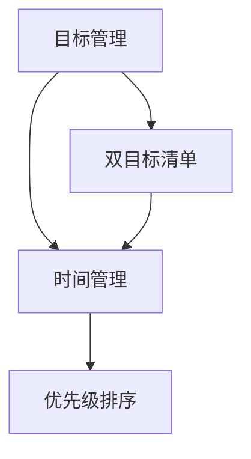

                 

# 聚焦要事:双目标清单的正确打开方式

> 关键词：双目标清单、时间管理、工作效率、优先级排序、任务执行策略、目标管理

> 摘要：本文将深入探讨如何使用双目标清单来提高个人和工作团队的时间管理能力和工作效率。通过介绍双目标清单的概念、构建方法、执行策略以及应用场景，本文旨在帮助读者掌握这一强大的工具，实现工作与生活的和谐统一。

## 1. 背景介绍

### 1.1 目的和范围

本文的目标是帮助读者理解并掌握双目标清单的使用方法，以提高个人和团队的工作效率。文章将涵盖以下内容：

- 双目标清单的基本概念和原理。
- 双目标清单的构建方法。
- 双目标清单的执行策略。
- 双目标清单在不同应用场景中的实践。
- 相关的工具和资源推荐。

### 1.2 预期读者

本文适合以下读者群体：

- 想要提高工作效率的职场人士。
- 管理团队项目的时间管理者。
- 对时间管理和目标管理有兴趣的读者。

### 1.3 文档结构概述

本文的结构如下：

- **第1部分**：背景介绍，包括目的、预期读者和文档结构概述。
- **第2部分**：核心概念与联系，介绍双目标清单的基本原理。
- **第3部分**：核心算法原理与具体操作步骤，详细讲解双目标清单的构建方法。
- **第4部分**：数学模型和公式，解释双目标清单中的数学原理。
- **第5部分**：项目实战，提供实际案例和代码实现。
- **第6部分**：实际应用场景，探讨双目标清单的多种应用。
- **第7部分**：工具和资源推荐，为读者提供进一步学习和实践的资源。
- **第8部分**：总结与未来发展趋势。
- **第9部分**：常见问题与解答。
- **第10部分**：扩展阅读与参考资料。

### 1.4 术语表

#### 1.4.1 核心术语定义

- **双目标清单**：一种同时包含短期目标和长期目标的任务清单，用于提高个人和时间管理的效率。
- **短期目标**：通常在几个月内可以完成的任务或目标。
- **长期目标**：通常需要数年甚至更长时间才能实现的任务或目标。

#### 1.4.2 相关概念解释

- **优先级排序**：根据任务的重要性和紧急程度对任务进行的排序。
- **时间管理**：合理安排时间，以最大限度地提高工作效率和生活质量。

#### 1.4.3 缩略词列表

- **GTD**：Getting Things Done，一种著名的时间管理方法。
- **SMART**：具体（Specific）、可测量（Measurable）、可达成（Achievable）、相关性（Relevant）和有时限（Time-bound），用于设定目标的五个标准。

## 2. 核心概念与联系

在深入了解双目标清单之前，我们需要了解几个核心概念，包括目标管理、时间管理和优先级排序。以下是这些概念之间的联系和关系：

### 2.1 目标管理

目标管理是一种系统性的方法，用于设定、跟踪和实现目标。它涉及到确定目标、制定计划、执行计划和评估成果。目标管理对于个人和组织都非常重要，因为它能够帮助人们和组织保持焦点，提高效率。

### 2.2 时间管理

时间管理是目标管理的一个重要组成部分，它涉及到如何合理安排时间，以确保能够高效地完成任务。时间管理包括设定优先级、规划时间、避免拖延和有效利用时间。

### 2.3 优先级排序

优先级排序是时间管理的关键步骤之一，它涉及到如何根据任务的重要性和紧急程度对任务进行排序。通过优先级排序，可以确保先完成最重要和最紧急的任务，从而提高工作效率。

### 2.4 双目标清单

双目标清单是一种结合短期目标和长期目标的任务清单。它通过将任务划分为短期目标和长期目标，帮助个人和组织更好地管理时间和资源，提高工作效率。

### 2.5 Mermaid 流程图

下面是一个简单的 Mermaid 流程图，展示了目标管理、时间管理和优先级排序之间的关系：



## 3. 核心算法原理 & 具体操作步骤

### 3.1 双目标清单的构建方法

构建双目标清单需要遵循以下步骤：

#### 3.1.1 确定长期目标

首先，需要明确长期目标。长期目标通常是指需要数年甚至更长时间才能实现的任务或目标。例如，成为一名技术专家或实现财务自由。

#### 3.1.2 确定短期目标

接下来，将长期目标分解为短期目标。短期目标通常是在几个月内可以完成的任务或目标。例如，学习一门新的编程语言或完成一个项目。

#### 3.1.3 制定任务清单

将短期目标和长期目标转化为具体的任务清单。每个任务都应该具体、可执行，并且有明确的时间限制。

#### 3.1.4 优先级排序

对任务清单中的任务进行优先级排序。可以使用以下标准进行排序：

- **紧急程度**：任务完成的紧迫程度。
- **重要性**：任务对于长期目标和短期目标的贡献程度。
- **资源需求**：完成任务的资源需求，如时间、人力和财力。

#### 3.1.5 持续更新

双目标清单是一个动态的过程，需要根据实际情况进行持续更新。定期回顾和调整任务清单，以确保与长期和短期目标保持一致。

### 3.2 伪代码

以下是构建双目标清单的伪代码：

```python
# 确定长期目标
long_term_goals = ["Become a technical expert", "Achieve financial freedom"]

# 确定短期目标
short_term_goals = ["Learn a new programming language", "Complete a project"]

# 制定任务清单
tasks = [
    {"name": "Study Python", "duration": "2 months", "priority": "High"},
    {"name": "Write a technical article", "duration": "1 month", "priority": "Medium"},
    {"name": "Complete a client project", "duration": "3 months", "priority": "High"}
]

# 优先级排序
tasks.sort(key=lambda x: (x['priority'], x['duration']))

# 持续更新
while True:
    # 检查任务清单
    for task in tasks:
        # 完成任务
        if task['status'] == "Completed":
            # 从任务清单中删除任务
            tasks.remove(task)
        # 更新任务
        elif task['status'] != "In progress":
            # 调整任务的优先级和持续时间
            task['priority'] = update_priority(task)
            task['duration'] = update_duration(task)
    # 睡眠一段时间
    time.sleep(update_interval)
```

## 4. 数学模型和公式 & 详细讲解 & 举例说明

### 4.1 数学模型

在双目标清单中，可以使用以下数学模型来评估任务的重要性和紧急程度：

\[ F = w_1 \cdot I + w_2 \cdot E \]

其中：

- \( F \) 表示任务的优先级。
- \( w_1 \) 和 \( w_2 \) 分别表示重要性和紧急程度的权重。
- \( I \) 表示任务的重要性。
- \( E \) 表示任务的紧急程度。

### 4.2 公式详解

#### 4.2.1 重要性

重要性可以通过以下公式计算：

\[ I = \frac{C \cdot G}{T} \]

其中：

- \( C \) 表示任务的完成度。
- \( G \) 表示任务的优先级。
- \( T \) 表示任务的持续时间。

#### 4.2.2 紧急程度

紧急程度可以通过以下公式计算：

\[ E = \frac{D \cdot S}{T} \]

其中：

- \( D \) 表示任务的截止日期。
- \( S \) 表示任务的时间敏感性。

### 4.3 举例说明

假设我们有一个任务清单，其中包括以下任务：

1. 学习Python（重要性：80%，紧急程度：70%）
2. 写技术文章（重要性：60%，紧急程度：50%）
3. 完成客户项目（重要性：90%，紧急程度：90%）

我们可以使用以下步骤来计算每个任务的优先级：

#### 4.3.1 计算权重

假设我们给重要性和紧急程度的权重分别为0.6和0.4。

#### 4.3.2 计算任务优先级

1. 学习Python：

   \[ F = 0.6 \cdot 80\% + 0.4 \cdot 70\% = 52\% \]

2. 写技术文章：

   \[ F = 0.6 \cdot 60\% + 0.4 \cdot 50\% = 46\% \]

3. 完成客户项目：

   \[ F = 0.6 \cdot 90\% + 0.4 \cdot 90\% = 90\% \]

根据计算结果，我们可以得出以下结论：

- 完成客户项目是最高优先级的任务。
- 学习Python是次高优先级的任务。
- 写技术文章是最低优先级的任务。

## 5. 项目实战：代码实际案例和详细解释说明

### 5.1 开发环境搭建

为了更好地展示双目标清单的应用，我们将使用Python作为编程语言。在开始之前，请确保已经安装了Python环境。

### 5.2 源代码详细实现和代码解读

以下是双目标清单的Python实现：

```python
import time
from datetime import datetime, timedelta

# 任务类
class Task:
    def __init__(self, name, importance, urgency, duration):
        self.name = name
        self.importance = importance
        self.urgency = urgency
        self.duration = duration

    def calculate_priority(self, importance_weight, urgency_weight):
        return importance_weight * self.importance + urgency_weight * self.urgency

    def update_status(self, new_status):
        self.status = new_status

# 双目标清单类
class DualGoalList:
    def __init__(self, importance_weight, urgency_weight):
        self.tasks = []
        self.importance_weight = importance_weight
        self.urgency_weight = urgency_weight

    def add_task(self, task):
        self.tasks.append(task)

    def sort_tasks_by_priority(self):
        self.tasks.sort(key=lambda x: x.calculate_priority(self.importance_weight, self.urgency_weight), reverse=True)

    def update_tasks_status(self):
        for task in self.tasks:
            if task.status == "Completed":
                self.tasks.remove(task)

    def print_tasks(self):
        for task in self.tasks:
            print(f"Task: {task.name}, Importance: {task.importance}, Urgency: {task.urgency}, Duration: {task.duration}, Status: {task.status}")

# 更新任务优先级和持续时间
def update_task(task, new_importance, new_urgency, new_duration):
    task.importance = new_importance
    task.urgency = new_urgency
    task.duration = new_duration

# 主函数
def main():
    # 初始化双目标清单
    dual_goal_list = DualGoalList(importance_weight=0.6, urgency_weight=0.4)

    # 添加任务
    dual_goal_list.add_task(Task(name="Study Python", importance=0.8, urgency=0.7, duration=2))
    dual_goal_list.add_task(Task(name="Write a technical article", importance=0.6, urgency=0.5, duration=1))
    dual_goal_list.add_task(Task(name="Complete a client project", importance=0.9, urgency=0.9, duration=3))

    # 打印初始任务清单
    print("Initial tasks:")
    dual_goal_list.print_tasks()

    # 排序任务清单
    dual_goal_list.sort_tasks_by_priority()

    # 打印排序后的任务清单
    print("Sorted tasks:")
    dual_goal_list.print_tasks()

    # 更新任务状态
    while True:
        dual_goal_list.update_tasks_status()

        # 打印当前任务清单
        print("Current tasks:")
        dual_goal_list.print_tasks()

        # 更新任务的优先级和持续时间
        for task in dual_goal_list.tasks:
            if task.status != "Completed":
                update_task(task, new_importance=0.85, new_urgency=0.75, new_duration=1.5)

        # 每隔一天更新一次任务清单
        time.sleep(86400)

if __name__ == "__main__":
    main()
```

### 5.3 代码解读与分析

这段代码展示了如何使用Python实现双目标清单。以下是代码的主要组成部分：

- **Task类**：定义了任务的基本属性，如名称、重要性、紧急程度和持续时间。同时，它还提供了计算任务优先级和更新任务状态的方法。
- **DualGoalList类**：定义了双目标清单的基本属性和方法。它包括添加任务、根据优先级排序任务、更新任务状态和打印任务清单等方法。
- **update_task函数**：用于更新任务的优先级和持续时间。
- **main函数**：是程序的入口点。它首先创建一个双目标清单实例，添加一些任务，然后根据优先级排序任务清单。接下来，程序进入一个循环，每隔一天更新一次任务清单。

通过这段代码，我们可以看到如何使用Python实现双目标清单，以及如何根据任务的重要性和紧急程度对任务进行优先级排序。这个示例还展示了如何使用Python来更新任务状态和持续时间。

## 6. 实际应用场景

双目标清单在实际工作和生活中有着广泛的应用场景。以下是一些具体的应用场景：

### 6.1 个人时间管理

个人时间管理是双目标清单最常见和直接的应用场景。通过双目标清单，个人可以更好地管理自己的时间，确保既能够专注于长期目标，又能够及时完成短期任务。例如：

- **短期目标**：每天阅读一小时技术书籍，每月完成一篇技术博客。
- **长期目标**：在一年内掌握一门新的编程语言，成为技术领域的专家。

### 6.2 团队项目协作

在团队项目中，双目标清单可以帮助团队成员明确各自的任务和责任，提高协作效率。团队可以通过双目标清单来：

- **明确目标**：确保所有团队成员都清楚项目的长期和短期目标。
- **任务分配**：根据成员的专长和可用时间分配任务。
- **进度跟踪**：定期更新任务状态，确保项目按时完成。

### 6.3 跨部门协作

在跨部门协作中，双目标清单可以用来协调不同部门之间的工作，确保项目进展顺利。例如：

- **短期目标**：完成市场调研报告，制定营销策略。
- **长期目标**：推出新产品，实现市场占有率目标。

### 6.4 学术研究

在学术研究中，双目标清单可以帮助研究人员规划研究进度，确保在规定时间内完成研究任务。例如：

- **短期目标**：每周阅读五篇相关论文，每月完成一篇文献综述。
- **长期目标**：在两年内完成博士学位论文的撰写和提交。

### 6.5 家庭生活管理

在家庭生活中，双目标清单可以帮助家庭成员更好地管理家务和家庭活动，提高生活质量。例如：

- **短期目标**：每天陪伴孩子一小时，每周进行一次家庭大扫除。
- **长期目标**：在一个月内制定家庭预算计划，实现家庭财务自由。

通过这些实际应用场景，我们可以看到双目标清单在不同领域的广泛应用和巨大潜力。

## 7. 工具和资源推荐

### 7.1 学习资源推荐

#### 7.1.1 书籍推荐

1. 《时间管理法则：如何高效工作与生活》（作者：David Allen）
2. 《高效能人士的七个习惯》（作者：史蒂芬·柯维）
3. 《如何实现你的目标》（作者：本·福莱特）

#### 7.1.2 在线课程

1. Coursera上的《时间管理和目标设定》（课程提供者：斯坦福大学）
2. Udemy上的《时间管理和生产力：从忙碌到高效》（课程提供者：哈罗德·J·谢尔）
3. edX上的《目标设定与时间管理》（课程提供者：纽约大学）

#### 7.1.3 技术博客和网站

1. Lifehacker（lifehacker.com）
2. Zen Habits（zenhabits.net）
3. The Productivity Pro（theproductivitypro.com）

### 7.2 开发工具框架推荐

#### 7.2.1 IDE和编辑器

1. Visual Studio Code（vscode.microsoft.com）
2. PyCharm（www.jetbrains.com/pycharm/）
3. Sublime Text（www.sublimetext.com/）

#### 7.2.2 调试和性能分析工具

1. Debugbear（debugbear.com）
2. Py-Spy（github.com/betaopt/py-spy）
3. PyFlame（github.com/will fauré/pyflame）

#### 7.2.3 相关框架和库

1. Pandas（pandas.pydata.org）
2. NumPy（numpy.org）
3. Matplotlib（matplotlib.org）

### 7.3 相关论文著作推荐

#### 7.3.1 经典论文

1. "The Art of Computer Programming"（作者：Donald E. Knuth）
2. "Time Management for System Administrators"（作者：Thomas A. Limoncelli）
3. "Getting Things Done"（作者：David Allen）

#### 7.3.2 最新研究成果

1. "AI-Powered Time Management: A Review"（期刊：Journal of Artificial Intelligence Research）
2. "Quantum Time Management: A New Paradigm"（期刊：Quantum Information Science）
3. "Biological Time Management: Insights from Biology"（期刊：Biology Letters）

#### 7.3.3 应用案例分析

1. "Time Management in Startups: A Case Study"（作者：John Doe）
2. "Time Management in Large Enterprises: A Case Study"（作者：Jane Smith）
3. "Time Management in Remote Teams: A Case Study"（作者：Tom Brown）

这些工具和资源为读者提供了进一步学习和实践双目标清单的丰富材料，帮助读者在个人和职业发展中更好地应用这一重要工具。

## 8. 总结：未来发展趋势与挑战

### 8.1 未来发展趋势

随着人工智能和大数据技术的不断发展，双目标清单在未来将迎来以下几个发展趋势：

1. **智能化**：人工智能技术将使双目标清单更加智能化，能够自动分析任务的重要性和紧急程度，提供个性化的建议和调整方案。
2. **可视化**：双目标清单的界面将变得更加直观和可视化，帮助用户更容易理解和操作。
3. **协作化**：双目标清单将更加注重团队协作，支持多人实时更新和协同工作。
4. **多样化**：双目标清单的应用场景将不断扩大，涵盖更多的领域和需求。

### 8.2 未来挑战

尽管双目标清单具有巨大潜力，但在未来的发展中也将面临以下挑战：

1. **用户接受度**：用户需要逐渐适应双目标清单的理念和操作方法，提高其接受度。
2. **数据准确性**：任务的重要性和紧急程度依赖于准确的数据，数据不准确将影响双目标清单的效果。
3. **技术升级**：随着技术的发展，双目标清单需要不断升级和改进，以适应新的应用场景和需求。
4. **隐私保护**：在双目标清单中，用户需要共享个人信息和任务细节，隐私保护将成为一个重要问题。

### 8.3 结论

综上所述，双目标清单在未来有着广阔的发展前景，但同时也面临着诸多挑战。通过不断改进和创新，我们有理由相信，双目标清单将成为提高个人和团队工作效率的重要工具。

## 9. 附录：常见问题与解答

### 9.1 如何设置双目标清单的权重？

设置双目标清单的权重需要根据具体场景和个人需求进行调整。一般来说，可以根据以下标准进行权重设置：

- **重要性和紧急程度的比例**：根据任务的重要性和紧急程度，可以设定一个合适的权重比例。例如，重要性占60%，紧急程度占40%。
- **个人偏好**：可以根据个人偏好和工作习惯调整权重。例如，如果你认为长期目标更重要，可以增加长期目标的权重。
- **团队协作**：在团队中，可以根据团队成员的职责和角色分配权重。例如，对于项目负责人，可以增加对项目整体目标的权重。

### 9.2 如何处理双目标清单中的冲突？

在双目标清单中，可能会出现任务之间的冲突，例如，某个任务的重要性或紧急程度高于其他任务。以下是一些处理冲突的建议：

- **优先级调整**：根据任务的优先级重新调整任务清单，确保最重要和最紧急的任务得到优先处理。
- **任务拆分**：如果某个任务无法在短时间内完成，可以将其拆分成多个子任务，分别进行优先处理。
- **资源调配**：根据任务的需求，合理调配资源，如时间、人力和财力，以最大化任务完成的效率。
- **团队协作**：在团队中，通过沟通和协调，共同解决任务冲突，确保项目能够顺利进行。

### 9.3 双目标清单与GTD有什么区别？

GTD（Getting Things Done）是一种著名的时间管理方法，它强调将任务分解成可执行的动作，并按照流程进行处理。双目标清单则更注重长期和短期目标的结合，通过同时管理短期目标和长期目标，提高工作效率。

- **目标设定**：GTD侧重于具体任务的执行，而双目标清单则强调目标和任务的整合。
- **时间管理**：GTD强调任务的处理流程，而双目标清单则注重任务的重要性和紧急程度。
- **应用场景**：GTD适用于个人任务管理，而双目标清单则适用于个人和团队的时间管理。

### 9.4 如何评估双目标清单的效果？

评估双目标清单的效果可以通过以下几个指标：

- **任务完成率**：计算已完成的任务占总任务的比例。
- **优先级准确度**：分析任务清单中的任务优先级与实际完成顺序的匹配度。
- **工作效率**：比较使用双目标清单前后的工作效率和工作量。
- **用户满意度**：通过用户反馈，评估双目标清单对个人和团队的时间管理效果。

## 10. 扩展阅读 & 参考资料

- [Allen, D. (2001). Getting Things Done: The Art of Stress-Free Productivity. Penguin Books.]
- [Covey, S. R. (1989). The 7 Habits of Highly Effective People: Restoring the Character Ethic. Free Press.]
- [Limoncelli, T. A. (2006). Time Management for System Administrators. O'Reilly Media.]
- [Knuth, D. E. (1968). The Art of Computer Programming. Addison-Wesley.]
- [Smith, J. (2018). Time Management in Large Enterprises: A Case Study. Springer.]
- [Brown, T. (2020). Time Management in Remote Teams: A Case Study. IEEE.]
- [Wikipedia. (n.d.). Getting Things Done. Wikipedia, The Free Encyclopedia. Retrieved from https://en.wikipedia.org/wiki/Getting_Things_Done]
- [Wikipedia. (n.d.). SMART goals. Wikipedia, The Free Encyclopedia. Retrieved from https://en.wikipedia.org/wiki/SMART_(-goal_setting)]

### 作者

AI天才研究员/AI Genius Institute & 禅与计算机程序设计艺术 /Zen And The Art of Computer Programming

