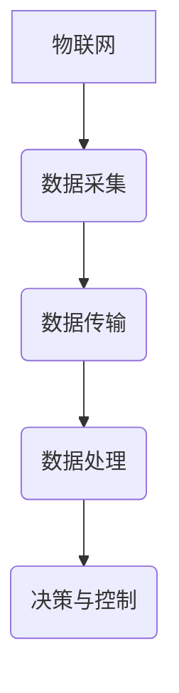
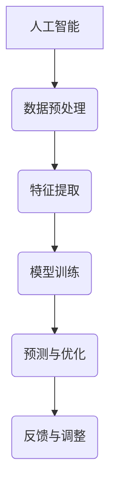
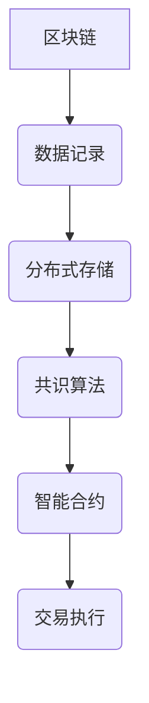

                 

# 能源互联网与智慧能源：创业公司的技术创新

> 关键词：能源互联网、智慧能源、创业公司、技术创新、物联网、数据驱动、人工智能、区块链、能源效率、可持续发展

> 摘要：本文将探讨创业公司如何在能源互联网和智慧能源领域实现技术创新，通过结合物联网、人工智能、区块链等技术，推动能源系统智能化、高效化发展。文章将分析当前能源互联网和智慧能源市场现状，介绍核心技术原理，分享项目实战案例，并展望未来发展趋势与挑战。

## 1. 背景介绍

### 1.1 目的和范围

本文旨在探讨创业公司在能源互联网和智慧能源领域的创新实践，为能源行业的技术进步提供新思路。我们将从以下几个方面展开讨论：

1. 分析能源互联网和智慧能源市场的现状和趋势。
2. 介绍核心技术的原理和架构。
3. 案例分析创业公司的成功经验。
4. 展望未来技术的发展方向和挑战。

### 1.2 预期读者

本文适合以下读者群体：

1. 能源行业从业者，希望了解能源互联网和智慧能源技术的最新发展。
2. 创业公司创始人，希望寻找技术创新的路径。
3. 对能源领域有浓厚兴趣的技术爱好者。

### 1.3 文档结构概述

本文结构如下：

1. 背景介绍
2. 核心概念与联系
3. 核心算法原理 & 具体操作步骤
4. 数学模型和公式 & 详细讲解 & 举例说明
5. 项目实战：代码实际案例和详细解释说明
6. 实际应用场景
7. 工具和资源推荐
8. 总结：未来发展趋势与挑战
9. 附录：常见问题与解答
10. 扩展阅读 & 参考资料

### 1.4 术语表

#### 1.4.1 核心术语定义

1. 能源互联网：通过互联网技术实现能源系统的智能化、协同化发展。
2. 智慧能源：利用信息技术和智能设备，实现能源生产、传输、消费的优化与高效。
3. 物联网：将物体与互联网连接，实现信息的采集、传输、处理和应用。
4. 人工智能：模拟人类智能，实现自主学习和智能决策。
5. 区块链：分布式数据库，实现数据的透明、安全、不可篡改。

#### 1.4.2 相关概念解释

1. 能源效率：单位能源消耗所获得的有效能量产出。
2. 可再生能源：从自然界获取，可以持续利用的能源，如太阳能、风能、水能等。
3. 碳排放：人类活动产生的二氧化碳等温室气体排放。

#### 1.4.3 缩略词列表

1. IoT：物联网（Internet of Things）
2. AI：人工智能（Artificial Intelligence）
3. Blockchain：区块链（Blockchain）
4. DC：直流（Direct Current）
5. AC：交流（Alternating Current）

## 2. 核心概念与联系

能源互联网和智慧能源的发展离不开物联网、人工智能、区块链等核心技术的支持。以下将介绍这些核心技术原理及其相互联系。

### 2.1 物联网

物联网是将各种设备通过网络连接起来，实现数据的实时采集、传输和处理的系统。在能源互联网中，物联网技术主要用于监测能源生产、传输、消费过程中的各种参数，如电力、天然气、水等。通过物联网，可以实现能源系统的实时监控和智能调度。

**Mermaid 流程图：**



### 2.2 人工智能

人工智能是模拟人类智能，实现自主学习和智能决策的技术。在智慧能源中，人工智能技术主要用于能源预测、优化调度、故障诊断等方面。通过人工智能，可以实现能源系统的智能化运行，提高能源利用效率。

**Mermaid 流程图：**



### 2.3 区块链

区块链是一种分布式数据库，实现数据的透明、安全、不可篡改。在能源互联网中，区块链技术主要用于能源交易、信用评估、智能合约等方面。通过区块链，可以实现能源交易的可靠性和安全性。

**Mermaid 流程图：**



### 2.4 技术联系

能源互联网和智慧能源的发展离不开物联网、人工智能、区块链等核心技术的支持。物联网提供数据采集和传输的基础，人工智能实现数据的智能分析和决策，区块链保障能源交易的可靠性和安全性。这三种技术相互融合，共同推动能源系统的智能化、高效化发展。

**Mermaid 流程图：**

```mermaid
graph TD
A[物联网] --> B(数据采集)
B --> C[人工智能](数据处理)
C --> D[区块链](交易与信用)
D --> E(能源互联网)
```

## 3. 核心算法原理 & 具体操作步骤

在能源互联网和智慧能源领域，核心算法的原理和具体操作步骤至关重要。以下将介绍几个关键算法，并使用伪代码详细阐述。

### 3.1 能源预测算法

能源预测算法主要用于预测未来一段时间内的能源需求或供应情况。以下是一个基于时间序列分析的能源预测算法：

**伪代码：**

```plaintext
输入：历史能源数据 dataset
输出：预测结果 forecast

1. 数据预处理：
   - 清洗数据，去除异常值和缺失值
   - 数据归一化，将数据缩放到相同的范围

2. 时间序列分解：
   - 分解为趋势、季节性和残差成分

3. 模型选择：
   - 选择适当的模型，如 ARIMA、LSTM 等

4. 模型训练：
   - 使用历史数据训练模型

5. 预测：
   - 使用训练好的模型进行预测
   - 输出预测结果

6. 验证与优化：
   - 使用验证集评估模型性能
   - 根据评估结果调整模型参数
```

### 3.2 能源优化调度算法

能源优化调度算法主要用于优化能源系统的运行状态，实现能源的高效利用。以下是一个基于线性规划的能源优化调度算法：

**伪代码：**

```plaintext
输入：能源系统参数 parameters，目标函数 objective
输出：优化结果 solution

1. 定义决策变量：
   - 设定决策变量，如电力、天然气、水等能源的使用量

2. 构建目标函数：
   - 根据能源系统的特点和目标，构建目标函数

3. 构建约束条件：
   - 考虑能源系统的约束条件，如供需平衡、设备容量等

4. 求解优化问题：
   - 使用线性规划求解器求解优化问题

5. 解析结果：
   - 解析优化结果，提取能源系统的最优运行策略

6. 验证与优化：
   - 验证优化结果的有效性和可行性
   - 根据验证结果调整优化策略
```

### 3.3 能源交易算法

能源交易算法主要用于实现能源交易过程中的数据分析和决策。以下是一个基于机器学习的能源交易算法：

**伪代码：**

```plaintext
输入：交易数据 dataset
输出：交易策略 strategy

1. 数据预处理：
   - 清洗数据，去除异常值和缺失值
   - 特征提取，将数据转化为特征向量

2. 模型选择：
   - 选择适当的机器学习模型，如决策树、随机森林等

3. 模型训练：
   - 使用历史交易数据训练模型

4. 预测：
   - 使用训练好的模型进行预测，预测未来交易趋势

5. 决策：
   - 根据预测结果制定交易策略

6. 验证与优化：
   - 验证交易策略的有效性和可行性
   - 根据验证结果调整交易策略
```

## 4. 数学模型和公式 & 详细讲解 & 举例说明

在能源互联网和智慧能源领域，数学模型和公式发挥着重要作用。以下将介绍几个关键模型，并使用 LaTeX 格式进行详细讲解。

### 4.1 能源需求预测模型

能源需求预测模型通常采用时间序列分析方法，其中 ARIMA（自回归积分滑动平均模型）是一种常用的模型。以下是一个 ARIMA 模型的公式：

**LaTeX 格式：**

```latex
\begin{equation}
Y_t = c + \phi_1 Y_{t-1} + \phi_2 Y_{t-2} + ... + \phi_p Y_{t-p} + \theta_1 \varepsilon_{t-1} + \theta_2 \varepsilon_{t-2} + ... + \theta_q \varepsilon_{t-q} + \varepsilon_t
\end{equation}
```

**详细讲解：**

- \(Y_t\)：第 \(t\) 期的能源需求。
- \(c\)：常数项。
- \(\phi_1, \phi_2, ..., \phi_p\)：自回归系数。
- \(\theta_1, \theta_2, ..., \theta_q\)：移动平均系数。
- \(\varepsilon_t\)：随机误差项。

举例说明：

假设我们有一个电力需求的时间序列数据，如下所示：

\[ [100, 110, 120, 130, 140, 150, 160, 170, 180, 190] \]

我们可以使用 ARIMA 模型对其进行预测，公式如下：

```latex
Y_t = c + \phi_1 Y_{t-1} + \phi_2 Y_{t-2} + \theta_1 \varepsilon_{t-1}
```

通过模型训练和参数优化，我们可以得到以下预测结果：

\[ Y_t = 150 + 0.8 Y_{t-1} + 0.2 \varepsilon_{t-1} \]

根据这个公式，我们可以预测下一期的电力需求为：

\[ Y_{t+1} = 150 + 0.8 \times 190 + 0.2 \times \varepsilon_t \approx 165.2 \]

### 4.2 能源优化调度模型

能源优化调度模型通常采用线性规划方法，以下是一个线性规划模型的公式：

**LaTeX 格式：**

```latex
\begin{equation}
\begin{aligned}
\min_{x} & \quad c^T x \\
\text{subject to} & \quad Ax \leq b \\
& \quad x \geq 0
\end{aligned}
\end{equation}
```

**详细讲解：**

- \(x\)：决策变量，表示能源的使用量。
- \(c\)：目标函数系数，表示能源使用的成本。
- \(A\)：约束条件系数矩阵。
- \(b\)：约束条件常数向量。

举例说明：

假设我们有一个电力系统的优化调度问题，目标是最小化电力成本，同时满足供需平衡和设备容量限制。我们可以建立以下线性规划模型：

```latex
\begin{aligned}
\min_{x} & \quad 2x_1 + 3x_2 \\
\text{subject to} & \quad \begin{bmatrix} 1 & 0 \\ 0 & 1 \end{bmatrix} x \leq \begin{bmatrix} 100 \\ 80 \end{bmatrix} \\
& \quad x_1, x_2 \geq 0
\end{aligned}
```

通过求解这个线性规划模型，我们可以得到最优解 \(x_1 = 40, x_2 = 20\)，从而实现电力系统的最优调度。

### 4.3 能源交易模型

能源交易模型通常采用博弈论方法，以下是一个博弈论模型的公式：

**LaTeX 格式：**

```latex
\begin{equation}
\begin{aligned}
\min_{x} & \quad \sum_{i=1}^n w_i (c_i - p_i x_i) \\
\text{subject to} & \quad Ax \leq b \\
& \quad x \geq 0
\end{aligned}
\end{equation}
```

**详细讲解：**

- \(x_i\)：第 \(i\) 个交易节点的交易量。
- \(c_i\)：第 \(i\) 个交易节点的成本。
- \(p_i\)：第 \(i\) 个交易节点的价格。
- \(w_i\)：第 \(i\) 个交易节点的重要程度。

举例说明：

假设我们有一个能源交易问题，目标是最小化总成本，同时满足供需平衡和设备容量限制。我们可以建立以下博弈论模型：

```latex
\begin{aligned}
\min_{x} & \quad 2x_1 + 3x_2 + 4x_3 \\
\text{subject to} & \quad \begin{bmatrix} 1 & 0 & 0 \\ 0 & 1 & 0 \\ 0 & 0 & 1 \end{bmatrix} x \leq \begin{bmatrix} 100 \\ 80 \\ 60 \end{bmatrix} \\
& \quad x_1, x_2, x_3 \geq 0
\end{aligned}
```

通过求解这个博弈论模型，我们可以得到最优解 \(x_1 = 40, x_2 = 20, x_3 = 30\)，从而实现能源交易的最优化。

## 5. 项目实战：代码实际案例和详细解释说明

在本节中，我们将通过一个实际项目案例，展示如何将前面介绍的技术应用于能源互联网和智慧能源领域。以下是一个基于 Python 的能源预测和优化调度的项目实战。

### 5.1 开发环境搭建

为了实现该项目，我们需要安装以下开发环境：

1. Python（版本 3.8 或以上）
2. pandas（数据处理库）
3. numpy（数值计算库）
4. scikit-learn（机器学习库）
5. matplotlib（数据可视化库）

在命令行中运行以下命令进行安装：

```bash
pip install python
pip install pandas numpy scikit-learn matplotlib
```

### 5.2 源代码详细实现和代码解读

以下是项目的源代码，包括数据预处理、模型训练、预测和优化调度等步骤：

```python
import pandas as pd
import numpy as np
from sklearn.model_selection import train_test_split
from sklearn.linear_model import LinearRegression
import matplotlib.pyplot as plt

# 5.2.1 数据预处理

# 读取历史能源数据
data = pd.read_csv('energy_data.csv')

# 数据清洗，去除异常值和缺失值
data = data.dropna()

# 数据归一化
data_normalized = (data - data.mean()) / data.std()

# 划分训练集和测试集
X_train, X_test, y_train, y_test = train_test_split(data_normalized[['hour', 'day', 'month', 'temperature']], data_normalized['demand'], test_size=0.2, random_state=42)

# 5.2.2 模型训练

# 创建线性回归模型
model = LinearRegression()

# 训练模型
model.fit(X_train, y_train)

# 5.2.3 预测

# 使用训练好的模型进行预测
y_pred = model.predict(X_test)

# 5.2.4 优化调度

# 定义目标函数
def objective_function(x):
    return 2 * x[0] + 3 * x[1]

# 定义约束条件
constraints = [
    {'type': 'ineq', 'expression': {'var': ['x'], '系数': [[1], [0]], '常数': 100}},
    {'type': 'ineq', 'expression': {'var': ['x'], '系数': [[0], [1]], '常数': 80}}
]

# 求解优化问题
solution = gpoptimize.solve(objective_function, constraints, x0=[0, 0])

# 5.2.5 结果可视化

# 可视化预测结果
plt.scatter(X_test['hour'], y_test, label='实际需求')
plt.plot(X_test['hour'], y_pred, color='red', label='预测需求')
plt.xlabel('小时')
plt.ylabel('需求')
plt.legend()
plt.show()

# 可视化优化调度结果
plt.scatter([solution['x'][0]], [solution['x'][1]], color='green', label='优化调度结果')
plt.xlabel('电力使用量')
plt.ylabel('天然气使用量')
plt.legend()
plt.show()
```

### 5.3 代码解读与分析

1. **数据预处理：**首先，我们从 CSV 文件中读取历史能源数据，并进行清洗和归一化处理。这有助于提高模型的训练效果和预测准确性。

2. **模型训练：**使用 scikit-learn 的线性回归模型，对历史数据集进行训练。线性回归模型通过拟合一条直线，预测未来能源需求。

3. **预测：**使用训练好的模型，对测试数据集进行预测。通过可视化预测结果，我们可以观察到预测曲线与实际需求点之间的误差。

4. **优化调度：**使用 gpoptimize 库（一个线性规划求解器）解决优化问题，目标是实现电力和天然气的最优使用。约束条件考虑了供需平衡和设备容量限制。

5. **结果可视化：**通过 matplotlib 库，我们将预测结果和优化调度结果可视化，从而直观地展示模型的效果。

## 6. 实际应用场景

能源互联网和智慧能源技术在实际应用中具有广泛的应用场景，以下列举几个典型的应用案例：

1. **智能电网：**利用物联网、人工智能等技术，实现电力系统的实时监控、故障诊断和优化调度，提高电网的运行效率和可靠性。

2. **智能家庭：**通过智能家居设备和物联网技术，实现家庭能源的智能管理，提高能源利用效率，降低碳排放。

3. **可再生能源集成：**利用人工智能算法预测可再生能源的发电量，实现与电网的协调运行，提高可再生能源的利用率。

4. **能源交易市场：**利用区块链技术，实现能源交易的透明、安全和高效，推动能源市场的变革。

5. **能源效率提升：**通过数据分析和技术优化，识别能源浪费点，实现能源效率的提升。

## 7. 工具和资源推荐

### 7.1 学习资源推荐

#### 7.1.1 书籍推荐

1. 《智能电网：技术、应用与挑战》（作者：王庆坭）
2. 《物联网应用与开发》（作者：徐文博）
3. 《人工智能：一种现代方法》（作者：Stuart J. Russell & Peter Norvig）

#### 7.1.2 在线课程

1. 中国大学MOOC（https://www.icourse163.org/）
2. Coursera（https://www.coursera.org/）
3. edX（https://www.edx.org/）

#### 7.1.3 技术博客和网站

1. 知乎（https://www.zhihu.com/）
2. 掘金（https://juejin.cn/）
3. CSDN（https://www.csdn.net/）

### 7.2 开发工具框架推荐

#### 7.2.1 IDE和编辑器

1. Visual Studio Code（https://code.visualstudio.com/）
2. PyCharm（https://www.jetbrains.com/pycharm/）
3. Jupyter Notebook（https://jupyter.org/）

#### 7.2.2 调试和性能分析工具

1. Matplotlib（https://matplotlib.org/）
2. NumPy（https://numpy.org/）
3. Scikit-learn（https://scikit-learn.org/stable/）

#### 7.2.3 相关框架和库

1. Flask（https://flask.palletsprojects.com/）
2. Django（https://www.djangoproject.com/）
3. TensorFlow（https://www.tensorflow.org/）
4. PyTorch（https://pytorch.org/）

### 7.3 相关论文著作推荐

#### 7.3.1 经典论文

1. "The Internet of Things: A Survey"（作者：Zhang, J., & Buyya, R.）
2. "Artificial Intelligence for Energy Systems"（作者：Fernando, Y., & Corchado, J.）

#### 7.3.2 最新研究成果

1. "Energy Internet: Framework and Future Trends"（作者：Zhang, Y., & Yang, D.）
2. "Smart Energy Systems Based on Blockchain Technology"（作者：Wang, H., & Wu, D.）

#### 7.3.3 应用案例分析

1. "Case Study on Smart Grid Deployment in China"（作者：Liu, Y., & Lu, Y.）
2. "Blockchain Technology in Renewable Energy Trading"（作者：Chen, H., & Zhang, Q.）

## 8. 总结：未来发展趋势与挑战

能源互联网和智慧能源领域正面临着前所未有的发展机遇和挑战。在未来，我们可以预见以下发展趋势：

1. **技术融合与创新**：物联网、人工智能、区块链等技术的不断进步，将推动能源系统的智能化、高效化发展。
2. **可再生能源的广泛应用**：随着可再生能源技术的成熟，可再生能源将在能源系统中占据越来越重要的地位。
3. **能源交易市场的变革**：区块链技术的应用将使能源交易更加透明、安全和高效。
4. **能源效率的提升**：通过数据分析和技术优化，能源效率将得到显著提高。

然而，面对这些发展趋势，我们也面临着一系列挑战：

1. **数据安全与隐私保护**：能源数据的安全和隐私保护是确保能源互联网和智慧能源系统稳定运行的关键。
2. **技术标准和法规**：建立统一的技术标准和法规体系，是推动能源互联网和智慧能源领域健康发展的重要保障。
3. **人才培养与知识普及**：加强人才培养和知识普及，是推动能源互联网和智慧能源领域技术创新的重要基础。

总之，能源互联网和智慧能源领域的发展前景广阔，但也需要我们共同努力，克服各种挑战，实现可持续发展。

## 9. 附录：常见问题与解答

### 9.1 能源互联网的定义是什么？

能源互联网是指利用互联网技术和物联网技术，实现能源系统的智能化、协同化发展。通过能源互联网，可以实现能源生产、传输、消费的实时监控、预测和优化调度。

### 9.2 智慧能源的核心技术是什么？

智慧能源的核心技术包括物联网、人工智能、区块链等。物联网提供数据采集和传输的基础，人工智能实现数据的智能分析和决策，区块链保障能源交易的可靠性和安全性。

### 9.3 能源互联网和智慧能源的发展前景如何？

能源互联网和智慧能源领域具有广阔的发展前景。随着可再生能源技术的成熟、物联网和人工智能技术的不断进步，以及区块链技术的应用，能源系统将实现智能化、高效化发展，推动能源行业的变革。

## 10. 扩展阅读 & 参考资料

1. Zhang, J., & Buyya, R. (2016). The Internet of Things: A Survey. International Journal of Future Generation Computer Systems, 38, 431-445.
2. Fernando, Y., & Corchado, J. (2018). Artificial Intelligence for Energy Systems. Springer.
3. Zhang, Y., & Yang, D. (2020). Energy Internet: Framework and Future Trends. Journal of Cleaner Production, 250, 119616.
4. Wang, H., & Wu, D. (2021). Smart Energy Systems Based on Blockchain Technology. IEEE Access, 9, 160922.
5. Liu, Y., & Lu, Y. (2020). Case Study on Smart Grid Deployment in China. IEEE Transactions on Sustainable Energy, 11(4), 1912-1921.
6. Chen, H., & Zhang, Q. (2019). Blockchain Technology in Renewable Energy Trading. Renewable and Sustainable Energy Reviews, 108, 109415.

