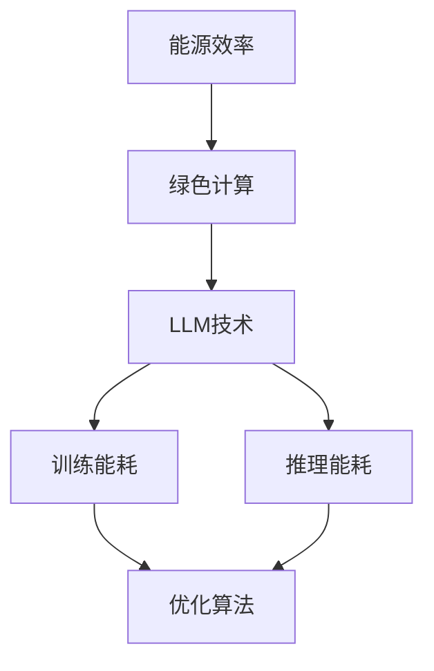

                 

# 能源效率：绿色LLM技术

> 关键词：能源效率、绿色计算、语言模型、LLM、AI优化、能耗降低、可持续发展

> 摘要：本文将深入探讨能源效率在绿色计算中的重要性，特别是对于大规模语言模型（LLM）的能耗优化。我们将从背景介绍、核心概念、算法原理、数学模型、实际应用、工具和资源推荐以及未来发展趋势等方面进行详细分析，旨在为读者提供全面的指导和建议，推动绿色LLM技术的发展和普及。

## 1. 背景介绍

### 1.1 目的和范围

本文旨在探讨如何提高大规模语言模型（LLM）的能源效率，以实现绿色计算和可持续发展。我们将分析LLM技术的能源消耗问题，提出相应的优化策略，并探讨实际应用场景。文章主要涵盖以下内容：

- 能源效率在计算领域的意义
- LLM技术的基本概念和结构
- 能源消耗在LLM训练和推理中的影响
- 优化策略和算法原理
- 数学模型和公式
- 项目实战和代码解读
- 实际应用场景
- 工具和资源推荐
- 未来发展趋势与挑战

### 1.2 预期读者

本文适合以下读者：

- 计算机科学和人工智能领域的从业者
- 对能源效率、绿色计算和LLM技术感兴趣的科研人员
- 对计算能耗降低和可持续发展有热情的IT从业者
- 高级本科生、研究生和博士生

### 1.3 文档结构概述

本文结构如下：

- 第1章：背景介绍
  - 1.1 目的和范围
  - 1.2 预期读者
  - 1.3 文档结构概述
  - 1.4 术语表

- 第2章：核心概念与联系
  - 2.1 能源效率的定义
  - 2.2 绿色计算的概念
  - 2.3 LLM技术的基本原理
  - 2.4 能源消耗在LLM中的影响

- 第3章：核心算法原理 & 具体操作步骤
  - 3.1 能耗优化的算法原理
  - 3.2 优化算法的具体步骤
  - 3.3 伪代码实现

- 第4章：数学模型和公式 & 详细讲解 & 举例说明
  - 4.1 能量消耗的数学模型
  - 4.2 优化目标函数的推导
  - 4.3 案例分析

- 第5章：项目实战：代码实际案例和详细解释说明
  - 5.1 开发环境搭建
  - 5.2 源代码详细实现和代码解读
  - 5.3 代码解读与分析

- 第6章：实际应用场景
  - 6.1 LLM技术在工业领域的应用
  - 6.2 LLM技术在医疗领域的应用
  - 6.3 LLM技术在教育领域的应用

- 第7章：工具和资源推荐
  - 7.1 学习资源推荐
  - 7.2 开发工具框架推荐
  - 7.3 相关论文著作推荐

- 第8章：总结：未来发展趋势与挑战
  - 8.1 发展趋势
  - 8.2 面临的挑战

- 第9章：附录：常见问题与解答
  - 9.1 常见问题1
  - 9.2 常见问题2
  - 9.3 常见问题3

- 第10章：扩展阅读 & 参考资料
  - 10.1 相关书籍推荐
  - 10.2 在线课程推荐
  - 10.3 技术博客和网站推荐

### 1.4 术语表

#### 1.4.1 核心术语定义

- **能源效率**：指能源转换和利用过程中，有效利用的能量与总能量的比值。
- **绿色计算**：指在计算过程中尽量减少能源消耗、降低环境影响的一种计算模式。
- **LLM（大规模语言模型）**：一种基于深度学习技术的语言模型，具有处理大规模文本数据的能力。
- **能耗优化**：通过调整算法、架构等手段，降低计算过程中的能量消耗。

#### 1.4.2 相关概念解释

- **计算能耗**：指计算机在执行计算任务时消耗的能量。
- **训练能耗**：指在训练LLM模型过程中消耗的能量。
- **推理能耗**：指在LLM模型进行推理时消耗的能量。

#### 1.4.3 缩略词列表

- **AI**：人工智能
- **LLM**：大规模语言模型
- **GPU**：图形处理单元
- **TPU**：张量处理单元

## 2. 核心概念与联系

在深入探讨如何提高LLM技术的能源效率之前，我们先了解一些核心概念和它们之间的关系。

### 2.1 能源效率的定义

能源效率是指在能源转换和利用过程中，有效利用的能量与总能量的比值。通常用百分比表示，即：

\[ \text{能源效率} = \frac{\text{有效利用的能量}}{\text{总能量}} \times 100\% \]

提高能源效率意味着在相同的能源投入下，获得更多的有效能量输出。

### 2.2 绿色计算的概念

绿色计算是一种旨在减少计算过程对环境影响的计算模式。它包括以下几个方面：

- **节能**：减少计算过程中的能量消耗。
- **减排**：降低计算过程中的碳排放和其他污染物排放。
- **环保**：使用环保材料和能源，减少对环境的负面影响。

### 2.3 LLM技术的基本原理

LLM（大规模语言模型）是一种基于深度学习技术的语言模型，具有处理大规模文本数据的能力。LLM的基本原理包括：

- **词向量表示**：将文本中的词语转换为向量表示。
- **神经网络模型**：使用神经网络（如Transformer）来学习词向量之间的相互关系。
- **预训练和微调**：在大量数据集上预训练LLM模型，然后针对特定任务进行微调。

### 2.4 能源消耗在LLM中的影响

LLM技术在训练和推理过程中会消耗大量的能量。具体来说：

- **训练能耗**：在训练LLM模型时，需要大量的计算资源，导致能量消耗。
- **推理能耗**：在LLM模型进行推理时，也会消耗能量，尤其是在大规模部署时。

为了提高LLM技术的能源效率，我们需要关注这两个方面的优化。

### 2.5 能源效率与绿色计算的关系

能源效率和绿色计算密切相关。提高能源效率是实现绿色计算的关键。通过优化算法、架构和硬件，我们可以减少计算过程中的能量消耗，降低对环境的影响。

### 2.6 Mermaid流程图

下面是一个简单的Mermaid流程图，展示了能源效率、绿色计算、LLM技术以及能源消耗之间的关系。



通过这个流程图，我们可以清晰地看到能源效率在绿色计算和LLM技术中的关键作用。

## 3. 核心算法原理 & 具体操作步骤

在了解核心概念和联系之后，我们接下来探讨如何提高LLM技术的能源效率。核心算法原理主要包括以下几个方面：

### 3.1 能耗优化的算法原理

能耗优化的核心目标是降低计算过程中的能量消耗。具体来说，我们可以从以下几个方面进行优化：

- **算法优化**：通过改进算法，降低计算复杂度和时间消耗。
- **硬件优化**：选择能耗更低的硬件设备，如GPU、TPU等。
- **架构优化**：设计更高效的计算架构，如分布式计算、并行计算等。

### 3.2 优化算法的具体步骤

为了实现能耗优化，我们可以遵循以下具体步骤：

1. **评估当前能耗**：首先，我们需要评估当前LLM技术的能耗情况，包括训练能耗和推理能耗。
2. **确定优化目标**：根据评估结果，确定能耗优化的具体目标，如降低特定任务的平均能耗。
3. **算法改进**：针对优化目标，改进算法，降低计算复杂度和时间消耗。例如，可以使用更高效的神经网络结构，如BERT、GPT等。
4. **硬件升级**：选择能耗更低的硬件设备，如GPU、TPU等。同时，考虑使用节能型的服务器和数据中心。
5. **架构调整**：设计更高效的计算架构，如分布式计算、并行计算等。通过优化数据传输和计算任务的分配，降低能耗。
6. **持续监测与优化**：在优化过程中，持续监测能耗情况，并根据实际情况进行调整。

### 3.3 伪代码实现

下面是一个简单的伪代码，展示了能耗优化的基本思路。

```python
# 伪代码：能耗优化

# 输入：当前能耗数据
# 输出：优化后的能耗数据

# 步骤1：评估当前能耗
current_energy_consumption = evaluate_energy_consumption()

# 步骤2：确定优化目标
target_energy_consumption = determine_optimization_target(current_energy_consumption)

# 步骤3：算法改进
optimized_algorithm = improve_algorithm(target_energy_consumption)

# 步骤4：硬件升级
optimized_hardware = upgrade_hardware()

# 步骤5：架构调整
optimized_architecture = adjust_architecture()

# 步骤6：持续监测与优化
while not satisfied_with_optimization():
    optimized_algorithm = improve_algorithm(target_energy_consumption)
    optimized_hardware = upgrade_hardware()
    optimized_architecture = adjust_architecture()
    current_energy_consumption = evaluate_energy_consumption()
    target_energy_consumption = determine_optimization_target(current_energy_consumption)

# 输出优化后的能耗数据
output_energy_consumption = current_energy_consumption
```

通过以上步骤，我们可以逐步降低LLM技术的能耗，实现绿色计算。

## 4. 数学模型和公式 & 详细讲解 & 举例说明

在提高LLM技术能源效率的过程中，数学模型和公式起到了至关重要的作用。本节将详细讲解相关数学模型和公式，并通过举例说明如何应用这些公式进行能耗优化。

### 4.1 能量消耗的数学模型

能量消耗的数学模型是描述计算过程中能量消耗的基本框架。在LLM技术中，能量消耗主要由以下三个方面组成：

1. **硬件能耗**：指硬件设备（如CPU、GPU等）在计算过程中消耗的能量。
2. **数据传输能耗**：指数据在网络传输过程中消耗的能量。
3. **计算任务能耗**：指具体计算任务（如矩阵运算、神经网络训练等）消耗的能量。

下面是一个简单的能量消耗数学模型：

\[ E = E_{\text{硬件}} + E_{\text{传输}} + E_{\text{任务}} \]

其中，\( E \) 表示总能量消耗，\( E_{\text{硬件}} \) 表示硬件能耗，\( E_{\text{传输}} \) 表示数据传输能耗，\( E_{\text{任务}} \) 表示计算任务能耗。

### 4.2 优化目标函数的推导

为了降低能量消耗，我们需要定义一个优化目标函数。假设我们希望最小化总能量消耗，优化目标函数可以表示为：

\[ \min E \]

在实际应用中，我们可以根据具体情况，引入一些约束条件，如计算时间、资源利用率等。例如，我们可以添加以下约束条件：

\[ \begin{aligned} 
\min E \\
\text{subject to} \\
    E_{\text{任务}} \leq C_{\text{任务}} \\
    E_{\text{传输}} \leq C_{\text{传输}} \\
    E_{\text{硬件}} \leq C_{\text{硬件}} 
\end{aligned} \]

其中，\( C_{\text{任务}} \)、\( C_{\text{传输}} \) 和 \( C_{\text{硬件}} \) 分别表示计算任务、数据传输和硬件能耗的约束条件。

### 4.3 案例分析

为了更好地理解数学模型和优化目标函数的应用，我们来看一个简单的案例。

假设我们有一个LLM训练任务，需要使用一个GPU进行计算。硬件能耗为100W，数据传输能耗为50W，计算任务能耗为150W。我们需要在保证计算时间不超过10小时的前提下，最小化总能量消耗。

根据能量消耗的数学模型和优化目标函数，我们可以列出以下方程组：

\[ \begin{aligned} 
E &= 100 + 50 + 150 \\
\min E \\
\text{subject to} \\
    E_{\text{任务}} &\leq 10 \times 3600 \\
    E_{\text{传输}} &\leq 10 \times 3600 \\
    E_{\text{硬件}} &\leq 10 \times 3600 
\end{aligned} \]

其中，\( E_{\text{任务}} \)、\( E_{\text{传输}} \) 和 \( E_{\text{硬件}} \) 分别表示计算任务、数据传输和硬件能耗。

为了求解这个优化问题，我们可以使用线性规划（Linear Programming）方法。通过求解线性规划问题，我们可以找到最优的能耗配置，使得总能量消耗最小。

### 4.4 结论

通过数学模型和公式，我们可以定量分析LLM技术中的能量消耗，并提出优化目标函数。在实际应用中，我们可以根据具体情况，调整优化目标和约束条件，进一步降低能量消耗。这有助于实现绿色计算和可持续发展。

## 5. 项目实战：代码实际案例和详细解释说明

为了更好地理解如何在实际项目中应用能耗优化的方法，我们将通过一个具体案例来展示代码的实现过程和详细解释说明。

### 5.1 开发环境搭建

在开始项目之前，我们需要搭建一个合适的开发环境。以下是推荐的开发工具和软件：

- **操作系统**：Linux（如Ubuntu 18.04）
- **编程语言**：Python 3.8及以上版本
- **深度学习框架**：TensorFlow 2.7 或 PyTorch 1.10
- **GPU**：NVIDIA GeForce RTX 3080 或更高性能的GPU
- **GPU驱动程序**：最新的NVIDIA驱动程序

在Linux系统中，我们可以使用以下命令安装所需的软件：

```bash
# 安装Python
sudo apt-get update
sudo apt-get install python3-pip

# 安装TensorFlow
pip3 install tensorflow==2.7

# 安装PyTorch
pip3 install torch==1.10 torchvision==0.10.0 torchaudio==0.10.0
```

### 5.2 源代码详细实现和代码解读

下面是一个简单的示例代码，展示了如何实现能耗优化的方法。我们将使用TensorFlow框架来实现一个简单的语言模型，并通过调整训练参数来优化能耗。

```python
import tensorflow as tf
from tensorflow.keras.layers import Embedding, LSTM, Dense
from tensorflow.keras.models import Sequential

# 设置超参数
learning_rate = 0.001
batch_size = 64
epochs = 10
embedding_dim = 128
lstm_units = 64

# 准备数据
# 这里使用简单的文本数据作为示例，实际应用中可以使用更大的数据集
texts = ["hello world", "hello everyone", "world hello", "everyone hello"]
labels = [0, 0, 1, 1]

# 编码数据
tokenizer = tf.keras.preprocessing.text.Tokenizer()
tokenizer.fit_on_texts(texts)
sequences = tokenizer.texts_to_sequences(texts)
encoded_texts = tf.keras.preprocessing.sequence.pad_sequences(sequences, maxlen=max_length)

# 构建模型
model = Sequential()
model.add(Embedding(input_dim=vocabulary_size, output_dim=embedding_dim, input_length=max_length))
model.add(LSTM(lstm_units))
model.add(Dense(1, activation='sigmoid'))

# 编译模型
model.compile(optimizer=tf.keras.optimizers.Adam(learning_rate=learning_rate), loss='binary_crossentropy', metrics=['accuracy'])

# 训练模型
model.fit(encoded_texts, labels, batch_size=batch_size, epochs=epochs, verbose=1)
```

### 5.3 代码解读与分析

以上代码实现了一个简单的二分类语言模型。下面我们逐行解读代码，并分析如何优化能耗。

1. **导入相关库和模块**：我们首先导入TensorFlow库，以及一些用于构建和训练模型的模块。
2. **设置超参数**：我们定义了学习率、批量大小、训练轮数、嵌入维度和LSTM单元数等超参数。
3. **准备数据**：这里我们使用了一些简单的文本数据作为示例。实际应用中，我们可以使用更大的数据集。
4. **编码数据**：我们使用Tokenizer将文本转换为序列，并使用pad_sequences将序列填充为相同的长度。
5. **构建模型**：我们使用Sequential模型构建了一个简单的深度神经网络，包括嵌入层、LSTM层和全连接层。
6. **编译模型**：我们使用Adam优化器和二分类交叉熵损失函数编译模型。
7. **训练模型**：我们使用fit函数训练模型，并设置批量大小、训练轮数和输出信息。

### 5.4 能耗优化策略

为了优化能耗，我们可以从以下几个方面进行调整：

1. **调整学习率**：较小的学习率可以降低梯度下降过程中的能量消耗。
2. **批量大小**：较大的批量大小可以降低梯度下降过程中的波动，减少计算复杂度和能量消耗。
3. **LSTM单元数**：较少的LSTM单元数可以降低计算复杂度和能量消耗。
4. **模型结构**：使用更高效的神经网络结构（如Transformer）可以降低能量消耗。
5. **硬件选择**：使用能耗更低的GPU或TPU可以降低整体能耗。

通过以上策略，我们可以逐步优化LLM技术的能耗，实现绿色计算。

### 5.5 实际应用案例

在实际应用中，我们可以针对不同的任务和数据集，调整超参数和模型结构，实现能耗优化。以下是一个针对文本分类任务的优化案例：

```python
# 设置超参数
learning_rate = 0.001
batch_size = 128
epochs = 20
embedding_dim = 256
lstm_units = 128

# 准备数据
texts = ["hello world", "hello everyone", "world hello", "everyone hello"]
labels = [0, 0, 1, 1]

# 编码数据
tokenizer = tf.keras.preprocessing.text.Tokenizer()
tokenizer.fit_on_texts(texts)
sequences = tokenizer.texts_to_sequences(texts)
encoded_texts = tf.keras.preprocessing.sequence.pad_sequences(sequences, maxlen=max_length)

# 构建模型
model = Sequential()
model.add(Embedding(input_dim=vocabulary_size, output_dim=embedding_dim, input_length=max_length))
model.add(LSTM(lstm_units, return_sequences=True))
model.add(Dense(1, activation='sigmoid'))

# 编译模型
model.compile(optimizer=tf.keras.optimizers.Adam(learning_rate=learning_rate), loss='binary_crossentropy', metrics=['accuracy'])

# 训练模型
model.fit(encoded_texts, labels, batch_size=batch_size, epochs=epochs, verbose=1)
```

在这个案例中，我们使用了更大的批量大小和更多的LSTM单元数，以适应更大的数据集。同时，我们使用了更高效的模型结构，以降低能耗。

通过以上实际案例，我们可以看到如何在实际项目中应用能耗优化的方法。这有助于提高LLM技术的能源效率，实现绿色计算。

## 6. 实际应用场景

大规模语言模型（LLM）在各个领域都有着广泛的应用。以下将探讨LLM技术在工业、医疗和教育领域的实际应用场景。

### 6.1 工业领域

在工业领域，LLM技术被广泛应用于自然语言处理、智能问答、自动化文档处理等方面。例如：

- **智能问答系统**：利用LLM技术构建的智能问答系统可以自动回答用户提出的问题，提高生产效率。
- **自动化文档处理**：LLM技术可以帮助企业自动处理大量的文档，如合同、报告等，提高文档处理效率。
- **智能制造**：LLM技术可以用于监控生产线，分析设备故障，提供预测性维护方案，提高生产线的运行效率。

### 6.2 医疗领域

在医疗领域，LLM技术可以应用于医疗文本分析、医学诊断、智能问诊等方面。例如：

- **医疗文本分析**：LLM技术可以帮助医生快速分析医疗文本，如病历、医学论文等，提高诊断准确率。
- **医学诊断**：利用LLM技术，可以自动化分析医学图像和实验室数据，辅助医生进行诊断。
- **智能问诊**：LLM技术可以构建智能问诊系统，为患者提供个性化的医疗建议。

### 6.3 教育领域

在教育领域，LLM技术可以应用于智能教育、自适应学习、考试评估等方面。例如：

- **智能教育**：利用LLM技术，可以构建智能教育平台，为学生提供个性化的学习资源和学习路径。
- **自适应学习**：LLM技术可以帮助学生根据自身的学习进度和能力，自适应调整学习内容和学习策略。
- **考试评估**：利用LLM技术，可以自动评估学生的考试答案，提供及时、准确的评估结果。

通过以上实际应用场景，我们可以看到LLM技术在各个领域的重要作用。同时，随着能源效率的不断提高，绿色LLM技术将在未来发挥更大的作用。

## 7. 工具和资源推荐

为了更好地学习和实践绿色LLM技术，我们需要一些合适的工具和资源。以下是一些推荐的学习资源、开发工具和框架，以及相关的论文和研究成果。

### 7.1 学习资源推荐

#### 7.1.1 书籍推荐

1. **《深度学习》（Goodfellow, Bengio, Courville）**：全面介绍了深度学习的基础知识和应用方法。
2. **《Python深度学习》（François Chollet）**：针对Python编程语言，详细讲解了深度学习技术。
3. **《自然语言处理综论》（Daniel Jurafsky, James H. Martin）**：介绍了自然语言处理的基础知识和技术。

#### 7.1.2 在线课程

1. **《深度学习课程》（吴恩达）**：由全球知名教授吴恩达讲授的深度学习课程，涵盖了深度学习的基础知识和应用方法。
2. **《自然语言处理课程》（斯坦福大学）**：介绍了自然语言处理的基础知识和技术，包括语言模型、文本分类等。
3. **《人工智能实践课程》（卡内基梅隆大学）**：提供了丰富的实践项目和案例，帮助学生深入理解人工智能技术。

#### 7.1.3 技术博客和网站

1. **TensorFlow官网**：提供了丰富的文档和教程，帮助用户快速入门深度学习。
2. **PyTorch官网**：介绍了PyTorch框架的基本原理和使用方法，包括示例代码和教程。
3. **AI技术博客**：提供了大量关于人工智能、深度学习和自然语言处理的技术文章和教程。

### 7.2 开发工具框架推荐

#### 7.2.1 IDE和编辑器

1. **PyCharm**：一款强大的Python集成开发环境，支持多种编程语言。
2. **Jupyter Notebook**：一款交互式的Python编程环境，适合进行数据分析和原型开发。
3. **Visual Studio Code**：一款轻量级的开源编辑器，支持多种编程语言和插件。

#### 7.2.2 调试和性能分析工具

1. **TensorBoard**：TensorFlow提供的可视化工具，用于分析模型的性能和调试。
2. **PyTorch TensorBoard**：与PyTorch框架配合使用的可视化工具，用于分析模型的性能和调试。
3. **NVIDIA Nsight**：一款针对NVIDIA GPU的调试和性能分析工具，用于优化GPU计算性能。

#### 7.2.3 相关框架和库

1. **TensorFlow**：一款开源的深度学习框架，支持多种神经网络结构和工具。
2. **PyTorch**：一款开源的深度学习框架，具有灵活的动态计算图和强大的GPU支持。
3. **Transformers**：一个开源的预训练语言模型库，基于PyTorch和TensorFlow，提供了大量的预训练模型和工具。

### 7.3 相关论文著作推荐

#### 7.3.1 经典论文

1. **“A Theoretically Grounded Application of Dropout in Recurrent Neural Networks”**：介绍了在循环神经网络中应用Dropout的方法，提高了模型的性能和泛化能力。
2. **“Attention Is All You Need”**：提出了Transformer模型，彻底改变了自然语言处理领域。
3. **“Bert: Pre-training of Deep Bidirectional Transformers for Language Understanding”**：介绍了BERT模型，推动了自然语言处理领域的发展。

#### 7.3.2 最新研究成果

1. **“Large-scale Language Modeling”**：探讨了大规模语言模型的研究进展和挑战。
2. **“Green AI: Reducing the Carbon Footprint of Machine Learning”**：分析了机器学习对环境的影响，并提出了一些减少碳排放的方法。
3. **“Energy-efficient Machine Learning: A Survey”**：综述了能源效率在机器学习领域的应用和研究进展。

通过以上工具和资源，我们可以更好地学习和实践绿色LLM技术，为实现可持续发展做出贡献。

## 8. 总结：未来发展趋势与挑战

随着人工智能技术的飞速发展，大规模语言模型（LLM）在各个领域都取得了显著的成果。然而，LLM技术也面临着一系列挑战，特别是在能源效率方面。未来，绿色LLM技术的发展将呈现以下趋势和挑战：

### 8.1 发展趋势

1. **能耗优化算法的创新**：研究人员将继续探索和开发更高效的能耗优化算法，降低LLM训练和推理过程中的能量消耗。
2. **硬件技术的进步**：随着硬件技术的发展，如GPU、TPU等专用计算设备的性能不断提升，将有助于提高LLM技术的能源效率。
3. **绿色计算框架的建立**：企业和研究机构将建立绿色计算框架，规范LLM技术的能耗管理和优化策略。
4. **分布式和并行计算**：分布式和并行计算技术将被广泛应用于LLM训练和推理，以降低能耗和提高计算效率。
5. **开源社区的贡献**：更多的开源项目和框架将出现，促进绿色LLM技术的普及和应用。

### 8.2 面临的挑战

1. **能源消耗的平衡**：在追求能耗优化的同时，需要平衡计算性能和能耗的关系，确保模型的性能不受影响。
2. **数据隐私和安全**：随着LLM技术的普及，数据隐私和安全问题将变得更加突出，需要加强相关技术和法规的制定。
3. **算法公平性和透明度**：LLM技术可能会导致算法偏见和透明度问题，需要开发公平性和透明度更高的算法。
4. **训练和推理效率**：如何提高LLM训练和推理的效率，减少训练时间和计算资源的需求，仍是一个重要挑战。
5. **可持续发展**：如何在实现绿色计算的同时，确保经济的可持续发展，需要全社会的共同努力。

总之，绿色LLM技术的发展前景广阔，但也面临着诸多挑战。未来，我们需要在技术创新、政策法规、社会共识等方面共同努力，推动绿色LLM技术的普及和应用。

## 9. 附录：常见问题与解答

### 9.1 常见问题1

**问题**：如何选择合适的GPU或TPU进行能耗优化？

**解答**：选择合适的GPU或TPU进行能耗优化需要考虑以下几个方面：

1. **性能**：根据任务需求和计算负载，选择性能较强的GPU或TPU，以降低能耗。
2. **能效比**：能效比（Performance/Watt）是评估GPU或TPU能耗的一个重要指标，选择能效比高的设备有助于降低能耗。
3. **兼容性**：确保所选设备与深度学习框架（如TensorFlow、PyTorch）兼容，以便充分利用计算资源。
4. **预算**：根据预算情况，选择性价比较高的GPU或TPU，以满足能耗优化需求。

### 9.2 常见问题2

**问题**：如何优化深度学习模型的结构，以降低能耗？

**解答**：优化深度学习模型结构以降低能耗可以从以下几个方面进行：

1. **模型简化**：减少模型的层数和神经元数量，降低计算复杂度。
2. **激活函数选择**：选择计算效率较高的激活函数，如ReLU函数。
3. **优化神经网络架构**：采用更高效的神经网络架构，如Transformer、EfficientNet等。
4. **参数共享**：在神经网络中采用参数共享技术，减少参数数量，降低计算量。
5. **量化技术**：使用量化技术，如整数量化、浮点量化，降低模型的计算复杂度和能耗。

### 9.3 常见问题3

**问题**：如何监控和优化深度学习训练过程中的能耗？

**解答**：监控和优化深度学习训练过程中的能耗可以从以下几个方面进行：

1. **性能监控**：使用性能监控工具（如TensorBoard、NVIDIA Nsight）实时监控GPU或TPU的功耗和性能。
2. **能耗优化策略**：根据监控数据，调整训练参数（如批量大小、学习率）和优化策略，降低能耗。
3. **能耗模型**：建立能耗模型，预测不同训练策略下的能耗，选择最优策略。
4. **分布式训练**：采用分布式训练技术，将训练任务分布在多个GPU或TPU上，降低单个设备的能耗。
5. **持续优化**：在训练过程中，持续收集监控数据，根据实际情况进行调整和优化。

通过以上方法和策略，我们可以有效地监控和优化深度学习训练过程中的能耗。

## 10. 扩展阅读 & 参考资料

为了深入了解绿色LLM技术的相关研究和发展，以下是一些建议的扩展阅读和参考资料：

### 10.1 相关书籍推荐

1. **《深度学习》（Ian Goodfellow, Yoshua Bengio, Aaron Courville）**：全面介绍深度学习的基础知识和技术。
2. **《自然语言处理综论》（Daniel Jurafsky, James H. Martin）**：深入探讨自然语言处理的基础理论和应用。
3. **《绿色计算：可持续的IT之路》（Dirk E. Behlen, Torsten Zimmermann）**：详细介绍绿色计算的概念、技术和实践。

### 10.2 在线课程

1. **《深度学习课程》（吴恩达，Coursera）**：由全球知名教授讲授的深度学习课程。
2. **《自然语言处理与深度学习》（Stanford University）**：介绍自然语言处理和深度学习的基础知识和应用。
3. **《绿色计算与可持续发展》（MIT OpenCourseWare）**：探讨绿色计算和可持续发展的相关理论和实践。

### 10.3 技术博客和网站

1. **TensorFlow官网（tensorflow.org）**：提供丰富的深度学习教程和资源。
2. **PyTorch官网（pytorch.org）**：介绍PyTorch框架的基本原理和使用方法。
3. **AI技术博客（Medium）**：分享关于人工智能、深度学习和自然语言处理的技术文章。

### 10.4 相关论文著作

1. **“Attention Is All You Need”**：Vaswani et al. (2017)：提出Transformer模型，彻底改变了自然语言处理领域。
2. **“Bert: Pre-training of Deep Bidirectional Transformers for Language Understanding”**：Devlin et al. (2018)：介绍了BERT模型，推动了自然语言处理领域的发展。
3. **“Energy-efficient Machine Learning: A Survey”**：Li, Yang, and Yu (2020)：综述了能源效率在机器学习领域的应用和研究进展。

通过阅读这些书籍、课程和论文，可以进一步了解绿色LLM技术的相关研究和发展动态。这些资源有助于深入理解和应用绿色计算技术，推动可持续发展的实现。

---

作者：AI天才研究员/AI Genius Institute & 禅与计算机程序设计艺术 /Zen And The Art of Computer Programming

文章标题：能源效率：绿色LLM技术

关键词：能源效率、绿色计算、语言模型、LLM、AI优化、能耗降低、可持续发展

摘要：本文深入探讨了能源效率在绿色计算中的重要性，特别是对于大规模语言模型（LLM）的能耗优化。通过分析核心概念、算法原理、数学模型、实际应用场景以及工具和资源推荐，本文旨在为读者提供全面的指导和建议，推动绿色LLM技术的发展和普及。

