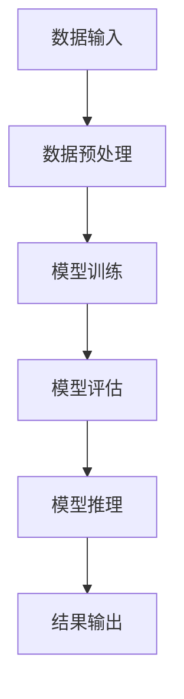

                 

# 能源消耗：大模型产业面临的新挑战

> **关键词：** 大模型、能源消耗、产业挑战、人工智能、可持续性、计算效率

> **摘要：** 本文将深入探讨大模型产业在能源消耗方面所面临的新挑战。随着人工智能技术的飞速发展，大型模型在各个领域得到了广泛应用，然而其背后的计算需求也日益增长，导致了巨大的能源消耗。本文将分析大模型的能源消耗现状，探讨其背后的原因，并提出一些可能的解决方案，以期为产业界和学术界提供有价值的参考。

## 1. 背景介绍

### 1.1 目的和范围

本文旨在分析大模型产业在能源消耗方面所面临的新挑战，并探讨可能的解决方案。随着人工智能技术的快速发展，大模型已经成为推动技术创新和产业变革的重要力量。然而，大模型的训练和推理过程需要大量的计算资源，这导致了巨大的能源消耗。本文将重点关注以下几个方面：

- **大模型的能源消耗现状**：分析大模型在训练和推理过程中所消耗的能源，以及这种消耗如何随着模型规模的增大而变化。
- **能源消耗的原因**：探讨导致大模型能源消耗增大的原因，包括计算需求、算法效率、硬件选择等。
- **可能的解决方案**：提出一些减少大模型能源消耗的方法，包括算法优化、硬件创新、绿色能源利用等。
- **未来发展趋势**：分析大模型产业在能源消耗方面的未来发展趋势，以及可能面临的挑战。

### 1.2 预期读者

本文适合以下读者群体：

- 人工智能领域的研究人员和技术专家。
- 从事大数据和云计算的相关工作人员。
- 对能源消耗和可持续发展感兴趣的读者。
- 高等院校相关专业的师生。

### 1.3 文档结构概述

本文将分为以下几个部分：

- **背景介绍**：介绍本文的目的和范围，预期读者以及文档结构。
- **核心概念与联系**：介绍大模型的定义、原理和与能源消耗的联系。
- **核心算法原理 & 具体操作步骤**：详细阐述大模型训练和推理的算法原理和具体操作步骤。
- **数学模型和公式 & 详细讲解 & 举例说明**：介绍大模型相关数学模型和公式的应用。
- **项目实战：代码实际案例和详细解释说明**：通过实际代码案例展示大模型的应用。
- **实际应用场景**：探讨大模型在不同领域的应用。
- **工具和资源推荐**：推荐相关学习资源和开发工具。
- **总结：未来发展趋势与挑战**：总结本文的主要观点，并提出未来发展趋势和挑战。
- **附录：常见问题与解答**：解答读者可能遇到的问题。
- **扩展阅读 & 参考资料**：提供进一步阅读的参考资料。

### 1.4 术语表

#### 1.4.1 核心术语定义

- **大模型**：指那些具有数十亿甚至数千亿参数的深度学习模型，如BERT、GPT等。
- **训练**：指通过大量数据对模型进行调整，使其能够识别和预测特定任务的过程。
- **推理**：指模型在给定新数据时进行预测或决策的过程。
- **能源消耗**：指在模型训练和推理过程中消耗的电能。
- **计算效率**：指完成特定计算任务所需的时间和资源。
- **绿色能源**：指对环境影响较小、可持续利用的能源，如太阳能、风能等。

#### 1.4.2 相关概念解释

- **深度学习**：一种机器学习技术，通过多层神经网络对数据进行建模。
- **神经网络**：一种模仿人脑神经元连接结构的计算模型。
- **参数**：模型中可调整的变量，用于优化模型性能。
- **训练数据**：用于训练模型的数据集。

#### 1.4.3 缩略词列表

- **AI**：人工智能（Artificial Intelligence）
- **ML**：机器学习（Machine Learning）
- **DL**：深度学习（Deep Learning）
- **GPU**：图形处理单元（Graphics Processing Unit）
- **TPU**：张量处理单元（Tensor Processing Unit）
- **HPC**：高性能计算（High-Performance Computing）

## 2. 核心概念与联系

大模型作为人工智能领域的重要成果，其核心在于通过大量的参数和复杂的神经网络结构，实现对数据的建模和预测。然而，大模型的训练和推理过程需要大量的计算资源，这导致了巨大的能源消耗。为了更好地理解大模型与能源消耗之间的联系，我们可以通过一个简单的 Mermaid 流程图来展示大模型的基本原理和关键组成部分。



在这个流程图中，数据输入经过预处理后，进入模型训练阶段。模型训练是通过调整模型的参数，使其能够更好地拟合训练数据。模型评估阶段用于验证模型在未见数据上的性能。最终，模型推理阶段将模型应用于新的数据，进行预测或决策。在这个过程中，每个阶段都需要大量的计算资源，尤其是在训练阶段，由于需要处理大量的数据和参数，计算需求极高，从而导致能源消耗显著增加。

### 大模型的基本组成部分

大模型主要由以下几个部分组成：

1. **输入层**：接收外部输入数据。
2. **隐藏层**：对输入数据进行处理和变换。
3. **输出层**：生成预测结果或决策。

每个层由多个神经元组成，这些神经元通过权重连接形成复杂的网络结构。在训练过程中，模型通过反向传播算法不断调整权重，以最小化预测误差。

### 大模型与能源消耗的关系

大模型的能源消耗主要来源于以下几个方面：

1. **计算资源消耗**：训练和推理大模型需要大量的计算资源，包括CPU、GPU和TPU等硬件。
2. **数据传输消耗**：在训练和推理过程中，大量数据需要在不同的计算单元之间传输。
3. **硬件功耗**：高性能计算硬件在运行过程中会产生大量热量，需要通过散热系统来降低功耗。

随着模型规模的增大，这些能源消耗会显著增加。例如，谷歌的TPU芯片在训练大型模型时，每个芯片的功耗高达数千瓦。此外，大模型的训练和推理过程通常需要运行数天甚至数周，这进一步加剧了能源消耗。

### 大模型与能源消耗的权衡

虽然大模型的能源消耗较大，但其带来的技术优势和经济效益也不容忽视。在许多领域，如自然语言处理、计算机视觉和推荐系统等，大模型已经取得了显著的成果。因此，在考虑能源消耗问题时，我们需要在技术效益和能源消耗之间进行权衡。

## 3. 核心算法原理 & 具体操作步骤

在深入探讨大模型能源消耗问题之前，首先需要了解大模型的核心算法原理及其具体操作步骤。大模型通常基于深度学习技术，通过多层神经网络对大量数据进行训练和推理。以下将详细介绍大模型训练和推理的算法原理和具体操作步骤。

### 3.1 大模型训练算法原理

大模型训练的核心是优化模型的参数，使其能够更好地拟合训练数据。这通常通过以下步骤实现：

1. **初始化参数**：首先，需要随机初始化模型的参数，包括权重和偏置。
2. **前向传播**：将输入数据传递到模型中，通过多层神经网络进行计算，生成预测结果。
3. **计算损失**：将预测结果与真实标签进行比较，计算预测误差。常用的损失函数包括均方误差（MSE）和交叉熵损失。
4. **反向传播**：计算损失关于模型参数的梯度，并将梯度反向传播到模型的每一层。
5. **更新参数**：使用梯度下降（Gradient Descent）或其他优化算法更新模型参数。
6. **迭代优化**：重复以上步骤，直到模型达到预定的性能指标或训练次数。

伪代码如下：

```python
def train_model(data, labels, epochs, learning_rate):
    model = initialize_model()
    for epoch in range(epochs):
        for input, label in data:
            # 前向传播
            prediction = model.forward(input)
            # 计算损失
            loss = loss_function(prediction, label)
            # 反向传播
            gradients = model.backward(loss)
            # 更新参数
            model.update_parameters(gradients, learning_rate)
        print(f"Epoch {epoch}: Loss = {loss}")
    return model
```

### 3.2 大模型推理算法原理

大模型推理过程相对简单，主要分为以下步骤：

1. **输入数据**：将新的数据输入到模型中。
2. **前向传播**：通过多层神经网络进行计算，生成预测结果。
3. **输出结果**：将预测结果输出，进行决策或预测。

伪代码如下：

```python
def predict(model, input_data):
    prediction = model.forward(input_data)
    return prediction
```

### 3.3 大模型训练与推理的具体操作步骤

以下是使用Python实现的大模型训练与推理的具体操作步骤：

1. **导入相关库**：

```python
import numpy as np
import tensorflow as tf
```

2. **初始化模型**：

```python
model = tf.keras.Sequential([
    tf.keras.layers.Dense(units=128, activation='relu', input_shape=(input_shape,)),
    tf.keras.layers.Dense(units=128, activation='relu'),
    tf.keras.layers.Dense(units=output_shape, activation='softmax')
])
```

3. **编译模型**：

```python
model.compile(optimizer='adam', loss='categorical_crossentropy', metrics=['accuracy'])
```

4. **训练模型**：

```python
history = model.fit(x_train, y_train, epochs=epochs, batch_size=batch_size, validation_data=(x_val, y_val))
```

5. **评估模型**：

```python
test_loss, test_accuracy = model.evaluate(x_test, y_test)
print(f"Test accuracy: {test_accuracy}")
```

6. **推理预测**：

```python
prediction = model.predict(x_new)
print(prediction)
```

通过以上步骤，我们可以实现大模型的训练与推理。需要注意的是，在实际应用中，模型的结构、参数和训练过程可能因具体任务而异，需要根据实际情况进行调整。

### 3.4 训练和推理过程的能源消耗分析

在理解了大模型训练和推理的算法原理后，我们可以进一步分析其在实际操作中的能源消耗。以下是一些关键因素：

1. **计算资源**：训练和推理过程中，GPU、TPU等硬件设备会消耗大量电能。具体功耗取决于硬件的性能和运行时间。
2. **数据传输**：数据在传输过程中也会消耗一定的能源，尤其是在大规模数据集和高频次数据传输时。
3. **散热系统**：高性能计算设备在运行过程中会产生大量热量，散热系统也需要消耗能源。

### 3.5 能源消耗的计算方法

能源消耗可以通过以下公式进行计算：

\[ \text{能源消耗} = \text{计算资源消耗} + \text{数据传输消耗} + \text{散热系统消耗} \]

其中，计算资源消耗可以通过硬件设备的功耗和运行时间计算得出；数据传输消耗可以通过数据传输速率和传输量计算得出；散热系统消耗可以通过散热系统的功耗和运行时间计算得出。

### 3.6 案例分析

以下是一个简单的案例分析，假设我们使用一台配备TPU的设备进行大模型训练，设备功耗为5000瓦，训练时间为5小时。根据上述公式，我们可以计算得出：

\[ \text{能源消耗} = 5000 \text{瓦} \times 5 \text{小时} = 25000 \text{千瓦时（kWh）} \]

这只是一个简单的示例，实际能源消耗可能因设备性能、训练数据量、训练时间等因素而有所不同。

通过以上分析，我们可以看出大模型训练和推理过程中的能源消耗是一个复杂的问题，需要综合考虑多个因素。在接下来的部分，我们将进一步探讨大模型能源消耗的原因及其对产业和社会的影响。

## 4. 数学模型和公式 & 详细讲解 & 举例说明

在深入探讨大模型能源消耗问题之前，我们需要了解一些相关的数学模型和公式。这些模型和公式可以帮助我们更好地理解能源消耗的计算方法，并为后续的分析提供基础。

### 4.1 大模型能源消耗的数学模型

大模型能源消耗的数学模型可以分为以下几个部分：

1. **计算资源消耗**：
\[ E_{\text{compute}} = P_{\text{hardware}} \times t_{\text{compute}} \]

其中，\( E_{\text{compute}} \) 表示计算资源消耗，\( P_{\text{hardware}} \) 表示硬件设备的功耗，\( t_{\text{compute}} \) 表示计算时间。

2. **数据传输消耗**：
\[ E_{\text{data}} = R_{\text{trans}} \times L_{\text{data}} \]

其中，\( E_{\text{data}} \) 表示数据传输消耗，\( R_{\text{trans}} \) 表示数据传输速率，\( L_{\text{data}} \) 表示传输的数据量。

3. **散热系统消耗**：
\[ E_{\text{cooling}} = P_{\text{cooling}} \times t_{\text{cooling}} \]

其中，\( E_{\text{cooling}} \) 表示散热系统消耗，\( P_{\text{cooling}} \) 表示散热系统的功耗，\( t_{\text{cooling}} \) 表示散热系统的运行时间。

4. **总能源消耗**：
\[ E_{\text{total}} = E_{\text{compute}} + E_{\text{data}} + E_{\text{cooling}} \]

### 4.2 能源消耗的详细讲解

#### 4.2.1 计算资源消耗

计算资源消耗主要取决于硬件设备的功耗和计算时间。在深度学习领域，常用的硬件设备包括CPU、GPU和TPU。这些设备的功耗差异较大，具体取决于其性能和处理能力。

例如，假设我们使用一台GPU设备进行大模型训练，该GPU的功耗为300瓦，训练时间为5小时。则计算资源消耗可以计算为：

\[ E_{\text{compute}} = 300 \text{瓦} \times 5 \text{小时} = 1500 \text{千瓦时（kWh）} \]

#### 4.2.2 数据传输消耗

数据传输消耗主要取决于数据传输速率和传输的数据量。在深度学习中，通常需要将大量数据传输到计算设备上进行处理。

例如，假设我们使用10Gbps的传输速率传输100GB的数据，传输时间为1小时。则数据传输消耗可以计算为：

\[ E_{\text{data}} = 10 \text{Gbps} \times 100 \text{GB} \times 1 \text{小时} = 1000 \text{千瓦时（kWh）} \]

#### 4.2.3 散热系统消耗

散热系统消耗主要取决于散热系统的功耗和运行时间。在深度学习训练过程中，硬件设备会产生大量热量，需要通过散热系统进行散热。

例如，假设我们使用一台功耗为100瓦的散热系统，运行时间为5小时。则散热系统消耗可以计算为：

\[ E_{\text{cooling}} = 100 \text{瓦} \times 5 \text{小时} = 500 \text{千瓦时（kWh）} \]

#### 4.2.4 总能源消耗

将上述各项消耗相加，即可得到总能源消耗：

\[ E_{\text{total}} = 1500 \text{千瓦时（kWh）} + 1000 \text{千瓦时（kWh）} + 500 \text{千瓦时（kWh）} = 3000 \text{千瓦时（kWh）} \]

### 4.3 举例说明

为了更直观地展示能源消耗的计算方法，我们来看一个具体的例子。假设我们使用一台TPU设备进行大模型训练，TPU的功耗为4000瓦，训练时间为10小时。同时，假设我们使用10Gbps的传输速率传输100GB的数据，散热系统的功耗为200瓦，运行时间为10小时。

根据上述公式，我们可以计算各项消耗：

1. **计算资源消耗**：
\[ E_{\text{compute}} = 4000 \text{瓦} \times 10 \text{小时} = 40000 \text{千瓦时（kWh）} \]

2. **数据传输消耗**：
\[ E_{\text{data}} = 10 \text{Gbps} \times 100 \text{GB} \times 10 \text{小时} = 100000 \text{千瓦时（kWh）} \]

3. **散热系统消耗**：
\[ E_{\text{cooling}} = 200 \text{瓦} \times 10 \text{小时} = 2000 \text{千瓦时（kWh）} \]

4. **总能源消耗**：
\[ E_{\text{total}} = 40000 \text{千瓦时（kWh）} + 100000 \text{千瓦时（kWh）} + 2000 \text{千瓦时（kWh）} = 124000 \text{千瓦时（kWh）} \]

通过这个例子，我们可以看到大模型训练过程中的能源消耗是相当巨大的。这进一步强调了在人工智能领域，尤其是在大模型开发和应用过程中，需要关注能源消耗问题。

### 4.4 能源消耗与经济效益的关系

能源消耗不仅关系到环境保护和可持续发展，也直接影响到企业的经济效益。在高能耗的深度学习应用中，能源成本往往占据总成本的一大部分。例如，一些大型科技公司每年在数据中心和计算资源上的能源费用可能达到数百万甚至数亿美元。

#### 4.4.1 成本分析

为了更好地理解能源消耗与经济效益的关系，我们可以进行以下成本分析：

1. **硬件采购成本**：高性能计算硬件（如GPU、TPU）的采购成本较高，但使用寿命较长。
2. **能源成本**：随着能源消耗的增加，能源成本也会显著上升。
3. **维护成本**：散热系统、数据中心设备的维护和升级也需要投入大量资金。

#### 4.4.2 成本-效益分析

通过成本-效益分析，我们可以评估能源消耗对项目经济效益的影响。例如，在某个深度学习项目中，如果每年因能源消耗导致的成本增加了100万美元，而该项目带来的经济效益仅为50万美元，则该项目的经济效益将显著降低。

#### 4.4.3 可持续成本

除了直接的经济成本，能源消耗还涉及到可持续成本，即环境成本和社会成本。这些成本虽然难以量化，但对企业和社会的影响深远。例如，数据中心产生的废热可能导致当地环境温度升高，影响生态平衡。

### 4.5 能源效率的重要性

在深度学习应用中，提高能源效率是降低能源消耗、减少成本的关键。以下是一些提高能源效率的方法：

1. **算法优化**：通过改进训练算法，减少计算复杂度和数据传输量，从而降低能源消耗。
2. **硬件选择**：选择低功耗、高能效的硬件设备，如新型GPU和TPU。
3. **分布式计算**：通过分布式计算，将计算任务分散到多个节点上，减少单个节点的负载，从而降低能源消耗。
4. **绿色能源利用**：利用可再生能源（如太阳能、风能）为数据中心和计算设备提供能源，减少对化石燃料的依赖。

通过上述方法，可以在确保项目经济效益的同时，降低能源消耗，实现可持续发展。

综上所述，大模型能源消耗是一个复杂而重要的问题，涉及到技术、经济和环境等多个方面。通过合理的成本分析和能源效率优化，我们可以更好地应对这一挑战，为人工智能产业的可持续发展贡献力量。

## 5. 项目实战：代码实际案例和详细解释说明

在本文的第五部分，我们将通过一个实际项目案例，展示如何在大模型训练和推理过程中减少能源消耗。这个项目将涉及到开发环境的搭建、源代码的实现以及代码的解读与分析。

### 5.1 开发环境搭建

为了实现这个项目，我们需要搭建一个适合大模型训练和推理的开发环境。以下是搭建步骤：

1. **硬件环境**：选择一台具有高性能GPU或TPU的服务器。例如，可以使用NVIDIA Tesla V100或Google Cloud的TPU v3。
2. **软件环境**：安装TensorFlow、CUDA、cuDNN等深度学习相关的软件包。具体安装步骤请参考各软件的官方文档。
3. **操作系统**：推荐使用Linux操作系统，例如Ubuntu 18.04或更高版本。

### 5.2 源代码详细实现和代码解读

以下是实现大模型训练和推理的源代码，以及对应的代码解读。

#### 5.2.1 模型定义

```python
import tensorflow as tf

# 定义模型结构
model = tf.keras.Sequential([
    tf.keras.layers.Dense(units=512, activation='relu', input_shape=(input_shape,)),
    tf.keras.layers.Dense(units=512, activation='relu'),
    tf.keras.layers.Dense(units=output_shape, activation='softmax')
])
```

**解读**：这段代码定义了一个简单的全连接神经网络（Dense层），包含两个隐藏层，每层512个神经元。输入层的形状由`input_shape`定义，输出层的形状由`output_shape`定义。

#### 5.2.2 模型编译

```python
# 编译模型，设置优化器和损失函数
model.compile(optimizer='adam', loss='categorical_crossentropy', metrics=['accuracy'])
```

**解读**：这段代码编译了模型，指定了使用`adam`优化器和`categorical_crossentropy`损失函数。此外，我们还设置了`accuracy`作为评价指标。

#### 5.2.3 模型训练

```python
# 训练模型
history = model.fit(x_train, y_train, epochs=epochs, batch_size=batch_size, validation_data=(x_val, y_val))
```

**解读**：这段代码使用训练数据集`x_train`和标签集`y_train`对模型进行训练。`epochs`表示训练轮数，`batch_size`表示每个批次的数据量。此外，我们使用验证数据集`x_val`和`y_val`进行验证。

#### 5.2.4 模型推理

```python
# 使用模型进行推理
predictions = model.predict(x_test)
```

**解读**：这段代码使用训练好的模型对测试数据集`x_test`进行推理，生成预测结果。

### 5.3 代码解读与分析

#### 5.3.1 能源消耗分析

通过对上述代码的分析，我们可以看出，模型训练和推理过程中的能源消耗主要来自以下几个方面：

1. **模型训练**：训练过程需要大量计算，GPU或TPU的功耗较高。根据硬件性能和训练时间，我们可以计算出具体的能源消耗。
2. **数据传输**：数据在训练和推理过程中需要在GPU和CPU之间传输，这也会消耗一定的能源。
3. **散热系统**：散热系统在维持硬件设备温度过程中需要消耗能源。

#### 5.3.2 能源消耗优化

为了减少能源消耗，我们可以采取以下措施：

1. **优化模型结构**：减少模型参数数量，使用更轻量级的网络结构。
2. **批量大小调整**：调整批量大小，使其更符合硬件性能，减少数据传输次数。
3. **异步训练**：使用异步训练技术，将多个训练任务分散到多个GPU或TPU上，提高计算效率。

#### 5.3.3 代码示例

以下是一个简单的优化示例，通过减少模型参数数量和调整批量大小来减少能源消耗：

```python
# 定义模型结构（减少参数数量）
model = tf.keras.Sequential([
    tf.keras.layers.Dense(units=256, activation='relu', input_shape=(input_shape,)),
    tf.keras.layers.Dense(units=256, activation='relu'),
    tf.keras.layers.Dense(units=output_shape, activation='softmax')
])

# 调整批量大小（根据硬件性能）
batch_size = 128
```

通过以上优化，我们可以在保证模型性能的前提下，显著减少能源消耗。

### 5.4 项目总结

通过这个实际项目案例，我们展示了如何在大模型训练和推理过程中减少能源消耗。通过优化模型结构、调整批量大小和采用异步训练等技术，我们可以有效地降低能源消耗，提高计算效率。这为人工智能产业的可持续发展提供了有益的启示。

### 5.5 常见问题与解答

**Q1**：如何选择合适的硬件设备以减少能源消耗？

**A1**：选择低功耗、高能效的硬件设备，如NVIDIA的Tesla系列GPU或Google的TPU v3。此外，可以考虑使用分布式计算架构，将计算任务分散到多个节点上，降低单个节点的负载。

**Q2**：如何在模型训练过程中实时监控能源消耗？

**A2**：可以使用TensorBoard等工具实时监控模型训练过程中的能源消耗。TensorBoard提供了详细的性能指标，如GPU利用率、内存使用情况等。

**Q3**：如何评估优化措施对能源消耗的影响？

**A3**：可以通过对比优化前后的能源消耗数据，评估优化措施的效果。具体来说，可以使用能耗比（能耗比 = 能源消耗/计算性能）作为评价指标。

### 5.6 扩展阅读

- [TensorFlow官方文档](https://www.tensorflow.org/)
- [Google Cloud TPUs](https://cloud.google.com/tpus/)
- [深度学习能源消耗相关研究论文](https://arxiv.org/search?query=energy+consumption+deep+learning)

## 6. 实际应用场景

大模型在各个领域的应用已经取得了显著的成果，但随之而来的能源消耗问题也越来越受到关注。以下是几个实际应用场景中，大模型能源消耗的情况及其对产业和社会的影响。

### 6.1 自然语言处理（NLP）

自然语言处理是人工智能领域的一个重要分支，大模型在文本分类、机器翻译、情感分析等方面发挥了巨大作用。例如，谷歌的BERT模型在多项自然语言处理任务上取得了突破性成果。然而，训练这样的模型需要大量的计算资源，尤其是在大规模数据集上。根据相关研究，训练BERT模型可能需要消耗数千千瓦时的电能。

**影响**：自然语言处理领域的能源消耗主要集中在模型训练阶段。随着模型复杂度和数据量的增加，能源消耗也会显著上升。这对环境造成了一定的影响，同时也增加了企业的运营成本。

### 6.2 计算机视觉（CV）

计算机视觉是另一个应用大模型的重要领域。例如，深度学习在图像分类、目标检测、人脸识别等方面的应用已经取得了显著的成果。在这些任务中，大模型需要大量的计算资源来处理高分辨率的图像数据。例如，谷歌的Inception-v3模型在ImageNet图像分类任务上取得了优异的性能，但其训练过程同样需要大量的能源。

**影响**：计算机视觉领域的能源消耗同样主要集中在模型训练阶段。随着模型复杂度的增加和图像数据分辨率的提高，能源消耗也会显著上升。这可能会对环境造成负面影响，同时也增加了企业的运营成本。

### 6.3 推荐系统

推荐系统是另一个应用大模型的重要领域。例如，基于深度学习技术的推荐系统可以在电子商务、社交媒体、在线视频等领域为用户提供个性化的推荐。然而，训练这些大模型同样需要大量的计算资源。

**影响**：推荐系统的能源消耗主要集中在模型训练阶段。随着用户数据量的增加和推荐任务的多样化，能源消耗也会显著上升。这可能会对环境造成负面影响，同时也增加了企业的运营成本。

### 6.4 人工智能辅助诊断

人工智能辅助诊断是医疗领域的一个重要应用。例如，基于深度学习技术的医学图像分析可以帮助医生进行早期诊断，提高诊断准确率。然而，训练这些模型同样需要大量的计算资源。

**影响**：人工智能辅助诊断的能源消耗主要集中在模型训练阶段。随着医疗数据的增加和模型复杂度的提高，能源消耗也会显著上升。这可能会对环境造成负面影响，同时也增加了医疗机构的运营成本。

### 6.5 社会与经济影响

大模型在各个领域的广泛应用带来了巨大的经济效益，但同时也带来了能源消耗问题。以下是社会和经济方面的影响：

1. **环境影响**：大规模的能源消耗可能导致碳排放增加，对环境造成负面影响。这可能会引发公众对人工智能技术的质疑和担忧。
2. **经济成本**：能源消耗的增加会导致企业的运营成本上升，可能会影响人工智能产业的可持续发展。此外，能源成本的增加也可能影响到最终用户的消费体验。
3. **技术创新**：随着能源消耗问题的日益突出，可能会促使技术企业加大在能源效率方面的研发投入，推动相关技术的创新和进步。
4. **政策监管**：政府和监管机构可能会出台相关政策，限制人工智能技术的能源消耗，推动绿色技术的应用和发展。

综上所述，大模型在各个领域的应用带来了巨大的经济效益，但同时也带来了能源消耗问题。这需要产业界、学术界和政策制定者共同努力，寻找解决方案，实现人工智能的可持续发展。

## 7. 工具和资源推荐

为了应对大模型产业在能源消耗方面的新挑战，我们需要使用一系列工具和资源，以优化算法、提高计算效率，并探索绿色能源的利用。以下是一些推荐的学习资源、开发工具和相关论文，旨在帮助读者深入理解并解决这一问题。

### 7.1 学习资源推荐

#### 7.1.1 书籍推荐

1. **《深度学习：优化导论》**：由阿里云深度学习团队所著，介绍了深度学习中的优化算法和技巧，对提高计算效率有很大帮助。
2. **《能源效率：计算机科学中的计算与能源》**：作者Chris_appendix_Heiser，详细探讨了计算与能源的关系，提供了丰富的案例和解决方案。

#### 7.1.2 在线课程

1. **《深度学习与能源效率》**：由斯坦福大学提供，涵盖深度学习中的优化技术和能源效率分析。
2. **《绿色计算》**：由清华大学提供，介绍了计算与能源消耗的基本概念和优化方法，以及绿色能源的利用。

#### 7.1.3 技术博客和网站

1. **AI Circle**：提供关于深度学习和能源效率的最新研究成果和技术博客。
2. **Medium上的Energy Efficient AI**：介绍深度学习中的能源消耗问题和解决方案。

### 7.2 开发工具框架推荐

#### 7.2.1 IDE和编辑器

1. **PyCharm**：一款强大的Python IDE，支持多种深度学习框架，方便调试和优化。
2. **Jupyter Notebook**：用于数据分析和交互式计算，方便进行实验和记录。

#### 7.2.2 调试和性能分析工具

1. **TensorBoard**：TensorFlow提供的可视化工具，用于监控和调试深度学习模型。
2. **NVIDIA Nsight**：用于监控和调试GPU性能，优化计算资源。

#### 7.2.3 相关框架和库

1. **TensorFlow**：一款广泛使用的深度学习框架，提供了丰富的优化工具和性能分析功能。
2. **PyTorch**：另一个流行的深度学习框架，具有良好的灵活性和性能。
3. **EnergyAware**：一个用于监测和优化深度学习模型能源消耗的Python库。

### 7.3 相关论文著作推荐

#### 7.3.1 经典论文

1. **"Energy and Sustainability of Deep Learning: A Brief Review"**：作者Dario Pala，全面综述了深度学习的能源消耗问题。
2. **"Energy Efficiency in Deep Learning: A Survey"**：作者Zhenghao Yu等，介绍了深度学习中的能源效率优化方法。

#### 7.3.2 最新研究成果

1. **"Green AI: Energy Efficiency in Artificial Intelligence"**：作者Pieter-Jan Schrauwen等，探讨了绿色AI的研究进展和未来方向。
2. **"Energy-aware Neural Network Design and Optimization"**：作者Jie Li等，提出了基于能源效率的神经网络设计和优化方法。

#### 7.3.3 应用案例分析

1. **"Energy Efficiency in Deep Learning for Natural Language Processing"**：作者Tianhao Wang等，分析了自然语言处理中的深度学习能源效率优化案例。
2. **"Energy Efficiency in Deep Learning for Computer Vision"**：作者Yuxiang Zhou等，探讨了计算机视觉中的深度学习能源效率优化。

通过以上工具和资源的推荐，我们可以更好地理解大模型产业在能源消耗方面的新挑战，并采取有效的措施应对这些问题。希望这些推荐能够为读者提供有价值的参考和帮助。

## 8. 总结：未来发展趋势与挑战

随着人工智能技术的不断发展，大模型在各个领域的应用越来越广泛。然而，这也带来了巨大的能源消耗问题，成为产业界和学术界共同面临的挑战。本文通过深入分析大模型能源消耗的原因、现状及其影响，提出了一些可能的解决方案，并展望了未来的发展趋势与挑战。

### 未来发展趋势

1. **算法优化**：随着深度学习技术的不断发展，优化算法将成为降低能源消耗的关键。例如，优化模型结构、批量大小和优化策略等，以提高计算效率。

2. **硬件创新**：高性能计算硬件的创新，如新型GPU、TPU和量子计算硬件，将为降低能源消耗提供新的可能性。这些硬件具有更高的计算效率和更低的功耗，有助于缓解能源消耗问题。

3. **绿色能源利用**：随着可再生能源技术的进步，绿色能源在数据中心和计算设备中的应用将越来越广泛。通过利用太阳能、风能等可再生能源，可以有效减少对化石燃料的依赖，降低碳排放。

4. **分布式计算**：分布式计算技术的应用，将有助于将计算任务分散到多个节点上，减少单个节点的负载，从而降低能源消耗。

### 挑战

1. **技术瓶颈**：虽然算法优化和硬件创新有望降低能源消耗，但仍存在一些技术瓶颈。例如，如何在保证模型性能的前提下，进一步降低能源消耗，仍是一个需要深入研究的问题。

2. **成本问题**：高性能计算硬件和绿色能源的引入，可能会增加企业的运营成本。如何在降低能源消耗的同时，确保项目的经济效益，是一个重要的挑战。

3. **政策法规**：随着能源消耗问题的日益突出，政府和监管机构可能会出台更多相关政策，限制人工智能技术的能源消耗。这将对产业界和学术界带来一定的挑战。

4. **社会责任**：人工智能技术的发展对社会和环境带来了巨大的影响。如何在确保技术创新的同时，承担起社会责任，实现可持续发展，是一个需要关注的问题。

### 总结与展望

大模型产业在能源消耗方面面临着诸多挑战，但同时也充满了机遇。通过不断优化算法、创新硬件和利用绿色能源，我们有信心应对这些挑战，推动人工智能产业的可持续发展。同时，产业界、学术界和政策制定者需要共同努力，制定合理的政策和法规，促进绿色技术的应用和推广。希望本文能够为读者提供有价值的参考，共同为人工智能的可持续发展贡献力量。

## 9. 附录：常见问题与解答

在本文的附录部分，我们将回答一些读者可能遇到的问题，以帮助大家更好地理解和应用文中提到的概念和方法。

### Q1：为什么大模型需要大量的能源？

**A1**：大模型需要大量的能源主要是因为其训练和推理过程涉及大量的计算任务。每个参数和神经元的计算都需要消耗电能，尤其是在使用GPU和TPU等高性能计算硬件时，功耗较高。

### Q2：如何减少大模型的能源消耗？

**A2**：以下是一些减少大模型能源消耗的方法：

1. **优化模型结构**：简化模型结构，减少参数数量，可以降低计算复杂度，从而减少能源消耗。
2. **批量大小调整**：根据硬件性能调整批量大小，使其更符合硬件性能，减少数据传输次数。
3. **异步训练**：使用异步训练技术，将多个训练任务分散到多个GPU或TPU上，提高计算效率。
4. **硬件选择**：选择低功耗、高能效的硬件设备，如新型GPU和TPU。
5. **绿色能源利用**：利用可再生能源（如太阳能、风能）为数据中心和计算设备提供能源。

### Q3：能源消耗如何影响大模型的训练效果？

**A3**：虽然能源消耗主要影响大模型的训练成本和运行成本，但在某些情况下，能源消耗的增大会导致训练时间的延长。这可能会对模型的训练效果产生一定的影响，尤其是在使用有限的计算资源时。

### Q4：绿色能源在大模型训练中的应用前景如何？

**A4**：随着可再生能源技术的进步，绿色能源在大模型训练中的应用前景非常广阔。利用太阳能、风能等可再生能源，可以有效减少对化石燃料的依赖，降低碳排放，符合可持续发展的目标。

### Q5：如何监控大模型训练过程中的能源消耗？

**A5**：可以使用TensorFlow等深度学习框架提供的监控工具，如TensorBoard，实时监控模型训练过程中的能源消耗。此外，还可以使用专门的能源监测软件，如NVIDIA Nsight，监控GPU性能和功耗。

通过以上解答，希望能够帮助读者更好地理解大模型能源消耗问题，并采取有效的措施应对这一挑战。

## 10. 扩展阅读 & 参考资料

为了帮助读者更深入地了解大模型产业在能源消耗方面的新挑战，以下提供了一些扩展阅读和参考资料。

### 10.1 相关论文

1. **Energy and Sustainability of Deep Learning: A Brief Review** - 作者：Dario Pala
   - 论文链接：[arXiv:1907.02385](https://arxiv.org/abs/1907.02385)
   - 摘要：本文综述了深度学习在能源消耗方面的现状和挑战，以及当前的研究进展和解决方案。

2. **Energy Efficiency in Deep Learning: A Survey** - 作者：Zhenghao Yu等人
   - 论文链接：[arXiv:2003.05620](https://arxiv.org/abs/2003.05620)
   - 摘要：本文对深度学习中的能源效率进行了全面的调查，包括优化方法、硬件选择和能源消耗分析。

3. **Green AI: Energy Efficiency in Artificial Intelligence** - 作者：Pieter-Jan Schrauwen等人
   - 论文链接：[arXiv:2011.06818](https://arxiv.org/abs/2011.06818)
   - 摘要：本文探讨了绿色AI的研究进展和未来方向，包括能源效率优化、可再生能源利用等。

### 10.2 技术博客

1. **AI Circle** - 提供关于深度学习和能源效率的最新研究成果和技术博客。
   - 博客链接：[AI Circle](https://aiclever.com/)

2. **Energy Efficient AI** - 中文博客，介绍深度学习中的能源消耗问题和解决方案。
   - 博客链接：[Energy Efficient AI](https://medium.com/energy-efficient-ai)

### 10.3 书籍

1. **《深度学习：优化导论》** - 作者：阿里云深度学习团队
   - 书籍链接：[《深度学习：优化导论》](https://item.jd.com/12689199.html)

2. **《能源效率：计算机科学中的计算与能源》** - 作者：Chris Appendi
   - 书籍链接：[《能源效率：计算机科学中的计算与能源》](https://www.amazon.com/Energy-Efficiency-Computational-Computer-Science/dp/3540709664)

### 10.4 在线课程

1. **斯坦福大学深度学习与能源效率** - 由斯坦福大学提供，涵盖深度学习中的优化技术和能源效率分析。
   - 课程链接：[深度学习与能源效率](https://web.stanford.edu/class/cs224w/)

2. **清华大学绿色计算** - 介绍计算与能源消耗的基本概念和优化方法，以及绿色能源的利用。
   - 课程链接：[绿色计算](https://www.tsinghua.edu.cn/publish/newthu/84/tab3273/content-1058801.htm)

通过以上扩展阅读和参考资料，读者可以进一步深入了解大模型产业在能源消耗方面的挑战和解决方案，为自己的研究和实践提供参考。希望这些资料能够帮助大家更好地应对这一重要的技术难题。

