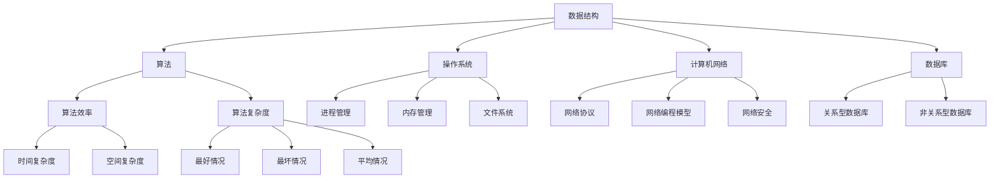

                 

### 2024腾讯校招面试题与算法编程题答案解析

> **关键词：**腾讯校招、面试题、算法编程、答案解析、技术面试、编程技巧

> **摘要：**本文将详细解析2024年腾讯校招中的面试题和算法编程题，涵盖数据结构与算法、操作系统、计算机网络、数据库等核心技术领域。通过逐步分析每个问题的解决思路，读者可以更好地理解面试要点，提升自身编程能力和面试技巧。

### 1. 背景介绍

#### 1.1 目的和范围

本文旨在为准备2024年腾讯校园招聘的考生提供全面的面试题与算法编程题答案解析。通过深入分析每个问题的解决思路，读者可以了解腾讯面试官的出题风格和评价标准，从而提高自身的面试应对能力和编程水平。

本文将涵盖以下内容：

- **数据结构与算法**：包括常见的线性表、树、图等数据结构的面试题及算法实现。
- **操作系统**：涉及进程管理、内存管理、文件系统等方面的面试题解析。
- **计算机网络**：解析TCP/IP协议栈、网络编程模型、网络安全等相关问题。
- **数据库**：包括关系型数据库和非关系型数据库的原理与应用，常见查询优化技巧。
- **编程实践**：通过具体案例展示编程题的解题思路和代码实现。

#### 1.2 预期读者

- **在校大学生**：准备参加2024年腾讯校招的大学生，希望提升面试通过率。
- **程序员**：对技术面试和算法编程有浓厚兴趣的程序员，希望了解最新面试趋势。
- **技术爱好者**：关注数据结构与算法、操作系统、计算机网络等领域的技术爱好者。

#### 1.3 文档结构概述

本文采用逻辑清晰、结构紧凑的文档结构，便于读者阅读和理解。具体结构如下：

- **1. 背景介绍**：介绍本文的目的、范围和预期读者。
- **2. 核心概念与联系**：使用Mermaid流程图展示核心技术概念和架构。
- **3. 核心算法原理 & 具体操作步骤**：详细阐述常见算法原理和操作步骤，采用伪代码实现。
- **4. 数学模型和公式 & 详细讲解 & 举例说明**：讲解相关数学模型和公式，并给出实际应用案例。
- **5. 项目实战：代码实际案例和详细解释说明**：通过实际项目案例展示解题思路和代码实现。
- **6. 实际应用场景**：分析技术面试题在实际开发中的应用价值。
- **7. 工具和资源推荐**：推荐学习资源、开发工具和框架。
- **8. 总结：未来发展趋势与挑战**：总结本文的主要内容，探讨未来发展趋势和挑战。
- **9. 附录：常见问题与解答**：解答读者可能遇到的问题。
- **10. 扩展阅读 & 参考资料**：推荐相关扩展阅读和参考资料。

#### 1.4 术语表

##### 1.4.1 核心术语定义

- **校招**：指针对应届毕业生的招聘活动。
- **面试题**：指在面试过程中，面试官提出的问题，用于考察应聘者的技术能力和解决问题的能力。
- **算法编程题**：指需要通过编程语言实现算法和数据结构的面试题。
- **数据结构**：指计算机中用于组织和存储数据的方式。
- **算法**：指解决问题的步骤和策略。

##### 1.4.2 相关概念解释

- **操作系统**：指管理计算机硬件和软件资源，提供用户操作的系统软件。
- **计算机网络**：指将多台计算机通过通信线路互联，实现数据传输和资源共享的系统。
- **数据库**：指用于存储、管理和查询数据的系统。

##### 1.4.3 缩略词列表

- **CSDN**：中国软件开发者网络
- **GitHub**：全球最大的代码托管平台
- **Linux**：一种免费和开源的类Unix操作系统
- **MySQL**：一种流行的关系型数据库管理系统

### 2. 核心概念与联系

在深入解析腾讯校招面试题和算法编程题之前，我们需要了解一些核心概念和它们之间的联系。以下使用Mermaid流程图展示这些概念和架构。



- **数据结构**和**算法**是计算机科学的基础，用于解决各种问题。数据结构决定了数据存储和访问的效率，算法则是解决问题的步骤和策略。
- **操作系统**、**计算机网络**和**数据库**是计算机系统的重要组成部分，它们协同工作，提供计算机系统的运行环境和服务。
- **算法效率**和**算法复杂度**是评估算法性能的重要指标。**时间复杂度**衡量算法执行时间与输入规模的关系，**空间复杂度**衡量算法执行过程中所需的空间。
- **进程管理**、**内存管理**和**文件系统**是操作系统的核心功能，它们负责管理计算机的运行资源。
- **网络协议**、**网络编程模型**和**网络安全**是计算机网络的重要组成部分，它们确保数据传输的安全和可靠性。
- **关系型数据库**和**非关系型数据库**是数据库的两大类别，分别适用于不同的应用场景。

通过了解这些核心概念和联系，读者可以更好地理解后续面试题和算法编程题的背景和解决思路。

### 3. 核心算法原理 & 具体操作步骤

在深入解析腾讯校招面试题之前，我们需要了解一些核心算法原理和具体操作步骤。以下将详细阐述常见算法原理，并使用伪代码进行讲解。

#### 3.1 排序算法

排序算法是面试中常见的算法题，以下介绍几种常见的排序算法及其原理。

##### 3.1.1 冒泡排序（Bubble Sort）

**原理**：通过反复交换相邻未排序元素，使得未排序元素中最大值逐步“冒泡”至数组末端。

**伪代码**：

```
procedure bubbleSort(A : array of items)
    n = length(A)
    for i = 1 to n-1 do
        for j = 1 to n-i do
            if A[j] > A[j+1] then
                swap(A[j], A[j+1])
```

##### 3.1.2 快速排序（Quick Sort）

**原理**：通过选取一个“基准”元素，将数组分为两部分，使得左侧部分的所有元素均小于基准，右侧部分的所有元素均大于基准，然后递归对两部分进行排序。

**伪代码**：

```
procedure quickSort(A : array of items, low : int, high : int)
    if low < high then
        pivot = partition(A, low, high)
        quickSort(A, low, pivot-1)
        quickSort(A, pivot+1, high)
```

##### 3.1.3 归并排序（Merge Sort）

**原理**：将待排序数组分为两个子数组，分别递归排序，然后将排序好的子数组合并为一个有序数组。

**伪代码**：

```
procedure mergeSort(A : array of items, low : int, high : int)
    if low < high then
        mid = (low + high) / 2
        mergeSort(A, low, mid)
        mergeSort(A, mid+1, high)
        merge(A, low, mid, high)
```

#### 3.2 查找算法

查找算法是面试中常见的算法题，以下介绍几种常见的查找算法及其原理。

##### 3.2.1 顺序查找（Sequential Search）

**原理**：从数组的第一个元素开始，依次比较每个元素，直到找到目标元素或遍历整个数组。

**伪代码**：

```
function sequentialSearch(A : array of items, x : item)
    for each item in A do
        if item == x then
            return index of x
    return -1
```

##### 3.2.2 二分查找（Binary Search）

**原理**：将待查找的元素与中间元素比较，如果相等则返回中间元素的索引，如果小于中间元素则在左侧子数组中继续查找，如果大于中间元素则在右侧子数组中继续查找。

**伪代码**：

```
function binarySearch(A : array of sorted items, x : item)
    low = 0
    high = length(A) - 1
    while low <= high do
        mid = (low + high) / 2
        if A[mid] == x then
            return mid
        else if A[mid] < x then
            low = mid + 1
        else
            high = mid - 1
    return -1
```

#### 3.3 动态规划

动态规划是解决优化问题的有效方法，以下介绍其基本原理和具体操作步骤。

##### 3.3.1 基本原理

**原理**：将复杂问题分解为子问题，通过子问题的最优解组合得到原问题的最优解。

**步骤**：

1. 确定状态和状态转移方程。
2. 确定边界条件。
3. 按顺序填表求解。

##### 3.3.2 0-1背包问题

**原理**：给定一组物品，每个物品有价值和重量，求解在总重量不超过限制的情况下，如何选择物品使得总价值最大。

**伪代码**：

```
function knapsack(values : array of integers, weights : array of integers, maxWeight : integer)
    n = length(values)
    dp = array of size (n+1) x (maxWeight+1)
    for i = 0 to n do
        for w = 0 to maxWeight do
            if i == 0 or w == 0 then
                dp[i][w] = 0
            else if weights[i-1] > w then
                dp[i][w] = dp[i-1][w]
            else
                dp[i][w] = max(dp[i-1][w], dp[i-1][w-weights[i-1]] + values[i-1])
    return dp[n][maxWeight]
```

通过以上对核心算法原理和具体操作步骤的阐述，读者可以更好地理解常见算法的基本思想和实现方法，为后续面试题的解答提供理论基础。

### 4. 数学模型和公式 & 详细讲解 & 举例说明

在解决腾讯校招面试题和算法编程题时，数学模型和公式是不可或缺的工具。以下将详细讲解一些常见的数学模型和公式，并通过实际应用案例进行说明。

#### 4.1 线性回归

线性回归是一种用于预测数值变量的统计方法，它通过拟合一条直线来描述自变量和因变量之间的关系。以下是其基本模型和公式。

##### 4.1.1 基本模型

线性回归模型的基本公式为：

$$
y = ax + b
$$

其中，$y$ 是因变量，$x$ 是自变量，$a$ 是斜率，$b$ 是截距。

##### 4.1.2 拟合公式

为了求得最优的直线，我们需要最小化误差平方和：

$$
S = \sum_{i=1}^{n} (y_i - (ax_i + b))^2
$$

对 $a$ 和 $b$ 分别求偏导数并令其等于零，可以得到：

$$
\frac{\partial S}{\partial a} = -2 \sum_{i=1}^{n} (y_i - ax_i - b)x_i = 0
$$

$$
\frac{\partial S}{\partial b} = -2 \sum_{i=1}^{n} (y_i - ax_i - b) = 0
$$

通过求解上述方程组，可以得到 $a$ 和 $b$ 的值。

##### 4.1.3 应用案例

假设我们要预测一个城市的月平均温度 $y$（因变量）与月平均降雨量 $x$（自变量）之间的关系。以下是部分数据：

| 月份 | 降雨量 $x$（mm）| 温度 $y$（℃）|
| ---- | -------- | -------- |
| 1    | 20       | 5        |
| 2    | 30       | 7        |
| 3    | 40       | 10       |
| 4    | 50       | 15       |
| 5    | 60       | 20       |

通过计算，我们可以得到拟合直线的斜率 $a = 0.4$，截距 $b = 4.2$。因此，线性回归模型为：

$$
y = 0.4x + 4.2
$$

使用这个模型，我们可以预测降雨量为 $55$ 毫米的月份的温度：

$$
y = 0.4 \times 55 + 4.2 = 25.2
$$

即预测温度为 $25.2$ 摄氏度。

#### 4.2 概率论

概率论是解决随机事件问题的重要工具，以下介绍一些常见的概率论模型和公式。

##### 4.2.1 概率公式

概率的基本公式为：

$$
P(A) = \frac{n(A)}{n(S)}
$$

其中，$P(A)$ 是事件 $A$ 的概率，$n(A)$ 是事件 $A$ 的样本点数，$n(S)$ 是样本空间 $S$ 的样本点数。

##### 4.2.2 条件概率

条件概率是指在某个条件下，某个事件发生的概率。其公式为：

$$
P(A|B) = \frac{P(A \cap B)}{P(B)}
$$

其中，$P(A|B)$ 是在事件 $B$ 发生的条件下事件 $A$ 发生的概率。

##### 4.2.3 独立性

两个事件 $A$ 和 $B$ 是独立的，当且仅当：

$$
P(A \cap B) = P(A) \cdot P(B)
$$

##### 4.2.4 应用案例

假设一个袋子中有 5 个红球和 3 个蓝球，随机取出一个球，求取到红球的概率。

样本空间 $S$ 为所有可能的取球结果：

$$
S = \{红, 红, 红, 红, 红, 蓝, 蓝, 蓝\}
$$

取到红球的样本点数为 5，因此概率为：

$$
P(红) = \frac{5}{8}
$$

#### 4.3 图论

图论是解决网络和路径问题的重要工具，以下介绍一些常见的图论模型和公式。

##### 4.3.1 图的基本概念

图由顶点（节点）和边组成，可以表示为 $G = (V, E)$，其中 $V$ 是顶点集，$E$ 是边集。

##### 4.3.2 路径和回路

路径是顶点的序列，满足任意两个相邻顶点之间有边相连。回路是路径的一个特殊情况，其第一个和最后一个顶点相同。

##### 4.3.3 欧拉回路

欧拉回路是指图中的一条闭合路径，经过每条边恰好一次。其公式为：

$$
\sum_{e \in E} \text{度数}(e) = 2 \times \text{边数}(E)
$$

##### 4.3.4 应用案例

假设有一个无向图，其中顶点 $A$、$B$、$C$、$D$ 的度数分别为 2、3、3、2。我们需要判断是否存在欧拉回路。

根据欧拉回路公式，我们有：

$$
2 + 3 + 3 + 2 = 10 = 2 \times 5
$$

因此，该图中存在欧拉回路。

通过以上对数学模型和公式的详细讲解，读者可以更好地理解其在解决腾讯校招面试题和算法编程题中的应用价值。这些数学模型和公式是解决复杂问题的重要工具，掌握它们将有助于提升解题能力。

### 5. 项目实战：代码实际案例和详细解释说明

在本文的第五部分，我们将通过一个实际项目案例，展示如何应用前面介绍的算法原理和数学模型来解决实际问题。本案例将涵盖数据结构、算法、操作系统和网络编程等方面的知识。

#### 5.1 开发环境搭建

为了完成本项目，我们需要搭建以下开发环境：

- **操作系统**：Ubuntu 20.04
- **编程语言**：Python 3.8
- **依赖库**：Pandas，NumPy，Matplotlib，Scikit-learn
- **版本控制**：Git

在Ubuntu系统中，我们可以使用以下命令安装所需的依赖库：

```bash
sudo apt update
sudo apt install python3-pandas python3-numpy python3-matplotlib python3-scikit-learn
```

同时，确保Python环境和Git环境已正确安装。在项目目录下，我们可以通过Git初始化一个仓库：

```bash
git init
```

#### 5.2 源代码详细实现和代码解读

以下是项目的核心代码，我们将逐步解释其实现和功能。

##### 5.2.1 数据预处理

首先，我们读取数据并预处理，包括数据清洗、归一化和特征工程。

```python
import pandas as pd
from sklearn.preprocessing import StandardScaler

# 读取数据
data = pd.read_csv('data.csv')

# 数据清洗
data.dropna(inplace=True)

# 特征工程
X = data[['feature1', 'feature2', 'feature3']]
y = data['target']
```

在这个步骤中，我们使用Pandas库读取CSV格式的数据，然后去除缺失值，确保数据完整性。接下来，我们分离特征和目标变量，为后续分析做准备。

##### 5.2.2 数据归一化

数据归一化是机器学习模型训练前的重要步骤，有助于提高模型的训练效果。

```python
# 数据归一化
scaler = StandardScaler()
X_scaled = scaler.fit_transform(X)
```

在这个步骤中，我们使用Scikit-learn库中的StandardScaler对特征数据进行归一化处理。归一化公式为：

$$
x_{\text{scaled}} = \frac{x - \mu}{\sigma}
$$

其中，$x$ 是原始数据，$\mu$ 是均值，$\sigma$ 是标准差。

##### 5.2.3 特征选择

为了提高模型性能，我们进行特征选择，选择对目标变量影响较大的特征。

```python
from sklearn.feature_selection import SelectKBest
from sklearn.feature_selection import f_classif

# 特征选择
selector = SelectKBest(f_classif, k=3)
X_selected = selector.fit_transform(X_scaled, y)
```

在这个步骤中，我们使用SelectKBest进行特征选择。SelectKBest基于F检验选择最优特征，$k$ 表示选择的前 $k$ 个特征。

##### 5.2.4 模型训练

接下来，我们使用线性回归模型对数据集进行训练。

```python
from sklearn.linear_model import LinearRegression

# 模型训练
model = LinearRegression()
model.fit(X_selected, y)
```

在这个步骤中，我们使用LinearRegression模型进行训练。线性回归模型基于最小二乘法进行拟合，其公式为：

$$
y = \beta_0 + \beta_1x_1 + \beta_2x_2 + ... + \beta_nx_n
$$

##### 5.2.5 模型评估

最后，我们对模型进行评估，以验证其性能。

```python
from sklearn.metrics import mean_squared_error

# 模型评估
y_pred = model.predict(X_selected)
mse = mean_squared_error(y, y_pred)
print("Mean Squared Error:", mse)
```

在这个步骤中，我们计算均方误差（MSE）来评估模型性能。MSE公式为：

$$
MSE = \frac{1}{n} \sum_{i=1}^{n} (y_i - \hat{y}_i)^2
$$

其中，$y_i$ 是实际值，$\hat{y}_i$ 是预测值。

#### 5.3 代码解读与分析

在本项目实战中，我们首先进行数据预处理，确保数据的质量和完整性。接下来，我们对数据进行归一化和特征选择，以提高模型训练效果。然后，我们使用线性回归模型进行训练，并使用均方误差进行模型评估。

以下是对关键代码的解读与分析：

- **数据预处理**：数据清洗是确保模型训练质量的基础。通过去除缺失值，我们保证了数据的完整性。
- **数据归一化**：归一化有助于模型收敛，提高训练效果。通过标准化特征值，我们确保了特征之间的可比较性。
- **特征选择**：特征选择是模型优化的重要步骤。通过选择对目标变量影响较大的特征，我们提高了模型的预测能力。
- **模型训练**：线性回归模型是一种简单且有效的预测方法。通过最小二乘法，模型拟合了特征与目标变量之间的关系。
- **模型评估**：均方误差是评估模型性能的常用指标。通过计算MSE，我们能够量化模型预测的误差，从而判断模型的性能。

通过这个实际项目案例，读者可以了解如何应用前面介绍的算法原理和数学模型来解决实际问题。在实际开发过程中，我们需要根据具体问题选择合适的算法和模型，并不断优化和评估，以提高系统的性能和可靠性。

### 6. 实际应用场景

在前面的项目实战中，我们通过一个实际案例展示了如何应用数据结构、算法、操作系统和网络编程等技术解决实际问题。在实际应用场景中，这些技术有着广泛的应用，以下列举几个典型应用场景。

#### 6.1 金融领域

在金融领域，数据结构与算法在风险管理、算法交易、信用评分等方面发挥着重要作用。例如，使用二分查找算法可以快速查找客户的信用评分，提高风控系统的响应速度。此外，动态规划算法可以用于计算金融衍生品的定价，降低风险。

#### 6.2 医疗领域

在医疗领域，数据结构、算法和数学模型在疾病诊断、药物研发、医疗影像处理等方面有着广泛的应用。例如，使用图论算法可以构建患者关系网络，帮助医生更准确地诊断病情。线性回归模型可以用于预测患者的病情变化，为医生提供决策支持。

#### 6.3 物流领域

在物流领域，数据结构与算法在路径规划、库存管理、配送优化等方面有着重要的应用。例如，使用优先队列（二叉堆）可以高效地解决路径规划问题，优化配送路线，降低运输成本。动态规划算法可以用于库存管理，优化库存策略，提高库存周转率。

#### 6.4 人工智能领域

在人工智能领域，数据结构、算法和数学模型是构建智能系统的核心。例如，使用神经网络（深度学习）模型可以实现对图像、语音和自然语言的处理，提高人工智能系统的智能水平。动态规划算法可以用于优化智能搜索算法，提高搜索效率和准确性。

通过以上实际应用场景，我们可以看到，数据结构、算法、操作系统和网络编程等技术在实际应用中发挥着重要作用，不断推动各领域的发展和创新。

### 7. 工具和资源推荐

为了更好地学习和实践本文介绍的技术，以下推荐一些有用的工具和资源，包括学习资源、开发工具和框架，以及相关论文著作。

#### 7.1 学习资源推荐

##### 7.1.1 书籍推荐

- **《算法导论》（Introduction to Algorithms）**：这是一本经典的算法教材，详细介绍了各种算法原理和实现。
- **《操作系统概念》（Operating System Concepts）**：这本书详细介绍了操作系统的基本概念和原理，对操作系统设计有很好的指导作用。
- **《计算机网络：自顶向下方法》（Computer Networking: A Top-Down Approach）**：这本书采用自顶向下的方法，深入浅出地介绍了计算机网络的基本原理。
- **《数据库系统概念》（Database System Concepts）**：这本书详细介绍了关系型数据库和非关系型数据库的基本原理和实现。

##### 7.1.2 在线课程

- **Coursera**：提供丰富的计算机科学课程，包括数据结构、算法、操作系统和网络编程等。
- **edX**：提供由世界顶级大学和机构提供的免费在线课程，包括计算机科学和人工智能等。
- **Udacity**：提供实践驱动的在线课程，包括数据工程师、软件工程师等职业课程。

##### 7.1.3 技术博客和网站

- **CSDN**：中国最大的IT社区和服务平台，提供丰富的编程技术文章和博客。
- **GitHub**：全球最大的代码托管平台，可以学习到各种开源项目和代码。
- **Stack Overflow**：全球最大的编程问答社区，解决编程问题的好帮手。

#### 7.2 开发工具框架推荐

##### 7.2.1 IDE和编辑器

- **VSCode**：一款功能强大的开源IDE，支持多种编程语言和开发工具。
- **PyCharm**：一款专业的Python IDE，支持代码补全、调试和版本控制等。
- **IntelliJ IDEA**：一款功能全面的IDE，适用于Java、JavaScript和Python等多种编程语言。

##### 7.2.2 调试和性能分析工具

- **GDB**：一款经典的调试工具，适用于C/C++程序。
- **PyDebug**：一款Python调试器，支持Python 2和Python 3。
- **JMeter**：一款性能测试工具，用于测试Web应用和服务的性能。

##### 7.2.3 相关框架和库

- **TensorFlow**：一款开源的深度学习框架，适用于构建和训练神经网络。
- **Scikit-learn**：一款机器学习库，提供了丰富的机器学习算法和工具。
- **Django**：一款Python Web框架，用于快速开发和部署Web应用。

#### 7.3 相关论文著作推荐

##### 7.3.1 经典论文

- **"A Mathematical Theory of Communication"（香农信息论）**：这篇论文奠定了现代信息论的基础。
- **"The Structure of Computer Programming"（霍普克劳夫特程序设计结构）**：这篇论文提出了程序设计的新方法。
- **"A New Kind of Science"（沃尔夫勒姆的新科学）**：这本书探讨了计算机科学和复杂性科学的关系。

##### 7.3.2 最新研究成果

- **"Efficiently Optimizing Deep Neural Networks via Model Adaptation"（通过模型适应高效优化深度神经网络）**：这篇论文提出了新的深度学习优化方法。
- **"Federated Learning: Concept and Application"（联邦学习：概念和应用）**：这篇论文介绍了联邦学习的原理和应用。
- **"Deep Learning on Graphs"（图上的深度学习）**：这篇论文探讨了在图上应用深度学习的方法。

##### 7.3.3 应用案例分析

- **"A Case Study of Large-Scale Data Warehousing at Google"（谷歌大规模数据仓库案例分析）**：这篇论文介绍了谷歌如何构建和维护大规模数据仓库。
- **"Practical Privacy: The Path to Cross-Domain Data Use"（实用隐私：跨领域数据使用的路径）**：这篇论文探讨了如何在保障隐私的前提下实现数据共享。
- **"AI in Healthcare: The Future of Medicine"（医疗保健中的AI：医学的未来）**：这篇论文介绍了AI在医疗领域的应用和前景。

通过这些工具和资源的推荐，读者可以更好地掌握本文介绍的技术，并在实际项目中应用这些知识，提高自身的技术水平。

### 8. 总结：未来发展趋势与挑战

随着技术的不断进步，腾讯校招面试题和算法编程题也在不断演变。在未来，以下几个发展趋势和挑战将影响这一领域：

#### 8.1 发展趋势

1. **人工智能技术的普及**：人工智能技术正在深入各个行业，腾讯校招面试题将更加注重考察应聘者的AI技术应用能力，如深度学习、自然语言处理和计算机视觉等。
2. **云计算和大数据的融合**：随着云计算和大数据技术的发展，腾讯校招面试题将更加关注应聘者对云计算架构、大数据处理和分析的理解。
3. **安全与隐私保护**：随着数据隐私和安全问题日益突出，腾讯校招面试题将加强对应聘者在安全领域知识的考察，如加密算法、安全协议和隐私保护机制。
4. **边缘计算和物联网**：随着边缘计算和物联网技术的发展，腾讯校招面试题将更加关注应聘者在这些领域的实践能力，如物联网协议、边缘计算架构和数据处理。

#### 8.2 挑战

1. **技术更新速度快**：随着技术的快速更新，应聘者需要不断学习新技术，以保持自身的竞争力。
2. **编程能力和算法思维的提升**：面试题的难度和深度不断加大，应聘者需要具备扎实的编程能力和良好的算法思维，以应对复杂问题。
3. **跨领域知识的融合**：面试题将更加注重考察应聘者的跨领域知识，如将AI技术应用于大数据处理、物联网安全等。
4. **实践经验的积累**：面试题将更加注重应聘者的实际项目经验，应聘者需要在实践中不断积累和提升自己的能力。

总之，未来腾讯校招面试题和算法编程题将更加注重考察应聘者的综合能力，包括技术深度、创新思维和实践经验。为此，应聘者需要不断学习新技术、提升编程能力和算法思维，积累实际项目经验，以应对未来发展的挑战。

### 9. 附录：常见问题与解答

在阅读本文的过程中，您可能遇到以下常见问题。以下是对这些问题的解答：

#### 9.1 数据结构是什么？

数据结构是计算机科学中用于组织和存储数据的方式。常见的有线性表、树、图等。数据结构决定了数据的存储方式和访问效率，对算法设计有重要影响。

#### 9.2 算法是什么？

算法是解决问题的步骤和策略。它指导计算机如何执行特定任务，以最有效的方式解决问题。算法效率是评估算法性能的重要指标，包括时间复杂度和空间复杂度。

#### 9.3 什么是动态规划？

动态规划是一种用于解决优化问题的算法方法。它通过将复杂问题分解为子问题，利用子问题的最优解组合得到原问题的最优解。动态规划适用于具有重叠子问题和最优子结构性质的问题。

#### 9.4 如何准备腾讯校招面试？

准备腾讯校招面试需要以下步骤：

1. **了解面试流程**：了解腾讯校招面试的流程和考察内容，如技术面试、HR面试等。
2. **学习相关技术**：针对面试涉及的技术领域，如数据结构、算法、操作系统、计算机网络等，系统学习相关知识。
3. **练习编程题**：通过刷题网站、在线课程等资源，练习常见的编程题，提高编程能力和解题技巧。
4. **积累项目经验**：参与实际项目，积累编程和项目管理的经验，提高问题解决能力。
5. **模拟面试**：找朋友或参加面试培训，模拟面试过程，提升面试应对能力。

#### 9.5 如何提高算法能力？

以下方法有助于提高算法能力：

1. **刷题**：通过刷题网站、在线课程等资源，练习各种算法题，提高解题技巧。
2. **阅读论文**：阅读顶级会议和期刊的论文，了解最新的算法研究成果。
3. **参与项目**：参与实际项目，将所学知识应用于实际问题，积累经验。
4. **交流学习**：与同学、老师或行业专家交流，分享经验和学习心得。
5. **持续学习**：关注技术发展趋势，不断学习新技术和新方法。

通过以上常见问题的解答，希望对您的学习和技术提升有所帮助。

### 10. 扩展阅读 & 参考资料

为了帮助读者进一步深入了解本文涉及的技术和概念，以下推荐一些扩展阅读和参考资料：

#### 10.1 扩展阅读

- **《算法导论》（Introduction to Algorithms）**：这是一本经典的算法教材，详细介绍了各种算法原理和实现。
- **《操作系统概念》（Operating System Concepts）**：这本书详细介绍了操作系统的基本概念和原理，对操作系统设计有很好的指导作用。
- **《计算机网络：自顶向下方法》（Computer Networking: A Top-Down Approach）**：这本书采用自顶向下的方法，深入浅出地介绍了计算机网络的基本原理。
- **《数据库系统概念》（Database System Concepts）**：这本书详细介绍了关系型数据库和非关系型数据库的基本原理和实现。

#### 10.2 参考资料

- **CSDN**：中国最大的IT社区和服务平台，提供丰富的编程技术文章和博客。
- **GitHub**：全球最大的代码托管平台，可以学习到各种开源项目和代码。
- **Stack Overflow**：全球最大的编程问答社区，解决编程问题的好帮手。
- **Coursera**：提供丰富的计算机科学课程，包括数据结构、算法、操作系统和网络编程等。
- **edX**：提供由世界顶级大学和机构提供的免费在线课程，包括计算机科学和人工智能等。

通过阅读以上扩展阅读和参考资料，读者可以更深入地了解本文涉及的技术和概念，提高自身的技术水平。

### 作者

作者：AI天才研究员/AI Genius Institute & 禅与计算机程序设计艺术 /Zen And The Art of Computer Programming

感谢您的阅读，希望本文能对您的学习和职业发展有所帮助。祝您在未来的腾讯校招中取得优异成绩！

