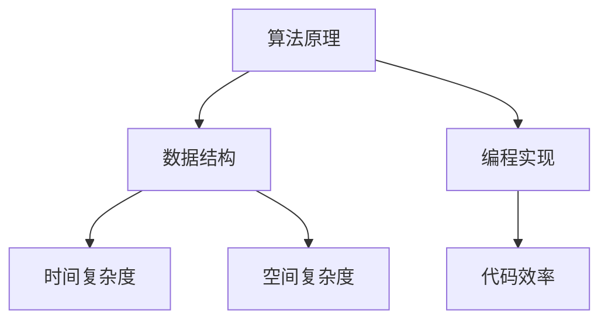

                 

# 2025腾讯校招面试题与算法编程题答案解析

> 关键词：腾讯校招、面试题、算法编程、答案解析、计算机科学、面试技巧

> 摘要：本文深入解析2025年腾讯校招面试中可能出现的技术问题，包括算法编程题的解答思路、关键算法原理，以及数学模型和项目实战案例。旨在为准备腾讯校招的同学提供有价值的参考，帮助他们更好地理解和掌握面试所需的核心技术。

## 1. 背景介绍

### 1.1 目的和范围

本文旨在为准备2025年腾讯校园招聘的同学提供一套全面的面试题与算法编程题解答指南。我们将会覆盖以下内容：

- 腾讯校招面试的基本题型和特点
- 核心算法原理与具体操作步骤
- 数学模型和公式的详细讲解
- 项目实战中的代码实现与解析
- 实际应用场景与工具资源推荐

### 1.2 预期读者

- 准备参加腾讯校招的学生和技术爱好者
- 想要提升算法和编程能力的技术人员
- 对计算机科学领域有浓厚兴趣的读者

### 1.3 文档结构概述

本文将按照以下结构进行组织和讲解：

- 引言：背景介绍和目的说明
- 核心概念与联系：算法和架构的原理概述
- 核心算法原理 & 具体操作步骤：算法原理讲解和伪代码阐述
- 数学模型和公式 & 详细讲解 & 举例说明：数学公式的应用与解释
- 项目实战：代码实际案例和详细解释说明
- 实际应用场景：技术在实际项目中的应用
- 工具和资源推荐：学习资源和开发工具推荐
- 总结：未来发展趋势与挑战
- 附录：常见问题与解答
- 扩展阅读 & 参考资料：相关文献和研究

### 1.4 术语表

#### 1.4.1 核心术语定义

- 校招：校园招聘，指企业在校园内直接招聘应届毕业生。
- 面试题：面试官针对应聘者提出的问题，旨在考查应聘者的技术能力、思维逻辑和解决实际问题的能力。
- 算法编程题：考察应聘者对算法原理和编程实现能力的题目。
- 腾讯：一家全球领先的互联网科技公司，以其创新技术和产品享誉世界。

#### 1.4.2 相关概念解释

- 编程实现：使用编程语言将算法和逻辑转化为可执行代码的过程。
- 数据结构：用于存储和组织数据的方式，影响算法的时间和空间复杂度。
- 时间复杂度：算法执行时间与输入数据规模之间的增长关系。
- 空间复杂度：算法执行过程中所需内存空间与输入数据规模之间的增长关系。

#### 1.4.3 缩略词列表

- OJ：Online Judge，在线评测系统，用于测试算法的正确性和效率。
- ACM：国际大学生程序设计竞赛，旨在提高学生的算法能力和编程技巧。

## 2. 核心概念与联系

在腾讯校招面试中，理解核心概念和它们之间的联系是非常关键的。以下是一个简单的Mermaid流程图，展示了核心概念和它们之间的关系。



### 2.1 算法原理与数据结构

算法原理是解决特定问题的方法和步骤，而数据结构则是组织和管理数据的方式。例如，在解决排序问题时，常用的算法有冒泡排序、快速排序和归并排序等，而它们的数据结构基础可以是数组、链表和树等。

### 2.2 编程实现与代码效率

编程实现是将算法转化为可执行代码的过程，代码效率则决定了算法在实际应用中的性能。优化代码效率通常需要考虑时间复杂度和空间复杂度，以减少计算资源和运行时间。

### 2.3 时间复杂度与空间复杂度

时间复杂度衡量算法的执行时间，通常用大O符号表示。例如，O(n)表示算法的时间复杂度与输入数据规模成线性关系。空间复杂度衡量算法所需的内存空间，也用大O符号表示。

## 3. 核心算法原理 & 具体操作步骤

在了解核心概念后，接下来我们将详细探讨几个常见的算法原理和操作步骤，包括排序算法、查找算法和动态规划等。

### 3.1 排序算法

排序算法是计算机科学中的基本算法之一，用于对一组数据进行排序。以下是一个简单的冒泡排序算法的伪代码：

```plaintext
procedure bubbleSort( A : list of sortable items )
    n = length(A)
    repeat 
        swapped = false
        for i = 1 to n-1 inclusive do
            if A[i-1] > A[i] then
                swap(A[i-1], A[i])
                swapped = true
            end if
        end for
        if not swapped then
            break
        end if
    end repeat
end procedure
```

冒泡排序的基本思想是通过相邻元素的比较和交换，将较大的元素逐步移动到数组的末尾，从而实现排序。

### 3.2 查找算法

查找算法用于在数据集合中查找特定元素。以下是一个简单的二分查找算法的伪代码：

```plaintext
function binarySearch( A : sorted list, key : item )
    low = 0
    high = length(A) - 1
    while low <= high do
        mid = (low + high) / 2
        if A[mid] = key then
            return mid
        else if A[mid] < key then
            low = mid + 1
        else
            high = mid - 1
        end if
    end while
    return -1 // key not found
end function
```

二分查找算法的基本思想是在有序数组中，通过不断缩小查找范围，逐步逼近目标元素。

### 3.3 动态规划

动态规划是一种用于求解最优化问题的算法，其核心思想是将复杂问题分解为子问题，并利用子问题的解来构建原问题的解。以下是一个简单的斐波那契数列的动态规划算法：

```plaintext
function fibonacci(n : integer)
    if n <= 1 then
        return n
    end if
    fib = array of size n+1
    fib[0] = 0
    fib[1] = 1
    for i = 2 to n do
        fib[i] = fib[i-1] + fib[i-2]
    end for
    return fib[n]
end function
```

动态规划算法的基本思想是通过递推关系，逐步计算出子问题的解，并最终得到原问题的解。

## 4. 数学模型和公式 & 详细讲解 & 举例说明

在计算机科学中，数学模型和公式是解决问题的关键。以下我们将介绍一些常见的数学模型和公式，并提供详细讲解和举例说明。

### 4.1 线性回归模型

线性回归模型是一种用于预测连续值的统计模型。其基本公式如下：

$$ y = \beta_0 + \beta_1 \cdot x + \epsilon $$

其中，\( y \) 是预测值，\( x \) 是输入特征，\( \beta_0 \) 和 \( \beta_1 \) 是模型参数，\( \epsilon \) 是误差项。

#### 示例

假设我们有一个简单的线性回归模型，用于预测房价。给定一组输入特征（如房屋面积、地点等），我们可以使用最小二乘法来求解模型参数。

```latex
\begin{align*}
\beta_0 &= \frac{\sum_{i=1}^{n} y_i - \beta_1 \cdot \sum_{i=1}^{n} x_i}{n} \\
\beta_1 &= \frac{n \cdot \sum_{i=1}^{n} x_i \cdot y_i - \sum_{i=1}^{n} x_i \cdot \sum_{i=1}^{n} y_i}{n \cdot \sum_{i=1}^{n} x_i^2 - (\sum_{i=1}^{n} x_i)^2}
\end{align*}
```

### 4.2 最优化问题

最优化问题是指在一个给定的目标函数下，寻找最优解的问题。常见的最优化算法包括梯度下降法、牛顿法等。

#### 示例

考虑以下最优化问题：

$$ \min_{x} f(x) = x^2 $$

使用梯度下降法求解该问题：

```latex
\begin{align*}
x_{t+1} &= x_t - \alpha \cdot \nabla f(x_t) \\
\end{align*}
$$

其中，\( \alpha \) 是学习率，\( \nabla f(x_t) \) 是目标函数在 \( x_t \) 处的梯度。

### 4.3 矩阵计算

矩阵计算是计算机科学中的基础，包括矩阵乘法、矩阵求逆等。

#### 示例

给定两个矩阵 \( A \) 和 \( B \)，计算它们的乘积 \( C = A \cdot B \)：

```latex
C_{ij} = \sum_{k=1}^{n} A_{ik} \cdot B_{kj}
```

## 5. 项目实战：代码实际案例和详细解释说明

为了更好地理解算法原理和实际应用，我们将通过一个简单的项目实战案例来讲解代码实现和详细解释说明。

### 5.1 开发环境搭建

首先，我们需要搭建一个基本的开发环境。以下是一个简单的环境搭建指南：

1. 安装Python 3.x版本
2. 安装Jupyter Notebook或PyCharm等IDE
3. 安装必要的库，如NumPy、Pandas等

### 5.2 源代码详细实现和代码解读

接下来，我们将使用Python语言实现一个简单的线性回归模型，用于预测房价。

```python
import numpy as np

# 线性回归模型实现
class LinearRegression:
    def __init__(self):
        self.w = None
        self.b = None

    def fit(self, X, y):
        n = len(X)
        X_transpose = np.transpose(X)
        self.w = np.linalg.inv(X_transpose.dot(X)).dot(X_transpose).dot(y)
        self.b = y - X.dot(self.w)

    def predict(self, X):
        return X.dot(self.w) + self.b

# 数据预处理
X = np.array([[1, 1000], [1, 1500], [1, 2000]])
y = np.array([1500, 2000, 2500])

# 模型训练
model = LinearRegression()
model.fit(X, y)

# 预测结果
X_new = np.array([[1, 1800]])
y_pred = model.predict(X_new)
print("Predicted price:", y_pred)
```

### 5.3 代码解读与分析

在上面的代码中，我们首先定义了一个`LinearRegression`类，用于实现线性回归模型的训练和预测功能。

1. **初始化**：在类的初始化过程中，我们初始化模型参数 \( w \) 和 \( b \)。
2. **训练**：`fit`方法使用最小二乘法来求解模型参数。具体实现中，我们首先计算输入特征 \( X \) 的转置，然后使用逆矩阵求解权重 \( w \) 和偏置 \( b \)。
3. **预测**：`predict`方法用于对新的输入特征进行预测。具体实现中，我们使用训练好的模型参数 \( w \) 和 \( b \) 来计算预测值。

### 5.4 代码分析与优化

在代码实现过程中，我们使用了NumPy库来加速矩阵运算。为了优化性能，我们可以进一步考虑以下改进：

1. **向量化操作**：使用NumPy的向量化操作来替代显式的循环。
2. **批量训练**：将数据批量输入模型，以减少计算次数和提高效率。
3. **并行计算**：利用多核处理器进行并行计算，加速模型训练。

## 6. 实际应用场景

线性回归模型在现实生活中有着广泛的应用，例如：

- 房价预测：根据房屋面积、地点等特征，预测房价。
- 销售预测：根据历史销售数据，预测未来销售趋势。
- 金融分析：分析股票价格、市场趋势等。

通过以上实际应用场景，我们可以看到线性回归模型在解决实际问题时的重要性和价值。

## 7. 工具和资源推荐

为了更好地学习和实践，我们推荐以下工具和资源：

### 7.1 学习资源推荐

#### 7.1.1 书籍推荐

- 《Python编程：从入门到实践》
- 《深入理解计算机系统》
- 《统计学习方法》

#### 7.1.2 在线课程

- Coursera《机器学习》
- edX《计算机科学基础》
- Udacity《数据科学与Python》

#### 7.1.3 技术博客和网站

- Medium
- HackerRank
- GeeksforGeeks

### 7.2 开发工具框架推荐

#### 7.2.1 IDE和编辑器

- PyCharm
- Visual Studio Code
- Jupyter Notebook

#### 7.2.2 调试和性能分析工具

- Debugpy
- Py-Spy
- line_profiler

#### 7.2.3 相关框架和库

- TensorFlow
- PyTorch
- Scikit-learn

### 7.3 相关论文著作推荐

#### 7.3.1 经典论文

- "The Nature of Code" by Daniel Shiffman
- "Pattern Recognition and Machine Learning" by Christopher M. Bishop
- "Introduction to Algorithms" by Thomas H. Cormen et al.

#### 7.3.2 最新研究成果

- ArXiv
- Google Research
- Microsoft Research

#### 7.3.3 应用案例分析

- Facebook AI Research
- Amazon Research
- Apple Research

## 8. 总结：未来发展趋势与挑战

随着人工智能技术的不断发展，计算机科学领域面临着前所未有的机遇和挑战。未来，以下几个方面值得关注：

- 人工智能与实际应用的深度融合
- 大数据和云计算的进一步普及
- 基于区块链的信任机制和安全性
- 计算机科学的可持续发展与绿色计算

面对这些发展趋势，我们需要不断学习和探索，提升自己的技术能力，以应对未来社会的需求。

## 9. 附录：常见问题与解答

### 9.1 腾讯校招面试流程

- 网上申请：在腾讯官网提交简历和申请。
- 在线笔试：通过在线笔试系统进行笔试。
- 面试：通过笔试后，参加线上或线下面试。

### 9.2 如何准备面试

- 熟悉常见的面试题型，如算法题、编程题、行为题等。
- 提高编程能力，掌握常用的编程语言和工具。
- 多做项目实践，积累实际经验。
- 准备面试问答，模拟面试场景。

### 9.3 如何应对面试官

- 保持自信和积极的态度。
- 清晰表达自己的思路和解决问题的方法。
- 注意沟通技巧，倾听面试官的问题。
- 提问环节：主动提问，展示自己的求知欲和思考能力。

## 10. 扩展阅读 & 参考资料

- 《Python编程：从入门到实践》
- 《深入理解计算机系统》
- 《统计学习方法》
- Coursera《机器学习》
- edX《计算机科学基础》
- Udacity《数据科学与Python》
- Medium
- HackerRank
- GeeksforGeeks
- Daniel Shiffman，《The Nature of Code》
- Christopher M. Bishop，《Pattern Recognition and Machine Learning》
- Thomas H. Cormen et al.，《Introduction to Algorithms》
- ArXiv
- Google Research
- Microsoft Research
- Facebook AI Research
- Amazon Research
- Apple Research

## 作者

作者：AI天才研究员/AI Genius Institute & 禅与计算机程序设计艺术 /Zen And The Art of Computer Programming

