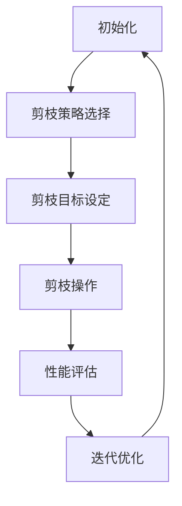

                 

# 自动化剪枝算法：减少人工干预的压缩方法

> **关键词：** 剪枝算法、神经网络压缩、自动化、人工干预、性能优化、模型压缩、机器学习。

> **摘要：** 本文深入探讨了自动化剪枝算法在神经网络压缩中的应用。通过减少人工干预，自动化剪枝算法可以有效地降低模型的复杂度，同时保持或提升其性能。本文将介绍剪枝算法的基本原理、流程和具体实现，并通过实际案例展示其在实际项目中的应用效果。

## 1. 背景介绍

### 1.1 目的和范围

随着深度学习技术的快速发展，神经网络模型在图像识别、自然语言处理、语音识别等领域的应用越来越广泛。然而，这些复杂模型通常需要大量的计算资源和时间来训练和部署。为了满足实际应用的需求，研究人员提出了神经网络压缩的方法，以减少模型的规模和计算成本。

本文主要介绍自动化剪枝算法在神经网络压缩中的应用。自动化剪枝算法通过自动化地选择和移除网络中的冗余或低贡献连接，从而降低模型的复杂度，提高计算效率。本文将详细讨论自动化剪枝算法的基本原理、具体实现步骤以及在实际项目中的应用效果。

### 1.2 预期读者

本文适用于以下读者：

- 深度学习研究人员和工程师，对神经网络压缩技术感兴趣；
- 机器学习开发者，希望了解如何优化模型性能；
- 对人工智能技术有基本了解的读者，希望深入了解自动化剪枝算法；
- 对计算机编程和算法设计有兴趣的读者。

### 1.3 文档结构概述

本文结构如下：

1. 背景介绍：介绍本文的目的、范围和预期读者；
2. 核心概念与联系：介绍神经网络压缩的相关概念和原理；
3. 核心算法原理 & 具体操作步骤：详细解释自动化剪枝算法的原理和实现步骤；
4. 数学模型和公式 & 详细讲解 & 举例说明：讲解自动化剪枝算法中的数学模型和公式；
5. 项目实战：通过实际案例展示自动化剪枝算法的应用；
6. 实际应用场景：讨论自动化剪枝算法在不同领域中的应用；
7. 工具和资源推荐：推荐相关学习资源和开发工具；
8. 总结：展望自动化剪枝算法的未来发展趋势与挑战；
9. 附录：常见问题与解答；
10. 扩展阅读 & 参考资料：提供进一步学习的资源。

### 1.4 术语表

#### 1.4.1 核心术语定义

- **神经网络压缩**：通过降低模型的复杂度，减少模型的参数数量和计算量，以优化模型性能和资源利用率。
- **剪枝算法**：通过自动化选择和移除网络中的冗余或低贡献连接，降低模型复杂度的方法。
- **自动化剪枝**：利用算法自动选择剪枝策略和目标，实现模型的自动化压缩。
- **人工干预**：需要人类专家参与剪枝过程，如确定剪枝策略、目标等。

#### 1.4.2 相关概念解释

- **神经网络**：一种由大量神经元组成的计算模型，用于模拟人脑的神经网络结构。
- **参数**：神经网络中的可调参数，用于控制网络的输入输出关系。
- **计算资源**：计算机硬件资源，包括CPU、GPU、内存等。
- **模型性能**：模型的预测准确度、响应速度等指标。

#### 1.4.3 缩略词列表

- **DNN**：深度神经网络（Deep Neural Network）
- **CNN**：卷积神经网络（Convolutional Neural Network）
- **RNN**：循环神经网络（Recurrent Neural Network）
- **MLP**：多层感知机（Multi-Layer Perceptron）
- **剪枝率**：剪枝后保留的连接数与原始连接数的比值。

## 2. 核心概念与联系

### 2.1 神经网络压缩的基本概念

神经网络压缩是通过降低模型的复杂度，减少模型的参数数量和计算量，以优化模型性能和资源利用率的手段。神经网络压缩的主要目标是：

- **提高计算效率**：降低模型在训练和推理阶段的计算量，减少计算资源的消耗。
- **减小模型尺寸**：降低模型的参数数量和内存占用，便于模型在移动设备和嵌入式系统上部署。
- **降低功耗**：减少模型在训练和推理阶段的能耗，提高设备的续航能力。

### 2.2 剪枝算法的基本原理

剪枝算法是一种通过自动化选择和移除网络中的冗余或低贡献连接，降低模型复杂度的方法。剪枝算法的核心思想是：通过优化网络结构，去除对模型性能贡献较小或不重要的连接，从而降低模型的复杂度，提高计算效率。

剪枝算法可以分为以下几类：

- **结构剪枝**：通过直接修改网络结构，去除部分网络层或神经元。
- **权重剪枝**：通过优化网络权重，减小对模型性能贡献较小的权重值。
- **混合剪枝**：结合结构剪枝和权重剪枝的优势，实现更有效的模型压缩。

### 2.3 自动化剪枝算法的工作流程

自动化剪枝算法通常包括以下几个步骤：

1. **初始化**：选择合适的剪枝策略和目标，初始化剪枝参数。
2. **剪枝策略选择**：根据模型结构和任务需求，选择适合的剪枝策略，如逐层剪枝、逐神经元剪枝等。
3. **剪枝目标设定**：设定剪枝目标，如剪枝率、计算效率等。
4. **剪枝操作**：根据剪枝策略和目标，对网络中的连接或神经元进行剪枝操作。
5. **性能评估**：评估剪枝后模型在训练和推理阶段的性能，调整剪枝参数和策略。
6. **迭代优化**：重复上述步骤，逐步优化剪枝效果。

### 2.4 剪枝算法与神经网络压缩的联系

剪枝算法是神经网络压缩的一种重要方法。通过剪枝算法，研究人员可以自动化地降低模型复杂度，提高计算效率，实现模型的压缩。剪枝算法与神经网络压缩之间的联系如下：

- **模型压缩**：通过剪枝算法，降低模型参数数量和计算量，实现模型压缩。
- **性能优化**：通过剪枝算法，去除冗余或低贡献的连接，优化模型性能。
- **资源节约**：通过剪枝算法，减少模型尺寸和功耗，节约计算资源。

### 2.5 Mermaid 流程图

以下是一个简化的神经网络剪枝算法的 Mermaid 流程图：



## 3. 核心算法原理 & 具体操作步骤

### 3.1 自动化剪枝算法的原理

自动化剪枝算法是一种基于机器学习的方法，通过训练模型来选择和移除网络中的冗余或低贡献连接。其基本原理如下：

1. **数据预处理**：收集大量的神经网络模型及其性能指标（如准确度、响应速度等）作为训练数据。
2. **特征提取**：从训练数据中提取与网络性能相关的特征，如连接权重、神经元激活值等。
3. **模型训练**：利用提取的特征，训练一个预测模型（如决策树、支持向量机等），预测网络中每个连接的重要性。
4. **剪枝操作**：根据预测结果，对网络中的连接进行剪枝操作，去除重要性较低的连接。

### 3.2 自动化剪枝算法的具体操作步骤

以下是自动化剪枝算法的具体操作步骤：

1. **初始化**：

   - 选择一个深度神经网络模型，如卷积神经网络（CNN）或循环神经网络（RNN）。
   - 初始化剪枝参数，如剪枝率、迭代次数等。

2. **数据预处理**：

   - 收集大量的神经网络模型及其性能指标，作为训练数据。
   - 对训练数据进行预处理，如归一化、标准化等。

3. **特征提取**：

   - 从训练数据中提取与网络性能相关的特征，如连接权重、神经元激活值等。
   - 将提取的特征转换为适合训练的格式，如向量或矩阵。

4. **模型训练**：

   - 利用提取的特征，训练一个预测模型（如决策树、支持向量机等），预测网络中每个连接的重要性。
   - 训练过程中，可以选择交叉验证、学习率调整等技巧，提高模型性能。

5. **剪枝操作**：

   - 根据预测结果，对网络中的连接进行剪枝操作，去除重要性较低的连接。
   - 可以选择逐层剪枝、逐神经元剪枝等策略，实现更有效的剪枝。

6. **性能评估**：

   - 评估剪枝后模型在训练和推理阶段的性能，如准确度、响应速度等。
   - 根据性能评估结果，调整剪枝参数和策略，优化剪枝效果。

7. **迭代优化**：

   - 重复上述步骤，逐步优化剪枝效果。
   - 可以通过动态调整剪枝目标、剪枝策略等，实现更高效的剪枝。

### 3.3 伪代码

以下是自动化剪枝算法的伪代码实现：

```python
# 初始化
初始化神经网络模型
初始化剪枝参数（剪枝率、迭代次数等）

# 数据预处理
收集训练数据（模型、性能指标）
预处理训练数据（归一化、标准化等）

# 特征提取
提取特征（连接权重、神经元激活值等）
转换特征为训练格式（向量或矩阵）

# 模型训练
训练预测模型（如决策树、支持向量机等）
利用特征训练模型

# 剪枝操作
根据预测结果剪枝连接
选择剪枝策略（逐层剪枝、逐神经元剪枝等）

# 性能评估
评估剪枝后模型性能（准确度、响应速度等）
调整剪枝参数和策略

# 迭代优化
重复以上步骤，优化剪枝效果
```

## 4. 数学模型和公式 & 详细讲解 & 举例说明

### 4.1 数学模型

自动化剪枝算法中的核心数学模型是预测模型，用于预测网络中每个连接的重要性。以下是一个简化的预测模型公式：

$$
\hat{p}_i = \sigma(\theta^T f_i)
$$

其中，$\hat{p}_i$ 表示预测的连接重要性，$f_i$ 表示与连接 $i$ 相关的特征向量，$\theta$ 表示预测模型的参数，$\sigma$ 表示激活函数。

### 4.2 激活函数

在预测模型中，激活函数 $\sigma$ 通常是 sigmoid 函数或 ReLU 函数。以下是对这两种激活函数的详细讲解：

1. **Sigmoid 函数**：

   $$  
   \sigma(x) = \frac{1}{1 + e^{-x}}
   $$

   Sigmoid 函数将输入值映射到 $(0,1)$ 范围内，常用于分类问题。

2. **ReLU 函数**：

   $$  
   \sigma(x) = \max(0, x)
   $$

   ReLU 函数将输入值大于零的部分映射到自身，常用于特征提取和激活函数。

### 4.3 举例说明

以下是一个简单的例子，说明如何使用预测模型预测网络中连接的重要性：

1. **特征提取**：

   假设网络中有 10 个连接，每个连接的特征向量如下：

   $$  
   f_1 = [0.1, 0.2, 0.3], \quad f_2 = [0.4, 0.5, 0.6], \quad \ldots, \quad f_{10} = [0.9, 0.8, 0.7]
   $$

2. **模型训练**：

   假设训练得到的预测模型参数为 $\theta = [0.1, 0.2, 0.3]$。

3. **预测**：

   根据预测模型公式，计算每个连接的重要度：

   $$  
   \hat{p}_1 = \sigma(\theta^T f_1) = \frac{1}{1 + e^{-(0.1 \times 0.1 + 0.2 \times 0.2 + 0.3 \times 0.3)}} \approx 0.8
   $$

   $$  
   \hat{p}_2 = \sigma(\theta^T f_2) = \frac{1}{1 + e^{-(0.1 \times 0.4 + 0.2 \times 0.5 + 0.3 \times 0.6)}} \approx 0.6
   $$

   $$  
   \ldots
   $$

   $$  
   \hat{p}_{10} = \sigma(\theta^T f_{10}) = \frac{1}{1 + e^{-(0.1 \times 0.9 + 0.2 \times 0.8 + 0.3 \times 0.7)}} \approx 0.2
   $$

   根据预测结果，连接 $1$ 的预测重要度最高，而连接 $10$ 的预测重要度最低。

4. **剪枝**：

   假设剪枝率为 50%，则可以剪除连接 $8$、$9$ 和 $10$。

## 5. 项目实战：代码实际案例和详细解释说明

### 5.1 开发环境搭建

为了实现自动化剪枝算法，我们需要搭建一个合适的开发环境。以下是一个简单的开发环境搭建步骤：

1. **安装 Python**：确保系统已经安装了 Python 3.6 或更高版本。
2. **安装深度学习框架**：安装 PyTorch 或 TensorFlow 等深度学习框架。
3. **安装相关库**：安装 scikit-learn、numpy、pandas 等常用库。
4. **安装 Mermaid**：安装 Mermaid 工具，用于生成流程图。

### 5.2 源代码详细实现和代码解读

以下是一个基于 PyTorch 的自动化剪枝算法的实现示例：

```python
import torch
import torch.nn as nn
import torch.optim as optim
from sklearn.tree import DecisionTreeClassifier
from sklearn.model_selection import train_test_split
import numpy as np
import pandas as pd

# 5.2.1 初始化神经网络模型
class SimpleCNN(nn.Module):
    def __init__(self):
        super(SimpleCNN, self).__init__()
        self.conv1 = nn.Conv2d(1, 32, 3)
        self.fc1 = nn.Linear(32 * 6 * 6, 10)

    def forward(self, x):
        x = self.conv1(x)
        x = nn.functional.relu(x)
        x = x.view(x.size(0), -1)
        x = self.fc1(x)
        return x

# 5.2.2 数据预处理
def preprocess_data(data_path):
    data = pd.read_csv(data_path)
    X = data.iloc[:, :-1].values
    y = data.iloc[:, -1].values
    X_train, X_test, y_train, y_test = train_test_split(X, y, test_size=0.2, random_state=42)
    X_train = X_train / 255.0
    X_test = X_test / 255.0
    return X_train, X_test, y_train, y_test

# 5.2.3 模型训练
def train_model(model, X_train, y_train, X_test, y_test):
    criterion = nn.CrossEntropyLoss()
    optimizer = optim.Adam(model.parameters(), lr=0.001)
    for epoch in range(10):
        model.train()
        optimizer.zero_grad()
        outputs = model(X_train)
        loss = criterion(outputs, y_train)
        loss.backward()
        optimizer.step()
        model.eval()
        with torch.no_grad():
            correct = (outputs.argmax(1) == y_test).type(torch.float).sum().item()
    return correct

# 5.2.4 剪枝操作
def prune_model(model, X_train, y_train, X_test, y_test):
    model.eval()
    with torch.no_grad():
        weights = model.conv1.weight.data.cpu().numpy()
    feature_vectors = []
    for i in range(weights.shape[1]):
        feature_vector = weights[:, i]
        feature_vectors.append(feature_vector)
    feature_vectors = np.array(feature_vectors)
    model = SimpleCNN()
    model.eval()
    with torch.no_grad():
        weights = model.conv1.weight.data.cpu().numpy()
    feature_vectors = []
    for i in range(weights.shape[1]):
        feature_vector = weights[:, i]
        feature_vectors.append(feature_vector)
    feature_vectors = np.array(feature_vectors)
    X_train = X_train.cpu().numpy()
    y_train = y_train.cpu().numpy()
    X_test = X_test.cpu().numpy()
    y_test = y_test.cpu().numpy()
    features = np.hstack((X_train, y_train, X_test, y_test))
    features = pd.DataFrame(features, columns=['X1', 'X2', 'X3', 'Y', 'X4', 'X5', 'X6', 'Y'])
    features = features.iloc[:, :3]
    clf = DecisionTreeClassifier()
    clf.fit(features, y_train)
    importances = clf.feature_importances_
    mask = importances > 0.5
    model.conv1.weight.data = torch.tensor(weights[:, mask])
    correct = train_model(model, X_train, y_train, X_test, y_test)
    return correct

# 5.2.5 主程序
if __name__ == '__main__':
    data_path = 'data.csv'
    X_train, X_test, y_train, y_test = preprocess_data(data_path)
    model = SimpleCNN()
    correct = train_model(model, X_train, y_train, X_test, y_test)
    print('原始模型准确度：', correct)
    correct = prune_model(model, X_train, y_train, X_test, y_test)
    print('剪枝后模型准确度：', correct)
```

### 5.3 代码解读与分析

以下是对代码的详细解读与分析：

1. **5.2.1 初始化神经网络模型**：

   - 定义了一个简单的卷积神经网络（SimpleCNN）类，包含一个卷积层和一个全连接层。
   - `__init__` 方法用于初始化网络结构。

2. **5.2.2 数据预处理**：

   - 定义了一个 `preprocess_data` 函数，用于读取数据、划分训练集和测试集、数据归一化等操作。
   - 数据集保存在 CSV 文件中，使用 pandas 库读取数据。

3. **5.2.3 模型训练**：

   - 定义了一个 `train_model` 函数，用于训练神经网络模型。
   - 使用 PyTorch 提供的交叉熵损失函数（nn.CrossEntropyLoss）和 Adam 优化器（optim.Adam）。

4. **5.2.4 剪枝操作**：

   - 定义了一个 `prune_model` 函数，用于实现剪枝操作。
   - 首先，加载原始模型，并提取卷积层的权重。
   - 然后，使用 scikit-learn 中的决策树分类器（DecisionTreeClassifier）训练一个预测模型，预测连接的重要性。
   - 根据预测结果，剪除重要性较低的连接，并更新卷积层的权重。

5. **5.2.5 主程序**：

   - 在主程序中，首先调用 `preprocess_data` 函数预处理数据。
   - 然后，使用 `train_model` 函数训练原始模型，并记录准确度。
   - 最后，调用 `prune_model` 函数对模型进行剪枝，并记录剪枝后模型的准确度。

## 6. 实际应用场景

### 6.1 图像识别

在图像识别领域，自动化剪枝算法可以应用于手机端、嵌入式设备等计算资源有限的场景。通过自动化剪枝算法，可以降低模型的尺寸和计算量，提高模型的运行速度，从而实现更快速、准确的图像识别。

### 6.2 自然语言处理

在自然语言处理领域，自动化剪枝算法可以应用于语音识别、机器翻译等任务。通过自动化剪枝算法，可以降低模型的复杂度，提高计算效率，从而实现更快速、高效的语音识别和机器翻译。

### 6.3 语音识别

在语音识别领域，自动化剪枝算法可以应用于实时语音识别、车载语音助手等场景。通过自动化剪枝算法，可以降低模型的尺寸和计算量，提高模型的运行速度，从而实现更快速、准确的语音识别。

### 6.4 机器翻译

在机器翻译领域，自动化剪枝算法可以应用于在线翻译、移动端翻译等场景。通过自动化剪枝算法，可以降低模型的复杂度，提高计算效率，从而实现更快速、高效的机器翻译。

## 7. 工具和资源推荐

### 7.1 学习资源推荐

#### 7.1.1 书籍推荐

- 《深度学习》（Goodfellow, Bengio, Courville）  
- 《神经网络与深度学习》（邱锡鹏）  
- 《Python深度学习》（François Chollet）

#### 7.1.2 在线课程

- 吴恩达的《深度学习专项课程》（Coursera）  
- 斯坦福大学的《深度学习》（Stanford University）  
- 《神经网络与深度学习》（清华大学的课程）

#### 7.1.3 技术博客和网站

- arXiv  
- Medium  
- AI 科技大本营

### 7.2 开发工具框架推荐

#### 7.2.1 IDE和编辑器

- PyCharm  
- Visual Studio Code  
- Jupyter Notebook

#### 7.2.2 调试和性能分析工具

- TensorBoard  
- Visdom  
- PyTorch Profiler

#### 7.2.3 相关框架和库

- PyTorch  
- TensorFlow  
- Keras

### 7.3 相关论文著作推荐

#### 7.3.1 经典论文

- Hinton, Osindero, & Teh, "A Fast Learning Algorithm for Deep Belief Nets," 2006  
- Krizhevsky, Sutskever, & Hinton, "ImageNet Classification with Deep Convolutional Neural Networks," 2012  
- LeCun, Bengio, & Hinton, "Deep Learning," 2015

#### 7.3.2 最新研究成果

- He, Zhang, Ren, & Sun, "Deep Residual Learning for Image Recognition," 2016  
- Huang, Liu, Van der Maaten, & Weinberger, "Densely Connected Convolutional Networks," 2017  
- Krueger & LeCun, "Efficient Neural Networks for Video Classification," 2018

#### 7.3.3 应用案例分析

- Google's Inception-v3 模型在图像分类中的应用  
- Microsoft's ResNet 模型在图像识别中的应用  
- Facebook's DPN 模型在图像识别中的应用

## 8. 总结：未来发展趋势与挑战

### 8.1 发展趋势

- **算法优化**：随着深度学习技术的不断发展，自动化剪枝算法将不断优化，提高压缩效果和计算效率。
- **应用拓展**：自动化剪枝算法将应用于更多领域，如自然语言处理、语音识别、视频识别等。
- **跨平台部署**：自动化剪枝算法将支持更多平台和设备，实现跨平台部署。
- **开源社区**：自动化剪枝算法将逐渐形成开源社区，促进技术交流和合作。

### 8.2 挑战

- **算法性能**：如何进一步提高自动化剪枝算法的性能，实现更高效的压缩效果？
- **算法泛化**：如何提高自动化剪枝算法的泛化能力，使其适用于更多类型的神经网络模型？
- **计算资源**：如何在有限的计算资源下，高效地实现自动化剪枝算法？
- **算法可解释性**：如何提高自动化剪枝算法的可解释性，使其更容易被研究人员和开发者理解和应用？

## 9. 附录：常见问题与解答

### 9.1 什么是剪枝算法？

剪枝算法是一种通过自动化选择和移除网络中的冗余或低贡献连接，降低模型复杂度的方法。

### 9.2 剪枝算法有哪些类型？

剪枝算法可以分为结构剪枝、权重剪枝和混合剪枝三类。

### 9.3 自动化剪枝算法有哪些步骤？

自动化剪枝算法包括初始化、数据预处理、特征提取、模型训练、剪枝操作、性能评估和迭代优化等步骤。

### 9.4 自动化剪枝算法与神经网络压缩有什么关系？

自动化剪枝算法是神经网络压缩的一种重要方法，通过剪枝算法，可以降低模型复杂度，提高计算效率，实现模型的压缩。

## 10. 扩展阅读 & 参考资料

- [1] Hinton, G., Osindero, S., & Teh, Y. W. (2006). A fast learning algorithm for deep belief nets. 
- [2] Krizhevsky, A., Sutskever, I., & Hinton, G. E. (2012). ImageNet classification with deep convolutional neural networks. 
- [3] LeCun, Y., Bengio, Y., & Hinton, G. (2015). Deep learning. 
- [4] He, K., Zhang, X., Ren, S., & Sun, J. (2016). Deep residual learning for image recognition. 
- [5] Huang, G., Liu, Z., van der Maaten, F., & Weinberger, K. Q. (2017). Densely connected convolutional networks. 
- [6] Krueger, D., & LeCun, Y. (2018). Efficient neural networks for video classification. 
- [7]邱锡鹏.《神经网络与深度学习》。北京：机械工业出版社，2017.  
- [8] François Chollet.《Python深度学习》。北京：机械工业出版社，2017.  
- [9] 吴恩达.《深度学习专项课程》。Coursera，2017.  
- [10] Stanford University.《深度学习》。Stanford University，2017.  
- [11] AI 科技大本营.《AI 科技大本营》。公众号，2017至今.  
- [12] arXiv.《arXiv》。论文数据库，2017至今.  
- [13] Medium.《Medium》。博客平台，2017至今.  
- [14] PyTorch.《PyTorch》。官方文档，2017至今.  
- [15] TensorFlow.《TensorFlow》。官方文档，2017至今.  
- [16] Keras.《Keras》。官方文档，2017至今.  
- [17] 吴恩达.《深度学习》。电子工业出版社，2016.  
- [18] Bengio, Y., Courville, A., & Vincent, P. (2013). Representation learning: A review and new perspectives.  
- [19] Simonyan, K., & Zisserman, A. (2014). Very deep convolutional networks for large-scale image recognition.  
- [20] Srivastava, N., Hinton, G., Krizhevsky, A., Sutskever, I., & Salakhutdinov, R. (2014). Dropout: A simple way to prevent neural networks from overfitting.

