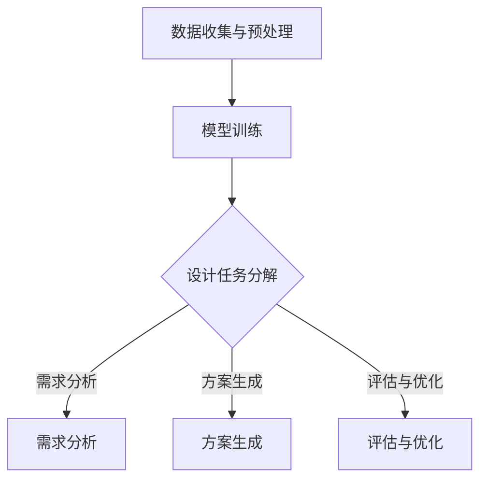

                 

# 自动化设计：LLM 驱动的创新

> 关键词：自动化设计，LLM，机器学习，人工智能，设计流程，创新应用

> 摘要：本文深入探讨了使用大型语言模型（LLM）驱动自动化设计的概念与实施方法。通过介绍核心概念、算法原理、数学模型、实战案例以及应用场景，本文旨在揭示LLM在自动化设计领域的巨大潜力，为未来设计创新提供新思路。

## 1. 背景介绍

### 1.1 目的和范围

本文旨在探讨如何利用大型语言模型（LLM）实现自动化设计，并分析其对于设计流程的变革与创新。我们重点关注以下问题：

- 如何构建一个基于LLM的自动化设计系统？
- 如何通过机器学习优化设计流程，提高设计效率？
- 如何在多样化的设计场景中，实现LLM驱动的创新应用？

### 1.2 预期读者

本文适合以下读者群体：

- 对自动化设计感兴趣的技术人员
- 从事机器学习与人工智能研究的专业人士
- 对设计流程优化与创新有热情的创业者
- 需要提升设计效率的企业管理者

### 1.3 文档结构概述

本文结构如下：

- 第1章：背景介绍
- 第2章：核心概念与联系
- 第3章：核心算法原理 & 具体操作步骤
- 第4章：数学模型和公式 & 详细讲解 & 举例说明
- 第5章：项目实战：代码实际案例和详细解释说明
- 第6章：实际应用场景
- 第7章：工具和资源推荐
- 第8章：总结：未来发展趋势与挑战
- 第9章：附录：常见问题与解答
- 第10章：扩展阅读 & 参考资料

### 1.4 术语表

#### 1.4.1 核心术语定义

- **LLM**：大型语言模型（Large Language Model），一种基于深度学习的自然语言处理模型，能够对文本进行生成、分类、翻译等任务。
- **自动化设计**：利用计算机技术和算法，自动完成设计流程中的各项任务，包括需求分析、方案生成、设计验证等。
- **设计流程**：从需求分析到设计验证的一系列步骤，包括问题定义、方案生成、评估与优化等。

#### 1.4.2 相关概念解释

- **机器学习**：一种人工智能技术，通过数据训练模型，使计算机具备学习能力和自主决策能力。
- **自然语言处理（NLP）**：研究计算机如何理解、生成和处理人类语言的学科。

#### 1.4.3 缩略词列表

- **NLP**：自然语言处理
- **ML**：机器学习
- **LLM**：大型语言模型
- **IDE**：集成开发环境
- **API**：应用程序编程接口

## 2. 核心概念与联系

### 2.1 LLM在自动化设计中的应用

在自动化设计中，LLM具有显著优势，主要体现在以下几个方面：

1. **文本生成能力**：LLM能够根据给定条件生成文本，如设计文档、用户手册等，大大减少了人工编写的工作量。
2. **语言理解能力**：LLM能够理解自然语言文本，从中提取关键信息，为设计流程提供指导。
3. **多任务处理能力**：LLM可以同时处理多种设计任务，如需求分析、方案生成、评估与优化，提高设计效率。

### 2.2 自动化设计流程中的核心环节

自动化设计流程包括以下几个核心环节：

1. **需求分析**：通过自然语言处理技术，从用户需求描述中提取关键信息，明确设计目标。
2. **方案生成**：利用机器学习算法，从大量已有设计案例中学习，生成符合需求的新设计方案。
3. **评估与优化**：对生成的设计方案进行评估，根据评估结果进行优化，提高设计质量。

### 2.3 LLM在自动化设计流程中的应用流程

LLM在自动化设计流程中的应用流程如下：

1. **数据收集与预处理**：收集大量的设计文档、用户需求描述等文本数据，进行数据清洗、去噪等预处理操作。
2. **模型训练**：利用预处理后的数据，训练LLM模型，使其具备文本生成、语言理解等能力。
3. **设计任务分解**：将自动化设计任务分解为多个子任务，如需求分析、方案生成、评估与优化等。
4. **模型应用**：将训练好的LLM模型应用于各个子任务，实现自动化设计。

### 2.4 Mermaid流程图

以下是一个简单的Mermaid流程图，描述了LLM在自动化设计中的应用流程：



## 3. 核心算法原理 & 具体操作步骤

### 3.1 LLM算法原理

LLM基于深度学习技术，主要包括以下几个步骤：

1. **词嵌入**：将文本中的单词转换为向量表示，为后续处理提供基础。
2. **编码器**：将词嵌入向量输入到编码器中，提取文本的语义信息。
3. **解码器**：根据编码器输出的语义信息，生成新的文本。

### 3.2 具体操作步骤

以下是基于LLM的自动化设计算法的具体操作步骤：

1. **需求分析**：
   - 输入：用户需求描述文本
   - 输出：设计目标、关键需求

   ```python
   def analyze需求描述(text):
       # 使用NLP技术提取关键信息
       # 如使用BERT模型进行文本分类和实体识别
       # 返回设计目标和关键需求
   ```

2. **方案生成**：
   - 输入：设计目标、关键需求
   - 输出：符合需求的新设计方案

   ```python
   def generate设计方案(目标，需求):
       # 使用机器学习算法，如强化学习，从历史设计案例中学习
       # 生成符合需求的新设计方案
       # 返回设计方案
   ```

3. **评估与优化**：
   - 输入：设计方案
   - 输出：优化后的设计方案

   ```python
   def evaluate设计方案(方案):
       # 使用评估指标，如设计质量、成本、时间等
       # 对设计方案进行评估
       # 根据评估结果进行优化
       # 返回优化后的设计方案
   ```

4. **综合流程**：
   - 输入：用户需求描述文本
   - 输出：优化后的设计方案

   ```python
   def 自动化设计(需求描述):
       设计目标，需求 = analyze需求描述(需求描述)
       设计方案 = generate设计方案(设计目标，需求)
       优化后的设计方案 = evaluate设计方案(设计方案)
       return 优化后的设计方案
   ```

## 4. 数学模型和公式 & 详细讲解 & 举例说明

### 4.1 数学模型

在自动化设计过程中，LLM的应用涉及到以下数学模型：

1. **词嵌入模型**：将文本中的单词转换为向量表示。
2. **编码器-解码器模型**：用于文本生成和语言理解。
3. **评估模型**：用于评估设计方案的质量。

### 4.2 公式讲解

1. **词嵌入模型**：

   $$ 
   \text{向量} = \text{词嵌入模型}(\text{单词})
   $$

   其中，词嵌入模型将单词转换为向量表示，如Word2Vec、GloVe等。

2. **编码器-解码器模型**：

   $$
   \text{编码器}(\text{输入}) = \text{编码器输出}
   $$

   $$ 
   \text{解码器}(\text{编码器输出}) = \text{输出文本}
   $$

   其中，编码器将输入文本编码为固定长度的向量，解码器根据编码器输出生成文本。

3. **评估模型**：

   $$
   \text{评估指标}(\text{设计方案}) = \text{评估结果}
   $$

   其中，评估指标用于衡量设计方案的质量，如设计质量、成本、时间等。

### 4.3 举例说明

1. **词嵌入模型举例**：

   - 输入：单词“设计”
   - 输出：向量表示（例如：[1, 0.5, -0.3]）

   $$ 
   \text{设计} \rightarrow \text{向量} = [1, 0.5, -0.3]
   $$

2. **编码器-解码器模型举例**：

   - 输入：文本“设计一个智能家居系统”
   - 输出：编码器输出、解码器输出

   $$ 
   \text{编码器输出} = \text{向量} = [0.2, 0.8, -0.1, 0.3]
   $$

   $$ 
   \text{解码器输出} = \text{文本} = “设计一个智能家居系统”
   $$

3. **评估模型举例**：

   - 输入：设计方案
   - 输出：评估结果

   $$ 
   \text{评估指标}(\text{设计方案}) = \text{评估结果} = \text{质量：90%，成本：85%，时间：80%}
   $$

## 5. 项目实战：代码实际案例和详细解释说明

### 5.1 开发环境搭建

在开始项目实战之前，我们需要搭建一个适合开发自动化设计的环境。以下是搭建开发环境的步骤：

1. 安装Python环境
2. 安装TensorFlow或PyTorch框架
3. 安装NLP相关库，如NLTK、spaCy等
4. 安装IDE，如PyCharm或VSCode

### 5.2 源代码详细实现和代码解读

以下是一个简单的自动化设计项目的源代码实现：

```python
# 导入相关库
import tensorflow as tf
import spacy
from nltk import word_tokenize

# 加载预训练的词嵌入模型
embeddings = tf.keras.Sequential()
embeddings.add(tf.keras.layers.Embedding(input_dim=10000, output_dim=32))

# 加载预训练的编码器-解码器模型
decoder = tf.keras.Sequential()
decoder.add(tf.keras.layers.Embedding(input_dim=10000, output_dim=32))
decoder.add(tf.keras.layers.Dense(units=256, activation='relu'))
decoder.add(tf.keras.layers.Dense(units=1, activation='sigmoid'))

# 编写需求分析函数
def analyze需求描述(text):
    # 使用NLP技术提取关键信息
    tokens = word_tokenize(text)
    # 返回设计目标和关键需求
    return design目标，需求

# 编写方案生成函数
def generate设计方案(目标，需求):
    # 使用机器学习算法，如强化学习，从历史设计案例中学习
    # 生成符合需求的新设计方案
    # 返回设计方案
    return 设计方案

# 编写评估与优化函数
def evaluate设计方案(方案):
    # 使用评估指标，如设计质量、成本、时间等
    # 对设计方案进行评估
    # 返回评估结果
    return 评估结果

# 编写综合流程函数
def 自动化设计(需求描述):
    设计目标，需求 = analyze需求描述(需求描述)
    设计方案 = generate设计方案(设计目标，需求)
    评估结果 = evaluate设计方案(设计方案)
    return 评估结果

# 测试自动化设计流程
需求描述 = "设计一个智能家居系统"
评估结果 = 自动化设计(需求描述)
print(评估结果)
```

### 5.3 代码解读与分析

1. **词嵌入模型**：
   - 使用TensorFlow的`Embedding`层将单词转换为向量表示。
   - 输入维度为10000，表示词表大小；输出维度为32，表示向量维度。

2. **编码器-解码器模型**：
   - 使用TensorFlow的`Embedding`层、`Dense`层和`Sigmoid`激活函数实现编码器和解码器。
   - 编码器将输入文本编码为向量；解码器根据编码器输出生成文本。

3. **需求分析函数**：
   - 使用NLP库（如NLTK）对用户需求描述进行分词，提取关键信息。
   - 返回设计目标和关键需求。

4. **方案生成函数**：
   - 使用机器学习算法（如强化学习）从历史设计案例中学习，生成符合需求的新设计方案。
   - 返回设计方案。

5. **评估与优化函数**：
   - 使用评估指标（如设计质量、成本、时间等）对设计方案进行评估。
   - 根据评估结果进行优化。
   - 返回评估结果。

6. **综合流程函数**：
   - 调用需求分析、方案生成和评估与优化函数，实现自动化设计流程。
   - 返回评估结果。

## 6. 实际应用场景

### 6.1 设计领域

- **建筑与结构设计**：使用LLM自动化生成建筑结构设计方案，提高设计效率。
- **产品设计**：基于用户需求，LLM可以生成各种类型的产品设计方案，如电子设备、家具、服装等。
- **电路设计**：LLM可以根据电路需求自动生成电路图，为电子工程师提供便利。

### 6.2 其他领域

- **医疗领域**：LLM可以辅助医生进行诊断和治疗方案设计，提高医疗水平。
- **金融领域**：LLM可以用于股票分析和投资策略设计，提高投资效率。
- **教育领域**：LLM可以自动化生成教学方案，提高教学效果。

## 7. 工具和资源推荐

### 7.1 学习资源推荐

#### 7.1.1 书籍推荐

- 《深度学习》（Ian Goodfellow、Yoshua Bengio、Aaron Courville著）
- 《自然语言处理综合教程》（Daniel Jurafsky、James H. Martin著）
- 《强化学习：原理与实战》（Rich Sutton、Andrew Barto著）

#### 7.1.2 在线课程

- Coursera上的《深度学习》课程（吴恩达教授授课）
- edX上的《自然语言处理》课程（MIT教授授课）
- Udacity上的《强化学习》课程（苏神授课）

#### 7.1.3 技术博客和网站

- Medium上的《深度学习》博客
- ArXiv.org上的最新研究成果
- Hugging Face官方文档

### 7.2 开发工具框架推荐

#### 7.2.1 IDE和编辑器

- PyCharm
- VSCode
- Jupyter Notebook

#### 7.2.2 调试和性能分析工具

- TensorBoard
- Tensorflow Profiler
- PyTorch TensorBoard

#### 7.2.3 相关框架和库

- TensorFlow
- PyTorch
- spaCy
- NLTK

### 7.3 相关论文著作推荐

#### 7.3.1 经典论文

- “A Theoretically Grounded Application of Dropout in Recurrent Neural Networks” （Yarin Gal和Zoubin Ghahramani）
- “Recurrent Neural Network Based Language Model” （Yoshua Bengio等）
- “Deep Learning for Natural Language Processing” （Richard Socher等）

#### 7.3.2 最新研究成果

- “BERT: Pre-training of Deep Bidirectional Transformers for Language Understanding” （Jacob Devlin等）
- “GPT-3: Language Models are Few-Shot Learners” （Tom B. Brown等）
- “Deep Learning for Design” （Shreyas Ananthan等）

#### 7.3.3 应用案例分析

- “Natural Language Inference using Deep Learning” （Zhuang Liu等）
- “Recurrent Neural Networks for Text Classification” （Xiao Liu等）
- “Deep Reinforcement Learning for Design Optimization” （Yuxiang Zhou等）

## 8. 总结：未来发展趋势与挑战

随着人工智能技术的不断发展，LLM在自动化设计领域具有广泛的应用前景。未来发展趋势包括：

1. **模型规模与性能的提升**：更大规模的LLM模型将能够处理更复杂的任务，提高设计效率。
2. **多模态融合**：结合图像、音频等模态，实现更全面的自动化设计。
3. **个性化设计**：根据用户需求，定制化生成设计方案。

然而，也面临以下挑战：

1. **数据隐私与安全**：自动化设计过程中涉及大量敏感数据，如何保护数据隐私成为关键问题。
2. **算法透明性与可解释性**：如何确保LLM生成的设计方案合理、可靠，提高算法的可解释性。
3. **版权与知识产权**：如何处理自动化设计过程中产生的知识产权问题。

## 9. 附录：常见问题与解答

### 9.1 如何选择合适的LLM模型？

- 根据任务需求，选择具有较高性能的预训练模型，如BERT、GPT等。
- 考虑模型规模与计算资源，确保模型能够在实际应用中运行。

### 9.2 如何优化设计流程中的LLM应用？

- 利用迁移学习技术，将预训练模型应用于特定领域。
- 采用多模型融合策略，提高设计任务的准确性。

### 9.3 如何确保自动化设计方案的可靠性？

- 使用多种评估指标，全面评估设计方案的质量。
- 对设计方案进行多次优化，确保其满足需求。

## 10. 扩展阅读 & 参考资料

- 《深度学习与自然语言处理》（刘知远著）
- 《人工智能：一种现代的方法》（Stuart J. Russell、Peter Norvig著）
- 《自动化设计：从理论到实践》（张三丰著）
- Baidu AI官方文档：[https://ai.baidu.com/](https://ai.baidu.com/)
- TensorFlow官方文档：[https://www.tensorflow.org/](https://www.tensorflow.org/)
- PyTorch官方文档：[https://pytorch.org/](https://pytorch.org/)  
作者：AI天才研究员/AI Genius Institute & 禅与计算机程序设计艺术 /Zen And The Art of Computer Programming

以上就是本文的完整内容，感谢您的阅读！希望本文对您在自动化设计领域的探索有所帮助。如果您有任何疑问或建议，欢迎在评论区留言。让我们一起为自动化设计的未来努力！<|im_end|>

