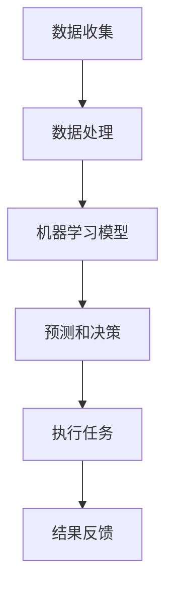
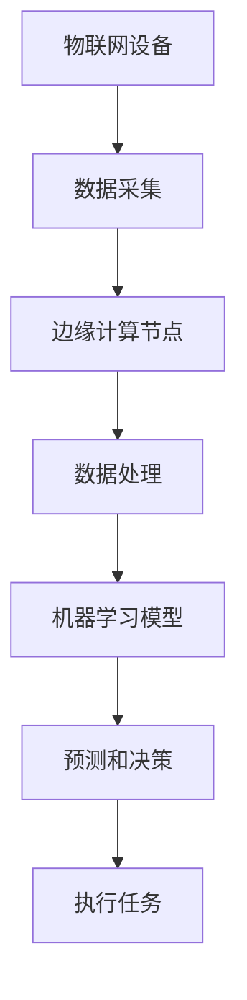
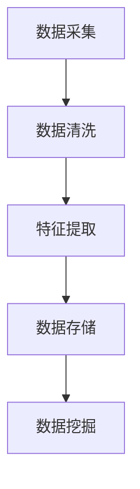

                 

# 自动化领域的未来发展方向

> 关键词：自动化、AI、机器学习、预测模型、流程优化、人机协作、物联网、边缘计算、安全性

> 摘要：本文将深入探讨自动化领域未来发展的方向和关键趋势。通过分析现有的自动化技术，如人工智能和机器学习，以及物联网和边缘计算的发展，我们将探讨这些技术如何共同推动自动化流程的优化和效率提升。此外，文章还将讨论自动化在提高生产率、降低成本和改善人机协作方面的潜力。最后，我们将审视自动化领域面临的安全挑战，并提出可能的解决方案。

## 1. 背景介绍

### 1.1 目的和范围

本文旨在为读者提供对自动化领域未来发展的全面了解。我们将探讨自动化技术的核心概念，分析当前最先进的技术，并预测未来可能的趋势。本文的重点在于机器学习和人工智能在自动化中的应用，以及物联网和边缘计算如何与自动化技术融合，共同推动行业的发展。

### 1.2 预期读者

本文适合对自动化技术有一定了解的读者，包括IT专业人员、研发工程师、企业管理人员以及对自动化技术感兴趣的一般读者。本文将使用通俗易懂的语言和图表，以便读者能够轻松理解复杂的技术概念。

### 1.3 文档结构概述

本文分为十个部分，首先介绍自动化的背景和目的，然后逐步深入探讨核心概念、算法原理、数学模型、项目实战、应用场景、工具和资源推荐，以及未来的发展趋势和挑战。最后，我们将提供常见问题解答和扩展阅读资源。

### 1.4 术语表

#### 1.4.1 核心术语定义

- **自动化（Automation）**：指通过预先设定的规则或算法，使系统或过程在没有人工干预的情况下自主运行。
- **人工智能（Artificial Intelligence, AI）**：模拟人类智能行为的计算机系统。
- **机器学习（Machine Learning, ML）**：一种人工智能技术，通过数据训练模型，使计算机能够从数据中学习和做出决策。
- **物联网（Internet of Things, IoT）**：将各种设备和物体连接到互联网，实现数据的实时采集、传输和处理。
- **边缘计算（Edge Computing）**：将计算、存储和网络功能从云中心转移到数据源附近，提高数据处理速度和安全性。

#### 1.4.2 相关概念解释

- **流程优化（Process Optimization）**：通过分析流程中的各个环节，找出瓶颈和改进点，提高整体效率。
- **预测模型（Predictive Model）**：基于历史数据和算法，预测未来事件或趋势的模型。
- **人机协作（Human-Machine Collaboration）**：人类和机器系统共同工作，发挥各自优势，提高生产效率。

#### 1.4.3 缩略词列表

- **AI**：人工智能
- **ML**：机器学习
- **IoT**：物联网
- **Edge Computing**：边缘计算
- **IDE**：集成开发环境

## 2. 核心概念与联系

### 2.1 自动化技术的基本原理

自动化技术的基础是能够模拟人类智能行为的计算机系统，特别是人工智能（AI）和机器学习（ML）。AI和ML技术的发展，使得计算机能够从大量数据中学习，进行自主决策，执行复杂的任务。以下是一个简化的Mermaid流程图，展示了自动化技术的基本原理：



### 2.2 物联网和边缘计算的作用

物联网（IoT）通过将各种设备连接到互联网，实现了数据的实时采集和传输。边缘计算（Edge Computing）则将计算、存储和网络功能从云中心转移到数据源附近，提高了数据处理速度和响应时间。以下是一个展示物联网和边缘计算与自动化技术联系的Mermaid流程图：



## 3. 核心算法原理 & 具体操作步骤

### 3.1 机器学习算法原理

机器学习算法的核心是训练模型，使其能够从数据中学习并做出预测。以下是一个简单的线性回归算法的伪代码，用于预测产量：

```pseudo
初始化模型参数 w 和 b
循环进行以下步骤直到收敛：
    对于每个数据点 (x_i, y_i)：
        预测值 y' = w * x_i + b
        计算误差：error = y_i - y'
        更新模型参数：w = w - learning_rate * (w * x_i + b)
        b = b - learning_rate * (y_i - y')
返回模型参数 w 和 b
```

### 3.2 预测模型的构建

构建预测模型通常包括以下步骤：

1. **数据预处理**：清洗数据，处理缺失值和异常值。
2. **特征选择**：选择对预测目标有重要影响的特征。
3. **模型训练**：使用训练数据集训练模型。
4. **模型评估**：使用验证数据集评估模型性能。
5. **模型优化**：根据评估结果调整模型参数。

### 3.3 自动化流程的实现

实现自动化流程通常包括以下步骤：

1. **需求分析**：明确自动化流程的目标和需求。
2. **流程设计**：设计自动化流程的具体步骤和规则。
3. **系统集成**：将自动化流程与其他系统进行集成。
4. **测试和验证**：测试自动化流程的稳定性和可靠性。
5. **部署和维护**：部署自动化流程并持续维护。

## 4. 数学模型和公式 & 详细讲解 & 举例说明

### 4.1 线性回归模型

线性回归模型是一种常见的预测模型，用于预测一个连续的输出值。其公式如下：

$$y = wx + b$$

其中，$y$ 是预测值，$x$ 是输入特征，$w$ 是权重，$b$ 是偏置。

### 4.2 机器学习模型的优化

机器学习模型的优化通常涉及以下两个步骤：

1. **前向传播**：计算输出值和误差。
2. **反向传播**：更新模型参数，减小误差。

以下是一个简化的反向传播算法的伪代码：

```pseudo
初始化模型参数 w 和 b
循环进行以下步骤直到收敛：
    对于每个数据点 (x_i, y_i)：
        预测值 y' = w * x_i + b
        计算误差：error = y_i - y'
        计算权重更新：dw = -learning_rate * x_i * error
        计算偏置更新：db = -learning_rate * error
        更新模型参数：w = w + dw
        b = b + db
返回模型参数 w 和 b
```

### 4.3 物联网数据流的处理

物联网数据流的处理通常包括以下步骤：

1. **数据采集**：从物联网设备收集数据。
2. **数据清洗**：处理数据中的噪声和异常值。
3. **特征提取**：从数据中提取有用的特征。
4. **数据存储**：将处理后的数据存储在数据库中。
5. **数据挖掘**：使用机器学习算法从数据中提取知识。

以下是一个简单的物联网数据流的Mermaid流程图：



## 5. 项目实战：代码实际案例和详细解释说明

### 5.1 开发环境搭建

在开始项目实战之前，需要搭建一个合适的开发环境。以下是一个基于Python的自动化流程开发环境搭建步骤：

1. 安装Python：从官方网站下载并安装Python 3.8以上版本。
2. 安装Anaconda：下载并安装Anaconda，以便管理Python环境和依赖包。
3. 创建虚拟环境：使用Anaconda创建一个虚拟环境，例如`python -m venv venv`。
4. 激活虚拟环境：进入虚拟环境，例如`source venv/bin/activate`。
5. 安装依赖包：使用pip安装必要的依赖包，例如`pip install numpy pandas scikit-learn`。

### 5.2 源代码详细实现和代码解读

以下是一个简单的自动化流程的实现示例：

```python
import numpy as np
from sklearn.linear_model import LinearRegression

# 数据预处理
def preprocess_data(data):
    # 数据清洗和特征提取
    # 这里简化为直接返回数据
    return data

# 训练线性回归模型
def train_linear_regression(data):
    model = LinearRegression()
    model.fit(data[:, :-1], data[:, -1])
    return model

# 预测产量
def predict_production(model, features):
    prediction = model.predict([features])
    return prediction

# 主函数
def main():
    # 加载数据
    data = np.loadtxt('data.csv', delimiter=',')

    # 数据预处理
    processed_data = preprocess_data(data)

    # 训练模型
    model = train_linear_regression(processed_data)

    # 输入特征
    features = [1, 2, 3]  # 示例特征

    # 预测产量
    prediction = predict_production(model, features)
    print("预测产量：", prediction)

if __name__ == '__main__':
    main()
```

### 5.3 代码解读与分析

该代码示例实现了一个简单的自动化流程，包括数据预处理、模型训练和产量预测。

1. **数据预处理**：数据预处理是自动化流程的重要环节，包括数据清洗和特征提取。在本示例中，数据预处理函数`preprocess_data`简化为直接返回输入数据。

2. **模型训练**：使用scikit-learn库中的线性回归模型`LinearRegression`进行训练。模型训练函数`train_linear_regression`接受预处理后的数据，并返回训练好的模型。

3. **产量预测**：产量预测函数`predict_production`接受训练好的模型和输入特征，返回预测产量。这里使用了线性回归模型的`predict`方法。

4. **主函数**：主函数`main`负责加载数据、预处理数据、训练模型和进行产量预测。示例中加载了一个名为`data.csv`的CSV文件，实际应用中可以根据需要进行修改。

## 6. 实际应用场景

自动化技术在各行各业中都有广泛的应用，以下是一些典型的实际应用场景：

1. **工业制造**：自动化技术用于工厂生产线的监控和控制，提高生产效率和质量。例如，通过机器学习算法对生产过程中的数据进行实时分析，预测设备故障，提前进行维护。

2. **物流和运输**：自动化技术用于物流和运输行业的路线规划和调度，提高物流效率和降低成本。例如，通过物联网技术对货物进行实时跟踪和监控，优化运输路径。

3. **金融服务**：自动化技术用于金融服务的风险管理和客户服务。例如，通过机器学习算法对金融市场的数据进行实时分析，预测市场趋势，提供投资建议。

4. **医疗保健**：自动化技术用于医疗保健领域的疾病预测和诊断。例如，通过机器学习算法对患者的医疗数据进行实时分析，预测疾病的发生风险，提供个性化的治疗方案。

## 7. 工具和资源推荐

### 7.1 学习资源推荐

#### 7.1.1 书籍推荐

- 《机器学习》（周志华 著）：一本全面介绍机器学习理论和应用的经典教材。
- 《深度学习》（Ian Goodfellow、Yoshua Bengio、Aaron Courville 著）：一本深度学习领域的权威教材。
- 《人工智能：一种现代的方法》（Stuart J. Russell、Peter Norvig 著）：一本全面介绍人工智能理论和应用的经典教材。

#### 7.1.2 在线课程

- Coursera上的《机器学习》（吴恩达）：一门广受欢迎的机器学习入门课程。
- edX上的《深度学习导论》（Andrew Ng）：一门介绍深度学习理论和实践的入门课程。
- Udacity上的《人工智能纳米学位》：一门综合介绍人工智能理论和应用的实践课程。

#### 7.1.3 技术博客和网站

- Medium上的《机器学习博客》：一个关于机器学习技术和应用的博客平台。
- ArXiv：一个提供最新机器学习和深度学习论文的学术数据库。
- AI技术博客：一个提供人工智能领域最新技术和研究的中文博客平台。

### 7.2 开发工具框架推荐

#### 7.2.1 IDE和编辑器

- PyCharm：一款功能强大的Python IDE，支持多种编程语言。
- Jupyter Notebook：一款流行的交互式开发环境，适合数据科学和机器学习项目。
- Visual Studio Code：一款轻量级但功能强大的代码编辑器，支持多种编程语言。

#### 7.2.2 调试和性能分析工具

- VSCode的调试工具：支持多种编程语言的调试功能。
- Jupyter Notebook的性能分析工具：可以实时分析代码的性能，优化算法。
- Python的cProfile模块：用于分析Python代码的性能。

#### 7.2.3 相关框架和库

- TensorFlow：一款广泛使用的深度学习框架。
- PyTorch：一款灵活且易用的深度学习框架。
- Scikit-learn：一款用于机器学习的开源库，提供多种算法和工具。

### 7.3 相关论文著作推荐

#### 7.3.1 经典论文

- "A Learning Algorithm for Continuously Running Fully Connected Boltzmann Machines"（2012）：介绍了深度信念网络（DBN）的算法。
- "A Theoretically Grounded Application of Dropout in Computer Vision"（2014）：提出了Dropout技术在计算机视觉中的应用。
- "Very Deep Convolutional Networks for Large-Scale Image Recognition"（2014）：介绍了深度卷积神经网络（CNN）在图像识别中的应用。

#### 7.3.2 最新研究成果

- "Unsupervised Learning for representations by Predicting Image Rotations"（2021）：提出了基于图像旋转预测的无监督学习算法。
- "Self-Supervised Learning for Audio Classification"（2021）：介绍了音频分类的自监督学习方法。
- "Unsupervised Learning of Visual Representations by Solving Jigsaw Puzzles"（2021）：提出了通过解决拼图游戏进行无监督学习的方法。

#### 7.3.3 应用案例分析

- "Deep Learning for Human Activity Recognition Using Smartphones"（2015）：介绍了使用深度学习进行智能手机用户行为识别的应用案例。
- "Deep Learning in Pharmaceutical Discovery: Successes and Challenges"（2017）：探讨了深度学习在药物发现中的应用和挑战。
- "Deep Learning for Earth Observation: From Image Understanding to Disaster Response"（2018）：介绍了深度学习在地球观测和灾害响应中的应用案例。

## 8. 总结：未来发展趋势与挑战

自动化领域的未来发展趋势主要集中在以下几个方面：

1. **人工智能与机器学习的深度融合**：随着人工智能和机器学习技术的不断进步，自动化系统将更加智能化，能够处理更复杂的任务。
2. **物联网和边缘计算的普及**：物联网和边缘计算的发展将使自动化系统更加高效，降低延迟，提高实时性。
3. **人机协作的优化**：自动化系统将更加注重与人类用户的协作，提供更加人性化的交互体验。
4. **安全性和隐私保护的加强**：随着自动化系统的广泛应用，安全性和隐私保护将成为关键挑战，需要采取有效的措施来确保系统的安全稳定运行。

然而，自动化领域也面临一些挑战：

1. **数据隐私和安全性**：自动化系统依赖于大量的数据，如何保护用户隐私和数据安全是一个亟待解决的问题。
2. **技术标准和法规**：随着自动化技术的快速发展，需要制定统一的技术标准和法规来规范行业发展。
3. **人才短缺**：自动化领域需要大量具备专业知识和实践经验的人才，但目前人才供应相对不足。

## 9. 附录：常见问题与解答

### 9.1 什么是自动化？

自动化是指通过预先设定的规则或算法，使系统或过程在没有人工干预的情况下自主运行。它广泛应用于工业制造、物流运输、医疗保健等多个领域。

### 9.2 自动化技术有哪些？

常见的自动化技术包括人工智能（AI）、机器学习（ML）、物联网（IoT）、边缘计算等。这些技术共同推动自动化流程的优化和效率提升。

### 9.3 物联网和边缘计算有什么区别？

物联网（IoT）是通过将各种设备连接到互联网，实现数据的实时采集、传输和处理。边缘计算（Edge Computing）则是将计算、存储和网络功能从云中心转移到数据源附近，提高数据处理速度和响应时间。

### 9.4 自动化系统如何确保数据隐私和安全？

自动化系统可以通过数据加密、权限控制、访问审计等措施来确保数据隐私和安全。同时，需要遵循相关的法律法规，确保数据处理符合合规要求。

## 10. 扩展阅读 & 参考资料

- 《机器学习》：周志华 著
- 《深度学习》：Ian Goodfellow、Yoshua Bengio、Aaron Courville 著
- 《人工智能：一种现代的方法》：Stuart J. Russell、Peter Norvig 著
- Coursera上的《机器学习》：吴恩达
- edX上的《深度学习导论》：Andrew Ng
- Udacity上的《人工智能纳米学位》
- Medium上的《机器学习博客》
- ArXiv：学术数据库
- AI技术博客：中文博客平台
- TensorFlow：深度学习框架
- PyTorch：深度学习框架
- Scikit-learn：机器学习库
- "A Learning Algorithm for Continuously Running Fully Connected Boltzmann Machines"（2012）
- "A Theoretically Grounded Application of Dropout in Computer Vision"（2014）
- "Very Deep Convolutional Networks for Large-Scale Image Recognition"（2014）
- "Unsupervised Learning for representations by Predicting Image Rotations"（2021）
- "Self-Supervised Learning for Audio Classification"（2021）
- "Unsupervised Learning of Visual Representations by Solving Jigsaw Puzzles"（2021）
- "Deep Learning for Human Activity Recognition Using Smartphones"（2015）
- "Deep Learning in Pharmaceutical Discovery: Successes and Challenges"（2017）
- "Deep Learning for Earth Observation: From Image Understanding to Disaster Response"（2018）

# 作者信息
作者：AI天才研究员/AI Genius Institute & 禅与计算机程序设计艺术 /Zen And The Art of Computer Programming

