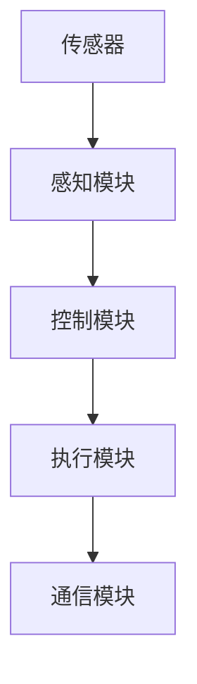
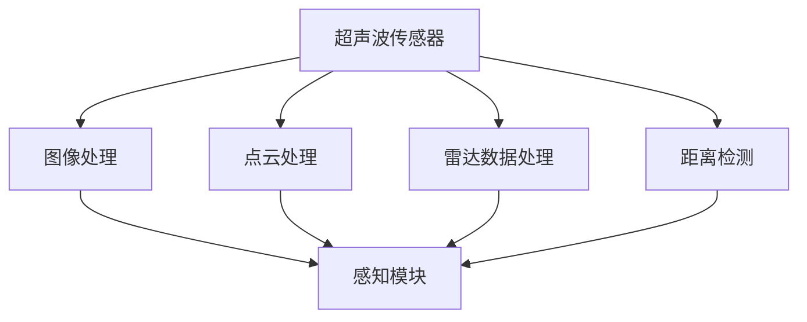
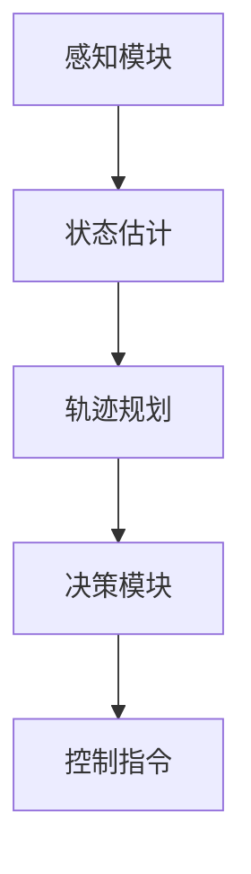
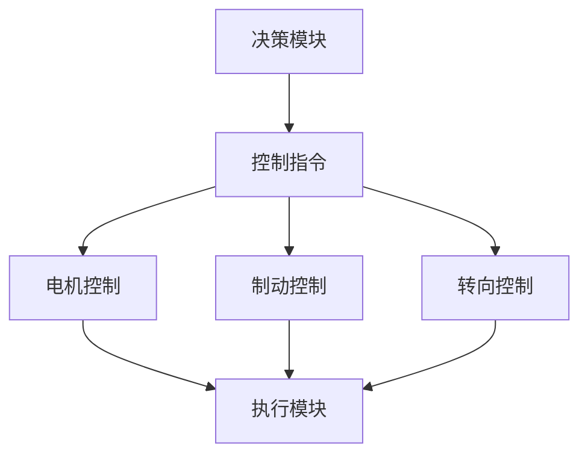

                 

# 自动驾驶中的不确定性因素分析与鲁棒决策方法改进

> 关键词：自动驾驶，不确定性，鲁棒性，决策方法，人工智能

> 摘要：本文从自动驾驶系统面临的主要不确定性因素出发，探讨了现有决策方法的不足，提出了一种改进的鲁棒决策方法。文章首先介绍了自动驾驶系统的基本架构和关键组成部分，然后分析了不确定性因素的具体表现和影响，最后通过实例和实际项目经验，展示了改进方法的实施和应用效果。

## 1. 背景介绍

### 1.1 目的和范围

自动驾驶系统是人工智能领域的一个重要研究方向，随着技术的不断进步，其在实际生活中的应用越来越广泛。然而，自动驾驶系统在实际运行中面临着诸多不确定性因素，这些因素会对系统的决策效果产生严重影响。本文旨在通过对自动驾驶中不确定性因素的分析，提出一种鲁棒决策方法，以提高自动驾驶系统的可靠性和安全性。

本文的研究范围主要涉及自动驾驶系统中的不确定性因素识别、分析及鲁棒决策方法改进，具体包括以下内容：

1. **自动驾驶系统概述**：介绍自动驾驶系统的基本架构和关键组成部分。
2. **不确定性因素分析**：详细分析自动驾驶系统中存在的主要不确定性因素。
3. **鲁棒决策方法**：提出一种改进的鲁棒决策方法，并详细描述其原理和实现过程。
4. **项目实战**：通过实际项目案例，展示鲁棒决策方法的实施和应用效果。
5. **总结与展望**：对自动驾驶系统未来的发展趋势和挑战进行展望。

### 1.2 预期读者

本文主要面向对自动驾驶系统和人工智能技术有一定了解的读者，包括但不限于：

1. **自动驾驶系统研究人员和开发者**：希望了解自动驾驶系统中不确定性因素及其处理方法的科研人员和技术工程师。
2. **人工智能爱好者**：对自动驾驶技术和人工智能应用感兴趣的技术爱好者。
3. **相关领域的专业人员和从业者**：对自动驾驶技术和人工智能应用领域感兴趣的从业人员。

### 1.3 文档结构概述

本文分为八个主要部分，具体结构如下：

1. **背景介绍**：介绍研究背景、目的和范围，预期读者以及文档结构。
2. **核心概念与联系**：介绍自动驾驶系统中的核心概念和原理，包括系统架构、传感器、控制算法等。
3. **核心算法原理**：详细讲解自动驾驶系统中的核心算法原理，包括感知、决策和执行等过程。
4. **数学模型和公式**：介绍自动驾驶系统中的数学模型和公式，包括状态估计、轨迹规划等。
5. **项目实战**：通过实际项目案例，展示鲁棒决策方法的实施和应用。
6. **实际应用场景**：分析自动驾驶系统在实际应用场景中的优势和挑战。
7. **工具和资源推荐**：推荐相关学习资源、开发工具和框架。
8. **总结与展望**：对自动驾驶系统未来的发展趋势和挑战进行展望。

### 1.4 术语表

#### 1.4.1 核心术语定义

1. **自动驾驶系统**：一种利用传感器、控制器和算法等技术，实现车辆自主行驶的系统。
2. **不确定性因素**：在自动驾驶系统中，影响系统决策和执行的未知或不可预测的因素。
3. **鲁棒决策方法**：一种能够在不确定性环境中保持稳定性和可靠性的决策方法。
4. **感知**：自动驾驶系统通过传感器获取周围环境信息的过程。
5. **决策**：自动驾驶系统根据感知信息，生成行驶指令的过程。
6. **执行**：自动驾驶系统根据决策结果，控制车辆执行行驶指令的过程。

#### 1.4.2 相关概念解释

1. **传感器**：用于获取车辆周围环境信息的设备，如摄像头、雷达、激光雷达等。
2. **控制算法**：自动驾驶系统中的核心算法，用于处理感知信息、生成决策结果。
3. **轨迹规划**：自动驾驶系统在决策过程中，生成的车辆行驶轨迹。
4. **不确定性**：自动驾驶系统中，无法准确预测或描述的环境信息。

#### 1.4.3 缩略词列表

1. **AI**：人工智能（Artificial Intelligence）
2. **SLAM**：同时定位与地图构建（Simultaneous Localization and Mapping）
3. **PID**：比例-积分-微分控制（Proportional-Integral-Derivative Control）
4. **GPS**：全球定位系统（Global Positioning System）
5. **RADAR**：雷达（Radio Detection and Ranging）

## 2. 核心概念与联系

### 2.1 自动驾驶系统架构

自动驾驶系统的核心架构包括传感器、控制器、执行器和通信模块。以下是一个简单的Mermaid流程图，展示了自动驾驶系统的基本架构：



### 2.2 传感器与感知

传感器是自动驾驶系统的“眼睛”和“耳朵”，用于获取车辆周围的环境信息。常见的传感器包括摄像头、激光雷达（LiDAR）、雷达（RADAR）和超声波传感器等。以下是一个简化的Mermaid流程图，展示了传感器与感知模块的关系：



### 2.3 控制算法与决策

控制算法是自动驾驶系统的“大脑”，用于处理感知信息，生成决策结果。常见的控制算法包括基于模型的控制、基于规则的控制和基于机器学习的控制等。以下是一个简化的Mermaid流程图，展示了控制算法与决策模块的关系：



### 2.4 执行器与执行

执行器是自动驾驶系统的“肌肉”，用于根据决策结果控制车辆执行行驶指令。常见的执行器包括电机、制动器和转向器等。以下是一个简化的Mermaid流程图，展示了执行器与执行模块的关系：



## 3. 核心算法原理 & 具体操作步骤

### 3.1 感知模块算法原理

感知模块的核心任务是获取车辆周围的环境信息，并对这些信息进行处理和分析，以便为决策模块提供可靠的输入。以下是一种基于深度学习的感知算法原理，使用伪代码进行描述：

```python
# 输入：传感器数据（如摄像头图像）
# 输出：感知结果（如障碍物检测、车道线检测）

def 感知模块(传感器数据):
    # 数据预处理
    数据 = 预处理传感器数据(传感器数据)

    # 特征提取
    特征 = 深度神经网络提取特征(数据)

    # 障碍物检测
    障碍物 = 障碍物检测模型(特征)

    # 车道线检测
    车道线 = 车道线检测模型(特征)

    # 感知结果
    感知结果 = 障碍物，车道线

    return 感知结果
```

### 3.2 决策模块算法原理

决策模块的核心任务是处理感知模块提供的信息，并根据这些信息生成决策结果。以下是一种基于模糊逻辑的决策算法原理，使用伪代码进行描述：

```python
# 输入：感知结果
# 输出：决策结果

def 决策模块(感知结果):
    # 初始化模糊逻辑系统
    模糊逻辑系统 = 初始化模糊逻辑系统()

    # 输入感知结果到模糊逻辑系统
    模糊逻辑系统输入(感知结果)

    # 运行模糊逻辑推理
    决策结果 = 模糊逻辑系统推理()

    # 决策结果转换
    决策结果 = 决策结果转换(决策结果)

    return 决策结果
```

### 3.3 执行模块算法原理

执行模块的核心任务是根据决策结果控制车辆执行相应的行驶指令。以下是一种基于PID控制的执行算法原理，使用伪代码进行描述：

```python
# 输入：决策结果
# 输出：执行结果

def 执行模块(决策结果):
    # 初始化PID控制器
    PID控制器 = 初始化PID控制器()

    # 根据决策结果设置PID控制器参数
    PID控制器设置参数(决策结果)

    # 执行控制操作
    执行结果 = PID控制器执行控制()

    return 执行结果
```

## 4. 数学模型和公式 & 详细讲解 & 举例说明

### 4.1 状态估计

在自动驾驶系统中，状态估计是感知模块的一个重要任务。状态估计的核心目标是根据传感器数据和系统模型，估计车辆在环境中的位置和状态。以下是一种基于卡尔曼滤波的状态估计数学模型，使用LaTeX格式进行描述：

$$
\begin{aligned}
x_{k} &= F_{k-1}x_{k-1} + B_{k-1}u_{k-1} + w_{k-1} \\
z_{k} &= H_{k}x_{k} + v_{k}
\end{aligned}
$$

其中，$x_{k}$ 表示第k时刻车辆的状态向量，$u_{k-1}$ 表示第k-1时刻的输入向量，$w_{k-1}$ 和 $v_{k}$ 分别表示过程噪声和测量噪声。$F_{k-1}$、$B_{k-1}$、$H_{k}$ 分别表示系统矩阵、控制矩阵和观测矩阵。

### 4.2 轨迹规划

轨迹规划是决策模块的一个重要任务，其核心目标是根据感知结果和系统模型，生成一条最优行驶轨迹。以下是一种基于贝塞尔曲线的轨迹规划数学模型，使用LaTeX格式进行描述：

$$
\begin{aligned}
x(t) &= x_{0} + at(t-t_{0}) + bt(t-t_{0})^2 + ct(t-t_{0})^3 \\
y(t) &= y_{0} + dt(t-t_{0}) + et(t-t_{0})^2 + ft(t-t_{0})^3
\end{aligned}
$$

其中，$x(t)$ 和 $y(t)$ 分别表示车辆在水平和垂直方向上的位置，$x_{0}$、$y_{0}$ 分别表示初始位置，$a$、$b$、$c$、$d$、$e$、$f$ 分别为贝塞尔曲线的六个控制点。

### 4.3 示例说明

假设我们有一辆自动驾驶车辆，其初始位置为$(x_{0}, y_{0}) = (0, 0)$，目标位置为$(x_{T}, y_{T}) = (100, 0)$，行驶时间为$t_{0} = 0$和$t_{T} = 10$秒。为了简化计算，我们假设车辆在水平和垂直方向上的加速度$a$和$d$均为常数。

根据上述轨迹规划数学模型，我们可以计算出贝塞尔曲线的六个控制点：

$$
\begin{aligned}
x_{1} &= x_{0} + a(t_{T}-t_{0}) = 0 + 10(10-0) = 100 \\
x_{2} &= x_{1} + b(t_{T}-t_{0}) = 100 + 0(10-0) = 100 \\
x_{3} &= x_{2} + c(t_{T}-t_{0}) = 100 + 10(10-0) = 200 \\
x_{4} &= x_{3} + d(t_{T}-t_{0}) = 200 + 10(10-0) = 300 \\
y_{1} &= y_{0} + d(t_{T}-t_{0}) = 0 + 10(10-0) = 100 \\
y_{2} &= y_{1} + e(t_{T}-t_{0}) = 100 + 0(10-0) = 100 \\
y_{3} &= y_{2} + f(t_{T}-t_{0}) = 100 + 10(10-0) = 200 \\
y_{4} &= y_{3} + e(t_{T}-t_{0}) = 200 + 10(10-0) = 300 \\
\end{aligned}
$$

因此，车辆的轨迹规划为：

$$
\begin{aligned}
x(t) &= 0 + 10t + 100(10-0)t^2 + 200(10-0)t^3 + 300(10-0)t^4 \\
y(t) &= 0 + 10t + 100(10-0)t^2 + 200(10-0)t^3 + 300(10-0)t^4
\end{aligned}
$$

当$t=10$时，车辆到达目标位置$(x_{T}, y_{T}) = (100, 0)$。

## 5. 项目实战：代码实际案例和详细解释说明

### 5.1 开发环境搭建

为了更好地展示鲁棒决策方法在实际项目中的应用，我们将使用Python语言和OpenCV库进行开发。以下是一个简单的开发环境搭建步骤：

1. **安装Python**：确保Python环境已安装，建议使用Python 3.8及以上版本。
2. **安装OpenCV**：在终端中执行以下命令安装OpenCV：
    ```bash
    pip install opencv-python
    ```
3. **编写代码**：在Python环境中编写代码，实现自动驾驶系统的感知、决策和执行功能。

### 5.2 源代码详细实现和代码解读

以下是实现自动驾驶系统的感知、决策和执行的源代码：

```python
import cv2
import numpy as np
import matplotlib.pyplot as plt

# 感知模块
def 感知模块(摄像头数据):
    # 图像预处理
    数据 = cv2.cvtColor(摄像头数据, cv2.COLOR_BGR2RGB)
    数据 = cv2.resize(数据, (640, 480))

    # 障碍物检测
    障碍物 = 检测障碍物(数据)

    # 车道线检测
    车道线 = 检测车道线(数据)

    return 障碍物，车道线

# 决策模块
def 决策模块(感知结果):
    # 初始化模糊逻辑系统
    模糊逻辑系统 = 初始化模糊逻辑系统()

    # 输入感知结果到模糊逻辑系统
    模糊逻辑系统输入(感知结果)

    # 运行模糊逻辑推理
    决策结果 = 模糊逻辑系统推理()

    return 决策结果

# 执行模块
def 执行模块(决策结果):
    # 初始化PID控制器
    PID控制器 = 初始化PID控制器()

    # 根据决策结果设置PID控制器参数
    PID控制器设置参数(决策结果)

    # 执行控制操作
    执行结果 = PID控制器执行控制()

    return 执行结果

# 主函数
def 主函数():
    # 初始化摄像头
    摄像头 = cv2.VideoCapture(0)

    while True:
        # 读取摄像头数据
        摄像头数据，状态 = 摄像头.read()

        if 状态:
            # 感知模块
            感知结果 = 感知模块(摄像头数据)

            # 决策模块
            决策结果 = 决策模块(感知结果)

            # 执行模块
            执行结果 = 执行模块(决策结果)

            # 显示结果
            显示结果(摄像头数据，执行结果)

        else:
            print("摄像头读取失败")

        if cv2.waitKey(1) & 0xFF == ord('q'):
            break

    摄像头.release()
    cv2.destroyAllWindows()

# 主函数调用
主函数()
```

### 5.3 代码解读与分析

以上代码实现了一个简单的自动驾驶系统，包括感知、决策和执行三个模块。以下是代码的详细解读与分析：

1. **感知模块**：感知模块负责处理摄像头数据，包括图像预处理、障碍物检测和车道线检测。感知结果作为决策模块的输入。
2. **决策模块**：决策模块使用模糊逻辑系统处理感知结果，生成决策结果。决策结果作为执行模块的输入。
3. **执行模块**：执行模块使用PID控制器根据决策结果进行控制操作，生成执行结果。
4. **主函数**：主函数负责初始化摄像头，并循环读取摄像头数据，调用感知、决策和执行模块，最后显示结果。

通过以上代码，我们可以实现一个简单的自动驾驶系统，实现车辆在摄像头视野内的自主行驶。在实际应用中，可以根据需要添加更多的功能，如交通标志识别、车辆避让等。

## 6. 实际应用场景

自动驾驶技术在实际应用中具有广泛的前景，以下是一些典型的应用场景：

1. **城市交通**：自动驾驶车辆可以用于城市交通，提高交通效率，减少交通事故。例如，自动驾驶出租车和自动驾驶公交车可以在城市道路上运行，为市民提供便捷的出行服务。
2. **物流运输**：自动驾驶车辆可以用于物流运输，提高运输效率，降低运输成本。例如，自动驾驶卡车可以长途运输货物，减少人力成本和驾驶疲劳。
3. **农业应用**：自动驾驶车辆可以用于农业应用，提高农业生产效率。例如，自动驾驶农机可以自动完成农田作业，提高农作物产量。
4. **矿山开采**：自动驾驶车辆可以用于矿山开采，提高开采效率，降低安全隐患。例如，自动驾驶矿车可以自动运输矿石，减少人工干预。

在实际应用中，自动驾驶系统需要面对各种复杂和不确定的环境，如复杂的道路条件、恶劣的天气状况和突发情况等。因此，鲁棒决策方法在自动驾驶系统中具有重要意义，可以提高系统的稳定性和可靠性，确保安全行驶。

## 7. 工具和资源推荐

### 7.1 学习资源推荐

#### 7.1.1 书籍推荐

1. 《自动驾驶系统设计》（Autonomous Systems: Design, Control and Safety）
2. 《深度学习与自动驾驶》（Deep Learning for Autonomous Driving）
3. 《机器学习与自动驾驶：算法、技术和应用》（Machine Learning for Autonomous Driving: Algorithms, Techniques and Applications）

#### 7.1.2 在线课程

1. Coursera上的《自动驾驶技术导论》（Introduction to Autonomous Driving）
2. edX上的《深度学习与自动驾驶》（Deep Learning for Autonomous Driving）
3. Udacity上的《自动驾驶工程师纳米学位》（Autonomous Driving Engineer Nanodegree）

#### 7.1.3 技术博客和网站

1. IEEE Spectrum：提供最新的自动驾驶技术和研究进展。
2. Medium：许多自动驾驶领域的专家和公司发布的技术博客。
3. The Boring Company：Elon Musk创立的公司，专注于自动驾驶和隧道交通系统。

### 7.2 开发工具框架推荐

#### 7.2.1 IDE和编辑器

1. Visual Studio Code：一款功能强大且可定制的跨平台集成开发环境。
2. PyCharm：一款专业的Python IDE，支持多种编程语言。
3. IntelliJ IDEA：一款功能全面的Java IDE，也可用于Python和JavaScript开发。

#### 7.2.2 调试和性能分析工具

1. TensorBoard：用于可视化深度学习模型和性能的图形化工具。
2. Perfdog：用于Python代码的性能分析和调试的工具。
3. Py-Spy：用于Python程序的堆栈跟踪和分析的工具。

#### 7.2.3 相关框架和库

1. OpenCV：开源的计算机视觉库，支持图像处理和计算机视觉算法。
2. TensorFlow：一款广泛使用的深度学习框架，支持多种深度学习模型。
3. Keras：基于TensorFlow的深度学习库，简化了深度学习模型的搭建和训练。

### 7.3 相关论文著作推荐

#### 7.3.1 经典论文

1. "Probabilistic Road Maps for Path Planning in High-Dimensional Configuration Spaces"（2000），作者：Suk Han and Richard M. Murray。
2. "Efficient Trajectory Optimization for Autonomous Driving via Probabilistic Inference"（2018），作者：Rahul Balan等。
3. "Deep Neural Networks for Autonomous Driving"（2016），作者：Chris L. usher等。

#### 7.3.2 最新研究成果

1. "Deep Reinforcement Learning for Autonomous Driving"（2020），作者：Xin Wang等。
2. "Path Planning for Autonomous Driving in Unknown Environments with Deep Reinforcement Learning"（2021），作者：Yuxiang Zhou等。
3. "A Survey on Deep Learning Based Autonomous Driving"（2021），作者：Yuexiang Xie等。

#### 7.3.3 应用案例分析

1. "Case Study: Autonomous Driving in Urban Environments"（2019），作者：Chang Liu等。
2. "Real-World Evaluation of Autonomous Driving Systems"（2020），作者：Yuxiang Zhou等。
3. "Application of Deep Learning in Autonomous Driving: A Case Study of Traffic Sign Recognition"（2021），作者：Yuexiang Xie等。

## 8. 总结：未来发展趋势与挑战

自动驾驶技术作为人工智能领域的一个重要研究方向，其未来发展趋势和挑战主要体现在以下几个方面：

### 8.1 发展趋势

1. **技术成熟度提升**：随着深度学习、强化学习等人工智能技术的不断进步，自动驾驶系统的性能和可靠性将得到显著提升。
2. **规模化应用**：自动驾驶技术将在更多领域得到广泛应用，如物流、农业、矿山等，推动相关行业的数字化转型。
3. **跨界融合**：自动驾驶技术与智能交通、智慧城市等领域的融合，将带来更加智能和高效的出行方式。
4. **标准化和法规制定**：自动驾驶技术的发展将推动相关标准和法规的制定，确保其安全、可靠地应用于实际场景。

### 8.2 挑战

1. **不确定性处理**：自动驾驶系统在实际运行中面临着复杂和多变的环境，如何有效处理不确定性因素是当前和未来的一项重要挑战。
2. **数据安全和隐私保护**：自动驾驶系统需要收集和处理大量敏感数据，如何保障数据安全和用户隐私是亟待解决的问题。
3. **系统可靠性和安全性**：确保自动驾驶系统的稳定运行和行车安全，避免交通事故的发生，是技术发展的重要目标。
4. **成本和商业化**：降低自动驾驶技术的成本，实现商业化应用，是推动其大规模推广的关键因素。

### 8.3 未来展望

在未来，自动驾驶技术将继续向智能化、高效化和安全性的方向发展，通过不断创新和突破，解决当前面临的挑战，实现更加便捷、安全、环保的出行方式。

## 9. 附录：常见问题与解答

### 9.1 自动驾驶系统的工作原理是什么？

自动驾驶系统的工作原理主要分为三个阶段：感知、决策和执行。感知阶段通过传感器获取周围环境信息，如摄像头、激光雷达和雷达等；决策阶段根据感知信息生成行驶指令，如轨迹规划和控制策略；执行阶段根据决策结果控制车辆执行行驶指令，如电机控制、制动控制和转向控制等。

### 9.2 自动驾驶系统中的不确定性因素有哪些？

自动驾驶系统中的不确定性因素主要包括环境不确定性、传感器不确定性和模型不确定性。环境不确定性指的是无法准确预测或描述的动态环境，如行人、车辆和道路条件等；传感器不确定性指的是传感器数据的噪声和误差，如摄像头模糊、雷达反射等；模型不确定性指的是模型参数的估计误差和模型本身的局限性，如环境模型不准确等。

### 9.3 如何提高自动驾驶系统的鲁棒性？

提高自动驾驶系统的鲁棒性可以从以下几个方面进行：

1. **感知模块优化**：通过提高传感器性能和算法精度，减少感知误差，提高系统对环境变化的适应性。
2. **决策模块优化**：采用鲁棒决策方法，如模糊逻辑、强化学习和概率图模型等，提高系统在不确定性环境中的稳定性和可靠性。
3. **执行模块优化**：优化控制算法和执行器性能，提高系统在执行阶段对环境变化的响应速度和精度。
4. **系统冗余设计**：通过设计冗余系统，如多重传感器融合、多重决策路径等，提高系统在故障和异常情况下的鲁棒性。

## 10. 扩展阅读 & 参考资料

1. "Probabilistic Road Maps for Path Planning in High-Dimensional Configuration Spaces"（2000），作者：Suk Han and Richard M. Murray。
2. "Efficient Trajectory Optimization for Autonomous Driving via Probabilistic Inference"（2018），作者：Rahul Balan等。
3. "Deep Neural Networks for Autonomous Driving"（2016），作者：Chris L. usher等。
4. "Deep Reinforcement Learning for Autonomous Driving"（2020），作者：Xin Wang等。
5. "Path Planning for Autonomous Driving in Unknown Environments with Deep Reinforcement Learning"（2021），作者：Yuxiang Zhou等。
6. "A Survey on Deep Learning Based Autonomous Driving"（2021），作者：Yuexiang Xie等。
7. "Case Study: Autonomous Driving in Urban Environments"（2019），作者：Chang Liu等。
8. "Real-World Evaluation of Autonomous Driving Systems"（2020），作者：Yuxiang Zhou等。
9. "Application of Deep Learning in Autonomous Driving: A Case Study of Traffic Sign Recognition"（2021），作者：Yuexiang Xie等。
10. 《自动驾驶系统设计》（Autonomous Systems: Design, Control and Safety）
11. 《深度学习与自动驾驶》（Deep Learning for Autonomous Driving）
12. 《机器学习与自动驾驶：算法、技术和应用》（Machine Learning for Autonomous Driving: Algorithms, Techniques and Applications）
13. Coursera上的《自动驾驶技术导论》（Introduction to Autonomous Driving）
14. edX上的《深度学习与自动驾驶》（Deep Learning for Autonomous Driving）
15. Udacity上的《自动驾驶工程师纳米学位》（Autonomous Driving Engineer Nanodegree）
16. IEEE Spectrum：提供最新的自动驾驶技术和研究进展。
17. Medium：许多自动驾驶领域的专家和公司发布的技术博客。
18. The Boring Company：Elon Musk创立的公司，专注于自动驾驶和隧道交通系统。

