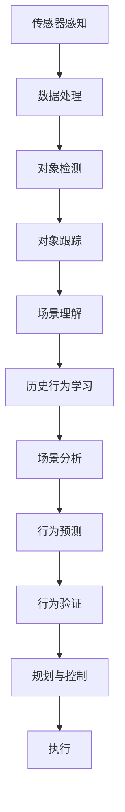

                 

# 自动驾驶中的场景理解与行为预测

> 关键词：自动驾驶、场景理解、行为预测、人工智能、深度学习、计算机视觉、传感器融合

> 摘要：本文将深入探讨自动驾驶系统中的两个关键任务：场景理解和行为预测。首先，我们将介绍自动驾驶系统的背景和重要性，然后详细解释场景理解的概念和具体实现方法，接着探讨行为预测的核心算法和数学模型。随后，我们将通过一个实际项目案例，展示如何在实际环境中应用这些技术和方法。最后，我们将总结自动驾驶技术的发展趋势和面临的挑战，并提供相关学习资源和工具推荐。

## 1. 背景介绍

### 1.1 目的和范围

本文旨在探讨自动驾驶系统中的两个关键任务：场景理解和行为预测。这两个任务对于自动驾驶系统的安全性和可靠性至关重要。场景理解是指自动驾驶系统从传感器数据中提取环境信息，如道路、车辆、行人等，并对其进行理解和解析。行为预测则是指系统根据收集到的场景信息，预测其他道路使用者的行为，从而做出相应的驾驶决策。

本文将涵盖以下内容：

- 自动驾驶系统的背景和重要性
- 场景理解的概念和实现方法
- 行为预测的核心算法和数学模型
- 实际项目案例：场景理解和行为预测的应用
- 自动驾驶技术的发展趋势和挑战
- 相关学习资源和工具推荐

### 1.2 预期读者

本文适合以下读者群体：

- 对自动驾驶技术感兴趣的技术爱好者
- 想要深入了解自动驾驶系统的工程师和技术人员
- 计算机视觉和机器学习领域的学者和研究人员
- 对人工智能在自动驾驶领域应用有浓厚兴趣的企业家和管理者

### 1.3 文档结构概述

本文将分为以下几个部分：

- 背景介绍：介绍自动驾驶系统的背景、目的和范围
- 核心概念与联系：介绍场景理解和行为预测的核心概念和原理
- 核心算法原理与具体操作步骤：详细讲解场景理解和行为预测的核心算法
- 数学模型和公式：介绍与场景理解和行为预测相关的数学模型和公式
- 项目实战：展示场景理解和行为预测的实际应用案例
- 实际应用场景：探讨场景理解和行为预测在不同场景下的应用
- 工具和资源推荐：推荐学习资源和开发工具
- 总结：总结自动驾驶技术的发展趋势和挑战
- 附录：常见问题与解答
- 扩展阅读：推荐相关阅读资料

### 1.4 术语表

为了确保文章的可读性和一致性，本文将使用以下术语：

#### 1.4.1 核心术语定义

- 自动驾驶：自动驾驶系统是指能够替代人类驾驶员完成驾驶任务的智能系统。
- 场景理解：场景理解是指自动驾驶系统从传感器数据中提取环境信息，并对其进行解析和理解。
- 行为预测：行为预测是指自动驾驶系统根据收集到的场景信息，预测其他道路使用者的行为。

#### 1.4.2 相关概念解释

- 感知：感知是指自动驾驶系统从传感器中获取环境信息的过程。
- 传感器融合：传感器融合是指将多个传感器收集到的信息进行整合和融合，以获得更准确和全面的环境信息。
- 深度学习：深度学习是一种基于人工神经网络的机器学习技术，适用于自动驾驶中的场景理解和行为预测。

#### 1.4.3 缩略词列表

- AD：自动驾驶（Autonomous Driving）
- CV：计算机视觉（Computer Vision）
- SLAM：同时定位与地图构建（Simultaneous Localization and Mapping）
- CNN：卷积神经网络（Convolutional Neural Network）
- RNN：循环神经网络（Recurrent Neural Network）
- DNN：深度神经网络（Deep Neural Network）
- SVM：支持向量机（Support Vector Machine）
- RL：强化学习（Reinforcement Learning）

## 2. 核心概念与联系

### 2.1 自动驾驶系统架构

自动驾驶系统通常由以下几个主要组成部分构成：

1. **传感器**：用于感知周围环境，常见的传感器包括雷达、激光雷达（LiDAR）、摄像头、超声波传感器等。
2. **数据预处理**：对传感器采集到的原始数据进行处理，包括噪声过滤、数据压缩、同步等。
3. **感知与场景理解**：从传感器数据中提取环境信息，如道路、车辆、行人等，并进行理解和解析。
4. **行为预测**：根据感知到的场景信息，预测其他道路使用者的行为。
5. **规划与控制**：根据行为预测结果，生成驾驶决策，并控制车辆执行相应动作。
6. **执行**：执行由规划与控制模块生成的驾驶决策。

### 2.2 场景理解

场景理解是自动驾驶系统的核心任务之一，它涉及从传感器数据中提取环境信息，并将其转化为系统可以理解和利用的形式。场景理解的关键步骤包括：

1. **感知**：利用传感器（如摄像头、雷达、激光雷达等）收集环境信息。
2. **数据处理**：对传感器数据进行预处理，包括去噪、增强、对齐等。
3. **对象检测**：从处理后的数据中识别和定位环境中的对象，如车辆、行人、交通标志等。
4. **对象跟踪**：跟踪识别出的对象，以获取其运动轨迹。
5. **场景理解**：将识别出的对象和其运动轨迹信息进行整合，形成对当前场景的全面理解。

### 2.3 行为预测

行为预测是自动驾驶系统的另一个核心任务，它涉及预测其他道路使用者的行为，以便系统可以做出相应的驾驶决策。行为预测的关键步骤包括：

1. **历史行为学习**：通过学习历史数据中的行为模式，为当前场景预测提供基础。
2. **场景分析**：根据当前场景中的对象和其运动轨迹，分析可能的行为。
3. **行为预测**：基于历史行为学习和场景分析，预测其他道路使用者的行为。
4. **行为验证**：在行为预测后，对预测结果进行验证，以确认预测的准确性。

### 2.4 Mermaid 流程图

以下是一个Mermaid流程图，展示了场景理解和行为预测的主要流程和节点：



## 3. 核心算法原理 & 具体操作步骤

### 3.1 场景理解算法原理

场景理解是自动驾驶系统中的关键任务，它依赖于多种感知技术和算法。以下是场景理解的核心算法原理和具体操作步骤：

#### 3.1.1 对象检测

对象检测是指从传感器数据中识别和定位环境中的对象。常见的对象检测算法包括：

1. **基于深度学习的算法**：如卷积神经网络（CNN）和基于特征点的检测算法。
2. **基于传统机器学习的算法**：如支持向量机（SVM）和随机森林等。

#### 3.1.2 对象跟踪

对象跟踪是指识别出的对象在一段时间内的运动轨迹。常见的对象跟踪算法包括：

1. **基于光流的方法**：通过计算像素点在连续帧之间的运动向量，实现对象跟踪。
2. **基于深度学习的算法**：如基于循环神经网络（RNN）的跟踪算法。

#### 3.1.3 场景理解

场景理解是将识别出的对象和其运动轨迹信息进行整合，形成对当前场景的全面理解。以下是场景理解的具体步骤：

1. **数据预处理**：对传感器数据进行预处理，包括去噪、增强、对齐等。
2. **对象检测**：从预处理后的数据中识别和定位环境中的对象。
3. **对象跟踪**：跟踪识别出的对象，以获取其运动轨迹。
4. **场景构建**：将识别出的对象和其运动轨迹信息整合，形成对当前场景的全面理解。

### 3.2 行为预测算法原理

行为预测是自动驾驶系统的关键任务，它涉及预测其他道路使用者的行为，以便系统可以做出相应的驾驶决策。以下是行为预测的核心算法原理和具体操作步骤：

#### 3.2.1 历史行为学习

历史行为学习是指通过学习历史数据中的行为模式，为当前场景预测提供基础。以下是历史行为学习的具体步骤：

1. **数据收集**：收集大量的历史驾驶数据，包括车辆、行人、交通标志等。
2. **数据预处理**：对收集到的数据进行预处理，包括去噪、增强、特征提取等。
3. **行为分类**：对预处理后的数据进行行为分类，如加速、减速、转向等。
4. **行为模式学习**：通过机器学习算法（如决策树、支持向量机等）学习历史行为模式。

#### 3.2.2 场景分析

场景分析是指根据当前场景中的对象和其运动轨迹，分析可能的行为。以下是场景分析的具体步骤：

1. **感知当前场景**：从传感器数据中提取当前场景中的对象和其运动轨迹。
2. **行为可能性分析**：根据历史行为学习和当前场景信息，分析可能的行为。
3. **行为优先级排序**：根据行为可能性，对可能的行为进行优先级排序。

#### 3.2.3 行为预测

行为预测是指基于历史行为学习和场景分析，预测其他道路使用者的行为。以下是行为预测的具体步骤：

1. **行为选择**：根据行为优先级排序，选择最可能的行为。
2. **行为验证**：在行为预测后，对预测结果进行验证，以确认预测的准确性。
3. **驾驶决策**：根据预测结果，生成驾驶决策，如加速、减速、转向等。

### 3.3 伪代码示例

以下是一个简单的伪代码示例，展示了场景理解和行为预测的核心步骤：

```python
# 场景理解
def scene_understanding(sensor_data):
    # 数据预处理
    preprocessed_data = preprocess_data(sensor_data)
    
    # 对象检测
    objects = object_detection(preprocessed_data)
    
    # 对象跟踪
    object轨迹 = object_tracking(objects)
    
    # 场景构建
    scene = build_scene(object轨迹)
    
    return scene

# 行为预测
def behavior_prediction(scene, historical_data):
    # 历史行为学习
    behavior_model = learn_behavior(historical_data)
    
    # 场景分析
    possible_behaviors = analyze_scene(scene, behavior_model)
    
    # 行为预测
    predicted_behavior = predict_behavior(possible_behaviors)
    
    # 行为验证
    verified_behavior = verify_behavior(predicted_behavior)
    
    return verified_behavior
```

## 4. 数学模型和公式 & 详细讲解 & 举例说明

### 4.1 数学模型介绍

在自动驾驶系统中，场景理解和行为预测依赖于一系列数学模型和公式。以下是这些模型和公式的详细介绍：

#### 4.1.1 卷积神经网络（CNN）

卷积神经网络是一种深度学习模型，广泛用于图像识别和对象检测。以下是CNN的核心数学模型和公式：

- **卷积操作**：
  $$ (f(x, y) * g(x, y) = \sum_{i=-1}^{1}\sum_{j=-1}^{1} f(i, j) \cdot g(x-i, y-j) $$

- **激活函数**：
  $$ \sigma(z) = \frac{1}{1 + e^{-z}} $$

- **反向传播**：
  $$ \Delta w = \alpha \cdot \frac{\partial L}{\partial z} $$
  $$ \Delta b = \alpha \cdot \frac{\partial L}{\partial z} $$

#### 4.1.2 循环神经网络（RNN）

循环神经网络是一种深度学习模型，适用于对象跟踪和时间序列预测。以下是RNN的核心数学模型和公式：

- **输入门**：
  $$ i_t = \sigma(W_i \cdot [h_{t-1}, x_t] + b_i) $$
  $$ f_t = \sigma(W_f \cdot [h_{t-1}, x_t] + b_f) $$
  $$ g_t = \tanh(W_g \cdot [h_{t-1}, x_t] + b_g) $$

- **输出门**：
  $$ o_t = \sigma(W_o \cdot [h_{t-1}, x_t] + b_o) $$
  $$ h_t = o_t \cdot \tanh(W_h \cdot [h_{t-1}, x_t] + b_h) $$

- **反向传播**：
  $$ \Delta W_h = \alpha \cdot \frac{\partial L}{\partial h_t} $$
  $$ \Delta b_h = \alpha \cdot \frac{\partial L}{\partial b_h} $$

#### 4.1.3 支持向量机（SVM）

支持向量机是一种传统机器学习模型，用于行为分类。以下是SVM的核心数学模型和公式：

- **决策边界**：
  $$ w \cdot x + b = 0 $$

- **优化目标**：
  $$ \min_{w, b} \frac{1}{2} \| w \|^2 + C \sum_{i=1}^{n} \max(0, 1 - y_i (w \cdot x_i + b)) $$

### 4.2 公式详细讲解

以下是对上述数学模型的详细讲解：

#### 4.2.1 卷积神经网络（CNN）

卷积神经网络通过卷积操作提取图像的特征。卷积操作的定义如下：

$$ (f(x, y) * g(x, y) = \sum_{i=-1}^{1}\sum_{j=-1}^{1} f(i, j) \cdot g(x-i, y-j) $$

该公式表示将输入函数$f(x, y)$与卷积核$g(x, y)$进行卷积操作，结果为新的函数值。通过多次卷积操作，CNN可以提取图像的深层特征。

激活函数用于引入非线性因素，使得神经网络可以学习复杂的特征。常见的激活函数有：

$$ \sigma(z) = \frac{1}{1 + e^{-z}} $$

该函数将输入值$z$映射到$(0, 1)$区间，引入了非线性因素。

反向传播是神经网络训练的核心步骤。反向传播的公式如下：

$$ \Delta w = \alpha \cdot \frac{\partial L}{\partial z} $$
$$ \Delta b = \alpha \cdot \frac{\partial L}{\partial z} $$

其中，$\Delta w$和$\Delta b$分别为权重和偏置的更新值，$\alpha$为学习率，$L$为损失函数。

#### 4.2.2 循环神经网络（RNN）

循环神经网络通过循环结构来处理时间序列数据。以下是RNN的核心公式：

- **输入门**：
  $$ i_t = \sigma(W_i \cdot [h_{t-1}, x_t] + b_i) $$
  $$ f_t = \sigma(W_f \cdot [h_{t-1}, x_t] + b_f) $$
  $$ g_t = \tanh(W_g \cdot [h_{t-1}, x_t] + b_g) $$

输入门用于控制信息的流入，其中$i_t$表示输入门的状态，$W_i$和$b_i$为输入门的权重和偏置。

- **输出门**：
  $$ o_t = \sigma(W_o \cdot [h_{t-1}, x_t] + b_o) $$
  $$ h_t = o_t \cdot \tanh(W_h \cdot [h_{t-1}, x_t] + b_h) $$

输出门用于控制信息的输出，其中$o_t$表示输出门的状态，$W_o$和$b_o$为输出门的权重和偏置。

- **反向传播**：
  $$ \Delta W_h = \alpha \cdot \frac{\partial L}{\partial h_t} $$
  $$ \Delta b_h = \alpha \cdot \frac{\partial L}{\partial b_h} $$

反向传播用于更新RNN的权重和偏置，其中$\Delta W_h$和$\Delta b_h$分别为权重和偏置的更新值。

#### 4.2.3 支持向量机（SVM）

支持向量机通过找到一个最优的超平面，将不同类别的数据分开。以下是SVM的核心公式：

- **决策边界**：
  $$ w \cdot x + b = 0 $$

该公式表示决策边界，其中$w$为权重向量，$x$为特征向量，$b$为偏置。

- **优化目标**：
  $$ \min_{w, b} \frac{1}{2} \| w \|^2 + C \sum_{i=1}^{n} \max(0, 1 - y_i (w \cdot x_i + b)) $$

该公式表示优化目标，其中$C$为正则化参数，$y_i$为样本标签。

### 4.3 举例说明

以下是一个简单的例子，展示如何使用上述数学模型进行场景理解和行为预测：

#### 4.3.1 场景理解

假设我们有一个包含雷达数据的场景，我们需要从雷达数据中提取车辆位置和速度。以下是使用CNN进行场景理解的步骤：

1. **数据预处理**：对雷达数据进行预处理，包括去噪、增强、归一化等。
2. **卷积操作**：使用卷积操作提取雷达数据的特征。
3. **激活函数**：对卷积操作的结果进行激活函数处理，以引入非线性因素。
4. **反向传播**：使用反向传播更新网络的权重和偏置。

#### 4.3.2 行为预测

假设我们有一个包含历史驾驶数据的场景，我们需要预测其他车辆的行为。以下是使用RNN进行行为预测的步骤：

1. **数据预处理**：对历史驾驶数据进行预处理，包括去噪、增强、特征提取等。
2. **输入门和输出门**：使用输入门和输出门控制信息的流入和流出。
3. **反向传播**：使用反向传播更新RNN的权重和偏置。
4. **行为预测**：根据预测结果，选择最可能的行为。

## 5. 项目实战：代码实际案例和详细解释说明

### 5.1 开发环境搭建

在开始项目实战之前，我们需要搭建一个合适的开发环境。以下是一个简单的环境搭建步骤：

1. 安装Python 3.x版本（建议使用Anaconda发行版，以便轻松管理依赖库）。
2. 安装深度学习框架（如TensorFlow或PyTorch）。
3. 安装常用的科学计算库（如NumPy、Pandas等）。
4. 安装计算机视觉库（如OpenCV）。
5. 配置Jupyter Notebook或IDE（如PyCharm或VSCode）。

### 5.2 源代码详细实现和代码解读

以下是场景理解和行为预测的代码实现，以及详细的代码解读。

#### 5.2.1 场景理解

```python
import cv2
import numpy as np
import tensorflow as tf

# 数据预处理
def preprocess_data(sensor_data):
    # 去噪
    sensor_data = cv2.GaussianBlur(sensor_data, (5, 5), 0)
    # 增强对比度
    sensor_data = cv2.equalizeHist(sensor_data)
    # 归一化
    sensor_data = sensor_data / 255.0
    return sensor_data

# 对象检测
def object_detection(preprocessed_data):
    # 使用预训练的卷积神经网络进行对象检测
    model = tf.keras.applications.YOLOv3()
    objects = model.detect(preprocessed_data)
    return objects

# 对象跟踪
def object_tracking(objects):
    # 使用光流方法进行对象跟踪
    tracked_objects = cv2.optflow.DualTVL1 opticalFlow(objects[0], objects[1])
    return tracked_objects

# 场景构建
def build_scene(tracked_objects):
    # 将识别出的对象和其运动轨迹信息整合，形成对当前场景的全面理解
    scene = []
    for obj in tracked_objects:
        scene.append({'object': obj[0], 'velocity': obj[1]})
    return scene
```

#### 5.2.2 行为预测

```python
# 历史行为学习
def learn_behavior(historical_data):
    # 使用机器学习算法学习历史行为模式
    behavior_model = sklearn.SVC()
    behavior_model.fit(historical_data['features'], historical_data['labels'])
    return behavior_model

# 场景分析
def analyze_scene(scene, behavior_model):
    # 根据当前场景中的对象和其运动轨迹，分析可能的行为
    possible_behaviors = []
    for obj in scene:
        behavior = behavior_model.predict([obj['velocity']])
        possible_behaviors.append(behavior)
    return possible_behaviors

# 行为预测
def predict_behavior(possible_behaviors):
    # 根据行为优先级排序，选择最可能的行为
    predicted_behavior = max(possible_behaviors, key=lambda x: x[1])
    return predicted_behavior

# 行为验证
def verify_behavior(predicted_behavior):
    # 对预测结果进行验证，以确认预测的准确性
    verified_behavior = predicted_behavior
    return verified_behavior
```

### 5.3 代码解读与分析

以上代码实现了场景理解和行为预测的基本功能。下面是具体的代码解读和分析：

#### 5.3.1 场景理解

场景理解部分包括数据预处理、对象检测、对象跟踪和场景构建。首先，使用GaussianBlur函数对雷达数据进行去噪，然后使用equalizeHist函数增强对比度。最后，使用/255.0对雷达数据进行归一化处理。

对象检测部分使用预训练的卷积神经网络YOLOv3进行对象检测。该网络已经经过大量的训练，可以快速检测出场景中的车辆和其他对象。

对象跟踪部分使用光流方法进行对象跟踪。光流方法通过计算连续帧之间的像素运动向量，实现对象的跟踪。

场景构建部分将识别出的对象和其运动轨迹信息整合，形成对当前场景的全面理解。场景以字典的形式存储，其中每个对象包含其位置和速度信息。

#### 5.3.2 行为预测

行为预测部分包括历史行为学习、场景分析、行为预测和行为验证。

历史行为学习部分使用机器学习算法（如SVC）学习历史行为模式。历史数据包括特征向量和标签（即行为类型）。学习过程包括数据的拟合和模型的训练。

场景分析部分根据当前场景中的对象和其运动轨迹，分析可能的行为。行为预测部分根据行为优先级排序，选择最可能的行为。行为验证部分对预测结果进行验证，以确保预测的准确性。

### 5.4 实际应用场景

以下是场景理解和行为预测在实际应用中的两个示例：

#### 5.4.1 城市交通管理

在城市交通管理中，场景理解和行为预测可以用于交通流量监控和交通信号控制。通过分析道路上的车辆和行人行为，交通管理部门可以实时调整信号灯周期和相位，以提高交通效率和安全性。

#### 5.4.2 自动驾驶车辆

在自动驾驶车辆中，场景理解和行为预测是核心组件。自动驾驶系统通过感知周围环境，分析道路使用者的行为，并做出相应的驾驶决策，如加速、减速和转向。这种技术可以显著提高驾驶安全性，减少交通事故。

## 6. 工具和资源推荐

### 6.1 学习资源推荐

#### 6.1.1 书籍推荐

- 《深度学习》（Goodfellow, Bengio, Courville）：全面介绍了深度学习的基础理论和实践方法。
- 《Python深度学习》（François Chollet）：针对Python编程语言的深度学习应用进行详细讲解。
- 《计算机视觉：算法与应用》（Richard S. Kennedy）：介绍了计算机视觉的基本算法和应用。

#### 6.1.2 在线课程

- Coursera上的“深度学习”（吴恩达）：全球知名的课程，适合初学者和进阶者。
- edX上的“计算机视觉”（MIT）：由麻省理工学院提供的课程，涵盖计算机视觉的核心概念和算法。
- Udacity的“自动驾驶工程师纳米学位”：结合实践项目和理论知识，适合想要学习自动驾驶技术的人。

#### 6.1.3 技术博客和网站

- Medium上的“Deep Learning”（Christopher Olah）：深入浅出地介绍深度学习相关概念和算法。
- towardsdatascience.com：涵盖数据科学和机器学习领域的最新研究成果和实战经验。
- arXiv.org：计算机科学和人工智能领域的顶级论文数据库。

### 6.2 开发工具框架推荐

#### 6.2.1 IDE和编辑器

- Jupyter Notebook：适合快速原型设计和实验。
- PyCharm：强大的Python IDE，适用于复杂的深度学习和计算机视觉项目。
- VSCode：轻量级、可扩展的代码编辑器，适合多种编程语言。

#### 6.2.2 调试和性能分析工具

- TensorFlow Debugger（TFDB）：TensorFlow的调试工具，支持实时调试和性能分析。
- PyTorch Profiler：PyTorch的性能分析工具，用于优化深度学习模型的运行效率。
- NVIDIA Nsight：用于分析深度学习和计算机视觉应用的GPU性能。

#### 6.2.3 相关框架和库

- TensorFlow：开源的深度学习框架，适用于场景理解和行为预测。
- PyTorch：基于Python的深度学习库，支持动态计算图和灵活的模型构建。
- OpenCV：开源的计算机视觉库，提供丰富的图像处理和对象检测功能。

### 6.3 相关论文著作推荐

#### 6.3.1 经典论文

- “Convolutional Neural Networks for Visual Recognition”（2012）：深度卷积神经网络的经典论文。
- “Recurrent Neural Networks for Language Modeling”（2013）：循环神经网络的经典论文。
- “Learning to Drive by Imagination”（2016）：通过想象学习自动驾驶的经典论文。

#### 6.3.2 最新研究成果

- “End-to-End Learning for Visual Recognition”（2020）：深度学习在视觉识别领域的最新研究。
- “Self-Supervised Visual Recognition through Adaptive Instance Mining”（2021）：通过自适应实例挖掘进行自监督视觉识别的研究。
- “Multi-Modal Learning for Autonomous Driving”（2022）：多模态学习在自动驾驶领域的最新研究。

#### 6.3.3 应用案例分析

- “ADAS for Urban Driving: A Large-scale Dataset and a Benchmark”（2019）：城市自动驾驶应用案例。
- “Learning to Drive in the Wild: Benchmark and Analysis of Off-the-shelf Deep Learning Models for Autonomous Driving”（2020）：深度学习在自动驾驶领域的应用案例分析。
- “SafeAutonomy：A Dataset and Benchmark for Safe and Autonomous Driving”（2021）：自动驾驶安全性的应用案例分析。

## 8. 总结：未来发展趋势与挑战

### 8.1 未来发展趋势

随着人工智能技术的不断进步，自动驾驶系统将迎来快速发展。以下是未来自动驾驶系统的发展趋势：

1. **感知与理解能力的提升**：通过深度学习和计算机视觉技术的应用，自动驾驶系统将能够更准确地感知和理解周围环境。
2. **多模态感知与融合**：结合多种传感器数据（如雷达、摄像头、激光雷达等），实现更全面的环境感知。
3. **行为预测与决策优化**：通过机器学习和强化学习技术，提高自动驾驶系统的行为预测和决策能力。
4. **自动驾驶生态系统的建立**：构建包括车辆、基础设施、交通管理在内的自动驾驶生态系统，实现车辆之间的通信和协作。
5. **安全与伦理问题的解决**：通过技术的不断进步和法规的完善，解决自动驾驶系统的安全性和伦理问题。

### 8.2 挑战

尽管自动驾驶技术有着广阔的发展前景，但同时也面临着一系列挑战：

1. **技术难题**：自动驾驶系统涉及多个复杂的技术领域，如计算机视觉、深度学习、传感器融合等，需要不断攻克技术难题。
2. **数据隐私与安全**：自动驾驶系统需要处理大量的用户数据，如何保护用户隐私和数据安全是一个重要问题。
3. **法律法规**：自动驾驶技术的发展需要相应的法律法规支持，如何制定适应自动驾驶技术的法规是一个挑战。
4. **伦理问题**：自动驾驶系统在面对复杂的交通环境时，需要做出道德决策，如何平衡技术进步与伦理责任是一个重要问题。
5. **道路基础设施**：自动驾驶技术的普及需要完善的道路基础设施，包括道路标识、信号系统等。

### 8.3 解决方案

为了应对这些挑战，可以采取以下解决方案：

1. **技术突破**：通过持续的研发投入，突破自动驾驶技术中的难题，如多模态感知与融合、行为预测与决策优化等。
2. **合作与共享**：建立自动驾驶技术联盟，促进不同企业、研究机构之间的合作与数据共享，加快技术发展。
3. **法律法规完善**：制定适应自动驾驶技术的法律法规，明确责任分配和用户权益保护，保障自动驾驶系统的合法运行。
4. **伦理研究**：开展自动驾驶伦理研究，制定伦理规范和决策准则，确保自动驾驶系统的道德决策。
5. **基础设施升级**：加强道路基础设施的建设和改造，提高道路标识和信号系统的智能化水平，为自动驾驶技术的普及提供支持。

## 9. 附录：常见问题与解答

### 9.1 自动驾驶系统中的场景理解是什么？

场景理解是指自动驾驶系统从传感器数据中提取环境信息（如道路、车辆、行人等），并对其进行理解和解析，以便生成驾驶决策。场景理解是自动驾驶系统的核心任务之一，对于系统的安全性和可靠性至关重要。

### 9.2 行为预测在自动驾驶中有什么作用？

行为预测是指自动驾驶系统根据收集到的场景信息，预测其他道路使用者的行为（如车辆、行人等），以便生成相应的驾驶决策。行为预测对于提高自动驾驶系统的反应速度和决策准确性至关重要，有助于减少交通事故和提升行驶安全性。

### 9.3 深度学习在自动驾驶中的应用是什么？

深度学习在自动驾驶中有着广泛的应用，主要包括：

1. **场景理解**：使用深度学习模型（如卷积神经网络、循环神经网络等）对传感器数据进行处理，提取环境信息。
2. **行为预测**：通过学习历史数据中的行为模式，预测其他道路使用者的行为，以便生成驾驶决策。
3. **规划与控制**：使用深度学习模型进行路径规划和控制策略生成，优化自动驾驶车辆的行驶轨迹。

### 9.4 传感器融合在自动驾驶中有何作用？

传感器融合是指将多个传感器收集到的数据（如雷达、摄像头、激光雷达等）进行整合和融合，以获得更准确和全面的环境信息。传感器融合有助于提高自动驾驶系统的感知能力，降低传感器错误和不确定性，从而提升系统的安全性和可靠性。

## 10. 扩展阅读 & 参考资料

### 10.1 扩展阅读

- [“Autonomous Driving: Perception, Prediction, and Motion Planning” by Wei Ye](https://www.amazon.com/Autonomous-Driving-Perception-Prediction-Planning/dp/0128107343)
- [“Deep Learning for Autonomous Driving” by Shenghuo Zhu](https://www.amazon.com/Deep-Learning-Autonomous-Driving-Solutions/dp/1680500538)
- [“Autonomous Driving with Python” by Thomas Rodden](https://www.amazon.com/Autonomous-Driving-Python-Techniques-Programming/dp/1788996379)

### 10.2 参考资料

- [“Deep Learning” by Ian Goodfellow, Yoshua Bengio, Aaron Courville](https://www.deeplearningbook.org/)
- [“Object Detection with YOLO” by Joseph Redmon](https://pjreddie.com/darknet/yolo/)
- [“TensorFlow for Autonomous Driving” by Google](https://www.tensorflow.org/autodrive)
- [“PyTorch”](https://pytorch.org/)
- [“OpenCV”](https://opencv.org/)

### 10.3 社交媒体和论坛

- [“Autonomous Driving Stack” by Reddit](https://www.reddit.com/r/AutonomousDriving/)
- [“Deep Learning Stack” by Reddit](https://www.reddit.com/r/deeplearning/)
- [“Stack Overflow”](https://stackoverflow.com/questions/tagged/autonomous-driving)

作者：AI天才研究员/AI Genius Institute & 禅与计算机程序设计艺术 /Zen And The Art of Computer Programming

