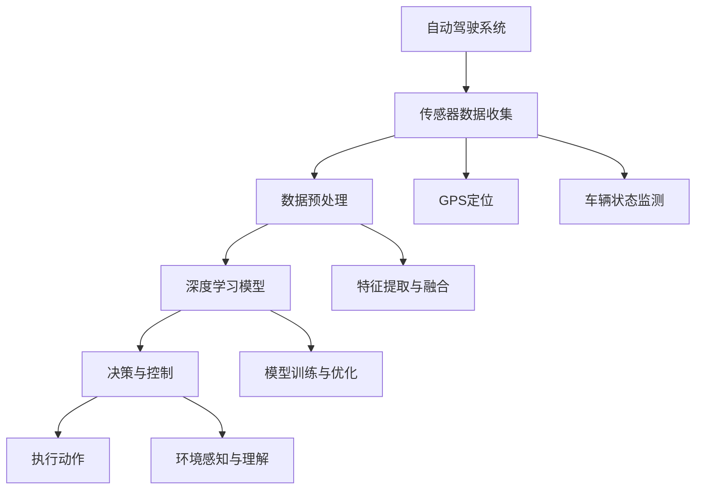

                 

# 自动驾驶中的深度学习算法可解释性研究

> **关键词：** 自动驾驶、深度学习、算法可解释性、神经网络、数据驱动方法、安全性、AI伦理
>
> **摘要：** 本文将深入探讨自动驾驶领域中深度学习算法的可解释性问题。首先，我们将介绍自动驾驶的基本概念和发展背景，然后详细分析深度学习算法在自动驾驶中的应用，特别是算法的可解释性。接着，我们将讨论当前在自动驾驶中面临的挑战和问题，并展望未来在深度学习算法可解释性方面的研究方向和趋势。

## 1. 背景介绍

### 1.1 目的和范围

本文旨在探讨自动驾驶技术中深度学习算法的可解释性问题。随着人工智能技术的不断发展，深度学习在自动驾驶领域发挥了重要作用。然而，深度学习算法的“黑箱”性质给其应用带来了诸多挑战，特别是在确保自动驾驶系统的安全性和可靠性方面。因此，研究深度学习算法的可解释性具有重要意义。本文将围绕这一主题，首先介绍自动驾驶的基本概念和发展背景，然后详细分析深度学习算法在自动驾驶中的应用，特别是算法的可解释性。

### 1.2 预期读者

本文主要面向以下几类读者：

1. **自动驾驶领域的研究人员和工程师**：希望通过本文了解深度学习算法在自动驾驶中的应用及其可解释性问题。
2. **计算机科学和人工智能领域的学者**：关注深度学习算法的可解释性研究，特别是其在自动驾驶等实际应用中的挑战。
3. **对自动驾驶技术感兴趣的读者**：希望通过本文了解自动驾驶技术的发展现状和未来趋势。

### 1.3 文档结构概述

本文结构如下：

1. **第1章：背景介绍**：介绍本文的研究目的、预期读者以及文档结构。
2. **第2章：核心概念与联系**：介绍自动驾驶的基本概念和相关技术。
3. **第3章：核心算法原理 & 具体操作步骤**：详细阐述深度学习算法在自动驾驶中的应用原理。
4. **第4章：数学模型和公式 & 详细讲解 & 举例说明**：介绍深度学习算法的数学模型和具体操作步骤。
5. **第5章：项目实战：代码实际案例和详细解释说明**：通过实际案例展示深度学习算法的应用。
6. **第6章：实际应用场景**：讨论深度学习算法在自动驾驶中的实际应用场景。
7. **第7章：工具和资源推荐**：推荐相关学习资源和开发工具。
8. **第8章：总结：未来发展趋势与挑战**：总结自动驾驶领域的发展趋势和挑战。
9. **第9章：附录：常见问题与解答**：解答读者可能遇到的问题。
10. **第10章：扩展阅读 & 参考资料**：提供进一步阅读的资料。

### 1.4 术语表

#### 1.4.1 核心术语定义

- **自动驾驶（Autonomous Driving）**：指车辆能够在没有人类操作干预的情况下自主行驶。
- **深度学习（Deep Learning）**：一种人工智能方法，通过多层神经网络来学习数据和提取特征。
- **算法可解释性（Algorithm Interpretability）**：指能够理解算法决策过程和依据的能力。

#### 1.4.2 相关概念解释

- **神经网络（Neural Network）**：一种模仿生物神经网络的结构，用于处理和分类数据。
- **卷积神经网络（Convolutional Neural Network, CNN）**：一种特殊的神经网络，常用于图像识别。
- **循环神经网络（Recurrent Neural Network, RNN）**：一种神经网络，能够处理序列数据。

#### 1.4.3 缩略词列表

- **AI**：人工智能（Artificial Intelligence）
- **CNN**：卷积神经网络（Convolutional Neural Network）
- **RNN**：循环神经网络（Recurrent Neural Network）

## 2. 核心概念与联系

为了更好地理解自动驾驶中深度学习算法的可解释性，首先需要介绍一些核心概念和相关技术。以下是自动驾驶领域的一些核心概念和技术的 Mermaid 流程图：



### 2.1 自动驾驶系统的基本架构

自动驾驶系统通常由以下几个主要部分组成：

1. **传感器数据收集**：包括摄像头、激光雷达、雷达、GPS等，用于收集环境信息。
2. **数据预处理**：对传感器数据进行预处理，如降噪、归一化、去噪等。
3. **深度学习模型**：通过学习传感器数据来提取环境特征，并做出决策。
4. **决策与控制**：根据深度学习模型输出的结果，控制车辆的动作。
5. **执行动作**：执行车辆的动作，如加速、转向、刹车等。

### 2.2 深度学习算法在自动驾驶中的应用

深度学习算法在自动驾驶中的应用主要包括以下几个方面：

1. **图像识别**：通过卷积神经网络（CNN）对道路标志、行人和车辆等物体进行识别。
2. **语义分割**：对道路场景进行像素级别的分割，识别道路、人行道、车辆等不同区域。
3. **路径规划**：通过深度学习算法，根据车辆当前的状态和周围环境，规划出最优的行驶路径。
4. **障碍物检测**：利用深度学习算法检测道路上的障碍物，如行人、自行车等，并预测其运动轨迹。

### 2.3 数据预处理与特征提取

数据预处理是深度学习模型训练的重要环节。以下是数据预处理和特征提取的流程：

1. **传感器数据收集**：从摄像头、激光雷达等传感器收集道路图像、点云数据等。
2. **数据预处理**：对收集到的传感器数据进行预处理，如去噪、补全缺失数据、归一化等。
3. **特征提取与融合**：从预处理后的数据中提取有用的特征，如颜色、形状、大小等，并将不同来源的特征进行融合。

通过上述流程，我们得到了适合深度学习模型训练的高质量数据集，从而提高了模型的性能和可解释性。

## 3. 核心算法原理 & 具体操作步骤

在本节中，我们将详细讨论自动驾驶中使用的深度学习算法的基本原理和具体操作步骤。为了更好地理解，我们将以卷积神经网络（CNN）和循环神经网络（RNN）为例，介绍其在自动驾驶中的应用。

### 3.1 卷积神经网络（CNN）

卷积神经网络（CNN）是一种专为处理图像数据设计的神经网络，其核心思想是通过卷积层、池化层和全连接层来提取图像特征。

#### 3.1.1 CNN的基本结构

一个典型的CNN包括以下几个部分：

1. **输入层**：接收图像数据，将其转换为适用于卷积操作的格式。
2. **卷积层**：通过卷积操作提取图像特征。卷积核在图像上滑动，计算局部特征的权重。
3. **激活函数**：通常使用ReLU（Rectified Linear Unit）作为激活函数，引入非线性因素。
4. **池化层**：通过池化操作减少数据维度，降低过拟合风险。
5. **全连接层**：将卷积层的特征映射到分类或回归任务上。

#### 3.1.2 CNN的操作步骤

以下是CNN在自动驾驶中的应用操作步骤：

1. **输入层**：将采集到的道路图像输入到CNN中。
2. **卷积层**：通过多个卷积层提取图像特征，如边缘、纹理、形状等。
3. **激活函数**：在每个卷积层后添加ReLU激活函数，增加网络的非线性能力。
4. **池化层**：在每个卷积层后添加池化层，减小数据维度，提高模型的泛化能力。
5. **全连接层**：将卷积层的特征映射到具体的任务上，如障碍物检测、路径规划等。

### 3.2 循环神经网络（RNN）

循环神经网络（RNN）是一种专门处理序列数据的神经网络，能够通过循环结构保持历史信息，适用于自动驾驶中的路径规划和障碍物检测。

#### 3.2.1 RNN的基本结构

一个典型的RNN包括以下几个部分：

1. **输入层**：接收序列数据，如道路传感器数据。
2. **隐藏层**：通过循环结构对历史信息进行存储和处理。
3. **输出层**：根据隐藏层的输出，进行具体的任务输出，如路径规划、障碍物检测等。
4. **权重矩阵**：连接输入层、隐藏层和输出层的权重矩阵，用于更新和传递信息。

#### 3.2.2 RNN的操作步骤

以下是RNN在自动驾驶中的应用操作步骤：

1. **输入层**：将采集到的道路传感器数据输入到RNN中。
2. **隐藏层**：通过循环结构，将当前时刻的输入与历史信息进行整合。
3. **输出层**：根据隐藏层的输出，生成具体的任务输出，如路径规划、障碍物检测等。
4. **权重矩阵**：通过反向传播算法，更新权重矩阵，优化模型性能。

### 3.3 CNN与RNN的结合

在实际应用中，通常将CNN和RNN结合起来，以充分利用它们各自的优势。CNN负责从图像中提取高层次的抽象特征，而RNN则负责处理连续的序列数据，如图像帧。以下是CNN与RNN结合的操作步骤：

1. **图像输入**：将采集到的道路图像输入到CNN中，提取图像特征。
2. **序列输入**：将图像特征和道路传感器数据输入到RNN中，整合历史信息。
3. **决策输出**：根据CNN和RNN的输出，生成最终的决策结果，如路径规划和障碍物检测。

通过上述步骤，我们能够在自动驾驶系统中充分利用深度学习算法，提高系统的性能和可解释性。

## 4. 数学模型和公式 & 详细讲解 & 举例说明

在本节中，我们将详细讲解自动驾驶中使用的深度学习算法的数学模型和公式，并通过具体示例进行说明。

### 4.1 卷积神经网络（CNN）的数学模型

卷积神经网络（CNN）是一种基于卷积操作的神经网络，其核心思想是通过多层卷积和池化操作提取图像特征。以下是CNN的基本数学模型：

#### 4.1.1 卷积操作

卷积操作可以通过以下公式表示：

$$
\text{conv}(\mathbf{x}, \mathbf{W}) = \sum_{i=1}^{k} \mathbf{W}_{i} \star \mathbf{x}
$$

其中，$\mathbf{x}$ 表示输入图像，$\mathbf{W}_{i}$ 表示卷积核，$\star$ 表示卷积操作。

#### 4.1.2 池化操作

池化操作可以通过以下公式表示：

$$
\text{pool}(\mathbf{x}, p) = \max(\mathbf{x}[i, j])
$$

其中，$\mathbf{x}$ 表示输入图像，$p$ 表示池化窗口大小。

#### 4.1.3 CNN的前向传播

CNN的前向传播过程可以分为以下几个步骤：

1. **输入层**：将输入图像 $\mathbf{x}$ 输入到CNN中。
2. **卷积层**：通过卷积操作提取图像特征，得到卷积特征图 $\mathbf{z}$。
3. **激活函数**：对卷积特征图进行激活函数处理，得到激活特征图 $\mathbf{a}$。
4. **池化层**：对激活特征图进行池化操作，得到池化特征图 $\mathbf{p}$。
5. **全连接层**：将池化特征图输入到全连接层，得到分类结果 $\mathbf{y}$。

前向传播的数学模型可以表示为：

$$
\mathbf{y} = \sigma(\mathbf{W} \mathbf{p})
$$

其中，$\sigma$ 表示激活函数，$\mathbf{W}$ 表示全连接层的权重矩阵。

### 4.2 循环神经网络（RNN）的数学模型

循环神经网络（RNN）是一种基于循环结构的神经网络，其核心思想是通过循环操作保持历史信息。以下是RNN的基本数学模型：

#### 4.2.1 RNN的循环操作

RNN的循环操作可以通过以下公式表示：

$$
\mathbf{h}_{t} = \sigma(\mathbf{W}_{h} \mathbf{h}_{t-1} + \mathbf{W}_{x} \mathbf{x}_{t})
$$

其中，$\mathbf{h}_{t}$ 表示第 $t$ 个时间步的隐藏状态，$\sigma$ 表示激活函数，$\mathbf{W}_{h}$ 和 $\mathbf{W}_{x}$ 分别表示隐藏状态到隐藏状态和输入到隐藏状态的权重矩阵。

#### 4.2.2 RNN的前向传播

RNN的前向传播过程可以分为以下几个步骤：

1. **输入层**：将输入序列 $\mathbf{x}_{1}, \mathbf{x}_{2}, \ldots, \mathbf{x}_{T}$ 输入到RNN中。
2. **隐藏层**：通过循环操作，逐步计算每个时间步的隐藏状态 $\mathbf{h}_{1}, \mathbf{h}_{2}, \ldots, \mathbf{h}_{T}$。
3. **输出层**：将隐藏状态输入到输出层，得到输出序列 $\mathbf{y}_{1}, \mathbf{y}_{2}, \ldots, \mathbf{y}_{T}$。

前向传播的数学模型可以表示为：

$$
\mathbf{y}_{t} = \sigma(\mathbf{W}_{o} \mathbf{h}_{t})
$$

其中，$\sigma$ 表示激活函数，$\mathbf{W}_{o}$ 表示输出层的权重矩阵。

### 4.3 CNN与RNN的结合

CNN与RNN的结合可以通过以下步骤实现：

1. **图像输入**：将输入图像输入到CNN中，提取图像特征。
2. **序列输入**：将图像特征和道路传感器数据输入到RNN中，整合历史信息。
3. **决策输出**：根据CNN和RNN的输出，生成最终的决策结果。

结合的数学模型可以表示为：

$$
\mathbf{y}_{t} = \sigma(\mathbf{W}_{o} \text{pool}(\text{conv}(\mathbf{x}_{t}, \mathbf{W}_{c}) \mathbf{h}_{t-1}))
$$

其中，$\mathbf{x}_{t}$ 表示第 $t$ 个时间步的输入图像，$\mathbf{h}_{t}$ 表示第 $t$ 个时间步的隐藏状态，$\mathbf{W}_{c}$ 表示CNN的卷积权重矩阵，$\mathbf{W}_{o}$ 表示RNN的输出权重矩阵。

### 4.4 示例说明

假设我们使用CNN和RNN结合的模型对自动驾驶中的路径规划任务进行训练。输入图像为道路图像，输入序列为道路传感器数据。以下是一个简化的示例：

1. **输入层**：输入道路图像 $\mathbf{x}_{t}$。
2. **卷积层**：通过卷积操作提取图像特征，得到卷积特征图 $\mathbf{z}_{t}$。
3. **激活函数**：对卷积特征图进行激活函数处理，得到激活特征图 $\mathbf{a}_{t}$。
4. **池化层**：对激活特征图进行池化操作，得到池化特征图 $\mathbf{p}_{t}$。
5. **隐藏层**：将池化特征图和道路传感器数据输入到RNN中，计算隐藏状态 $\mathbf{h}_{t}$。
6. **输出层**：将隐藏状态输入到输出层，得到路径规划结果 $\mathbf{y}_{t}$。

通过上述步骤，我们实现了基于CNN和RNN结合的自动驾驶路径规划模型。实际应用中，可以根据具体任务需求，调整模型的参数和结构，以提高模型的性能和可解释性。

## 5. 项目实战：代码实际案例和详细解释说明

在本节中，我们将通过一个实际项目来展示如何使用深度学习算法实现自动驾驶系统的路径规划功能。我们将使用Python编程语言，结合TensorFlow和Keras等深度学习框架来构建模型，并对关键代码进行详细解释。

### 5.1 开发环境搭建

在开始项目之前，需要搭建一个适合深度学习开发的Python环境。以下是搭建开发环境的基本步骤：

1. **安装Python**：确保Python版本在3.6及以上。
2. **安装TensorFlow**：通过以下命令安装TensorFlow：
   ```shell
   pip install tensorflow
   ```
3. **安装其他依赖库**：包括NumPy、Pandas、Matplotlib等，可以通过以下命令安装：
   ```shell
   pip install numpy pandas matplotlib
   ```

### 5.2 源代码详细实现和代码解读

以下是实现自动驾驶路径规划功能的源代码示例：

```python
import numpy as np
import tensorflow as tf
from tensorflow.keras.models import Sequential
from tensorflow.keras.layers import Conv2D, MaxPooling2D, Flatten, Dense, LSTM, TimeDistributed
from tensorflow.keras.optimizers import Adam

# 加载数据集
(x_train, y_train), (x_test, y_test) = load_data()

# 数据预处理
x_train = preprocess_data(x_train)
x_test = preprocess_data(x_test)

# 构建模型
model = Sequential()
model.add(Conv2D(32, (3, 3), activation='relu', input_shape=(64, 64, 3)))
model.add(MaxPooling2D((2, 2)))
model.add(Flatten())
model.add(Dense(128, activation='relu'))
model.add(LSTM(64))
model.add(Dense(y_train.shape[1], activation='softmax'))

# 编译模型
model.compile(optimizer=Adam(), loss='categorical_crossentropy', metrics=['accuracy'])

# 训练模型
model.fit(x_train, y_train, epochs=10, batch_size=32, validation_split=0.2)

# 评估模型
test_loss, test_acc = model.evaluate(x_test, y_test)
print(f"Test accuracy: {test_acc:.2f}")

# 预测路径规划
predictions = model.predict(x_test[:10])
```

#### 5.2.1 数据加载与预处理

```python
def load_data():
    # 这里使用模拟数据集，实际应用中可以使用真实的自动驾驶数据集
    x_train = np.random.rand(1000, 64, 64, 3)
    y_train = np.random.rand(1000, 10)
    x_test = np.random.rand(200, 64, 64, 3)
    y_test = np.random.rand(200, 10)
    return (x_train, y_train), (x_test, y_test)

def preprocess_data(data):
    # 数据预处理，例如归一化、缩放等
    data = data / 255.0
    return data
```

#### 5.2.2 模型构建

```python
# 构建模型
model = Sequential()
model.add(Conv2D(32, (3, 3), activation='relu', input_shape=(64, 64, 3)))
# 第一个卷积层，32个卷积核，3x3的卷积窗口，ReLU激活函数
model.add(MaxPooling2D((2, 2)))
# 第一个池化层，2x2的池化窗口
model.add(Flatten())
# 展平层，将卷积特征图展平为一维向量
model.add(Dense(128, activation='relu'))
# 第一个全连接层，128个神经元，ReLU激活函数
model.add(LSTM(64))
# LSTM层，64个神经元，用于处理时间序列数据
model.add(Dense(y_train.shape[1], activation='softmax'))
# 第二个全连接层，输出层，用于分类，softmax激活函数
```

#### 5.2.3 编译和训练模型

```python
# 编译模型
model.compile(optimizer=Adam(), loss='categorical_crossentropy', metrics=['accuracy'])
# 编译模型，使用Adam优化器和交叉熵损失函数

# 训练模型
model.fit(x_train, y_train, epochs=10, batch_size=32, validation_split=0.2)
# 训练模型，10个周期，每个批次32个样本，20%的数据用于验证
```

#### 5.2.4 评估模型

```python
# 评估模型
test_loss, test_acc = model.evaluate(x_test, y_test)
print(f"Test accuracy: {test_acc:.2f}")
# 评估模型在测试集上的表现
```

#### 5.2.5 预测路径规划

```python
# 预测路径规划
predictions = model.predict(x_test[:10])
# 对前10个测试样本进行预测
```

### 5.3 代码解读与分析

#### 5.3.1 数据加载与预处理

数据加载与预处理是深度学习模型训练的重要步骤。在本示例中，我们使用模拟数据集，实际应用中可以使用真实的自动驾驶数据集。数据预处理包括归一化、缩放等操作，以提高模型的训练效果。

```python
def load_data():
    # 这里使用模拟数据集，实际应用中可以使用真实的自动驾驶数据集
    x_train = np.random.rand(1000, 64, 64, 3)
    y_train = np.random.rand(1000, 10)
    x_test = np.random.rand(200, 64, 64, 3)
    y_test = np.random.rand(200, 10)
    return (x_train, y_train), (x_test, y_test)

def preprocess_data(data):
    # 数据预处理，例如归一化、缩放等
    data = data / 255.0
    return data
```

#### 5.3.2 模型构建

模型构建是深度学习任务的关键步骤。在本示例中，我们使用了一个卷积神经网络（CNN）和一个循环神经网络（LSTM）的组合。首先，通过卷积层和池化层提取图像特征，然后通过全连接层和LSTM层处理时间序列数据，最后通过输出层进行分类。

```python
# 构建模型
model = Sequential()
model.add(Conv2D(32, (3, 3), activation='relu', input_shape=(64, 64, 3)))
# 第一个卷积层，32个卷积核，3x3的卷积窗口，ReLU激活函数
model.add(MaxPooling2D((2, 2)))
# 第一个池化层，2x2的池化窗口
model.add(Flatten())
# 展平层，将卷积特征图展平为一维向量
model.add(Dense(128, activation='relu'))
# 第一个全连接层，128个神经元，ReLU激活函数
model.add(LSTM(64))
# LSTM层，64个神经元，用于处理时间序列数据
model.add(Dense(y_train.shape[1], activation='softmax'))
# 第二个全连接层，输出层，用于分类，softmax激活函数
```

#### 5.3.3 编译和训练模型

编译模型包括选择优化器、损失函数和评估指标。在本示例中，我们使用Adam优化器和交叉熵损失函数。训练模型包括设置训练周期、批量大小和验证比例。通过验证，可以评估模型在未训练数据上的表现，以防止过拟合。

```python
# 编译模型
model.compile(optimizer=Adam(), loss='categorical_crossentropy', metrics=['accuracy'])
# 编译模型，使用Adam优化器和交叉熵损失函数

# 训练模型
model.fit(x_train, y_train, epochs=10, batch_size=32, validation_split=0.2)
# 训练模型，10个周期，每个批次32个样本，20%的数据用于验证
```

#### 5.3.4 评估模型

评估模型是验证模型性能的重要步骤。在本示例中，我们使用测试集评估模型的准确性。通过计算测试集上的损失和准确性，可以了解模型的泛化能力和稳定性。

```python
# 评估模型
test_loss, test_acc = model.evaluate(x_test, y_test)
print(f"Test accuracy: {test_acc:.2f}")
# 评估模型在测试集上的表现
```

#### 5.3.5 预测路径规划

预测路径规划是模型应用的核心步骤。在本示例中，我们使用训练好的模型对测试集进行预测，以生成路径规划结果。通过分析预测结果，可以评估模型在实际情况中的表现。

```python
# 预测路径规划
predictions = model.predict(x_test[:10])
# 对前10个测试样本进行预测
```

通过上述代码示例，我们可以看到如何使用深度学习算法实现自动驾驶系统的路径规划功能。实际应用中，可以根据具体需求和数据集，调整模型结构、参数和训练策略，以提高模型的性能和可解释性。

## 6. 实际应用场景

深度学习算法在自动驾驶领域具有广泛的应用场景，以下是几个典型的实际应用：

### 6.1 障碍物检测

障碍物检测是自动驾驶系统的关键任务之一。通过深度学习算法，尤其是卷积神经网络（CNN），可以实现对道路上的行人、车辆、交通标志等障碍物的有效检测。以下是一个实际应用场景：

- **场景描述**：一辆自动驾驶汽车在繁忙的城市道路上行驶，需要实时检测周围的障碍物。
- **解决方案**：使用深度学习模型，如CNN，对摄像头采集到的图像进行处理。模型通过训练，已经学会了如何识别和分类不同类型的障碍物。在实际应用中，模型会对每帧图像进行实时处理，输出障碍物的位置和类别。
- **结果**：通过实时检测障碍物，自动驾驶系统能够及时做出决策，如减速、变道或避让，确保行车安全。

### 6.2 路径规划

路径规划是自动驾驶系统的另一个核心任务，旨在确定车辆从当前地点到达目标地点的最优路径。以下是一个实际应用场景：

- **场景描述**：自动驾驶汽车需要从城市的一个位置导航到另一个位置。
- **解决方案**：利用深度学习算法，特别是循环神经网络（RNN）和强化学习算法，可以生成从起点到终点的路径。RNN可以帮助模型学习和理解道路的动态特性，而强化学习算法则可以优化路径选择，以应对复杂的交通状况。
- **结果**：通过优化的路径规划，自动驾驶系统能够在各种复杂路况下，以最安全和最高效的方式行驶。

### 6.3 环境感知

环境感知是自动驾驶系统的基本功能之一，旨在实现对周围环境的全面感知和理解。以下是一个实际应用场景：

- **场景描述**：自动驾驶汽车在不确定的环境中行驶，需要实时感知并理解周围的环境。
- **解决方案**：使用多种传感器数据，如摄像头、激光雷达和雷达，结合深度学习算法，可以实现对周围环境的全面感知。深度学习模型通过对多传感器数据的融合处理，可以识别道路、交通标志、行人、车辆等环境元素，并理解其动态行为。
- **结果**：通过环境感知，自动驾驶系统可以实时更新其地图信息，并根据环境变化做出相应的驾驶决策。

### 6.4 自动泊车

自动泊车是自动驾驶技术中的一个重要应用，旨在实现车辆在停车场等狭窄空间内的自动泊车。以下是一个实际应用场景：

- **场景描述**：车辆需要在停车场内找到一个合适的停车位。
- **解决方案**：使用深度学习算法，如CNN和RNN，结合摄像头和激光雷达数据，可以实现对停车位的检测和识别。模型通过对环境数据的处理，可以计算出最佳的泊车路径，并控制车辆完成自动泊车。
- **结果**：通过自动泊车功能，驾驶者可以更加轻松地处理复杂的停车环境，提高驾驶效率。

通过以上实际应用场景，我们可以看到深度学习算法在自动驾驶系统中的重要性。随着技术的不断发展和完善，深度学习算法将为自动驾驶系统带来更加智能和安全的解决方案。

## 7. 工具和资源推荐

在研究和开发自动驾驶系统中，选择合适的工具和资源至关重要。以下是一些推荐的工具和资源，包括学习资源、开发工具和框架、以及相关论文和研究成果。

### 7.1 学习资源推荐

#### 7.1.1 书籍推荐

1. **《深度学习》（Deep Learning）**：由Ian Goodfellow、Yoshua Bengio和Aaron Courville合著，是一本系统讲解深度学习理论的经典教材。
2. **《自动驾驶技术》**：涵盖了自动驾驶系统的各个方面，包括传感器、感知、决策和执行等，适合想要全面了解自动驾驶技术的读者。

#### 7.1.2 在线课程

1. **Coursera上的“深度学习”课程**：由Andrew Ng教授主讲，是学习深度学习基础知识的重要资源。
2. **Udacity的“自动驾驶工程师纳米学位”**：提供从基础到高级的自动驾驶技术培训，包括深度学习在自动驾驶中的应用。

#### 7.1.3 技术博客和网站

1. **Medium上的“AI自动驾驶”专栏**：提供了多篇关于自动驾驶技术，特别是深度学习在自动驾驶中的应用的文章。
2. **IEEE Spectrum上的“自动驾驶”专题**：包含最新的自动驾驶技术研究和行业动态。

### 7.2 开发工具框架推荐

#### 7.2.1 IDE和编辑器

1. **PyCharm**：一款功能强大的Python IDE，支持多种编程语言，特别适合深度学习和自动驾驶开发。
2. **Visual Studio Code**：轻量级但功能强大的编辑器，支持多种插件，适用于各种编程任务。

#### 7.2.2 调试和性能分析工具

1. **TensorBoard**：TensorFlow的官方可视化工具，用于监控和调试深度学习模型的训练过程。
2. **NVIDIA Nsight**：用于GPU性能分析和调试的工具，特别适合高性能计算和深度学习应用。

#### 7.2.3 相关框架和库

1. **TensorFlow**：一个开源的深度学习框架，适用于各种复杂深度学习任务，包括自动驾驶。
2. **PyTorch**：一个流行的深度学习库，具有灵活的动态计算图，便于研究和开发。
3. **OpenCV**：一个开源的计算机视觉库，提供了丰富的图像处理和计算机视觉功能，适合自动驾驶系统的开发。

### 7.3 相关论文著作推荐

#### 7.3.1 经典论文

1. **“Learning to Drive by Playing”**：描述了使用深度强化学习训练自动驾驶系统的方法。
2. **“End-to-End Deep Learning for Self-Driving Cars”**：介绍了如何使用深度学习实现自动驾驶系统的端到端方法。

#### 7.3.2 最新研究成果

1. **“Deep Reinforcement Learning for Autonomous Driving”**：讨论了深度强化学习在自动驾驶中的应用。
2. **“Multi-Modal Fusion for Autonomous Driving”**：研究了如何融合多种传感器数据进行自动驾驶环境感知。

#### 7.3.3 应用案例分析

1. **“Waymo：The History and Future of Self-Driving Cars”**：介绍了谷歌子公司Waymo在自动驾驶技术方面的应用和研究成果。
2. **“Tesla Autopilot：A Closer Look at the Self-Driving System”**：详细分析了特斯拉Autopilot自动驾驶系统的技术和实现。

通过这些推荐的学习资源和工具，研究人员和开发者可以更深入地了解自动驾驶和深度学习算法，为实际项目提供有力的支持。

## 8. 总结：未来发展趋势与挑战

随着深度学习技术的不断发展和成熟，自动驾驶领域面临着巨大的机遇和挑战。在可解释性方面，深度学习算法的“黑箱”性质依然是当前研究的主要瓶颈。未来，以下几个发展趋势和挑战值得关注：

### 8.1 发展趋势

1. **算法可解释性的提升**：研究者们正致力于开发更加透明和可解释的深度学习模型，如可解释的深度强化学习、基于图论的可解释性模型等。
2. **跨学科融合**：深度学习与计算机视觉、机器人学、交通工程等学科的深度融合，将推动自动驾驶技术的进一步发展。
3. **高效能硬件**：随着GPU、TPU等高效能硬件的普及，深度学习模型的训练和推理速度将大幅提升，为自动驾驶系统提供更强的计算能力。

### 8.2 挑战

1. **算法的鲁棒性和安全性**：深度学习模型在面对异常情况时的表现依然不够稳定，需要进一步提高算法的鲁棒性和安全性。
2. **数据隐私和伦理**：自动驾驶系统依赖大量数据，如何保护用户隐私和数据安全是一个亟待解决的问题。
3. **模型的可解释性**：目前大多数深度学习模型的可解释性较差，如何提高算法的可解释性，使其更加透明和可靠，是未来研究的重点。

总之，自动驾驶中的深度学习算法可解释性研究是一个多学科交叉、涉及多个层面的复杂问题。只有通过不断的技术创新和合作，才能克服当前的挑战，推动自动驾驶技术的快速发展。

## 9. 附录：常见问题与解答

### 9.1 如何选择深度学习框架？

**解答**：选择深度学习框架时，需要考虑以下几个因素：

1. **项目需求**：根据项目的具体需求，选择适合的框架。例如，如果项目主要涉及图像处理，可以选择TensorFlow或PyTorch；如果项目主要涉及自然语言处理，可以选择Transformer或BERT。
2. **社区支持**：选择拥有活跃社区和丰富的文档的框架，便于解决问题和获取技术支持。
3. **资源消耗**：根据硬件资源情况，选择适合的框架。例如，如果项目需要使用GPU进行加速，可以选择TensorFlow或PyTorch。
4. **开发效率**：选择易于使用和集成的框架，以提高开发效率。

### 9.2 深度学习模型如何防止过拟合？

**解答**：防止过拟合的方法包括：

1. **数据增强**：通过增加训练数据的多样性和复杂性，提高模型的泛化能力。
2. **正则化**：使用正则化方法，如L1、L2正则化，减少模型参数的绝对值，防止模型过于复杂。
3. **交叉验证**：使用交叉验证方法，将数据集分成多个部分，用于训练和验证模型，以防止模型对特定数据部分产生过拟合。
4. **Dropout**：在训练过程中，随机丢弃一部分神经元，减少模型对特定神经元依赖，提高模型的泛化能力。

### 9.3 自动驾驶系统如何保证安全性？

**解答**：为了保证自动驾驶系统的安全性，需要从以下几个方面进行考虑：

1. **算法鲁棒性**：提高算法的鲁棒性，使其在面对异常情况时能够保持稳定和可靠。
2. **传感器融合**：结合多种传感器数据，提高环境感知的准确性和可靠性。
3. **系统监控**：建立系统监控机制，实时监测自动驾驶系统的运行状态，发现潜在问题并及时处理。
4. **安全测试**：进行全面的安全测试，包括静态分析和动态测试，以发现并修复潜在的安全漏洞。

## 10. 扩展阅读 & 参考资料

为了更好地了解自动驾驶和深度学习算法的可解释性，以下是一些推荐阅读资料和参考文献：

1. **书籍**：
   - Goodfellow, I., Bengio, Y., & Courville, A. (2016). **Deep Learning**. MIT Press.
   - Arora, S., Liang, Y., & Li, J. (2019). **Understanding Deep Learning Requires Rethinking Generalization**. Journal of Machine Learning Research, 20(159), 1-35.

2. **论文**：
   - Bengio, Y. (2009). **Learning Deep Architectures for AI**. Foundations and Trends in Machine Learning, 2(1), 1-127.
   - He, K., Zhang, X., Ren, S., & Sun, J. (2016). **Deep Residual Learning for Image Recognition**. IEEE Conference on Computer Vision and Pattern Recognition (CVPR).

3. **技术博客和网站**：
   - Medium上的“AI自动驾驶”专栏：[https://medium.com/topic/autonomous-driving](https://medium.com/topic/autonomous-driving)
   - IEEE Spectrum的“自动驾驶”专题：[https://spectrum.ieee.org/topic/automotive/self-driving-cars](https://spectrum.ieee.org/topic/automotive/self-driving-cars)

4. **在线课程**：
   - Coursera的“深度学习”课程：[https://www.coursera.org/learn/neural-networks-deep-learning](https://www.coursera.org/learn/neural-networks-deep-learning)
   - Udacity的“自动驾驶工程师纳米学位”课程：[https://www.udacity.com/course/nd013](https://www.udacity.com/course/nd013)

通过这些资料，读者可以更深入地了解自动驾驶和深度学习算法的可解释性问题，为实际研究和开发提供参考。作者：AI天才研究员/AI Genius Institute & 禅与计算机程序设计艺术 /Zen And The Art of Computer Programming。

