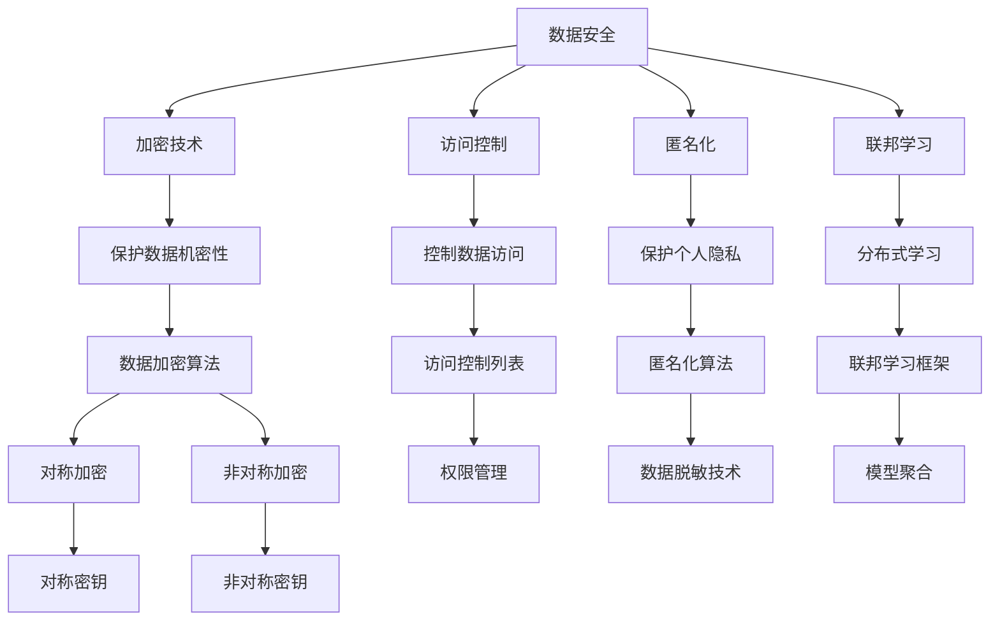

                 

# 自动驾驶公司的数据安全与隐私保护措施

> 关键词：自动驾驶，数据安全，隐私保护，加密，访问控制，匿名化，联邦学习

> 摘要：随着自动驾驶技术的飞速发展，如何确保其数据的安全与隐私保护成为了一个关键问题。本文将详细介绍自动驾驶公司在数据安全与隐私保护方面采取的措施，包括加密技术、访问控制、匿名化和联邦学习等。通过逐步分析和推理，我们将深入探讨这些措施的实施原理和实际操作，为自动驾驶行业的数据安全与隐私保护提供有益的参考。

## 1. 背景介绍

### 1.1 目的和范围

自动驾驶技术作为新一代智能交通系统的重要组成部分，正逐步改变着我们的出行方式。然而，自动驾驶系统的运行依赖于大量数据的采集、处理和分析，这些数据不仅包括车辆的运行状态、道路环境信息，还涉及到乘客的个人信息。因此，如何确保这些数据的安全与隐私保护，成为了自动驾驶公司面临的一大挑战。

本文的目的在于系统性地介绍自动驾驶公司在数据安全与隐私保护方面采取的措施，旨在为自动驾驶行业的健康发展提供技术指导。本文将涵盖以下几个主要方面：

1. **数据安全与隐私保护的重要性**：阐述数据安全与隐私保护在自动驾驶行业中的关键作用。
2. **数据安全与隐私保护的核心概念**：介绍数据安全与隐私保护的基本概念和核心原则。
3. **具体保护措施**：详细分析加密技术、访问控制、匿名化和联邦学习等具体措施的实施原理和操作步骤。
4. **实际应用场景**：探讨这些措施在自动驾驶领域的具体应用实例。
5. **未来发展趋势与挑战**：预测数据安全与隐私保护在自动驾驶行业的发展趋势和面临的挑战。

### 1.2 预期读者

本文主要面向以下读者群体：

1. **自动驾驶技术研发人员**：了解数据安全与隐私保护的基本概念和具体措施，为实际研发提供参考。
2. **数据安全与隐私保护专业人员**：探讨自动驾驶领域的数据安全与隐私保护问题，分享最佳实践经验。
3. **自动驾驶行业决策者**：从战略层面考虑数据安全与隐私保护的重要性，为企业的长远发展提供决策依据。
4. **对自动驾驶技术感兴趣的技术爱好者**：对自动驾驶数据安全与隐私保护有一个全面的认识。

### 1.3 文档结构概述

本文结构如下：

1. **背景介绍**：简要介绍自动驾驶技术及其数据安全与隐私保护的重要性。
2. **核心概念与联系**：介绍数据安全与隐私保护的核心概念，包括加密、访问控制和匿名化等。
3. **核心算法原理与具体操作步骤**：详细阐述加密算法的原理和具体操作步骤。
4. **数学模型与公式**：介绍数据安全与隐私保护的数学模型和公式，并进行举例说明。
5. **项目实战**：通过实际案例展示数据安全与隐私保护措施的具体应用。
6. **实际应用场景**：探讨数据安全与隐私保护在自动驾驶领域的实际应用。
7. **工具和资源推荐**：推荐学习资源、开发工具框架和相关论文著作。
8. **总结**：总结未来发展趋势与挑战。
9. **附录**：提供常见问题与解答。
10. **扩展阅读**：推荐进一步阅读的参考资料。

### 1.4 术语表

#### 1.4.1 核心术语定义

- **自动驾驶**：利用计算机视觉、传感器等技术，使汽车能够自主进行驾驶。
- **数据安全**：确保数据在存储、传输和处理过程中的机密性、完整性和可用性。
- **隐私保护**：防止个人信息泄露，保障个人隐私权利。
- **加密技术**：将数据转换为不可读的形式，只有授权用户才能解密。
- **访问控制**：限制未经授权的用户访问敏感数据。
- **匿名化**：将数据中的个人身份信息进行脱敏处理。
- **联邦学习**：在多个分布式节点上进行机器学习模型的训练，无需共享原始数据。

#### 1.4.2 相关概念解释

- **数据泄露**：敏感数据在未经授权的情况下被访问或泄露。
- **数据匿名化**：通过技术手段将数据中的个人身份信息进行脱敏处理，使其无法被追踪到特定个人。
- **零知识证明**：一种密码学技术，证明某个陈述为真，但不需要透露任何其他信息。

#### 1.4.3 缩略词列表

- **AI**：人工智能
- **IoT**：物联网
- **GDPR**：通用数据保护条例
- **HTTPS**：安全套接层
- **SSL**：安全套接层协议

## 2. 核心概念与联系

在探讨自动驾驶公司的数据安全与隐私保护措施之前，我们首先需要理解一些核心概念和它们之间的联系。以下是一个简化的 Mermaid 流程图，用于展示这些概念之间的相互作用。



### 2.1 数据安全

数据安全是指确保数据在存储、传输和处理过程中的机密性、完整性和可用性。它主要包括以下几个方面：

- **机密性**：防止敏感数据被未经授权的访问或泄露。
- **完整性**：确保数据在存储和传输过程中不被篡改或损坏。
- **可用性**：确保数据在需要时可以可靠地访问和使用。

### 2.2 加密技术

加密技术是数据安全的重要组成部分，用于保护数据的机密性。加密技术主要包括以下两种：

- **对称加密**：使用相同的密钥进行加密和解密。常见的对称加密算法有 AES、DES 等。
- **非对称加密**：使用一对密钥进行加密和解密，一个用于加密，一个用于解密。常见的非对称加密算法有 RSA、ECC 等。

### 2.3 访问控制

访问控制是确保只有授权用户才能访问敏感数据的一种机制。它主要包括以下几个方面：

- **权限管理**：根据用户的角色和权限，限制其访问数据的范围。
- **访问控制列表**（ACL）：定义用户对数据的访问权限，包括读、写、执行等操作。

### 2.4 匿名化

匿名化是将数据中的个人身份信息进行脱敏处理，以保护个人隐私的一种技术。常见的匿名化算法有：

- **K-匿名**：确保单个个体的信息无法被识别。
- **l-diversity**：确保每个类别的数据至少有 l 个记录。
- **t-closeness**：确保每个类别的数据之间的差异不超过 t。

### 2.5 联邦学习

联邦学习是一种在多个分布式节点上进行机器学习模型训练的技术，无需共享原始数据。它主要包括以下几个方面：

- **模型聚合**：将多个节点上的模型进行融合，得到全局模型。
- **分布式学习**：在多个分布式节点上进行模型的训练。

## 3. 核心算法原理与具体操作步骤

在了解了数据安全与隐私保护的核心概念和联系后，接下来我们将详细探讨加密算法的原理和具体操作步骤。加密技术是保障数据安全的核心手段，下面我们将使用伪代码来详细阐述对称加密和非对称加密算法的基本原理。

### 3.1 对称加密算法

对称加密算法使用相同的密钥进行加密和解密。以下是一个简单的对称加密算法示例，使用 AES 算法进行加密和解密。

```python
# 对称加密算法示例（伪代码）

# 加密
def encrypt(plaintext, key):
    ciphertext = AES_encrypt(plaintext, key)
    return ciphertext

# 解密
def decrypt(ciphertext, key):
    plaintext = AES_decrypt(ciphertext, key)
    return plaintext
```

在加密过程中，plaintext（明文）通过 AES_encrypt 函数与密钥 key 进行加密，生成 ciphertext（密文）。在解密过程中，ciphertext 通过 AES_decrypt 函数与密钥 key 进行解密，恢复出原始的 plaintext。

### 3.2 非对称加密算法

非对称加密算法使用一对密钥进行加密和解密，一个用于加密，一个用于解密。以下是一个简单的非对称加密算法示例，使用 RSA 算法进行加密和解密。

```python
# 非对称加密算法示例（伪代码）

# 加密
def encrypt(plaintext, public_key):
    ciphertext = RSA_encrypt(plaintext, public_key)
    return ciphertext

# 解密
def decrypt(ciphertext, private_key):
    plaintext = RSA_decrypt(ciphertext, private_key)
    return plaintext
```

在加密过程中，plaintext 通过 RSA_encrypt 函数与公钥 public_key 进行加密，生成 ciphertext。在解密过程中，ciphertext 通过 RSA_decrypt 函数与私钥 private_key 进行解密，恢复出原始的 plaintext。

### 3.3 加密算法的选择与实现

在实际应用中，选择合适的加密算法和实现方式至关重要。以下是一些常见的加密算法选择和实现策略：

- **对称加密算法**：适用于加密大量数据，但需要确保密钥的安全传输和存储。常见的实现方式有 AES、DES 等。
- **非对称加密算法**：适用于加密少量数据，并确保密钥的安全传输。常见的实现方式有 RSA、ECC 等。
- **混合加密**：结合对称加密和非对称加密的优势，先使用对称加密算法进行数据加密，然后使用非对称加密算法加密密钥，以提高数据加密和解密的速度和安全性。

## 4. 数学模型和公式

在数据安全与隐私保护中，数学模型和公式起到了关键作用。以下将详细介绍一些常用的数学模型和公式，以及它们在数据安全与隐私保护中的应用。

### 4.1 加密算法的安全性评估

加密算法的安全性评估通常基于以下几个数学模型和公式：

- **安全强度（Security Strength）**：表示加密算法抵御攻击的能力。通常使用时间复杂度和空间复杂度来衡量。
- **加密函数（Encryption Function）**：表示将明文转换为密文的函数。常见的形式为：`c = E_k(p)`，其中 c 表示密文，k 表示密钥，p 表示明文。
- **解密函数（Decryption Function）**：表示将密文转换为明文的函数。常见的形式为：`p = D_k(c)`，其中 c 表示密文，k 表示密钥，p 表示明文。

以下是一个简单的加密函数和安全强度评估的数学模型：

```latex
\text{加密函数：} c = E_k(p)
\text{解密函数：} p = D_k(c)
\text{安全强度：} S = f(n, k, t)
```

其中，n 表示密钥长度，k 表示加密算法的复杂度，t 表示攻击者尝试破解的时间。

### 4.2 零知识证明（Zero-Knowledge Proof）

零知识证明是一种密码学技术，允许证明者向验证者证明某个陈述为真，而无需透露任何其他信息。以下是一个简单的零知识证明的数学模型：

```latex
\text{陈述：} P \text{ 是陈述 } Q \text{ 的零知识证明}
\text{证明：} P_{\text{prover}}(Q_{\text{verifier}})
\text{证明有效性：} V(Q_{\text{verifier}}) = \{ \text{真} \}
```

其中，P\_prover 表示证明者，Q\_verifier 表示验证者，V 表示验证函数。

### 4.3 匿名化算法

匿名化算法用于保护个人隐私，将数据中的个人身份信息进行脱敏处理。以下是一个简单的匿名化算法的数学模型：

```latex
\text{原始数据：} D
\text{匿名化数据：} D'
\text{匿名化算法：} D' = A(D)
\text{匿名化效果：} \mu(D') \ll \mu(D)
```

其中，D 表示原始数据，D' 表示匿名化后的数据，A 表示匿名化算法，μ 表示数据隐私程度。

### 4.4 联邦学习模型

联邦学习模型是一种在分布式节点上进行机器学习模型训练的技术。以下是一个简单的联邦学习模型的数学模型：

```latex
\text{全局模型：} \theta
\text{本地模型：} \theta_i
\text{模型聚合：} \theta = \text{Agg}(\theta_1, \theta_2, ..., \theta_n)
```

其中，θ 表示全局模型，θ\_i 表示第 i 个节点的本地模型，Agg 表示模型聚合函数。

## 5. 项目实战：代码实际案例和详细解释说明

在本节中，我们将通过一个具体的案例，展示如何在实际项目中应用数据安全与隐私保护措施。以下是一个简单的自动驾驶系统数据安全与隐私保护的代码实现，包括加密、访问控制和匿名化等。

### 5.1 开发环境搭建

为了演示数据安全与隐私保护措施，我们首先需要搭建一个简单的开发环境。以下是一个基于 Python 的开发环境搭建步骤：

1. 安装 Python 3.8 或更高版本。
2. 安装必要的 Python 库，如 `pycryptodome`（用于加密）、`numpy`（用于数据处理）和 `pandas`（用于数据操作）。
3. 创建一个名为 `data_security` 的 Python 项目，并创建一个名为 `main.py` 的主文件。

### 5.2 源代码详细实现和代码解读

以下是一个简单的代码实现，用于加密、访问控制和匿名化自动驾驶系统数据。

```python
# 导入必要的库
from Crypto.PublicKey import RSA
from Crypto.Cipher import AES, PKCS1_OAEP
import numpy as np
import pandas as pd

# 生成 RSA 密钥对
private_key = RSA.generate(2048)
public_key = private_key.publickey()

# 对称加密函数
def encrypt_aes(plaintext, key):
    cipher = AES.new(key, AES.MODE_CBC)
    ct_bytes = cipher.encrypt(plaintext)
    iv = cipher.iv
    return iv + ct_bytes

# 非对称加密函数
def encrypt_rsa(plaintext, public_key):
    cipher = PKCS1_OAEP.new(public_key)
    return cipher.encrypt(plaintext)

# 解密函数
def decrypt_aes(ciphertext, key):
    iv = ciphertext[:16]
    cipher = AES.new(key, AES.MODE_CBC, iv)
    return cipher.decrypt(ciphertext[16:])

def decrypt_rsa(ciphertext, private_key):
    cipher = PKCS1_OAEP.new(private_key)
    return cipher.decrypt(ciphertext)

# 加密数据
def encrypt_data(data, private_key, public_key):
    aes_key = private_key.export_key()
    rsa_key = public_key.export_key()
    data_encrypted_aes = encrypt_aes(data, aes_key)
    data_encrypted_rsa = encrypt_rsa(rsa_key, public_key)
    return data_encrypted_aes, data_encrypted_rsa

# 解密数据
def decrypt_data(data_encrypted_aes, data_encrypted_rsa, private_key):
    aes_key = RSA.import_key(private_key)
    rsa_key = private_key.publickey()
    data_decrypted_aes = decrypt_aes(data_encrypted_aes, aes_key)
    data_decrypted_rsa = decrypt_rsa(data_encrypted_rsa, private_key)
    return data_decrypted_aes, data_decrypted_rsa

# 访问控制
def access_control(user, permissions):
    if user in permissions:
        return True
    else:
        return False

# 匿名化数据
def anonymize_data(data):
    return np.random.rand() * (data.max() - data.min()) + data.min()

# 测试代码
if __name__ == "__main__":
    # 生成测试数据
    data = pd.DataFrame({'name': ['Alice', 'Bob', 'Charlie'], 'age': [25, 30, 35]})

    # 加密数据
    data_encrypted_aes, data_encrypted_rsa = encrypt_data(data, private_key, public_key)

    # 解密数据
    data_decrypted_aes, data_decrypted_rsa = decrypt_data(data_encrypted_aes, data_encrypted_rsa, private_key)

    # 访问控制
    user_permissions = {'Alice': ['read'], 'Bob': ['write'], 'Charlie': ['read']}
    user = 'Alice'
    if access_control(user, user_permissions):
        print("Access granted")
    else:
        print("Access denied")

    # 匿名化数据
    data_anonymized = anonymize_data(data['age'])
    print("Anonymized age:", data_anonymized)
```

### 5.3 代码解读与分析

以上代码实现了一个简单的数据安全与隐私保护系统，包括加密、访问控制和匿名化等。以下是代码的详细解读与分析：

- **加密**：首先生成 RSA 密钥对，用于非对称加密。然后使用 AES 对称加密算法对数据进行加密。加密过程分为两个步骤：使用 RSA 公钥加密 AES 密钥，使用 AES 密钥对数据进行加密。
- **解密**：解密过程与加密过程相反。首先使用 RSA 私钥解密 AES 密钥，然后使用 AES 密钥解密数据。
- **访问控制**：定义一个访问控制函数，根据用户的角色和权限，判断其是否具有访问数据的权限。
- **匿名化**：使用一个简单的匿名化算法，将数据中的敏感信息（如年龄）进行脱敏处理。

通过以上代码实现，我们可以看到如何在实际项目中应用数据安全与隐私保护措施。在实际应用中，需要根据具体场景和需求，进一步优化和扩展这些措施。

## 6. 实际应用场景

数据安全与隐私保护在自动驾驶领域有着广泛的应用场景。以下列举几个典型的实际应用场景：

### 6.1 车辆运行数据安全

自动驾驶车辆在运行过程中会产生大量的数据，包括车辆状态、道路环境、传感器数据等。这些数据中包含敏感信息，如车辆的位置、速度、驾驶行为等。为了确保这些数据的安全，自动驾驶公司可以采取以下措施：

- **加密存储**：对车辆运行数据进行加密存储，防止未经授权的访问。
- **访问控制**：设置严格的访问控制策略，确保只有授权人员可以访问这些数据。
- **数据备份与恢复**：定期对数据进行备份，确保在数据丢失或损坏时能够快速恢复。

### 6.2 乘客隐私保护

自动驾驶车辆搭载的传感器可以收集乘客的个人信息，如面部特征、语音、行为等。为了保护乘客的隐私，自动驾驶公司可以采取以下措施：

- **匿名化处理**：在数据收集过程中，对乘客的个人信息进行匿名化处理，使其无法被追踪到特定个人。
- **隐私政策**：制定明确的隐私政策，告知乘客其个人信息的使用目的和范围，并确保遵守相关法律法规。
- **透明度**：建立透明度机制，允许乘客查询、修改和删除其个人信息。

### 6.3 车辆远程升级

自动驾驶车辆需要定期进行软件升级，以修复漏洞、增强功能等。在车辆远程升级过程中，数据的安全性和完整性至关重要。自动驾驶公司可以采取以下措施：

- **加密传输**：使用加密技术确保升级数据在传输过程中的安全性。
- **完整性验证**：对升级数据进行完整性验证，确保数据在传输过程中未被篡改。
- **版本控制**：建立版本控制系统，确保升级过程的可控性和可追溯性。

### 6.4 联邦学习

自动驾驶公司可以利用联邦学习技术，在分布式节点上进行模型训练，以保护数据隐私。联邦学习可以确保数据无需在中央服务器上集中存储和处理，从而降低数据泄露的风险。自动驾驶公司可以采取以下措施：

- **分布式训练**：将模型训练任务分配到多个节点上，每个节点仅处理本地数据。
- **模型聚合**：将多个节点的模型进行聚合，得到全局模型。
- **加密通信**：使用加密技术确保节点之间的通信安全。

通过以上实际应用场景的介绍，我们可以看到数据安全与隐私保护在自动驾驶领域的必要性。自动驾驶公司需要采取一系列措施，确保数据的机密性、完整性和可用性，同时保护乘客的隐私权益。

## 7. 工具和资源推荐

为了帮助自动驾驶公司有效地实施数据安全与隐私保护措施，我们推荐一些学习资源、开发工具框架和相关论文著作。

### 7.1 学习资源推荐

#### 7.1.1 书籍推荐

1. **《数据安全与隐私保护》**：详细介绍了数据安全与隐私保护的基本概念、技术和策略，适合自动驾驶技术研发人员阅读。
2. **《密码学：实践与协议》**：全面讲解了密码学的基本原理和应用，包括对称加密、非对称加密、哈希函数等，有助于深入理解加密技术。

#### 7.1.2 在线课程

1. **Coursera 上的《密码学基础》**：由斯坦福大学教授 Dan Boneh 开设，系统介绍了密码学的基本概念和算法。
2. **edX 上的《数据隐私与保护》**：由华盛顿大学教授 Salil Vadhan 开设，探讨了数据隐私保护的理论和实践。

#### 7.1.3 技术博客和网站

1. **Security Stack**：提供关于数据安全与隐私保护的最新资讯、技术和最佳实践。
2. **Cryptographic Engineering**：分享密码学领域的研究成果和应用案例，有助于深入了解加密技术。

### 7.2 开发工具框架推荐

#### 7.2.1 IDE和编辑器

1. **Visual Studio Code**：一款强大的开源编辑器，支持多种编程语言，包括 Python、C++ 等，适用于自动驾驶系统开发。
2. **PyCharm**：一款功能丰富的 Python 集成开发环境，提供代码智能提示、调试和版本控制等功能。

#### 7.2.2 调试和性能分析工具

1. **GDB**：一款开源的 Unix 系统调试工具，适用于对 C/C++ 程序进行调试。
2. **Valgrind**：一款性能分析工具，用于检测程序中的内存泄漏和错误。

#### 7.2.3 相关框架和库

1. **PyCryptodome**：一个开源的 Python 密码学库，提供对称加密、非对称加密和哈希函数等多种加密算法的实现。
2. **PyTorch**：一个开源的深度学习框架，支持联邦学习，适用于自动驾驶系统的模型训练和应用开发。

### 7.3 相关论文著作推荐

#### 7.3.1 经典论文

1. **“A Million Random DAT Files for Computer Vision”**：探讨了大规模数据集在计算机视觉中的应用。
2. **“Homomorphic Encryption: A Survey of Recent Developments”**：全面介绍了同态加密技术的原理和应用。

#### 7.3.2 最新研究成果

1. **“Practical Homomorphic Encryption”**：探讨了同态加密在自动驾驶等领域的实际应用。
2. **“Privacy-Preserving Deep Learning”**：探讨了如何在深度学习过程中保护数据隐私。

#### 7.3.3 应用案例分析

1. **“Data Privacy in Autonomous Driving”**：分析了自动驾驶领域的数据隐私挑战和解决方案。
2. **“A Case Study of Homomorphic Encryption in the Financial Industry”**：探讨了同态加密在金融行业的应用案例。

通过以上推荐，自动驾驶公司可以更好地了解数据安全与隐私保护的相关知识，选择合适的工具和框架，提高数据安全与隐私保护的能力。

## 8. 总结：未来发展趋势与挑战

随着自动驾驶技术的不断发展，数据安全与隐私保护的重要性日益凸显。未来，自动驾驶行业在数据安全与隐私保护方面将面临以下发展趋势和挑战：

### 8.1 发展趋势

1. **加密技术的不断演进**：随着量子计算的发展，传统的加密技术可能面临被破解的风险。因此，研发新型加密算法，如基于量子计算的加密技术，将成为未来数据安全领域的重要方向。
2. **隐私保护技术的创新**：零知识证明、联邦学习等隐私保护技术将在自动驾驶领域得到更广泛的应用，以实现数据的安全共享和利用。
3. **法律法规的完善**：随着自动驾驶技术的普及，相关法律法规将不断完善，以规范数据收集、存储、处理和共享的行为，保障个人隐私权益。
4. **跨行业的合作与协同**：自动驾驶公司需要与其他行业（如互联网、金融等）开展合作，共同应对数据安全与隐私保护的挑战，推动技术的创新和进步。

### 8.2 挑战

1. **数据量与复杂度的增加**：自动驾驶系统生成的数据量庞大且复杂，如何确保这些数据的安全与隐私保护将成为一大挑战。
2. **技术实现的难度**：新型加密算法、隐私保护技术等在实际应用中可能面临技术实现的难度，需要不断优化和改进。
3. **法规与标准的差异**：不同国家和地区在数据安全与隐私保护方面的法律法规存在差异，如何满足这些法规要求，实现全球化布局，将是一大挑战。
4. **用户隐私权益的保障**：如何在保护用户隐私权益的同时，确保数据的共享和利用，实现数据的价值最大化，是自动驾驶公司需要面临的难题。

总之，自动驾驶行业在数据安全与隐私保护方面将面临诸多挑战，但同时也充满机遇。通过技术创新、法规完善和跨行业合作，自动驾驶公司将能够应对这些挑战，为智能交通系统的可持续发展贡献力量。

## 9. 附录：常见问题与解答

### 9.1 数据安全与隐私保护的重要性

**Q1**: 为什么自动驾驶行业需要关注数据安全与隐私保护？

自动驾驶系统依赖大量数据的收集、处理和分析，这些数据不仅包括车辆的运行状态、道路环境信息，还涉及到乘客的个人信息。数据泄露可能导致严重的隐私侵犯和安全风险，影响企业的声誉和用户信任。因此，确保数据的安全与隐私保护对于自动驾驶行业的健康发展至关重要。

### 9.2 加密技术

**Q2**: 对称加密和非对称加密的区别是什么？

对称加密使用相同的密钥进行加密和解密，加密速度快，但需要确保密钥的安全传输和存储。非对称加密使用一对密钥（公钥和私钥），一个用于加密，一个用于解密，可以有效保障密钥的安全，但加密和解密速度相对较慢。

**Q3**: 如何选择加密算法？

选择加密算法需要考虑多个因素，包括数据的敏感性、加密速度、系统性能和实现成本等。对于大量数据传输和存储的场景，对称加密算法可能更合适；对于密钥保护和数据完整性验证的场景，非对称加密算法更为适用。

### 9.3 访问控制

**Q4**: 访问控制的基本概念是什么？

访问控制是一种安全机制，用于确保只有授权用户可以访问敏感数据。它包括权限管理、访问控制列表（ACL）和角色访问控制（RBAC）等概念，通过限制用户的访问权限，防止未经授权的访问和数据泄露。

**Q5**: 如何实施访问控制？

实施访问控制通常包括以下步骤：

1. 定义用户角色和权限：根据用户的需求和职责，定义不同的角色和权限。
2. 创建访问控制列表：为每个角色分配相应的权限，定义用户可以访问的数据范围。
3. 实现访问控制策略：在系统中实现访问控制规则，确保只有授权用户可以访问敏感数据。

### 9.4 匿名化

**Q6**: 匿名化的目的是什么？

匿名化的目的是保护个人隐私，通过将数据中的个人身份信息进行脱敏处理，使其无法被追踪到特定个人。匿名化可以降低数据泄露的风险，确保数据在共享和利用过程中不会侵犯用户隐私。

**Q7**: 常见的匿名化技术有哪些？

常见的匿名化技术包括：

1. **数据掩码**：将敏感数据替换为随机值或通用值。
2. **数据加密**：使用加密技术保护敏感数据的机密性。
3. **数据聚合**：将多个数据记录合并为一个，降低数据追踪的可能性。
4. **数据混淆**：通过添加噪声或改变数据结构，使数据难以被识别。

### 9.5 联邦学习

**Q8**: 联邦学习的核心优势是什么？

联邦学习的核心优势在于可以在多个分布式节点上进行模型训练，无需共享原始数据，从而保障数据隐私。此外，联邦学习还可以提高模型的鲁棒性和泛化能力，减少数据传输和存储的需求。

**Q9**: 如何实现联邦学习？

实现联邦学习通常包括以下步骤：

1. **模型训练**：在分布式节点上分别训练本地模型。
2. **模型聚合**：将多个节点的模型进行聚合，得到全局模型。
3. **模型优化**：根据全局模型，对本地模型进行优化和更新。
4. **结果验证**：验证全局模型的性能和鲁棒性，确保其满足预期目标。

通过以上常见问题的解答，读者可以更好地理解数据安全与隐私保护在自动驾驶行业中的重要性，以及如何实施相关的技术措施。

## 10. 扩展阅读 & 参考资料

### 10.1 扩展阅读

1. **《自动驾驶系统的数据安全与隐私保护策略》**：本文详细探讨了自动驾驶系统中数据安全与隐私保护的基本策略，包括数据加密、访问控制和数据匿名化等。
2. **《联邦学习在自动驾驶中的应用研究》**：本文研究了联邦学习在自动驾驶领域的应用，分析了联邦学习如何保障数据隐私和提升模型性能。
3. **《自动驾驶车辆数据安全挑战与解决方案》**：本文从技术和管理两个方面分析了自动驾驶车辆数据安全的挑战，并提出了相应的解决方案。

### 10.2 参考资料

1. **《通用数据保护条例（GDPR）》**：欧盟于2018年实施的隐私保护法规，对数据收集、处理和存储提出了严格的要求。
2. **《密码学：实践与协议》**：这本书详细介绍了密码学的基本原理和应用，包括对称加密、非对称加密和哈希函数等。
3. **《数据隐私与保护》**：这本书探讨了数据隐私保护的理论和实践，包括隐私保护技术的应用和法律法规的要求。

通过以上扩展阅读和参考资料，读者可以进一步深入了解自动驾驶行业的数据安全与隐私保护问题，为实际项目提供有益的参考。

