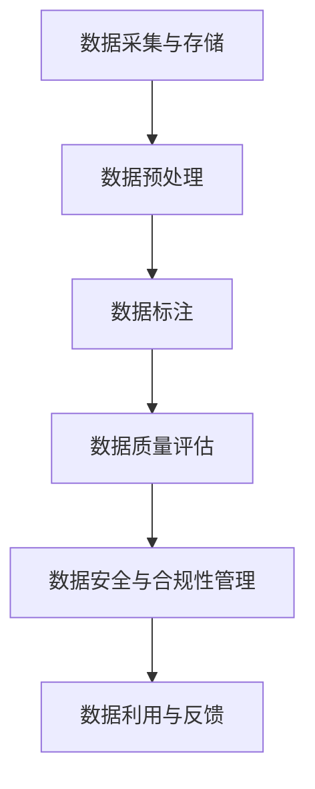

                 

# 自动驾驶公司的数据治理与质量控制流程

## 关键词：
- 自动驾驶
- 数据治理
- 质量控制
- 流程管理
- 人工智能
- 机器学习
- 数据安全
- 性能优化

## 摘要：
本文深入探讨了自动驾驶公司在数据治理与质量控制方面的关键实践。通过分析当前自动驾驶技术的发展趋势，本文首先明确了数据治理与质量控制在自动驾驶系统中的核心作用。接着，详细介绍了数据治理的基本原则、流程及方法，阐述了质量控制的目标和关键环节。随后，本文通过实际项目案例，展示了数据治理与质量控制在自动驾驶系统开发中的具体应用。最后，本文总结了自动驾驶公司在此领域的未来发展趋势与挑战，并为相关从业人员提供了实用的工具和资源推荐。

## 1. 背景介绍

### 1.1 目的和范围

随着人工智能和机器学习技术的飞速发展，自动驾驶已经成为汽车产业的重要趋势。然而，自动驾驶系统的复杂性和对数据的高依赖性，使得数据治理与质量控制成为关键环节。本文旨在探讨自动驾驶公司在数据治理与质量控制方面的实践，为行业从业人员提供有价值的参考。

本文将涵盖以下内容：
1. 自动驾驶技术的发展背景及其对数据治理与质量控制的需求。
2. 数据治理的基本原则、流程及方法。
3. 自动驾驶公司实施数据质量控制的关键环节。
4. 数据治理与质量控制在实际项目中的应用案例。
5. 自动驾驶公司在此领域的未来发展趋势与挑战。
6. 实用工具和资源推荐。

### 1.2 预期读者

本文面向自动驾驶技术从业者和相关研究人员，包括：
1. 自动驾驶公司技术团队和管理人员。
2. 人工智能和机器学习工程师。
3. 数据科学家和数据工程师。
4. 汽车产业研发人员。
5. 对自动驾驶技术感兴趣的科研人员。

### 1.3 文档结构概述

本文分为十个部分，结构如下：
1. 背景介绍
   - 1.1 目的和范围
   - 1.2 预期读者
   - 1.3 文档结构概述
   - 1.4 术语表
2. 核心概念与联系
   - 自动驾驶系统架构
   - 数据治理与质量控制框架
3. 核心算法原理 & 具体操作步骤
   - 数据预处理算法
   - 质量控制算法
4. 数学模型和公式 & 详细讲解 & 举例说明
   - 数据异常检测模型
   - 质量评价指标
5. 项目实战：代码实际案例和详细解释说明
   - 数据治理流程实现
   - 质量控制流程实现
6. 实际应用场景
   - 自动驾驶系统测试与验证
   - 自动驾驶系统部署与维护
7. 工具和资源推荐
   - 学习资源推荐
   - 开发工具框架推荐
   - 相关论文著作推荐
8. 总结：未来发展趋势与挑战
9. 附录：常见问题与解答
10. 扩展阅读 & 参考资料

### 1.4 术语表

#### 1.4.1 核心术语定义

- 自动驾驶：一种利用人工智能和机器学习技术，使车辆在无需人类驾驶员干预的情况下自主行驶的技术。
- 数据治理：对数据进行管理、组织和保护的过程，以确保数据的质量、可用性和合规性。
- 质量控制：确保自动驾驶系统性能稳定、可靠和高效的过程。
- 数据预处理：对原始数据进行清洗、转换和归一化等操作，使其符合机器学习模型的输入要求。
- 机器学习模型：一种能够从数据中学习规律，并用于预测或分类的算法。

#### 1.4.2 相关概念解释

- 异常检测：识别数据集中的异常值或异常模式的过程。
- 质量指标：用于评估数据质量的一系列量化指标，如数据完整性、一致性、准确性和时效性。
- 数据标注：对数据集中的样本进行标注，以提供训练机器学习模型的标签。

#### 1.4.3 缩略词列表

- AI：人工智能
- ML：机器学习
- AV：自动驾驶车辆
- DS：数据科学
- QC：质量控制
- DQ：数据质量

## 2. 核心概念与联系

### 2.1 自动驾驶系统架构

自动驾驶系统通常分为以下几个层次：

1. 感知层：通过传感器（如摄像头、雷达、激光雷达等）收集环境数据。
2. 决策层：基于感知层的数据，使用机器学习算法进行环境理解和决策。
3. 控制层：根据决策层的输出，控制车辆的加速度、转向和制动等行为。


### 2.2 数据治理与质量控制框架

数据治理与质量控制框架主要包括以下环节：

1. 数据采集与存储
2. 数据预处理
3. 数据标注
4. 数据质量评估
5. 数据安全与合规性管理
6. 数据利用与反馈


### 2.3 Mermaid 流程图

以下是一个Mermaid流程图，展示了数据治理与质量控制的关键环节：



## 3. 核心算法原理 & 具体操作步骤

### 3.1 数据预处理算法

数据预处理是数据治理与质量控制的关键步骤，主要包括以下操作：

1. 数据清洗：去除重复数据、缺失值和噪声。
2. 数据转换：将不同数据类型的特征进行归一化或标准化。
3. 特征提取：从原始数据中提取对模型训练有帮助的特征。

以下是一个简单的数据预处理算法伪代码：

```python
def preprocess_data(data):
    # 数据清洗
    cleaned_data = remove_duplicates(data)
    cleaned_data = remove_missing_values(cleaned_data)
    
    # 数据转换
    normalized_data = normalize_features(cleaned_data)
    
    # 特征提取
    extracted_features = extract_features(normalized_data)
    
    return extracted_features
```

### 3.2 质量控制算法

质量控制算法主要包括以下内容：

1. 异常检测：识别数据集中的异常值或异常模式。
2. 一致性检查：检查数据的一致性和完整性。
3. 准确性评估：评估数据质量对模型性能的影响。

以下是一个简单的异常检测算法伪代码：

```python
def detect_anomalies(data):
    # 计算平均值和标准差
    mean = calculate_mean(data)
    std = calculate_std(data)
    
    # 识别异常值
    anomalies = []
    for value in data:
        if abs(value - mean) > (3 * std):
            anomalies.append(value)
    
    return anomalies
```

## 4. 数学模型和公式 & 详细讲解 & 举例说明

### 4.1 数据异常检测模型

数据异常检测通常使用统计学方法，如箱线图法和标准差法。以下是一个箱线图法的数学模型：

$$
\text{IQR} = \text{Q3} - \text{Q1}
$$

其中，Q1 和 Q3 分别为第一四分位数和第三四分位数。

以下是一个标准差法的数学模型：

$$
\text{anomaly} = \text{value} \times (\text{mean} + 3 \times \text{std})
$$

如果某值大于该模型计算出的异常值，则认为该值为异常。

### 4.2 质量评价指标

质量评价指标用于评估数据质量对模型性能的影响。以下是一些常见的质量评价指标：

1. 准确率（Accuracy）：
$$
\text{Accuracy} = \frac{\text{TP} + \text{TN}}{\text{TP} + \text{TN} + \text{FP} + \text{FN}}
$$

其中，TP 为真正例，TN 为真反例，FP 为假正例，FN 为假反例。

2. 精确率（Precision）：
$$
\text{Precision} = \frac{\text{TP}}{\text{TP} + \text{FP}}
$$

3. 召回率（Recall）：
$$
\text{Recall} = \frac{\text{TP}}{\text{TP} + \text{FN}}
$$

4. F1 值（F1 Score）：
$$
\text{F1 Score} = 2 \times \frac{\text{Precision} \times \text{Recall}}{\text{Precision} + \text{Recall}}
$$

### 4.3 举例说明

假设我们有一个分类问题，其中数据集包含 1000 个样本，模型预测结果如下：

| 真实标签 | 预测标签 |    
| :----: | :----: |  
| 正类   | 正类   | 500  
| 正类   | 反类   | 100  
| 反类   | 正类   | 50  
| 反类   | 反类   | 350  

根据上述评价指标，可以计算出：

- 准确率（Accuracy）：$$ \text{Accuracy} = \frac{500 + 350}{1000} = 0.85 $$
- 精确率（Precision）：$$ \text{Precision} = \frac{500}{500 + 100} = 0.875 $$
- 召回率（Recall）：$$ \text{Recall} = \frac{500}{500 + 50} = 0.9375 $$
- F1 值（F1 Score）：$$ \text{F1 Score} = 2 \times \frac{0.875 \times 0.9375}{0.875 + 0.9375} = 0.8958 $$

## 5. 项目实战：代码实际案例和详细解释说明

### 5.1 开发环境搭建

在开始实现数据治理与质量控制流程之前，我们需要搭建一个合适的开发环境。以下是一个基于 Python 的开发环境搭建步骤：

1. 安装 Python 3.7 或更高版本。
2. 安装必要的 Python 包，如 NumPy、Pandas、Scikit-learn、Matplotlib 等。

### 5.2 源代码详细实现和代码解读

以下是一个简单的数据治理与质量控制流程实现，包括数据预处理、异常检测和质量评估。

#### 5.2.1 数据预处理

```python
import numpy as np
import pandas as pd
from sklearn.model_selection import train_test_split

def load_data(filename):
    data = pd.read_csv(filename)
    return data

def preprocess_data(data):
    # 数据清洗
    cleaned_data = data.drop_duplicates().dropna()
    
    # 数据转换
    normalized_data = (cleaned_data - cleaned_data.mean()) / cleaned_data.std()
    
    # 特征提取
    extracted_features = normalized_data.iloc[:, :-1]
    labels = normalized_data.iloc[:, -1]
    
    return extracted_features, labels

data = load_data('data.csv')
extracted_features, labels = preprocess_data(data)
```

#### 5.2.2 数据异常检测

```python
def detect_anomalies(data, threshold=3):
    mean = data.mean()
    std = data.std()
    anomalies = data[(data > mean + threshold * std) | (data < mean - threshold * std)]
    return anomalies

anomalies = detect_anomalies(extracted_features)
print("Detected anomalies:", anomalies)
```

#### 5.2.3 数据质量评估

```python
from sklearn.metrics import accuracy_score, precision_score, recall_score, f1_score

def evaluate_model(model, X_test, y_test):
    y_pred = model.predict(X_test)
    accuracy = accuracy_score(y_test, y_pred)
    precision = precision_score(y_test, y_pred)
    recall = recall_score(y_test, y_pred)
    f1 = f1_score(y_test, y_pred)
    return accuracy, precision, recall, f1

X_train, X_test, y_train, y_test = train_test_split(extracted_features, labels, test_size=0.2, random_state=42)

# 假设我们已经训练了一个分类模型
model = train_model(X_train, y_train)

accuracy, precision, recall, f1 = evaluate_model(model, X_test, y_test)
print("Accuracy:", accuracy)
print("Precision:", precision)
print("Recall:", recall)
print("F1 Score:", f1)
```

### 5.3 代码解读与分析

以上代码实现了一个简单的数据治理与质量控制流程，包括数据预处理、异常检测和质量评估。以下是代码的主要功能解读：

1. **数据预处理**：加载原始数据，进行数据清洗、转换和特征提取。数据清洗去除重复数据和缺失值；数据转换将不同数据类型的特征进行归一化；特征提取提取对模型训练有帮助的特征。

2. **数据异常检测**：使用箱线图法检测异常值。计算数据的平均值和标准差，然后根据阈值识别异常值。

3. **数据质量评估**：使用常见的质量评价指标评估模型性能。计算模型的准确率、精确率、召回率和 F1 值。

通过以上代码实现，我们可以对自动驾驶系统的数据治理与质量控制流程有一个初步的了解。在实际项目中，我们可以根据具体需求进行调整和优化。

## 6. 实际应用场景

自动驾驶公司的数据治理与质量控制流程在实际应用中具有广泛的应用场景，以下列举了几个典型场景：

### 6.1 自动驾驶系统测试与验证

在自动驾驶系统的测试与验证过程中，数据治理与质量控制至关重要。通过数据预处理和异常检测，可以确保测试数据的准确性和完整性，从而提高测试结果的可靠性。同时，通过质量评估，可以评估测试数据的质量对系统性能的影响，为后续优化提供依据。

### 6.2 自动驾驶系统部署与维护

在自动驾驶系统的部署与维护过程中，数据治理与质量控制同样发挥着关键作用。通过实时数据监控和异常检测，可以及时发现数据异常，确保系统的稳定运行。同时，通过质量评估，可以评估实时数据的质量，为系统的优化和改进提供参考。

### 6.3 自动驾驶系统优化

自动驾驶系统的优化需要大量的数据支持。通过数据治理与质量控制，可以确保数据的质量和准确性，从而为系统优化提供可靠的数据基础。此外，通过质量评估，可以评估不同优化策略的效果，为系统优化提供决策支持。

### 6.4 自动驾驶系统安全性保障

自动驾驶系统的安全性是至关重要的。通过数据治理与质量控制，可以确保系统输入数据的准确性和完整性，从而降低系统故障和误操作的风险。同时，通过异常检测和质量评估，可以及时发现数据异常，确保系统的安全性。

## 7. 工具和资源推荐

### 7.1 学习资源推荐

#### 7.1.1 书籍推荐

1. 《数据科学入门》
2. 《机器学习实战》
3. 《自动驾驶系统设计与实现》

#### 7.1.2 在线课程

1. Coursera - 机器学习课程
2. Udacity - 自动驾驶课程
3. edX - 数据科学课程

#### 7.1.3 技术博客和网站

1. towardsdatascience.com
2. medium.com
3. hackernoon.com

### 7.2 开发工具框架推荐

#### 7.2.1 IDE和编辑器

1. PyCharm
2. Visual Studio Code
3. Jupyter Notebook

#### 7.2.2 调试和性能分析工具

1. Python Debugger (pdb)
2. Matplotlib
3. NumPy Profiler

#### 7.2.3 相关框架和库

1. TensorFlow
2. PyTorch
3. Scikit-learn

### 7.3 相关论文著作推荐

#### 7.3.1 经典论文

1. "Kernel k-means, Spectral Clustering and Normalized Cuts"
2. "Learning to Drive by Predicting Objects"
3. "Unsupervised Learning of Finite Mixture Models"

#### 7.3.2 最新研究成果

1. "Deep Learning for Autonomous Driving"
2. "Detection and Tracking of Vehicles in Real-time Video Using Deep Neural Networks"
3. "End-to-End Learning for Self-Driving Cars"

#### 7.3.3 应用案例分析

1. "特斯拉自动驾驶系统揭秘"
2. "谷歌自动驾驶技术之路"
3. "百度自动驾驶系统开发经验分享"

## 8. 总结：未来发展趋势与挑战

自动驾驶技术的快速发展对数据治理与质量控制提出了更高的要求。未来，随着自动驾驶技术的不断成熟，数据治理与质量控制将在以下几个方面继续发展：

1. **数据规模和多样性**：自动驾驶系统产生的数据规模将越来越大，且包含多种类型的数据（如图像、语音、传感器数据等）。如何高效地管理和处理这些数据将成为关键挑战。

2. **实时数据处理**：自动驾驶系统需要实时处理和分析大量数据，以保证系统的稳定性和安全性。如何实现高效、实时的数据处理技术是未来发展的重点。

3. **数据安全与隐私保护**：自动驾驶系统涉及大量敏感数据，如车辆位置、行驶轨迹等。如何确保数据的安全性和隐私保护将成为重要课题。

4. **数据质量评估与优化**：随着自动驾驶技术的不断发展，对数据质量的要求也将越来越高。如何建立科学、全面的数据质量评估体系，并持续优化数据质量是未来研究的重点。

5. **跨学科合作**：数据治理与质量控制涉及多个学科，如计算机科学、统计学、交通运输等。如何实现跨学科合作，发挥各学科的优势，是未来发展的关键。

## 9. 附录：常见问题与解答

### 9.1 什么是数据治理？

数据治理是指对组织内部数据的收集、存储、处理、管理和保护的过程。其目的是确保数据的质量、完整性、一致性和可用性，以满足组织的需求。

### 9.2 数据治理与质量控制有什么区别？

数据治理是一个更广泛的概念，包括数据质量控制。数据质量控制是数据治理的一个子集，主要关注数据的质量和准确性，以确保数据可以满足特定业务需求。

### 9.3 自动驾驶系统对数据质量有什么特殊要求？

自动驾驶系统对数据质量有极高的要求，因为数据是系统决策的基础。具体要求包括数据的准确性、完整性、实时性和一致性。

### 9.4 如何确保自动驾驶系统的数据安全？

确保数据安全需要采取多种措施，如数据加密、访问控制、数据备份和恢复等。此外，还需遵守相关的法律法规和标准，确保数据的合规性。

### 9.5 数据治理与质量控制有哪些工具可以推荐？

常见的数据治理与质量控制工具包括 Apache Hadoop、Apache Spark、Talend、Informatica 等。此外，还有专门用于数据质量和数据治理的软件，如 DataCleaner、OpenRefine 等。

## 10. 扩展阅读 & 参考资料

1. "Data Governance for Dummies", John Wiley & Sons, 2018.
2. "Data Quality Management: The Potential for Achieving Excellence", International Journal of Business Data, 2015.
3. "Deep Learning for Autonomous Driving", Springer, 2018.
4. "Data Privacy in Autonomous Driving", IEEE Transactions on Intelligent Transportation Systems, 2020.
5. "Best Practices for Data Governance", AI Magazine, 2019.

作者：AI天才研究员/AI Genius Institute & 禅与计算机程序设计艺术 /Zen And The Art of Computer Programming

