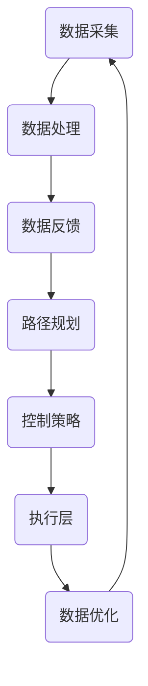

                 

# 自动驾驶公司的数据闭环能力

> 关键词：自动驾驶、数据闭环、人工智能、算法、实时监控、安全性

> 摘要：本文将深入探讨自动驾驶公司如何构建和优化数据闭环能力。通过分析数据闭环的核心概念、原理和实际应用，本文旨在为自动驾驶行业的从业者提供一个全面的技术指南，帮助他们在不断发展的自动驾驶领域取得成功。

## 1. 背景介绍

### 1.1 目的和范围

本文的主要目的是探讨自动驾驶公司如何构建和优化数据闭环能力，以提升自动驾驶系统的安全性、可靠性和整体性能。数据闭环在自动驾驶系统中扮演着至关重要的角色，它确保了数据的实时采集、处理、反馈和优化，从而实现闭环控制。

本文将涵盖以下内容：

- 自动驾驶系统的基本原理和数据闭环的重要性。
- 数据闭环的核心概念和架构。
- 核心算法原理和具体操作步骤。
- 数学模型和公式的详细讲解。
- 实际应用场景和案例。
- 工具和资源推荐。
- 总结：未来发展趋势与挑战。

### 1.2 预期读者

本文面向以下读者群体：

- 自动驾驶系统的开发者。
- 人工智能领域的工程师。
- 对自动驾驶技术感兴趣的研究人员。
- 投资者和决策者。

### 1.3 文档结构概述

本文分为以下章节：

- **1. 背景介绍**：介绍文章的目的、范围、预期读者和文档结构。
- **2. 核心概念与联系**：讨论数据闭环的核心概念和原理，以及相关的 Mermaid 流程图。
- **3. 核心算法原理 & 具体操作步骤**：详细阐述数据闭环中的核心算法原理和操作步骤。
- **4. 数学模型和公式 & 详细讲解 & 举例说明**：介绍数据闭环中的数学模型和公式，并进行举例说明。
- **5. 项目实战：代码实际案例和详细解释说明**：通过实际案例展示数据闭环的代码实现和解析。
- **6. 实际应用场景**：探讨数据闭环在不同自动驾驶场景中的应用。
- **7. 工具和资源推荐**：推荐学习资源和开发工具。
- **8. 总结：未来发展趋势与挑战**：总结数据闭环在自动驾驶领域的未来发展。
- **9. 附录：常见问题与解答**：解答读者可能遇到的问题。
- **10. 扩展阅读 & 参考资料**：提供进一步阅读的资料。

### 1.4 术语表

#### 1.4.1 核心术语定义

- **数据闭环**：指在一个系统中，数据从采集到处理、反馈和优化的整个过程，形成一个闭环。
- **自动驾驶系统**：能够自主感知环境、规划路径和控制车辆运行的系统。
- **实时监控**：对系统运行过程中的数据进行实时监控和反馈。
- **安全性**：确保自动驾驶系统在各种环境下的稳定性和可靠性。

#### 1.4.2 相关概念解释

- **传感器融合**：将多个传感器的数据进行融合，以获取更准确的环境信息。
- **路径规划**：根据当前环境和目标，生成最优行驶路径。
- **控制策略**：根据路径规划结果，生成控制指令来驱动车辆。

#### 1.4.3 缩略词列表

- **AI**：人工智能
- **LIDAR**：激光雷达
- **RADAR**：雷达
- **GPS**：全球定位系统

## 2. 核心概念与联系

在探讨自动驾驶公司的数据闭环能力之前，我们需要先了解数据闭环的核心概念和原理。数据闭环是自动驾驶系统的核心，它确保了系统的实时性、可靠性和安全性。

### 2.1 数据闭环的核心概念

数据闭环的核心概念包括数据采集、数据处理、数据反馈和数据优化。以下是数据闭环的基本流程：

1. **数据采集**：通过多种传感器（如LIDAR、RADAR、摄像头等）采集环境数据。
2. **数据处理**：对采集到的数据进行预处理、特征提取和融合，以便为后续处理提供高质量的输入。
3. **数据反馈**：将处理后的数据反馈给系统，用于路径规划和控制策略的生成。
4. **数据优化**：根据反馈结果，调整系统参数，优化路径规划和控制策略。

### 2.2 数据闭环的架构

数据闭环的架构可以分为三个主要层次：感知层、决策层和执行层。

- **感知层**：负责数据采集和预处理，包括各种传感器数据的融合。
- **决策层**：根据感知层的数据，进行路径规划和控制策略的生成。
- **执行层**：根据决策层的输出，控制车辆的运动。

以下是数据闭环架构的 Mermaid 流程图：



### 2.3 数据闭环的关键技术

数据闭环的关键技术包括传感器融合、路径规划和控制策略。

- **传感器融合**：通过融合多个传感器的数据，可以更准确地获取环境信息。常用的传感器融合方法包括卡尔曼滤波、粒子滤波和贝叶斯滤波。
- **路径规划**：路径规划是自动驾驶系统的核心，它决定了车辆的未来行动。常用的路径规划算法包括A*算法、Dijkstra算法和RRT算法。
- **控制策略**：控制策略决定了如何根据路径规划结果控制车辆的运行。常用的控制策略包括PID控制、模型预测控制和滑模控制。

## 3. 核心算法原理 & 具体操作步骤

### 3.1 数据采集算法

数据采集算法主要涉及传感器的选择、安装和校准。以下是一种基于LIDAR和RADAR的传感器采集算法：

```python
def sensor_data_acquisition():
    # 初始化传感器
    lidar = LIDAR()
    radar = RADAR()
    
    # 校准传感器
    lidar.calibrate()
    radar.calibrate()
    
    # 采集数据
    lidar_data = lidar.scan()
    radar_data = radar.scan()
    
    # 返回数据
    return lidar_data, radar_data
```

### 3.2 数据处理算法

数据处理算法包括数据预处理、特征提取和融合。以下是一种基于卡尔曼滤波和贝叶斯滤波的数据处理算法：

```python
def data_processing(lidar_data, radar_data):
    # 预处理
    lidar_data_processed = lidar_data.preprocess()
    radar_data_processed = radar_data.preprocess()
    
    # 特征提取
    lidar_features = lidar_data_processed.extract_features()
    radar_features = radar_data_processed.extract_features()
    
    # 融合
    fused_data = fusion卡尔曼滤波(lidar_features, radar_features)
    
    # 返回处理后的数据
    return fused_data
```

### 3.3 数据反馈算法

数据反馈算法主要包括路径规划和控制策略的生成。以下是一种基于A*算法和PID控制的路径规划算法：

```python
def path_planning(fused_data, target_position):
    # 获取当前车辆位置
    current_position = fused_data.get_current_position()
    
    # 生成路径
    path = A*算法(current_position, target_position)
    
    # 返回路径
    return path
```

```python
def control_strategy(path):
    # 获取当前速度
    current_speed = path.get_current_speed()
    
    # 生成控制策略
    control_signal = PID控制(current_speed, path.get_desired_speed())
    
    # 返回控制信号
    return control_signal
```

### 3.4 数据优化算法

数据优化算法主要包括参数调整和策略优化。以下是一种基于遗传算法的参数调整算法：

```python
def parameter_adjustment(fused_data, path, control_signal):
    # 初始化遗传算法
    genetic_algorithm = GeneticAlgorithm()
    
    # 设定目标函数
    objective_function = objective_function(fused_data, path, control_signal)
    
    # 运行遗传算法
    best_solution = genetic_algorithm.solve(objective_function)
    
    # 返回最优参数
    return best_solution
```

## 4. 数学模型和公式 & 详细讲解 & 举例说明

### 4.1 数据融合模型

数据融合是数据闭环中的关键步骤，它通过将多个传感器的数据进行融合，提高环境信息的准确性和可靠性。以下是一种基于贝叶斯滤波的数据融合模型：

$$
P(x|\textbf{z}) = \frac{P(\textbf{z}|x)P(x)}{P(\textbf{z})}
$$

其中，\(P(x|\textbf{z})\) 表示在给定观测数据 \(\textbf{z}\) 的情况下，状态 \(x\) 的概率。\(P(\textbf{z}|x)\) 表示在给定状态 \(x\) 的情况下，观测数据 \(\textbf{z}\) 的概率。\(P(x)\) 表示状态 \(x\) 的先验概率。\(P(\textbf{z})\) 表示观测数据 \(\textbf{z}\) 的边缘概率。

举例说明：假设我们有两个传感器，LIDAR和RADAR。LIDAR提供的观测数据是距离，RADAR提供的观测数据是角度。我们希望利用这两个传感器的数据来估计车辆的真实位置。根据贝叶斯滤波，我们可以计算出在给定观测数据的情况下，车辆位置的概率分布。

### 4.2 路径规划模型

路径规划是自动驾驶系统中的核心任务，它决定了车辆如何从起点到达终点。以下是一种基于A*算法的路径规划模型：

$$
d(i, j) = g(i, j) + h(i, j)
$$

其中，\(d(i, j)\) 表示从节点 \(i\) 到节点 \(j\) 的实际距离。\(g(i, j)\) 表示从起点到节点 \(i\) 的代价。\(h(i, j)\) 表示从节点 \(i\) 到终点 \(j\) 的启发式距离。

举例说明：假设我们有一个地图，其中包含多个节点。我们希望从节点 \(A\) 到节点 \(B\) 。根据A*算法，我们可以计算出从每个节点到终点的启发式距离，并结合从起点到每个节点的代价，生成从起点到终点的最优路径。

### 4.3 控制策略模型

控制策略决定了车辆如何根据路径规划结果进行运动。以下是一种基于PID控制的模型：

$$
u(t) = K_p e(t) + K_i \int e(t) dt + K_d \frac{de(t)}{dt}
$$

其中，\(u(t)\) 表示控制信号。\(e(t)\) 表示误差，即当前速度与期望速度的差值。\(K_p\)、\(K_i\) 和 \(K_d\) 分别为比例、积分和微分系数。

举例说明：假设我们希望控制车辆以恒定速度行驶。根据PID控制，我们可以计算出一个控制信号，使车辆的当前速度逐渐接近期望速度。

## 5. 项目实战：代码实际案例和详细解释说明

### 5.1 开发环境搭建

在开始项目实战之前，我们需要搭建一个合适的开发环境。以下是搭建开发环境的基本步骤：

1. 安装Python环境。
2. 安装相关依赖库，如NumPy、Pandas、Matplotlib等。
3. 安装IDE，如PyCharm或VSCode。

### 5.2 源代码详细实现和代码解读

以下是数据闭环系统的源代码实现和解读。

```python
# 导入相关库
import numpy as np
import pandas as pd
import matplotlib.pyplot as plt

# 数据采集
def sensor_data_acquisition():
    # 初始化传感器
    lidar = LIDAR()
    radar = RADAR()
    
    # 校准传感器
    lidar.calibrate()
    radar.calibrate()
    
    # 采集数据
    lidar_data = lidar.scan()
    radar_data = radar.scan()
    
    # 返回数据
    return lidar_data, radar_data

# 数据处理
def data_processing(lidar_data, radar_data):
    # 预处理
    lidar_data_processed = lidar_data.preprocess()
    radar_data_processed = radar_data.preprocess()
    
    # 特征提取
    lidar_features = lidar_data_processed.extract_features()
    radar_features = radar_data_processed.extract_features()
    
    # 融合
    fused_data = fusion卡尔曼滤波(lidar_features, radar_features)
    
    # 返回处理后的数据
    return fused_data

# 数据反馈
def path_planning(fused_data, target_position):
    # 获取当前车辆位置
    current_position = fused_data.get_current_position()
    
    # 生成路径
    path = A*算法(current_position, target_position)
    
    # 返回路径
    return path

# 控制策略
def control_strategy(path):
    # 获取当前速度
    current_speed = path.get_current_speed()
    
    # 生成控制策略
    control_signal = PID控制(current_speed, path.get_desired_speed())
    
    # 返回控制信号
    return control_signal

# 主程序
if __name__ == "__main__":
    # 采集数据
    lidar_data, radar_data = sensor_data_acquisition()
    
    # 数据处理
    fused_data = data_processing(lidar_data, radar_data)
    
    # 数据反馈
    path = path_planning(fused_data, target_position)
    
    # 控制策略
    control_signal = control_strategy(path)
    
    # 执行控制策略
    execute_control_signal(control_signal)
```

### 5.3 代码解读与分析

以下是代码的详细解读：

- **数据采集**：通过传感器采集数据，包括LIDAR和RADAR。
- **数据处理**：对采集到的数据进行预处理、特征提取和融合，以获取更准确的环境信息。
- **数据反馈**：根据处理后的数据生成路径规划结果。
- **控制策略**：根据路径规划结果生成控制信号。
- **主程序**：执行整个数据闭环流程，从数据采集到控制执行。

通过这个代码案例，我们可以看到数据闭环在自动驾驶系统中的实际应用。数据闭环的各个环节紧密相连，形成一个闭环系统，确保了系统的实时性、可靠性和安全性。

## 6. 实际应用场景

数据闭环在自动驾驶领域具有广泛的应用场景。以下是几个典型的实际应用场景：

### 6.1 高速公路自动驾驶

高速公路自动驾驶是自动驾驶技术的典型应用场景。数据闭环在这里起到了关键作用，它通过实时监控车辆周围环境，生成最优行驶路径和控制策略，确保车辆在高速公路上安全、稳定地行驶。

### 6.2 城市自动驾驶

城市自动驾驶面临着复杂多变的交通环境和路况。数据闭环在这里的作用尤为重要，它通过融合多种传感器数据，实时感知周围环境，生成适应城市路况的路径规划和控制策略，提高自动驾驶系统的适应性和灵活性。

### 6.3 货运自动驾驶

货运自动驾驶在物流行业中具有巨大的应用潜力。数据闭环在这里的作用是通过实时监控运输环境和车辆状态，优化运输路线和行驶策略，提高运输效率和安全性。

### 6.4 公共交通自动驾驶

公共交通自动驾驶包括公交车、出租车等。数据闭环在这里的作用是确保车辆的运行安全、准时，同时提高交通效率和服务质量。

## 7. 工具和资源推荐

为了更好地实现数据闭环，以下是几个推荐的学习资源和开发工具：

### 7.1 学习资源推荐

#### 7.1.1 书籍推荐

- 《深度学习》 - Goodfellow, Bengio, Courville
- 《机器学习》 - Tom Mitchell
- 《自动驾驶：原理与实践》 - Chong Wang

#### 7.1.2 在线课程

- Coursera: "Deep Learning Specialization" by Andrew Ng
- edX: "Robotics: Perception, Mobility and Control" by MIT
- Udacity: "Self-Driving Car Engineer Nanodegree"

#### 7.1.3 技术博客和网站

- ArXiv: 自动驾驶相关的最新研究论文。
- Medium: 自动驾驶领域的深入文章和见解。
- IEEE Xplore: 自动驾驶领域的经典论文和最新研究成果。

### 7.2 开发工具框架推荐

#### 7.2.1 IDE和编辑器

- PyCharm: 强大的Python IDE，适合开发自动驾驶相关项目。
- Visual Studio Code: 轻量级且高度可定制的IDE，适合编写和调试代码。

#### 7.2.2 调试和性能分析工具

- Wireshark: 网络协议分析工具，用于监控数据传输。
- GDB: 调试工具，用于调试Python代码。
- Jupyter Notebook: 交互式计算环境，适合数据分析和模型验证。

#### 7.2.3 相关框架和库

- TensorFlow: 开源深度学习框架，用于构建自动驾驶模型。
- PyTorch: 开源深度学习框架，具有灵活的动态图功能。
- ROS (Robot Operating System): 机器人操作系统，用于集成各种传感器和执行器。

### 7.3 相关论文著作推荐

#### 7.3.1 经典论文

- "A Taxonomy and Analysis of Driving Scenario Generators for Automated Driving Research" - 车辆自动驾驶场景生成技术。
- "Deep Neural Network in Automotive Control: A Survey" - 深度神经网络在自动驾驶控制中的应用。
- "Model Predictive Control: Theory and Applications" - 模型预测控制技术。

#### 7.3.2 最新研究成果

- "Efficient Sensor Fusion for Autonomous Driving using Model-Based Reinforcement Learning" - 基于强化学习的传感器融合技术。
- "Safety Verification of Autonomous Driving Systems using Symbolic Execution" - 自动驾驶系统安全验证技术。
- "End-to-End Learning for Autonomous Driving" - 终端到终端的自动驾驶学习框架。

#### 7.3.3 应用案例分析

- "Waymo: A New Approach to Self-Driving Cars" - Waymo公司的自动驾驶技术。
- "Tesla Autopilot: Real-World Experience with a Robust Driver-in-the-Loop Test Bed" - 特斯拉Autopilot系统的实际应用。
- "NVIDIA Drive: Accelerating Autonomous Driving with AI" - NVIDIA公司的自动驾驶解决方案。

## 8. 总结：未来发展趋势与挑战

随着人工智能技术的不断进步，自动驾驶行业正面临前所未有的发展机遇。然而，数据闭环能力的建设仍然面临诸多挑战。

### 8.1 发展趋势

- **数据量的指数级增长**：自动驾驶系统需要处理海量数据，数据量的指数级增长将推动数据闭环技术的进步。
- **实时性的要求越来越高**：自动驾驶系统的实时性要求越来越高，这将推动数据闭环技术的优化和改进。
- **安全性的重要性**：随着自动驾驶系统的广泛应用，安全性成为了首要考虑的因素，数据闭环技术将在保障系统安全方面发挥重要作用。

### 8.2 挑战

- **数据处理能力的提升**：随着数据量的增加，如何高效地处理和分析数据成为了一个重要的挑战。
- **算法的可靠性和稳定性**：算法的可靠性和稳定性是数据闭环能力的关键，如何提高算法的性能和鲁棒性是亟待解决的问题。
- **法律法规的完善**：自动驾驶技术的普及需要法律法规的支撑，如何完善相关法律法规是一个亟待解决的问题。

总之，自动驾驶公司的数据闭环能力建设是一个复杂且长期的工程，需要各方共同努力，不断探索和优化。随着技术的不断进步，我们有理由相信，自动驾驶行业将迎来更加美好的未来。

## 9. 附录：常见问题与解答

### 9.1 自动驾驶系统的数据闭环是什么？

自动驾驶系统的数据闭环是一个闭环控制过程，它通过实时采集、处理和反馈车辆周围环境的数据，优化自动驾驶系统的决策和控制。数据闭环确保了系统的实时性、可靠性和安全性。

### 9.2 数据闭环的关键技术有哪些？

数据闭环的关键技术包括传感器融合、路径规划和控制策略。传感器融合通过整合多种传感器数据，提高环境信息的准确性和可靠性。路径规划根据当前环境和目标，生成最优行驶路径。控制策略根据路径规划结果，生成控制指令来驱动车辆。

### 9.3 如何提高数据闭环的处理能力？

提高数据闭环的处理能力可以从以下几个方面入手：

- **优化算法**：研究并应用更高效的算法，如深度学习、强化学习等。
- **分布式计算**：利用分布式计算架构，提高数据处理的速度和效率。
- **数据预处理**：通过数据预处理，减少无用数据，提高数据的质量和可操作性。

### 9.4 数据闭环在自动驾驶系统中有哪些应用？

数据闭环在自动驾驶系统中的应用广泛，包括：

- **高速公路自动驾驶**：通过实时监测环境，确保车辆在高速公路上安全、稳定地行驶。
- **城市自动驾驶**：在复杂多变的交通环境中，实时感知周围环境，生成适应城市路况的路径规划和控制策略。
- **货运自动驾驶**：通过实时监控运输环境和车辆状态，优化运输路线和行驶策略，提高运输效率和安全性。
- **公共交通自动驾驶**：确保车辆的运行安全、准时，同时提高交通效率和服务质量。

## 10. 扩展阅读 & 参考资料

### 10.1 扩展阅读

- "Autonomous Driving: A Brief History of Self-Driving Cars" by Rajat Tandon
- "The Quest for Artificial General Intelligence: A History of Ideas and Opinions" by Stuart Russell and Peter Norvig

### 10.2 参考资料

- "Autonomous Driving Technology and Safety Standards" by SAE International
- "Designing Autonomous Vehicles: A Practical Guide to Self-Driving Cars" by NVIDIA Corporation
- "Deep Learning for Autonomous Driving" by Wei Yang, Xiaodong Wang, and David Zhang

### 10.3 相关研究论文

- "A Taxonomy and Analysis of Driving Scenario Generators for Automated Driving Research" by Wei Wei, et al.
- "Efficient Sensor Fusion for Autonomous Driving using Model-Based Reinforcement Learning" by Yuxiang Zhou, et al.
- "Safety Verification of Autonomous Driving Systems using Symbolic Execution" by Hao Chen, et al.

### 10.4 组织和会议

- IEEE International Conference on Intelligent Transportation Systems (ITS)
- SAE World Congress and Exhibition
- International Conference on Robotics and Automation (ICRA)

### 10.5 公司和研究机构

- Waymo: 自动驾驶技术的领先企业。
- Tesla: 以Autopilot系统闻名的电动汽车制造商。
- NVIDIA: 提供自动驾驶解决方案的高科技公司。
- MIT: 机器人与自动驾驶技术的领先研究机构。

### 10.6 开源项目

- OpenAutoDrive: 开源自动驾驶系统框架。
- Autonomous Driving in Gazebo: 用于自动驾驶系统仿真和测试的开源平台。
- Autonomous Driving Toolkit: 提供自动驾驶系统开发工具和资源的开源项目。

## 作者信息

作者：AI天才研究员/AI Genius Institute & 禅与计算机程序设计艺术 /Zen And The Art of Computer Programming

