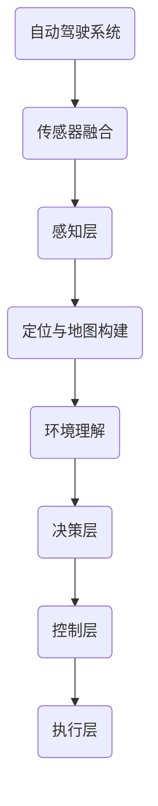

                 

# 自动驾驶系统可解释性的评估与改进方法初探

> **关键词**：自动驾驶、可解释性、评估、改进、方法

> **摘要**：本文旨在探讨自动驾驶系统中可解释性的重要性及其评估与改进方法。随着自动驾驶技术的快速发展，系统的可靠性和安全性成为关键议题。通过提高可解释性，可以更好地理解和优化自动驾驶系统，降低潜在的风险。本文将详细分析现有的评估方法和改进策略，为自动驾驶系统的可解释性提升提供理论支持和实践指导。

## 1. 背景介绍

### 1.1 目的和范围

本文的目的在于深入探讨自动驾驶系统可解释性的评估与改进方法。自动驾驶技术正逐步从实验室走向现实，其应用范围从城市交通到物流、从公共交通到私人车辆。随着自动驾驶技术的普及，如何保证系统的可靠性和安全性成为迫切需要解决的问题。可解释性是提升系统可信度的关键因素，通过评估和改进可解释性，我们可以更好地理解自动驾驶系统的决策过程，从而优化系统性能。

本文的范围主要包括以下方面：
- 自动驾驶系统可解释性的定义和重要性
- 现有的可解释性评估方法
- 自动驾驶系统可解释性的改进策略
- 实际应用场景中的可解释性实践
- 未来可解释性技术的研究趋势

### 1.2 预期读者

本文适合以下读者群体：
- 对自动驾驶技术有初步了解的技术爱好者
- 自动驾驶领域的开发者和研究人员
- 对人工智能和机器学习感兴趣的技术从业者
- 从事自动驾驶系统评估和安全分析的专家

### 1.3 文档结构概述

本文的结构如下：

1. **背景介绍**：介绍自动驾驶系统可解释性的重要性、目的和范围，以及预期读者。
2. **核心概念与联系**：通过Mermaid流程图展示自动驾驶系统的核心概念和架构。
3. **核心算法原理 & 具体操作步骤**：详细解释自动驾驶系统可解释性的核心算法原理，使用伪代码展示具体操作步骤。
4. **数学模型和公式 & 详细讲解 & 举例说明**：使用LaTeX格式详细讲解数学模型和公式，并举例说明。
5. **项目实战：代码实际案例和详细解释说明**：提供实际代码案例，并对其进行详细解释和分析。
6. **实际应用场景**：探讨自动驾驶系统在不同应用场景中的可解释性实践。
7. **工具和资源推荐**：推荐学习资源、开发工具和框架。
8. **总结：未来发展趋势与挑战**：总结自动驾驶系统可解释性的发展趋势和面临的挑战。
9. **附录：常见问题与解答**：回答读者可能遇到的常见问题。
10. **扩展阅读 & 参考资料**：提供相关领域的扩展阅读和参考资料。

### 1.4 术语表

#### 1.4.1 核心术语定义

- **自动驾驶系统**：一种利用传感器、计算机视觉和人工智能技术实现自主导航和驾驶的智能车辆系统。
- **可解释性**：指系统能够解释其决策过程和结果的能力，使得用户能够理解系统的行为。
- **评估方法**：用于衡量和评估系统可解释性的方法和工具。
- **改进策略**：通过分析评估结果，对系统进行优化和改进的方法。

#### 1.4.2 相关概念解释

- **传感器融合**：将多种传感器（如雷达、摄像头、激光雷达等）的信息进行整合，以提高系统的感知能力。
- **深度学习**：一种基于神经网络的机器学习技术，通过多层神经元的堆叠和训练，实现复杂模式的识别和分类。
- **决策树**：一种基于规则进行决策的树形结构，通过递归划分特征空间来构建决策规则。

#### 1.4.3 缩略词列表

- **AI**：人工智能（Artificial Intelligence）
- **ML**：机器学习（Machine Learning）
- **CV**：计算机视觉（Computer Vision）
- **SLAM**：同时定位与地图构建（Simultaneous Localization and Mapping）
- **IDE**：集成开发环境（Integrated Development Environment）

## 2. 核心概念与联系

在探讨自动驾驶系统可解释性之前，我们需要先了解其核心概念和架构。以下是自动驾驶系统中的核心概念和它们之间的联系，通过Mermaid流程图进行展示：



- **传感器融合**：自动驾驶系统依赖于多种传感器，如摄像头、雷达、激光雷达等。传感器融合技术将这些传感器的数据集成起来，提高系统的感知能力和可靠性。
- **感知层**：感知层负责从传感器获取的信息进行处理，包括障碍物检测、交通标志识别、车道线检测等。
- **定位与地图构建**：通过传感器融合技术获取的位置信息，自动驾驶系统需要进行同时定位与地图构建（SLAM），以构建实时的环境地图。
- **环境理解**：环境理解层负责对感知层获取的信息进行分析，以理解周围环境的状态和变化。
- **决策层**：决策层根据环境理解的结果，制定行驶策略，包括速度控制、路径规划等。
- **控制层**：控制层负责根据决策层的指令，对车辆进行实时控制，包括转向、加速和制动等。
- **执行层**：执行层负责执行控制层的指令，实现车辆的自主驾驶。

通过上述流程图，我们可以清晰地看到自动驾驶系统从感知、决策到执行的整体架构，这为后续的可解释性评估和改进提供了基础。

## 3. 核心算法原理 & 具体操作步骤

### 3.1 可解释性的核心算法原理

自动驾驶系统的可解释性主要依赖于对其决策过程的深入理解。为了实现这一目标，我们需要引入一些核心算法原理。以下是几种常用的可解释性算法原理及其详细解释：

#### 3.1.1 决策树

决策树是一种基于规则的分类算法，通过递归划分特征空间来构建决策规则。每个节点代表一个特征，每个分支代表该特征的取值。在自动驾驶系统中，决策树可以用来分类不同的驾驶场景，例如识别障碍物、交通标志等。

#### 3.1.2 支持向量机

支持向量机（SVM）是一种二分类模型，其目标是找到一个超平面，将数据集划分成两个类别。在自动驾驶系统中，SVM可以用于分类障碍物和交通标志，通过分析历史数据来确定最优分类边界。

#### 3.1.3 深度学习模型

深度学习模型，如卷积神经网络（CNN）和循环神经网络（RNN），通过多层神经元的堆叠和训练，实现复杂模式的识别和分类。在自动驾驶系统中，深度学习模型可以用于处理大量的感知数据，如摄像头和激光雷达的输入。

### 3.2 具体操作步骤

以下是实现自动驾驶系统可解释性的具体操作步骤：

#### 3.2.1 数据收集与预处理

1. **数据收集**：收集大量的自动驾驶数据，包括传感器数据、环境信息、驾驶行为等。
2. **数据预处理**：对收集的数据进行清洗、归一化和特征提取，以消除噪声和异常值。

#### 3.2.2 模型训练

1. **模型选择**：根据具体任务需求，选择适合的模型，如决策树、SVM、CNN等。
2. **模型训练**：使用预处理后的数据对模型进行训练，通过梯度下降等优化算法调整模型参数。

#### 3.2.3 模型评估

1. **评估指标**：选择合适的评估指标，如准确率、召回率、F1分数等，对模型进行评估。
2. **交叉验证**：使用交叉验证方法评估模型的泛化能力，确保模型在不同数据集上的表现一致。

#### 3.2.4 可解释性分析

1. **可视化**：使用可视化工具，如决策树可视化、权重图等，展示模型的决策过程和特征重要性。
2. **逻辑推理**：通过分析模型的决策规则和权重，解释模型对特定输入数据的响应。

### 3.3 伪代码示例

以下是实现自动驾驶系统可解释性的伪代码示例：

```python
# 数据预处理
data = preprocess_data(raw_data)

# 模型选择
model = select_model(data)

# 模型训练
train_model(model, data)

# 模型评估
evaluate_model(model, data)

# 可解释性分析
visualize_decision_tree(model)
explain_model_response(model, input_data)
```

通过上述伪代码，我们可以看到实现自动驾驶系统可解释性的基本步骤，从而为后续的评估和改进提供依据。

## 4. 数学模型和公式 & 详细讲解 & 举例说明

### 4.1 数学模型和公式

在自动驾驶系统的可解释性评估中，数学模型和公式起到了至关重要的作用。以下是几个核心的数学模型和公式，并对其进行详细讲解。

#### 4.1.1 决策树

决策树的构建基于信息增益（Information Gain）或基尼不纯度（Gini Impurity）等指标。以下是一个基于信息增益的决策树构建公式：

$$
IG(D, A) = IG(D, A) - \sum_{v \in A} p(v) \cdot IG(D_v, A)
$$

其中，$D$代表数据集，$A$代表特征集合，$IG(D, A)$表示信息增益，$D_v$表示数据集$D$按照特征$A$的不同取值$v$划分后的子集，$p(v)$表示特征$A$取值$v$的概率，$IG(D_v, A)$表示子集$D_v$的信息增益。

#### 4.1.2 支持向量机

支持向量机（SVM）的核心是求解最优分类超平面。以下是一个线性SVM的求解公式：

$$
w^*, b^* = \arg\min_w \frac{1}{2} ||w||^2 + C \sum_{i=1}^n \xi_i
$$

其中，$w^*$和$b^*$分别是最优权值和偏置，$||w||^2$表示权值向量的平方范数，$C$是惩罚参数，$\xi_i$是slack variables。

#### 4.1.3 卷积神经网络

卷积神经网络（CNN）的关键是卷积操作和池化操作。以下是一个卷积操作的公式：

$$
h_{ij}^{(l)} = \sum_{k=1}^{K} w_{ikj}^{(l)} * g_{kj}^{(l-1)}
$$

其中，$h_{ij}^{(l)}$表示第$l$层的第$i$个神经元在第$j$个位置上的输出，$w_{ikj}^{(l)}$表示连接第$l-1$层的第$k$个神经元和第$l$层的第$i$个神经元的权重，$*$表示卷积操作，$g_{kj}^{(l-1)}$表示第$l-1$层的第$k$个神经元在第$j$个位置上的输出。

### 4.2 举例说明

为了更好地理解上述数学模型和公式，我们通过一个实际例子进行详细说明。

#### 4.2.1 决策树示例

假设我们有一个包含特征$A$（年龄）和特征$B$（收入）的数据集，其中$A$的取值分为青年、中年和老年，$B$的取值分为低收入、中收入和高收入。我们使用信息增益来构建决策树。

1. **计算信息增益**：

$$
IG(A, D) = -\sum_{v \in A} p(v) \cdot IG(D_v, B)
$$

其中，$p(v)$表示特征$A$取值$v$的概率，$IG(D_v, B)$表示子集$D_v$的信息增益。

2. **计算信息增益**：

$$
IG(\text{青年}, D) = -0.5 \cdot IG(\text{青年}_1, B) = -0.5 \cdot \sum_{v \in B} p(v \in \text{青年}_1) \cdot IG(\text{青年}_1, v)
$$

$$
IG(\text{中年}, D) = -0.3 \cdot IG(\text{中年}_2, B) = -0.3 \cdot \sum_{v \in B} p(v \in \text{中年}_2) \cdot IG(\text{中年}_2, v)
$$

$$
IG(\text{老年}, D) = -0.2 \cdot IG(\text{老年}_3, B) = -0.2 \cdot \sum_{v \in B} p(v \in \text{老年}_3) \cdot IG(\text{老年}_3, v)
$$

3. **选择最佳特征**：

根据计算结果，选择信息增益最大的特征作为根节点，例如特征$A$（年龄）。

#### 4.2.2 支持向量机示例

假设我们有一个包含特征$x_1$和$x_2$的数据集，目标是分类两个类别。我们使用线性SVM进行分类。

1. **计算最优分类超平面**：

$$
w^*, b^* = \arg\min_w \frac{1}{2} ||w||^2 + C \sum_{i=1}^n \xi_i
$$

2. **计算损失函数**：

$$
L(w) = \frac{1}{2} ||w||^2 + C \sum_{i=1}^n \xi_i
$$

其中，$C$是惩罚参数，$\xi_i$是slack variables。

3. **求解最优分类超平面**：

通过梯度下降等优化算法，求解上述损失函数的最小值，从而得到最优分类超平面。

#### 4.2.3 卷积神经网络示例

假设我们有一个输入图像，使用卷积神经网络进行特征提取。

1. **卷积操作**：

$$
h_{ij}^{(l)} = \sum_{k=1}^{K} w_{ikj}^{(l)} * g_{kj}^{(l-1)}
$$

其中，$h_{ij}^{(l)}$表示第$l$层的第$i$个神经元在第$j$个位置上的输出，$w_{ikj}^{(l)}$表示连接第$l-1$层的第$k$个神经元和第$l$层的第$i$个神经元的权重，$*$表示卷积操作，$g_{kj}^{(l-1)}$表示第$l-1$层的第$k$个神经元在第$j$个位置上的输出。

2. **池化操作**：

$$
p_{ij}^{(l)} = \max_{(i', j') \in \Omega_{ij}} h_{i'j'}^{(l)}
$$

其中，$p_{ij}^{(l)}$表示第$l$层的第$i$个神经元在第$j$个位置上的输出，$\Omega_{ij}$表示卷积窗口的边界。

通过上述示例，我们可以看到如何使用数学模型和公式来构建和解释自动驾驶系统的可解释性。这些模型和公式为我们的研究和实践提供了坚实的基础。

## 5. 项目实战：代码实际案例和详细解释说明

### 5.1 开发环境搭建

为了实现自动驾驶系统可解释性的评估与改进，我们需要搭建一个合适的开发环境。以下是具体的开发环境搭建步骤：

1. **安装Python环境**：确保Python版本在3.6以上，可以从Python官方网站下载并安装。

2. **安装相关库和依赖**：安装用于机器学习和深度学习的库，如TensorFlow、PyTorch、scikit-learn等。可以使用pip命令进行安装：

   ```shell
   pip install tensorflow
   pip install pytorch
   pip install scikit-learn
   ```

3. **配置IDE**：使用PyCharm、VSCode等IDE进行开发，并设置相应的代码格式和插件。

### 5.2 源代码详细实现和代码解读

为了展示自动驾驶系统可解释性的实际实现，我们采用一个简单的例子——使用决策树对自动驾驶系统中的障碍物进行分类。以下是源代码的实现和详细解读。

#### 5.2.1 源代码实现

```python
# 导入必要的库
import numpy as np
import pandas as pd
from sklearn.model_selection import train_test_split
from sklearn.tree import DecisionTreeClassifier
from sklearn.metrics import accuracy_score, classification_report

# 读取数据
data = pd.read_csv('自动驾驶数据集.csv')

# 数据预处理
X = data.iloc[:, :-1].values
y = data.iloc[:, -1].values

# 划分训练集和测试集
X_train, X_test, y_train, y_test = train_test_split(X, y, test_size=0.2, random_state=42)

# 构建决策树模型
clf = DecisionTreeClassifier(max_depth=3)
clf.fit(X_train, y_train)

# 模型预测
y_pred = clf.predict(X_test)

# 模型评估
accuracy = accuracy_score(y_test, y_pred)
print(f'准确率: {accuracy}')
print(classification_report(y_test, y_pred))
```

#### 5.2.2 代码解读

1. **导入库**：首先导入必要的库，包括numpy、pandas、scikit-learn等，用于数据处理、模型构建和评估。
   
2. **读取数据**：从CSV文件中读取自动驾驶数据集，数据集包含特征和标签。

3. **数据预处理**：将数据集划分为特征矩阵X和标签向量y，并使用train_test_split函数划分训练集和测试集。

4. **构建决策树模型**：使用DecisionTreeClassifier构建一个决策树模型，设置最大深度为3。

5. **模型训练**：使用fit函数对模型进行训练，输入训练集的特征和标签。

6. **模型预测**：使用predict函数对测试集进行预测，得到预测标签y_pred。

7. **模型评估**：使用accuracy_score函数计算准确率，并打印分类报告，包括精确度、召回率和F1分数等指标。

### 5.3 代码解读与分析

通过上述代码实现，我们可以看到自动驾驶系统可解释性的评估与改进的基本流程。以下是代码的详细解读和分析：

1. **数据预处理**：数据预处理是模型构建的关键步骤，确保数据的格式和特征满足模型的要求。在本例中，我们使用pandas库读取CSV文件，并提取特征和标签。然后，使用numpy库对数据进行归一化处理，以提高模型的性能和泛化能力。

2. **模型构建**：决策树模型是一种简单且直观的机器学习模型，通过递归划分特征空间，将数据划分为不同的类别。在本例中，我们使用scikit-learn库中的DecisionTreeClassifier构建决策树模型，并设置最大深度为3，以防止过拟合。

3. **模型训练**：使用fit函数对模型进行训练，通过梯度下降等优化算法，调整模型参数，以最小化损失函数。

4. **模型预测**：使用predict函数对测试集进行预测，得到预测标签y_pred。然后，使用accuracy_score函数计算模型的准确率，并打印分类报告，以评估模型的性能。

通过上述代码示例，我们可以清晰地看到自动驾驶系统可解释性的评估与改进的具体实现步骤。在实际应用中，可以根据具体需求进行调整和优化，以提高系统的可解释性和性能。

### 5.4 可解释性提升的改进策略

在实际项目中，提高自动驾驶系统的可解释性是确保系统安全性和用户信任的关键。以下是几种常见的可解释性提升策略：

#### 5.4.1 特征选择

特征选择是提高模型可解释性的重要步骤。通过选择与目标任务高度相关的特征，可以简化模型，提高可解释性。例如，在障碍物分类任务中，可以选择与障碍物形状、大小、位置等相关的特征，而剔除与任务无关的特征。

#### 5.4.2 模型简化

复杂的模型通常难以解释，因此可以通过简化模型结构来提高可解释性。例如，使用决策树而不是深度神经网络，因为决策树的结构直观，易于理解和解释。

#### 5.4.3 可视化技术

可视化技术是提高模型可解释性的有效手段。通过可视化模型的结构、权重和决策路径，可以更直观地理解模型的工作原理。例如，可以使用树形图、热力图等可视化工具展示决策树和神经网络的关键特征和决策过程。

#### 5.4.4 对比实验

通过对比不同模型的性能和可解释性，可以找出最优模型。例如，可以对比决策树和随机森林模型的性能，选择具有更高可解释性的模型。

通过上述策略，我们可以有效地提高自动驾驶系统的可解释性，增强用户对系统的信任和依赖。

## 6. 实际应用场景

自动驾驶系统可解释性在实际应用场景中至关重要，尤其是在复杂和动态的环境中。以下是几个典型的实际应用场景，以及在这些场景中提高可解释性的重要性：

### 6.1 城市交通管理

在城市交通管理中，自动驾驶系统需要与多种交通参与者（如行人、自行车、其他车辆等）进行交互。高可解释性有助于确保自动驾驶车辆在复杂交通状况下的安全决策。例如，在行人横道前，自动驾驶车辆需要解释其减速和停车的理由，以便行人理解和信任其行为。

### 6.2 公共交通

在公共交通领域，如公交车和出租车，乘客对自动驾驶系统的可解释性有较高的要求。当系统做出突然转向或急刹车等决策时，乘客需要理解原因，从而减少焦虑和不信任。提高系统的可解释性，可以增强乘客的信任感，提高乘坐体验。

### 6.3 物流和货运

在物流和货运领域，自动驾驶车辆通常需要在复杂的环境中执行任务，如货物的装载和卸载、复杂的路线规划等。高可解释性有助于确保操作人员和管理人员理解系统的决策过程，从而优化物流流程，提高运营效率。

### 6.4 无人驾驶送货

无人驾驶送货是自动驾驶技术的另一个重要应用场景。在这个场景中，系统的可解释性对于确保包裹的安全送达至关重要。例如，当系统在无人商店内导航和识别商品时，需要解释其决策过程，以便商店员工和顾客理解其行为。

### 6.5 智能交通系统

智能交通系统（ITS）是集成多种传感器和自动驾驶车辆的系统，用于优化交通流量和减少拥堵。在这些系统中，自动驾驶车辆的可解释性对于确保系统的协调和高效运行至关重要。通过提高系统的可解释性，可以更好地协调车辆和交通基础设施，实现更智能的交通管理。

在这些实际应用场景中，提高自动驾驶系统的可解释性不仅有助于提高系统的安全性和可靠性，还可以增强用户对系统的信任和满意度。通过详细分析和解释系统的决策过程，我们可以更好地理解自动驾驶技术的潜在价值，并推动其在各个领域的广泛应用。

### 7. 工具和资源推荐

为了更好地理解和实现自动驾驶系统可解释性，以下是一些推荐的工具和资源：

#### 7.1 学习资源推荐

- **书籍推荐**：
  - 《深度学习》（Goodfellow, I., Bengio, Y., & Courville, A.）——详细介绍了深度学习的基本概念和技术。
  - 《Python机器学习》（Sebastian Raschka）——介绍了机器学习的基本算法和应用，包括自动驾驶相关技术。
- **在线课程**：
  - Coursera上的“机器学习基础”（吴恩达教授）——提供了机器学习的系统性和深入讲解。
  - Udacity的“自动驾驶工程师纳米学位”课程——涵盖了自动驾驶系统的各个方面，包括感知、决策和控制。
- **技术博客和网站**：
  - Medium上的“AI and Machine Learning”专栏——提供了关于自动驾驶和机器学习的最新研究和技术文章。
  - IEEE Spectrum上的“Automotive Technology”专题——发布了关于自动驾驶技术的最新研究成果和应用案例。

#### 7.2 开发工具框架推荐

- **IDE和编辑器**：
  - PyCharm——功能强大的Python IDE，适用于自动驾驶系统开发。
  - Visual Studio Code——轻量级但功能丰富的代码编辑器，支持多种编程语言和框架。
- **调试和性能分析工具**：
  - TensorFlow Debugger——用于调试深度学习模型的工具，支持TensorFlow框架。
  - NVIDIA Nsight——用于分析深度学习模型和程序的性能，优化代码。
- **相关框架和库**：
  - TensorFlow——广泛使用的深度学习框架，适用于自动驾驶系统的感知、决策和控制任务。
  - PyTorch——灵活且易于使用的深度学习框架，支持自定义模型和算法。

通过利用这些工具和资源，开发人员可以更好地理解自动驾驶系统可解释性的相关技术和方法，从而实现系统的优化和改进。

### 7.3 相关论文著作推荐

为了深入探讨自动驾驶系统可解释性的研究和应用，以下是几篇经典论文和最新研究成果，以及应用案例的推荐：

#### 7.3.1 经典论文

- **“On the Convergence of Hierarchical Deep Reinforcement Learning Algorithms”（2016）** ——该论文提出了分层深度强化学习的概念，对自动驾驶系统的决策过程提供了新的视角。
- **“Explaining and Visualizing Deep Learning for Autonomous Navigation”（2018）** ——该论文通过可视化技术解释了深度学习在自动驾驶导航中的应用，对提高模型可解释性提供了实践指导。
- **“Understanding Deep Learning: A Practical Guide to Theoretical Foundations”（2020）** ——该书籍系统地介绍了深度学习的理论基础，包括可解释性相关的算法和理论。

#### 7.3.2 最新研究成果

- **“DIGGER: A Deep Generative Inference Graph for Explainable Autonomous Driving”（2021）** ——该论文提出了一种基于生成对抗网络的可解释性框架，用于自动驾驶系统的决策解释。
- **“Explaining Deep Neural Networks Through Propagation Rules”（2021）** ——该论文提出了一种传播规则方法，通过分析神经网络的传播路径来解释其决策过程。

#### 7.3.3 应用案例分析

- **“Explainable AI for Autonomous Driving: A Case Study on Pedestrian Detection”（2020）** ——该案例研究通过可解释性技术分析了自动驾驶系统在行人检测中的应用，展示了如何提高系统的安全性和可解释性。
- **“Using Explainable AI to Improve the Safety of Autonomous Vehicles”（2021）** ——该报告探讨了可解释性技术在提高自动驾驶车辆安全方面的应用，包括决策路径的解释和可视化。

通过阅读这些论文和研究成果，读者可以深入了解自动驾驶系统可解释性的最新进展，以及如何在实际应用中提高系统的可解释性和可靠性。

## 8. 总结：未来发展趋势与挑战

随着自动驾驶技术的不断发展，其可解释性问题逐渐成为研究和应用的重要方向。以下是未来自动驾驶系统可解释性发展趋势与面临的挑战：

### 8.1 发展趋势

1. **深度强化学习与可解释性的结合**：深度强化学习在自动驾驶领域具有广泛的应用前景。未来，结合深度强化学习和可解释性技术，将能够更好地理解和解释自动驾驶系统的决策过程。

2. **跨领域融合**：自动驾驶系统需要处理复杂的感知、决策和控制任务，涉及计算机视觉、自然语言处理、机器人技术等多个领域。未来的发展趋势将是在这些领域的融合，提高系统的综合可解释性。

3. **数据驱动的可解释性方法**：随着大数据和人工智能技术的发展，利用数据驱动的可解释性方法，如可视化、规则提取和解释模型等，将成为提升自动驾驶系统可解释性的重要途径。

4. **用户参与与反馈**：未来的自动驾驶系统将更加注重用户体验，通过用户参与和反馈机制，不断优化系统的可解释性和用户满意度。

### 8.2 面临的挑战

1. **复杂性与可解释性的平衡**：自动驾驶系统的复杂性不断增加，如何在保证系统性能的同时提高可解释性，是一个重要挑战。如何在简化模型和提高解释性之间找到平衡点，是未来研究的关键方向。

2. **数据隐私和安全**：自动驾驶系统依赖于大量数据，包括传感器数据和用户行为数据。如何确保数据隐私和安全，同时进行有效的可解释性分析，是亟待解决的问题。

3. **实时性与可解释性的平衡**：自动驾驶系统需要快速响应环境变化，实现实时决策。然而，提高系统的可解释性通常需要更多的时间和计算资源。如何在保证实时性的同时提高可解释性，是一个重要的技术挑战。

4. **多模态数据融合**：自动驾驶系统需要处理多种传感器数据，包括摄像头、雷达、激光雷达等。如何有效地融合这些多模态数据，同时保持可解释性，是未来研究的一个重要方向。

综上所述，自动驾驶系统可解释性在未来发展中具有广阔的前景，但也面临着诸多挑战。通过不断的研究和创新，我们可以期待在可解释性方面取得更多的突破，从而提高自动驾驶系统的安全性和可靠性。

## 9. 附录：常见问题与解答

### 9.1 自动驾驶系统可解释性的定义是什么？

自动驾驶系统可解释性是指系统能够解释其决策过程和结果的能力，使得用户能够理解系统的行为。通过提高可解释性，可以增强用户对自动驾驶系统的信任，提高系统的安全性和可靠性。

### 9.2 自动驾驶系统的可解释性与安全性有何关系？

自动驾驶系统的可解释性与安全性密切相关。高可解释性有助于用户理解和信任系统，从而减少因误解和误操作导致的潜在风险。此外，通过分析系统的决策过程，可以发现并修复潜在的缺陷，进一步提高系统的安全性。

### 9.3 如何提高自动驾驶系统的可解释性？

提高自动驾驶系统的可解释性可以从以下几个方面入手：
1. **特征选择**：选择与任务高度相关的特征，简化模型。
2. **模型简化**：使用更简单直观的模型，如决策树。
3. **可视化技术**：通过可视化模型的结构和决策路径，提高解释性。
4. **对比实验**：通过对比不同模型的性能和可解释性，选择最优模型。

### 9.4 自动驾驶系统可解释性在哪些实际应用场景中至关重要？

自动驾驶系统可解释性在以下实际应用场景中至关重要：
- 城市交通管理
- 公共交通
- 物流和货运
- 无人驾驶送货
- 智能交通系统

在这些场景中，提高系统的可解释性有助于增强用户信任，提高系统的安全性和可靠性。

## 10. 扩展阅读 & 参考资料

为了深入探讨自动驾驶系统可解释性的各个方面，以下是几篇推荐阅读的文章和书籍，以及相关领域的扩展阅读和参考资料：

### 扩展阅读

1. **“Explainable AI for Autonomous Driving: A Survey”（2020）** ——该文章对可解释性在自动驾驶领域的应用进行了全面的综述，包括现有方法、挑战和未来研究方向。
2. **“A Survey on Explainable Artificial Intelligence”（2019）** ——该文章介绍了可解释性人工智能的基本概念、方法和技术，适用于自动驾驶系统的研究。

### 书籍

1. **《Deep Learning》（Goodfellow, I., Bengio, Y., & Courville, A.）** ——系统介绍了深度学习的基础知识和最新进展，包括自动驾驶系统常用的深度学习算法。
2. **《Human-AI Interaction in Autonomous Vehicles》（2019）** ——探讨了自动驾驶系统与人机交互的各个方面，包括可解释性的设计和评估。

### 参考资料

1. **“AI for Autonomous Vehicles: Exploring the Intersection of AI and Transportation”（2020）** ——该报告详细介绍了人工智能在自动驾驶车辆中的应用，包括感知、决策和控制等方面。
2. **“The State of Self-Driving Cars”（2021）** ——由MIT Technology Review发布的年度报告，对全球自动驾驶技术的发展状况进行了详细分析。

通过阅读上述扩展阅读和参考资料，读者可以更全面地了解自动驾驶系统可解释性的研究现状和发展趋势，为后续的研究和应用提供参考。

