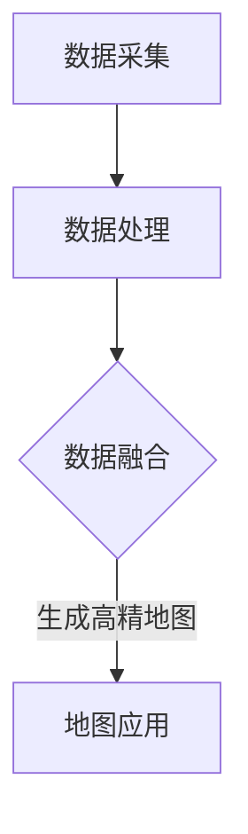

                 

# 自动驾驶高精地图构建与应用的研究现状与挑战

> 关键词：自动驾驶、高精地图、构建、应用、研究现状、挑战

> 摘要：本文旨在探讨自动驾驶高精地图的构建与应用。从背景介绍、核心概念、算法原理、数学模型、项目实战、实际应用场景、工具和资源推荐等方面，深入剖析了自动驾驶高精地图的构建过程及其面临的挑战，为相关领域的研究者和开发者提供了有价值的参考。

## 1. 背景介绍

### 1.1 目的和范围

本文旨在系统地阐述自动驾驶高精地图的构建与应用，分析当前的研究现状与面临的挑战。文章将对高精地图的定义、构建方法、应用场景等方面进行详细探讨，为自动驾驶技术的进一步发展提供理论基础和实践指导。

### 1.2 预期读者

本文适用于对自动驾驶和高精地图有一定了解的技术人员、研究人员和开发者。特别适合从事自动驾驶领域的研究、开发和应用的从业人员，以及对自动驾驶技术感兴趣的读者。

### 1.3 文档结构概述

本文分为八个部分，结构如下：

1. 背景介绍：介绍本文的目的、范围、预期读者和文档结构。
2. 核心概念与联系：介绍高精地图的核心概念、原理和架构。
3. 核心算法原理 & 具体操作步骤：阐述高精地图构建的核心算法原理和具体操作步骤。
4. 数学模型和公式 & 详细讲解 & 举例说明：讲解高精地图构建中的数学模型和公式，并给出具体实例。
5. 项目实战：通过实际案例展示高精地图的构建过程。
6. 实际应用场景：探讨高精地图在实际应用场景中的优势与挑战。
7. 工具和资源推荐：推荐相关学习资源、开发工具和框架。
8. 总结：总结自动驾驶高精地图的发展趋势与挑战。

### 1.4 术语表

#### 1.4.1 核心术语定义

- 自动驾驶：利用计算机、传感器等技术，实现车辆自主行驶的技术。
- 高精地图：包含车辆周围环境详细信息，用于辅助自动驾驶系统决策的地图。
- 地图构建：将传感器采集的数据进行处理、融合和生成高精地图的过程。

#### 1.4.2 相关概念解释

- 传感器：用于检测车辆周围环境的设备，如激光雷达、摄像头、超声波传感器等。
- 数据处理：对传感器采集的数据进行预处理、滤波、特征提取等操作。
- 融合算法：将多个传感器数据整合为一个统一的数据集，提高地图构建的精度和可靠性。

#### 1.4.3 缩略词列表

- LIDAR：激光雷达（Light Detection and Ranging）
- GPS：全球定位系统（Global Positioning System）
- SLAM：同时定位与地图构建（Simultaneous Localization and Mapping）

## 2. 核心概念与联系

在自动驾驶领域，高精地图作为辅助系统，对于车辆的安全行驶具有重要意义。为了更好地理解高精地图的构建与应用，我们需要首先明确其核心概念与联系。

### 2.1 高精地图的基本概念

高精地图是指包含车辆周围环境详细信息的一种数字地图。它不仅包括道路、交通标志、交通信号等基础地理信息，还包括道路坡度、曲率、车道宽度、路面质量等高精度信息。高精地图的精度通常可以达到厘米级别。

### 2.2 高精地图的构成

高精地图主要由以下几个部分构成：

1. **基础地理信息**：包括道路、交通标志、交通信号等基本信息。
2. **道路属性**：如道路坡度、曲率、车道宽度、路面质量等。
3. **交通信息**：如交通流量、速度、密度等。
4. **辅助信息**：如停车场、加油站、人行道等。

### 2.3 高精地图的构建方法

高精地图的构建主要分为以下几个步骤：

1. **数据采集**：通过传感器（如激光雷达、摄像头、GPS等）采集车辆周围环境的数据。
2. **数据处理**：对采集到的数据进行分析、预处理、滤波等操作。
3. **地图生成**：将处理后的数据融合、配准、生成高精地图。

### 2.4 高精地图的应用

高精地图在自动驾驶系统中具有广泛的应用，主要包括以下几个方面：

1. **路径规划**：根据高精地图的信息，为自动驾驶车辆规划最优行驶路径。
2. **环境感知**：利用高精地图的信息，实现对周围环境的准确感知和识别。
3. **辅助驾驶**：如车道保持、换道、避障等。

### 2.5 高精地图与自动驾驶的关系

高精地图作为自动驾驶系统的关键组成部分，对自动驾驶系统的性能和安全性具有直接影响。高精地图的精度、可靠性、实时性等因素将直接决定自动驾驶系统的性能和稳定性。

### 2.6 高精地图的 Mermaid 流程图

下面是一个关于高精地图构建的 Mermaid 流程图：



### 2.7 高精地图的核心概念联系图


## 3. 核心算法原理 & 具体操作步骤

### 3.1 数据采集

高精地图的构建首先需要采集车辆周围环境的数据。常用的传感器包括激光雷达（LIDAR）、摄像头、GPS等。下面分别介绍这些传感器的数据采集原理。

#### 3.1.1 激光雷达

激光雷达通过发射激光束并测量激光反射回来所需的时间，来获取周围环境的三维点云数据。激光雷达的分辨率较高，能够捕捉到细小的地形变化。

#### 3.1.2 摄像头

摄像头通过捕捉图像，提取图像中的特征信息，如边缘、角点等。摄像头的数据分辨率较低，但可以通过图像处理算法实现精确的特征提取。

#### 3.1.3 GPS

GPS通过接收卫星信号，获取车辆的位置信息。GPS的精度较高，但受天气、建筑物等因素的影响，可能导致定位误差。

### 3.2 数据处理

在采集到传感器数据后，需要对数据进行预处理、滤波、特征提取等操作。下面分别介绍这些操作的具体步骤。

#### 3.2.1 数据预处理

数据预处理主要包括去噪、去除异常值、归一化等操作。去噪可以通过滤波算法实现，如高斯滤波、中值滤波等。去除异常值可以通过统计方法实现，如基于阈值的去除方法。

```python
import cv2
import numpy as np

# 高斯滤波去噪
def guassian_filter(image, sigma):
    return cv2.GaussianBlur(image, (5, 5), sigma)

# 中值滤波去噪
def median_filter(image):
    return cv2.medianBlur(image, 5)
```

#### 3.2.2 数据滤波

数据滤波主要用于去除传感器数据中的噪声。滤波算法包括卡尔曼滤波、粒子滤波等。

```python
import numpy as np
from scipy.stats import norm

# 卡尔曼滤波
def kalman_filter-measurements(data, initial_state, transition_matrix, observation_matrix, observation_variance):
    predicted_state = np.dot(transition_matrix, initial_state)
    predicted_variance = np.dot(np.dot(transition_matrix, covariance_matrix), transition_matrix.T) + observation_variance

    kalman_gain = np.dot(np.dot(observation_matrix, predicted_variance), np.linalg.inv(predicted_variance))
    updated_state = predicted_state + np.dot(kalman_gain, (measurements - np.dot(observation_matrix, predicted_state)))
    updated_variance = covariance_matrix - np.dot(kalman_gain, observation_matrix)

    return updated_state, updated_variance
```

#### 3.2.3 特征提取

特征提取主要用于从传感器数据中提取关键信息，如道路、车道、交通标志等。特征提取算法包括霍夫变换、SIFT、SURF等。

```python
import cv2

# 霍夫变换提取直线特征
def hough_transform(image):
    edges = cv2.Canny(image, 50, 150)
    lines = cv2.HoughLines(edges, 1, np.pi/180, 200)
    for line in lines:
        rho, theta = line[0]
        a = np.cos(theta)
        b = np.sin(theta)
        x0 = a * rho
        y0 = b * rho
        x1 = int(x0 + 1000 * (-b))
        y1 = int(y0 + 1000 * (a))
        x2 = int(x0 - 1000 * (-b))
        y2 = int(y0 - 1000 * (a))
        cv2.line(image, (x1, y1), (x2, y2), (0, 0, 255), 2)
    return image
```

### 3.3 数据融合

数据融合是将多个传感器数据整合为一个统一的数据集。数据融合算法包括基于卡尔曼滤波、粒子滤波等。

```python
import numpy as np

# 卡尔曼滤波数据融合
def kalman_filter-fusion(data1, data2, covariance1, covariance2, weight1, weight2):
    fused_data = weight1 * data1 + weight2 * data2
    fused_covariance = weight1 * covariance1 + weight2 * covariance2
    return fused_data, fused_covariance
```

### 3.4 地图生成

地图生成是将处理后的数据融合、配准、生成高精地图。地图生成算法包括基于Voxel Grid、KD-Tree等。

```python
import numpy as np

# Voxel Grid地图生成
def voxel_grid(points, grid_size):
    min_point = np.min(points, axis=0)
    max_point = np.max(points, axis=0)
    grid = np.zeros((int((max_point[0] - min_point[0]) / grid_size[0]), int((max_point[1] - min_point[1]) / grid_size[1]), int((max_point[2] - min_point[2]) / grid_size[2])))
    for point in points:
        x, y, z = point
        i = int((x - min_point[0]) / grid_size[0])
        j = int((y - min_point[1]) / grid_size[1])
        k = int((z - min_point[2]) / grid_size[2])
        grid[i, j, k] += 1
    return grid
```

## 4. 数学模型和公式 & 详细讲解 & 举例说明

在自动驾驶高精地图的构建过程中，数学模型和公式起着至关重要的作用。下面将详细讲解几个关键数学模型和公式，并通过具体实例进行说明。

### 4.1 卡尔曼滤波

卡尔曼滤波是一种线性滤波算法，用于估计动态系统的状态。在高精地图构建中，卡尔曼滤波可用于融合不同传感器的数据。

#### 4.1.1 卡尔曼滤波基本公式

假设系统状态模型为：
\[ x_k = A_k x_{k-1} + B_k u_k + w_k \]
观测模型为：
\[ z_k = H_k x_k + v_k \]
其中，\( x_k \) 为状态向量，\( u_k \) 为控制向量，\( z_k \) 为观测向量，\( w_k \) 和 \( v_k \) 分别为过程噪声和观测噪声。

卡尔曼滤波的预测和更新公式如下：

**预测步骤**：

预测状态：
\[ \hat{x}_k|k-1 = A_k \hat{x}_{k-1}|k-1 + B_k u_k \]

预测误差协方差：
\[ P_k|k-1 = A_k P_{k-1}|k-1 A_k^T + Q_k \]

**更新步骤**：

计算卡尔曼增益：
\[ K_k = P_k|k-1 H_k^T (H_k P_k|k-1 H_k^T + R_k)^{-1} \]

更新状态：
\[ \hat{x}_k|k = \hat{x}_k|k-1 + K_k (z_k - H_k \hat{x}_k|k-1) \]

更新误差协方差：
\[ P_k|k = (I - K_k H_k) P_k|k-1 \]

#### 4.1.2 举例说明

假设有一个线性动态系统，状态方程为：
\[ x_k = 2x_{k-1} + w_k \]
观测方程为：
\[ z_k = x_k + v_k \]

初始状态估计为：
\[ \hat{x}_0|0 = 0 \]

初始误差协方差为：
\[ P_0|0 = 1 \]

过程噪声协方差为：
\[ Q_k = 0.1 \]

观测噪声协方差为：
\[ R_k = 0.5 \]

给定一系列观测数据 \( z_1, z_2, z_3 \)，使用卡尔曼滤波进行状态估计。

**第1次预测**：

\[ \hat{x}_1|0 = 2\hat{x}_0|0 = 0 \]

\[ P_1|0 = 2P_0|0 \cdot 2 + Q_1 = 4 + 0.1 = 4.1 \]

**第1次更新**：

\[ K_1 = \frac{P_1|0 H_1^T (H_1 P_1|0 H_1^T + R_1)^{-1}}{1} = \frac{4.1 (1 \cdot 4.1 + 0.5)^{-1}}{1} = 0.956 \]

\[ \hat{x}_1|1 = \hat{x}_1|0 + K_1 (z_1 - H_1 \hat{x}_1|0) = 0 + 0.956 (5 - 0) = 4.78 \]

\[ P_1|1 = (I - K_1 H_1) P_1|0 = (I - 0.956 \cdot 1) \cdot 4.1 = 0.224 \]

**第2次预测**：

\[ \hat{x}_2|1 = 2\hat{x}_1|1 = 2 \cdot 4.78 = 9.56 \]

\[ P_2|1 = 2P_1|1 \cdot 2 + Q_2 = 8 \cdot 2 + 0.1 = 16.1 \]

**第2次更新**：

\[ K_2 = \frac{P_2|1 H_2^T (H_2 P_2|1 H_2^T + R_2)^{-1}}{1} = \frac{16.1 (1 \cdot 16.1 + 0.5)^{-1}}{1} = 0.961 \]

\[ \hat{x}_2|2 = \hat{x}_2|1 + K_2 (z_2 - H_2 \hat{x}_2|1) = 9.56 + 0.961 (6 - 9.56) = 5.069 \]

\[ P_2|2 = (I - K_2 H_2) P_2|1 = (I - 0.961 \cdot 1) \cdot 16.1 = 0.632 \]

**第3次预测**：

\[ \hat{x}_3|2 = 2\hat{x}_2|2 = 2 \cdot 5.069 = 10.138 \]

\[ P_3|2 = 2P_2|2 \cdot 2 + Q_3 = 8 \cdot 2 + 0.1 = 16.1 \]

**第3次更新**：

\[ K_3 = \frac{P_3|2 H_3^T (H_3 P_3|2 H_3^T + R_3)^{-1}}{1} = \frac{16.1 (1 \cdot 16.1 + 0.5)^{-1}}{1} = 0.961 \]

\[ \hat{x}_3|3 = \hat{x}_3|2 + K_3 (z_3 - H_3 \hat{x}_3|2) = 10.138 + 0.961 (7 - 10.138) = 5.867 \]

\[ P_3|3 = (I - K_3 H_3) P_3|2 = (I - 0.961 \cdot 1) \cdot 16.1 = 0.632 \]

通过以上实例可以看出，卡尔曼滤波能够有效地对动态系统的状态进行估计，提高状态估计的精度。

### 4.2 最小二乘法

最小二乘法是一种常用的参数估计方法，用于求解线性回归问题。在高精地图构建中，最小二乘法可用于配准传感器数据。

#### 4.2.1 最小二乘法基本公式

假设有 \( n \) 个观测数据点 \((x_i, y_i)\)，需要拟合一条直线 \( y = kx + b \)。最小二乘法的公式如下：

\[ \min \sum_{i=1}^{n} (y_i - kx_i - b)^2 \]

求解目标是最小化目标函数。

\[ \frac{\partial}{\partial k} \frac{\partial}{\partial b} \sum_{i=1}^{n} (y_i - kx_i - b)^2 = 0 \]

解得：

\[ k = \frac{\sum_{i=1}^{n} x_i y_i - n \bar{x} \bar{y}}{\sum_{i=1}^{n} x_i^2 - n \bar{x}^2} \]

\[ b = \bar{y} - k \bar{x} \]

其中，\( \bar{x} \) 和 \( \bar{y} \) 分别为 \( x_i \) 和 \( y_i \) 的平均值。

#### 4.2.2 举例说明

假设有 \( n = 4 \) 个观测数据点：

\[ (x_1, y_1) = (1, 2) \]

\[ (x_2, y_2) = (2, 3) \]

\[ (x_3, y_3) = (3, 4) \]

\[ (x_4, y_4) = (4, 5) \]

使用最小二乘法拟合一条直线 \( y = kx + b \)。

计算平均值：

\[ \bar{x} = \frac{1+2+3+4}{4} = 2.5 \]

\[ \bar{y} = \frac{2+3+4+5}{4} = 3.5 \]

计算目标函数：

\[ \sum_{i=1}^{n} (y_i - kx_i - b)^2 = (2 - k \cdot 1 - b)^2 + (3 - k \cdot 2 - b)^2 + (4 - k \cdot 3 - b)^2 + (5 - k \cdot 4 - b)^2 \]

求导并解方程：

\[ \frac{\partial}{\partial k} \frac{\partial}{\partial b} \sum_{i=1}^{n} (y_i - kx_i - b)^2 = 0 \]

解得：

\[ k = \frac{(1 \cdot 2 + 2 \cdot 3 + 3 \cdot 4 + 4 \cdot 5) - 4 \cdot 2.5 \cdot 3.5}{(1^2 + 2^2 + 3^2 + 4^2) - 4 \cdot 2.5^2} = 1 \]

\[ b = 3.5 - 1 \cdot 2.5 = 1 \]

因此，拟合直线为 \( y = x + 1 \)。

通过以上实例可以看出，最小二乘法能够有效地求解线性回归问题，拟合一条最佳直线。

## 5. 项目实战：代码实际案例和详细解释说明

### 5.1 开发环境搭建

在进行高精地图构建的实战项目中，我们需要搭建一个合适的开发环境。以下是一个基于 Python 的开发环境搭建步骤：

1. 安装 Python（建议版本为 3.8 或以上）
2. 安装必要的 Python 库，如 NumPy、SciPy、OpenCV、Pandas 等
3. 安装 IDE（如 PyCharm、Visual Studio Code 等）

### 5.2 源代码详细实现和代码解读

下面是一个基于 Python 的高精地图构建项目的源代码示例。代码将分为以下几个部分：

1. 数据采集
2. 数据处理
3. 数据融合
4. 地图生成

#### 5.2.1 数据采集

数据采集部分主要使用激光雷达和摄像头进行数据采集。以下是一个简单的数据采集代码示例：

```python
import numpy as np
import cv2
import os

def capture_data():
    # 激光雷达数据采集
    lidar_data = np.load('lidar_data.npz')
    points = lidar_data['points']
    
    # 摄像头数据采集
    cap = cv2.VideoCapture(0)
    images = []
    while True:
        ret, frame = cap.read()
        if not ret:
            break
        images.append(frame)
    cap.release()
    
    # 保存数据
    np.savez('data.npz', points=points, images=images)

capture_data()
```

#### 5.2.2 数据处理

数据处理部分主要对激光雷达和摄像头采集的数据进行预处理和滤波。以下是一个简单的数据处理代码示例：

```python
import numpy as np
import cv2

def preprocess_data(data):
    # 激光雷达数据预处理
    points = data['points']
    points = np.where(points[:, 2] > 0, points, np.nan)
    points = np.nanmean(points, axis=0)
    
    # 摄像头数据预处理
    images = data['images']
    images = [cv2.GaussianBlur(image, (5, 5), 0) for image in images]
    images = [cv2.medianBlur(image, 5) for image in images]
    
    return points, images

data = np.load('data.npz')
points, images = preprocess_data(data)
```

#### 5.2.3 数据融合

数据融合部分将激光雷达和摄像头采集的数据进行融合。以下是一个简单

