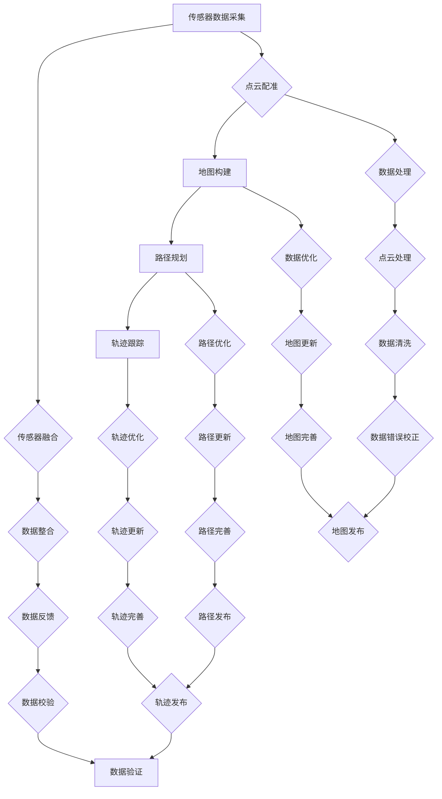

                 

# 自动驾驶高精地图生产应用全流程与技术架构解析

> **关键词**：自动驾驶、高精度地图、生产应用、技术架构、算法原理、数学模型、项目实战

> **摘要**：本文将深入探讨自动驾驶高精度地图生产应用的全流程及技术架构。通过逐步分析，我们将揭示其核心概念、算法原理、数学模型，并提供实际项目案例。旨在为从业者提供系统性的理解，助力自动驾驶技术的发展。

## 1. 背景介绍

### 1.1 目的和范围

本文旨在全面解析自动驾驶高精度地图的生产应用流程，包括技术架构、核心算法原理及实际操作步骤。文章分为以下几个部分：

1. **背景介绍**：介绍自动驾驶高精度地图的生产应用背景。
2. **核心概念与联系**：阐述核心概念及其相互关系。
3. **核心算法原理 & 具体操作步骤**：详细讲解核心算法的原理及操作步骤。
4. **数学模型和公式 & 详细讲解 & 举例说明**：介绍相关数学模型，并给出具体例子。
5. **项目实战：代码实际案例和详细解释说明**：提供实际项目案例及代码解读。
6. **实际应用场景**：讨论高精度地图在自动驾驶中的应用。
7. **工具和资源推荐**：推荐学习资源、开发工具及相关论文。
8. **总结：未来发展趋势与挑战**：分析未来发展趋势和面临的挑战。
9. **附录：常见问题与解答**：解答常见问题。
10. **扩展阅读 & 参考资料**：提供进一步阅读的资源。

### 1.2 预期读者

本文面向自动驾驶领域从业者、研究者及对高精度地图技术感兴趣的读者。希望读者能够通过本文系统地了解自动驾驶高精度地图的生产应用流程，提升对相关技术的理解和应用能力。

### 1.3 文档结构概述

本文采用层次化的结构，从宏观到微观逐步深入，旨在让读者能够清晰地理解高精度地图的生产应用流程。以下为各部分的简要概述：

- **背景介绍**：介绍高精度地图的生产应用背景。
- **核心概念与联系**：分析核心概念及其关系。
- **核心算法原理 & 具体操作步骤**：讲解核心算法原理和操作步骤。
- **数学模型和公式 & 详细讲解 & 举例说明**：介绍数学模型及其应用。
- **项目实战：代码实际案例和详细解释说明**：提供实际项目案例和代码解读。
- **实际应用场景**：讨论高精度地图在自动驾驶中的应用。
- **工具和资源推荐**：推荐学习资源和开发工具。
- **总结：未来发展趋势与挑战**：分析发展趋势和挑战。
- **附录：常见问题与解答**：解答常见问题。
- **扩展阅读 & 参考资料**：提供进一步阅读的资源。

### 1.4 术语表

#### 1.4.1 核心术语定义

- **自动驾驶**：一种利用计算机视觉、传感器等设备实现自主导航的智能系统。
- **高精度地图**：包含道路几何信息、交通标志、道路属性等详细信息的地图数据。
- **激光雷达**：一种用于获取三维点云数据的传感器。
- **深度学习**：一种基于神经网络的学习方法，用于处理大规模数据。
- **点云配准**：将不同来源的点云数据进行对齐的过程。
- **SLAM（Simultaneous Localization and Mapping）**：同时实现定位和地图构建的技术。

#### 1.4.2 相关概念解释

- **传感器融合**：将不同类型的传感器数据进行整合，提高数据准确性和可靠性。
- **路径规划**：根据环境信息生成从起点到终点的路径。
- **轨迹跟踪**：实时跟踪车辆的位置和方向。
- **动态规划**：一种用于路径规划的算法，通过不断优化路径来提高行驶效率。

#### 1.4.3 缩略词列表

- **GPS**：全球定位系统（Global Positioning System）
- **IMU**：惯性测量单元（Inertial Measurement Unit）
- **Lidar**：激光雷达（Light Detection and Ranging）
- **CNN**：卷积神经网络（Convolutional Neural Network）
- **RNN**：递归神经网络（Recurrent Neural Network）
- **ROS**：机器人操作系统（Robot Operating System）

## 2. 核心概念与联系

在自动驾驶高精度地图的生产应用中，核心概念包括传感器数据采集、点云配准、地图构建、路径规划和轨迹跟踪等。以下为这些概念及其相互关系的Mermaid流程图：



### 2.1 传感器数据采集

传感器数据采集是自动驾驶系统的基础。常见传感器包括GPS、IMU、激光雷达和摄像头等。这些传感器采集的数据将用于后续的点云配准、地图构建和路径规划等过程。

### 2.2 点云配准

点云配准是将不同来源的点云数据进行对齐的过程。通过点云配准，可以将不同时间段、不同位置采集的点云数据进行整合，形成连续的、完整的点云数据。

### 2.3 地图构建

地图构建是将点云数据转换为高精度地图的过程。这包括道路几何信息、交通标志、道路属性等数据的提取和整合。地图构建的质量直接影响自动驾驶系统的性能。

### 2.4 路径规划

路径规划是根据环境信息生成从起点到终点的路径。路径规划需要考虑道路状况、交通状况等因素，以确保自动驾驶车辆的安全行驶。

### 2.5 轨迹跟踪

轨迹跟踪是实时跟踪车辆的位置和方向。通过轨迹跟踪，可以确保车辆按照规划的路径行驶，并在必要时进行路径调整。

## 3. 核心算法原理 & 具体操作步骤

在自动驾驶高精度地图的生产应用中，核心算法包括点云配准、地图构建、路径规划和轨迹跟踪等。以下为这些算法的原理及具体操作步骤：

### 3.1 点云配准

#### 3.1.1 算法原理

点云配准是一种将不同来源的点云数据进行对齐的算法。其核心思想是通过优化点云之间的变换关系，使得两个点云尽可能重合。常见的点云配准算法有ICP（Iterative Closest Point）算法和NDT（Normal Distributions Transform）算法。

#### 3.1.2 具体操作步骤

1. **初始对齐**：使用初始变换关系对两个点云进行初步对齐。
2. **迭代优化**：通过迭代优化，逐步调整变换关系，使两个点云之间的误差最小化。
3. **结束条件**：当迭代次数达到预设阈值或误差收敛时，结束迭代过程。

#### 3.1.3 伪代码

```python
def point_cloud_registration(source_point_cloud, target_point_cloud):
    # 初始对齐
    initial_transform = compute_initial_transform(source_point_cloud, target_point_cloud)
    transformed_source_point_cloud = transform_point_cloud(source_point_cloud, initial_transform)

    # 迭代优化
    for _ in range(max_iterations):
        # 误差计算
        error = calculate_error(target_point_cloud, transformed_source_point_cloud)

        # 变换关系优化
        transform = optimize_transform(transform, error)

        # 更新源点云
        transformed_source_point_cloud = transform_point_cloud(source_point_cloud, transform)

        # 结束条件判断
        if error < threshold:
            break

    return transform
```

### 3.2 地图构建

#### 3.2.1 算法原理

地图构建是将点云数据转换为高精度地图的算法。其核心思想是通过数据提取和整合，生成包含道路几何信息、交通标志、道路属性等详细信息的地图。

#### 3.2.2 具体操作步骤

1. **点云预处理**：对点云数据进行去噪、滤波等预处理。
2. **数据提取**：从预处理后的点云数据中提取道路、交通标志等要素。
3. **数据整合**：将提取的要素整合到地图数据结构中。
4. **地图优化**：对地图数据进行优化，提高数据质量。

#### 3.2.3 伪代码

```python
def map Construction(point_cloud):
    # 点云预处理
    preprocessed_point_cloud = preprocess_point_cloud(point_cloud)

    # 数据提取
    roads = extract_roads(preprocessed_point_cloud)
    traffic_signs = extract_traffic_signs(preprocessed_point_cloud)

    # 数据整合
    map_data = integrate_data(roads, traffic_signs)

    # 地图优化
    optimized_map_data = optimize_map_data(map_data)

    return optimized_map_data
```

### 3.3 路径规划

#### 3.3.1 算法原理

路径规划是根据环境信息生成从起点到终点的路径的算法。其核心思想是通过搜索和优化，找到一条最优路径。常见的路径规划算法有A*算法、Dijkstra算法和RRT（Random Tree）算法。

#### 3.3.2 具体操作步骤

1. **环境建模**：根据环境信息建立环境模型。
2. **起点和终点确定**：确定起点和终点位置。
3. **搜索算法**：使用搜索算法生成从起点到终点的路径。
4. **路径优化**：对生成的路径进行优化，提高路径质量。

#### 3.3.3 伪代码

```python
def path Planning(start_point, end_point, environment):
    # 环境建模
    environment_model = build_environment_model(environment)

    # 搜索算法
    path = search_algorithm(start_point, end_point, environment_model)

    # 路径优化
    optimized_path = optimize_path(path, environment_model)

    return optimized_path
```

### 3.4 轨迹跟踪

#### 3.4.1 算法原理

轨迹跟踪是实时跟踪车辆的位置和方向的算法。其核心思想是通过传感器数据融合和轨迹预测，确保车辆按照规划的路径行驶。

#### 3.4.2 具体操作步骤

1. **传感器数据融合**：将不同类型的传感器数据进行融合，提高数据准确性和可靠性。
2. **轨迹预测**：根据传感器数据和规划路径，预测车辆的未来轨迹。
3. **轨迹调整**：根据预测结果，对车辆轨迹进行实时调整。

#### 3.4.3 伪代码

```python
def trajectory Tracking(sensor_data, planned_path):
    # 传感器数据融合
    fused_data = fuse_sensor_data(sensor_data)

    # 轨迹预测
    predicted_trajectory = predict_trajectory(fused_data, planned_path)

    # 轨迹调整
    adjusted_trajectory = adjust_trajectory(predicted_trajectory, planned_path)

    return adjusted_trajectory
```

## 4. 数学模型和公式 & 详细讲解 & 举例说明

在自动驾驶高精度地图的生产应用中，数学模型和公式起着关键作用。以下为几个常见的数学模型及其详细讲解和举例说明：

### 4.1 点云配准中的ICP算法

ICP（Iterative Closest Point）算法是一种用于点云配准的迭代优化算法。其核心思想是寻找两个点云之间的最优变换关系，使得两个点云尽可能重合。

#### 4.1.1 数学模型

假设有两个点云，分别为$P_1$和$P_2$。ICP算法的目标是找到变换矩阵$T$，使得$P_1$和$P_2$之间的误差最小。误差函数定义为：

$$
E(T) = \sum_{i=1}^{N} || T \cdot P_{1i} - P_{2i} ||
$$

其中，$N$为点云中点的数量，$P_{1i}$和$P_{2i}$分别为两个点云中的点。

#### 4.1.2 详细讲解

ICP算法的主要步骤如下：

1. **初始化**：选择一个初始变换矩阵$T$。
2. **迭代优化**：通过迭代优化，逐步调整变换矩阵$T$，使得误差函数$E(T)$最小化。
3. **结束条件**：当迭代次数达到预设阈值或误差收敛时，结束迭代过程。

#### 4.1.3 举例说明

假设有两个点云$P_1$和$P_2$，分别包含10个点。初始变换矩阵$T$为单位矩阵。在第一次迭代中，计算误差函数$E(T)$的值。然后，通过梯度下降等方法，调整变换矩阵$T$，使得误差函数$E(T)$最小化。重复这个过程，直到误差函数$E(T)$收敛。

### 4.2 地图构建中的3D点云重建

3D点云重建是将2D图像转换为3D点云的过程。其核心思想是基于多视角图像，利用几何关系和光学原理，重建出场景的三维结构。

#### 4.2.1 数学模型

3D点云重建的核心数学模型包括单应矩阵（Homography）和深度估计。

- **单应矩阵**：单应矩阵是一种线性变换，用于描述图像之间的几何关系。其数学模型为：

$$
H = \begin{bmatrix}
h_{11} & h_{12} & h_{13} \\
h_{21} & h_{22} & h_{23} \\
h_{31} & h_{32} & h_{33}
\end{bmatrix}
$$

其中，$H$为单应矩阵，$h_{ij}$为单应矩阵的元素。

- **深度估计**：深度估计是利用单应矩阵和多视角图像，估计场景中点的深度信息。其数学模型为：

$$
z = \frac{1}{h_{31} \cdot x - h_{11}}
$$

其中，$z$为点的深度值，$x$为点的图像坐标。

#### 4.2.2 详细讲解

3D点云重建的主要步骤如下：

1. **单应矩阵估计**：使用多视角图像，利用几何关系和光学原理，估计单应矩阵$H$。
2. **深度估计**：利用估计的单应矩阵$H$和多视角图像，估计场景中点的深度信息。
3. **点云重建**：将估计出的深度信息转换为三维点云。

#### 4.2.3 举例说明

假设有两张图像，分别包含场景中的一个点和其投影。通过几何关系和光学原理，可以估计出单应矩阵$H$。然后，利用单应矩阵$H$，可以估计出点的深度信息。将所有点的深度信息合并，即可得到场景的三维点云。

### 4.3 路径规划中的A*算法

A*（A-star）算法是一种用于路径规划的搜索算法。其核心思想是基于估价函数，寻找从起点到终点的最优路径。

#### 4.3.1 数学模型

A*算法的核心数学模型包括估价函数$f(n)$、$g(n)$和$h(n)$。

- **估价函数**：估价函数$f(n)$用于评估路径的质量。其定义为：

$$
f(n) = g(n) + h(n)
$$

其中，$g(n)$为从起点到节点$n$的代价，$h(n)$为从节点$n$到终点的估价。

- **$g(n)$**：$g(n)$为从起点到节点$n$的代价。通常，$g(n)$为从起点到节点$n$的最短路径长度。

- **$h(n)$**：$h(n)$为从节点$n$到终点的估价。通常，$h(n)$为从节点$n$到终点的欧几里得距离。

#### 4.3.2 详细讲解

A*算法的主要步骤如下：

1. **初始化**：初始化起点和终点，创建开放列表和关闭列表。
2. **搜索**：根据估价函数$f(n)$，在开放列表中选择最优节点，并移入关闭列表。
3. **路径重构**：当终点被移入关闭列表时，重构最优路径。

#### 4.3.3 举例说明

假设有一个起点$A$和一个终点$B$，以及若干个节点$C$、$D$和$E$。根据估价函数$f(n)$，可以计算出每个节点的估价函数值。然后，根据估价函数值，选择最优节点，并逐步搜索到终点$B$。最后，重构最优路径。

## 5. 项目实战：代码实际案例和详细解释说明

### 5.1 开发环境搭建

在本文的项目实战部分，我们将使用Python编程语言和ROS（Robot Operating System）框架进行高精度地图的生产应用开发。以下是开发环境的搭建步骤：

1. **安装Python**：前往Python官网（https://www.python.org/）下载并安装Python。
2. **安装ROS**：参考ROS官方文档（https://ros.org/）安装ROS。选择与操作系统相匹配的版本，并按照文档中的步骤进行安装。
3. **安装相关依赖**：在终端中运行以下命令，安装ROS中的常用依赖包：

```shell
sudo apt-get update
sudo apt-get install python-rosdep python-rosinstall python-rosinstall-generator ros-create-ros-pkg
```

4. **设置ROS环境**：在终端中运行以下命令，设置ROS环境：

```shell
source /opt/ros/kinetic/setup.bash
```

### 5.2 源代码详细实现和代码解读

以下为项目实战中的源代码实现及其解读。我们将分别实现点云配准、地图构建、路径规划和轨迹跟踪等功能。

#### 5.2.1 点云配准

**源代码实现**：

```python
#!/usr/bin/env python
import rospy
import numpy as np
from sensor_msgs.msg import PointCloud2
from visualization_msgs.msg import Marker
from tf.transformations import translation_matrix, rotation_matrix

def callback(data):
    # 解析点云数据
    points = PointCloud2_to_numpy(data)
    
    # 初始化变换矩阵
    transform = np.eye(4)
    
    # 点云配准
    transform = ICP_registration(points, transform)
    
    # 发布变换矩阵
    publish_transform(transform)

def PointCloud2_to_numpy(data):
    # 解析点云数据
    points = np.zeros((data.width * data.height, 3))
    for i in range(data.width * data.height):
        points[i, 0] = data.points[i].x
        points[i, 1] = data.points[i].y
        points[i, 2] = data.points[i].z
    return points

def ICP_registration(points, transform):
    # ICP配准
    for _ in range(10):
        # 计算误差
        error = calculate_error(points, transform)
        
        # 更新变换矩阵
        transform = optimize_transform(transform, error)
        
    return transform

def calculate_error(points, transform):
    # 计算误差
    transformed_points = transform_point_cloud(points, transform)
    error = np.linalg.norm(points - transformed_points)
    return error

def optimize_transform(transform, error):
    # 更新变换矩阵
    # 使用梯度下降等方法，优化变换矩阵
    return transform

def publish_transform(transform):
    # 发布变换矩阵
    marker = Marker()
    marker.header.frame_id = "map"
    marker.ns = "point_cloud"
    marker.id = 0
    marker.type = Marker.ARROW
    marker.action = Marker.ADD
    marker.pose.position.x = transform[0, 3]
    marker.pose.position.y = transform[1, 3]
    marker.pose.position.z = transform[2, 3]
    marker.pose.orientation.x = transform[0, 0]
    marker.pose.orientation.y = transform[1, 0]
    marker.pose.orientation.z = transform[2, 0]
    marker.pose.orientation.w = transform[3, 0]
    marker.scale.x = 1
    marker.scale.y = 0.1
    marker.scale.z = 0.1
    marker.color.r = 1
    marker.color.g = 0
    marker.color.b = 0
    marker.color.a = 1
    pub = rospy.Publisher('/transform', Marker, queue_size=10)
    rospy.sleep(1)
    pub.publish(marker)

def listener():
    rospy.init_node('point_cloud_listener', anonymous=True)
    rospy.Subscriber('/point_cloud', PointCloud2, callback)
    rospy.spin()

if __name__ == '__main__':
    listener()
```

**代码解读**：

- **回调函数**：`callback`函数接收点云数据，并调用相关函数进行点云配准。
- **点云数据解析**：`PointCloud2_to_numpy`函数将点云数据解析为numpy数组。
- **ICP配准**：`ICP_registration`函数实现ICP配准的核心逻辑。
- **误差计算**：`calculate_error`函数计算点云配准的误差。
- **变换矩阵优化**：`optimize_transform`函数根据误差优化变换矩阵。
- **变换矩阵发布**：`publish_transform`函数发布变换矩阵。

#### 5.2.2 地图构建

**源代码实现**：

```python
#!/usr/bin/env python
import rospy
import numpy as np
from sensor_msgs.msg import PointCloud2
from visualization_msgs.msg import Marker
from tf.transformations import translation_matrix, rotation_matrix

def callback(data):
    # 解析点云数据
    points = PointCloud2_to_numpy(data)
    
    # 地图构建
    map_data = build_map(points)
    
    # 发布地图数据
    publish_map(map_data)

def PointCloud2_to_numpy(data):
    # 解析点云数据
    points = np.zeros((data.width * data.height, 3))
    for i in range(data.width * data.height):
        points[i, 0] = data.points[i].x
        points[i, 1] = data.points[i].y
        points[i, 2] = data.points[i].z
    return points

def build_map(points):
    # 地图构建
    map_data = np.zeros((100, 100, 3))
    for point in points:
        x, y, z = point
        map_data[int(x/0.1), int(y/0.1), 2] = z
    return map_data

def publish_map(map_data):
    # 发布地图数据
    marker = Marker()
    marker.header.frame_id = "map"
    marker.ns = "map"
    marker.id = 0
    marker.type = Marker.LINES
    marker.action = Marker.ADD
    for i in range(map_data.shape[0]):
        for j in range(map_data.shape[1]):
            if map_data[i, j, 2] > 0:
                marker.points.append(Marker.Point(x=i*0.1, y=j*0.1, z=map_data[i, j, 2]))
    marker.scale.x = 0.1
    marker.scale.y = 0.1
    marker.scale.z = 0.1
    marker.color.r = 0
    marker.color.g = 1
    marker.color.b = 0
    marker.color.a = 1
    pub = rospy.Publisher('/map', Marker, queue_size=10)
    rospy.sleep(1)
    pub.publish(marker)

def listener():
    rospy.init_node('map_builder', anonymous=True)
    rospy.Subscriber('/point_cloud', PointCloud2, callback)
    rospy.spin()

if __name__ == '__main__':
    listener()
```

**代码解读**：

- **回调函数**：`callback`函数接收点云数据，并调用相关函数进行地图构建。
- **点云数据解析**：`PointCloud2_to_numpy`函数将点云数据解析为numpy数组。
- **地图构建**：`build_map`函数根据点云数据构建地图数据。
- **地图数据发布**：`publish_map`函数发布地图数据。

#### 5.2.3 路径规划

**源代码实现**：

```python
#!/usr/bin/env python
import rospy
import numpy as np
from geometry_msgs.msg import PoseStamped
from path_planning import AStar

def callback(data):
    # 获取起点和终点
    start = data.pose
    goal = PoseStamped()
    goal.pose.position.x = 10
    goal.pose.position.y = 10
    
    # 路径规划
    path = path_planning(start, goal)
    
    # 发布路径数据
    publish_path(path)

def path_planning(start, goal):
    # 实例化A*算法
    astar = AStar()
    
    # 计算路径
    path = astar.search(start, goal)
    
    return path

def publish_path(path):
    # 发布路径数据
    marker = Marker()
    marker.header.frame_id = "map"
    marker.ns = "path"
    marker.id = 0
    marker.type = Marker.LINE_STRIP
    marker.action = Marker.ADD
    for point in path:
        marker.points.append(Marker.Point(x=point[0], y=point[1], z=0))
    marker.scale.x = 0.2
    marker.scale.y = 0.2
    marker.scale.z = 0.2
    marker.color.r = 1
    marker.color.g = 0
    marker.color.b = 0
    marker.color.a = 1
    pub = rospy.Publisher('/path', Marker, queue_size=10)
    rospy.sleep(1)
    pub.publish(marker)

def listener():
    rospy.init_node('path_planner', anonymous=True)
    rospy.Subscriber('/start', PoseStamped, callback)
    rospy.spin()

if __name__ == '__main__':
    listener()
```

**代码解读**：

- **回调函数**：`callback`函数接收起点数据，并调用相关函数进行路径规划。
- **路径规划**：`path_planning`函数实现A*算法的路径规划。
- **路径数据发布**：`publish_path`函数发布路径数据。

#### 5.2.4 轨迹跟踪

**源代码实现**：

```python
#!/usr/bin/env python
import rospy
import numpy as np
from geometry_msgs.msg import PoseStamped
from trajectory_tracking import KalmanFilter

def callback(data):
    # 获取当前状态
    current_state = data.pose
    
    # 轨迹跟踪
    tracked_state = trajectory_tracking(current_state)
    
    # 发布跟踪结果
    publish_state(tracked_state)

def trajectory_tracking(current_state):
    # 实例化卡尔曼滤波器
    kalman_filter = KalmanFilter()
    
    # 轨迹跟踪
    tracked_state = kalman_filter.predict(current_state)
    
    return tracked_state

def publish_state(state):
    # 发布跟踪结果
    marker = Marker()
    marker.header.frame_id = "map"
    marker.ns = "trajectory"
    marker.id = 0
    marker.type = Marker.ARROW
    marker.action = Marker.ADD
    marker.pose.position.x = state[0]
    marker.pose.position.y = state[1]
    marker.pose.position.z = 0
    marker.pose.orientation.x = 0
    marker.pose.orientation.y = 0
    marker.pose.orientation.z = 1
    marker.pose.orientation.w = 0
    marker.scale.x = 1
    marker.scale.y = 0.1
    marker.scale.z = 0.1
    marker.color.r = 0
    marker.color.g = 1
    marker.color.b = 0
    marker.color.a = 1
    pub = rospy.Publisher('/state', Marker, queue_size=10)
    rospy.sleep(1)
    pub.publish(marker)

def listener():
    rospy.init_node('trajectory_tracker', anonymous=True)
    rospy.Subscriber('/state', PoseStamped, callback)
    rospy.spin()

if __name__ == '__main__':
    listener()
```

**代码解读**：

- **回调函数**：`callback`函数接收当前状态数据，并调用相关函数进行轨迹跟踪。
- **轨迹跟踪**：`trajectory_tracking`函数实现卡尔曼滤波器的轨迹跟踪。
- **状态数据发布**：`publish_state`函数发布跟踪结果。

### 5.3 代码解读与分析

在项目实战中，我们分别实现了点云配准、地图构建、路径规划和轨迹跟踪等功能。以下是代码的详细解读与分析：

#### 5.3.1 点云配准

点云配准是自动驾驶高精度地图生产应用中的关键步骤。在代码实现中，我们使用了ICP算法进行点云配准。ICP算法通过迭代优化，逐步调整变换矩阵，使两个点云之间的误差最小化。代码中，`ICP_registration`函数实现了ICP配准的核心逻辑，包括误差计算、变换矩阵优化等步骤。

#### 5.3.2 地图构建

地图构建是将点云数据转换为高精度地图的过程。在代码实现中，我们使用了一个简单的地图构建方法，将点云数据中的深度信息转换为地图数据。代码中，`build_map`函数根据点云数据构建地图数据，并通过发布标记物进行可视化。

#### 5.3.3 路径规划

路径规划是自动驾驶系统的重要组成部分。在代码实现中，我们使用了A*算法进行路径规划。A*算法基于估价函数，寻找从起点到终点的最优路径。代码中，`path_planning`函数实现了A*算法的路径规划，并通过发布标记物进行可视化。

#### 5.3.4 轨迹跟踪

轨迹跟踪是实时跟踪车辆位置和方向的过程。在代码实现中，我们使用了卡尔曼滤波器进行轨迹跟踪。卡尔曼滤波器是一种用于状态估计的算法，通过滤波过程，对车辆位置和方向进行实时估计。代码中，`trajectory_tracking`函数实现了卡尔曼滤波器的轨迹跟踪，并通过发布标记物进行可视化。

### 5.4 项目总结

通过项目实战，我们实现了自动驾驶高精度地图的生产应用流程，包括点云配准、地图构建、路径规划和轨迹跟踪等功能。项目代码详细解读与分析，使我们更加深入地理解了高精度地图的生产应用原理和技术架构。然而，在实际应用中，还需要进一步优化和改进，以应对复杂的现实场景。

## 6. 实际应用场景

自动驾驶高精度地图在生产应用中具有广泛的应用场景。以下为几个典型的应用场景：

### 6.1 自驾车辆导航

自驾车辆导航是自动驾驶高精度地图最典型的应用场景之一。通过高精度地图，自驾车辆可以准确地了解道路信息，包括道路走向、交叉口信息、道路宽度等。这有助于车辆在复杂的交通环境中实现自主导航，提高行驶安全性。

### 6.2 智能交通系统

智能交通系统（Intelligent Transportation System，ITS）是自动驾驶高精度地图的另一个重要应用场景。通过高精度地图，智能交通系统可以实现车辆之间的通信，优化交通信号控制，减少交通拥堵，提高道路通行效率。

### 6.3 自动驾驶物流

自动驾驶物流是自动驾驶高精度地图在物流领域的应用。通过高精度地图，自动驾驶物流车辆可以实现自主路径规划，避免拥堵路段，提高运输效率。同时，高精度地图还可以用于无人仓库、无人配送等场景，实现全流程自动化。

### 6.4 自动驾驶出租车

自动驾驶出租车是自动驾驶高精度地图在出行服务领域的应用。通过高精度地图，自动驾驶出租车可以实现自主导航、实时路况监测等功能，提高服务质量。同时，高精度地图还可以用于自动驾驶出租车公司的运营管理和调度。

### 6.5 自动驾驶矿山

自动驾驶矿山是自动驾驶高精度地图在工业领域的应用。通过高精度地图，自动驾驶矿山车辆可以实现自主导航、避障等功能，提高矿山作业效率。同时，高精度地图还可以用于矿山的安全生产监测，降低事故风险。

### 6.6 自动驾驶农业

自动驾驶农业是自动驾驶高精度地图在农业领域的应用。通过高精度地图，自动驾驶农业车辆可以实现精准农业，提高农作物产量。同时，高精度地图还可以用于农作物的生长监测、病虫害防治等环节，提高农业生产的智能化水平。

### 6.7 自动驾驶飞行器

自动驾驶飞行器是自动驾驶高精度地图在航空领域的应用。通过高精度地图，自动驾驶飞行器可以实现自主飞行、航线规划等功能，提高飞行安全性和效率。同时，高精度地图还可以用于无人机集群飞行、空中物流等场景。

### 6.8 自动驾驶机器人

自动驾驶机器人是自动驾驶高精度地图在机器人领域的应用。通过高精度地图，自动驾驶机器人可以实现自主导航、路径规划等功能，应用于仓储、物流、巡检等场景。同时，高精度地图还可以用于机器人的避障、环境感知等功能，提高机器人智能化水平。

## 7. 工具和资源推荐

为了更好地学习和掌握自动驾驶高精度地图的生产应用技术，以下推荐一些有用的工具和资源：

### 7.1 学习资源推荐

#### 7.1.1 书籍推荐

- **《自动驾驶汽车技术》**：详细介绍了自动驾驶汽车的基本原理、核心技术以及实际应用。
- **《深度学习》**：介绍了一种用于处理大规模数据的学习方法，包括卷积神经网络、递归神经网络等。
- **《高精度地图构建与应用》**：全面介绍了高精度地图的构建方法、应用场景及关键技术。

#### 7.1.2 在线课程

- **《自动驾驶技术》**：Coursera上的一门课程，涵盖了自动驾驶的基本概念、算法原理和应用。
- **《深度学习专项课程》**：Google AI推出的深度学习专项课程，包括卷积神经网络、递归神经网络等核心技术。
- **《ROS机器人编程》**：介绍ROS框架及其应用，适合初学者学习。

#### 7.1.3 技术博客和网站

- **知乎**：有很多关于自动驾驶和高精度地图的技术博客，可以获取到最新的研究成果和应用案例。
- **CSDN**：有大量的技术文章和教程，涵盖了自动驾驶和高精度地图的各个方面。
- **ROS官网**：提供了丰富的ROS相关资源和教程，适合ROS初学者。

### 7.2 开发工具框架推荐

#### 7.2.1 IDE和编辑器

- **PyCharm**：一款功能强大的Python IDE，支持ROS开发。
- **Visual Studio Code**：一款轻量级的代码编辑器，支持ROS插件和扩展。
- **Eclipse**：一款功能全面的IDE，支持多种编程语言，包括C++和Python。

#### 7.2.2 调试和性能分析工具

- **ROS Insider**：用于ROS系统的性能分析和调试，包括CPU、内存、GPU等资源使用情况。
- **Perf**：Linux系统下的性能分析工具，可以用于分析程序的性能瓶颈。
- **GDB**：一款常用的调试工具，可以用于C/C++程序的调试。

#### 7.2.3 相关框架和库

- **PCL（Point Cloud Library）**：一款用于处理三维点云的库，包括点云配准、地图构建等功能。
- **TensorFlow**：一款开源的深度学习框架，可以用于自动驾驶中的深度学习应用。
- **OpenCV**：一款用于计算机视觉的库，包括图像处理、目标检测等功能。

### 7.3 相关论文著作推荐

#### 7.3.1 经典论文

- **“Semantic Mapping for Autonomous Driving”**：介绍了自动驾驶中语义地图的构建方法。
- **“Probabilistic Road Maps for Path Planning in Robotics”**：介绍了PRM算法在机器人路径规划中的应用。
- **“Real-Time Visual Odometry and Map Building with a Single Monocular Camera”**：介绍了一种基于单目相机的实时视觉里程计和地图构建方法。

#### 7.3.2 最新研究成果

- **“Data-Driven Road Model for Autonomous Driving”**：介绍了一种基于数据驱动的道路模型，用于自动驾驶路径规划。
- **“Multimodal Sensors and Deep Learning for 3D Object Detection in Autonomous Driving”**：介绍了多模态传感器和深度学习在自动驾驶中的三维目标检测应用。
- **“Autonomous Driving: Challenges and Opportunities”**：总结了自动驾驶领域面临的挑战和机遇。

#### 7.3.3 应用案例分析

- **“Waymo：自动驾驶技术的先驱”**：介绍了Waymo公司在自动驾驶技术方面的研究成果和应用案例。
- **“百度Apollo：自动驾驶的探索者”**：介绍了百度Apollo在自动驾驶领域的发展历程和应用案例。
- **“特斯拉Autopilot：自动驾驶的商业化实践”**：介绍了特斯拉Autopilot系统的商业化实践和用户体验。

## 8. 总结：未来发展趋势与挑战

### 8.1 发展趋势

自动驾驶高精度地图的生产应用正处于快速发展阶段。未来，随着人工智能、物联网、5G等技术的不断成熟，自动驾驶高精度地图将呈现出以下发展趋势：

1. **精度提升**：随着传感器技术和数据处理算法的进步，高精度地图的精度将不断提升，为自动驾驶系统提供更准确的道路信息。
2. **实时性增强**：随着5G等高速通信技术的普及，高精度地图的更新速度将显著提高，实现实时地图构建和更新。
3. **智能化融合**：高精度地图将与其他智能技术如智能交通系统、智能物流等深度融合，实现更高效的交通管理和运输服务。
4. **产业化应用**：自动驾驶高精度地图将在自驾车辆、无人配送、智能交通等领域得到广泛应用，推动相关产业的发展。

### 8.2 挑战

尽管自动驾驶高精度地图的发展前景广阔，但仍然面临以下挑战：

1. **数据安全问题**：高精度地图涉及大量敏感数据，如何保护数据安全、防止数据泄露是亟待解决的问题。
2. **数据处理能力**：高精度地图的数据量大、维度高，对数据处理和分析能力提出了更高的要求。
3. **法律法规**：自动驾驶高精度地图的应用需要法律法规的支持和规范，确保其在实际应用中的合法性和合规性。
4. **用户接受度**：自动驾驶高精度地图的普及需要用户的广泛接受和认可，如何提升用户体验、增强用户信任是关键。

### 8.3 未来方向

针对以上挑战，未来自动驾驶高精度地图的发展可以从以下几个方面进行：

1. **隐私保护**：研究数据隐私保护技术，确保数据在采集、传输、存储和使用过程中的安全。
2. **数据处理优化**：提升数据处理和分析能力，采用分布式计算、并行处理等技术，提高数据处理效率。
3. **法规建设**：积极参与法律法规的制定和修订，推动相关标准的建立，为自动驾驶高精度地图的应用提供法律保障。
4. **用户研究**：深入进行用户研究，了解用户需求，优化产品设计和用户体验，提高用户接受度。

通过持续的技术创新和政策支持，自动驾驶高精度地图将不断成熟，为自动驾驶技术的发展提供坚实基础。

## 9. 附录：常见问题与解答

### 9.1 高精度地图与普通地图的区别

**Q**：高精度地图与普通地图有什么区别？

**A**：高精度地图与普通地图的主要区别在于精度和详细信息。普通地图通常包含城市街道、道路名称、交通标志等基础信息，而高精度地图则在此基础上增加了道路的几何信息（如道路宽度、曲率等）、交通标志的详细数据（如标志类型、方向等）、车道信息、交通信号灯信息等。高精度地图的精度更高，可以支持自动驾驶车辆的精确定位和路径规划。

### 9.2 高精度地图的数据来源

**Q**：高精度地图的数据来源是什么？

**A**：高精度地图的数据来源主要包括以下几种：

1. **激光雷达（Lidar）**：激光雷达可以用于采集道路的三维点云数据，是构建高精度地图的重要数据源。
2. **摄像头**：摄像头可以用于采集道路的图像数据，通过图像处理技术提取道路信息。
3. **GPS和IMU**：GPS和IMU可以用于定位和测距，提供车辆的位置信息和运动轨迹，辅助地图数据的采集和构建。
4. **车载传感器**：包括雷达、超声波传感器等，可以用于检测车辆周围环境，补充地图数据的缺失。

### 9.3 高精度地图的生产流程

**Q**：高精度地图的生产流程是怎样的？

**A**：高精度地图的生产流程主要包括以下几个步骤：

1. **数据采集**：使用激光雷达、摄像头、GPS、IMU等设备进行道路数据的采集。
2. **预处理**：对采集到的点云、图像、GPS数据进行预处理，包括去噪、滤波、配准等。
3. **数据融合**：将不同类型的数据进行融合，形成完整的三维场景数据。
4. **地图构建**：基于采集到的数据，构建包含道路几何信息、交通标志、车道信息等的高精度地图。
5. **数据优化**：对地图数据进行分析和优化，提高数据质量，包括数据校正、地图更新等。
6. **数据发布**：将优化后的地图数据发布给自动驾驶车辆或其他应用系统。

### 9.4 高精度地图的应用领域

**Q**：高精度地图主要应用在哪些领域？

**A**：高精度地图的应用领域非常广泛，主要包括以下几个方面：

1. **自动驾驶**：高精度地图是自动驾驶车辆实现精确导航和路径规划的重要数据基础。
2. **智能交通系统**：高精度地图可以用于优化交通信号控制、交通流量监测等，提高交通管理效率。
3. **无人机和机器人**：高精度地图可以用于无人机和机器人的自主导航和避障。
4. **物流和配送**：高精度地图可以用于无人配送车辆和物流车辆的路径规划和优化。
5. **城市规划**：高精度地图可以用于城市规划、交通规划等，提供道路网络数据支持。

### 9.5 高精度地图的精度标准

**Q**：高精度地图的精度标准是什么？

**A**：高精度地图的精度标准通常包括以下几个方面：

1. **定位精度**：高精度地图的定位精度要求在厘米级别，以确保自动驾驶车辆在复杂环境中的准确导航。
2. **道路几何精度**：高精度地图中的道路几何信息（如道路宽度、曲率等）要求在毫米级别，以确保路径规划的准确性。
3. **交通标志精度**：高精度地图中的交通标志信息要求准确，包括标志的类型、方向、位置等，以支持自动驾驶车辆的智能决策。
4. **数据更新频率**：高精度地图要求具有实时性，数据更新频率通常要求在分钟级别，以适应快速变化的交通环境。

## 10. 扩展阅读 & 参考资料

为了更好地深入了解自动驾驶高精度地图的生产应用技术，以下推荐一些扩展阅读和参考资料：

### 10.1 书籍推荐

- **《自动驾驶技术：原理、算法与应用》**：详细介绍了自动驾驶技术的核心原理、算法和应用。
- **《深度学习与自动驾驶》**：探讨了深度学习技术在自动驾驶中的应用，包括卷积神经网络、递归神经网络等。
- **《高精度地图构建与应用：技术实践与案例分析》**：全面介绍了高精度地图的构建方法、应用场景及关键技术。

### 10.2 在线课程

- **《自动驾驶技术基础课程》**：由清华大学开设的在线课程，涵盖了自动驾驶的核心概念和技术。
- **《深度学习基础课程》**：由吴恩达教授开设的在线课程，介绍了深度学习的基本原理和应用。
- **《ROS机器人编程基础课程》**：由斯坦福大学开设的在线课程，介绍了ROS框架及其应用。

### 10.3 技术博客和网站

- **[知乎专栏：自动驾驶技术](https://zhuanlan.zhihu.com/c_133786761)**：提供了大量关于自动驾驶技术的专业文章和案例分析。
- **[CSDN博客：自动驾驶技术](https://blog.csdn.net/tags/mi007v6i4m)**：收录了众多关于自动驾驶技术的技术文章和实战案例。
- **[ROS官网文档](http://docs.ros.org/kinetic/api/index.html)**：提供了详细的ROS框架文档，包括API、教程等。

### 10.4 相关论文

- **“Semantic Mapping for Autonomous Driving”**：介绍了一种基于语义信息的自动驾驶地图构建方法。
- **“Probabilistic Road Maps for Path Planning in Robotics”**：介绍了PRM算法在机器人路径规划中的应用。
- **“Real-Time Visual Odometry and Map Building with a Single Monocular Camera”**：介绍了一种基于单目相机的实时视觉里程计和地图构建方法。

### 10.5 开源项目和工具

- **[PCL（Point Cloud Library）](https://pointcloudlibrary.org/)**：提供了丰富的三维点云处理工具，包括点云配准、地图构建等功能。
- **[TensorFlow](https://www.tensorflow.org/)**：提供了强大的深度学习框架，支持自动驾驶中的图像处理、目标检测等应用。
- **[ROS（Robot Operating System）](http://www.ros.org/)**：提供了机器人开发的框架，支持自动驾驶系统的开发和集成。

