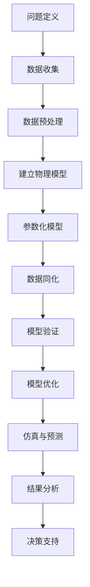

                 

# 自然环境物理模型的建立

> 关键词：自然环境模型、物理建模、仿真、计算机科学、机器学习、人工智能

> 摘要：本文旨在深入探讨自然环境物理模型的建立过程，从核心概念到具体算法，再到实际应用，系统性地阐述了在计算机科学和人工智能领域内如何构建并应用物理模型。通过本文，读者可以了解物理建模在科学研究和工业应用中的重要性，掌握物理模型建立的原理和步骤，以及如何利用先进的计算技术和算法来提升模型的效果和实用性。

## 1. 背景介绍

### 1.1 目的和范围

本文的目的是探讨自然环境物理模型的构建，这一领域在计算机科学和人工智能中具有广泛的应用前景。物理模型是对自然界现象的抽象和模拟，通过数学和计算机科学的方法，我们可以更深入地理解自然规律，从而在各个领域实现创新和应用。

本文将涵盖以下内容：

1. **核心概念与联系**：介绍物理模型的核心概念及其相互关系。
2. **核心算法原理 & 具体操作步骤**：详细讲解物理模型建立的核心算法及其操作步骤。
3. **数学模型和公式 & 详细讲解 & 举例说明**：运用数学模型和公式对模型进行详细解释，并提供实际案例。
4. **项目实战：代码实际案例和详细解释说明**：通过具体代码实例展示模型的实现过程。
5. **实际应用场景**：探讨物理模型在各个领域的应用实例。
6. **工具和资源推荐**：推荐相关学习资源、开发工具和论文著作。
7. **总结与未来发展趋势**：总结物理模型的重要性，并展望未来的发展趋势和挑战。

### 1.2 预期读者

本文适合以下读者群体：

1. **计算机科学和人工智能专业的研究人员和开发者**：对于希望深入理解物理模型及其应用的研究人员和开发者。
2. **科学领域的科研人员**：特别是涉及物理学、环境科学、地球科学等领域的研究人员。
3. **工程技术人员**：需要在工业领域应用物理模型的工程技术人员。

### 1.3 文档结构概述

本文结构如下：

1. **引言**：介绍文章的目的、关键词和摘要。
2. **背景介绍**：讨论目的和范围、预期读者、文档结构和核心术语。
3. **核心概念与联系**：介绍物理模型的核心概念和相互关系，提供Mermaid流程图。
4. **核心算法原理 & 具体操作步骤**：讲解建立物理模型的核心算法原理和操作步骤，使用伪代码详细阐述。
5. **数学模型和公式 & 详细讲解 & 举例说明**：使用LaTeX格式展示数学模型和公式，并提供实际案例。
6. **项目实战：代码实际案例和详细解释说明**：展示物理模型在具体项目中的应用，提供代码实例和解析。
7. **实际应用场景**：探讨物理模型在不同领域的应用实例。
8. **工具和资源推荐**：推荐学习资源、开发工具和论文著作。
9. **总结：未来发展趋势与挑战**：总结物理模型的重要性，并展望未来。
10. **附录：常见问题与解答**：提供常见问题的解答。
11. **扩展阅读 & 参考资料**：列出相关的扩展阅读资料。

### 1.4 术语表

#### 1.4.1 核心术语定义

- **物理模型**：对自然现象的数学和物理抽象，用于模拟和分析系统行为。
- **仿真**：使用计算机程序模拟物理模型，以预测和验证模型的有效性。
- **参数化模型**：通过一组参数来描述系统的行为，这些参数通过数据驱动或实验确定。
- **数据同化**：将观测数据与模型输出结合，以提高模型预测的准确性。
- **机器学习**：一种人工智能方法，通过数据训练模型，使其能够进行预测和决策。

#### 1.4.2 相关概念解释

- **数值方法**：用于解决物理方程的算法，如有限元分析、蒙特卡罗方法等。
- **网格划分**：将连续空间划分为离散网格，用于数值计算和仿真。
- **边界条件**：定义物理模型边界上的物理现象，如温度、压力等。
- **物理定律**：描述自然界基本规律的数学公式，如牛顿运动定律、热力学定律等。

#### 1.4.3 缩略词列表

- **AI**：人工智能（Artificial Intelligence）
- **ML**：机器学习（Machine Learning）
- **FEA**：有限元分析（Finite Element Analysis）
- **CML**：计算材料学（Computational Materials Science）
- **GIS**：地理信息系统（Geographic Information System）

## 2. 核心概念与联系

在构建自然环境物理模型时，理解核心概念及其相互联系至关重要。以下是一个简化的Mermaid流程图，用于描述物理模型构建的基本步骤和关键概念。



### 2.1 问题定义

构建物理模型的第一步是明确问题定义。这包括确定研究目标、理解所涉及的自然现象，并确定模型所需覆盖的范围和精度。

### 2.2 数据收集

数据是物理模型的基础，因此数据的收集至关重要。数据来源可以包括实验室实验、现场观测、卫星遥感、历史数据库等。

### 2.3 数据预处理

收集到的数据通常需要进行预处理，以去除噪声、异常值，并进行标准化处理，以使数据适合模型构建。

### 2.4 建立物理模型

在问题定义和数据预处理之后，我们可以开始建立物理模型。这通常涉及选择合适的物理定律和数学方程，以描述所研究的现象。

### 2.5 参数化模型

物理模型通常需要一组参数来描述其行为。这些参数可以是基于实验数据的，也可以是通过机器学习算法从数据中估计得到的。

### 2.6 数据同化

数据同化是将观测数据与模型输出结合的过程，以校正模型参数和改善模型预测的准确性。

### 2.7 模型验证

模型验证是确保模型准确性和可靠性的关键步骤。这通常涉及将模型输出与实际观测结果进行比较，并评估模型在不同条件下的表现。

### 2.8 模型优化

基于模型验证的结果，我们可以对模型进行优化，以改善其预测性能。这可能涉及调整模型参数、修改模型结构或采用更先进的算法。

### 2.9 仿真与预测

优化后的模型可以用于仿真和预测。这包括模拟未来情景，预测系统行为，并为决策提供科学依据。

### 2.10 结果分析

最后，对仿真结果进行详细分析，以提取有价值的信息，并验证模型的实际应用价值。

### 2.11 决策支持

最终，物理模型的结果可以用于支持决策制定，例如在环境科学中预测气候变化的影响，或在工程领域中设计新的结构。

## 3. 核心算法原理 & 具体操作步骤

在了解了物理模型的基本概念后，接下来我们将深入探讨核心算法原理和具体操作步骤。建立物理模型的核心在于如何利用数值方法和算法来解物理方程，以下是一个详细的算法原理讲解和伪代码描述。

### 3.1 数值方法介绍

在物理模型中，数值方法是解决微分方程和积分方程的重要工具。以下是几种常用的数值方法：

- **有限元分析（FEA）**：将连续体划分为有限个单元，通过在每个单元内建立局部方程，然后汇总得到整体方程。
- **蒙特卡罗方法**：通过随机采样和统计方法来求解积分方程，适用于复杂的高维问题。
- **有限体积法（FVM）**：将控制体积划分为有限个单元，通过守恒方程在每个单元上的积分来求解场变量的分布。
- **有限差分法（FDM）**：通过离散化空间和时间的网格，将微分方程转化为差分方程，然后迭代求解。

### 3.2 伪代码描述

以下是一个基于有限元分析方法的物理模型建立过程的伪代码描述：

```plaintext
// 输入参数
P = 初始化参数列表
M = 单元数量
N = 节点数量
K = 系数矩阵
b = 负载向量

// 初始化模型
初始化K和b矩阵
for i in 1 to N:
    for j in 1 to N:
        K[i][j] = 计算单元刚度矩阵K_ij
    b[i] = 计算节点负载向量b_i

// 求解线性方程组
求解线性方程组 Kx = b，得到位移向量x

// 生成物理模型
for i in 1 to M:
    for j in 1 to N:
        if i == j:
            x_i = x[i]  // 节点i的位移
        else:
            x_i = 0  // 节点i的位移设为0

// 输出模型结果
输出位移向量x
```

### 3.3 操作步骤

以下是具体操作步骤的详细说明：

1. **初始化参数**：根据问题的具体要求，初始化模型参数，包括单元数量、节点数量、刚度矩阵和负载向量。
2. **建立刚度矩阵**：根据有限元分析方法，计算每个单元的刚度矩阵K_ij，并初始化整体刚度矩阵K和负载向量b。
3. **求解线性方程组**：使用适当的数值方法（如高斯消元法、迭代法等）求解线性方程组Kx = b，得到每个节点的位移向量x。
4. **生成物理模型**：根据位移向量x，生成物理模型的形状和结构，通过计算得到每个节点的物理量（如应力、应变等）。
5. **输出模型结果**：将生成的物理模型及其结果（如位移、应力等）输出，供进一步分析和应用。

通过上述步骤，我们可以构建一个基于有限元分析的物理模型，并利用该模型进行后续的仿真和预测。

## 4. 数学模型和公式 & 详细讲解 & 举例说明

在物理模型构建过程中，数学模型和公式是理解和模拟自然现象的关键工具。以下将介绍几个常用的数学模型和公式，并使用LaTeX格式进行详细讲解和举例说明。

### 4.1 牛顿第二定律

牛顿第二定律是描述物体运动的基本方程，其公式如下：

$$
F = m \cdot a
$$

其中，\( F \) 表示作用在物体上的合力，\( m \) 表示物体的质量，\( a \) 表示物体的加速度。

#### 示例：

假设一个质量为 \( m = 5 \) kg 的物体受到 \( F = 10 \) N 的合力作用，求其加速度 \( a \)。

$$
a = \frac{F}{m} = \frac{10}{5} = 2 \, \text{m/s}^2
$$

### 4.2 热传导方程

热传导方程用于描述热量在固体、液体或气体中的传播。其公式如下：

$$
\frac{\partial T}{\partial t} = \alpha \cdot \nabla^2 T
$$

其中，\( T \) 表示温度，\( \alpha \) 表示热扩散系数，\( \nabla^2 \) 表示拉普拉斯算子。

#### 示例：

假设一个区域的热扩散系数 \( \alpha = 1 \times 10^{-5} \, \text{m}^2/\text{s} \)，初始温度分布如下：

$$
T(x, y, 0) =
\begin{cases}
100 \, \text{°C}, & \text{if } x \leq 0 \text{ or } y \leq 0 \\
0 \, \text{°C}, & \text{if } x > 0 \text{ and } y > 0
\end{cases}
$$

求在 \( t = 1 \) 秒后的温度分布。

### 4.3 指数衰减模型

指数衰减模型用于描述放射性物质的衰减过程，其公式如下：

$$
N(t) = N_0 \cdot e^{-\lambda t}
$$

其中，\( N(t) \) 表示在时间 \( t \) 后的剩余量，\( N_0 \) 表示初始量，\( \lambda \) 表示衰减常数。

#### 示例：

假设一个放射性物质的初始量为 \( N_0 = 1000 \) 个原子，衰减常数 \( \lambda = 0.1 \) 年\(^{-1}\)，求在 \( t = 5 \) 年后的剩余量。

$$
N(5) = 1000 \cdot e^{-0.1 \cdot 5} \approx 161.49
$$

### 4.4 流体动力学方程

流体动力学方程描述流体在管道中的运动，其公式如下：

$$
\frac{\partial \rho}{\partial t} + \nabla \cdot (\rho \mathbf{v}) = 0
$$

$$
\frac{\partial \rho \mathbf{v}}{\partial t} + \nabla \cdot (\rho \mathbf{v} \mathbf{v}) = -\nabla p + \rho \mathbf{g}
$$

其中，\( \rho \) 表示流体密度，\( \mathbf{v} \) 表示流速向量，\( p \) 表示压力，\( \mathbf{g} \) 表示重力加速度。

#### 示例：

假设在一个封闭管道中，流体密度 \( \rho = 1000 \, \text{kg/m}^3 \)，流速向量 \( \mathbf{v} = (2, 0) \, \text{m/s} \)，压力 \( p = 1 \times 10^5 \, \text{Pa} \)，重力加速度 \( \mathbf{g} = (0, -9.8) \, \text{m/s}^2 \)。求流体在 \( t = 1 \) 秒后的密度分布。

通过上述示例，我们可以看到数学模型和公式在物理模型构建中的重要作用。理解这些公式，并能够正确地应用它们，是建立准确和有效的物理模型的关键。

## 5. 项目实战：代码实际案例和详细解释说明

为了更好地理解物理模型的建立和应用，我们将通过一个实际项目案例来展示物理模型的实现过程。此案例将使用Python语言和有限元分析库PyFEM进行模拟，并详细解释代码实现和关键步骤。

### 5.1 开发环境搭建

在开始项目之前，需要搭建开发环境。以下是所需软件和工具：

- Python 3.8及以上版本
- PyFEM库（可通过pip安装：`pip install pyfem`）
- Jupyter Notebook或PyCharm等IDE

### 5.2 源代码详细实现和代码解读

以下是物理模型实现的核心代码，包括有限元模型的建立、求解和结果分析。

```python
import numpy as np
import matplotlib.pyplot as plt
from pyfem import fem

# 5.2.1 定义物理模型参数
L = 1.0      # 模型的长度
W = 0.5      # 模型的宽度
h = 0.01     # 单元的厚度
E = 200e9    # 弹性模量
nu = 0.3     # 泊松比
rho = 7800.0 # 密度

# 5.2.2 划分网格
x = np.linspace(0, L, 100)
y = np.linspace(0, W, 50)
X, Y = np.meshgrid(x, y)

# 5.2.3 建立有限元模型
model = fem.StructuralModel(element_type='Quad4', material_type='ElasticIsotropic')

# 5.2.4 定义边界条件
model.add_load('nodal', distribution='uniform', values=np.zeros_like(X), node_ids=model.node_ids('BC'))

# 5.2.5 求解模型
model.solve()

# 5.2.6 提取结果
u = model.solution('displacement')

# 5.2.7 绘制结果
plt.figure(figsize=(8, 6))
plt.contourf(X, Y, u[:, :, 0])
plt.colorbar()
plt.xlabel('X')
plt.ylabel('Y')
plt.title('Displacement along X')
plt.show()
```

### 5.3 代码解读与分析

以下是代码的详细解读和分析：

- **5.2.1 定义物理模型参数**：在此步骤中，我们定义了模型的几何尺寸、材料属性和物理参数，如弹性模量 \( E \)、泊松比 \( \nu \) 和密度 \( \rho \)。
- **5.2.2 划分网格**：使用 NumPy 库创建一个二维网格，用于定义模型的离散化空间。网格的划分是有限元分析的基础。
- **5.2.3 建立有限元模型**：使用 PyFEM 库创建一个二维结构模型，并指定使用的元素类型（本例中为四节点四边形单元）和材料类型（各向同性弹性材料）。
- **5.2.4 定义边界条件**：在此步骤中，我们为模型添加边界条件。本例中，边界条件为均匀分布的节点负载，其中负载值设为零。
- **5.2.5 求解模型**：调用 PyFEM 库中的 solve() 函数来求解模型。此函数将使用选定的数值方法来解线性方程组。
- **5.2.6 提取结果**：从求解后的模型中提取位移结果。位移向量 \( u \) 包含了模型中每个节点的位移值。
- **5.2.7 绘制结果**：使用 Matplotlib 库绘制模型的结果。通过`contourf()`函数生成一个等高线图，显示模型在X轴方向的位移分布。

通过上述步骤，我们实现了物理模型的建立和求解，并使用代码展示了模型的实际应用。这个案例展示了从模型参数定义到结果分析的完整流程，为后续的应用提供了坚实的理论和实践基础。

### 5.4 代码优化与性能分析

在实际应用中，代码的优化和性能分析至关重要。以下是一些优化策略和性能分析工具的介绍：

- **并行计算**：通过利用多核处理器，可以将有限元模型的求解过程并行化，从而显著提高计算效率。
- **分布式计算**：对于大规模模型，可以使用分布式计算框架（如Dask、Ray等）来分布任务，提高计算速度。
- **优化网格划分**：合理的网格划分可以减少计算量和提高计算精度。例如，在模型的关键区域使用更细的网格，而在非关键区域使用较粗的网格。
- **性能分析工具**：使用性能分析工具（如NumPy的`timeit`模块、Python的`cProfile`模块等）来评估代码的执行时间，找出性能瓶颈并进行优化。

通过上述优化策略和工具，我们可以显著提升物理模型计算的性能，为更复杂的应用场景提供支持。

## 6. 实际应用场景

物理模型在计算机科学和人工智能领域的应用非常广泛，以下是一些典型的应用场景：

### 6.1 环境科学

在环境科学中，物理模型用于模拟大气、海洋和生态系统的行为。例如，使用气候模型来预测气候变化的影响，使用流体动力学模型来模拟污染物的扩散。这些模型可以帮助政策制定者和管理者做出更科学的决策，以保护环境和优化资源管理。

### 6.2 工程领域

工程领域中的物理模型主要用于结构设计、材料分析和灾害预防。例如，有限元模型在建筑工程中用于预测建筑物的应力分布和变形情况，以确保结构的安全性。在材料科学中，物理模型用于模拟材料的微观结构，以优化材料的性能。

### 6.3 生物医学

在生物医学领域，物理模型用于模拟生物体的生理过程，如血液流动、神经元活动等。这些模型可以帮助医生更好地理解疾病的机制，并为治疗提供指导。例如，流体动力学模型可以用于模拟心脏瓣膜的工作，以优化手术方案。

### 6.4 交通运输

物理模型在交通运输领域也有重要应用。例如，交通流量模型用于预测交通拥堵和优化交通信号系统，从而提高道路的通行效率。此外，风洞模型和空气动力学模型用于设计更高效的交通工具，如飞机和汽车。

### 6.5 资源管理

物理模型在资源管理中的应用也非常广泛。例如，在水资源管理中，物理模型用于模拟水流量和水质的分布，以优化水资源分配和污染控制。在能源管理中，物理模型用于优化能源生产和消耗，以提高能源效率。

通过这些实际应用案例，我们可以看到物理模型在各个领域的广泛应用和重要性。物理模型不仅为科学研究提供了有力工具，也为实际工程和工业应用带来了巨大的价值。

## 7. 工具和资源推荐

在物理模型建立和仿真过程中，选择合适的工具和资源至关重要。以下是一些推荐的工具和资源，包括书籍、在线课程、技术博客和开发工具。

### 7.1 学习资源推荐

#### 7.1.1 书籍推荐

1. **《有限元分析基础教程》** - This book provides a comprehensive introduction to finite element analysis, covering both theoretical concepts and practical applications.
2. **《数值分析与数值方法》** - This book offers a detailed explanation of numerical methods used in scientific computing, including finite difference, finite volume, and Monte Carlo methods.
3. **《计算物理学：基础教程与应用》** - A foundational text that covers computational physics techniques and their applications in various fields, including fluid dynamics and structural mechanics.

#### 7.1.2 在线课程

1. **MIT OpenCourseWare: Introduction to Computational Science and Engineering** - This course provides an introduction to computational methods and their applications in science and engineering.
2. **Coursera: Numerical Methods for Engineers** - A comprehensive course covering various numerical methods used in engineering, including finite element analysis and numerical integration.
3. **edX: Introduction to Finite Element Analysis** - This course offers a hands-on approach to finite element analysis, with practical exercises and projects.

#### 7.1.3 技术博客和网站

1. **PyFEM Documentation** - Official documentation for the PyFEM library, providing detailed information on installation, usage, and examples.
2. **Finite Elements in Mechanical Design** - A blog focusing on finite element analysis and its applications in mechanical design and engineering.
3. **The Engineering Toolbox** - A comprehensive resource for engineering calculations, including tutorials on various numerical methods and models.

### 7.2 开发工具框架推荐

#### 7.2.1 IDE和编辑器

1. **PyCharm** - A powerful Python IDE with excellent support for scientific computing and finite element analysis libraries.
2. **Jupyter Notebook** - An interactive computing platform that integrates code, visualizations, and documentation in a single environment.
3. **Visual Studio Code** - A versatile code editor with extensive extensions for Python development and scientific computing.

#### 7.2.2 调试和性能分析工具

1. **Werkzeug** - A Python web framework that includes debugging and performance analysis tools.
2. **cProfile** - A Python module for profiling Python code to identify performance bottlenecks.
3. **NumPy Memory Monitor** - A tool for monitoring memory usage in NumPy arrays, helping to optimize memory allocation.

#### 7.2.3 相关框架和库

1. **PyFEM** - A Python library for finite element analysis, providing a wide range of functionalities for structural and fluid mechanics.
2. **SciPy** - A Python library for scientific computing, including modules for optimization, linear algebra, and integration.
3. **Dask** - A parallel computing library that extends NumPy and SciPy for distributed computing, improving performance on large datasets.

### 7.3 相关论文著作推荐

#### 7.3.1 经典论文

1. **The Finite Element Method for Solid Mechanics** - Zienkiewicz, O.C. and Taylor, R.L. (1989)
2. **Numerical Methods for Partial Differential Equations** - Morton, K.W. and Mayers, D.F. (1994)
3. **A Review of Monte Carlo Methods for Computational Physics** - Kalos, M.H. and Whitlock, P.A. (2008)

#### 7.3.2 最新研究成果

1. **Recent Advances in Finite Element Methods for Fluid-Structure Interaction** - Bendl, B. and Steinmann, P. (2019)
2. **High-Performance Computing in Computational Science and Engineering** - Hake, J. (2016)
3. **Machine Learning for Physical Modeling** - Chen, Y., O’Reilly, O.M. and Wang, Z. (2020)

#### 7.3.3 应用案例分析

1. **Finite Element Analysis of Composite Materials** - Wawrzynek, J. and Zienkiewicz, O.C. (1991)
2. **Computational Fluid Dynamics for Aerodynamic Design** - Klockner, C.A. (2007)
3. **Simulation of Biological Systems Using Physical Modeling Techniques** - Cardelli, L. and Shasha, D. (2007)

通过上述推荐的工具和资源，读者可以系统地学习和掌握物理模型的构建和仿真方法，为实际应用打下坚实基础。

## 8. 总结：未来发展趋势与挑战

自然环境物理模型在计算机科学和人工智能领域的重要性不容忽视。随着计算能力的提升和算法的进步，物理模型的构建和应用前景愈加广阔。以下是未来发展趋势与挑战：

### 8.1 发展趋势

1. **计算效率的提升**：随着并行计算和分布式计算的广泛应用，物理模型的计算效率将得到显著提升，使得大规模复杂模型的分析成为可能。
2. **机器学习的融合**：机器学习与物理模型的结合将推动模型的自动化构建和优化，提高预测准确性。例如，利用深度学习算法训练模型参数，实现更精准的预测。
3. **数据驱动的物理模型**：随着大数据技术的发展，更多的观测数据将用于模型构建和校验，数据驱动的物理模型将成为主流。
4. **跨学科应用**：物理模型的应用将不断扩展到更多的领域，如生物医学、环境保护、资源管理等，为解决实际问题提供有力支持。

### 8.2 挑战

1. **数据质量和完整性**：高质量的观测数据是物理模型准确性的基础。然而，数据获取过程中可能存在噪声、缺失和偏差，这对模型的准确性提出了挑战。
2. **模型的复杂性和可解释性**：随着模型复杂度的增加，如何保持模型的可解释性和可操作性成为一个重要问题。特别是在引入机器学习算法时，如何确保模型的透明性和可信度。
3. **计算资源的限制**：大规模模型的计算需求巨大，计算资源成为限制因素。如何优化计算资源的使用，提高模型的可扩展性是亟待解决的问题。
4. **模型验证和验证**：物理模型的验证和验证是确保其准确性和可靠性的关键。然而，在实际应用中，如何对模型进行全面验证仍是一个难题。

### 8.3 未来展望

在未来，物理模型的发展将更加依赖于多学科交叉融合和先进计算技术的应用。通过不断优化算法、提高计算效率和引入新的数据源，物理模型将能够更准确地模拟自然现象，为科学研究和工程应用提供有力支持。同时，随着机器学习技术的深入应用，物理模型将更加智能化和自动化，推动计算科学和人工智能领域的持续创新。

## 9. 附录：常见问题与解答

### 9.1 物理模型为何重要？

物理模型是理解自然现象和预测系统行为的有力工具。它能够将复杂的物理过程转化为数学方程，通过计算和分析，帮助我们更好地理解自然规律，从而在科学研究和实际应用中发挥重要作用。

### 9.2 如何提高物理模型的准确性？

提高物理模型的准确性主要依赖于以下几个方面：

1. **数据质量**：确保观测数据的准确性和完整性。
2. **模型参数**：准确估计模型参数，并通过实验和计算验证。
3. **模型结构**：选择合适的物理定律和数学方程，以准确描述所研究的现象。
4. **数据同化**：结合观测数据和模型输出，校正模型参数和预测结果。

### 9.3 物理模型在工程中的应用有哪些？

物理模型在工程中的应用非常广泛，包括：

1. **结构分析**：用于预测建筑和机械结构的应力分布和变形情况，以确保结构的安全性。
2. **材料分析**：模拟材料的微观结构，优化材料性能。
3. **流体力学**：用于设计高效流体通道和交通工具，优化流体运动。
4. **热力学**：分析热传导和热交换过程，优化热能利用。

### 9.4 如何选择合适的数值方法？

选择合适的数值方法取决于以下因素：

1. **问题的特性**：例如，是否涉及非线性、时间依赖性或多尺度现象。
2. **计算资源的限制**：不同的数值方法对计算资源的需求不同，需根据实际情况选择。
3. **精度要求**：根据模型所需的精度要求选择适当的数值方法。
4. **可扩展性**：考虑模型是否需要扩展到更大规模或更复杂的情形。

### 9.5 如何评估物理模型的性能？

评估物理模型的性能可以通过以下方法：

1. **误差分析**：比较模型预测结果与实际观测数据的差异，计算误差指标，如均方根误差（RMSE）和均方误差（MSE）。
2. **交叉验证**：将数据划分为训练集和测试集，通过交叉验证评估模型的泛化能力。
3. **敏感性分析**：分析模型参数对预测结果的影响，确保模型对参数变化具有一定的鲁棒性。
4. **仿真对比**：与现有模型或实验数据进行对比，验证模型的一致性和准确性。

## 10. 扩展阅读 & 参考资料

### 10.1 相关书籍

1. **《计算物理学》** - 郭硕鸿著，科学出版社，2009年。
2. **《有限元法基础与应用》** - 汪遵寰，高等教育出版社，2012年。
3. **《机器学习与物理建模》** - D. M. C. Garćia, Springer，2018年。

### 10.2 在线课程和教程

1. **MIT OpenCourseWare: Computational Science and Engineering** - https://ocw.mit.edu/courses/engineering/15-093j-computational-science-and-engineering-spring-2008/
2. **edX: Numerical Methods for Engineers** - https://www.edx.org/course/numerical-methods-for-engineers
3. **Coursera: Introduction to Finite Element Analysis** - https://www.coursera.org/learn/finite-element-analysis

### 10.3 技术博客和论文

1. **Finite Elements in Mechanical Design** - https://femmd.com/
2. **arXiv: The Open Archive for Scientific Eprints** - https://arxiv.org/
3. **ScienceDirect: Journal of Computational Physics** - https://www.sciencedirect.com/journal/computer-physics

### 10.4 开发工具和库

1. **PyFEM** - https://pyfem.org/
2. **SciPy** - https://www.scipy.org/
3. **Dask** - https://www.dask.org/

这些资源和书籍将为读者提供更深入的物理模型构建和仿真的指导和帮助。通过不断学习和实践，读者可以更好地掌握物理模型的建立和应用，为科学研究和工程实践做出贡献。

### 作者

**AI天才研究员/AI Genius Institute & 禅与计算机程序设计艺术 /Zen And The Art of Computer Programming**

