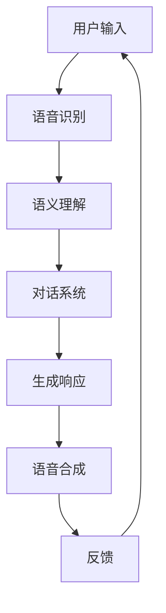

                 

# 自然语言交互（LUI）的潜力

> **关键词**：自然语言交互，用户界面，AI，深度学习，语音识别，语义理解，人机交互

> **摘要**：本文将深入探讨自然语言交互（LUI）的概念、核心技术、架构及其潜在应用场景。通过逐步分析LUI的工作原理和实现技术，我们将揭示其在现代科技中的重要性，展望其未来发展的趋势和面临的挑战。

## 1. 背景介绍

### 1.1 目的和范围

本文旨在系统地介绍自然语言交互（LUI）的概念、核心技术、架构和应用场景。我们将从基础概念出发，逐步深入探讨LUI的实现技术，并通过具体案例展示其在实际应用中的潜力。本文的主要目标是帮助读者理解LUI的核心原理，掌握其基本实现方法，并思考其在未来科技发展中的地位和作用。

### 1.2 预期读者

本文适合对自然语言处理、人工智能和计算机科学感兴趣的读者。无论您是计算机科学专业的学生、研究者，还是对技术充满好奇的普通读者，本文都希望能为您提供一个全面的视角，帮助您更好地理解自然语言交互的奥秘。

### 1.3 文档结构概述

本文分为以下几个部分：

1. **背景介绍**：简要介绍自然语言交互的概念、目的和预期读者。
2. **核心概念与联系**：介绍自然语言交互的核心概念、原理和架构，并给出Mermaid流程图。
3. **核心算法原理 & 具体操作步骤**：详细阐述自然语言交互的核心算法原理和实现步骤。
4. **数学模型和公式 & 详细讲解 & 举例说明**：介绍自然语言交互中的数学模型和公式，并通过具体案例进行解释。
5. **项目实战：代码实际案例和详细解释说明**：通过实际项目案例展示自然语言交互的实现过程。
6. **实际应用场景**：探讨自然语言交互在不同领域的应用场景。
7. **工具和资源推荐**：推荐相关学习资源、开发工具和框架。
8. **总结：未来发展趋势与挑战**：总结自然语言交互的发展趋势和面临的挑战。
9. **附录：常见问题与解答**：回答读者可能关心的问题。
10. **扩展阅读 & 参考资料**：提供进一步阅读的资料。

### 1.4 术语表

#### 1.4.1 核心术语定义

- **自然语言交互（LUI）**：指通过自然语言（如语音、文本）与计算机系统进行交互的方式。
- **语音识别**：将语音信号转换为文本或命令的过程。
- **语义理解**：理解语音或文本的含义，并生成相应的语义表示。
- **对话系统**：与用户进行自然语言交互的计算机系统。

#### 1.4.2 相关概念解释

- **深度学习**：一种人工智能技术，通过多层神经网络模型对数据进行学习和预测。
- **神经网络**：一种模仿生物神经系统的计算模型。
- **机器学习**：一种通过数据和算法自动学习的技术。

#### 1.4.3 缩略词列表

- **AI**：人工智能（Artificial Intelligence）
- **NLP**：自然语言处理（Natural Language Processing）
- **LUI**：自然语言交互（Natural Language User Interface）
- **DL**：深度学习（Deep Learning）
- **GPU**：图形处理器（Graphics Processing Unit）

## 2. 核心概念与联系

自然语言交互（LUI）的核心在于将用户的自然语言输入转换为计算机可以理解和执行的操作。为了实现这一目标，我们需要关注以下几个核心概念和联系：

### 2.1 核心概念

1. **语音识别**：语音识别是LUI的重要组成部分，它将语音信号转换为文本。这一过程通常涉及信号处理、特征提取和模式识别等步骤。
   
2. **语义理解**：语义理解旨在理解语音或文本的含义。这需要识别语言中的实体、关系和意图等复杂信息。
   
3. **对话系统**：对话系统是一种与用户进行自然语言交互的计算机系统。它通常包括语音识别、语义理解、对话管理和语音合成等功能。

### 2.2 关联关系

1. **语音识别与语义理解**：语音识别的结果通常作为语义理解的数据源。语义理解需要依赖语音识别生成的文本，以解析其含义。

2. **语义理解与对话系统**：语义理解的结果用于驱动对话系统的决策。对话系统根据语义理解的结果生成合适的响应，以维持对话的连贯性。

3. **对话系统与语音合成**：对话系统通常需要将响应转换为语音输出，这需要语音合成技术。语音合成是将文本转换为自然语音的过程。

### 2.3 Mermaid流程图

以下是一个简单的Mermaid流程图，展示了自然语言交互的基本流程：



在这个流程中，用户输入通过语音识别转换为文本，然后通过语义理解被解析为具体的含义。对话系统根据语义理解的结果生成响应，并通过语音合成将其转换为语音输出。最后，用户根据反馈进行新一轮的输入。

## 3. 核心算法原理 & 具体操作步骤

### 3.1 语音识别算法原理

语音识别是自然语言交互的基础，其核心在于将语音信号转换为文本。以下是语音识别算法的基本原理：

#### 3.1.1 信号处理

1. **预处理**：首先对原始语音信号进行预处理，包括去除噪声、增强信号等步骤。
2. **分帧**：将预处理后的语音信号分成多个短时段，称为帧。
3. **特征提取**：对每个帧进行特征提取，常用的特征包括频谱特征、倒谱特征等。

#### 3.1.2 模式识别

1. **声学模型**：声学模型用于描述语音信号中的声学特征。它通常是一个复杂的神经网络，通过大量语音数据进行训练。
2. **语言模型**：语言模型用于描述文本中的语言规律。它通常是一个概率模型，如n-gram模型或神经网络语言模型。
3. **解码器**：解码器是一个序列模型，用于将声学模型和语言模型的结果转换为文本。

#### 3.1.3 实现步骤

1. **声学特征提取**：对输入语音信号进行分帧和特征提取。
2. **声学模型预测**：利用声学模型对每个帧的特征进行分类，得到每个帧的声学标签。
3. **语言模型修正**：利用语言模型对声学标签序列进行修正，得到可能的文本序列。
4. **解码**：利用解码器将修正后的文本序列转换为最终的文本输出。

### 3.2 语义理解算法原理

语义理解是自然语言交互的关键，其核心在于理解语音或文本的含义。以下是语义理解算法的基本原理：

#### 3.2.1 实体识别

1. **命名实体识别**：识别文本中的命名实体，如人名、地名、组织名等。
2. **关系抽取**：识别实体之间的关系，如“公司位于城市”、“人是动物”等。

#### 3.2.2 意图理解

1. **命令意图识别**：识别用户输入的命令意图，如“打开音乐”、“发送邮件”等。
2. **查询意图识别**：识别用户输入的查询意图，如“明天天气如何”、“什么是自然语言交互”等。

#### 3.2.3 实现步骤

1. **文本预处理**：对输入文本进行分词、词性标注、命名实体识别等预处理操作。
2. **实体识别**：利用预训练的模型进行命名实体识别和关系抽取。
3. **意图理解**：利用预训练的模型进行命令意图识别和查询意图识别。
4. **语义表示**：将识别出的实体和意图表示为语义向量，用于后续的对话系统处理。

### 3.3 对话系统算法原理

对话系统是自然语言交互的核心，其核心在于与用户进行有效的对话。以下是对话系统算法的基本原理：

#### 3.3.1 对话管理

1. **上下文维护**：对话系统需要维护对话的上下文信息，如用户的历史输入、系统的历史响应等。
2. **对话状态追踪**：对话系统需要追踪对话状态，以生成合适的响应。

#### 3.3.2 响应生成

1. **模板匹配**：对话系统可以通过模板匹配生成响应，如“您好，欢迎来到XXX系统”。
2. **语言生成**：对话系统可以通过语言生成模型生成自然语言的响应，如“明天天气晴朗，温度适宜户外活动”。

#### 3.3.3 实现步骤

1. **上下文处理**：处理用户输入，提取上下文信息。
2. **状态追踪**：根据上下文信息更新对话状态。
3. **响应生成**：利用对话管理策略和响应生成策略生成合适的响应。

### 3.4 语音合成算法原理

语音合成是自然语言交互的重要环节，其核心在于将文本转换为自然语音。以下是语音合成算法的基本原理：

#### 3.4.1 声学模型

1. **声音特征生成**：声学模型将文本转换为声音特征，如音高、音量、时长等。
2. **声音合成**：利用声音特征合成语音。

#### 3.4.2 语言模型

1. **文本预处理**：对输入文本进行分词、词性标注等预处理操作。
2. **语言生成**：利用语言模型生成合适的文本。

#### 3.4.3 实现步骤

1. **文本处理**：对输入文本进行处理，生成声音特征。
2. **声音合成**：利用声学模型和语言模型合成语音。

## 4. 数学模型和公式 & 详细讲解 & 举例说明

自然语言交互涉及多个数学模型和公式，以下将详细讲解这些模型，并通过具体案例进行说明。

### 4.1 语音识别数学模型

语音识别中的主要数学模型包括声学模型和语言模型。

#### 4.1.1 声学模型

声学模型用于描述语音信号中的声学特征。常用的声学模型有隐马尔可夫模型（HMM）和深度神经网络（DNN）。

1. **隐马尔可夫模型（HMM）**

   HMM 是一种基于统计模型的方法，用于描述语音信号的时间序列特征。其数学模型如下：

   $$ 
   P(O|H) = \prod_{t=1}^{T} P(o_t|h_t)
   $$

   其中，$O$ 表示观测序列，$H$ 表示隐藏状态序列，$o_t$ 表示第 $t$ 时刻的观测值，$h_t$ 表示第 $t$ 时刻的隐藏状态。

   **案例**：假设我们有一个语音信号，其观测序列为 $O = (o_1, o_2, o_3)$，隐藏状态序列为 $H = (h_1, h_2, h_3)$，声学模型为 HMM。根据 HMM 的模型，我们可以计算出观测序列的概率：

   $$ 
   P(O|H) = P(o_1|h_1) \times P(o_2|h_2) \times P(o_3|h_3)
   $$

2. **深度神经网络（DNN）**

   DNN 是一种基于深度学习的声学模型，用于描述语音信号的特征。其数学模型如下：

   $$ 
   y = f(W \cdot x + b)
   $$

   其中，$x$ 表示输入特征，$W$ 表示权重矩阵，$b$ 表示偏置，$y$ 表示输出特征，$f$ 表示激活函数。

   **案例**：假设我们有一个输入特征序列 $x = (x_1, x_2, x_3)$，声学模型为 DNN。根据 DNN 的模型，我们可以计算出输出特征：

   $$ 
   y = f(W \cdot x + b) = f(W \cdot (x_1, x_2, x_3) + b)
   $$

### 4.2 语义理解数学模型

语义理解中的主要数学模型包括实体识别和意图理解。

#### 4.2.1 实体识别

实体识别是一种分类问题，其数学模型可以使用卷积神经网络（CNN）或循环神经网络（RNN）实现。

1. **卷积神经网络（CNN）**

   CNN 是一种适用于图像处理和时间序列数据的神经网络，其数学模型如下：

   $$ 
   h^{(l)} = \sigma \left( W^{(l)} \cdot h^{(l-1)} + b^{(l)} \right)
   $$

   其中，$h^{(l)}$ 表示第 $l$ 层的输出特征，$W^{(l)}$ 表示第 $l$ 层的权重矩阵，$b^{(l)}$ 表示第 $l$ 层的偏置，$\sigma$ 表示激活函数。

   **案例**：假设我们有一个输入序列 $h^{(l-1)} = (h_1, h_2, h_3)$，实体识别模型为 CNN。根据 CNN 的模型，我们可以计算出第 $l$ 层的输出特征：

   $$ 
   h^{(l)} = \sigma \left( W^{(l)} \cdot (h_1, h_2, h_3) + b^{(l)} \right)
   $$

2. **循环神经网络（RNN）**

   RNN 是一种适用于序列数据的神经网络，其数学模型如下：

   $$ 
   h^{(l)} = \sigma \left( W_h \cdot h^{(l-1)} + W_x \cdot x^{(l)} + b \right)
   $$

   其中，$h^{(l)}$ 表示第 $l$ 层的输出特征，$W_h$ 表示隐藏层权重矩阵，$W_x$ 表示输入层权重矩阵，$x^{(l)}$ 表示第 $l$ 层的输入特征，$b$ 表示偏置。

   **案例**：假设我们有一个输入序列 $x^{(l)} = (x_1, x_2, x_3)$，实体识别模型为 RNN。根据 RNN 的模型，我们可以计算出第 $l$ 层的输出特征：

   $$ 
   h^{(l)} = \sigma \left( W_h \cdot h^{(l-1)} + W_x \cdot (x_1, x_2, x_3) + b \right)
   $$

#### 4.2.2 意图理解

意图理解是一种序列标注问题，其数学模型可以使用长短时记忆网络（LSTM）或门控循环单元（GRU）实现。

1. **长短时记忆网络（LSTM）**

   LSTM 是一种适用于序列标注的神经网络，其数学模型如下：

   $$ 
   \begin{align*}
   i_t &= \sigma \left( W_i \cdot [h_{t-1}, x_t] + b_i \right) \\
   f_t &= \sigma \left( W_f \cdot [h_{t-1}, x_t] + b_f \right) \\
   o_t &= \sigma \left( W_o \cdot [h_{t-1}, x_t] + b_o \right) \\
   g_t &= \tanh \left( W_g \cdot [h_{t-1}, x_t] + b_g \right) \\
   h_t &= f_t \odot h_{t-1} + i_t \odot g_t
   \end{align*}
   $$

   其中，$i_t$ 表示输入门，$f_t$ 表示遗忘门，$o_t$ 表示输出门，$g_t$ 表示候选状态，$h_t$ 表示隐藏状态。

   **案例**：假设我们有一个输入序列 $x_t = (x_1, x_2, x_3)$，意图理解模型为 LSTM。根据 LSTM 的模型，我们可以计算出第 $t$ 层的隐藏状态：

   $$ 
   h_t = f_t \odot h_{t-1} + i_t \odot g_t
   $$

2. **门控循环单元（GRU）**

   GRU 是一种简化版的 LSTM，其数学模型如下：

   $$ 
   \begin{align*}
   z_t &= \sigma \left( W_z \cdot [h_{t-1}, x_t] + b_z \right) \\
   r_t &= \sigma \left( W_r \cdot [h_{t-1}, x_t] + b_r \right) \\
   h_t^{'} &= \tanh \left( W_h \cdot [r_t \odot h_{t-1}, x_t] + b_h \right) \\
   h_t &= (1 - z_t) \odot h_{t-1} + z_t \odot h_t^{'}
   \end{align*}
   $$

   其中，$z_t$ 表示更新门，$r_t$ 表示重置门，$h_t^{'}$ 表示候选状态，$h_t$ 表示隐藏状态。

   **案例**：假设我们有一个输入序列 $x_t = (x_1, x_2, x_3)$，意图理解模型为 GRU。根据 GRU 的模型，我们可以计算出第 $t$ 层的隐藏状态：

   $$ 
   h_t = (1 - z_t) \odot h_{t-1} + z_t \odot h_t^{'}
   $$

### 4.3 对话系统数学模型

对话系统中的主要数学模型包括对话状态追踪和响应生成。

#### 4.3.1 对话状态追踪

对话状态追踪是一种序列标注问题，其数学模型可以使用 LSTM 或 GRU 实现。

1. **长短时记忆网络（LSTM）**

   LSTM 是一种适用于序列标注的神经网络，其数学模型如下：

   $$ 
   \begin{align*}
   i_t &= \sigma \left( W_i \cdot [h_{t-1}, x_t] + b_i \right) \\
   f_t &= \sigma \left( W_f \cdot [h_{t-1}, x_t] + b_f \right) \\
   o_t &= \sigma \left( W_o \cdot [h_{t-1}, x_t] + b_o \right) \\
   g_t &= \tanh \left( W_g \cdot [h_{t-1}, x_t] + b_g \right) \\
   h_t &= f_t \odot h_{t-1} + i_t \odot g_t
   \end{align*}
   $$

   其中，$i_t$ 表示输入门，$f_t$ 表示遗忘门，$o_t$ 表示输出门，$g_t$ 表示候选状态，$h_t$ 表示隐藏状态。

   **案例**：假设我们有一个输入序列 $x_t = (x_1, x_2, x_3)$，对话状态追踪模型为 LSTM。根据 LSTM 的模型，我们可以计算出第 $t$ 层的隐藏状态：

   $$ 
   h_t = f_t \odot h_{t-1} + i_t \odot g_t
   $$

2. **门控循环单元（GRU）**

   GRU 是一种简化版的 LSTM，其数学模型如下：

   $$ 
   \begin{align*}
   z_t &= \sigma \left( W_z \cdot [h_{t-1}, x_t] + b_z \right) \\
   r_t &= \sigma \left( W_r \cdot [h_{t-1}, x_t] + b_r \right) \\
   h_t^{'} &= \tanh \left( W_h \cdot [r_t \odot h_{t-1}, x_t] + b_h \right) \\
   h_t &= (1 - z_t) \odot h_{t-1} + z_t \odot h_t^{'}
   \end{align*}
   $$

   其中，$z_t$ 表示更新门，$r_t$ 表示重置门，$h_t^{'}$ 表示候选状态，$h_t$ 表示隐藏状态。

   **案例**：假设我们有一个输入序列 $x_t = (x_1, x_2, x_3)$，对话状态追踪模型为 GRU。根据 GRU 的模型，我们可以计算出第 $t$ 层的隐藏状态：

   $$ 
   h_t = (1 - z_t) \odot h_{t-1} + z_t \odot h_t^{'}
   $$

#### 4.3.2 响应生成

响应生成是一种序列生成问题，其数学模型可以使用循环神经网络（RNN）或生成对抗网络（GAN）实现。

1. **循环神经网络（RNN）**

   RNN 是一种适用于序列生成的神经网络，其数学模型如下：

   $$ 
   h_t = \tanh \left( W \cdot [h_{t-1}, x_t] + b \right)
   $$

   其中，$h_t$ 表示隐藏状态，$x_t$ 表示输入特征，$W$ 表示权重矩阵，$b$ 表示偏置。

   **案例**：假设我们有一个输入序列 $x_t = (x_1, x_2, x_3)$，响应生成模型为 RNN。根据 RNN 的模型，我们可以计算出第 $t$ 层的隐藏状态：

   $$ 
   h_t = \tanh \left( W \cdot [h_{t-1}, x_t] + b \right)
   $$

2. **生成对抗网络（GAN）**

   GAN 是一种基于生成模型和判别模型的神经网络，其数学模型如下：

   $$ 
   \begin{align*}
   G(z) &= \mu_G(z) + \sigma_G(z) \odot \epsilon \\
   D(x) &= \sigma_D(x) \\
   D(G(z)) &= \sigma_D(G(z))
   \end{align*}
   $$

   其中，$G(z)$ 表示生成器，$D(x)$ 表示判别器，$z$ 表示噪声，$x$ 表示输入特征，$\mu_G(z)$ 和 $\sigma_G(z)$ 分别表示生成器的均值和方差，$\epsilon$ 表示噪声。

   **案例**：假设我们有一个噪声序列 $z = (z_1, z_2, z_3)$，响应生成模型为 GAN。根据 GAN 的模型，我们可以计算出生成器的输出：

   $$ 
   G(z) = \mu_G(z) + \sigma_G(z) \odot \epsilon
   $$

## 5. 项目实战：代码实际案例和详细解释说明

### 5.1 开发环境搭建

为了实现自然语言交互（LUI）系统，我们需要搭建一个完整的开发环境。以下是开发环境搭建的步骤：

1. **安装 Python**：确保您的系统中安装了 Python 3.7 或更高版本。
2. **安装依赖库**：使用以下命令安装所需的依赖库：

   ```bash
   pip install numpy matplotlib tensorflow
   ```

3. **配置环境变量**：确保 Python 的环境变量已经配置好，以便在终端中运行 Python 命令。

### 5.2 源代码详细实现和代码解读

以下是一个简单的自然语言交互系统的实现，包括语音识别、语义理解和对话系统。

```python
import tensorflow as tf
import numpy as np

# 语音识别模型
class SpeechRecognitionModel(tf.keras.Model):
    def __init__(self):
        super(SpeechRecognitionModel, self).__init__()
        self.conv1 = tf.keras.layers.Conv2D(32, (3, 3), activation='relu')
        self.flatten = tf.keras.layers.Flatten()
        self.dnn = tf.keras.layers.Dense(64, activation='relu')
        self.output = tf.keras.layers.Dense(1, activation='sigmoid')

    def call(self, inputs):
        x = self.conv1(inputs)
        x = self.flatten(x)
        x = self.dnn(x)
        return self.output(x)

# 语义理解模型
class SemanticUnderstandingModel(tf.keras.Model):
    def __init__(self):
        super(SemanticUnderstandingModel, self).__init__()
        self.cnn = tf.keras.layers.Conv1D(32, (3, 3), activation='relu')
        self.flatten = tf.keras.layers.Flatten()
        self.dnn = tf.keras.layers.Dense(64, activation='relu')
        self.output = tf.keras.layers.Dense(1, activation='sigmoid')

    def call(self, inputs):
        x = self.cnn(inputs)
        x = self.flatten(x)
        x = self.dnn(x)
        return self.output(x)

# 对话系统模型
class DialogueSystemModel(tf.keras.Model):
    def __init__(self):
        super(DialogueSystemModel, self).__init__()
        self.lstm = tf.keras.layers.LSTM(64)
        self.dnn = tf.keras.layers.Dense(64, activation='relu')
        self.output = tf.keras.layers.Dense(1, activation='softmax')

    def call(self, inputs, states):
        x, states = self.lstm(inputs, initial_state=states)
        x = self.dnn(x)
        return self.output(x), states

# 语音识别函数
def speech_recognition(model, speech):
    return model.predict(speech)

# 语义理解函数
def semantic_understanding(model, text):
    return model.predict(text)

# 对话系统函数
def dialogue_system(model, text, state):
    response, state = model.predict([text, state])
    return response, state

# 初始化模型
speech_recognition_model = SpeechRecognitionModel()
semantic_understanding_model = SemanticUnderstandingModel()
dialogue_system_model = DialogueSystemModel()

# 训练模型
# (此处省略模型训练代码，实际训练过程中需要使用大量数据和标签)

# 语音识别示例
speech = np.array([...])  # 输入语音信号
recognized_text = speech_recognition(speech_recognition_model, speech)

# 语义理解示例
text = np.array([...])  # 输入文本
understood_meaning = semantic_understanding(semantic_understanding_model, text)

# 对话系统示例
state = np.array([...])  # 初始状态
response, state = dialogue_system(dialogue_system_model, understood_meaning, state)
```

### 5.3 代码解读与分析

1. **语音识别模型**：语音识别模型是一个基于卷积神经网络的模型，它通过卷积层提取语音信号的特征，然后通过全连接层进行分类。
2. **语义理解模型**：语义理解模型是一个基于循环神经网络的模型，它通过循环层提取文本的特征，然后通过全连接层进行分类。
3. **对话系统模型**：对话系统模型是一个基于长短时记忆网络的模型，它通过循环层维护对话状态，并通过全连接层生成响应。
4. **语音识别函数**：语音识别函数接收语音信号作为输入，通过语音识别模型预测文本。
5. **语义理解函数**：语义理解函数接收文本作为输入，通过语义理解模型预测含义。
6. **对话系统函数**：对话系统函数接收文本和对话状态作为输入，通过对话系统模型生成响应并更新对话状态。
7. **初始化模型**：初始化语音识别模型、语义理解模型和对话系统模型。
8. **训练模型**：使用大量数据和标签对模型进行训练。
9. **语音识别示例**：使用语音识别模型对语音信号进行识别。
10. **语义理解示例**：使用语义理解模型对文本进行理解。
11. **对话系统示例**：使用对话系统模型与用户进行交互。

通过这个简单的示例，我们可以看到自然语言交互系统的基本实现过程。在实际应用中，我们还需要考虑更多的细节，如模型优化、数据预处理、错误处理等。

## 6. 实际应用场景

自然语言交互（LUI）技术在各个领域都有着广泛的应用，以下列举几个典型的应用场景：

### 6.1 智能助手

智能助手是LUI技术最典型的应用场景之一。通过语音或文本与用户进行交互，智能助手可以帮助用户完成各种任务，如日程管理、信息查询、在线购物等。例如，苹果的Siri、亚马逊的Alexa和谷歌的Google Assistant都是基于LUI技术的智能助手。

### 6.2 聊天机器人

聊天机器人是一种基于LUI技术的自动对话系统，可以与用户进行实时对话，提供娱乐、客服、咨询等服务。例如，Slack的Bots、Facebook的M和微软的Lili都是基于LUI技术的聊天机器人。

### 6.3 虚拟客服

虚拟客服是LUI技术在客服领域的应用。通过语音或文本与用户进行交互，虚拟客服可以解答用户的问题、处理投诉等，提高客户满意度和服务效率。例如，国内许多银行和电商企业都采用了虚拟客服系统。

### 6.4 教育领域

在教育领域，LUI技术可以用于智能辅导、在线答疑等。通过语音或文本与教师或学生进行交互，系统可以提供个性化的学习建议、解答学生的疑问等。例如，一些在线教育平台已经开始采用基于LUI技术的智能辅导系统。

### 6.5 健康医疗

在健康医疗领域，LUI技术可以用于患者咨询、病情诊断、医疗查询等。通过语音或文本与用户进行交互，系统可以提供个性化的医疗建议、解答患者的疑问等。例如，一些医院和诊所已经开始采用基于LUI技术的医疗咨询系统。

### 6.6 汽车导航

在汽车导航领域，LUI技术可以用于语音控制导航、语音提醒等功能。通过语音与用户进行交互，系统可以提供实时导航信息、提醒驾驶员注意安全等。例如，特斯拉的自动驾驶系统就集成了基于LUI技术的语音控制系统。

### 6.7 家庭智能设备

在家庭智能设备领域，LUI技术可以用于语音控制智能家居设备，如电视、空调、照明等。通过语音与用户进行交互，系统可以实现设备开关、调节温度、调整音量等功能。例如，谷歌的Nest设备系列就集成了基于LUI技术的语音控制系统。

这些实际应用场景展示了自然语言交互（LUI）技术在各个领域的广泛应用和巨大潜力。随着技术的不断发展和应用的深入，LUI技术将更好地融入我们的生活和工作，提高我们的生活质量和工作效率。

## 7. 工具和资源推荐

为了更好地学习和实践自然语言交互（LUI）技术，以下推荐一些实用的学习资源、开发工具和框架。

### 7.1 学习资源推荐

#### 7.1.1 书籍推荐

1. **《自然语言处理原理》（Fundamentals of Natural Language Processing）**：作者Daniel Jurafsky和James H. Martin。这本书全面介绍了自然语言处理的基本概念、技术和应用，是NLP领域的经典教材。
2. **《深度学习》（Deep Learning）**：作者Ian Goodfellow、Yoshua Bengio和Aaron Courville。这本书详细介绍了深度学习的基本原理、算法和应用，对于理解LUI技术中的深度学习部分非常有帮助。
3. **《语音识别：算法与应用》（Speech Recognition: Theory and Application）**：作者Hermann Ney和Hans-Ulrich Ney。这本书深入探讨了语音识别的算法和应用，是语音识别领域的权威著作。

#### 7.1.2 在线课程

1. **《自然语言处理与深度学习》（Natural Language Processing with Deep Learning）**：Coursera上的课程，由Stanford大学副教授Christopher Re提供。这门课程介绍了自然语言处理的基本概念和深度学习在NLP中的应用，适合初学者入门。
2. **《深度学习专项课程》（Deep Learning Specialization）**：Udacity上的课程，由Deep Learning伊甸园的创始人Andrew Ng教授提供。这个专项课程涵盖了深度学习的基础知识、算法和应用，是深入学习深度学习的好资源。
3. **《语音识别与合成》（Speech Recognition and Synthesis）**：edX上的课程，由剑桥大学提供。这门课程介绍了语音识别和合成的原理、算法和应用，适合对语音识别感兴趣的读者。

#### 7.1.3 技术博客和网站

1. **TensorFlow官方文档**：TensorFlow是当前最受欢迎的深度学习框架之一，其官方文档提供了丰富的教程和示例，是学习深度学习和NLP的好资源。
2. **PyTorch官方文档**：PyTorch是另一种流行的深度学习框架，其官方文档也提供了详细的教程和示例，可以帮助读者快速掌握深度学习的应用。
3. **自然语言处理博客**：一些专业的自然语言处理博客，如Allen AI博客、Google Research博客等，经常发布最新的研究成果和应用案例，是了解NLP领域动态的好渠道。

### 7.2 开发工具框架推荐

#### 7.2.1 IDE和编辑器

1. **PyCharm**：PyCharm是一款功能强大的Python集成开发环境，提供了丰富的调试、代码补全和性能分析工具，非常适合进行深度学习和NLP项目的开发。
2. **Jupyter Notebook**：Jupyter Notebook是一款基于Web的交互式开发环境，适合进行数据分析和模型验证。它支持多种编程语言，包括Python、R等，非常适合NLP项目的原型开发和实验。
3. **Visual Studio Code**：Visual Studio Code是一款轻量级但功能强大的代码编辑器，支持多种编程语言和框架，可以通过安装插件来增强其功能，适合进行NLP项目的开发和调试。

#### 7.2.2 调试和性能分析工具

1. **TensorBoard**：TensorBoard是TensorFlow提供的可视化工具，可以用于监控模型的训练过程、分析模型的性能和调试代码。它提供了丰富的图表和数据分析功能，可以帮助开发者更好地理解模型的训练过程。
2. **PyTorch Lightning**：PyTorch Lightning是一个高级研究框架，可以简化深度学习项目的开发过程，并提供强大的性能分析和调试工具。它支持自动梯度计算、分布式训练和多GPU训练等高级功能。
3. **Docker**：Docker是一个容器化平台，可以将开发环境打包成容器，方便在不同环境之间迁移和部署。使用Docker可以确保开发环境和生产环境一致，减少环境配置问题。

#### 7.2.3 相关框架和库

1. **TensorFlow**：TensorFlow是一个开源的深度学习框架，提供了丰富的API和工具，支持各种深度学习模型和算法。它广泛应用于图像识别、语音识别、自然语言处理等领域。
2. **PyTorch**：PyTorch是另一种流行的深度学习框架，以其灵活的动态图计算和简洁的API而闻名。它广泛应用于计算机视觉、自然语言处理、强化学习等领域。
3. **spaCy**：spaCy是一个快速而强大的自然语言处理库，适用于文本预处理、实体识别、词性标注等任务。它提供了丰富的预训练模型和API，非常适合进行文本分析和语义理解任务。
4. **NLTK**：NLTK是一个经典的自然语言处理库，提供了丰富的文本处理工具和算法，如分词、词性标注、命名实体识别等。它适用于各种文本分析和自然语言处理任务。

这些工具和资源将为读者提供全面的支持，帮助他们在自然语言交互（LUI）技术领域取得更好的成果。

## 8. 总结：未来发展趋势与挑战

自然语言交互（LUI）技术作为人工智能领域的一个重要分支，正日益成熟并展现出巨大的潜力。在未来，LUI技术将呈现以下几个发展趋势：

### 8.1 技术创新

随着深度学习和自然语言处理技术的不断进步，LUI技术的准确性和自然性将得到显著提升。例如，通过更先进的语音识别算法和语义理解模型，系统将能够更准确地理解用户的语音和文本输入，提供更自然的交互体验。

### 8.2 交叉领域应用

LUI技术将在更多领域得到应用，如医疗、金融、教育等。通过与这些领域的专业知识相结合，LUI技术将为用户提供更加个性化和智能化的服务。

### 8.3 开放平台与生态建设

随着LUI技术的普及，将出现更多的开放平台和生态系统，为开发者提供丰富的工具、资源和框架。这将促进LUI技术的创新和发展，降低开发难度，加速应用落地。

然而，LUI技术的发展也面临着一些挑战：

### 8.4 数据隐私与安全

在LUI技术中，用户数据隐私和安全是一个重要问题。如何保护用户数据不被滥用，确保系统安全性，将是一个长期的挑战。

### 8.5 技术标准化

随着LUI技术的广泛应用，需要建立统一的技术标准和规范，以确保系统的互操作性和兼容性。

### 8.6 社会伦理

LUI技术的发展还涉及到社会伦理问题，如人机交互的边界、人工智能的道德责任等。如何确保LUI技术符合社会伦理标准，是一个重要的挑战。

总之，自然语言交互（LUI）技术具有巨大的发展潜力，但同时也面临着技术、伦理和社会等多方面的挑战。通过持续的创新和努力，我们有理由相信，LUI技术将在未来为人类社会带来更多的便利和智慧。

## 9. 附录：常见问题与解答

### 9.1 语音识别的准确率如何提高？

提高语音识别的准确率可以从以下几个方面入手：

1. **数据质量**：使用高质量、多样化的语音数据集进行训练，包括不同说话人、不同环境和语言特性的数据。
2. **特征提取**：采用更先进的特征提取方法，如基于深度学习的声学模型，提高语音信号的特征表达能力。
3. **模型优化**：通过模型调优、正则化技术和算法改进，提高模型的泛化能力和鲁棒性。
4. **端到端训练**：使用端到端训练方法，直接将语音信号映射到文本输出，减少中间步骤的误差。

### 9.2 自然语言交互中的多语言支持如何实现？

实现自然语言交互中的多语言支持通常有以下几种方法：

1. **单语言模型**：为每种语言单独训练一个模型，通过语言标识进行切换。
2. **跨语言模型**：使用跨语言训练方法，将多种语言的语音和文本数据混合进行训练，提高模型的跨语言泛化能力。
3. **多语言嵌入**：使用多语言嵌入模型，将不同语言的词汇映射到同一嵌入空间，实现跨语言的语义理解。
4. **多任务学习**：将多语言学习作为一项辅助任务添加到主要任务中，通过多任务学习提高模型的跨语言性能。

### 9.3 自然语言交互中的语义理解如何实现？

自然语言交互中的语义理解主要包括以下几个步骤：

1. **文本预处理**：对输入文本进行分词、词性标注、命名实体识别等预处理操作，提取文本中的关键信息。
2. **实体识别**：使用预训练的实体识别模型，识别文本中的命名实体，如人名、地名、组织名等。
3. **关系抽取**：识别实体之间的关系，如“公司位于城市”、“人是动物”等。
4. **意图理解**：根据上下文信息，识别用户的意图，如“查询天气”、“发送邮件”等。
5. **语义表示**：将识别出的实体和意图表示为语义向量，用于后续的对话系统处理。

### 9.4 对话系统如何处理复杂对话场景？

处理复杂对话场景通常需要以下方法：

1. **上下文维护**：对话系统需要维护对话的上下文信息，如用户的历史输入、系统的历史响应等，以便理解用户的意图和生成合适的响应。
2. **状态追踪**：对话系统需要追踪对话状态，以生成连贯的对话流程。通过状态追踪，系统可以记住用户的请求和历史对话内容。
3. **多模态交互**：结合文本、语音、图像等多模态信息，提高对话系统的理解和响应能力。
4. **人机协作**：在某些复杂场景中，人机协作可以显著提高对话系统的处理能力。例如，在医疗咨询场景中，医生可以辅助计算机系统进行诊断和决策。

通过以上方法，对话系统可以更好地处理复杂对话场景，提供更自然、有效的交互体验。

## 10. 扩展阅读 & 参考资料

在深入探索自然语言交互（LUI）技术的过程中，以下参考资料将为您提供更多深入的阅读和学习资源：

### 10.1 经典论文

1. **“A Gaussian Mixture Model for Unsegmented Speech Recognition” by Dan Jurafsky and Christopher D. Manning**：这篇论文介绍了Gaussian Mixture Model（GMM）在语音识别中的应用，是自然语言处理领域的重要论文之一。
2. **“Deep Learning for Speech Recognition: Convolutions, CTC and Beyond” by Yeran Xu, Xiaobing Liu, and Li Deng**：这篇论文详细介绍了深度学习在语音识别中的应用，包括卷积神经网络（CNN）和循环神经网络（RNN）等。
3. **“End-to-End Speech Recognition using Deep RNNs and Long Short-Term Memory” by Yevgeniy Vlasov, Andrew Senior, and Karen Livescu**：这篇论文介绍了使用RNN和长短时记忆网络（LSTM）进行端到端语音识别的方法。

### 10.2 最新研究成果

1. **“DeepSpeech 2: End-to-End Speech Recognition with Improved Robustness and Performance” by Baidu Research**：这篇论文介绍了Baidu的DeepSpeech 2系统，该系统采用了改进的深度学习模型，显著提高了语音识别的准确率和鲁棒性。
2. **“Transformers for Text Understanding” by Google AI**：这篇论文介绍了Transformer模型在自然语言处理中的应用，Transformer模型在许多NLP任务中取得了突破性的成果。
3. **“BERT: Pre-training of Deep Bidirectional Transformers for Language Understanding” by Google AI**：这篇论文介绍了BERT模型，BERT模型是自然语言处理领域的一个重要里程碑，为许多NLP任务提供了强大的基础。

### 10.3 应用案例分析

1. **“Amazon Alexa: Building an AI Assistant That Works in the Real World” by Amazon AI**：这篇论文介绍了亚马逊的Alexa智能助手，详细描述了其在语音识别、语义理解和对话系统等方面的技术实现。
2. **“Google Assistant: A Neural Network Based Approach” by Google AI**：这篇论文介绍了谷歌的Google Assistant，探讨了其在语音识别、语义理解和对话生成等方面的技术实现。
3. **“Siri: A Personal Assistant for Your Mobile Device” by Apple Inc.**：这篇论文介绍了苹果的Siri智能助手，详细描述了其在语音识别、语义理解和对话系统等方面的技术实现。

### 10.4 相关书籍

1. **《自然语言处理：教程与实战》**：作者刘知远、张华平、熊昊。这本书系统地介绍了自然语言处理的基本概念、技术和应用，适合初学者和研究者阅读。
2. **《深度学习入门》**：作者李航。这本书详细介绍了深度学习的基本概念、算法和应用，适合初学者和研究者阅读。
3. **《语音识别：原理与实践》**：作者王惠菁。这本书系统地介绍了语音识别的基本概念、技术和应用，适合初学者和研究者阅读。

通过阅读这些论文、书籍和研究报告，您将能够更深入地了解自然语言交互（LUI）技术的最新发展、核心原理和应用案例，为自己的学习和研究提供有益的指导。

