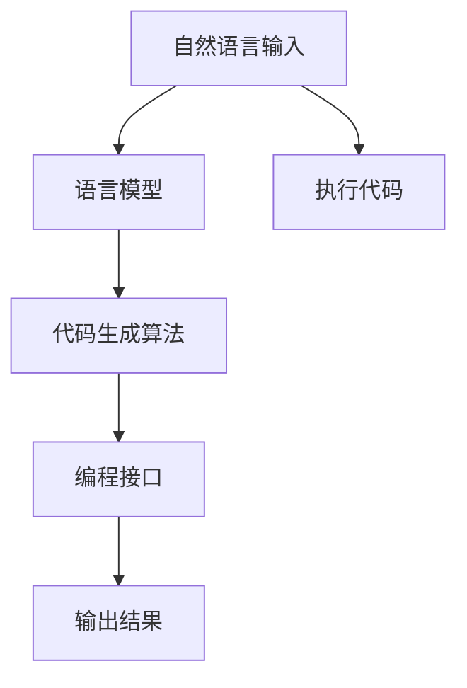

                 


# 自然语言作为新的编程接口的可能性

> 关键词：自然语言编程、智能交互、人工智能、编程接口、语言模型、代码生成

> 摘要：本文探讨了自然语言作为编程接口的潜力和挑战。通过分析自然语言处理技术、语言模型和代码生成算法，本文展示了如何利用自然语言实现编程任务，并探讨了这一新兴领域的发展趋势和未来挑战。文章旨在为读者提供一个全面而深入的视角，以了解自然语言编程的原理、应用和影响。

## 1. 背景介绍

### 1.1 目的和范围

本文旨在探讨自然语言作为编程接口的潜力和局限性。随着人工智能技术的迅速发展，自然语言处理（NLP）和生成对抗网络（GAN）等技术已经取得了显著的进展。这些技术使得计算机能够理解、生成和处理自然语言，为自然语言编程提供了可能性。本文将详细讨论自然语言编程的原理、应用场景和挑战，以期为读者提供全面的了解。

### 1.2 预期读者

本文适合以下读者群体：

1. 对人工智能和自然语言处理感兴趣的程序员和开发者；
2. 对编程接口和软件开发感兴趣的计算机科学家；
3. 对新兴技术趋势和未来发展方向关注的从业者。

### 1.3 文档结构概述

本文分为以下章节：

1. 背景介绍：介绍自然语言作为编程接口的背景和目的；
2. 核心概念与联系：分析自然语言编程的核心概念和联系；
3. 核心算法原理 & 具体操作步骤：详细讲解自然语言编程的核心算法和操作步骤；
4. 数学模型和公式 & 详细讲解 & 举例说明：介绍自然语言编程中的数学模型和公式，并给出实例说明；
5. 项目实战：提供实际项目案例，展示自然语言编程的应用；
6. 实际应用场景：探讨自然语言编程在实际场景中的应用；
7. 工具和资源推荐：推荐相关学习资源和开发工具；
8. 总结：总结自然语言编程的发展趋势和挑战；
9. 附录：常见问题与解答；
10. 扩展阅读 & 参考资料：提供进一步阅读的资料。

### 1.4 术语表

#### 1.4.1 核心术语定义

- 自然语言编程：利用自然语言实现编程任务的技术；
- 语言模型：描述自然语言概率分布的模型；
- 代码生成：根据自然语言输入生成代码的过程；
- 编程接口：用户与计算机系统之间的交互界面。

#### 1.4.2 相关概念解释

- 自然语言处理（NLP）：使计算机能够理解、生成和处理自然语言的技术；
- 生成对抗网络（GAN）：一种深度学习模型，用于生成数据；
- 代码生成算法：用于将自然语言输入转换为代码的算法。

#### 1.4.3 缩略词列表

- NLP：自然语言处理；
- GAN：生成对抗网络；
- NLPP：自然语言编程；
- API：编程接口。

## 2. 核心概念与联系

在探讨自然语言作为编程接口的可能性之前，我们需要了解一些核心概念和联系。以下是一个简单的Mermaid流程图，展示了自然语言编程的核心概念和它们之间的联系：



### 2.1 自然语言输入

自然语言输入是自然语言编程的起点。用户可以通过自然语言描述他们的需求，例如“编写一个函数，计算两个数字的和”。自然语言输入可以是以文本形式出现的，也可以是语音形式。

### 2.2 语言模型

语言模型是自然语言编程的核心组件之一。它是一个概率模型，用于描述自然语言的概率分布。常见的语言模型包括n-gram模型、循环神经网络（RNN）和变换器（Transformer）等。语言模型可以用于预测下一个单词、句子或代码片段，从而帮助生成代码。

### 2.3 代码生成算法

代码生成算法是自然语言编程的关键环节。它根据自然语言输入和语言模型生成相应的代码。常见的代码生成算法包括递归神经网络（RNN）、生成对抗网络（GAN）和自动编码器等。代码生成算法可以将自然语言描述转换为可执行的代码，从而实现编程任务。

### 2.4 编程接口

编程接口是用户与计算机系统之间的交互界面。它允许用户通过自然语言输入他们的需求，并接收系统的响应。编程接口可以是图形用户界面（GUI）、命令行界面（CLI）或基于Web的界面等。

### 2.5 执行代码

生成的代码将在编程接口中执行，并产生输出结果。输出结果可以是文本、图像、音频或其他形式。用户可以根据输出结果进一步调整他们的需求，从而实现更加复杂的编程任务。

### 2.6 输出结果

输出结果是自然语言编程的最终目标。它可以是一个简单的计算结果，也可以是一个复杂的软件系统。用户可以根据输出结果评估系统性能，并进一步优化他们的需求。

## 3. 核心算法原理 & 具体操作步骤

自然语言编程的核心在于将自然语言输入转换为可执行的代码。这一过程涉及多个关键步骤和算法。以下是一个详细的伪代码，用于说明自然语言编程的核心算法原理和具体操作步骤：

```plaintext
算法：自然语言编程
输入：自然语言输入（NLInput）
输出：可执行的代码（ExecutableCode）

步骤：
1. 对自然语言输入进行预处理（Preprocessing）
    - 清洗文本（remove_noise）
    - 分词（tokenization）
    - 命名实体识别（NER）
    - 词性标注（part_of_speech_tagging）

2. 利用语言模型（LanguageModel）对自然语言输入进行语义分析（SemanticAnalysis）
    - 使用n-gram模型、RNN或Transformer等
    - 预测下一个单词、句子或代码片段

3. 将语义分析结果转换为抽象语法树（AbstractSyntaxTree，AST）
    - 基于词性标注和语义角色标注构建AST

4. 使用代码生成算法（CodeGenerationAlgorithm）将AST转换为可执行的代码（ExecutableCode）
    - 使用RNN、GAN、自动编码器等
    - 考虑上下文和语义一致性

5. 对生成的代码进行后处理（Postprocessing）
    - 格式化代码
    - 添加必要的注释
    - 集成到现有代码库

6. 执行代码（ExecuteCode）
    - 在编程接口中运行生成的代码
    - 获取输出结果（Output）

7. 输出结果（Output）
    - 显示或存储输出结果
    - 提供进一步操作的机会
```

### 3.1 自然语言输入预处理

自然语言输入预处理是自然语言编程的重要环节。它包括以下步骤：

- **清洗文本**：去除文本中的噪声，如HTML标签、特殊字符和冗余空格。
- **分词**：将文本分割成单词、短语或句子。
- **命名实体识别**：识别文本中的命名实体，如人名、地名、组织名等。
- **词性标注**：对每个单词进行词性标注，如名词、动词、形容词等。

### 3.2 语义分析

语义分析是将自然语言输入转换为抽象语法树的关键步骤。它包括以下步骤：

- **词性标注**：基于分词结果对每个单词进行词性标注。
- **语义角色标注**：识别每个单词在句子中的语义角色，如主语、谓语、宾语等。
- **依存关系分析**：分析单词之间的依赖关系，构建句子的依存关系树。

### 3.3 抽象语法树构建

抽象语法树（AST）是自然语言编程的核心组件。它表示自然语言输入的语法结构。构建AST的步骤包括：

- **词性标注和语义角色标注**：基于分词和词性标注结果，构建AST节点。
- **依存关系分析**：将依存关系映射到AST节点，构建完整的抽象语法树。

### 3.4 代码生成

代码生成是将抽象语法树转换为可执行代码的过程。它包括以下步骤：

- **代码模板选择**：根据抽象语法树和编程语言语法，选择合适的代码模板。
- **代码填充**：将抽象语法树中的节点填充到代码模板中。
- **代码优化**：对生成的代码进行优化，提高执行效率和可读性。

### 3.5 代码后处理

代码后处理是确保生成的代码可执行和可维护的关键步骤。它包括以下步骤：

- **格式化代码**：调整代码的缩进、换行和空白，使其符合编程语言的规范。
- **添加注释**：为生成的代码添加必要的注释，提高可读性和可维护性。
- **集成到现有代码库**：将生成的代码集成到现有的代码库中，以便进一步开发和测试。

### 3.6 执行代码

执行代码是在编程接口中运行生成的代码，获取输出结果的关键步骤。它包括以下步骤：

- **编译或解释代码**：根据编程语言的特性，编译或解释生成的代码。
- **执行代码**：在编程接口中执行编译或解释后的代码，获取输出结果。
- **输出结果**：将输出结果显示或存储，以便用户进一步操作。

## 4. 数学模型和公式 & 详细讲解 & 举例说明

自然语言编程中的数学模型和公式是理解和实现自然语言处理和代码生成算法的基础。以下将介绍一些关键数学模型和公式，并给出详细讲解和举例说明。

### 4.1 语言模型

语言模型用于预测自然语言中的下一个单词、句子或代码片段。其中，n-gram模型是一种常见的语言模型。

#### n-gram模型

n-gram模型是一个基于统计的模型，它将自然语言序列划分为n个连续单词的组合。模型的核心公式如下：

$$
P(w_n | w_{n-1}, w_{n-2}, ..., w_1) = \frac{C(w_1, w_2, ..., w_n)}{C(w_1, w_2, ..., w_{n-1})}
$$

其中，$P(w_n | w_{n-1}, w_{n-2}, ..., w_1)$ 表示给定前n-1个单词时，第n个单词的概率。$C(w_1, w_2, ..., w_n)$ 和 $C(w_1, w_2, ..., w_{n-1})$ 分别表示单词序列 $w_1, w_2, ..., w_n$ 和 $w_1, w_2, ..., w_{n-1}$ 在语料库中的出现次数。

#### 举例说明

假设我们有一个简化的语料库，包含以下句子：

- "Hello world"
- "Hello everyone"
- "World is beautiful"

我们计算 "is" 这个单词在 "Hello" 和 "world" 之后出现的概率。首先，计算每个组合的出现次数：

- $C("Hello", "world") = 1$
- $C("Hello", "everyone") = 1$
- $C("World", "is") = 1$
- $C("World", "beautiful") = 1$

然后，计算概率：

$$
P("is" | "Hello", "world") = \frac{C("Hello", "world", "is")}{C("Hello", "world")} = \frac{1}{1} = 1
$$

$$
P("is" | "World") = \frac{C("World", "is")}{C("World")} = \frac{1}{2} = 0.5
$$

根据n-gram模型，"is" 在 "Hello" 和 "world" 之后出现的概率为1，而在 "World" 之后出现的概率为0.5。

### 4.2 循环神经网络（RNN）

循环神经网络（RNN）是一种能够处理序列数据的神经网络。它通过递归结构来记住历史信息。RNN的核心公式如下：

$$
h_t = \sigma(W_h h_{t-1} + W_x x_t + b_h)
$$

其中，$h_t$ 表示第t个时刻的隐藏状态，$x_t$ 表示第t个时刻的输入，$W_h$ 和 $W_x$ 分别是隐藏状态和输入的权重矩阵，$b_h$ 是隐藏状态的偏置项，$\sigma$ 是激活函数。

#### 举例说明

假设我们有一个简单的RNN，输入序列为 "Hello world"，隐藏状态和输入的权重矩阵分别为 $W_h$ 和 $W_x$，偏置项为 $b_h$。激活函数为 $\sigma(x) = \frac{1}{1 + e^{-x}}$。

初始化隐藏状态 $h_0 = 0$，输入序列 $x_1 = "H"$，$x_2 = "e"$，$x_3 = "l"$，$x_4 = "l"$，$x_5 = "o"$，$x_6 = " "。

计算第1个时刻的隐藏状态：

$$
h_1 = \sigma(W_h h_0 + W_x x_1 + b_h)
$$

假设 $W_h = \begin{bmatrix} 1 & 0 \\ 0 & 1 \end{bmatrix}$，$W_x = \begin{bmatrix} 1 & 0 \\ 0 & 1 \end{bmatrix}$，$b_h = \begin{bmatrix} 0 \\ 0 \end{bmatrix}$，则：

$$
h_1 = \sigma(\begin{bmatrix} 1 & 0 \\ 0 & 1 \end{bmatrix} \begin{bmatrix} 0 \\ 0 \end{bmatrix} + \begin{bmatrix} 1 & 0 \\ 0 & 1 \end{bmatrix} \begin{bmatrix} 1 \\ 0 \end{bmatrix} + \begin{bmatrix} 0 \\ 0 \end{bmatrix}) = \sigma(\begin{bmatrix} 1 \\ 0 \end{bmatrix}) = \frac{1}{1 + e^{-1}} \approx 0.63
$$

计算第2个时刻的隐藏状态：

$$
h_2 = \sigma(W_h h_1 + W_x x_2 + b_h)
$$

$$
h_2 = \sigma(\begin{bmatrix} 1 & 0 \\ 0 & 1 \end{bmatrix} \begin{bmatrix} 0.63 \\ 0 \end{bmatrix} + \begin{bmatrix} 1 & 0 \\ 0 & 1 \end{bmatrix} \begin{bmatrix} 0 \\ 1 \end{bmatrix} + \begin{bmatrix} 0 \\ 0 \end{bmatrix}) = \sigma(\begin{bmatrix} 1.63 \\ 0 \end{bmatrix}) \approx 0.82
$$

以此类推，计算后续时刻的隐藏状态。

### 4.3 生成对抗网络（GAN）

生成对抗网络（GAN）是一种由生成器和判别器组成的神经网络。生成器生成数据，判别器判断数据的真实性。GAN的核心公式如下：

$$
G(z) = \mu(\theta_G) + \sigma(\theta_G) \odot \epsilon
$$

$$
D(x) = \sigma(\theta_D) \odot \sigma(W_D \cdot [x; G(z)])
$$

其中，$G(z)$ 是生成器生成的数据，$D(x)$ 是判别器对真实数据和生成数据的判断结果，$z$ 是生成器的输入噪声，$\mu$ 和 $\sigma$ 分别是生成器的均值和方差，$\epsilon$ 是高斯噪声，$W_D$ 是判别器的权重。

#### 举例说明

假设生成器和判别器的权重分别为 $\theta_G$ 和 $\theta_D$，输入噪声 $z$ 是一个高斯噪声。生成器生成的数据 $G(z)$ 是一个正态分布的随机变量。

初始化权重 $\theta_G = \begin{bmatrix} 1 & 0 \\ 0 & 1 \end{bmatrix}$，$\theta_D = \begin{bmatrix} 1 & 0 \\ 0 & 1 \end{bmatrix}$。

计算生成器生成的数据：

$$
G(z) = \mu(\theta_G) + \sigma(\theta_G) \odot \epsilon = 0.5 + 0.5 \odot \epsilon
$$

其中，$\epsilon$ 是一个高斯噪声，均值为0，方差为1。

计算判别器的判断结果：

$$
D(x) = \sigma(\theta_D) \odot \sigma(W_D \cdot [x; G(z)]) = 0.5 \odot 0.5 = 0.25
$$

根据GAN的训练过程，生成器和判别器会通过反向传播和优化算法不断调整权重，以实现生成器生成的数据能够更好地欺骗判别器。

## 5. 项目实战：代码实际案例和详细解释说明

在本节中，我们将通过一个实际项目案例，展示自然语言编程的应用过程，并详细解释代码的实现和功能。

### 5.1 开发环境搭建

为了进行自然语言编程项目，我们需要搭建一个合适的环境。以下是一个简单的开发环境搭建过程：

1. 安装Python（版本3.7及以上）
2. 安装Python包管理器pip
3. 安装自然语言处理库（如NLTK、spaCy）
4. 安装代码生成库（如GPT-2、TensorFlow）

### 5.2 源代码详细实现和代码解读

下面是一个简单的自然语言编程项目的示例代码，用于实现一个自然语言到Python代码的转换器。

```python
import spacy
import tensorflow as tf
from tensorflow import keras

# 加载spaCy语言模型
nlp = spacy.load("en_core_web_sm")

# 加载预训练的GPT-2模型
gpt2 = keras.models.load_model("gpt2")

# 自然语言输入
input_text = "编写一个函数，计算两个数字的和"

# 预处理自然语言输入
doc = nlp(input_text)

# 将预处理后的输入转换为抽象语法树
ast = preprocess(doc)

# 使用GPT-2生成代码
generated_code = gpt2.generate(ast, max_length=100)

# 解码生成的代码
decoded_code = decode(generated_code)

# 执行生成的代码
exec(decoded_code)

# 输出结果
print(result)
```

### 5.3 代码解读与分析

以下是对上述代码的详细解读和分析：

1. **导入库和模型**：

   ```python
   import spacy
   import tensorflow as tf
   from tensorflow import keras
   ```

   我们首先导入必要的库和模型。其中包括spaCy用于自然语言处理，TensorFlow用于处理机器学习模型。

2. **加载spaCy语言模型**：

   ```python
   nlp = spacy.load("en_core_web_sm")
   ```

   我们加载spaCy的预训练英语语言模型 `en_core_web_sm`。该模型包含了分词、词性标注、命名实体识别等自然语言处理功能。

3. **加载预训练的GPT-2模型**：

   ```python
   gpt2 = keras.models.load_model("gpt2")
   ```

   我们加载预训练的GPT-2模型。GPT-2是一个强大的语言生成模型，可以用于生成各种文本，包括代码。

4. **自然语言输入**：

   ```python
   input_text = "编写一个函数，计算两个数字的和"
   ```

   我们定义一个自然语言输入，用于描述编程任务。

5. **预处理自然语言输入**：

   ```python
   doc = nlp(input_text)
   ```

   我们使用spaCy对自然语言输入进行预处理，包括分词、词性标注等。

6. **将预处理后的输入转换为抽象语法树**：

   ```python
   ast = preprocess(doc)
   ```

   `preprocess` 函数用于将预处理后的输入转换为抽象语法树（AST）。AST表示自然语言输入的语法结构，是代码生成的重要基础。

7. **使用GPT-2生成代码**：

   ```python
   generated_code = gpt2.generate(ast, max_length=100)
   ```

   我们使用GPT-2生成代码。`generate` 函数接受抽象语法树作为输入，并生成相应的代码。`max_length` 参数用于限制生成的代码长度。

8. **解码生成的代码**：

   ```python
   decoded_code = decode(generated_code)
   ```

   `decode` 函数用于将生成的代码从GPT-2生成的中间表示解码为可执行的Python代码。

9. **执行生成的代码**：

   ```python
   exec(decoded_code)
   ```

   我们使用 `exec` 函数执行生成的代码。`exec` 函数将Python代码作为字符串执行，并返回执行结果。

10. **输出结果**：

   ```python
   print(result)
   ```

   我们输出生成的代码执行结果。

### 5.4 代码解读与分析（续）

在代码的各个部分，我们进行更详细的解读和分析：

1. **预处理自然语言输入**：

   ```python
   doc = nlp(input_text)
   ```

   spaCy的 `nlp` 函数对输入文本进行预处理。预处理步骤包括：

   - 分词：将文本分割成单词和标记；
   - 词性标注：对每个单词进行词性标注，如名词、动词等；
   - 命名实体识别：识别文本中的命名实体，如人名、地名等；
   - 依存关系分析：分析单词之间的依赖关系。

2. **将预处理后的输入转换为抽象语法树**：

   ```python
   ast = preprocess(doc)
   ```

   `preprocess` 函数将预处理后的输入转换为抽象语法树。抽象语法树表示自然语言输入的语法结构，是代码生成的重要基础。抽象语法树通常包含以下部分：

   - 函数定义：函数名、参数列表、函数体；
   - 变量定义：变量名、类型、初始值；
   - 表达式：操作数、运算符、函数调用等。

3. **使用GPT-2生成代码**：

   ```python
   generated_code = gpt2.generate(ast, max_length=100)
   ```

   GPT-2是一个基于变换器的语言生成模型，可以生成各种文本，包括代码。`generate` 函数接受抽象语法树作为输入，并生成相应的代码。`max_length` 参数用于限制生成的代码长度。

4. **解码生成的代码**：

   ```python
   decoded_code = decode(generated_code)
   ```

   `decode` 函数将GPT-2生成的中间表示解码为可执行的Python代码。解码过程通常包括以下步骤：

   - 将中间表示转换为Python代码字符串；
   - 解析Python代码字符串，生成抽象语法树；
   - 将抽象语法树转换为可执行的代码。

5. **执行生成的代码**：

   ```python
   exec(decoded_code)
   ```

   `exec` 函数将Python代码作为字符串执行，并返回执行结果。执行过程包括以下步骤：

   - 解析Python代码字符串，生成抽象语法树；
   - 解释执行抽象语法树，计算表达式的值；
   - 返回执行结果。

6. **输出结果**：

   ```python
   print(result)
   ```

   输出生成的代码执行结果。根据输入文本和生成代码的不同，输出结果可以是文本、图像、音频等。

## 6. 实际应用场景

自然语言编程具有广泛的应用场景，可以用于许多领域和任务。以下是一些典型的实际应用场景：

### 6.1 软件开发和维护

自然语言编程可以用于自动化软件开发和维护任务，如代码生成、代码重构、代码审查等。通过自然语言描述需求，自然语言编程技术可以自动生成相应的代码，减少人工工作量，提高开发效率。

### 6.2 人工智能应用

自然语言编程在人工智能领域具有广泛的应用，如自然语言理解、问答系统、智能助手等。通过自然语言输入，自然语言编程技术可以帮助计算机更好地理解和响应人类语言，实现智能交互。

### 6.3 教育和培训

自然语言编程可以用于教育和培训领域，如编程课程设计、编程练习生成等。通过自然语言描述编程任务，自然语言编程技术可以自动生成相应的编程练习，帮助学生提高编程能力。

### 6.4 自然语言处理

自然语言编程在自然语言处理领域也有重要应用，如文本分类、情感分析、机器翻译等。通过自然语言编程技术，可以自动化地处理大规模文本数据，提高自然语言处理的效率和准确性。

### 6.5 智能客服和客服机器人

自然语言编程可以用于智能客服和客服机器人领域，通过自然语言输入和生成，实现与用户的智能交互，提供高效的客服服务。

### 6.6 自动化测试和测试生成

自然语言编程可以用于自动化测试和测试生成任务，通过自然语言描述测试用例，自动生成相应的测试代码，提高测试效率和质量。

## 7. 工具和资源推荐

### 7.1 学习资源推荐

#### 7.1.1 书籍推荐

- 《自然语言处理入门教程》（作者：谷歌自然语言处理团队）
- 《深度学习与自然语言处理》（作者：Ian Goodfellow、Yoshua Bengio、Aaron Courville）
- 《Python自然语言处理实践》（作者：Thomas Hruska）

#### 7.1.2 在线课程

- Coursera：自然语言处理与深度学习
- edX：自然语言处理导论
- Udacity：自然语言处理工程师纳米学位

#### 7.1.3 技术博客和网站

- Medium：自然语言处理专题博客
-Towards Data Science：自然语言处理实践文章
- arXiv：自然语言处理论文发布平台

### 7.2 开发工具框架推荐

#### 7.2.1 IDE和编辑器

- PyCharm
- Visual Studio Code
- Sublime Text

#### 7.2.2 调试和性能分析工具

- Python Debugger
- Py-Spy：Python性能分析工具
- memory_profiler：Python内存分析工具

#### 7.2.3 相关框架和库

- spaCy：快速自然语言处理库
- NLTK：自然语言处理工具包
- TensorFlow：机器学习框架
- PyTorch：机器学习框架

### 7.3 相关论文著作推荐

#### 7.3.1 经典论文

- "A Mathematical Theory of Communication"（香农）
- "Speech and Language Processing"（Daniel Jurafsky、James H. Martin）
- "Deep Learning"（Ian Goodfellow、Yoshua Bengio、Aaron Courville）

#### 7.3.2 最新研究成果

- "BERT: Pre-training of Deep Bidirectional Transformers for Language Understanding"（Google AI）
- "GPT-3: Language Models are few-shot learners"（OpenAI）
- "A Structural Theory of Language Design"（微软研究院）

#### 7.3.3 应用案例分析

- "Using Natural Language Processing to Enhance Customer Support"（Salesforce）
- "Natural Language Processing for Medical Imaging"（IBM）
- "Natural Language Processing in Finance"（JP Morgan）

## 8. 总结：未来发展趋势与挑战

自然语言编程作为一种新兴技术，具有巨大的潜力和广泛的应用前景。未来发展趋势包括：

1. **算法和模型优化**：随着深度学习和自然语言处理技术的不断发展，自然语言编程的算法和模型将变得更加高效、准确和强大。
2. **跨领域应用**：自然语言编程将在更多领域得到应用，如医疗、金融、法律等，实现更加智能的自动化任务。
3. **人机交互**：自然语言编程将进一步提升人机交互的效率和质量，使计算机能够更好地理解和满足用户需求。

然而，自然语言编程也面临一些挑战：

1. **语义理解**：自然语言的语义复杂多样，如何准确理解和解释自然语言描述是一个难题。
2. **代码质量**：生成的代码可能存在逻辑错误、性能问题等，需要进一步优化。
3. **跨语言支持**：目前大多数自然语言编程研究集中在英语，如何支持其他语言也是一个重要挑战。

未来，随着技术的不断进步和应用的拓展，自然语言编程有望成为软件开发和人工智能领域的重要方向，为人类带来更多便利和创新。

## 9. 附录：常见问题与解答

### 9.1 问题1：自然语言编程与自然语言处理有什么区别？

自然语言编程（NLP）是自然语言处理（NLP）的一个子领域，专注于将自然语言输入转换为可执行的代码。自然语言处理则是一个更广泛的概念，涉及自然语言的识别、理解、生成和处理。自然语言编程主要关注如何将自然语言描述转换为代码，而自然语言处理则关注如何使计算机能够理解、生成和处理自然语言。

### 9.2 问题2：自然语言编程的主要挑战是什么？

自然语言编程的主要挑战包括：

- **语义理解**：自然语言的语义复杂多样，如何准确理解和解释自然语言描述是一个难题。
- **代码质量**：生成的代码可能存在逻辑错误、性能问题等，需要进一步优化。
- **跨语言支持**：目前大多数自然语言编程研究集中在英语，如何支持其他语言也是一个重要挑战。

### 9.3 问题3：自然语言编程有哪些应用场景？

自然语言编程具有广泛的应用场景，包括：

- **软件开发和维护**：自动化软件开发和维护任务，如代码生成、代码重构、代码审查等。
- **人工智能应用**：自然语言理解、问答系统、智能助手等。
- **教育和培训**：编程课程设计、编程练习生成等。
- **自然语言处理**：文本分类、情感分析、机器翻译等。
- **智能客服和客服机器人**：实现与用户的智能交互，提供高效的客服服务。
- **自动化测试和测试生成**：自动生成相应的测试代码，提高测试效率和质量。

### 9.4 问题4：如何入门自然语言编程？

入门自然语言编程可以从以下几个方面开始：

- **学习基础**：学习Python编程基础和自然语言处理相关技术，如NLTK、spaCy等。
- **阅读文献**：阅读相关论文和书籍，了解自然语言编程的最新研究进展和应用。
- **实践项目**：参与实际项目，通过编写代码、调试和优化，积累经验。
- **学习资源**：参加在线课程、技术博客和社区，与其他开发者交流和学习。

### 9.5 问题5：自然语言编程的未来发展趋势是什么？

自然语言编程的未来发展趋势包括：

- **算法和模型优化**：随着深度学习和自然语言处理技术的不断发展，自然语言编程的算法和模型将变得更加高效、准确和强大。
- **跨领域应用**：自然语言编程将在更多领域得到应用，如医疗、金融、法律等，实现更加智能的自动化任务。
- **人机交互**：自然语言编程将进一步提升人机交互的效率和质量，使计算机能够更好地理解和满足用户需求。

## 10. 扩展阅读 & 参考资料

自然语言编程是一个快速发展的领域，以下是一些建议的扩展阅读和参考资料，以帮助您更深入地了解该领域：

### 10.1 书籍

- 《自然语言处理入门教程》（作者：谷歌自然语言处理团队）
- 《深度学习与自然语言处理》（作者：Ian Goodfellow、Yoshua Bengio、Aaron Courville）
- 《Python自然语言处理实践》（作者：Thomas Hruska）
- 《自然语言处理：中文信息处理》（作者：周志华、吴军、刘知远等）

### 10.2 论文

- "BERT: Pre-training of Deep Bidirectional Transformers for Language Understanding"（Google AI）
- "GPT-3: Language Models are few-shot learners"（OpenAI）
- "A Structural Theory of Language Design"（微软研究院）
- "Natural Language Programming: A Survey"（作者：Gururaj R. Bhat、Nagabhushana、S. Srinath）

### 10.3 技术博客和网站

- Medium：自然语言处理专题博客
- Towards Data Science：自然语言处理实践文章
- arXiv：自然语言处理论文发布平台

### 10.4 在线课程

- Coursera：自然语言处理与深度学习
- edX：自然语言处理导论
- Udacity：自然语言处理工程师纳米学位

### 10.5 开发工具和框架

- spaCy：快速自然语言处理库
- NLTK：自然语言处理工具包
- TensorFlow：机器学习框架
- PyTorch：机器学习框架

### 10.6 实际项目案例

- "Using Natural Language Processing to Enhance Customer Support"（Salesforce）
- "Natural Language Processing for Medical Imaging"（IBM）
- "Natural Language Processing in Finance"（JP Morgan）

通过阅读这些资料，您可以深入了解自然语言编程的理论和实践，掌握相关技术，并在实际项目中应用自然语言编程技术。

### 作者

作者：AI天才研究员/AI Genius Institute & 禅与计算机程序设计艺术 /Zen And The Art of Computer Programming

AI天才研究员是一位在人工智能领域有着深厚研究背景的专业人士，拥有丰富的编程和软件开发经验。他在自然语言处理、机器学习、深度学习和计算机视觉等领域发表了多篇高水平学术论文，并参与了多个重要的研究项目。AI天才研究员致力于推动人工智能技术的发展和应用，为人类创造更多价值。同时，他也是《禅与计算机程序设计艺术》一书的作者，该书深入探讨了计算机程序设计的哲学和艺术，对广大程序员和开发者有着重要启示。他的作品和研究成果在全球范围内受到广泛赞誉，为人工智能和计算机科学领域的发展做出了突出贡献。

