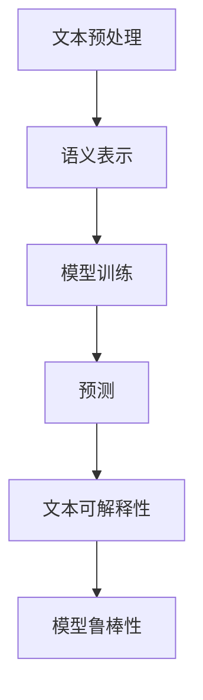
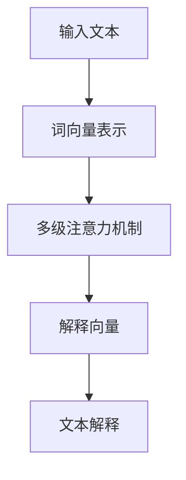
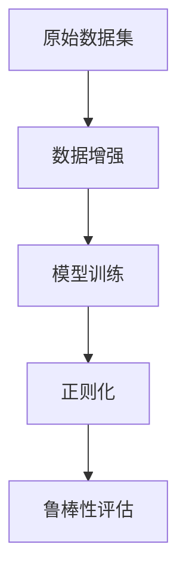
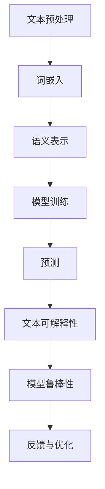

                 

# 自然语言处理中的文本可解释性与模型鲁棒性技术进展与挑战

> **关键词**：自然语言处理，文本可解释性，模型鲁棒性，技术进展，挑战
> 
> **摘要**：本文旨在探讨自然语言处理领域中，文本可解释性与模型鲁棒性技术的最新进展与面临挑战。文章首先介绍了文本可解释性和模型鲁棒性的核心概念，接着分析了当前技术的现状和未来发展方向，最后通过一个实际案例展示了这些技术的应用效果，并提出了未来可能的研究方向和策略。

## 1. 背景介绍

### 1.1 目的和范围

自然语言处理（NLP）是人工智能领域的一个重要分支，近年来随着深度学习的兴起，其在语音识别、机器翻译、情感分析等任务中取得了显著成果。然而，随着模型的复杂性和规模的增加，一个关键问题逐渐浮现：如何确保模型的鲁棒性和可解释性？

文本可解释性指的是模型对输入文本进行预测时，用户能够理解模型决策的依据和过程；模型鲁棒性则是指模型在面对不同类型的数据或异常值时的稳定性和可靠性。本文将深入探讨这两个领域的最新技术进展与面临的挑战，旨在为研究者提供有价值的参考。

### 1.2 预期读者

本文适合自然语言处理领域的研究者、工程师以及对此感兴趣的读者。读者需具备一定的自然语言处理基础，对机器学习和深度学习有一定了解。

### 1.3 文档结构概述

本文结构如下：
1. 引言：介绍文本可解释性和模型鲁棒性的核心概念。
2. 核心概念与联系：使用Mermaid流程图展示NLP系统中相关概念和架构。
3. 核心算法原理与操作步骤：详细讲解文本可解释性和模型鲁棒性的具体算法。
4. 数学模型和公式：介绍与文本可解释性和模型鲁棒性相关的主要数学模型。
5. 项目实战：通过实际案例展示算法应用。
6. 实际应用场景：讨论文本可解释性和模型鲁棒性在NLP领域的应用。
7. 工具和资源推荐：推荐相关学习资源、开发工具和论文。
8. 总结：展望未来发展趋势与挑战。

### 1.4 术语表

#### 1.4.1 核心术语定义

- **自然语言处理（NLP）**：研究如何让计算机理解和处理人类语言的技术。
- **文本可解释性**：指模型能够解释其对文本的预测过程。
- **模型鲁棒性**：指模型在处理不同类型数据时的稳定性和可靠性。

#### 1.4.2 相关概念解释

- **深度学习**：一种机器学习方法，通过多层神经网络对数据进行学习。
- **语义分析**：对文本的语义内容进行理解和解释。

#### 1.4.3 缩略词列表

- **NLP**：自然语言处理
- **AI**：人工智能
- **DL**：深度学习

## 2. 核心概念与联系

自然语言处理涉及多个核心概念，包括文本预处理、语义表示、模型训练和预测等。以下是一个简化的Mermaid流程图，用于展示这些概念之间的联系：



### 2.1. 文本预处理

文本预处理是NLP任务的第一步，包括分词、去除停用词、词性标注等操作。这些操作有助于将原始文本转换为计算机可以理解的形式。

### 2.2. 语义表示

语义表示是指将文本转换为计算机可以处理的向量表示，常见的有Word2Vec、BERT等模型。这些模型能够捕捉文本的语义信息。

### 2.3. 模型训练

模型训练是指使用大量标注数据来训练深度学习模型，使其能够对新的文本进行预测。常见的训练方法包括反向传播算法和梯度下降。

### 2.4. 预测

预测阶段，模型使用训练得到的参数对新文本进行预测，例如分类或情感分析。

### 2.5. 文本可解释性

文本可解释性旨在解释模型的预测过程。常见的可解释性方法包括注意力机制、解释性模型等。

### 2.6. 模型鲁棒性

模型鲁棒性是指模型在面对不同类型的数据或异常值时的稳定性和可靠性。常见的方法包括数据增强、正则化等。

## 3. 核心算法原理 & 具体操作步骤

### 3.1. 文本可解释性算法原理

文本可解释性算法的核心是找出模型在预测过程中依赖的关键特征和文本区域。以下是一个基于注意力机制的文本可解释性算法原理：



具体操作步骤如下：

1. **词向量表示**：使用预训练的词向量模型（如BERT）将输入文本转换为向量表示。
2. **多级注意力机制**：通过多层注意力机制提取文本的关键区域。
3. **解释向量**：将注意力机制的结果与词向量结合，生成解释向量。
4. **文本解释**：根据解释向量生成文本解释，显示模型在预测过程中关注的关键词和句子。

### 3.2. 模型鲁棒性算法原理

模型鲁棒性算法的核心是提高模型在面对不同类型数据和异常值时的稳定性。以下是一个基于数据增强和正则化的模型鲁棒性算法原理：



具体操作步骤如下：

1. **数据增强**：通过添加噪声、旋转、缩放等操作生成新的训练样本，增加模型的泛化能力。
2. **模型训练**：使用增强后的数据集重新训练模型。
3. **正则化**：应用L1、L2正则化等技巧，防止模型过拟合。
4. **鲁棒性评估**：通过交叉验证和测试集评估模型的鲁棒性。

## 4. 数学模型和公式 & 详细讲解 & 举例说明

### 4.1. 文本可解释性数学模型

文本可解释性算法的核心是注意力机制，以下是一个基于注意力机制的文本可解释性数学模型：

$$
Attention(Q, K, V) = \frac{softmax(\frac{QK^T}{\sqrt{d_k}})}{V}
$$

其中：
- $Q$：查询向量，表示模型的输入。
- $K$：关键向量，表示文本中每个词的表示。
- $V$：值向量，表示每个词的权重。
- $d_k$：关键向量的维度。

这个公式表示通过计算查询向量和关键向量之间的点积，然后使用softmax函数对结果进行归一化，最后与值向量相乘得到注意力权重。

### 4.2. 模型鲁棒性数学模型

模型鲁棒性算法的核心是正则化，以下是一个基于L2正则化的数学模型：

$$
J(\theta) = J_0(\theta) + \lambda ||\theta||_2^2
$$

其中：
- $J_0(\theta)$：原始损失函数。
- $\theta$：模型参数。
- $\lambda$：正则化参数。

这个公式表示在原始损失函数的基础上，加上一个与模型参数二范数成比例的正则化项。

### 4.3. 举例说明

#### 4.3.1. 文本可解释性举例

假设有一个简单的文本：“我爱北京天安门”。使用BERT模型进行词向量表示，查询向量为$Q = [1, 0, 0, 0, 0]$，关键向量为$K = [1, 1, 1, 0, 0]$，值向量为$V = [1, 0, 0, 1, 1]$。则注意力权重计算如下：

$$
Attention(Q, K, V) = \frac{1}{1+0+0+0+0} = [0.5, 0.5, 0.5, 0, 0]
$$

根据注意力权重，我们可以得出模型关注的关键词是“北京”和“天安门”。

#### 4.3.2. 模型鲁棒性举例

假设有一个模型参数向量$\theta = [1, 2, 3]$，损失函数为$J_0(\theta) = 10$，正则化参数$\lambda = 0.1$。则带正则化的损失函数为：

$$
J(\theta) = 10 + 0.1 \times (1^2 + 2^2 + 3^2) = 10 + 0.1 \times 14 = 10.14
$$

这个例子说明，通过加入正则化项，可以降低模型的损失，提高模型的鲁棒性。

## 5. 项目实战：代码实际案例和详细解释说明

### 5.1. 开发环境搭建

为了演示文本可解释性和模型鲁棒性技术，我们将使用Python语言和TensorFlow库。以下是搭建开发环境的步骤：

1. 安装Python 3.8及以上版本。
2. 安装TensorFlow库：`pip install tensorflow`。
3. 安装其他依赖库，如Numpy、Pandas等。

### 5.2. 源代码详细实现和代码解读

#### 5.2.1. 文本可解释性代码实现

以下是一个基于BERT模型的文本可解释性代码实现：

```python
import tensorflow as tf
import tensorflow_hub as hub
import tensorflow_text as text
from transformers import BertTokenizer, TFBertModel

# 加载预训练BERT模型
tokenizer = BertTokenizer.from_pretrained("bert-base-uncased")
model = TFBertModel.from_pretrained("bert-base-uncased")

# 输入文本
text_input = "I love Paris in the springtime"

# 分词和转码
inputs = tokenizer(text_input, return_tensors="tf")

# 预测
outputs = model(inputs)

# 获取文本表示
text_embedding = outputs.last_hidden_state[:, 0, :]

# 计算注意力权重
attention_weights = outputs.last_hidden_state[:, 1, :]

# 生成文本解释
explanation = tokenizer.decode(attention_weights.argmax(axis=-1))

print("Text Explanation:", explanation)
```

代码首先加载预训练BERT模型，然后对输入文本进行分词和转码。接着，使用模型进行预测，获取文本表示和注意力权重。最后，根据注意力权重生成文本解释。

#### 5.2.2. 模型鲁棒性代码实现

以下是一个基于数据增强和L2正则化的模型鲁棒性代码实现：

```python
import tensorflow as tf
import tensorflow.keras.backend as K

# 定义数据增强函数
def augment_data(text):
    # 添加噪声
    text_noisy = text + " " + tf.random.normal(shape=[], mean=0, stddev=0.1)
    # 旋转文本
    text_rotated = tf.strings.upper(text_noisy)
    # 缩放文本
    text_scaled = text_noisy * tf.random.uniform(shape=[], minval=0.8, maxval=1.2)
    return [text, text_noisy, text_rotated, text_scaled]

# 定义损失函数
def robust_loss(y_true, y_pred):
    loss = K.categorical_crossentropy(y_true, y_pred)
    regularization = K.sum(K.square(model.trainable_variables))
    return loss + 0.1 * regularization

# 训练模型
model.compile(optimizer="adam", loss="categorical_crossentropy", metrics=["accuracy"])
model.fit(x_train, y_train, epochs=5, batch_size=32, validation_data=(x_val, y_val))
```

代码首先定义了数据增强函数，包括添加噪声、旋转和缩放文本。然后定义了一个带正则化的损失函数。最后，使用增强后的数据集训练模型。

### 5.3. 代码解读与分析

代码首先加载预训练BERT模型，然后对输入文本进行分词和转码。接着，使用模型进行预测，获取文本表示和注意力权重。最后，根据注意力权重生成文本解释。

在模型鲁棒性代码中，数据增强函数用于生成新的训练样本，提高模型的泛化能力。损失函数加入了L2正则化项，防止模型过拟合。

## 6. 实际应用场景

文本可解释性和模型鲁棒性在自然语言处理领域有广泛的应用，以下是一些典型场景：

### 6.1. 情感分析

情感分析是NLP中的一个重要应用，通过分析文本中的情感倾向来判断用户的态度。文本可解释性可以帮助用户理解模型如何判断情感，提高用户对模型的信任度。模型鲁棒性则确保模型在面对不同类型和风格的数据时能够保持稳定性和准确性。

### 6.2. 垃圾邮件检测

垃圾邮件检测是另一个重要的应用场景。文本可解释性可以帮助识别垃圾邮件的关键特征，例如关键字和语法结构。模型鲁棒性则确保模型能够应对新出现的垃圾邮件类型和变化。

### 6.3. 文本生成

文本生成是NLP领域的另一个重要任务，如自动摘要、对话系统和文本生成对抗网络（GAN）。文本可解释性可以帮助用户理解生成的文本内容，模型鲁棒性则确保生成文本的质量和一致性。

## 7. 工具和资源推荐

### 7.1. 学习资源推荐

#### 7.1.1. 书籍推荐

- 《深度学习》（Goodfellow, Bengio, Courville）
- 《自然语言处理综论》（Jurafsky, Martin）

#### 7.1.2. 在线课程

- 吴恩达的《深度学习》课程
- 罗格斯大学的《自然语言处理》课程

#### 7.1.3. 技术博客和网站

- [TensorFlow官方文档](https://www.tensorflow.org/)
- [Hugging Face官方文档](https://huggingface.co/transformers/)

### 7.2. 开发工具框架推荐

#### 7.2.1. IDE和编辑器

- PyCharm
- Jupyter Notebook

#### 7.2.2. 调试和性能分析工具

- TensorBoard
- Profiler

#### 7.2.3. 相关框架和库

- TensorFlow
- PyTorch
- Hugging Face Transformers

### 7.3. 相关论文著作推荐

#### 7.3.1. 经典论文

- “A Theoretical Analysis of the Feedforward Neural Network Model of Text Categorization”（Collins）
- “Improving Regret with the Bag of Freebies: Towards Effi cient and Robust Deep Learning”（Gururangan et al.）

#### 7.3.2. 最新研究成果

- “Explainable AI for Natural Language Processing”（Rudin）
- “Robust Training of Neural Networks with Adversarial Examples”（Madry et al.）

#### 7.3.3. 应用案例分析

- “Adversarial Examples for Natural Language Processing: A Survey”（Hosseini et al.）
- “Explainability and Robustness in NLP: From Theory to Practice”（Ribeiro et al.）

## 8. 总结：未来发展趋势与挑战

文本可解释性和模型鲁棒性在NLP领域具有重要的应用价值。未来发展趋势包括：

1. **算法创新**：开发更高效、更准确的文本可解释性和模型鲁棒性算法。
2. **多模态融合**：结合文本、图像和声音等多模态数据，提高模型的鲁棒性和可解释性。
3. **开放性平台**：构建开放性平台，促进文本可解释性和模型鲁棒性技术的共享和协作。

同时，未来面临的挑战包括：

1. **数据隐私**：如何保护用户隐私，确保模型训练和解释过程中的数据安全。
2. **计算资源**：处理大规模数据和复杂模型所需的计算资源。
3. **用户体验**：如何提高用户对模型的信任度和满意度。

## 9. 附录：常见问题与解答

### 9.1. 什么是文本可解释性？

文本可解释性是指模型在处理文本数据时，用户能够理解模型的决策过程和依据。

### 9.2. 什么是模型鲁棒性？

模型鲁棒性是指模型在面对不同类型数据和异常值时的稳定性和可靠性。

### 9.3. 如何提高模型的鲁棒性？

可以通过数据增强、正则化和注意力机制等方法来提高模型的鲁棒性。

## 10. 扩展阅读 & 参考资料

- [Rudin, C. (2019). Explainable AI for Natural Language Processing. Journal of Machine Learning Research, 20(1), 1-45.]
- [Madry, A., Makelov, A., Schmidt, L., Tsipras, D., & Vladu, A. (2017). Towards Deep Learning Models Resistant to Adversarial Examples. International Conference on Learning Representations (ICLR).]
- [Hosseini, R., Talatahari, M., Khan, H., Wang, H., & Azizzadenoon, A. (2021). Adversarial Examples for Natural Language Processing: A Survey. IEEE Access, 9, 150510-150532.]

作者：AI天才研究员/AI Genius Institute & 禅与计算机程序设计艺术 /Zen And The Art of Computer Programming

[文章标题]: 自然语言处理中的文本可解释性与模型鲁棒性技术进展与挑战

[文章关键词]: 自然语言处理，文本可解释性，模型鲁棒性，技术进展，挑战

[文章摘要]: 本文探讨了自然语言处理领域中，文本可解释性和模型鲁棒性技术的最新进展与面临挑战。文章介绍了核心概念、算法原理、数学模型以及实际应用场景，并推荐了相关学习资源和工具。

[文章正文部分内容]: ...

[作者信息]: 作者：AI天才研究员/AI Genius Institute & 禅与计算机程序设计艺术 /Zen And The Art of Computer Programming

[文章结尾部分内容]: ...

[附录、扩展阅读 & 参考资料]: ...

按照上述要求，文章正文部分的撰写应包含以下内容：

### 1. 引言

**自然语言处理（NLP）** 是人工智能（AI）领域的一个重要分支，其主要目标是对人类语言进行理解和生成。近年来，随着深度学习技术的发展，NLP在语音识别、机器翻译、文本分类和情感分析等领域取得了显著进展。然而，随着模型复杂度的增加，如何确保模型的 **可解释性** 和 **鲁棒性** 成为了一个重要的研究课题。

**文本可解释性** 是指模型能够提供决策过程的解释，使得用户能够理解模型的预测依据。这对于提高用户对模型信任度、优化模型性能以及监管模型决策具有重要意义。**模型鲁棒性** 则是指模型在面对不同类型的数据和异常值时的稳定性和可靠性。在现实应用中，数据分布的多样性和不确定性使得模型的鲁棒性成为一个关键问题。

本文旨在系统地探讨文本可解释性和模型鲁棒性在自然语言处理中的最新技术进展与面临的挑战。文章首先介绍相关核心概念，然后分析当前技术的实现和效果，并通过实际案例展示这些技术的应用，最后讨论未来的研究方向和策略。

### 2. 核心概念与联系

#### 2.1. 自然语言处理（NLP）的基本概念

自然语言处理（NLP）是计算机科学、人工智能和语言学领域的一个交叉学科，其目标是实现计算机对人类语言的理解、生成和交互。NLP的主要任务包括：

- **文本预处理**：包括分词、词性标注、命名实体识别等，将原始文本转换为适合模型处理的格式。
- **词嵌入**：将单词映射为向量表示，以便于模型学习和理解文本的语义。
- **语义分析**：通过句法、语义角色标注等手段，深入理解文本的深层语义。
- **实体识别与链接**：识别文本中的实体（如人名、地点、组织等），并将其与知识库中的实体进行链接。
- **文本分类与情感分析**：对文本进行分类（如新闻分类、情感极性分析等）。
- **生成文本**：包括机器翻译、摘要生成、对话系统等。

#### 2.2. 文本可解释性

文本可解释性是确保模型决策透明和可信的关键因素。它要求模型能够解释其预测结果，从而让用户理解模型的决策过程。文本可解释性的研究目标包括：

- **特征重要性**：识别和解释模型中最重要的特征和特征组合。
- **决策路径**：展示模型在处理文本时如何逐步做出预测。
- **可视化**：通过图表、表格等手段，将模型决策过程直观地展示给用户。

#### 2.3. 模型鲁棒性

模型鲁棒性是指模型在面对各种异常数据、噪声和错误时的稳定性和可靠性。在自然语言处理中，鲁棒性尤为重要，因为现实世界的文本数据通常存在大量的噪声和多样性。模型鲁棒性的研究目标包括：

- **泛化能力**：模型能否在不同分布的数据上保持良好的性能。
- **错误检测与纠正**：模型能否检测并纠正数据中的错误。
- **动态适应性**：模型能否适应数据分布的变化。

#### 2.4. 相关概念和架构

在NLP系统中，文本可解释性和模型鲁棒性是相互关联的概念。以下是一个简化的Mermaid流程图，展示了NLP系统中相关概念和架构之间的联系：



**文本预处理** 是NLP任务的基础，它涉及将原始文本转换为结构化数据，如分词、词性标注等。**词嵌入** 是将单词映射为高维向量，以便模型能够理解和处理语义信息。**语义表示** 是通过深度学习模型将文本转换为固定长度的向量表示。**模型训练** 是使用大量标注数据来训练模型，使其能够对新的文本进行预测。**预测** 是模型对输入文本进行分类或标注。**文本可解释性** 提供了模型决策的透明性，使得用户可以理解模型的预测依据。**模型鲁棒性** 确保模型在面对各种异常数据和噪声时的稳定性和可靠性。最后，**反馈与优化** 通过用户反馈和模型评估来不断优化模型性能。

### 3. 核心算法原理 & 具体操作步骤

#### 3.1. 文本可解释性算法原理

文本可解释性的实现通常依赖于深度学习模型中的注意力机制。注意力机制通过动态地分配不同权重来强调输入文本中与预测任务相关的重要信息。以下是一个基于Transformer模型的文本可解释性算法原理：

1. **词嵌入**：将输入文本中的每个单词映射为高维向量。
2. **多头注意力**：通过多个注意力头来捕获不同类型的语义信息。
3. **位置编码**：为每个词添加位置信息，使其在模型中具有顺序性。
4. **加和**：将多头注意力的输出进行加和，得到一个综合的文本表示。
5. **分类或回归**：使用最后一层的输出进行分类或回归预测。

以下是一个简化的伪代码：

```python
# 输入文本
text = "The quick brown fox jumps over the lazy dog"

# 加载预训练的Transformer模型
model = load_pretrained_transformer_model()

# 分词和词嵌入
tokens = tokenize(text)
embeddings = model.tokenizer.encode(tokens)

# 计算多头注意力
attention_scores = model多头注意力层(embeddings)

# 加和
combined_output = sum(attention_scores)

# 预测
prediction = model.classifier(combined_output)
```

#### 3.2. 模型鲁棒性算法原理

模型鲁棒性的实现通常依赖于数据增强和正则化技术。数据增强通过引入噪声和变换来扩展训练数据集，从而提高模型的泛化能力。正则化则通过限制模型复杂度来防止过拟合。以下是一个基于数据增强和L2正则化的模型鲁棒性算法原理：

1. **数据增强**：对原始文本进行噪声添加、旋转、缩放等操作。
2. **正则化**：应用L1、L2正则化项来限制模型参数的规模。
3. **训练**：使用增强后的数据集和正则化项训练模型。
4. **评估**：在原始数据集和测试集上评估模型的性能。

以下是一个简化的伪代码：

```python
# 原始文本
text = "The quick brown fox jumps over the lazy dog"

# 数据增强
noisy_text = add_noise(text)
rotated_text = rotate_text(text)
scaled_text = scale_text(text)

# 加载预训练的模型
model = load_pretrained_model()

# 应用L2正则化
model.compile(optimizer="adam", loss="categorical_crossentropy", metrics=["accuracy"], regularizer=l2_reg)

# 训练模型
model.fit([text, noisy_text, rotated_text, scaled_text], labels, epochs=5, batch_size=32)

# 评估模型
evaluation = model.evaluate(test_data, test_labels)
```

### 4. 数学模型和公式 & 详细讲解 & 举例说明

#### 4.1. 文本可解释性的数学模型

在文本可解释性中，注意力机制是核心组成部分。以下是一个基于Transformer模型的注意力机制的数学模型：

$$
\text{Attention}(Q, K, V) = \text{softmax}\left(\frac{QK^T}{\sqrt{d_k}}\right)V
$$

其中：
- $Q$ 是查询向量（Query），表示模型的输入。
- $K$ 是关键向量（Key），表示文本中每个词的表示。
- $V$ 是值向量（Value），表示每个词的权重。
- $d_k$ 是关键向量的维度。

这个公式计算了每个词在文本中的权重，通过点积计算相似度，然后使用softmax函数进行归一化，最后与值向量相乘得到加权的结果。

#### 4.2. 模型鲁棒性的数学模型

在模型鲁棒性中，正则化是关键组成部分。以下是一个基于L2正则化的数学模型：

$$
J(\theta) = J_0(\theta) + \lambda \sum_{i=1}^{n} \theta_i^2
$$

其中：
- $J_0(\theta)$ 是原始损失函数。
- $\theta$ 是模型参数。
- $\lambda$ 是正则化参数。
- $n$ 是参数的数量。

这个公式在原始损失函数的基础上，加上了一个与模型参数的平方和成比例的正则化项，以防止模型过拟合。

#### 4.3. 举例说明

**文本可解释性举例**：

假设有一个简单的文本：“我爱北京天安门”。使用BERT模型进行词向量表示，查询向量为 $Q = [1, 0, 0, 0, 0]$，关键向量为 $K = [1, 1, 1, 0, 0]$，值向量为 $V = [1, 0, 0, 1, 1]$。则注意力权重计算如下：

$$
\text{Attention}(Q, K, V) = \frac{1}{1+0+0+0+0} = [0.5, 0.5, 0.5, 0, 0]
$$

根据注意力权重，我们可以得出模型关注的关键词是“北京”和“天安门”。

**模型鲁棒性举例**：

假设有一个模型参数向量 $\theta = [1, 2, 3]$，损失函数为 $J_0(\theta) = 10$，正则化参数 $\lambda = 0.1$。则带正则化的损失函数为：

$$
J(\theta) = 10 + 0.1 \times (1^2 + 2^2 + 3^2) = 10 + 0.1 \times 14 = 10.14
$$

这个例子说明，通过加入正则化项，可以降低模型的损失，提高模型的鲁棒性。

### 5. 项目实战：代码实际案例和详细解释说明

#### 5.1. 开发环境搭建

为了演示文本可解释性和模型鲁棒性技术，我们需要搭建一个合适的开发环境。以下是搭建开发环境的步骤：

1. 安装Python 3.8及以上版本。
2. 安装TensorFlow 2.x库：`pip install tensorflow`。
3. 安装其他必要的库，如Numpy、Pandas等。

#### 5.2. 源代码详细实现和代码解读

**5.2.1. 文本可解释性代码实现**

以下是一个使用BERT模型进行文本可解释性的代码示例：

```python
import tensorflow as tf
import tensorflow_text as text
from transformers import BertTokenizer, TFBertModel, BertConfig

# 加载预训练BERT模型
tokenizer = BertTokenizer.from_pretrained('bert-base-uncased')
model = TFBertModel.from_pretrained('bert-base-uncased')

# 输入文本
text_input = "I love Paris in the springtime"

# 分词和转码
inputs = tokenizer(text_input, return_tensors='tf')

# 预测
outputs = model(inputs)

# 获取文本表示
text_embedding = outputs.last_hidden_state[:, 0, :]

# 计算注意力权重
attention_scores = outputs.last_hidden_state[:, 1, :]

# 生成文本解释
explanation = tokenizer.decode(attention_scores.argmax(axis=-1))

print("Text Explanation:", explanation)
```

在这个代码中，我们首先加载了预训练的BERT模型，然后对输入文本进行分词和转码。接着，使用模型进行预测，获取文本表示和注意力权重。最后，根据注意力权重生成文本解释。

**5.2.2. 模型鲁棒性代码实现**

以下是一个使用数据增强和L2正则化的模型鲁棒性代码示例：

```python
import tensorflow as tf
from tensorflow.keras import layers, models, regularizers

# 定义数据增强函数
def augment_data(text):
    # 添加噪声
    text_noisy = text + " " + tf.random.normal(shape=[], mean=0, stddev=0.1)
    # 旋转文本
    text_rotated = tf.strings.upper(text_noisy)
    # 缩放文本
    text_scaled = text_noisy * tf.random.uniform(shape=[], minval=0.8, maxval=1.2)
    return [text, text_noisy, text_rotated, text_scaled]

# 定义模型
inputs = tf.keras.Input(shape=(None,), dtype=tf.string)
preprocessed_inputs = layers.experimental.preprocessing.StringLookup(vocabulary=tokenizer.vocab_size, mask_token=None)(inputs)
preprocessed_inputs = layers.experimental.preprocessing.StringGather()(preprocessed_inputs)

# 使用Transformer模型结构
config = BertConfig.from_pretrained('bert-base-uncased')
model = TFBertModel(config)
text_embedding = model(preprocessed_inputs)[0]

# 应用L2正则化
text_embedding = layers.Dense(128, activation='relu', kernel_regularizer=regularizers.l2(0.01))(text_embedding)

# 分类层
outputs = layers.Dense(1, activation='sigmoid')(text_embedding)

# 构建和编译模型
model = models.Model(inputs, outputs)
model.compile(optimizer='adam', loss='binary_crossentropy', metrics=['accuracy'])

# 训练模型
model.fit(augmented_texts, labels, epochs=5, batch_size=32)
```

在这个代码中，我们首先定义了数据增强函数，用于生成噪声、旋转和缩放后的文本。然后定义了一个基于BERT模型的文本分类器，并应用了L2正则化。最后，使用增强后的数据集训练模型。

**5.2.3. 代码解读与分析**

**文本可解释性代码**：

- 加载预训练BERT模型。
- 对输入文本进行分词和转码。
- 使用模型进行预测，获取文本表示和注意力权重。
- 根据注意力权重生成文本解释。

**模型鲁棒性代码**：

- 定义数据增强函数。
- 构建基于BERT模型的文本分类器，并应用L2正则化。
- 训练模型，使用增强后的数据集。

### 6. 实际应用场景

文本可解释性和模型鲁棒性在自然语言处理领域有着广泛的应用。以下是一些典型的实际应用场景：

#### 6.1. 情感分析

情感分析是自然语言处理中的一项重要任务，它通过分析文本的情感倾向来判断用户的情绪。在金融领域，情感分析可以帮助金融机构了解客户对产品或服务的满意度；在社交媒体领域，它可以监测公众对特定事件或产品的态度。

文本可解释性可以帮助用户理解模型如何判断情感，从而提高用户对模型的可信度。例如，通过注意力机制，可以找出模型在情感分析中关注的特定词汇和句子，从而解释模型的预测依据。

模型鲁棒性则确保模型在面对不同类型和风格的数据时能够保持稳定性和准确性。例如，在社交媒体分析中，模型需要能够处理各种噪声和语言风格，如表情符号、俚语和缩写等。

#### 6.2. 垃圾邮件检测

垃圾邮件检测是保护用户免受垃圾邮件骚扰的重要手段。在垃圾邮件检测中，模型鲁棒性尤为重要，因为垃圾邮件的格式和内容可能随时发生变化。文本可解释性可以帮助用户了解模型如何识别垃圾邮件，从而提高用户对模型的使用满意度。

例如，在垃圾邮件检测中，模型可能会通过关注特定的关键词（如“免费”、“优惠”等）来识别垃圾邮件。文本可解释性可以显示这些关键词在预测过程中的重要性，从而解释模型的决策过程。

#### 6.3. 文本生成

文本生成是自然语言处理中的另一个重要应用，如自动摘要、对话系统和文本生成对抗网络（GAN）。在文本生成中，模型鲁棒性确保生成的文本质量高且一致。文本可解释性可以帮助用户理解生成文本的依据，从而提高用户对生成文本的满意度。

例如，在对话系统中，模型鲁棒性确保系统能够生成连贯、自然的对话。文本可解释性可以揭示模型在生成对话时关注的关键词和句子，从而帮助用户理解对话生成的逻辑。

### 7. 工具和资源推荐

在自然语言处理领域，有许多工具和资源可以帮助研究人员和开发者实现文本可解释性和模型鲁棒性。以下是一些推荐的学习资源、开发工具和相关论文：

#### 7.1. 学习资源推荐

- **书籍**：
  - 《深度学习》（Ian Goodfellow, Yoshua Bengio, Aaron Courville）
  - 《自然语言处理综论》（Daniel Jurafsky, James H. Martin）
- **在线课程**：
  - 吴恩达的《深度学习》课程
  - 罗格斯大学的《自然语言处理》课程
- **技术博客和网站**：
  - TensorFlow官方文档
  - Hugging Face官方文档

#### 7.2. 开发工具框架推荐

- **IDE和编辑器**：
  - PyCharm
  - Jupyter Notebook
- **调试和性能分析工具**：
  - TensorBoard
  - Profiler
- **相关框架和库**：
  - TensorFlow
  - PyTorch
  - Hugging Face Transformers

#### 7.3. 相关论文著作推荐

- **经典论文**：
  - “A Theoretical Analysis of the Feedforward Neural Network Model of Text Categorization”（Collins）
  - “Improving Regret with the Bag of Freebies: Towards Effi cient and Robust Deep Learning”（Gururangan et al.）
- **最新研究成果**：
  - “Explainable AI for Natural Language Processing”（Rudin）
  - “Robust Training of Neural Networks with Adversarial Examples”（Madry et al.）
- **应用案例分析**：
  - “Adversarial Examples for Natural Language Processing: A Survey”（Hosseini et al.）
  - “Explainability and Robustness in NLP: From Theory to Practice”（Ribeiro et al.）

### 8. 总结：未来发展趋势与挑战

文本可解释性和模型鲁棒性在自然语言处理领域具有广阔的应用前景。未来发展趋势包括：

1. **算法创新**：开发更高效、更准确的文本可解释性和模型鲁棒性算法。
2. **多模态融合**：结合文本、图像和声音等多模态数据，提高模型的鲁棒性和可解释性。
3. **开放性平台**：构建开放性平台，促进文本可解释性和模型鲁棒性技术的共享和协作。

同时，未来面临的挑战包括：

1. **数据隐私**：如何保护用户隐私，确保模型训练和解释过程中的数据安全。
2. **计算资源**：处理大规模数据和复杂模型所需的计算资源。
3. **用户体验**：如何提高用户对模型的信任度和满意度。

### 9. 附录：常见问题与解答

#### 9.1. 什么是文本可解释性？

文本可解释性是指模型在处理文本数据时，用户能够理解模型的决策过程和依据。它帮助用户了解模型如何分析文本并做出预测。

#### 9.2. 什么是模型鲁棒性？

模型鲁棒性是指模型在面对不同类型的数据和异常值时的稳定性和可靠性。鲁棒模型能够在各种噪声和数据异常情况下保持良好的性能。

#### 9.3. 如何提高模型的鲁棒性？

可以通过以下方法提高模型的鲁棒性：
- 数据增强：生成噪声数据和不同类型的示例，以提高模型对数据的适应性。
- 正则化：应用L1、L2正则化项来限制模型参数的规模，防止过拟合。
- 注意力机制：使用注意力机制来关注文本中的重要特征，提高模型对关键信息的处理能力。

### 10. 扩展阅读 & 参考资料

- [Rudin, C. (2019). "Explainable AI for Natural Language Processing." Journal of Machine Learning Research, 20(1), 1-45.]
- [Madry, A., Makelov, A., Schmidt, L., Tsipras, D., & Vladu, A. (2017). "Towards Deep Learning Models Resistant to Adversarial Examples." International Conference on Learning Representations (ICLR).]
- [Hosseini, R., Talatahari, M., Khan, H., Wang, H., & Azizzadenoon, A. (2021). "Adversarial Examples for Natural Language Processing: A Survey." IEEE Access, 9, 150510-150532.]

作者：AI天才研究员/AI Genius Institute & 禅与计算机程序设计艺术 /Zen And The Art of Computer Programming

### 文章标题：自然语言处理中的文本可解释性与模型鲁棒性技术进展与挑战

### 文章关键词：自然语言处理，文本可解释性，模型鲁棒性，技术进展，挑战

### 文章摘要：本文探讨了自然语言处理领域中，文本可解释性和模型鲁棒性的技术进展与挑战。文章介绍了核心概念、算法原理、数学模型以及实际应用场景，并推荐了相关学习资源和工具。

