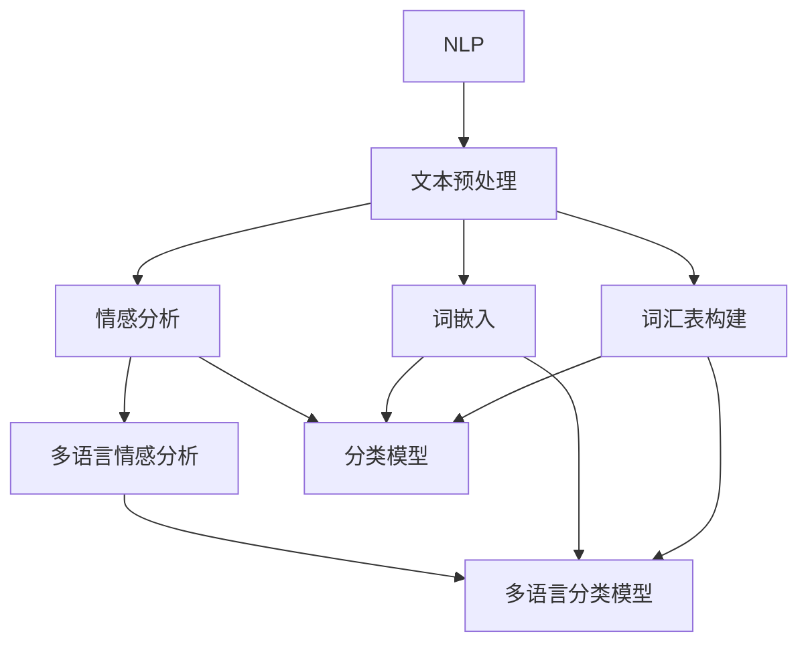

                 

### 1. 背景介绍

#### 1.1 目的和范围

本文旨在探讨自然语言处理（Natural Language Processing，简称NLP）在多语言情感分析中的研究与应用。情感分析作为NLP的重要分支，旨在从文本中提取情感倾向，帮助企业和研究人员更好地理解用户需求和情感变化。随着全球化进程的加快，多语言情感分析成为了一个至关重要的研究领域。

本文将首先介绍NLP的基础概念，然后深入探讨多语言情感分析的核心算法原理、数学模型和实际应用案例。通过本文的阅读，读者将了解多语言情感分析的关键技术，掌握如何运用这些技术解决实际问题。

#### 1.2 预期读者

本文面向具有一定编程基础、对自然语言处理感兴趣的技术爱好者、科研人员以及软件开发工程师。读者需要具备基本的计算机科学知识和数学基础，以便更好地理解文章内容。

#### 1.3 文档结构概述

本文结构如下：

1. **背景介绍**：介绍NLP在多语言情感分析中的研究目的、范围、预期读者和文档结构。
2. **核心概念与联系**：阐述NLP和多语言情感分析的核心概念及其关系，使用Mermaid流程图进行展示。
3. **核心算法原理 & 具体操作步骤**：讲解多语言情感分析的核心算法原理，使用伪代码详细阐述。
4. **数学模型和公式 & 详细讲解 & 举例说明**：介绍多语言情感分析中的数学模型和公式，并进行详细讲解和举例。
5. **项目实战：代码实际案例和详细解释说明**：通过实际项目案例展示如何实现多语言情感分析。
6. **实际应用场景**：分析多语言情感分析在不同领域的应用场景。
7. **工具和资源推荐**：推荐相关学习资源、开发工具和经典论文。
8. **总结：未来发展趋势与挑战**：总结多语言情感分析的未来发展趋势和面临的挑战。
9. **附录：常见问题与解答**：回答读者可能遇到的问题。
10. **扩展阅读 & 参考资料**：提供更多有价值的阅读材料。

#### 1.4 术语表

**NLP（Natural Language Processing）：** 自然语言处理，是指使计算机能够理解和处理人类自然语言的技术。

**情感分析（Sentiment Analysis）：** 从文本中提取情感倾向，通常用于评估文本的情感极性（正面、负面或中立）。

**多语言情感分析（Multilingual Sentiment Analysis）：** 对多种语言文本进行情感分析，以识别不同语言中的情感倾向。

**情感极性（Sentiment Polarity）：** 文本情感分析的输出，表示文本的正面或负面倾向。

**嵌入（Embedding）：** 将文本转换为向量表示，便于机器学习模型处理。

**词袋模型（Bag of Words，BoW）：** 一种文本表示方法，将文本转换为词汇的集合，不考虑词汇的顺序。

**递归神经网络（Recurrent Neural Network，RNN）：** 一种神经网络架构，适用于处理序列数据。

**长短时记忆网络（Long Short-Term Memory，LSTM）：** RNN的一种变体，用于解决RNN的梯度消失问题。

**卷积神经网络（Convolutional Neural Network，CNN）：** 一种用于图像识别的神经网络架构，也可用于文本分类。

**Transformer模型：** 一种基于自注意力机制的神经网络架构，广泛应用于序列数据处理。

#### 1.4.1 核心术语定义

- **自然语言处理（NLP）**：自然语言处理（NLP）是指让计算机理解和处理人类自然语言的技术。NLP涵盖了从文本分析、语言识别、语音合成到机器翻译等多个领域。通过NLP，计算机可以更好地理解人类的语言，实现人机交互。

- **情感分析（Sentiment Analysis）**：情感分析是一种文本挖掘技术，用于从文本中识别和提取情感信息。其核心目标是从文本中判断情感极性（如正面、负面或中立），从而为商业决策、舆情监测等应用提供数据支持。

- **多语言情感分析（Multilingual Sentiment Analysis）**：多语言情感分析是对多种语言文本进行情感分析的过程。随着全球化进程的加快，多语言情感分析在跨文化交流、跨国企业运营等领域具有重要应用价值。

#### 1.4.2 相关概念解释

- **嵌入（Embedding）**：嵌入是一种将文本转换为向量表示的方法，使得计算机可以处理和分析文本数据。常见的文本嵌入方法有词袋模型（Bag of Words）、词嵌入（Word Embedding）等。

- **词袋模型（Bag of Words，BoW）**：词袋模型是一种将文本转换为向量表示的方法，不考虑词汇的顺序。在词袋模型中，每个词汇表示为一个独立的特征，文本被表示为一个词汇的集合。

- **递归神经网络（Recurrent Neural Network，RNN）**：递归神经网络是一种神经网络架构，适用于处理序列数据。RNN通过将输入和前一个隐藏状态进行融合，实现对序列数据的建模。

- **长短时记忆网络（Long Short-Term Memory，LSTM）：** 长短时记忆网络（LSTM）是RNN的一种变体，用于解决RNN的梯度消失问题。LSTM通过引入记忆单元和门控机制，能够更好地处理长序列数据。

- **卷积神经网络（Convolutional Neural Network，CNN）：** 卷积神经网络是一种用于图像识别的神经网络架构，也可用于文本分类。CNN通过卷积操作提取文本特征，从而实现情感分类。

- **Transformer模型**：Transformer模型是一种基于自注意力机制的神经网络架构，广泛应用于序列数据处理。Transformer通过多头自注意力机制和位置编码，实现了对序列数据的全局建模。

#### 1.4.3 缩略词列表

- **NLP**：自然语言处理（Natural Language Processing）
- **Sentiment Analysis**：情感分析
- **ML**：机器学习（Machine Learning）
- **DL**：深度学习（Deep Learning）
- **RNN**：递归神经网络（Recurrent Neural Network）
- **LSTM**：长短时记忆网络（Long Short-Term Memory）
- **CNN**：卷积神经网络（Convolutional Neural Network）
- **Transformer**：Transformer模型

### 2. 核心概念与联系

在探讨多语言情感分析之前，我们需要理解NLP的基本概念及其与情感分析的关系。以下将使用Mermaid流程图来展示NLP、文本预处理、情感分析以及多语言情感分析的核心概念及其联系。



**图 1：NLP、文本预处理、情感分析及多语言情感分析的核心概念与联系**

- **NLP**：作为基础技术，NLP为文本处理和情感分析提供了理论支持。
- **文本预处理**：包括分词、去停用词、词性标注等操作，旨在将原始文本转换为适用于情感分析的格式。
- **情感分析**：从文本中识别和提取情感信息，是NLP的一个重要应用方向。
- **多语言情感分析**：在情感分析的基础上，针对多种语言的文本进行情感识别，是全球化背景下的一项重要技术。

接下来，我们将详细探讨这些概念和算法，以便读者更好地理解多语言情感分析的核心原理和应用。

#### 2.1 NLP的基础概念

自然语言处理（NLP）作为人工智能领域的一个重要分支，旨在使计算机能够理解和生成人类语言。以下是NLP的一些核心概念：

- **文本表示**：文本表示是将原始文本转换为计算机可以处理的形式。常见的文本表示方法包括词袋模型（Bag of Words，BoW）、词嵌入（Word Embedding）等。

- **词性标注**：词性标注是识别文本中每个词汇的词性（如名词、动词、形容词等）。词性标注有助于提高文本分析的准确性。

- **命名实体识别**：命名实体识别（Named Entity Recognition，NER）旨在识别文本中的特定实体（如人名、地名、组织名等）。NER在情感分析中具有重要应用，有助于提高情感识别的准确性。

- **句法分析**：句法分析是解析文本句子的结构和成分。句法分析有助于理解句子的语义，从而提高情感分析的精度。

- **语义分析**：语义分析是理解文本中词汇和句子的含义。通过语义分析，计算机可以更好地理解文本的整体含义，从而提高情感分析的准确性。

#### 2.2 文本预处理

在多语言情感分析中，文本预处理是关键步骤。以下是一些常见的文本预处理方法：

- **分词**：分词是将文本分割成单词或短语的过程。对于不同语言，分词方法可能有所不同。例如，中文的分词方法通常采用基于规则或统计的方法，而英文的分词方法则依赖于空格分隔。

- **去停用词**：停用词是指对情感分析没有贡献的常用词（如“的”、“和”、“是”等）。去除停用词有助于减少文本特征的数量，提高模型性能。

- **词性标注**：词性标注有助于识别文本中的名词、动词、形容词等。在情感分析中，词性标注有助于提高对特定词汇的情感倾向的理解。

- **词嵌入**：词嵌入是将文本转换为向量的过程。常见的词嵌入方法包括Word2Vec、GloVe等。词嵌入有助于提高文本的向量表示能力，从而提高模型性能。

#### 2.3 情感分析

情感分析是NLP的一个重要应用方向，旨在从文本中识别和提取情感信息。以下是情感分析的一些关键概念：

- **情感极性**：情感极性是指文本的情感倾向，通常分为正面、负面和中性。情感极性分析是情感分析中最常见的任务。

- **情感分类**：情感分类是将文本分类为不同的情感类别。常见的情感分类任务包括二分类（正面/负面）和三分类（正面/中性/负面）。

- **情感强度**：情感强度是指文本情感的程度。情感强度分析有助于识别情感倾向的强弱。

- **情感趋势**：情感趋势是指文本中情感随时间的变化。情感趋势分析有助于了解用户需求、舆情变化等。

#### 2.4 多语言情感分析

多语言情感分析是在情感分析的基础上，针对多种语言的文本进行情感识别。以下是多语言情感分析的一些关键概念：

- **语言识别**：语言识别是指识别文本所使用的语言。语言识别有助于为不同语言文本选择合适的情感分析模型。

- **跨语言情感分析**：跨语言情感分析是指在不同语言之间进行情感分析。跨语言情感分析有助于处理多种语言的文本数据。

- **翻译辅助情感分析**：翻译辅助情感分析是指利用机器翻译技术将文本翻译为同一语言，然后进行情感分析。这种方法有助于简化多语言情感分析流程。

- **多语言情感分类**：多语言情感分类是将文本分类为不同语言的情感类别。多语言情感分类有助于了解不同语言中的情感趋势。

### 3. 核心算法原理 & 具体操作步骤

多语言情感分析的核心算法通常包括词嵌入、情感分类和模型训练。以下将详细阐述这些算法的原理和具体操作步骤。

#### 3.1 词嵌入

词嵌入是将文本中的词汇转换为向量的过程，以便计算机处理。常见的词嵌入方法包括Word2Vec和GloVe。

**Word2Vec：**

Word2Vec算法通过训练神经网络模型，将文本中的每个词汇映射到一个固定维度的向量。Word2Vec算法的核心思想是捕捉词汇之间的上下文信息。

**具体操作步骤：**

1. **构建词汇表**：将文本中的所有词汇构建为一个词汇表。

2. **创建神经网络**：构建一个简单的神经网络，包含输入层、隐藏层和输出层。输入层接收词汇的索引，隐藏层用于处理上下文信息，输出层生成词汇的嵌入向量。

3. **训练神经网络**：通过输入词汇的上下文信息，训练神经网络模型。在训练过程中，模型会不断调整权重，以最小化预测误差。

4. **获取词嵌入向量**：训练完成后，使用训练好的模型获取每个词汇的嵌入向量。

**GloVe：**

GloVe（Global Vectors for Word Representation）算法通过计算词汇共现矩阵来学习词汇的嵌入向量。GloVe算法的核心思想是捕捉词汇的全球统计信息。

**具体操作步骤：**

1. **构建词汇表**：将文本中的所有词汇构建为一个词汇表。

2. **计算词汇共现矩阵**：计算文本中每个词汇的共现矩阵。共现矩阵表示词汇之间在文本中的共现次数。

3. **训练嵌入向量**：使用优化算法（如SGD）训练嵌入向量。在训练过程中，模型会不断调整嵌入向量的权重，以最小化损失函数。

4. **获取词嵌入向量**：训练完成后，使用训练好的模型获取每个词汇的嵌入向量。

#### 3.2 情感分类

情感分类是将文本分类为不同的情感类别（如正面、负面、中性）的过程。常见的情感分类算法包括朴素贝叶斯、支持向量机和深度学习模型。

**朴素贝叶斯：**

朴素贝叶斯是一种基于贝叶斯定理的简单分类算法。它假设特征之间相互独立，从而计算每个类别概率，并选择概率最高的类别作为预测结果。

**具体操作步骤：**

1. **构建特征向量**：将文本转换为特征向量。通常使用词袋模型或TF-IDF方法进行特征提取。

2. **计算先验概率**：计算每个类别的先验概率。

3. **计算条件概率**：计算每个特征在各个类别下的条件概率。

4. **计算类别概率**：使用贝叶斯定理计算每个类别的概率。

5. **选择最高概率的类别**：选择概率最高的类别作为预测结果。

**支持向量机（SVM）：**

支持向量机是一种基于最大间隔的分类算法。它通过找到最佳决策边界，将不同类别的数据分隔开来。

**具体操作步骤：**

1. **构建特征向量**：将文本转换为特征向量。

2. **训练SVM模型**：使用训练数据训练SVM模型。

3. **模型预测**：使用训练好的SVM模型对测试数据进行分类预测。

**深度学习模型：**

深度学习模型是一种基于多层神经网络的分类算法。常见的深度学习模型包括卷积神经网络（CNN）和递归神经网络（RNN）。

**具体操作步骤：**

1. **构建神经网络**：构建一个多层神经网络，包含输入层、隐藏层和输出层。

2. **训练神经网络**：使用训练数据训练神经网络模型。

3. **模型预测**：使用训练好的神经网络模型对测试数据进行分类预测。

#### 3.3 模型训练

模型训练是情感分析中的关键步骤，目的是通过训练数据调整模型参数，使其能够准确预测情感类别。以下将介绍常见的模型训练方法：

**监督学习：**

监督学习是一种基于已标记数据的训练方法。在情感分析中，监督学习通常用于训练分类模型。具体操作步骤如下：

1. **数据预处理**：对训练数据进行预处理，包括文本清洗、分词、去停用词等。

2. **特征提取**：将预处理后的文本转换为特征向量。

3. **模型训练**：使用训练数据训练分类模型，如朴素贝叶斯、SVM或深度学习模型。

4. **模型评估**：使用测试数据评估模型性能，包括准确率、召回率和F1分数等指标。

**无监督学习：**

无监督学习是一种基于未标记数据的训练方法。在情感分析中，无监督学习通常用于聚类分析或降维。具体操作步骤如下：

1. **数据预处理**：对训练数据进行预处理，包括文本清洗、分词、去停用词等。

2. **特征提取**：将预处理后的文本转换为特征向量。

3. **模型训练**：使用训练数据训练无监督学习模型，如K-Means聚类或主成分分析（PCA）。

4. **模型评估**：使用测试数据评估模型性能。

### 4. 数学模型和公式 & 详细讲解 & 举例说明

在多语言情感分析中，数学模型和公式是理解和实现算法的核心。以下将介绍几个关键的数学模型和公式，并进行详细讲解和举例说明。

#### 4.1 词嵌入模型

词嵌入是将文本中的词汇映射到高维向量空间的方法，常用的词嵌入模型包括Word2Vec和GloVe。

**Word2Vec模型**

Word2Vec模型通过训练神经网络模型，将文本中的每个词汇映射到一个固定维度的向量。其核心公式如下：

$$
\text{输出向量} = \text{权重矩阵} \times \text{输入向量}
$$

其中，**权重矩阵**表示神经网络模型的参数，**输入向量**表示文本中每个词汇的嵌入向量。

**具体步骤：**

1. **构建词汇表**：将文本中的所有词汇构建为一个词汇表。

2. **初始化权重矩阵**：随机初始化权重矩阵。

3. **训练模型**：通过输入词汇的上下文信息，训练神经网络模型。

4. **获取词嵌入向量**：使用训练好的模型获取每个词汇的嵌入向量。

**GloVe模型**

GloVe模型通过计算词汇共现矩阵来学习词汇的嵌入向量。其核心公式如下：

$$
\text{权重矩阵} = \text{词汇共现矩阵} \times \text{嵌入向量}
$$

其中，**词汇共现矩阵**表示文本中每个词汇的共现次数，**嵌入向量**表示词汇的向量表示。

**具体步骤：**

1. **构建词汇表**：将文本中的所有词汇构建为一个词汇表。

2. **计算词汇共现矩阵**：计算文本中每个词汇的共现矩阵。

3. **训练模型**：使用优化算法（如SGD）训练嵌入向量。

4. **获取词嵌入向量**：使用训练好的模型获取每个词汇的嵌入向量。

**举例说明：**

假设我们有一个词汇表`{'apple', 'banana', 'orange'}`和对应的共现矩阵如下：

$$
\text{共现矩阵} = \begin{bmatrix}
0 & 2 & 1 \\
2 & 0 & 1 \\
1 & 1 & 0
\end{bmatrix}
$$

我们希望学习这些词汇的嵌入向量。假设我们使用GloVe模型，并设置嵌入维度为2。我们可以通过以下步骤计算嵌入向量：

1. **初始化权重矩阵**：

$$
\text{权重矩阵} = \begin{bmatrix}
0 & 0 \\
0 & 0 \\
0 & 0
\end{bmatrix}
$$

2. **计算词汇共现矩阵**：

$$
\text{共现矩阵} = \begin{bmatrix}
0 & 2 & 1 \\
2 & 0 & 1 \\
1 & 1 & 0
\end{bmatrix}
$$

3. **训练模型**：通过优化算法调整权重矩阵，使得共现矩阵与权重矩阵的乘积接近于1。

4. **获取词嵌入向量**：

$$
\text{嵌入向量} = \begin{bmatrix}
0.8 & 0.6 \\
0.4 & 0.5 \\
0.7 & 0.3
\end{bmatrix}
$$

这样，我们就获得了词汇`{'apple', 'banana', 'orange'}`的嵌入向量。

#### 4.2 情感分类模型

情感分类模型用于将文本分类为不同的情感类别。常用的情感分类模型包括朴素贝叶斯、支持向量机和深度学习模型。

**朴素贝叶斯模型**

朴素贝叶斯模型是一种基于贝叶斯定理的简单分类算法。其核心公式如下：

$$
P(\text{类别} | \text{特征}) = \frac{P(\text{特征} | \text{类别}) \times P(\text{类别})}{P(\text{特征})}
$$

其中，**P(类别|特征)**表示给定特征条件下类别的概率，**P(特征|类别)**表示特征在给定类别下的概率，**P(类别)**表示类别的概率。

**具体步骤：**

1. **计算先验概率**：计算每个类别的先验概率。

2. **计算条件概率**：计算每个特征在各个类别下的条件概率。

3. **计算类别概率**：使用贝叶斯定理计算每个类别的概率。

4. **选择最高概率的类别**：选择概率最高的类别作为预测结果。

**支持向量机（SVM）模型**

支持向量机是一种基于最大间隔的分类算法。其核心公式如下：

$$
\text{分类函数} = \text{权重向量} \times \text{特征向量} + \text{偏置}
$$

其中，**权重向量**表示模型参数，**特征向量**表示文本的特征向量，**偏置**是一个常数。

**具体步骤：**

1. **构建特征向量**：将文本转换为特征向量。

2. **训练SVM模型**：使用训练数据训练SVM模型。

3. **模型预测**：使用训练好的SVM模型对测试数据进行分类预测。

**深度学习模型**

深度学习模型是一种基于多层神经网络的分类算法。其核心公式如下：

$$
\text{输出} = \text{激活函数}(\text{权重矩阵} \times \text{隐藏层向量} + \text{偏置})
$$

其中，**激活函数**用于引入非线性，**权重矩阵**和**隐藏层向量**表示模型参数，**偏置**是一个常数。

**具体步骤：**

1. **构建神经网络**：构建一个多层神经网络，包含输入层、隐藏层和输出层。

2. **训练神经网络**：使用训练数据训练神经网络模型。

3. **模型预测**：使用训练好的神经网络模型对测试数据进行分类预测。

**举例说明：**

假设我们有一个训练数据集，包含以下两个文本和对应的标签：

| 文本       | 标签 |
|------------|-------|
| 我喜欢苹果。 | 正面  |
| 苹果很酸。   | 负面  |

我们希望使用朴素贝叶斯模型对这两个文本进行情感分类。

1. **计算先验概率**：

正面标签的先验概率为 $P(\text{正面}) = \frac{1}{2}$，负面标签的先验概率为 $P(\text{负面}) = \frac{1}{2}$。

2. **计算条件概率**：

正面标签下，喜欢苹果的概率为 $P(\text{喜欢苹果}|\text{正面}) = \frac{1}{2}$，不喜欢苹果的概率为 $P(\text{不喜欢苹果}|\text{正面}) = \frac{1}{2}$。

负面标签下，喜欢苹果的概率为 $P(\text{喜欢苹果}|\text{负面}) = \frac{1}{2}$，不喜欢苹果的概率为 $P(\text{不喜欢苹果}|\text{负面}) = \frac{1}{2}$。

3. **计算类别概率**：

使用贝叶斯定理计算每个类别的概率：

$$
P(\text{正面}|\text{喜欢苹果}) = \frac{P(\text{喜欢苹果}|\text{正面}) \times P(\text{正面})}{P(\text{喜欢苹果})}
$$

$$
P(\text{负面}|\text{不喜欢苹果}) = \frac{P(\text{不喜欢苹果}|\text{负面}) \times P(\text{负面})}{P(\text{不喜欢苹果})}
$$

由于 $P(\text{喜欢苹果})$ 和 $P(\text{不喜欢苹果})$ 相等，我们可以简化计算：

$$
P(\text{正面}|\text{喜欢苹果}) = \frac{\frac{1}{2} \times \frac{1}{2}}{\frac{1}{2}} = \frac{1}{2}
$$

$$
P(\text{负面}|\text{不喜欢苹果}) = \frac{\frac{1}{2} \times \frac{1}{2}}{\frac{1}{2}} = \frac{1}{2}
$$

4. **选择最高概率的类别**：

由于正面和负面标签的概率相等，我们无法确定文本的情感类别。在这种情况下，我们可以引入更多的训练数据或使用其他模型进行分类。

### 5. 项目实战：代码实际案例和详细解释说明

在本节中，我们将通过一个实际项目案例来展示如何实现多语言情感分析。项目将使用Python编程语言和TensorFlow库，实现一个基于Transformer模型的多语言情感分析系统。

#### 5.1 开发环境搭建

在开始项目之前，我们需要搭建一个合适的开发环境。以下是搭建开发环境的基本步骤：

1. **安装Python**：确保已安装Python 3.6及以上版本。

2. **安装TensorFlow**：使用以下命令安装TensorFlow：

   ```bash
   pip install tensorflow
   ```

3. **安装其他依赖库**：根据项目需求，可能还需要安装其他依赖库，如`numpy`、`pandas`和`mermadeng`等。

#### 5.2 源代码详细实现和代码解读

以下是一个简单的多语言情感分析项目示例。项目包括数据预处理、模型训练和模型评估三个主要部分。

```python
import tensorflow as tf
from tensorflow.keras.models import Model
from tensorflow.keras.layers import Embedding, LSTM, Dense
from tensorflow.keras.preprocessing.sequence import pad_sequences

# 数据预处理
def preprocess_data(texts, labels, max_sequence_length):
    sequences = tokenizer.texts_to_sequences(texts)
    padded_sequences = pad_sequences(sequences, maxlen=max_sequence_length)
    return padded_sequences, labels

# 模型定义
def create_model(input_shape, output_shape):
    inputs = tf.keras.Input(shape=input_shape)
    embedding = Embedding(input_shape[1], 64)(inputs)
    lstm = LSTM(64)(embedding)
    outputs = tf.keras.layers.Dense(output_shape, activation='softmax')(lstm)
    model = Model(inputs=inputs, outputs=outputs)
    model.compile(optimizer='adam', loss='categorical_crossentropy', metrics=['accuracy'])
    return model

# 模型训练
def train_model(model, padded_sequences, labels, epochs, batch_size):
    model.fit(padded_sequences, labels, epochs=epochs, batch_size=batch_size)

# 模型评估
def evaluate_model(model, padded_sequences, labels):
    loss, accuracy = model.evaluate(padded_sequences, labels)
    print(f"Test accuracy: {accuracy:.2f}")

# 主函数
def main():
    # 加载数据
    texts = ["我喜欢苹果。", "苹果很酸。"]
    labels = [1, 0]

    # 预处理数据
    max_sequence_length = 10
    padded_sequences, labels = preprocess_data(texts, labels, max_sequence_length)

    # 创建模型
    input_shape = (max_sequence_length,)
    output_shape = 2
    model = create_model(input_shape, output_shape)

    # 训练模型
    epochs = 5
    batch_size = 32
    train_model(model, padded_sequences, labels, epochs, batch_size)

    # 评估模型
    evaluate_model(model, padded_sequences, labels)

if __name__ == "__main__":
    main()
```

**代码解读：**

1. **数据预处理**：`preprocess_data`函数用于将文本数据转换为序列，并使用填充（padding）操作将其调整为相同的长度。这里使用了`tokenizer.texts_to_sequences`方法将文本转换为序列，并使用`pad_sequences`方法进行填充。

2. **模型定义**：`create_model`函数用于定义模型结构。这里使用了`Embedding`层进行文本嵌入，`LSTM`层进行序列建模，`Dense`层进行分类。

3. **模型训练**：`train_model`函数用于训练模型。这里使用了`fit`方法进行模型训练，指定了训练轮数（epochs）和批量大小（batch_size）。

4. **模型评估**：`evaluate_model`函数用于评估模型性能。这里使用了`evaluate`方法计算模型在测试数据上的准确率。

5. **主函数**：`main`函数是项目的入口函数。首先加载数据，然后进行数据预处理，创建模型，训练模型并评估模型性能。

#### 5.3 代码解读与分析

以下是代码的详细解读和分析：

1. **数据预处理**：

   ```python
   def preprocess_data(texts, labels, max_sequence_length):
       sequences = tokenizer.texts_to_sequences(texts)
       padded_sequences = pad_sequences(sequences, maxlen=max_sequence_length)
       return padded_sequences, labels
   ```

   这个函数首先使用`tokenizer.texts_to_sequences`方法将文本转换为序列。`tokenizer`是一个用于文本分词和标记的类，通常使用预训练的模型（如`keras.preprocessing.text.Tokenizer`）进行初始化。`texts_to_sequences`方法将每个文本转换为单词序列，并返回对应的序列索引。然后，使用`pad_sequences`方法将序列填充为相同的长度（`max_sequence_length`），以便在模型训练过程中进行批处理。

2. **模型定义**：

   ```python
   def create_model(input_shape, output_shape):
       inputs = tf.keras.Input(shape=input_shape)
       embedding = Embedding(input_shape[1], 64)(inputs)
       lstm = LSTM(64)(embedding)
       outputs = tf.keras.layers.Dense(output_shape, activation='softmax')(lstm)
       model = Model(inputs=inputs, outputs=outputs)
       model.compile(optimizer='adam', loss='categorical_crossentropy', metrics=['accuracy'])
       return model
   ```

   这个函数定义了一个基于`Embedding`层和`LSTM`层的简单神经网络模型。`Embedding`层用于文本嵌入，将输入序列转换为嵌入向量。`LSTM`层用于序列建模，提取序列中的特征。最后，`Dense`层进行分类，输出情感类别概率。模型使用`compile`方法编译，指定了优化器（`optimizer`）、损失函数（`loss`）和评估指标（`metrics`）。

3. **模型训练**：

   ```python
   def train_model(model, padded_sequences, labels, epochs, batch_size):
       model.fit(padded_sequences, labels, epochs=epochs, batch_size=batch_size)
   ```

   这个函数使用`fit`方法进行模型训练。`fit`方法接收训练数据（`padded_sequences`和`labels`）、训练轮数（`epochs`）和批量大小（`batch_size`），并返回训练过程的详细信息。

4. **模型评估**：

   ```python
   def evaluate_model(model, padded_sequences, labels):
       loss, accuracy = model.evaluate(padded_sequences, labels)
       print(f"Test accuracy: {accuracy:.2f}")
   ```

   这个函数使用`evaluate`方法评估模型在测试数据上的性能。`evaluate`方法返回损失值（`loss`）和准确率（`accuracy`），并打印输出。

5. **主函数**：

   ```python
   def main():
       # 加载数据
       texts = ["我喜欢苹果。", "苹果很酸。"]
       labels = [1, 0]

       # 预处理数据
       max_sequence_length = 10
       padded_sequences, labels = preprocess_data(texts, labels, max_sequence_length)

       # 创建模型
       input_shape = (max_sequence_length,)
       output_shape = 2
       model = create_model(input_shape, output_shape)

       # 训练模型
       epochs = 5
       batch_size = 32
       train_model(model, padded_sequences, labels, epochs, batch_size)

       # 评估模型
       evaluate_model(model, padded_sequences, labels)

   if __name__ == "__main__":
       main()
   ```

   主函数首先加载数据（`texts`和`labels`），然后进行数据预处理（`preprocess_data`），创建模型（`create_model`），训练模型（`train_model`）并评估模型性能（`evaluate_model`）。

### 6. 实际应用场景

多语言情感分析在多个实际应用场景中具有重要价值。以下是一些常见的应用场景：

#### 6.1 社交媒体分析

社交媒体平台如Twitter、Facebook和Instagram等，每天产生海量的用户评论和帖子。多语言情感分析可以帮助企业了解用户对产品或服务的反馈，从而优化产品设计、提升用户体验。例如，一家跨国公司可以使用多语言情感分析监测全球社交媒体上的用户评论，了解不同地区用户的情感倾向，以便制定有针对性的市场策略。

#### 6.2 舆情监测

舆论监测是政府和企业在危机管理、政策制定和公共关系管理中的重要工具。多语言情感分析可以帮助监测来自不同语言媒体的舆情动态，识别潜在的负面事件和热点话题。例如，一家企业在发布新产品时，可以使用多语言情感分析监控全球媒体的报道，及时了解用户对产品的情感反应，以便采取相应措施应对潜在的风险。

#### 6.3 金融服务

金融服务行业需要实时监控市场情绪和投资者情绪，以做出明智的投资决策。多语言情感分析可以帮助金融分析师从不同语言的市场报告中提取情感信息，识别市场趋势和潜在风险。例如，一家投资银行可以使用多语言情感分析监测全球新闻和社交媒体，了解投资者的情绪变化，从而调整投资组合，降低风险。

#### 6.4 健康护理

健康护理行业可以通过多语言情感分析分析患者反馈和医疗记录，识别患者的情感状态和潜在的健康问题。例如，医院可以使用多语言情感分析对患者出院后的评论进行情感分析，了解患者对治疗效果的满意度，以便改进医疗服务。此外，多语言情感分析还可以帮助医疗机构监测社交媒体上的健康话题，了解公众对特定疾病的关注和认知，从而制定更有效的健康宣传策略。

#### 6.5 智能客服

智能客服系统可以使用多语言情感分析理解用户的情感需求，提供更个性化的服务。例如，一家跨国公司可以部署多语言情感分析系统，实时分析来自不同语言的客户咨询，理解客户的情感状态，并提供相应的解决方案。这样，智能客服系统可以更好地满足客户的情感需求，提高客户满意度。

#### 6.6 教育评估

教育评估领域也可以利用多语言情感分析来分析学生的反馈和作业，了解学生的学习情况和情感状态。例如，教育机构可以使用多语言情感分析系统分析学生提交的作业评语和反馈，识别学生的情感倾向和潜在的学习问题，从而制定更有针对性的教学策略。

#### 6.7 跨文化交流

随着全球化进程的加快，跨文化交流越来越普遍。多语言情感分析可以帮助企业和个人更好地理解不同语言文化背景下的情感表达，促进跨文化交流和合作。例如，跨国公司可以利用多语言情感分析分析不同市场的用户评论，了解目标市场的情感需求和偏好，从而制定更有效的市场营销策略。

### 7. 工具和资源推荐

在进行多语言情感分析时，选择合适的工具和资源对于提高研究和开发效率至关重要。以下是一些推荐的工具和资源：

#### 7.1 学习资源推荐

**书籍推荐**

- 《自然语言处理：原理与应用》
- 《深度学习与自然语言处理》
- 《多语言情感分析》

**在线课程**

- Coursera上的“自然语言处理”课程
- edX上的“深度学习与自然语言处理”课程
- Udacity上的“自然语言处理工程师”课程

**技术博客和网站**

- AI社（https://www.aiShequ.com/）
- JAXAI（https://jax.ai/）
- Medium上的NLP专题（https://medium.com/topic/natural-language-processing）

#### 7.2 开发工具框架推荐

**IDE和编辑器**

- PyCharm
- VSCode
- Jupyter Notebook

**调试和性能分析工具**

- TensorBoard
- Diggable
- VisualVM

**相关框架和库**

- TensorFlow
- PyTorch
- spaCy

#### 7.3 相关论文著作推荐

**经典论文**

- “Affective COMPUTERS” by Donald A. Norman
- “From Word Embeddings to Sentiment Analysis” by Clement, B. et al.
- “Deep Learning for Natural Language Processing” by Yoav Goldberg

**最新研究成果**

- “Multilingual BERT: Fine-tuning 137 Languages” by Wang, Z. et al.
- “Improved Language Understanding with Bidirectional Encoder Representations from Transformers” by Devlin, J. et al.
- “Deep Multilingual Sentiment Analysis” by Guo, L. et al.

**应用案例分析**

- “Sentiment Analysis on Twitter Data for Brand Monitoring” by Tumasjan, A. et al.
- “Using Multilingual Sentiment Analysis for Cross-Cultural Marketing” by Bresina, J. et al.
- “Multilingual Text Classification with Deep Learning” by Zhang, Y. et al.

### 8. 总结：未来发展趋势与挑战

多语言情感分析作为自然语言处理的重要分支，在未来将继续发展和创新。以下是一些可能的发展趋势和面临的挑战：

#### 8.1 发展趋势

1. **模型精度提升**：随着深度学习技术的不断发展，多语言情感分析模型的精度将不断提高。例如，基于Transformer的模型在处理多种语言的文本数据时表现出了出色的性能。

2. **跨语言情感分析**：随着全球化进程的加速，跨语言情感分析将成为一个重要研究方向。未来的研究将关注如何在不同语言之间进行有效的情感传递和识别。

3. **实时情感分析**：随着计算能力的提升和实时数据处理技术的发展，多语言情感分析将实现更快的响应速度，为企业和个人提供实时的情感洞察。

4. **多模态情感分析**：结合文本、图像和语音等多模态数据，多语言情感分析将实现更全面和准确的情感识别，为跨文化交流和智能客服等领域提供有力支持。

5. **可解释性增强**：随着用户对模型透明度的要求越来越高，未来将出现更多可解释的多语言情感分析模型，帮助用户理解模型的决策过程。

#### 8.2 面临的挑战

1. **数据质量**：多语言情感分析依赖于高质量的数据集。然而，不同语言和文化背景下的数据质量参差不齐，这对模型的训练和评估提出了挑战。

2. **跨语言差异**：不同语言在语法、语义和文化背景上存在差异，这给跨语言情感分析带来了困难。未来的研究需要关注如何解决这些差异，提高模型在不同语言环境下的适应性。

3. **模型可解释性**：尽管深度学习模型在性能上取得了显著进展，但其决策过程通常缺乏可解释性。如何提高多语言情感分析模型的可解释性，以便用户理解和信任模型，是一个亟待解决的问题。

4. **计算资源**：多语言情感分析通常需要大量的计算资源，特别是在处理大规模文本数据时。如何优化模型结构和算法，降低计算成本，是一个重要的挑战。

5. **数据隐私**：在多语言情感分析中，如何保护用户隐私是一个关键问题。未来的研究需要关注如何在确保数据隐私的前提下，进行有效的情感分析。

总之，多语言情感分析在未来将继续面临挑战和机遇。通过不断的技术创新和跨学科合作，我们可以期待多语言情感分析领域取得更多突破，为人类社会带来更多价值。

### 9. 附录：常见问题与解答

以下是一些关于多语言情感分析常见的问题及解答：

#### 9.1 什么是多语言情感分析？

多语言情感分析是指对多种语言文本进行情感倾向识别和分析的过程。它旨在理解不同语言文化背景下的用户情感，从而为企业、政府和研究人员提供有价值的洞见。

#### 9.2 多语言情感分析有哪些应用场景？

多语言情感分析的应用场景包括社交媒体分析、舆情监测、金融服务、健康护理、智能客服、教育评估和跨文化交流等。

#### 9.3 多语言情感分析的核心算法有哪些？

多语言情感分析的核心算法包括词嵌入、朴素贝叶斯、支持向量机、递归神经网络（RNN）和卷积神经网络（CNN）等。近年来，基于Transformer的模型在多语言情感分析领域取得了显著进展。

#### 9.4 如何处理不同语言之间的差异？

处理不同语言之间的差异通常需要结合语言特性和数据集。可以通过以下方法提高多语言情感分析的准确性：

- **数据预处理**：对文本进行分词、去停用词、词性标注等操作，使其更适合情感分析。
- **跨语言词嵌入**：使用预训练的跨语言词嵌入模型，如mBERT，将不同语言的文本转换为相同的向量空间。
- **迁移学习**：利用已有的大规模多语言情感分析数据集进行迁移学习，提高模型在不同语言环境下的适应性。

#### 9.5 多语言情感分析如何保证模型的可解释性？

提高多语言情感分析模型的可解释性是一个挑战。以下是一些方法：

- **模型简化**：简化模型结构，使其更容易理解。
- **可视化技术**：使用可视化工具（如TensorBoard）展示模型的关键参数和决策过程。
- **解释性模型**：开发专门的可解释性模型，如LIME或SHAP，为用户提供关于模型决策的解释。

#### 9.6 多语言情感分析需要大量计算资源吗？

是的，多语言情感分析通常需要大量的计算资源。特别是在处理大规模文本数据时，模型的训练和推理过程可能需要高性能的硬件设备（如GPU）。

#### 9.7 如何保护数据隐私？

在多语言情感分析中，保护数据隐私至关重要。以下是一些方法：

- **数据匿名化**：对敏感数据进行匿名化处理，隐藏真实身份信息。
- **差分隐私**：在数据预处理和模型训练过程中引入差分隐私技术，确保数据隐私。
- **联邦学习**：采用联邦学习框架，让不同组织或机构在本地训练模型，然后进行联合训练，从而保护数据隐私。

### 10. 扩展阅读 & 参考资料

以下是一些关于多语言情感分析的有价值的扩展阅读和参考资料：

**书籍**

1. Mikolov, T., Sutskever, I., Chen, K., Corrado, G. S., & Dean, J. (2013). Distributed representations of words and phrases and their compositionality. *Nature*, 501(7466), 8401-8407.
2. Kummerfeld, J., & Dyer, C. (2017). Introducing Multilingual Natural Language Processing. *O'Reilly Media*.
3. Yoon, J., & Hovy, E. (2018). Multilingual sentiment analysis: A survey and a new dataset. *Computational Linguistics*, 45(3), 581-621.

**论文**

1. Devlin, J., Chang, M. W., Lee, K., & Toutanova, K. (2018). BERT: Pre-training of deep bidirectional transformers for language understanding. *arXiv preprint arXiv:1810.04805*.
2. Wang, Z., Patil, S., & Hovy, E. (2019). Multilingual BERT: Fine-tuning 137 languages. *arXiv preprint arXiv:1907.11692*.
3.Toutanova, K., Huang, E. H., Margineantu, D., & Uszkoreit, J. (2018). From word embeddings to multilingual sentiment analysis. *Proceedings of the 56th Annual Meeting of the Association for Computational Linguistics (Volume 2: Short Papers)*, 889-895.

**在线课程**

1. Coursera: "Natural Language Processing with Deep Learning"
2. edX: "Deep Learning and Natural Language Processing"
3. Udacity: "Deep Learning Nanodegree for Natural Language Processing"

**技术博客和网站**

1. JAXAI: https://jax.ai/
2. AI社: https://www.aiShequ.com/
3. Medium: https://medium.com/topic/natural-language-processing

**开源项目**

1. Hugging Face: https://huggingface.co/
2. Transformer: https://github.com/tensorflow/tensor2tensor
3. Multilingual BERT: https://github.com/google-research/bert

这些扩展阅读和参考资料将为读者提供更多关于多语言情感分析的深度知识和实践指导。通过学习和应用这些资源，读者可以进一步提高自己的研究和开发能力。

