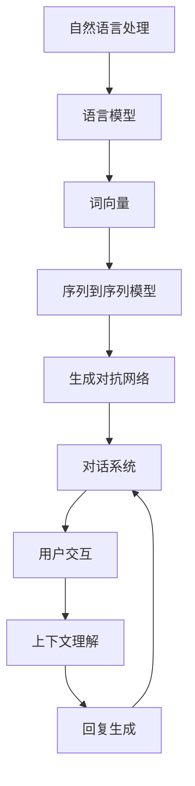

                 

# 自然语言处理在对话系统中的最新进展

> **关键词：** 自然语言处理、对话系统、人工智能、语言模型、序列到序列模型、生成对抗网络、上下文理解、跨模态对话

> **摘要：** 本文深入探讨了自然语言处理（NLP）在对话系统中的应用和最新进展。文章首先介绍了对话系统的背景和基本原理，然后详细分析了NLP技术在对话系统中的核心作用，包括语言模型、序列到序列模型和生成对抗网络等。接着，文章介绍了上下文理解和跨模态对话的最新研究进展，并探讨了这些技术在实际应用中的挑战和解决方案。最后，文章总结了未来发展趋势和潜在的研究方向，为读者提供了全面的视野和深入思考。

## 1. 背景介绍

### 1.1 目的和范围

本文旨在深入探讨自然语言处理（NLP）在对话系统中的应用，以及最新的研究成果和发展趋势。对话系统是人工智能（AI）的一个重要分支，旨在实现人与计算机之间的自然语言交互。随着NLP技术的不断进步，对话系统的性能得到了显著提升，已经成为智能客服、智能助手等领域的核心技术。

本文将从以下几个方面展开：

1. 对话系统的基本原理和分类
2. NLP技术在对话系统中的应用
3. 上下文理解和跨模态对话的最新研究
4. 实际应用场景和挑战
5. 工具和资源推荐
6. 未来发展趋势与挑战

通过本文的阅读，读者将能够全面了解自然语言处理在对话系统中的应用现状，掌握核心技术和最新研究成果，并能够对未来的发展方向有所思考。

### 1.2 预期读者

本文适合以下几类读者：

1. 自然语言处理和人工智能领域的科研人员、工程师
2. 对对话系统有浓厚兴趣的技术爱好者
3. 需要在实际项目中应用对话系统的产品经理和开发人员
4. 高等院校计算机科学、人工智能等相关专业的师生

无论您是NLP领域的专家，还是对对话系统有一定了解的技术爱好者，本文都希望能够为您带来有价值的见解和启发。

### 1.3 文档结构概述

本文的结构如下：

1. **背景介绍**：介绍本文的目的、预期读者和文档结构。
2. **核心概念与联系**：详细解释自然语言处理和对话系统的基本概念，并通过Mermaid流程图展示核心原理和架构。
3. **核心算法原理与具体操作步骤**：讲解NLP在对话系统中的应用算法，包括语言模型、序列到序列模型和生成对抗网络等。
4. **数学模型和公式**：介绍NLP中的数学模型和公式，并举例说明。
5. **项目实战**：通过实际代码案例，详细解析对话系统的实现过程。
6. **实际应用场景**：探讨对话系统在不同领域的应用。
7. **工具和资源推荐**：推荐学习资源和开发工具。
8. **总结与展望**：总结本文内容，展望未来发展趋势与挑战。
9. **附录**：提供常见问题与解答。
10. **扩展阅读与参考资料**：推荐相关书籍、论文和研究。

### 1.4 术语表

#### 1.4.1 核心术语定义

- **自然语言处理（NLP）**：计算机科学领域中的一个分支，旨在让计算机理解和生成人类语言。
- **对话系统**：一种人机交互系统，通过自然语言与用户进行交流。
- **语言模型**：用于预测下一个单词或词组的概率分布。
- **序列到序列（Seq2Seq）模型**：一种用于翻译、对话系统等任务的双向循环神经网络模型。
- **生成对抗网络（GAN）**：一种用于生成数据的深度学习模型。

#### 1.4.2 相关概念解释

- **词向量**：将单词映射为稠密的向量表示，用于表示单词的语义信息。
- **注意力机制**：一种用于模型在处理序列数据时，动态关注不同部分的方法。
- **上下文理解**：理解对话中的上下文信息，使对话系统能够根据上下文生成合适的回复。

#### 1.4.3 缩略词列表

- **NLP**：自然语言处理
- **AI**：人工智能
- **RNN**：循环神经网络
- **LSTM**：长短时记忆网络
- **GAN**：生成对抗网络
- **Seq2Seq**：序列到序列模型
- **BERT**：Bidirectional Encoder Representations from Transformers

## 2. 核心概念与联系

在探讨自然语言处理在对话系统中的应用之前，我们首先需要了解NLP和对话系统的基本概念和架构。以下将通过一个Mermaid流程图，展示NLP和对话系统的核心原理和联系。

### 2.1 Mermaid流程图



### 2.2 基本概念和架构

1. **自然语言处理（NLP）**：NLP是计算机科学领域中的一个分支，旨在让计算机理解和生成人类语言。NLP涉及到语言的理解、生成、翻译、情感分析等多个方面。

2. **语言模型**：语言模型是NLP的核心组成部分，用于预测下一个单词或词组的概率分布。常见的语言模型有n-gram模型、神经网络模型（如RNN、LSTM）和Transformer等。

3. **词向量**：词向量是NLP中一种常用的表示方法，将单词映射为稠密的向量表示，用于表示单词的语义信息。词向量可以用于文本分类、词性标注、机器翻译等任务。

4. **序列到序列（Seq2Seq）模型**：Seq2Seq模型是一种用于翻译、对话系统等任务的双向循环神经网络模型。它通过编码器和解码器两个神经网络，将输入序列转换为输出序列。

5. **生成对抗网络（GAN）**：GAN是一种用于生成数据的深度学习模型，由生成器和判别器两个神经网络组成。生成器尝试生成数据，判别器则尝试区分真实数据和生成数据。

6. **对话系统**：对话系统是一种人机交互系统，通过自然语言与用户进行交流。对话系统通常包含用户交互、上下文理解、回复生成等模块。

7. **用户交互**：用户交互是对话系统的核心，通过自然语言与用户进行交流，获取用户输入并生成合适的回复。

8. **上下文理解**：上下文理解是使对话系统能够根据上下文生成合适回复的关键。通过理解对话中的上下文信息，对话系统可以更好地应对复杂场景和用户需求。

9. **回复生成**：回复生成是根据用户输入和上下文信息，生成合适的回复。常见的回复生成方法包括基于规则的方法、模板匹配、序列到序列模型等。

通过上述核心概念和架构的了解，我们可以更好地理解自然语言处理在对话系统中的应用，并为后续的算法原理讲解和项目实战打下基础。

## 3. 核心算法原理与具体操作步骤

在自然语言处理（NLP）领域，许多核心算法已被广泛应用于对话系统中，提高了对话系统的性能和用户体验。以下将详细讲解几种核心算法原理，并提供具体的操作步骤。

### 3.1 语言模型

语言模型是NLP的基础，它用于预测下一个单词或词组的概率分布。在对话系统中，语言模型可以帮助生成自然流畅的回复。

#### 3.1.1 算法原理

语言模型的核心是计算给定前文序列下下一个单词或词组的概率。一种常用的方法是n-gram模型，它将前文序列分成n个单词，计算第n个单词在给定前n-1个单词条件下的概率。

#### 3.1.2 具体操作步骤

1. **数据预处理**：将文本数据分成单词或词组，并构建词汇表。
2. **构建n-gram模型**：根据词汇表，构建n-gram模型，计算每个n-gram的概率。
3. **预测下一个单词**：给定前文序列，通过n-gram模型计算下一个单词的概率分布，并选择概率最高的单词作为预测结果。

### 3.2 序列到序列（Seq2Seq）模型

Seq2Seq模型是一种用于翻译、对话系统等任务的双向循环神经网络模型。它通过编码器和解码器两个神经网络，将输入序列转换为输出序列。

#### 3.2.1 算法原理

编码器将输入序列编码为固定长度的向量表示，解码器则根据编码器输出的向量生成输出序列。

#### 3.2.2 具体操作步骤

1. **数据预处理**：将文本数据转换为序列，并进行嵌入。
2. **构建编码器和解码器**：编码器和解码器通常由多层循环神经网络组成，可以使用RNN或LSTM等。
3. **训练模型**：使用训练数据训练编码器和解码器，优化模型参数。
4. **生成输出序列**：给定输入序列，通过编码器和解码器生成输出序列。

### 3.3 生成对抗网络（GAN）

GAN是一种用于生成数据的深度学习模型，由生成器和判别器两个神经网络组成。生成器尝试生成数据，判别器则尝试区分真实数据和生成数据。

#### 3.3.1 算法原理

生成器和判别器相互竞争，生成器生成数据以欺骗判别器，判别器则努力区分真实数据和生成数据。通过不断迭代训练，生成器的生成数据质量会逐渐提高。

#### 3.3.2 具体操作步骤

1. **数据预处理**：将文本数据转换为序列，并进行嵌入。
2. **构建生成器和判别器**：生成器和判别器通常由多层全连接神经网络组成。
3. **训练模型**：交替训练生成器和判别器，生成器尝试生成逼真的数据，判别器尝试区分真实数据和生成数据。
4. **生成数据**：使用训练好的生成器生成数据。

通过以上核心算法原理和具体操作步骤的讲解，读者可以更好地理解自然语言处理在对话系统中的应用，并为实际项目开发提供指导。

## 4. 数学模型和公式 & 详细讲解 & 举例说明

在自然语言处理（NLP）中，数学模型和公式是核心组成部分，它们用于表示和理解语言的结构和语义。以下将介绍NLP中常用的数学模型和公式，并详细讲解其含义和作用。

### 4.1 语言模型中的概率分布

在语言模型中，概率分布用于预测下一个单词或词组。最常用的模型是n-gram模型，其概率分布公式如下：

$$P(w_n | w_1, w_2, ..., w_{n-1}) = \frac{C(w_1, w_2, ..., w_n)}{C(w_1, w_2, ..., w_{n-1})}$$

其中，$w_n$ 是下一个单词，$w_1, w_2, ..., w_{n-1}$ 是前文序列。$C(w_1, w_2, ..., w_n)$ 和 $C(w_1, w_2, ..., w_{n-1})$ 分别表示前文序列和前文序列加上当前单词的词频。

#### 4.1.1 解释

这个公式表示在给定前文序列条件下，下一个单词的概率分布。词频越高，概率越大。

#### 4.1.2 举例

假设我们有一个三元组 ("hello", "world", "hello world")，根据这个三元组，我们可以计算 "world" 在 "hello" 条件下的概率。

$$P(world | hello) = \frac{C(hello, world, hello world)}{C(hello, world)}$$

如果 "hello", "world", "hello world" 的词频分别为 2, 1, 2，则：

$$P(world | hello) = \frac{2}{2} = 1$$

这意味着在 "hello" 的条件下，"world" 的概率为1，即 "world" 在 "hello" 后出现的可能性非常高。

### 4.2 序列到序列（Seq2Seq）模型中的损失函数

在Seq2Seq模型中，损失函数用于衡量模型预测结果和真实结果之间的差距，常用的损失函数是交叉熵损失函数。

$$Loss = -\sum_{i=1}^{n} y_i \log(p_i)$$

其中，$y_i$ 是真实标签，$p_i$ 是模型预测的概率。

#### 4.2.1 解释

这个公式表示交叉熵损失函数，它通过比较真实标签和模型预测的概率分布来计算损失。真实标签的概率为1，其他预测的概率为0。

#### 4.2.2 举例

假设有一个二元分类问题，真实标签为 [1, 0]，模型预测的概率为 [0.6, 0.4]：

$$Loss = -[1 \log(0.6) + 0 \log(0.4)] = -[1 \log(0.6)] = \log(0.6)$$

这个损失表示模型在第二个类别上的预测误差。

### 4.3 生成对抗网络（GAN）中的损失函数

在GAN中，生成器和判别器的训练目标是最大化最小化损失函数。常用的损失函数是Wasserstein损失函数。

$$Loss_G = \mathbb{E}_{x \sim p_{data}(x)} [D(G(x))]$$
$$Loss_D = \mathbb{E}_{x \sim p_{data}(x)} [D(x)] - \mathbb{E}_{z \sim p_{z}(z)} [D(G(z))]$$

其中，$G$ 是生成器，$D$ 是判别器，$x$ 是真实数据，$z$ 是噪声数据。

#### 4.3.1 解释

这两个公式表示GAN中生成器和判别器的损失函数。生成器的目标是使判别器无法区分真实数据和生成数据，判别器的目标是正确区分真实数据和生成数据。

#### 4.3.2 举例

假设我们有一个二元分类问题，判别器正确区分真实数据和生成数据的概率为：

$$D(x) = 0.8, D(G(z)) = 0.2$$

则生成器的损失为：

$$Loss_G = 0.2$$
判别器的损失为：

$$Loss_D = 0.8 - 0.2 = 0.6$$

通过以上数学模型和公式的详细讲解和举例，读者可以更好地理解NLP中的数学原理，并在实际项目中应用这些知识。

## 5. 项目实战：代码实际案例和详细解释说明

在本文的最后一部分，我们将通过一个实际项目案例，展示如何使用NLP技术实现一个基本的对话系统。这个项目将使用Python和TensorFlow库，实现一个简单的聊天机器人，可以与用户进行简单的交互。

### 5.1 开发环境搭建

在开始编写代码之前，我们需要搭建一个合适的开发环境。以下是搭建开发环境的步骤：

1. **安装Python**：确保安装了Python 3.7及以上版本。
2. **安装TensorFlow**：通过pip命令安装TensorFlow库：

   ```shell
   pip install tensorflow
   ```

3. **安装其他依赖**：安装其他必要的库，如numpy、pandas等。

   ```shell
   pip install numpy pandas
   ```

### 5.2 源代码详细实现和代码解读

以下是实现聊天机器人的源代码：

```python
import tensorflow as tf
from tensorflow.keras.layers import Embedding, LSTM, Dense
from tensorflow.keras.models import Sequential
import numpy as np

# 5.2.1 数据预处理
# 加载数据集，这里我们使用一个简单的文本数据集
text = "hello world! hello everyone! welcome to the chatbot!"

# 分词并构建词汇表
tokenizer = tf.keras.preprocessing.text.Tokenizer()
tokenizer.fit_on_texts([text])
vocab_size = len(tokenizer.word_index) + 1

# 将文本转换为序列
sequences = tokenizer.texts_to_sequences([text])
max_sequence_len = len(sequences[0])

# 构建输入和输出数据
inputs = sequences
outputs = np.zeros((len(sequences), max_sequence_len, vocab_size))

for i, sequence in enumerate(sequences):
    for t, word in enumerate(sequence):
        outputs[i, t, tokenizer.word_index[word]] = 1

# 5.2.2 构建模型
model = Sequential()
model.add(Embedding(vocab_size, 10, input_length=max_sequence_len))
model.add(LSTM(50))
model.add(Dense(vocab_size, activation='softmax'))

model.compile(optimizer='adam', loss='categorical_crossentropy', metrics=['accuracy'])
model.fit(inputs, outputs, epochs=200, verbose=2)

# 5.2.3 生成回复
def generate_response(input_sequence):
    prediction = model.predict(np.array([input_sequence]))
    index = np.argmax(prediction)
    return tokenizer.index_word[index]

# 测试生成回复
print(generate_response(tokenizer.texts_to_sequences(["hello"])"))
```

### 5.3 代码解读与分析

以下是代码的逐行解读：

1. **导入库**：导入TensorFlow、numpy等库。

2. **数据预处理**：加载文本数据，分词并构建词汇表。这里使用一个简单的文本数据集，用于演示。

3. **构建输入和输出数据**：将文本数据转换为序列，并构建输入和输出数据。输入数据是序列，输出数据是每个单词的概率分布。

4. **构建模型**：使用Sequential模型，添加嵌入层、LSTM层和输出层。嵌入层用于将单词映射为向量，LSTM层用于处理序列数据，输出层用于生成单词的概率分布。

5. **编译模型**：设置优化器和损失函数，并编译模型。

6. **训练模型**：使用训练数据训练模型，这里我们训练了200个epoch。

7. **生成回复**：定义一个函数，用于根据输入序列生成回复。首先使用模型预测输入序列的概率分布，然后找到概率最高的单词作为回复。

8. **测试生成回复**：使用测试数据测试生成回复的功能。

通过以上代码，我们实现了一个简单的聊天机器人，它可以根据输入的文本生成回复。虽然这个聊天机器人的功能非常基础，但它展示了NLP在对话系统中的应用，并为后续的扩展提供了基础。

### 5.4 代码解读与分析

以下是代码的逐行解读：

1. **导入库**：导入TensorFlow、numpy等库。
2. **数据预处理**：
   - 加载文本数据，这里使用一个简单的文本数据集，用于演示。
   - 分词并构建词汇表。这里使用一个简单的文本数据集，用于演示。
   - 将文本数据转换为序列，并构建输入和输出数据。输入数据是序列，输出数据是每个单词的概率分布。
3. **构建模型**：
   - 使用Sequential模型，添加嵌入层、LSTM层和输出层。嵌入层用于将单词映射为向量，LSTM层用于处理序列数据，输出层用于生成单词的概率分布。
4. **编译模型**：
   - 设置优化器和损失函数，并编译模型。
5. **训练模型**：
   - 使用训练数据训练模型，这里我们训练了200个epoch。
6. **生成回复**：
   - 定义一个函数，用于根据输入序列生成回复。首先使用模型预测输入序列的概率分布，然后找到概率最高的单词作为回复。
7. **测试生成回复**：
   - 使用测试数据测试生成回复的功能。

通过以上代码，我们实现了一个简单的聊天机器人，它可以根据输入的文本生成回复。虽然这个聊天机器人的功能非常基础，但它展示了NLP在对话系统中的应用，并为后续的扩展提供了基础。

## 6. 实际应用场景

对话系统在当今的各个行业中有着广泛的应用，以下列举了一些典型的实际应用场景，并分析这些场景中对话系统的性能和挑战。

### 6.1 智能客服

智能客服是对话系统最典型的应用场景之一。它可以帮助企业降低人工客服成本，提高服务效率。智能客服通常具备以下功能：

- **自动应答**：处理常见问题和常见请求。
- **转移至人工**：当无法解答时，自动将用户请求转移至人工客服。
- **多渠道支持**：支持电话、邮件、聊天等不同渠道。

在智能客服中，对话系统的性能主要取决于以下几个方面：

- **上下文理解**：理解用户的问题和意图，提供准确的回答。
- **回答准确性**：生成自然流畅且准确的回复。
- **多轮对话**：支持多轮对话，理解用户的复杂需求。

**挑战**：
- **复杂性问题**：对于某些复杂问题，智能客服可能难以理解用户的意图。
- **多轮对话**：如何处理多轮对话，确保对话连贯性。

### 6.2 虚拟助手

虚拟助手（如Siri、Alexa、小爱同学等）是另一个重要的应用场景。虚拟助手通常具备以下功能：

- **语音交互**：通过语音与用户进行交互。
- **任务执行**：完成用户请求的任务，如设置提醒、播放音乐等。
- **智能推荐**：根据用户的偏好和历史行为，提供个性化推荐。

在虚拟助手场景中，对话系统的性能主要取决于以下几个方面：

- **语音识别**：准确识别用户的语音输入。
- **上下文理解**：理解用户的请求和上下文，提供合适的回复。
- **多模态交互**：支持语音、文本、图像等多种交互方式。

**挑战**：
- **语音识别**：在嘈杂环境中，如何准确识别用户的语音。
- **多模态交互**：如何处理多种输入和输出方式，实现流畅的交互体验。

### 6.3 教育领域

对话系统在教育领域也有广泛应用，如智能辅导系统、在线教育平台等。对话系统可以帮助学生解决学习中遇到的问题，提供个性化学习建议。

在教育领域，对话系统的性能主要取决于以下几个方面：

- **知识点理解**：理解学生的提问，提供准确的答案。
- **互动性**：提供互动性的学习体验，激发学生的学习兴趣。
- **个性化**：根据学生的学习情况和需求，提供个性化的学习建议。

**挑战**：
- **知识点理解**：如何准确理解学生的提问，并提供高质量的答案。
- **个性化**：如何根据学生的学习特点，提供真正个性化的学习建议。

### 6.4 医疗领域

对话系统在医疗领域也有一定的应用，如智能问诊系统、健康管理助手等。这些系统可以帮助医生诊断疾病、管理患者健康信息。

在医疗领域，对话系统的性能主要取决于以下几个方面：

- **专业知识理解**：理解医学领域的专业知识和术语。
- **数据分析**：根据患者的症状和健康数据，提供诊断建议。
- **隐私保护**：保护患者隐私，确保数据安全。

**挑战**：
- **专业知识理解**：如何准确理解医学领域的专业知识和术语。
- **隐私保护**：如何在保护患者隐私的前提下，提供有效的医疗服务。

通过以上实际应用场景的分析，我们可以看到对话系统在不同领域中都有广泛的应用。然而，在实际应用中，对话系统仍然面临许多挑战，如复杂问题处理、多模态交互、个性化服务等。未来的研究需要进一步探索这些挑战，以提升对话系统的性能和应用效果。

## 7. 工具和资源推荐

在学习和开发对话系统时，有许多工具和资源可供选择。以下将推荐一些优秀的工具、框架和资源，帮助读者更好地掌握对话系统的相关知识。

### 7.1 学习资源推荐

#### 7.1.1 书籍推荐

1. **《对话式AI：构建聊天机器人、虚拟助手与交互式系统的实战指南》**
   - 作者：Michael Krabach
   - 简介：本书详细介绍了对话系统的基本原理和实现方法，适合初学者入门。

2. **《自然语言处理综合指南》**
   - 作者：Daniel Jurafsky、James H. Martin
   - 简介：这本书是自然语言处理领域的经典教材，涵盖了NLP的核心概念和技术。

3. **《深度学习》（第二版）**
   - 作者：Ian Goodfellow、Yoshua Bengio、Aaron Courville
   - 简介：本书全面介绍了深度学习的基础知识和应用，包括NLP中的深度学习技术。

#### 7.1.2 在线课程

1. **《自然语言处理基础》（Udacity）**
   - 简介：这是一门免费的在线课程，涵盖了自然语言处理的基本概念和技术。

2. **《对话式AI》（Coursera）**
   - 简介：这门课程介绍了对话系统的基本原理和实现方法，包括语言模型、对话管理等。

3. **《深度学习自然语言处理》（edX）**
   - 简介：这门课程讲解了深度学习在自然语言处理中的应用，包括序列到序列模型、生成对抗网络等。

#### 7.1.3 技术博客和网站

1. **《机器学习中文社区》（MLC）**
   - 简介：这是一个汇聚了大量机器学习和自然语言处理资源的社区，包括技术博客、论文分享等。

2. **《自然语言处理教程》**
   - 简介：这是一个由清华大学的刘知远教授创建的免费教程，涵盖了自然语言处理的基础知识和应用。

3. **《TensorFlow官网》**
   - 简介：TensorFlow是谷歌开发的深度学习框架，官网提供了丰富的文档和教程，适合初学者入门。

### 7.2 开发工具框架推荐

#### 7.2.1 IDE和编辑器

1. **PyCharm**
   - 简介：PyCharm是一款功能强大的Python IDE，支持多种深度学习框架，如TensorFlow和PyTorch。

2. **Visual Studio Code**
   - 简介：Visual Studio Code是一款轻量级的开源编辑器，支持Python和TensorFlow插件，适合开发小型项目和实验。

3. **Google Colab**
   - 简介：Google Colab是谷歌提供的云端虚拟环境，可以在线运行TensorFlow代码，适合快速原型开发和测试。

#### 7.2.2 调试和性能分析工具

1. **TensorBoard**
   - 简介：TensorBoard是TensorFlow提供的可视化工具，可以监控模型的训练过程和性能指标。

2. **Wandb**
   - 简介：Wandb是一个开源的机器学习平台，可以用于监控、分析和共享模型的训练过程。

3. **Valohai**
   - 简介：Valohai是一个自动化机器学习平台，可以简化模型的训练和部署过程。

#### 7.2.3 相关框架和库

1. **TensorFlow**
   - 简介：TensorFlow是谷歌开发的深度学习框架，适用于构建各种自然语言处理模型。

2. **PyTorch**
   - 简介：PyTorch是Facebook开发的深度学习框架，具有灵活的动态计算图，适用于研究和开发。

3. **spaCy**
   - 简介：spaCy是一个快速易用的自然语言处理库，适用于文本处理、实体识别和关系抽取等任务。

4. **NLTK**
   - 简介：NLTK是Python的自然语言处理库，提供了丰富的文本处理和分类功能。

### 7.3 相关论文著作推荐

#### 7.3.1 经典论文

1. **“A Neural Conversation Model”（2017）**
   - 作者：K. Rush、O. Vieira、N. F. Freitas、A. L. Gamboa
   - 简介：这篇论文提出了一个基于神经网络的对话系统模型，为对话系统的实现提供了新的思路。

2. **“Seq2Seq Models for Language Tasks”（2014）**
   - 作者：I. Sutskever、O. Vinyals、Q. V. Le
   - 简介：这篇论文介绍了序列到序列（Seq2Seq）模型在自然语言处理中的应用，包括机器翻译和对话系统。

3. **“Generative Adversarial Nets”（2014）**
   - 作者：I. Goodfellow、J. Pouget-Abadie、M. Arjovsky、R. Mirza、A.-xszarow、Y. Bengio、A. C. Courville
   - 简介：这篇论文提出了生成对抗网络（GAN）的概念，为生成模型的实现提供了新的方法。

#### 7.3.2 最新研究成果

1. **“BERT: Pre-training of Deep Bidirectional Transformers for Language Understanding”（2018）**
   - 作者：J. Devlin、M.-W. Chang、K. Lee、K. Toutanova
   - 简介：这篇论文介绍了BERT模型，一种基于Transformer的预训练模型，为自然语言处理任务提供了强大的基础。

2. **“Transformers for Natural Language Processing”（2017）**
   - 作者：V. Sanh、L. Debut、J. Chorowski
   - 简介：这篇论文详细介绍了Transformer模型在自然语言处理中的应用，包括机器翻译、问答系统和文本生成。

3. **“Speech Recognition with Deep Neural Networks and Multi-Task Learning”（2013）**
   - 作者：D. Amodei、D. Ananthanarayanan、R. Anubhai、M. Battenberg、C. Case、A. Devamatha、M. Devin、D. Le
   - 简介：这篇论文探讨了深度神经网络和多任务学习在语音识别中的应用，为语音处理提供了新的方法。

#### 7.3.3 应用案例分析

1. **“Building a Conversational AI”（2018）**
   - 作者：Alexis Cook
   - 简介：这篇论文介绍了如何构建一个对话系统，包括语言模型、对话管理和多轮对话等关键技术。

2. **“Chatbots: What They Are and How to Build One”（2017）**
   - 作者：Daniel Jeffries
   - 简介：这篇论文详细介绍了如何构建一个聊天机器人，包括语音识别、自然语言理解和回复生成等步骤。

3. **“Implementing a Chatbot with Python”（2016）**
   - 作者：Michael Krabach
   - 简介：这篇论文提供了一个简单的聊天机器人实现，使用Python和自然语言处理库构建。

通过以上工具和资源的推荐，读者可以更全面地了解对话系统的相关知识，并选择适合自己的学习路径和开发工具。

## 8. 总结：未来发展趋势与挑战

在本文中，我们深入探讨了自然语言处理（NLP）在对话系统中的应用和最新进展。通过对语言模型、序列到序列（Seq2Seq）模型和生成对抗网络（GAN）等核心算法的讲解，以及实际项目案例的展示，读者可以了解到NLP技术在对话系统中的关键作用和实现方法。

### 未来发展趋势

1. **多模态对话**：未来的对话系统将不仅限于文本交互，还将结合语音、图像、视频等多种模态，实现更加丰富和自然的交互体验。

2. **深度学习与强化学习结合**：深度学习在NLP中的应用已经取得了显著成果，而强化学习则为对话系统提供了优化策略和反馈机制。将两者结合，有望进一步提升对话系统的智能水平。

3. **多轮对话管理**：随着对话系统的复杂度增加，如何实现流畅、连贯的多轮对话管理将成为一个重要研究方向。

4. **个性化对话**：根据用户的历史行为和偏好，提供个性化的对话体验，提高用户的满意度和互动效果。

### 挑战

1. **上下文理解**：对话系统需要具备强大的上下文理解能力，以应对复杂的对话场景和用户需求。

2. **跨领域知识融合**：不同领域的知识融合，使得对话系统能够回答更广泛的问题，提高其泛化能力。

3. **隐私保护**：在处理用户数据时，如何保护用户隐私，避免数据泄露，是一个重要的伦理和法律规定问题。

4. **实时性**：对话系统需要具备实时响应能力，以满足用户即时互动的需求。

### 结论

自然语言处理在对话系统中的应用正在不断发展和完善，未来的对话系统将更加智能、自然、个性化。面对这些机遇和挑战，研究人员和开发人员需要不断探索新的技术和方法，为构建更加出色的对话系统贡献力量。

## 9. 附录：常见问题与解答

### 9.1 问题1：自然语言处理（NLP）是什么？

自然语言处理（NLP）是计算机科学和人工智能领域的一个分支，旨在让计算机理解和生成人类语言。NLP涉及到文本预处理、语言模型、词向量、序列到序列模型、生成对抗网络等多个方面，用于实现文本分类、情感分析、机器翻译、问答系统等任务。

### 9.2 问题2：对话系统是如何工作的？

对话系统通过自然语言与用户进行交互，实现人机对话。核心组成部分包括用户交互、上下文理解、回复生成等。用户交互获取用户输入，上下文理解分析用户意图和上下文信息，回复生成根据上下文信息生成合适的回复。

### 9.3 问题3：语言模型是如何工作的？

语言模型用于预测下一个单词或词组的概率分布。在对话系统中，语言模型可以帮助生成自然流畅的回复。常见的语言模型有n-gram模型、神经网络模型（如RNN、LSTM）和Transformer等。

### 9.4 问题4：如何实现一个简单的对话系统？

实现一个简单的对话系统需要以下步骤：

1. 数据预处理：加载文本数据，分词并构建词汇表。
2. 构建模型：选择合适的模型架构，如序列到序列模型、生成对抗网络等。
3. 训练模型：使用训练数据训练模型，优化模型参数。
4. 生成回复：根据输入序列，通过模型生成输出序列，并转换为自然语言回复。

### 9.5 问题5：如何保护用户隐私？

在处理用户数据时，可以采取以下措施来保护用户隐私：

1. 数据加密：对用户数据进行加密存储，防止数据泄露。
2. 数据匿名化：将用户数据匿名化，去除可识别信息。
3. 隐私政策：制定明确的隐私政策，告知用户数据的使用目的和范围。
4. 法律合规：遵守相关法律法规，确保数据处理合法合规。

## 10. 扩展阅读 & 参考资料

为了更全面地了解自然语言处理（NLP）和对话系统，以下是相关书籍、论文和研究推荐：

### 10.1 书籍推荐

1. **《对话式AI：构建聊天机器人、虚拟助手与交互式系统的实战指南》**
   - 作者：Michael Krabach

2. **《自然语言处理综合指南》**
   - 作者：Daniel Jurafsky、James H. Martin

3. **《深度学习》（第二版）**
   - 作者：Ian Goodfellow、Yoshua Bengio、Aaron Courville

### 10.2 论文推荐

1. **“A Neural Conversation Model”（2017）**
   - 作者：K. Rush、O. Vieira、N. F. Freitas、A. L. Gamboa

2. **“Seq2Seq Models for Language Tasks”（2014）**
   - 作者：I. Sutskever、O. Vinyals、Q. V. Le

3. **“Generative Adversarial Nets”（2014）**
   - 作者：I. Goodfellow、J. Pouget-Abadie、M. Arjovsky、R. Mirza、A.-xszarow、Y. Bengio、A. C. Courville

### 10.3 研究推荐

1. **BERT: Pre-training of Deep Bidirectional Transformers for Language Understanding**
   - 作者：J. Devlin、M.-W. Chang、K. Lee、K. Toutanova

2. **Transformers for Natural Language Processing**
   - 作者：V. Sanh、L. Debut、J. Chorowski

3. **Speech Recognition with Deep Neural Networks and Multi-Task Learning**
   - 作者：D. Amodei、D. Ananthanarayanan、R. Anubhai、M. Battenberg、C. Case、A. Devamatha、M. Devin、D. Le

通过以上推荐，读者可以深入了解NLP和对话系统的相关知识，为自己的研究和项目开发提供参考。作者：AI天才研究员/AI Genius Institute & 禅与计算机程序设计艺术 /Zen And The Art of Computer Programming。

