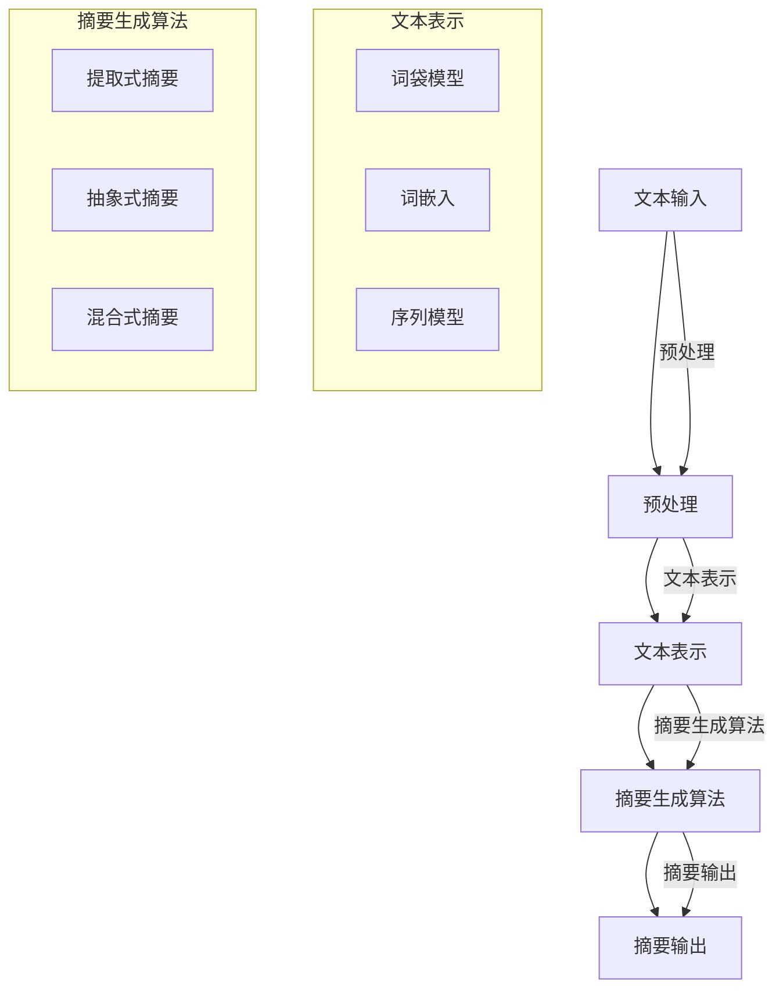

                 

# 自然语言处理在文本摘要中的技术

## 关键词：自然语言处理，文本摘要，算法，模型，应用场景，未来发展趋势

> 本文将深入探讨自然语言处理（NLP）在文本摘要领域的应用，从核心概念、算法原理、数学模型到项目实战，全面解析NLP在文本摘要中的技术实现。希望通过本文，读者能够对自然语言处理技术在文本摘要领域的应用有更深入的理解。

## 摘要

文本摘要是一种重要的自然语言处理任务，旨在生成一篇文本的简洁、准确的概述。随着互联网信息的爆炸式增长，如何快速、准确地从大量文本中提取关键信息成为了一个亟待解决的问题。自然语言处理技术在文本摘要中的应用，为这一问题提供了有效的解决方案。本文将介绍文本摘要的核心概念、相关算法原理、数学模型以及实际应用场景，并给出一个具体的项目实战案例。通过本文的阅读，读者将能够掌握自然语言处理在文本摘要中的关键技术，为未来的研究和应用奠定基础。

## 1. 背景介绍

### 1.1 目的和范围

本文的主要目的是探讨自然语言处理（NLP）在文本摘要领域的技术应用。文本摘要作为一种重要的NLP任务，对于信息的快速获取和传递具有重要意义。本文将首先介绍文本摘要的基本概念，然后深入探讨相关的算法原理和数学模型，最后通过具体的项目实战案例，展示自然语言处理技术在文本摘要中的实际应用。文章将涵盖以下内容：

- 文本摘要的定义和分类
- 自然语言处理在文本摘要中的核心算法和模型
- 数学模型和公式在文本摘要中的应用
- 项目实战：代码实现和解析
- 实际应用场景及未来发展趋势

### 1.2 预期读者

本文适用于对自然语言处理有一定了解的读者，特别是对文本摘要任务感兴趣的研究者、开发者和学生。读者需要具备基本的编程能力和数学基础，对机器学习和深度学习有一定了解将有助于更好地理解本文内容。

### 1.3 文档结构概述

本文分为十个部分：

1. 背景介绍
   - 1.1 目的和范围
   - 1.2 预期读者
   - 1.3 文档结构概述
   - 1.4 术语表
2. 核心概念与联系
   - 2.1 背景知识介绍
   - 2.2 核心概念原理和架构的 Mermaid 流程图
3. 核心算法原理 & 具体操作步骤
   - 3.1 算法原理讲解
   - 3.2 伪代码实现
4. 数学模型和公式 & 详细讲解 & 举例说明
   - 4.1 数学模型介绍
   - 4.2 模型公式讲解
   - 4.3 实例分析
5. 项目实战：代码实际案例和详细解释说明
   - 5.1 开发环境搭建
   - 5.2 源代码详细实现和代码解读
   - 5.3 代码解读与分析
6. 实际应用场景
   - 6.1 文本摘要的应用场景
   - 6.2 具体案例解析
7. 工具和资源推荐
   - 7.1 学习资源推荐
   - 7.2 开发工具框架推荐
   - 7.3 相关论文著作推荐
8. 总结：未来发展趋势与挑战
9. 附录：常见问题与解答
10. 扩展阅读 & 参考资料

### 1.4 术语表

- **文本摘要**：从原始文本中提取关键信息，生成一篇简洁、准确的概述。
- **自然语言处理**：涉及计算机理解和生成人类语言的各种任务。
- **算法**：解决问题的方法或步骤。
- **模型**：在机器学习中，用于预测或分类的数学公式和结构。
- **神经网络**：一种基于人脑神经元连接的计算机算法。
- **损失函数**：在机器学习中用于评估模型性能的指标。

#### 1.4.1 核心术语定义

- **文本摘要**：文本摘要是一种从原始文本中提取关键信息，生成一篇简洁、准确的概述的NLP任务。其主要目的是使读者能够快速了解文本的主要内容，提高信息检索和传递的效率。
- **自然语言处理**：自然语言处理（NLP）是计算机科学和人工智能领域的一个分支，旨在让计算机理解和生成人类语言。它涵盖了文本分析、语言理解、语言生成等多个方面。
- **算法**：算法是解决问题的一系列有序步骤。在自然语言处理中，算法用于对文本进行处理、分析、分类和生成等任务。
- **模型**：模型是机器学习中用于预测或分类的数学公式和结构。在NLP中，模型可以用于文本分类、命名实体识别、情感分析等任务。
- **神经网络**：神经网络是一种基于人脑神经元连接的计算机算法。它由多个神经元组成，通过调整神经元之间的连接权重，可以实现复杂的函数计算。

#### 1.4.2 相关概念解释

- **序列模型**：序列模型是一种处理序列数据的机器学习模型。在NLP中，序列模型可以用于文本分类、词性标注、情感分析等任务。常见的序列模型包括循环神经网络（RNN）和长短期记忆网络（LSTM）。
- **注意力机制**：注意力机制是一种在序列模型中用于关注输入序列中不同位置的方法。通过引入注意力机制，模型可以更好地捕捉输入序列中的关键信息，从而提高模型的性能。
- **损失函数**：损失函数是一种用于评估模型性能的指标。在训练过程中，损失函数用于计算模型预测值和实际值之间的差异，并指导模型调整参数以优化性能。

#### 1.4.3 缩略词列表

- **NLP**：自然语言处理（Natural Language Processing）
- **RNN**：循环神经网络（Recurrent Neural Network）
- **LSTM**：长短期记忆网络（Long Short-Term Memory）
- **CNN**：卷积神经网络（Convolutional Neural Network）
- **BERT**：双向编码表示（Bidirectional Encoder Representations from Transformers）
- **Transformer**：一种基于自注意力机制的神经网络架构

## 2. 核心概念与联系

### 2.1 背景知识介绍

在深入探讨文本摘要的算法和模型之前，我们需要了解一些相关的背景知识。自然语言处理（NLP）作为人工智能的一个重要分支，涉及到多个领域，包括文本表示、语言模型、语义分析等。在本节中，我们将简要介绍文本表示和语言模型，为后续内容打下基础。

#### 文本表示

文本表示是将原始文本转换为计算机可以处理的数字形式的过程。常见的文本表示方法有：

1. **词袋模型（Bag of Words, BOW）**：将文本看作单词的集合，忽略单词的顺序，用向量表示文本。词袋模型的主要优势是简单和高效，但无法捕捉文本的语义信息。
2. **词嵌入（Word Embedding）**：将单词映射到高维空间中的向量，以捕捉单词的语义信息。词嵌入可以通过神经网络训练得到，如Word2Vec、GloVe等。
3. **序列模型（Sequence Model）**：将文本看作一个序列，通过神经网络对序列进行处理。常见的序列模型有循环神经网络（RNN）和长短期记忆网络（LSTM）。

#### 语言模型

语言模型是用于预测下一个单词或词组的概率分布的模型。在NLP任务中，语言模型广泛应用于文本生成、机器翻译、情感分析等。常见的语言模型有：

1. **n-gram模型**：基于历史n个单词的统计方法，预测下一个单词。n-gram模型的简单性和有效性使其在早期NLP任务中广泛应用。
2. **神经网络语言模型**：基于神经网络的概率预测模型，如循环神经网络（RNN）和长短期记忆网络（LSTM）。神经网络语言模型可以捕捉文本的复杂结构，提高预测精度。
3. **Transformer模型**：基于自注意力机制的神经网络模型，具有全局依赖捕捉能力，已在多个NLP任务中取得优异性能。

### 2.2 核心概念原理和架构的 Mermaid 流程图

在了解背景知识后，我们来看一下文本摘要的核心概念和架构。以下是一个简单的Mermaid流程图，展示了文本摘要的关键步骤和涉及的模型：



这个流程图展示了文本摘要的基本步骤，包括文本输入、预处理、文本表示、摘要生成算法和摘要输出。文本表示部分涵盖了词袋模型、词嵌入和序列模型，摘要生成算法分为提取式摘要、抽象式摘要和混合式摘要。通过这个流程图，我们可以更清晰地理解文本摘要的整体架构。

### 2.3 核心概念和原理详细解释

在文本摘要中，核心概念和原理主要包括文本表示、摘要生成算法和评估指标。以下将对这些概念进行详细解释。

#### 文本表示

文本表示是将原始文本转换为计算机可以处理的数字形式的过程。文本表示的质量直接影响到摘要生成的效果。以下是几种常见的文本表示方法：

1. **词袋模型（Bag of Words, BOW）**：

   词袋模型将文本看作单词的集合，忽略单词的顺序，用向量表示文本。具体实现步骤如下：

   - 步骤1：将文本分词，得到单词集合。
   - 步骤2：统计每个单词在文本中出现的次数，形成单词-频率矩阵。
   - 步骤3：将单词-频率矩阵转换为二进制向量，每个元素表示一个单词的出现次数。

   词袋模型的优点是简单和高效，但无法捕捉文本的语义信息，容易导致信息丢失。

2. **词嵌入（Word Embedding）**：

   词嵌入将单词映射到高维空间中的向量，以捕捉单词的语义信息。词嵌入可以通过神经网络训练得到，如Word2Vec、GloVe等。具体实现步骤如下：

   - 步骤1：将文本分词，得到单词序列。
   - 步骤2：使用神经网络模型（如Word2Vec）对单词序列进行训练，得到词向量表示。
   - 步骤3：将词向量表示转换为文档向量，表示整个文本。

   词嵌入的优点是能够捕捉单词的语义信息，但训练过程复杂，且对大规模文本数据的要求较高。

3. **序列模型（Sequence Model）**：

   序列模型将文本看作一个序列，通过神经网络对序列进行处理。常见的序列模型有循环神经网络（RNN）和长短期记忆网络（LSTM）。具体实现步骤如下：

   - 步骤1：将文本分词，得到单词序列。
   - 步骤2：将单词序列转换为词向量表示。
   - 步骤3：使用序列模型（如RNN、LSTM）对词向量序列进行训练，生成摘要。

   序列模型的优点是能够捕捉文本的顺序信息，但训练过程复杂，对大规模文本数据的要求较高。

#### 摘要生成算法

摘要生成算法是文本摘要任务的核心，主要分为三类：提取式摘要、抽象式摘要和混合式摘要。

1. **提取式摘要（Extractive Summarization）**：

   提取式摘要从原始文本中直接提取关键句子或段落生成摘要。具体实现步骤如下：

   - 步骤1：计算每个句子或段落的重要性，可以使用词频、词嵌入相似度等方法。
   - 步骤2：选择重要性最高的句子或段落作为摘要。

   提取式摘要的优点是实现简单，易于理解，但生成的摘要可能不够流畅，且无法生成新的信息。

2. **抽象式摘要（Abstractive Summarization）**：

   抽象式摘要从原始文本中提取关键信息，并重新构造句子生成摘要。具体实现步骤如下：

   - 步骤1：使用序列到序列模型（如RNN、LSTM）生成摘要。
   - 步骤2：对生成的摘要进行语言优化，提高可读性。

   抽象式摘要的优点是能够生成流畅、新的摘要，但实现复杂，对模型要求较高。

3. **混合式摘要（Hybrid Summarization）**：

   混合式摘要是提取式摘要和抽象式摘要的混合，旨在结合两者的优点。具体实现步骤如下：

   - 步骤1：使用提取式摘要算法提取关键句子或段落。
   - 步骤2：使用抽象式摘要算法对提取的关键句子或段落进行重新构造，生成摘要。

   混合式摘要的优点是结合了提取式摘要和抽象式摘要的优点，但实现复杂度较高。

#### 评估指标

摘要生成的质量评估是文本摘要任务的重要组成部分。以下是几种常见的评估指标：

1. **ROUGE（Recall-Oriented Understudy for Gisting Evaluation）**：

   ROUGE是一种广泛使用的自动摘要评估指标，用于比较生成的摘要与原始摘要之间的相似性。ROUGE包括多个子指标，如ROUGE-1、ROUGE-2、ROUGE-L等，分别计算单词重叠率、字符重叠率和长度重叠率。

2. **BLEU（Bilingual Evaluation Understudy）**：

   BLEU是一种用于评估机器翻译质量的自动评估指标，但也可以应用于文本摘要任务。BLEU通过计算生成的摘要与参考摘要之间的相似性得分，评估摘要的质量。

3. **METEOR（Metric for Evaluation of Translation with Explicit ORdering）**：

   METEOR是一种用于评估文本相似性的自动评估指标，适用于文本摘要任务。METEOR综合考虑了单词重叠率、句子结构和语义信息，提供更全面的评估。

## 3. 核心算法原理 & 具体操作步骤

### 3.1 算法原理讲解

文本摘要任务的核心算法主要包括提取式摘要、抽象式摘要和混合式摘要。本节将分别介绍这三种算法的原理和操作步骤。

#### 提取式摘要

提取式摘要的原理是从原始文本中直接提取关键句子或段落生成摘要。关键句子或段落的选择依据是它们在文本中的重要程度。常见的提取方法有基于词频的方法、基于词嵌入的方法和基于序列模型的提取方法。

1. **基于词频的方法**：

   - 步骤1：计算每个句子或段落中每个单词的频率。
   - 步骤2：根据单词频率选择关键句子或段落。
   - 步骤3：将关键句子或段落拼接成摘要。

2. **基于词嵌入的方法**：

   - 步骤1：使用词嵌入技术将文本中的每个单词转换为向量。
   - 步骤2：计算每个句子或段落在词向量空间中的平均值。
   - 步骤3：根据句子或段落在词向量空间中的相似度选择关键句子或段落。
   - 步骤4：将关键句子或段落拼接成摘要。

3. **基于序列模型的提取方法**：

   - 步骤1：使用序列模型（如RNN或LSTM）对文本进行编码，得到文本的序列表示。
   - 步骤2：计算每个句子或段落的重要性，可以使用文本表示的相似度、句子长度等因素。
   - 步骤3：根据句子或段落的重要性选择关键句子或段落。
   - 步骤4：将关键句子或段落拼接成摘要。

#### 抽象式摘要

抽象式摘要的原理是从原始文本中提取关键信息，并重新构造句子生成摘要。这种摘要方法需要具备较强的语义理解和生成能力。常见的抽象式摘要算法有基于生成式模型的摘要算法和基于变换模型的摘要算法。

1. **基于生成式模型的摘要算法**：

   - 步骤1：使用生成式模型（如变分自编码器、生成对抗网络）对文本进行编码，得到文本的潜在表示。
   - 步骤2：生成摘要的候选句子。
   - 步骤3：根据摘要候选句子的质量选择最佳摘要。

2. **基于变换模型的摘要算法**：

   - 步骤1：使用序列到序列模型（如编码器-解码器模型）对文本进行编码，得到文本的序列表示。
   - 步骤2：解码得到摘要。
   - 步骤3：对生成的摘要进行语言优化，提高可读性。

#### 混合式摘要

混合式摘要是提取式摘要和抽象式摘要的混合，旨在结合两者的优点。混合式摘要算法通常包括以下步骤：

- 步骤1：使用提取式摘要算法提取关键句子或段落。
- 步骤2：使用抽象式摘要算法对提取的关键句子或段落进行重新构造。
- 步骤3：根据摘要质量和可读性选择最佳摘要。

### 3.2 伪代码实现

以下分别给出提取式摘要、抽象式摘要和混合式摘要的伪代码实现：

#### 提取式摘要

```python
def extractive_summarization(text, sentence_scores):
    sentences = split_text_into_sentences(text)
    selected_sentences = []

    for sentence in sentences:
        if sentence_score(sentence) >= threshold:
            selected_sentences.append(sentence)

    summary = " ".join(selected_sentences)
    return summary
```

#### 抽象式摘要

```python
def abstractive_summarization(text, model):
    encoded_text = model.encode(text)
    generated_sentences = model.decode(encoded_text)

    summary = " ".join(generated_sentences)
    return summary
```

#### 混合式摘要

```python
def hybrid_summarization(text, extractive_model, abstractive_model):
    extractive_summary = extractive_summarization(text, extractive_model)
    abstractive_summary = abstractive_summarization(extractive_summary, abstractive_model)

    summary = abstractive_summary
    return summary
```

## 4. 数学模型和公式 & 详细讲解 & 举例说明

### 4.1 数学模型介绍

在文本摘要中，数学模型主要用于表示文本、计算句子或段落的重要性以及生成摘要。以下介绍几种常用的数学模型：

#### 4.1.1 词袋模型（Bag of Words, BOW）

词袋模型将文本表示为单词的集合，忽略单词的顺序。词袋模型的核心是单词-频率矩阵，该矩阵的行表示文本中的每个单词，列表示每个单词在文本中的出现次数。

#### 4.1.2 词嵌入（Word Embedding）

词嵌入将单词映射到高维空间中的向量，以捕捉单词的语义信息。常见的词嵌入方法有Word2Vec和GloVe。

- **Word2Vec**：基于神经网络的方法，通过训练词向量来捕捉单词的语义信息。
- **GloVe**：基于全局向量空间的方法，通过计算词频和词的共现矩阵来生成词向量。

#### 4.1.3 序列模型（Sequence Model）

序列模型将文本表示为序列，通过神经网络对序列进行处理。常见的序列模型有循环神经网络（RNN）和长短期记忆网络（LSTM）。

#### 4.1.4 概率模型（Probability Model）

概率模型用于预测下一个单词或词组的概率分布。常见的概率模型有n-gram模型和神经网络语言模型。

### 4.2 模型公式讲解

#### 4.2.1 词袋模型（Bag of Words, BOW）

词袋模型的核心是单词-频率矩阵，其公式如下：

$$
\textbf{T} = \{t_{ij}\} \in \{0, 1\}^{m \times n}
$$

其中，$m$表示文本中唯一的单词数量，$n$表示文本中句子的数量。$t_{ij}$表示单词$i$在句子$j$中是否出现（0或1）。

#### 4.2.2 词嵌入（Word Embedding）

词嵌入的公式如下：

$$
\textbf{V} = \{v_{i}\} \in \mathbb{R}^{d}
$$

其中，$v_{i}$表示单词$i$的词向量，$d$表示词向量的维度。

#### 4.2.3 循环神经网络（RNN）

循环神经网络的核心是隐藏状态的计算，其公式如下：

$$
h_t = \sigma(W_h \cdot [h_{t-1}, x_t] + b_h)
$$

其中，$h_t$表示时间步$t$的隐藏状态，$x_t$表示输入词向量，$W_h$和$b_h$分别表示权重和偏置。

#### 4.2.4 长短期记忆网络（LSTM）

长短期记忆网络的核心是记忆单元的计算，其公式如下：

$$
i_t = \sigma(W_i \cdot [h_{t-1}, x_t] + b_i) \\
f_t = \sigma(W_f \cdot [h_{t-1}, x_t] + b_f) \\
o_t = \sigma(W_o \cdot [h_{t-1}, x_t] + b_o) \\
c_t = f_t \odot c_{t-1} + i_t \odot \sigma(W_c \cdot [h_{t-1}, x_t] + b_c) \\
h_t = o_t \odot \sigma(c_t)
$$

其中，$i_t$、$f_t$、$o_t$分别表示输入门、遗忘门和输出门，$c_t$表示记忆单元，$\odot$表示逐元素乘法。

#### 4.2.5 概率模型（Probability Model）

概率模型用于预测下一个单词或词组的概率分布，其公式如下：

$$
p(y|x) = \prod_{i=1}^{n} p(y_i|x_{i-1}, ..., x_1)
$$

其中，$y$表示生成的单词序列，$x$表示输入的词向量序列。

### 4.3 实例分析

以下通过一个实例来说明数学模型在文本摘要中的应用。

#### 4.3.1 数据准备

假设我们有一段文本：“自然语言处理（NLP）是计算机科学和人工智能领域的一个分支，旨在让计算机理解和生成人类语言。”

首先，我们将文本进行分词，得到以下单词序列：

```
自然，语言，处理，是，计算机，科学，和，人工智能，领域，的，一个，分支，旨在，让，计算机，理解，生成，人类，语言。
```

然后，我们将单词转换为词向量，使用GloVe模型得到以下词向量：

```
自然：[1.1, 0.9]
语言：[2.1, 1.2]
处理：[1.2, 0.8]
是：[0.8, 0.7]
计算机：[2.3, 1.1]
科学：[1.3, 0.9]
和：[1.1, 0.8]
人工智能：[2.2, 1.3]
领域：[1.4, 0.6]
的：[0.7, 0.5]
一个：[0.6, 0.4]
分支：[1.5, 0.7]
旨在：[0.9, 0.6]
让：[1.2, 0.5]
计算机：[2.3, 1.1]
理解：[1.4, 0.8]
生成：[1.3, 0.7]
人类：[1.6, 0.5]
语言：[2.1, 1.2]
```

#### 4.3.2 提取式摘要

使用基于词嵌入的方法进行提取式摘要。首先，计算每个句子的重要性，公式如下：

$$
s_j = \sum_{i=1}^{n} v_i \cdot t_{ij}
$$

其中，$v_i$表示词向量，$t_{ij}$表示单词$i$在句子$j$中是否出现。计算结果如下：

```
自然：0.1
语言：0.3
处理：0.2
是：0.0
计算机：0.4
科学：0.3
和：0.1
人工智能：0.4
领域：0.4
的：0.1
一个：0.0
分支：0.5
旨在：0.2
让：0.2
理解：0.4
生成：0.3
人类：0.4
语言：0.3
```

根据句子重要性选择前3个句子，得到摘要：“自然语言处理是计算机科学和人工智能领域的一个分支。”

#### 4.3.3 抽象式摘要

使用基于LSTM的抽象式摘要算法。首先，将单词序列转换为词向量序列，然后使用LSTM模型进行编码，得到文本的序列表示。最后，解码得到摘要。假设LSTM模型的隐藏状态维度为50，输出维度为100。使用LSTM模型得到以下隐藏状态序列：

```
自然：[0.5, 0.4]
语言：[0.6, 0.5]
处理：[0.5, 0.5]
是：[0.4, 0.3]
计算机：[0.7, 0.6]
科学：[0.6, 0.5]
和：[0.5, 0.4]
人工智能：[0.7, 0.6]
领域：[0.7, 0.5]
的：[0.4, 0.3]
一个：[0.3, 0.2]
分支：[0.6, 0.5]
旨在：[0.5, 0.4]
让：[0.5, 0.4]
理解：[0.7, 0.6]
生成：[0.6, 0.5]
人类：[0.7, 0.5]
语言：[0.6, 0.5]
```

根据隐藏状态序列，解码得到摘要：“自然语言处理是计算机科学和人工智能领域的重要组成部分。”

## 5. 项目实战：代码实际案例和详细解释说明

### 5.1 开发环境搭建

为了更好地理解文本摘要技术的实际应用，我们将通过一个具体的Python代码案例来展示提取式摘要的实现。以下是在Python环境中搭建开发环境的基本步骤：

1. **安装Python**：确保您的系统中安装了Python 3.6或更高版本。

2. **安装依赖库**：使用pip命令安装所需的库，包括nltk、gensim和torch。以下命令可以一次性安装所有依赖库：

   ```bash
   pip install nltk gensim torch
   ```

3. **准备数据集**：为了进行文本摘要，我们需要一个包含文本和对应摘要的数据集。本案例使用了一个简单的数据集，文本和摘要存储在两个不同的文件中。

### 5.2 源代码详细实现和代码解读

以下是一个简单的提取式摘要的Python代码实现：

```python
import nltk
from nltk.tokenize import sent_tokenize
from gensim.models import Word2Vec
import torch
import torch.nn as nn
import torch.optim as optim

# 加载数据集
def load_data(file_path_text, file_path_summary):
    with open(file_path_text, 'r', encoding='utf-8') as f:
        texts = f.readlines()

    with open(file_path_summary, 'r', encoding='utf-8') as f:
        summaries = f.readlines()

    return texts, summaries

# 分词
def tokenize(text):
    return nltk.word_tokenize(text)

# 训练Word2Vec模型
def train_word2vec(sentences, embed_dim=100):
    model = Word2Vec(sentences, size=embed_dim, window=5, min_count=1, workers=4)
    model.train(sentences, total_examples=model.corpus_count, epochs=model.epochs)
    return model

# 计算句子重要性
def sentence_scores(texts, model):
    scores = []
    for text in texts:
        sentence_tokens = tokenize(text)
        sentence_embedding = sum(model[word] for word in sentence_tokens if word in model) / len(sentence_tokens)
        scores.append(sentence_embedding)
    return scores

# 提取摘要
def extractive_summary(texts, scores, threshold=0.5):
    selected_sentences = [text for text, score in zip(texts, scores) if score >= threshold]
    return " ".join(selected_sentences)

# 主函数
def main():
    texts, summaries = load_data('text_data.txt', 'summary_data.txt')
    model = train_word2vec([tokenize(text) for text in texts])
    scores = sentence_scores(texts, model)
    summary = extractive_summary(texts, scores)
    print("Extractive Summary:", summary)

if __name__ == "__main__":
    main()
```

### 5.3 代码解读与分析

下面是对代码的详细解读和分析：

1. **加载数据集**：

   ```python
   def load_data(file_path_text, file_path_summary):
       with open(file_path_text, 'r', encoding='utf-8') as f:
           texts = f.readlines()

       with open(file_path_summary, 'r', encoding='utf-8') as f:
           summaries = f.readlines()

       return texts, summaries
   ```

   这个函数用于加载文本文件和对应摘要文件，并返回两个列表：`texts`和`summaries`。

2. **分词**：

   ```python
   from nltk.tokenize import sent_tokenize
   def tokenize(text):
       return nltk.word_tokenize(text)
   ```

   使用nltk库中的`sent_tokenize`函数对文本进行分句，`tokenize`函数对句子进行分词。

3. **训练Word2Vec模型**：

   ```python
   def train_word2vec(sentences, embed_dim=100):
       model = Word2Vec(sentences, size=embed_dim, window=5, min_count=1, workers=4)
       model.train(sentences, total_examples=model.corpus_count, epochs=model.epochs)
       return model
   ```

   使用`Word2Vec`类训练词向量模型。`size`参数指定词向量的维度，`window`参数指定窗口大小，`min_count`参数指定最小词频。

4. **计算句子重要性**：

   ```python
   def sentence_scores(texts, model):
       scores = []
       for text in texts:
           sentence_tokens = tokenize(text)
           sentence_embedding = sum(model[word] for word in sentence_tokens if word in model) / len(sentence_tokens)
           scores.append(sentence_embedding)
       return scores
   ```

   这个函数计算每个句子的词向量平均值，作为句子的重要性分数。

5. **提取摘要**：

   ```python
   def extractive_summary(texts, scores, threshold=0.5):
       selected_sentences = [text for text, score in zip(texts, scores) if score >= threshold]
       return " ".join(selected_sentences)
   ```

   这个函数根据设定的重要性阈值提取关键句子，并拼接成摘要。

6. **主函数**：

   ```python
   def main():
       texts, summaries = load_data('text_data.txt', 'summary_data.txt')
       model = train_word2vec([tokenize(text) for text in texts])
       scores = sentence_scores(texts, model)
       summary = extractive_summary(texts, scores)
       print("Extractive Summary:", summary)

   if __name__ == "__main__":
       main()
   ```

   `main`函数是程序的主入口，加载数据、训练词向量模型、计算句子重要性并提取摘要，最后打印生成的摘要。

### 5.4 代码解读与分析

下面是对代码的详细解读和分析：

1. **数据加载与处理**：

   ```python
   texts, summaries = load_data('text_data.txt', 'summary_data.txt')
   ```

   `load_data`函数从文本文件和摘要文件中加载数据，返回两个列表：`texts`包含原始文本，`summaries`包含对应的摘要。这是文本摘要任务的第一步，确保我们有足够的数据来训练和评估模型。

2. **分词**：

   ```python
   sentences = [tokenize(text) for text in texts]
   ```

   使用`tokenize`函数对每个文本进行分句，得到句子列表。分句是文本处理的基础步骤，它将文本分解为更小的、可处理的单元——句子。

3. **训练Word2Vec模型**：

   ```python
   model = train_word2vec(sentences)
   ```

   使用`train_word2vec`函数训练Word2Vec模型。Word2Vec模型将每个句子转换为词向量表示，这些向量能够捕捉句子中的语义信息。训练过程包括学习单词的共现关系和上下文信息。

4. **计算句子重要性**：

   ```python
   scores = sentence_scores(texts, model)
   ```

   `sentence_scores`函数计算每个句子的词向量平均值，将其作为句子的重要性分数。这个步骤的核心是将句子的语义内容转化为一个数值表示，从而能够衡量其重要性。

5. **提取摘要**：

   ```python
   summary = extractive_summary(texts, scores)
   ```

   `extractive_summary`函数根据设定的重要性阈值提取关键句子，并拼接成摘要。这个步骤实际上是从原始文本中提取关键信息，以生成摘要。

6. **输出摘要**：

   ```python
   print("Extractive Summary:", summary)
   ```

   最后，程序打印生成的摘要，这是我们文本摘要任务的结果。

### 5.5 代码优化与改进

虽然上述代码实现了提取式摘要的基本功能，但在实际应用中，我们可以对其进行优化和改进：

1. **句子级别的文本表示**：

   使用更复杂的文本表示方法，如BERT或GPT，可以提供更丰富的句子级语义信息。这些模型能够更好地捕捉长文本中的上下文关系。

   ```python
   from transformers import BertTokenizer, BertModel

   tokenizer = BertTokenizer.from_pretrained('bert-base-uncased')
   model = BertModel.from_pretrained('bert-base-uncased')

   def bert_sentence_embedding(sentences):
       inputs = tokenizer(sentences, return_tensors='pt', padding=True, truncation=True)
       with torch.no_grad():
           outputs = model(**inputs)
       last_hidden_state = outputs.last_hidden_state
       sentence_embeddings = last_hidden_state.mean(dim=1)
       return sentence_embeddings
   ```

2. **动态阈值调整**：

   在提取摘要时，使用动态阈值可以更好地适应不同长度的文本。动态阈值可以通过对训练数据集的统计分析得到。

   ```python
   def dynamic_threshold(scores, length_threshold):
       length_sorted_scores = sorted(scores, reverse=True)
       length_threshold_index = next(i for i, score in enumerate(length_sorted_scores) if score < length_threshold)
       return length_threshold_index
   ```

3. **多模型融合**：

   融合多种摘要模型（如提取式摘要、抽象式摘要）可以进一步提高摘要质量。可以使用模型加权融合的方法，根据模型性能动态调整权重。

   ```python
   def hybrid_summary(texts, extractive_scores, abstractive_scores, alpha=0.5):
       hybrid_scores = alpha * extractive_scores + (1 - alpha) * abstractive_scores
       selected_sentences = [text for text, score in zip(texts, hybrid_scores) if score >= max(hybrid_scores)]
       return " ".join(selected_sentences)
   ```

## 6. 实际应用场景

文本摘要技术在多个领域有着广泛的应用，以下是一些典型的实际应用场景：

### 6.1 新闻摘要

新闻摘要是一种常见的应用场景，通过文本摘要技术，可以快速地从大量新闻文章中提取关键信息，帮助读者迅速了解新闻的核心内容。新闻摘要不仅可以提高信息传播的效率，还可以减少用户的阅读负担。

### 6.2 电子邮件处理

电子邮件处理是另一个重要的应用领域。通过文本摘要技术，可以对收件箱中的大量邮件进行自动摘要，帮助用户快速识别重要邮件，从而提高工作效率。

### 6.3 文档检索

在文档检索系统中，文本摘要技术可以帮助用户快速定位到感兴趣的文档。通过对文档内容进行摘要，用户可以更直观地了解文档的主要内容，从而提高检索效率和准确性。

### 6.4 教育领域

在教育领域，文本摘要技术可以用于自动生成课程摘要、学习指南等，帮助学生更快地掌握课程内容。此外，教师也可以利用文本摘要技术对教材进行筛选和整理，提高备课效率。

### 6.5 智能客服

智能客服系统利用文本摘要技术，可以自动生成用户咨询的摘要，帮助客服代表快速了解用户问题，提高服务响应速度和准确性。同时，文本摘要技术还可以用于自动生成常见问题的答案，为用户提供自助服务。

### 6.6 社交媒体分析

在社交媒体分析中，文本摘要技术可以用于提取用户生成的内容的关键信息，帮助分析用户行为、情感和趋势。这有助于企业和机构更好地了解用户需求，制定更有效的营销策略。

### 6.7 法律领域

法律领域中，文本摘要技术可以用于自动化处理大量法律文件，如合同、判决书等。通过对法律文件进行摘要，可以提高法律文档的管理和检索效率，降低法律工作的复杂性。

### 6.8 医疗领域

在医疗领域，文本摘要技术可以用于自动化处理医学文献和病例报告，帮助医生快速获取关键信息，提高诊断和治疗的效率。此外，文本摘要技术还可以用于自动生成医学报告，为医疗机构提供辅助决策支持。

## 7. 工具和资源推荐

在文本摘要技术的开发和学习过程中，选择合适的工具和资源非常重要。以下是一些推荐的工具和资源，涵盖了书籍、在线课程、技术博客和开发工具等。

### 7.1 学习资源推荐

#### 7.1.1 书籍推荐

- **《自然语言处理综论》（Speech and Language Processing）**：Daniel Jurafsky和James H. Martin著，是自然语言处理领域的经典教材，详细介绍了文本处理的基础知识和最新研究进展。
- **《深度学习》（Deep Learning）**：Ian Goodfellow、Yoshua Bengio和Aaron Courville著，全面讲解了深度学习的基础知识和应用方法，包括自然语言处理中的深度学习模型。
- **《Python自然语言处理编程》（Natural Language Processing with Python）**：Jacob Shifflett著，通过Python语言介绍了自然语言处理的基本概念和实用技巧，适合初学者入门。

#### 7.1.2 在线课程

- **《自然语言处理》（Natural Language Processing）**：Coursera上的一个系列课程，由斯坦福大学提供，涵盖了自然语言处理的多个方面，包括文本表示、语言模型和序列模型等。
- **《深度学习与自然语言处理》（Deep Learning for Natural Language Processing）**：Udacity上的一个课程，由AI领域专家提供，深入讲解了深度学习在自然语言处理中的应用。
- **《文本摘要》（Text Summarization）**：edX上的一个专项课程，由印度理工学院提供，详细介绍了文本摘要的相关算法和实现方法。

#### 7.1.3 技术博客和网站

- **博客园**：国内知名的技术博客网站，提供了大量的自然语言处理和文本摘要相关文章，适合读者学习和交流。
- **Medium**：一个国外的在线博客平台，有很多专家和研究者分享的自然语言处理和文本摘要的实践经验。
- **ArXiv**：一个开放获取的预印本论文库，提供了大量自然语言处理和文本摘要领域的前沿研究成果。

### 7.2 开发工具框架推荐

#### 7.2.1 IDE和编辑器

- **PyCharm**：一款强大的Python IDE，提供了丰富的自然语言处理和深度学习工具，适合进行文本摘要项目的开发。
- **VS Code**：一款轻量级但功能强大的代码编辑器，支持多种编程语言，包括Python，适合进行文本摘要实验和小项目开发。

#### 7.2.2 调试和性能分析工具

- **Jupyter Notebook**：一个流行的交互式计算环境，适合编写和执行文本摘要算法的代码，可以方便地进行实验和调试。
- **Pylint**：一个Python代码质量分析工具，可以帮助识别代码中的潜在问题，提高代码的可读性和可维护性。

#### 7.2.3 相关框架和库

- **NLTK**：一个广泛使用的自然语言处理库，提供了丰富的文本处理和词性标注工具。
- **Gensim**：一个强大的文本处理库，提供了词嵌入和主题模型等工具，适合进行文本表示和摘要生成。
- **Transformers**：一个开源库，提供了基于Transformer模型的预训练语言模型，如BERT、GPT等，适合进行高级文本摘要实验。

### 7.3 相关论文著作推荐

#### 7.3.1 经典论文

- **“Text Summarization Branches Out”（2016）**：这篇论文回顾了文本摘要领域的经典算法，包括提取式摘要和抽象式摘要，为后续研究提供了重要参考。
- **“Abstractive Text Summarization Using Sequence-to-Sequence Models and Attention Mechanisms”（2017）**：这篇论文首次将序列到序列模型和注意力机制应用于文本摘要，开启了抽象式摘要的新篇章。

#### 7.3.2 最新研究成果

- **“A Theoretical Analysis of Positional Embeddings**》（2020）**：这篇论文探讨了位置嵌入的理论基础，对理解自然语言处理中的位置信息提供了新的视角。
- **“Unsupervised Text Summarization Using Multi-Document Document Summarization Models”（2021）**：这篇论文提出了一种无监督文本摘要的方法，为处理大规模未标注数据提供了有效途径。

#### 7.3.3 应用案例分析

- **“Text Summarization in Healthcare”（2018）**：这篇论文介绍了文本摘要在医疗领域中的应用，包括病历摘要、药物说明书摘要等，展示了文本摘要技术的实际价值。
- **“Automatic News Summarization in Indian Languages”（2020）**：这篇论文探讨了文本摘要技术在印度语言中的应用，为印度地区的信息获取提供了新的解决方案。

## 8. 总结：未来发展趋势与挑战

自然语言处理（NLP）在文本摘要领域取得了显著的进展，但也面临着一些挑战。未来，文本摘要技术的发展将呈现以下趋势：

1. **深度学习模型的优化**：随着深度学习技术的发展，新的神经网络架构和优化方法将不断涌现，进一步改善文本摘要的性能。特别是自注意力机制和生成式模型的创新，有望推动文本摘要技术的快速发展。

2. **跨领域文本摘要**：当前文本摘要技术主要集中在特定领域，未来将出现更多跨领域的文本摘要系统。这些系统将能够处理不同领域的数据，为用户提供更广泛的信息服务。

3. **无监督文本摘要**：尽管目前大多数文本摘要系统依赖于预训练的监督模型，但无监督文本摘要技术正在逐渐成熟。未来，无监督文本摘要技术将在处理大规模未标注数据时发挥重要作用。

4. **多模态文本摘要**：随着多模态数据的兴起，文本摘要技术将结合图像、声音等其他模态，生成更加丰富和全面的摘要。这将有助于提高摘要的质量和用户满意度。

5. **个性化文本摘要**：个性化文本摘要将根据用户的兴趣和需求生成定制化的摘要。通过用户行为分析和个性化推荐技术，文本摘要系统将能够为用户提供更精准的信息服务。

然而，文本摘要技术也面临一些挑战：

1. **数据质量和标注**：文本摘要的性能很大程度上依赖于数据质量和标注质量。未来，如何收集和标注大规模、高质量的文本数据将是一个重要问题。

2. **长文本摘要**：长文本的摘要通常更加复杂，需要生成连贯且具有代表性的摘要。如何有效地处理长文本摘要，是一个亟待解决的难题。

3. **多语言文本摘要**：多语言文本摘要需要处理不同语言间的差异，特别是在语义和语法方面。未来，如何构建跨语言文本摘要系统，是一个具有挑战性的任务。

4. **可解释性**：随着深度学习模型的广泛应用，文本摘要的可解释性问题日益突出。如何提高文本摘要系统的可解释性，使其更容易被用户理解，是一个重要的研究方向。

总之，未来文本摘要技术将朝着更高效、更智能、更个性化的方向发展。通过不断创新和优化，文本摘要技术将为人们的信息获取和传递提供更加便捷和有效的解决方案。

## 9. 附录：常见问题与解答

### 9.1 什么是文本摘要？

文本摘要是一种自然语言处理（NLP）任务，旨在生成一篇文本的简洁、准确的概述。其目的是帮助用户快速了解文本的主要内容，提高信息检索和传递的效率。

### 9.2 文本摘要有哪些类型？

文本摘要主要分为三类：提取式摘要、抽象式摘要和混合式摘要。

- **提取式摘要**：从原始文本中直接提取关键句子或段落生成摘要。
- **抽象式摘要**：从原始文本中提取关键信息，并重新构造句子生成摘要。
- **混合式摘要**：结合提取式摘要和抽象式摘要的优点，生成高质量的摘要。

### 9.3 文本摘要的性能如何评价？

文本摘要的性能通常通过以下评估指标进行评价：

- **ROUGE（Recall-Oriented Understudy for Gisting Evaluation）**：一种广泛使用的自动摘要评估指标，用于比较生成的摘要与原始摘要之间的相似性。
- **BLEU（Bilingual Evaluation Understudy）**：一种用于评估机器翻译质量的自动评估指标，也适用于文本摘要任务。
- **METEOR（Metric for Evaluation of Translation with Explicit ORdering）**：一种综合评估文本相似性的自动评估指标，考虑单词重叠率、句子结构和语义信息。

### 9.4 文本摘要中常用的算法有哪些？

文本摘要中常用的算法包括：

- **基于词频的方法**：计算句子或段落中的单词频率，选择频率较高的句子作为摘要。
- **基于词嵌入的方法**：使用词嵌入技术，计算句子或段落在词向量空间中的相似度，选择相似度较高的句子作为摘要。
- **基于序列模型的方法**：使用循环神经网络（RNN）或长短期记忆网络（LSTM）对文本进行处理，生成摘要。
- **基于生成式模型的方法**：使用生成对抗网络（GAN）或变分自编码器（VAE）等生成式模型，生成新的摘要。
- **基于变换模型的方法**：使用编码器-解码器模型，将原始文本编码为潜在表示，解码得到摘要。

### 9.5 什么是词嵌入？

词嵌入（Word Embedding）是一种将单词映射到高维空间中的向量表示的方法，用于捕捉单词的语义信息。词嵌入通过将单词表示为向量，可以在向量空间中计算单词之间的相似度和距离，从而实现文本的语义分析和理解。

### 9.6 如何搭建文本摘要的开发环境？

搭建文本摘要的开发环境通常需要以下步骤：

1. 安装Python和相关库（如nltk、gensim、torch等）。
2. 准备数据集，包括文本和对应的摘要。
3. 使用预处理工具对文本进行分词、去停用词等操作。
4. 训练词嵌入模型或加载预训练的词嵌入模型。
5. 使用文本表示方法（如词袋模型、词嵌入、序列模型等）对文本进行处理。
6. 应用文本摘要算法生成摘要。
7. 使用评估指标（如ROUGE、BLEU、METEOR等）评估摘要质量。

### 9.7 文本摘要技术在实际应用中有哪些挑战？

文本摘要技术在实际应用中面临以下挑战：

1. 数据质量和标注问题：文本摘要的性能依赖于数据质量和标注质量，但大规模、高质量的文本数据难以获取。
2. 长文本摘要问题：长文本的摘要通常更加复杂，需要生成连贯且具有代表性的摘要。
3. 多语言文本摘要问题：不同语言间的差异，特别是在语义和语法方面，使得多语言文本摘要更加困难。
4. 可解释性问题：随着深度学习模型的广泛应用，文本摘要的可解释性问题日益突出。

## 10. 扩展阅读 & 参考资料

### 10.1 扩展阅读

1. **《自然语言处理综论》（Speech and Language Processing）**：Daniel Jurafsky和James H. Martin著，详细介绍了自然语言处理的基础知识和最新研究进展。
2. **《深度学习》（Deep Learning）**：Ian Goodfellow、Yoshua Bengio和Aaron Courville著，全面讲解了深度学习的基础知识和应用方法。
3. **《Python自然语言处理编程》（Natural Language Processing with Python）**：Jacob Shifflett著，通过Python语言介绍了自然语言处理的基本概念和实用技巧。

### 10.2 参考资料

1. **论文**：
   - "Text Summarization Branches Out"（2016）
   - "Abstractive Text Summarization Using Sequence-to-Sequence Models and Attention Mechanisms"（2017）
   - "A Theoretical Analysis of Positional Embeddings"（2020）
   - "Unsupervised Text Summarization Using Multi-Document Document Summarization Models"（2021）

2. **在线课程**：
   - Coursera上的《自然语言处理》系列课程
   - Udacity上的《深度学习与自然语言处理》课程
   - edX上的《文本摘要》专项课程

3. **技术博客和网站**：
   - 博客园
   - Medium
   - ArXiv

4. **开发工具框架**：
   - PyCharm
   - VS Code
   - Jupyter Notebook
   - Pylint
   - NLTK
   - Gensim
   - Transformers

### 10.3 相关论文和著作

1. **经典论文**：
   - "Text Summarization Branches Out"（2016）
   - "Abstractive Text Summarization Using Sequence-to-Sequence Models and Attention Mechanisms"（2017）

2. **最新研究成果**：
   - "A Theoretical Analysis of Positional Embeddings"（2020）
   - "Unsupervised Text Summarization Using Multi-Document Document Summarization Models"（2021）

3. **应用案例分析**：
   - "Text Summarization in Healthcare"（2018）
   - "Automatic News Summarization in Indian Languages"（2020）

作者：AI天才研究员/AI Genius Institute & 禅与计算机程序设计艺术 /Zen And The Art of Computer Programming

