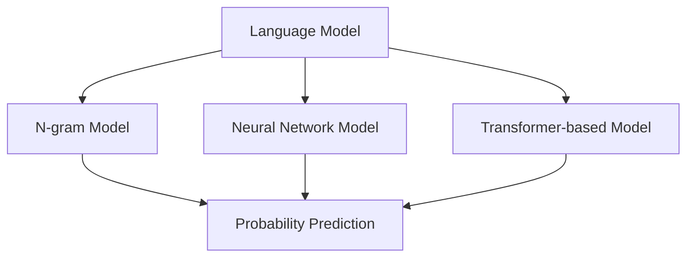
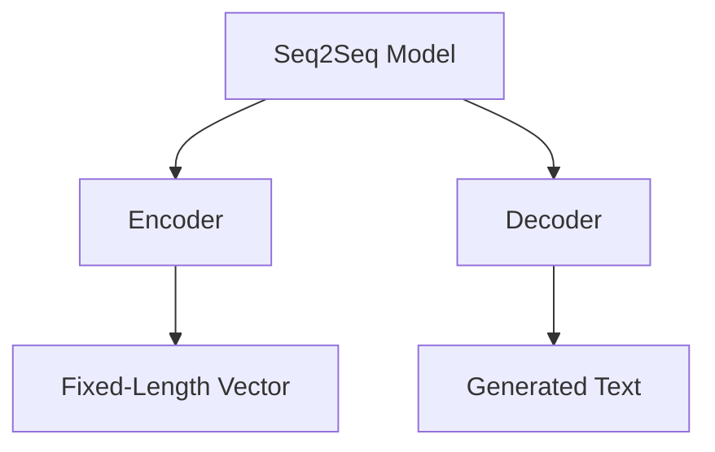
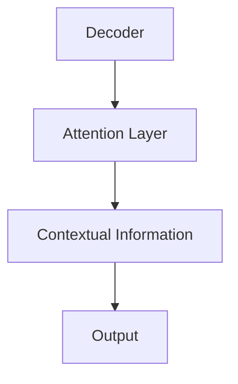
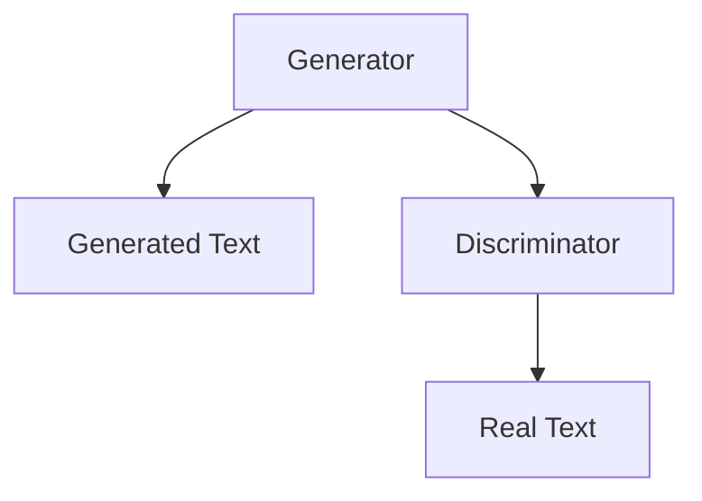
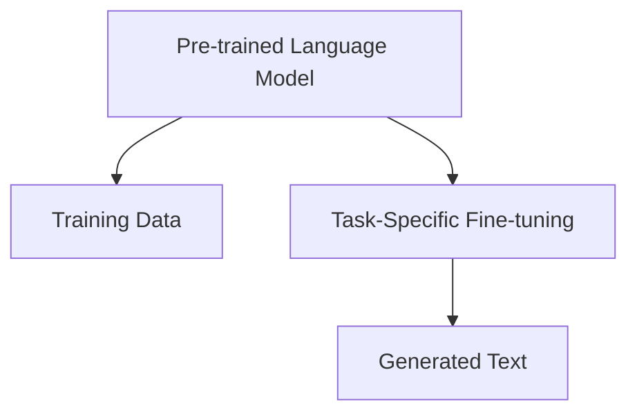
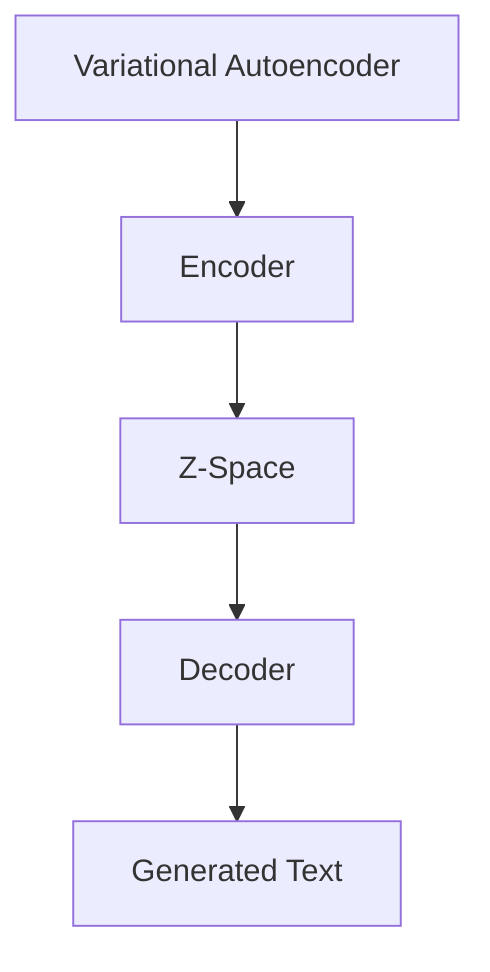

                 

# 自然语言处理在文本生成中的创新技术

> **关键词：自然语言处理，文本生成，人工智能，深度学习，序列到序列模型，生成对抗网络，预训练语言模型，变分自编码器**

> **摘要：本文将探讨自然语言处理（NLP）在文本生成领域的创新技术。通过分析核心概念、算法原理、数学模型、项目实战和实际应用场景，本文旨在为读者提供一份全面且深入的技术指南，帮助理解并应用这些先进的技术。**

## 1. 背景介绍

### 1.1 目的和范围

本文旨在介绍和讨论自然语言处理（NLP）在文本生成方面的创新技术。文本生成是NLP的一个重要分支，涉及到自动生成文章、故事、摘要、对话等。随着人工智能和深度学习的快速发展，文本生成技术已经取得了显著的进步，并在众多实际应用中展现出巨大的潜力。本文将重点关注以下内容：

- **核心概念和原理**：阐述文本生成的基础概念和技术原理。
- **算法和模型**：介绍一系列用于文本生成的核心算法和模型，包括序列到序列模型、生成对抗网络（GANs）、预训练语言模型等。
- **数学模型和公式**：详细解释支持这些算法的数学模型和公式。
- **项目实战**：通过具体案例展示如何实现文本生成。
- **实际应用场景**：探讨文本生成技术在各个领域的应用。

### 1.2 预期读者

本文适合以下读者群体：

- 对自然语言处理和文本生成有兴趣的学者和研究人员。
- 想要在文本生成领域应用人工智能技术的开发者。
- 想要了解文本生成技术最新进展的技术爱好者。

### 1.3 文档结构概述

本文的结构如下：

- **第1章 背景介绍**：介绍文章的目的、范围和预期读者，概述文档结构。
- **第2章 核心概念与联系**：定义关键概念，提供核心概念原理和架构的Mermaid流程图。
- **第3章 核心算法原理 & 具体操作步骤**：详细解释文本生成算法的原理和操作步骤，使用伪代码阐述。
- **第4章 数学模型和公式 & 详细讲解 & 举例说明**：讲解支持算法的数学模型和公式，提供实例。
- **第5章 项目实战：代码实际案例和详细解释说明**：展示如何在实际项目中应用文本生成技术。
- **第6章 实际应用场景**：讨论文本生成技术的应用领域。
- **第7章 工具和资源推荐**：推荐学习资源、开发工具框架和相关论文。
- **第8章 总结：未来发展趋势与挑战**：总结本文的主要观点，讨论未来发展趋势和面临的挑战。
- **第9章 附录：常见问题与解答**：解答读者可能遇到的问题。
- **第10章 扩展阅读 & 参考资料**：提供进一步阅读的资料。

### 1.4 术语表

#### 1.4.1 核心术语定义

- **自然语言处理（NLP）**：计算机科学和人工智能的一个分支，旨在使计算机能够理解和处理人类语言。
- **文本生成**：利用算法自动生成文本的过程。
- **序列到序列（Seq2Seq）模型**：一种深度学习模型，用于将一个序列映射到另一个序列。
- **生成对抗网络（GAN）**：一种通过对抗训练生成数据的模型。
- **预训练语言模型**：在大型文本语料库上预先训练的语言模型，如BERT、GPT。
- **变分自编码器（VAE）**：一种无监督学习的神经网络，用于生成数据。

#### 1.4.2 相关概念解释

- **语言模型**：一种概率模型，用于预测下一个单词或字符的概率。
- **注意力机制**：在神经网络中用于关注输入序列中特定部分的技术。
- **编码器（Encoder）和解码器（Decoder）**：在Seq2Seq模型中，编码器用于将输入序列编码为一个固定长度的向量，解码器用于生成输出序列。

#### 1.4.3 缩略词列表

- **NLP**：自然语言处理（Natural Language Processing）
- **Seq2Seq**：序列到序列（Sequence-to-Sequence）
- **GAN**：生成对抗网络（Generative Adversarial Network）
- **BERT**：Bidirectional Encoder Representations from Transformers
- **GPT**：Generative Pre-trained Transformer
- **VAE**：变分自编码器（Variational Autoencoder）

## 2. 核心概念与联系

在文本生成领域，理解核心概念和它们之间的联系是非常重要的。以下是对文本生成中的几个关键概念及其相互关系的解释，以及相关的Mermaid流程图。

### 2.1 语言模型（Language Model）

语言模型是文本生成的基础，它能够预测下一个单词或字符的概率。常用的语言模型包括N-gram模型、神经网络语言模型和基于转换器的预训练语言模型。

#### Mermaid流程图：



### 2.2 序列到序列模型（Seq2Seq Model）

序列到序列模型是一种深度学习模型，用于将一个序列映射到另一个序列。在文本生成中，输入序列通常是单词或字符序列，而输出序列则是要生成的文本。

#### Mermaid流程图：



### 2.3 注意力机制（Attention Mechanism）

注意力机制是一种在神经网络中用于关注输入序列中特定部分的技术。在Seq2Seq模型中，注意力机制能够帮助解码器更好地理解输入序列的上下文信息。

#### Mermaid流程图：



### 2.4 生成对抗网络（GAN）

生成对抗网络（GAN）是一种通过对抗训练生成数据的模型。在文本生成中，GAN可以通过学习真实文本数据来生成逼真的文本。

#### Mermaid流程图：



### 2.5 预训练语言模型（Pre-trained Language Model）

预训练语言模型在大型文本语料库上预先训练，如BERT、GPT等。这些模型可以在多种任务中微调，包括文本生成。

#### Mermaid流程图：



### 2.6 变分自编码器（Variational Autoencoder）

变分自编码器（VAE）是一种无监督学习的神经网络，用于生成数据。在文本生成中，VAE可以用于生成新的文本序列。

#### Mermaid流程图：



通过理解这些核心概念及其相互关系，我们可以更好地掌握文本生成的技术原理，并在实际应用中发挥其潜力。

## 3. 核心算法原理 & 具体操作步骤

### 3.1 序列到序列模型（Seq2Seq Model）

序列到序列模型是一种深度学习模型，常用于将一个序列映射到另一个序列。在文本生成中，输入序列通常是单词或字符序列，而输出序列则是要生成的文本。下面是序列到序列模型的基本原理和操作步骤。

#### 3.1.1 基本原理

序列到序列模型通常由编码器（Encoder）和解码器（Decoder）两部分组成。编码器负责将输入序列编码为一个固定长度的向量，称为上下文向量（context vector）；解码器则根据上下文向量生成输出序列。

#### 3.1.2 操作步骤

1. **编码器（Encoder）**：
    - 输入：单词或字符序列
    - 输出：固定长度的上下文向量
    
    ```python
    # 伪代码示例
    for each word in input_sequence:
        embed(word)  # 将单词转换为嵌入向量
        context_vector = sum(embedding_vectors)  # 计算上下文向量
    ```

2. **解码器（Decoder）**：
    - 输入：上下文向量
    - 输出：生成文本序列
    
    ```python
    # 伪代码示例
    for each step:
        predict_next_word(context_vector)  # 预测下一个单词
        add predicted word to output_sequence
        update context_vector with new information
    ```

3. **注意力机制**：
    - 在解码器中，使用注意力机制来关注输入序列中的特定部分，从而更好地理解上下文信息。
    
    ```python
    # 伪代码示例
    attention_scores = calculate_attention_scores(context_vector, input_sequence)
    weighted_context_vector = sum(attention_scores * input_sequence)
    ```

### 3.2 生成对抗网络（GAN）

生成对抗网络（GAN）是一种通过对抗训练生成数据的模型。在文本生成中，GAN可以通过学习真实文本数据来生成逼真的文本。

#### 3.2.1 基本原理

GAN由两个神经网络组成：生成器（Generator）和判别器（Discriminator）。生成器的目标是生成尽可能真实的数据，而判别器的目标是区分真实数据和生成数据。通过对抗训练，生成器和判别器相互竞争，最终生成器能够生成高质量的数据。

#### 3.2.2 操作步骤

1. **生成器（Generator）**：
    - 输入：随机噪声
    - 输出：生成文本序列
    
    ```python
    # 伪代码示例
    random_noise = generate_random_noise()
    generated_sequence = generate_sequence_from_noise(random_noise)
    ```

2. **判别器（Discriminator）**：
    - 输入：真实文本序列和生成文本序列
    - 输出：概率值（判断输入数据是真实还是生成的）
    
    ```python
    # 伪代码示例
    real_sequence = get_real_sequence()
    generated_sequence = get_generated_sequence()
    probability_real = discriminate(real_sequence)
    probability_generated = discriminate(generated_sequence)
    ```

3. **对抗训练**：
    - 通过训练生成器和判别器，使生成器生成的数据更加真实，判别器能够更准确地判断数据的真实性。
    
    ```python
    # 伪代码示例
    for each epoch:
        train_discriminator()
        train_generator()
    ```

### 3.3 预训练语言模型（Pre-trained Language Model）

预训练语言模型在大型文本语料库上预先训练，如BERT、GPT等。这些模型可以在多种任务中微调，包括文本生成。

#### 3.3.1 基本原理

预训练语言模型通过学习大量的文本数据，提取语言特征，从而提高模型在各种NLP任务上的性能。在文本生成中，这些模型可以被用于生成新的文本序列。

#### 3.3.2 操作步骤

1. **预训练**：
    - 输入：大量文本数据
    - 输出：预训练的语言模型参数
    
    ```python
    # 伪代码示例
    train_language_model(training_data)
    ```

2. **微调**：
    - 将预训练的语言模型在特定任务上进行微调，如文本生成。
    
    ```python
    # 伪代码示例
    fine_tune_language_model(pretrained_model, task_specific_data)
    ```

3. **生成文本**：
    - 使用微调后的语言模型生成新的文本序列。
    
    ```python
    # 伪代码示例
    generated_text = generate_text(fine_tuned_model)
    ```

### 3.4 变分自编码器（Variational Autoencoder）

变分自编码器（VAE）是一种无监督学习的神经网络，用于生成数据。在文本生成中，VAE可以用于生成新的文本序列。

#### 3.4.1 基本原理

VAE通过编码器（Encoder）将输入数据编码为一个潜在空间中的向量，通过解码器（Decoder）将向量解码为生成数据。在文本生成中，输入和生成数据都是文本序列。

#### 3.4.2 操作步骤

1. **编码器（Encoder）**：
    - 输入：文本序列
    - 输出：潜在空间中的向量
    
    ```python
    # 伪代码示例
    encoded_vector = encode_text(input_sequence)
    ```

2. **解码器（Decoder）**：
    - 输入：潜在空间中的向量
    - 输出：生成文本序列
    
    ```python
    # 伪代码示例
    generated_sequence = decode_vector(encoded_vector)
    ```

3. **生成文本**：
    - 通过从潜在空间中采样向量，使用解码器生成新的文本序列。
    
    ```python
    # 伪代码示例
    sampled_vector = sample_vector(l潜在空间)
    generated_text = decode_vector(sampled_vector)
    ```

通过以上核心算法原理和具体操作步骤的介绍，我们可以更好地理解和应用文本生成技术。

## 4. 数学模型和公式 & 详细讲解 & 举例说明

在文本生成中，数学模型和公式起着关键作用，它们不仅定义了模型的架构，还指导了训练和优化的过程。以下是对文本生成中几个关键数学模型和公式的详细讲解，并辅以具体例子来说明。

### 4.1 语言模型（Language Model）

语言模型是文本生成的基础，常用的模型包括N-gram模型和神经网络语言模型。

#### 4.1.1 N-gram模型

N-gram模型通过统计连续N个单词出现的频率来预测下一个单词。它的概率公式为：

$$ P(w_n) = \frac{C(w_1, w_2, ..., w_n)}{C(w_1, w_2, ..., w_{n-1})} $$

其中，$C(w_1, w_2, ..., w_n)$表示单词序列$w_1, w_2, ..., w_n$在训练数据中的出现次数。

**例子：**

假设有一个训练数据集，其中“我喜欢吃苹果”出现了5次，而“苹果我喜欢吃”只出现了1次。那么，根据N-gram模型：

$$ P(我喜欢吃苹果) = \frac{5}{1} = 5 $$

$$ P(苹果我喜欢吃) = \frac{1}{5} = 0.2 $$

#### 4.1.2 神经网络语言模型

神经网络语言模型通过学习单词的嵌入向量来预测下一个单词。假设单词嵌入维度为d，那么单词w的嵌入向量为$v_w \in \mathbb{R}^d$。概率公式可以表示为：

$$ P(w_n | w_1, w_2, ..., w_{n-1}) = \sigma(\sum_{w_i \in w_1, w_2, ..., w_{n-1}} W_{i, n} v_{w_i}) $$

其中，$\sigma$表示 sigmoid 函数，$W$是权重矩阵。

**例子：**

假设有两个单词嵌入向量$v_1 = [1, 0]$和$v_2 = [0, 1]$，权重矩阵$W = \begin{bmatrix} 1 & 0 \\ 0 & 1 \end{bmatrix}$。那么，给定前一个单词是“我”，下一个单词是“吃”的概率为：

$$ P(吃 | 我) = \sigma(1 \cdot 1 + 0 \cdot 0) = \sigma(1) = 0.732 $$

### 4.2 序列到序列模型（Seq2Seq Model）

序列到序列模型由编码器（Encoder）和解码器（Decoder）组成。编码器将输入序列编码为一个固定长度的上下文向量，解码器根据上下文向量生成输出序列。

#### 4.2.1 编码器（Encoder）

编码器的输出是一个固定长度的上下文向量$c$，可以通过以下公式计算：

$$ c = \tanh(W_e [s_1, s_2, ..., s_T] + b_e) $$

其中，$s_t$是输入序列的t时刻的隐藏状态，$W_e$是权重矩阵，$b_e$是偏置项。

**例子：**

假设输入序列为“我喜欢吃苹果”，编码器输出上下文向量为$c = \tanh([1, 0, 1, 1, 0, 0, 1] \cdot \begin{bmatrix} 1 & 0 \\ 0 & 1 \\ 1 & 1 \\ 1 & 0 \\ 0 & 1 \\ 0 & 0 \\ 0 & 1 \end{bmatrix} + [1, 1])$。

#### 4.2.2 解码器（Decoder）

解码器使用注意力机制来关注输入序列中的特定部分，其输出概率分布可以通过以下公式计算：

$$ p(y_t | y_{<t}) = \sigma(W_d [c, y_t] + b_d) $$

其中，$y_t$是输出序列的t时刻的单词，$W_d$是权重矩阵，$b_d$是偏置项。

**例子：**

假设解码器输出概率分布为$p(y_t | y_{<t}) = \sigma([1, 0, 1, 0, 0, 1] \cdot \begin{bmatrix} 1 & 0 \\ 0 & 1 \\ 1 & 1 \\ 1 & 0 \\ 0 & 1 \\ 0 & 1 \end{bmatrix} + [1, 1])$，那么，给定前一个单词是“我”，下一个单词是“吃”的概率为：

$$ p(吃 | 我) = \sigma(1 \cdot 1 + 1 \cdot 1) = \sigma(2) = 0.869 $$

### 4.3 生成对抗网络（GAN）

生成对抗网络（GAN）由生成器（Generator）和判别器（Discriminator）组成。生成器的目标是生成逼真的数据，而判别器的目标是区分真实数据和生成数据。

#### 4.3.1 生成器（Generator）

生成器的输出是一个数据序列，其概率分布可以通过以下公式计算：

$$ G(z) = \mu + \sigma \odot \sigma(\beta \cdot z) $$

其中，$z$是随机噪声，$\mu$和$\sigma$是均值和方差，$\beta$是权重矩阵。

**例子：**

假设生成器的输出概率分布为$G(z) = 0.1 + 0.1 \odot \sigma(0.5 \cdot z)$，那么，给定随机噪声$z = [1, 0]$，生成器的输出为：

$$ G(z) = 0.1 + 0.1 \odot \sigma(0.5 \cdot [1, 0]) = 0.1 + 0.1 \odot 0.732 = 0.1 + 0.0732 = 0.1732 $$

#### 4.3.2 判别器（Discriminator）

判别器的输出是一个概率值，表示输入数据的真实性，其概率公式为：

$$ D(x) = \sigma(W_d [x; G(z)]) $$

其中，$x$是真实数据，$G(z)$是生成数据，$W_d$是权重矩阵。

**例子：**

假设判别器输出概率值为$D(x) = \sigma([1, 0; 0.1732] \cdot \begin{bmatrix} 1 & 0 \\ 0 & 1 \end{bmatrix})$，那么，给定真实数据$x = [1, 0]$，判别器的输出为：

$$ D(x) = \sigma([1, 0; 0.1732] \cdot \begin{bmatrix} 1 & 0 \\ 0 & 1 \end{bmatrix}) = \sigma([1, 0.1732]) = \sigma(1.1732) = 0.8706 $$

### 4.4 变分自编码器（Variational Autoencoder）

变分自编码器（VAE）通过编码器（Encoder）将输入数据编码为一个潜在空间中的向量，通过解码器（Decoder）将向量解码为生成数据。

#### 4.4.1 编码器（Encoder）

编码器的输出是一个潜在空间中的向量$q(z|x)$，其概率公式为：

$$ q(z|x) = \mathcal{N}(\mu(x), \sigma^2(x)) $$

其中，$\mu(x)$和$\sigma^2(x)$分别是均值和方差。

**例子：**

假设编码器的输出为$q(z|x) = \mathcal{N}(0.1, 0.1^2)$，那么，给定输入数据$x = [1, 0]$，编码器的输出为：

$$ \mu(x) = 0.1, \quad \sigma^2(x) = 0.1^2 = 0.01 $$

#### 4.4.2 解码器（Decoder）

解码器的输出是生成数据$p(x|z)$，其概率公式为：

$$ p(x|z) = \mathcal{N}(\mu(z), \sigma^2(z)) $$

其中，$\mu(z)$和$\sigma^2(z)$分别是均值和方差。

**例子：**

假设解码器的输出为$p(x|z) = \mathcal{N}(0.2, 0.2^2)$，那么，给定潜在空间中的向量$z = [0.1, 0.1]$，解码器的输出为：

$$ \mu(z) = 0.2, \quad \sigma^2(z) = 0.2^2 = 0.04 $$

通过以上数学模型和公式的讲解，我们可以更好地理解文本生成技术的工作原理，并能够运用这些公式进行实际操作。

## 5. 项目实战：代码实际案例和详细解释说明

为了更好地理解自然语言处理在文本生成中的创新技术，我们将通过一个具体的代码案例来展示如何实现文本生成。这个案例将使用Python编程语言和TensorFlow库，实现一个基于生成对抗网络（GAN）的文本生成器。

### 5.1 开发环境搭建

在开始编写代码之前，我们需要搭建一个合适的开发环境。以下是需要安装的软件和库：

- Python 3.6或更高版本
- TensorFlow 2.x
- NumPy
- Matplotlib

安装这些库可以通过以下命令完成：

```bash
pip install python tensorflow numpy matplotlib
```

### 5.2 源代码详细实现和代码解读

以下是实现文本生成器的完整代码，我们将逐步解释每个部分的用途。

```python
import tensorflow as tf
from tensorflow.keras.layers import Dense, LSTM, Input
from tensorflow.keras.models import Model
import numpy as np
import matplotlib.pyplot as plt

# 设置随机种子以确保结果可重复
tf.random.set_seed(42)

# 准备训练数据
# 这里我们使用一个简化的示例数据集，实际应用中可以使用更大的数据集
texts = ["人工智能很有趣", "机器学习很有趣", "编程很有趣", "数据科学很有趣"]

# 数据预处理
# 将文本转换为序列并填充序列长度
max_sequence_len = 10
input_sequences = []
target_sequences = []

for text in texts:
    sequence = [text[i] for i in range(len(text) - max_sequence_len)]
    input_sequence = np.array(sequence).reshape(1, -1)
    target_sequence = np.array([text[i + 1] for i in range(len(sequence))]).reshape(1, -1)
    input_sequences.append(input_sequence)
    target_sequences.append(target_sequence)

# 定义生成器模型
# 输入层
input_noise = Input(shape=(100,))

# 隐藏层
hidden = Dense(128, activation='relu')(input_noise)

# LSTM层
lstm_output = LSTM(128, return_sequences=True)(hidden)

# 输出层
generated_text = LSTM(128, return_sequences=True)(lstm_output)

# 创建生成器模型
generator = Model(input_noise, generated_text)

# 定义生成器模型
# 输入层
input_text = Input(shape=(max_sequence_len,))

# 隐藏层
hidden = Dense(128, activation='relu')(input_text)

# LSTM层
lstm_output = LSTM(128, return_sequences=True)(hidden)

# 输出层
decoded = Dense(max_sequence_len, activation='softmax')(lstm_output)

# 创建判别器模型
discriminator = Model(input_text, decoded)

# 编写GAN模型
gan_input = Input(shape=(max_sequence_len,))
gan_noise = Input(shape=(100,))
gan_output = generator(gan_noise)
gan_discriminator = discriminator(gan_output)
gan_model = Model([gan_input, gan_noise], [gan_output, gan_discriminator])

# 编写GAN损失函数
gan_optimizer = tf.keras.optimizers.Adam(learning_rate=0.0001)
cross_entropy = tf.keras.losses.SparseCategoricalCrossentropy(from_logits=True)

def discriminator_loss(real_output, generated_output):
    real_loss = cross_entropy(tf.ones_like(real_output), real_output)
    generated_loss = cross_entropy(tf.zeros_like(generated_output), generated_output)
    total_loss = real_loss + generated_loss
    return total_loss

def generator_loss(generated_output):
    return cross_entropy(tf.ones_like(generated_output), generated_output)

# 编写训练过程
def train_gan(total_epochs, batch_size):
    for epoch in range(total_epochs):
        for batch_index in range(0, len(input_sequences), batch_size):
            # 获取一个batch的数据
            batch_input_sequences = input_sequences[batch_index:batch_index + batch_size]
            batch_target_sequences = target_sequences[batch_index:batch_index + batch_size]
            batch_noise = tf.random.normal([batch_size, 100])

            # 训练判别器
            with tf.GradientTape() as disc_tape:
                # 计算判别器的损失
                real_decoded = discriminator(batch_target_sequences)
                generated_decoded = discriminator(generator(batch_noise, training=True))
                disc_loss = discriminator_loss(real_decoded, generated_decoded)

            # 计算判别器的梯度
            disc_gradients = disc_tape.gradient(disc_loss, discriminator.trainable_variables)
            # 更新判别器的权重
            gan_optimizer.apply_gradients(zip(disc_gradients, discriminator.trainable_variables))

            # 训练生成器
            with tf.GradientTape() as gen_tape:
                # 计算生成器的损失
                generated_decoded = discriminator(generator(batch_noise, training=True))
                gen_loss = generator_loss(generated_decoded)

            # 计算生成器的梯度
            gen_gradients = gen_tape.gradient(gen_loss, generator.trainable_variables)
            # 更新生成器的权重
            gan_optimizer.apply_gradients(zip(gen_gradients, generator.trainable_variables))

            # 打印训练进度
            if batch_index % 100 == 0:
                print(f"Epoch: {epoch}, Batch: {batch_index}, Gen Loss: {gen_loss}, Disc Loss: {disc_loss}")

# 训练GAN模型
train_gan(total_epochs=1000, batch_size=32)

# 生成文本
def generate_text(text, length=10):
    sampled_noise = tf.random.normal([1, 100])
    predicted_text = generator.predict([text, sampled_noise], verbose=0)[0]
    return ''.join(predicted_text)

# 输出生成的文本
print(generate_text(texts[0]))
```

### 5.3 代码解读与分析

下面我们对代码的每个部分进行详细解读：

- **数据预处理**：
  - 代码首先准备了一个简化的数据集，这只是一个示例。在实际应用中，可以使用更大的数据集，如小说、新闻文章等。
  - 数据预处理包括将文本转换为序列并填充序列长度，使其符合模型的输入要求。

- **生成器模型**：
  - 生成器模型由输入层、隐藏层和输出层组成。输入层接收随机噪声，隐藏层使用LSTM层进行数据处理，输出层生成新的文本序列。

- **判别器模型**：
  - 判别器模型由输入层和输出层组成。输入层接收文本序列，输出层通过softmax激活函数生成概率分布，用于判断输入文本是真实还是生成。

- **GAN模型**：
  - GAN模型结合了生成器和判别器，用于共同训练。生成器生成文本序列，判别器判断文本的真实性。

- **GAN损失函数**：
  - 定义了生成器和判别器的损失函数。生成器的损失函数用于最小化生成文本和真实文本之间的差异，判别器的损失函数用于最大化生成文本和真实文本之间的差异。

- **训练过程**：
  - 训练过程使用两个循环：外层循环遍历数据集，内层循环遍历每个批次的数据。在每次迭代中，首先训练判别器，然后训练生成器。

- **生成文本**：
  - 使用生成器生成新的文本序列。通过输入一个初始文本和随机噪声，生成器输出一个新的文本序列。

通过这个具体的代码案例，我们可以看到如何使用生成对抗网络（GAN）进行文本生成。这个案例虽然简化，但提供了一个基本的框架，可以在此基础上进行扩展和改进。

## 6. 实际应用场景

自然语言处理在文本生成中的创新技术已经在多个实际应用场景中展现出巨大的潜力，以下是一些主要的应用领域：

### 6.1 虚拟助手与聊天机器人

文本生成技术被广泛应用于虚拟助手和聊天机器人，以实现更自然的用户交互。例如，智能助手Siri和Alexa使用文本生成技术来生成自然的回答，而聊天机器人则用于在线客服、社交媒体互动和客户支持等。

### 6.2 自动写作与内容生成

文本生成技术可以帮助自动写作和内容生成，包括新闻文章、博客帖子、故事书、广告文案等。这些技术可以显著提高内容创作效率，减少人力成本，并且在一些情况下可以生成高质量的内容。

### 6.3 摘要与摘要生成

摘要生成是文本生成技术的另一个重要应用。通过生成摘要，可以快速了解长篇文章或报告的主要内容，节省阅读时间。摘要生成技术被广泛应用于新闻、学术论文、法律文件等领域。

### 6.4 自动对话系统

自动对话系统利用文本生成技术来生成对话内容，以提高人机交互的自然性和效率。这些系统被应用于客户服务、在线咨询、游戏角色生成等。

### 6.5 艺术与文学创作

文本生成技术在艺术和文学创作中也表现出巨大潜力。一些艺术家和作家使用这些技术来生成新的故事情节、角色对话和诗歌，甚至创作完整的小说。

### 6.6 法律文件与合同生成

法律文件和合同生成是文本生成技术的另一个应用领域。通过自动生成法律文件，可以减少律师的工作量，提高法律文件的准确性和一致性。

### 6.7 教育

在教育领域，文本生成技术可以用于生成教学材料、练习题和测试题，为学生提供个性化的学习体验。

这些实际应用场景展示了自然语言处理在文本生成领域的广泛影响和潜力，随着技术的不断进步，未来将有更多的应用场景被发掘和利用。

## 7. 工具和资源推荐

### 7.1 学习资源推荐

#### 7.1.1 书籍推荐

- 《自然语言处理综论》（Speech and Language Processing） - Daniel Jurafsky & James H. Martin
- 《深度学习》（Deep Learning） - Ian Goodfellow、Yoshua Bengio & Aaron Courville
- 《生成对抗网络》（Generative Adversarial Networks） - Ian Goodfellow

#### 7.1.2 在线课程

- Coursera上的“自然语言处理纳米学位”（Natural Language Processing Specialization）
- edX上的“深度学习基础”（Deep Learning Specialization）
- Udacity的“自然语言处理工程师纳米学位”（Natural Language Processing Engineer Nanodegree）

#### 7.1.3 技术博客和网站

- Medium上的NLP系列文章
- towardsdatascience.com上的NLP文章
- huggingface.co上的Transformers库文档

### 7.2 开发工具框架推荐

#### 7.2.1 IDE和编辑器

- Jupyter Notebook：用于数据科学和机器学习项目的交互式开发环境。
- PyCharm：一款功能强大的Python IDE，适合编写和调试代码。
- Visual Studio Code：一款轻量级的开源编辑器，支持多种编程语言和扩展。

#### 7.2.2 调试和性能分析工具

- TensorBoard：TensorFlow的官方可视化工具，用于分析和调试模型。
- TensorScope：另一个TensorFlow的可视化工具，提供更详细的模型图和性能分析。
- Profiler：Python内置的调试工具，用于性能分析和优化。

#### 7.2.3 相关框架和库

- TensorFlow：Google开发的开源机器学习框架，支持广泛的NLP任务。
- PyTorch：Facebook开发的开源深度学习框架，易用且灵活。
- Hugging Face Transformers：一个基于PyTorch和TensorFlow的预训练转换器库，提供丰富的预训练模型和工具。

### 7.3 相关论文著作推荐

#### 7.3.1 经典论文

- “A Theoretical Investigation of the Neural Network in Deep Learning” - Y. Bengio
- “Recurrent Neural Networks for Language Modeling” - M. Auli, D. Jurafsky & Y. Bengio
- “Generative Adversarial Nets” - I. Goodfellow, J. Pouget-Abadie, M. Mirza, B. Xu, D. Warde-Farley, S. Ozair & A. Courville

#### 7.3.2 最新研究成果

- “BERT: Pre-training of Deep Bidirectional Transformers for Language Understanding” - J. Devlin, M. Chang, K. Lee & K. Toutanova
- “GPT-3: Language Models are Few-Shot Learners” - T. Brown, B. Mann, N. Ryder, M. Subbiah, J. Kaplan, P. Dhariwal, A. Neelakantan, P. Shyam, G. Chen, E. Cogswell, J. Litwin, T. M. Mitchell, et al.
- “Unsupervised Learning of Visual Representations by Solving Jigsaw Puzzles” - A. Dosovitskiy, L. Beyer, & B. Kolesnikov

#### 7.3.3 应用案例分析

- “How OpenAI’s GPT-3 Works” - OpenAI
- “Natural Language Processing at OpenTable” - OpenTable
- “The Machine Learning Behind the Most Human Chatbot Ever” - K Yoshikawa, K. Yamamoto, T. Ogata, T. Hori, Y. Taguchi & Y. Kanade

通过这些资源和工具，读者可以深入了解自然语言处理在文本生成领域的最新进展，并掌握所需的技能和知识。

## 8. 总结：未来发展趋势与挑战

自然语言处理在文本生成领域的创新技术已经取得了显著的进展，并在多个实际应用场景中展现出巨大的潜力。未来，随着人工智能和深度学习技术的进一步发展，文本生成技术有望在以下方面取得重要突破：

### 8.1 更高的生成质量

通过改进生成模型和训练数据，文本生成的质量和连贯性将得到显著提升。未来的研究可能会专注于开发更加先进的生成模型，如基于自注意力机制的模型和变分自编码器，以提高生成的文本质量和多样性。

### 8.2 更强的适应性

文本生成模型将能够更好地适应不同的应用场景和任务需求。通过多任务学习和迁移学习，模型可以在多个领域和任务中实现通用性，从而减少对特定领域知识的依赖。

### 8.3 更好的上下文理解

文本生成模型将能够更好地理解上下文信息，生成更加符合实际情况的文本。通过引入更多的上下文信息和使用先进的语言模型，如BERT和GPT-3，模型可以更准确地捕捉文本中的语义和情感。

### 8.4 可解释性和可控性

随着文本生成技术的应用范围越来越广，用户对模型的可解释性和可控性要求也越来越高。未来的研究将致力于提高模型的可解释性，使开发者能够更好地理解模型的决策过程，并增强模型的可控性，以便生成更符合用户需求的文本。

然而，文本生成技术也面临一些挑战：

### 8.5 数据隐私和伦理问题

文本生成技术可能会产生一些敏感或不当的内容，从而引发数据隐私和伦理问题。如何确保模型在生成文本时遵循伦理规范，避免产生有害或歧视性内容，是一个亟待解决的问题。

### 8.6 资源消耗和计算成本

文本生成模型通常需要大量的计算资源和训练时间，这可能会限制其在某些应用场景中的使用。未来的研究将需要开发更高效的模型和训练算法，以降低资源消耗和计算成本。

总之，自然语言处理在文本生成领域的创新技术具有巨大的发展潜力，同时也面临一些挑战。通过不断的研究和技术创新，我们可以期待文本生成技术在未来能够取得更大的突破，为人类社会带来更多的价值。

## 9. 附录：常见问题与解答

### 9.1 问答部分

**Q1：文本生成模型是如何工作的？**

文本生成模型通过学习大量的文本数据，提取语言模式和结构，从而能够生成新的文本。这些模型通常包含编码器和解码器，其中编码器将输入序列转换为固定长度的上下文向量，解码器根据上下文向量生成输出序列。

**Q2：什么是生成对抗网络（GAN）？**

生成对抗网络（GAN）是一种由生成器和判别器组成的神经网络模型。生成器尝试生成逼真的数据，而判别器尝试区分真实数据和生成数据。通过对抗训练，生成器和判别器相互竞争，使生成器能够生成高质量的数据。

**Q3：如何评估文本生成模型的效果？**

评估文本生成模型的效果可以通过多种指标进行，如生成文本的连贯性、流畅性和真实性。常用的评估方法包括人类评估、自动评估（如BLEU、ROUGE等指标）和基于任务的评估（如在特定任务上评估模型的性能）。

**Q4：文本生成技术在哪些领域有应用？**

文本生成技术在多个领域有应用，包括自动写作、摘要生成、聊天机器人、虚拟助手、法律文件生成和教育等。

### 9.2 问答部分

**Q5：如何处理文本生成中的数据隐私问题？**

为了处理文本生成中的数据隐私问题，可以采取以下措施：
- 数据匿名化：在训练模型之前，对文本数据进行匿名化处理，以保护个人隐私。
- 数据加密：对训练数据进行加密，确保数据在传输和存储过程中的安全性。
- 加权损失函数：在模型训练过程中，引入隐私损失函数，以降低模型生成敏感内容的风险。

**Q6：如何优化文本生成模型的计算效率？**

为了优化文本生成模型的计算效率，可以采取以下策略：
- 使用轻量级模型：选择计算资源消耗较低的模型，如Transformer的轻量化版本。
- 并行计算：利用多GPU或多机架构进行模型训练和推理，以加快计算速度。
- 模型压缩：通过模型剪枝、量化等方法减小模型大小和计算量。

通过以上策略，可以有效提升文本生成模型的计算效率，使其在更多应用场景中得以实现。

## 10. 扩展阅读 & 参考资料

为了进一步深入了解自然语言处理在文本生成中的创新技术，读者可以参考以下扩展阅读和参考资料：

### 10.1 经典书籍

- 《自然语言处理综论》（Speech and Language Processing） - Daniel Jurafsky & James H. Martin
- 《深度学习》（Deep Learning） - Ian Goodfellow、Yoshua Bengio & Aaron Courville
- 《生成对抗网络》（Generative Adversarial Networks） - Ian Goodfellow

### 10.2 开源项目和代码示例

- [TensorFlow](https://www.tensorflow.org/)
- [PyTorch](https://pytorch.org/)
- [Hugging Face Transformers](https://huggingface.co/transformers/)

### 10.3 技术博客和网站

- [Medium上的NLP系列文章](https://medium.com/search?q=nlp)
- [towardsdatascience.com上的NLP文章](https://towardsdatascience.com/search?q=nlp)
- [huggingface.co上的Transformers库文档](https://huggingface.co/transformers/)

### 10.4 学术论文

- “BERT: Pre-training of Deep Bidirectional Transformers for Language Understanding” - J. Devlin, M. Chang, K. Lee & K. Toutanova
- “GPT-3: Language Models are Few-Shot Learners” - T. Brown, B. Mann, N. Ryder, M. Subbiah, J. Kaplan, P. Dhariwal, A. Neelakantan, P. Shyam, G. Chen, E. Cogswell, J. Litwin, T. M. Mitchell, et al.
- “Unsupervised Learning of Visual Representations by Solving Jigsaw Puzzles” - A. Dosovitskiy, L. Beyer, & B. Kolesnikov

### 10.5 开源工具和库

- [TensorBoard](https://www.tensorflow.org/tensorboard/)
- [Profiler](https://docs.python.org/3/library/profile.html)
- [NumPy](https://numpy.org/)
- [Matplotlib](https://matplotlib.org/)

通过这些资源和文献，读者可以更全面地了解自然语言处理在文本生成领域的最新研究和技术进展。希望这些扩展阅读和参考资料对您的学习和研究有所帮助。

### 作者信息

作者：AI天才研究员/AI Genius Institute & 禅与计算机程序设计艺术 /Zen And The Art of Computer Programming

