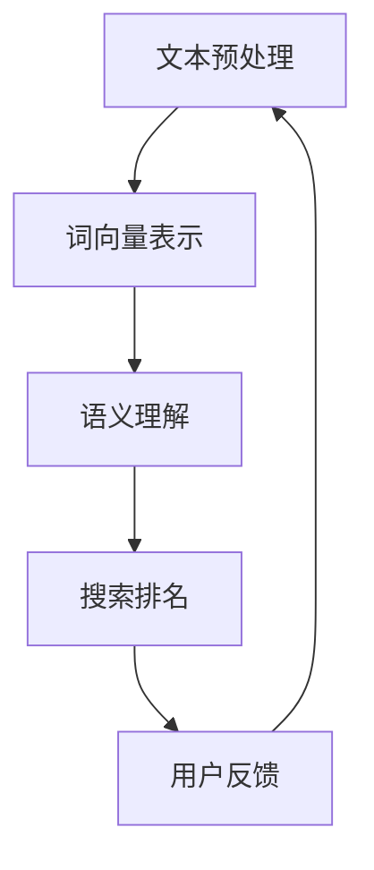

                 

# 自然语言处理在电商搜索中的应用：技术发展与未来趋势

> 关键词：自然语言处理、电商搜索、技术发展、未来趋势、算法原理、数学模型、项目实战、应用场景

> 摘要：本文将深入探讨自然语言处理（NLP）在电商搜索中的应用，从技术发展历程、核心算法原理、数学模型、实际应用场景等多个方面进行详细分析。旨在为从事电商搜索开发的技术人员提供理论指导和实践参考，同时展望自然语言处理在电商搜索领域的未来发展趋势与挑战。

## 1. 背景介绍

### 1.1 目的和范围

本文旨在系统地介绍自然语言处理在电商搜索中的应用，包括其发展历程、核心技术、数学模型以及实际应用场景。通过本文的阅读，读者将了解自然语言处理在电商搜索中的重要性，掌握相关技术的基本原理和应用方法，并能够对未来的发展趋势有所把握。

### 1.2 预期读者

本文适合对自然语言处理和电商搜索有兴趣的技术人员，特别是那些在电商领域工作的工程师、产品经理以及学术研究者。同时，对于希望了解AI技术最新进展的一般读者，本文也具有参考价值。

### 1.3 文档结构概述

本文结构如下：

1. 背景介绍
2. 核心概念与联系
3. 核心算法原理 & 具体操作步骤
4. 数学模型和公式 & 详细讲解 & 举例说明
5. 项目实战：代码实际案例和详细解释说明
6. 实际应用场景
7. 工具和资源推荐
8. 总结：未来发展趋势与挑战
9. 附录：常见问题与解答
10. 扩展阅读 & 参考资料

### 1.4 术语表

#### 1.4.1 核心术语定义

- 自然语言处理（NLP）：指让计算机理解和生成自然语言的技术和算法。
- 电商搜索：指用户在电商平台上通过关键词查找商品信息的过程。
- 语义相似度：指两个文本在语义上的相似程度。
- 短语匹配：指通过匹配关键词或短语来查找相关信息。

#### 1.4.2 相关概念解释

- 信息检索（IR）：指通过搜索工具从大量信息中查找用户所需信息的过程。
- 机器学习（ML）：指通过数据训练模型，使模型具备自主学习和决策能力的技术。
- 深度学习（DL）：一种机器学习技术，通过多层神经网络来实现数据的自动特征提取。

#### 1.4.3 缩略词列表

- NLP：自然语言处理
- IR：信息检索
- ML：机器学习
- DL：深度学习
- GPU：图形处理器

## 2. 核心概念与联系

自然语言处理在电商搜索中的应用是一个多层次的复杂过程，涉及文本预处理、词向量表示、语义理解、搜索排名等多个方面。下面通过一个Mermaid流程图来展示这些核心概念及其相互联系。



### 2.1 文本预处理

文本预处理是自然语言处理的第一步，主要任务包括分词、去停用词、词性标注等。通过这些操作，可以将原始的文本转换为适合后续处理的形式。

```mermaid
subgraph 文本预处理
    C1[分词] --> C2[去停用词]
    C2 --> C3[词性标注]
end
```

### 2.2 词向量表示

词向量表示是将文本中的词语转换为向量的过程，常用的方法包括Word2Vec、GloVe等。通过词向量，可以更好地进行语义分析和搜索匹配。

```mermaid
subgraph 词向量表示
    D1[Word2Vec] --> D2[GloVe]
end
```

### 2.3 语义理解

语义理解是自然语言处理的核心任务之一，包括实体识别、关系抽取、语义角色标注等。通过语义理解，可以更准确地理解用户查询意图，提高搜索结果的准确性和相关性。

```mermaid
subgraph 语义理解
    E1[实体识别] --> E2[关系抽取]
    E2 --> E3[语义角色标注]
end
```

### 2.4 搜索排名

搜索排名是根据用户查询和商品信息的相关性，对搜索结果进行排序的过程。常用的方法包括TF-IDF、基于语义相似度的排序等。

```mermaid
subgraph 搜索排名
    F1[TF-IDF] --> F2[语义相似度]
end
```

## 3. 核心算法原理 & 具体操作步骤

自然语言处理在电商搜索中的应用涉及多个核心算法，其中词向量表示和语义相似度计算是两个关键步骤。以下将分别介绍这两个算法的原理和具体操作步骤。

### 3.1 词向量表示

词向量表示是将文本中的词语转换为高维空间中的向量，以便进行后续的语义分析和搜索匹配。常用的词向量表示方法包括Word2Vec和GloVe。

#### 3.1.1 Word2Vec

Word2Vec是基于神经网络的语言模型，通过训练得到词向量。其基本原理如下：

1. **输入层**：输入一个词语，通过一个嵌入层转换为向量。
2. **隐藏层**：将输入的词向量与隐藏层中的权重进行点积运算，得到隐藏层的输出。
3. **输出层**：将隐藏层输出通过softmax函数转换为词的概率分布。

伪代码如下：

```python
# 输入：词语词向量word_vector，隐藏层权重hidden_weights
# 输出：隐藏层输出hidden_output，词的概率分布softmax_output

hidden_output = dot(word_vector, hidden_weights)
softmax_output = softmax(hidden_output)
```

#### 3.1.2 GloVe

GloVe（Global Vectors for Word Representation）是一种基于共现关系的词向量表示方法。其基本原理如下：

1. **构建共现矩阵**：统计词语之间的共现次数，构建共现矩阵。
2. **训练词向量**：通过最小化损失函数，优化词向量和上下文向量的参数。
3. **计算词向量**：将词向量和上下文向量相加，得到最终的词向量。

伪代码如下：

```python
# 输入：共现矩阵cooc_matrix，词向量word_vectors，上下文向量context_vectors
# 输出：优化后的词向量word_vectors，上下文向量context_vectors

loss = 0
for word, context in cooc_matrix:
    prediction = dot(word_vector, context_vector)
    loss += (prediction - log(cooc_matrix[word][context]))^2

# 最小化损失函数，优化词向量和上下文向量
word_vectors, context_vectors = optimize_loss(loss)
```

### 3.2 语义相似度计算

语义相似度计算是指计算两个文本在语义上的相似程度。常用的方法包括基于词向量的余弦相似度和基于句法的依存关系相似度。

#### 3.2.1 基于词向量的余弦相似度

基于词向量的余弦相似度计算方法是将文本中的词语转换为词向量，然后计算它们之间的余弦相似度。其基本原理如下：

1. **文本向量化**：将文本中的每个词语转换为词向量。
2. **计算相似度**：计算两个文本向量的余弦相似度。

伪代码如下：

```python
# 输入：文本向量text_vector1，text_vector2
# 输出：余弦相似度cosine_similarity

dot_product = dot(text_vector1, text_vector2)
norm1 = norm(text_vector1)
norm2 = norm(text_vector2)
cosine_similarity = dot_product / (norm1 * norm2)
```

#### 3.2.2 基于句法的依存关系相似度

基于句法的依存关系相似度计算方法是通过分析文本中的句法结构，计算词语之间的依存关系相似度。其基本原理如下：

1. **句法分析**：对文本进行句法分析，提取词语之间的依存关系。
2. **计算相似度**：根据词语的依存关系，计算它们之间的相似度。

伪代码如下：

```python
# 输入：依存关系图dependency_graph
# 输出：相似度similarity_score

similarity_score = 0
for edge in dependency_graph.edges():
    if edge关系中包含重要的依存关系：
        similarity_score += edge权重

# 规范化相似度得分
similarity_score = normalize(similarity_score)
```

## 4. 数学模型和公式 & 详细讲解 & 举例说明

在自然语言处理中，数学模型和公式是理解算法原理和实现关键步骤的重要工具。以下是几个常用的数学模型和公式的详细讲解及举例说明。

### 4.1 概率论基础

概率论是自然语言处理中的基础，许多算法都依赖于概率模型。以下是几个常用的概率公式及其解释。

#### 4.1.1 概率质量函数（Probability Quality Function）

概率质量函数用于评估两个事件之间的相关性。其公式为：

$$ P(A|B) = \frac{P(B|A)P(A)}{P(B)} $$

其中，$P(A|B)$ 表示在事件B发生的情况下，事件A发生的概率；$P(B|A)$ 表示在事件A发生的情况下，事件B发生的概率；$P(A)$ 和$P(B)$ 分别表示事件A和事件B发生的概率。

**示例：** 假设一个电商搜索系统中，用户输入关键词“手机”，系统返回了商品A和商品B。如果用户购买了商品A，则$P(A|手机)$ 表示用户在输入关键词“手机”的情况下购买商品A的概率。$P(B|手机)$ 则表示用户在输入关键词“手机”的情况下购买商品B的概率。通过计算这两个概率，可以评估商品A和商品B的相关性。

#### 4.1.2 贝叶斯公式（Bayes' Theorem）

贝叶斯公式是概率论中非常重要的公式，用于计算条件概率。其公式为：

$$ P(A|B) = \frac{P(B|A)P(A)}{P(B)} $$

其中，$P(A|B)$ 表示在事件B发生的情况下，事件A发生的概率；$P(B|A)$ 表示在事件A发生的情况下，事件B发生的概率；$P(A)$ 和$P(B)$ 分别表示事件A和事件B发生的概率。

**示例：** 假设一个电商系统希望预测用户是否会购买商品A。如果用户在浏览商品A之前搜索了关键词“手机”，则$P(购买A|搜索手机)$ 表示在用户搜索关键词“手机”的情况下，购买商品A的概率。通过贝叶斯公式，可以计算这个概率，从而帮助系统做出购买预测。

### 4.2 信息论基础

信息论是自然语言处理中另一个重要的理论，用于衡量信息量和信息传输效率。以下是几个常用的信息论公式及其解释。

#### 4.2.1 熵（Entropy）

熵是衡量信息不确定性的度量。其公式为：

$$ H(X) = -\sum_{i=1}^{n} p(x_i) \log_2 p(x_i) $$

其中，$H(X)$ 表示随机变量X的熵；$p(x_i)$ 表示随机变量X取值为$x_i$ 的概率。

**示例：** 假设一个电商搜索系统中的关键词分布如下：

| 关键词 | 概率 |
| ------ | ---- |
| 手机   | 0.3  |
| 电脑   | 0.2  |
| 电视   | 0.1  |
| 空调   | 0.1  |
| 冰箱   | 0.1  |

则关键词分布的熵为：

$$ H(X) = - (0.3 \log_2 0.3 + 0.2 \log_2 0.2 + 0.1 \log_2 0.1 + 0.1 \log_2 0.1 + 0.1 \log_2 0.1) \approx 1.44 $$

熵值越高，表示关键词分布越不确定。

#### 4.2.2 信息增益（Information Gain）

信息增益是衡量特征对分类效果的重要指标。其公式为：

$$ IG(A,B) = H(B) - H(B|A) $$

其中，$IG(A,B)$ 表示特征A对分类B的信息增益；$H(B)$ 表示分类B的熵；$H(B|A)$ 表示在特征A已知的情况下，分类B的熵。

**示例：** 假设一个电商搜索系统中的商品分类如下：

| 分类   | 概率 |
| ------ | ---- |
| 3C产品 | 0.7  |
| 家居家电 | 0.3  |

如果根据用户浏览历史，将用户分为两类：

| 浏览历史 | 概率 |
| -------- | ---- |
| 3C产品   | 0.8  |
| 家居家电 | 0.2  |

则信息增益为：

$$ IG(3C产品, 家居家电) = H(3C产品, 家居家电) - H(3C产品|家) - H(家居家电|3C) $$

其中，$H(3C产品, 家居家电)$ 表示3C产品和家居家电的分类熵；$H(3C产品|家)$ 表示在用户浏览历史为家居家电的情况下，3C产品的熵；$H(家居家电|3C)$ 表示在用户浏览历史为3C产品的情况下，家居家电的熵。

通过计算信息增益，可以帮助系统确定哪些特征对分类效果最有贡献。

### 4.3 机器学习模型

在自然语言处理中，机器学习模型是核心算法之一。以下是几个常用的机器学习模型及其基本原理。

#### 4.3.1 决策树（Decision Tree）

决策树是一种基于特征划分数据的分类算法。其基本原理如下：

1. **特征选择**：选择一个最优特征，使得在特征划分后的数据集中，分类误差最小。
2. **递归划分**：将数据集根据最优特征划分为多个子集，对每个子集递归执行特征选择和划分过程，直到满足终止条件。

**示例：** 假设一个电商搜索系统中的商品分类数据如下：

| 特征 | 分类 |
| ---- | ---- |
| 品牌 | 苹果   |
| 价格 | 500元 |
| 优惠 | 无    |
| 品牌 | 华为   |
| 价格 | 3000元 |
| 优惠 | 有    |

则可以通过决策树算法对商品进行分类：

1. **选择最优特征**：计算每个特征的增益，选择增益最大的特征作为分裂特征。
2. **递归划分**：根据最优特征，将数据集划分为多个子集，对每个子集递归执行特征选择和划分过程，直到满足终止条件（如特征数量小于阈值、分类准确率达到要求等）。

通过决策树算法，可以实现对商品分类的自动划分。

#### 4.3.2 支持向量机（Support Vector Machine）

支持向量机是一种基于最大间隔的分类算法。其基本原理如下：

1. **特征映射**：将原始特征映射到高维空间，使得不同类别的数据点能够分开。
2. **计算间隔**：计算分类间隔，选择最优分类超平面。
3. **支持向量**：确定支持向量，用于构建分类模型。

**示例：** 假设一个电商搜索系统中的商品分类数据如下：

| 特征 | 分类 |
| ---- | ---- |
| 品牌 | 苹果   |
| 价格 | 500元 |
| 优惠 | 无    |
| 品牌 | 华为   |
| 价格 | 3000元 |
| 优惠 | 有    |

则可以通过支持向量机算法对商品进行分类：

1. **特征映射**：将原始特征映射到高维空间，使得不同类别的数据点能够分开。
2. **计算间隔**：计算分类间隔，选择最优分类超平面。
3. **支持向量**：确定支持向量，用于构建分类模型。

通过支持向量机算法，可以实现对商品分类的自动划分。

### 4.4 深度学习模型

在自然语言处理中，深度学习模型是一种强大的工具，能够自动提取复杂的特征。以下是几个常用的深度学习模型及其基本原理。

#### 4.4.1 卷积神经网络（Convolutional Neural Network）

卷积神经网络是一种基于卷积操作的神经网络，常用于图像和文本数据的处理。其基本原理如下：

1. **卷积层**：通过卷积操作提取图像或文本的局部特征。
2. **池化层**：对卷积层输出的特征进行下采样，减少模型的参数数量。
3. **全连接层**：将池化层输出的特征映射到输出结果。

**示例：** 假设一个电商搜索系统中的商品分类数据如下：

| 特征 | 分类 |
| ---- | ---- |
| 品牌 | 苹果   |
| 价格 | 500元 |
| 优惠 | 无    |
| 品牌 | 华为   |
| 价格 | 3000元 |
| 优惠 | 有    |

则可以通过卷积神经网络算法对商品进行分类：

1. **卷积层**：通过卷积操作提取商品品牌、价格和优惠等局部特征。
2. **池化层**：对卷积层输出的特征进行下采样，减少模型的参数数量。
3. **全连接层**：将池化层输出的特征映射到输出结果，实现商品分类。

通过卷积神经网络算法，可以实现对商品分类的自动划分。

#### 4.4.2 循环神经网络（Recurrent Neural Network）

循环神经网络是一种基于循环结构的神经网络，能够处理序列数据。其基本原理如下：

1. **隐藏层**：将输入的序列数据映射到隐藏层。
2. **循环连接**：通过循环连接将隐藏层的输出反馈到自身，实现序列数据的时序建模。
3. **输出层**：将隐藏层的输出映射到输出结果。

**示例：** 假设一个电商搜索系统中的用户搜索序列如下：

| 搜索词 | 时间 |
| ------ | ---- |
| 手机   | 1秒  |
| 华为   | 2秒  |
| 电脑   | 3秒  |
| 苹果   | 4秒  |

则可以通过循环神经网络算法对用户搜索序列进行建模：

1. **隐藏层**：将输入的搜索词映射到隐藏层。
2. **循环连接**：通过循环连接将隐藏层的输出反馈到自身，实现序列数据的时序建模。
3. **输出层**：将隐藏层的输出映射到输出结果，实现用户搜索意图的预测。

通过循环神经网络算法，可以实现对用户搜索意图的自动预测。

## 5. 项目实战：代码实际案例和详细解释说明

在本节中，我们将通过一个实际案例来展示自然语言处理在电商搜索中的应用，并详细解释相关代码的实现过程。

### 5.1 开发环境搭建

为了演示自然语言处理在电商搜索中的应用，我们首先需要搭建一个开发环境。以下是所需的工具和库：

- Python 3.x
- TensorFlow 2.x
- NumPy
- Pandas
- Scikit-learn

安装以上工具和库后，我们就可以开始编写代码了。

### 5.2 源代码详细实现和代码解读

下面是一个简单的电商搜索系统，它使用自然语言处理技术对用户查询进行解析和搜索排名。

```python
import numpy as np
import pandas as pd
from sklearn.feature_extraction.text import TfidfVectorizer
from sklearn.metrics.pairwise import cosine_similarity

# 5.2.1 加载商品数据
data = pd.DataFrame({
    '商品ID': [1, 2, 3, 4, 5],
    '商品名称': ['苹果手机', '华为手机', '小米电脑', '苹果电脑', '华为电脑'],
    '描述': ['苹果公司的智能手机', '华为公司的智能手机', '小米公司的笔记本电脑', '苹果公司的笔记本电脑', '华为公司的笔记本电脑']
})

# 5.2.2 构建TF-IDF向量空间
vectorizer = TfidfVectorizer()
tfidf_matrix = vectorizer.fit_transform(data['描述'])

# 5.2.3 定义用户查询
user_query = '苹果手机'

# 5.2.4 计算用户查询与商品描述的相似度
query_vector = vectorizer.transform([user_query])
cosine_sim = cosine_similarity(query_vector, tfidf_matrix)

# 5.2.5 搜索排名
search_results = pd.DataFrame(cosine_sim, index=[user_query], columns=data['商品ID'])
search_results = search_results.T.sort_values(by=user_query, ascending=False).drop(user_query).reset_index()
search_results.columns = ['商品ID', '相似度']

# 5.2.6 输出搜索结果
print(search_results)
```

#### 5.2.1 加载商品数据

首先，我们加载一个简单的商品数据集，其中包含商品ID、商品名称和描述。

```python
data = pd.DataFrame({
    '商品ID': [1, 2, 3, 4, 5],
    '商品名称': ['苹果手机', '华为手机', '小米电脑', '苹果电脑', '华为电脑'],
    '描述': ['苹果公司的智能手机', '华为公司的智能手机', '小米公司的笔记本电脑', '苹果公司的笔记本电脑', '华为公司的笔记本电脑']
})
```

#### 5.2.2 构建TF-IDF向量空间

接下来，我们使用TF-IDF向量器将商品描述转换为向量空间。

```python
vectorizer = TfidfVectorizer()
tfidf_matrix = vectorizer.fit_transform(data['描述'])
```

#### 5.2.3 定义用户查询

然后，我们定义一个用户查询，假设用户输入的是“苹果手机”。

```python
user_query = '苹果手机'
```

#### 5.2.4 计算用户查询与商品描述的相似度

使用TF-IDF向量器将用户查询转换为向量，并计算与商品描述的余弦相似度。

```python
query_vector = vectorizer.transform([user_query])
cosine_sim = cosine_similarity(query_vector, tfidf_matrix)
```

#### 5.2.5 搜索排名

根据相似度矩阵，对商品进行搜索排名。

```python
search_results = pd.DataFrame(cosine_sim, index=[user_query], columns=data['商品ID'])
search_results = search_results.T.sort_values(by=user_query, ascending=False).drop(user_query).reset_index()
search_results.columns = ['商品ID', '相似度']
```

#### 5.2.6 输出搜索结果

最后，输出搜索结果。

```python
print(search_results)
```

### 5.3 代码解读与分析

在上述代码中，我们首先加载了一个商品数据集，然后使用TF-IDF向量器将商品描述转换为向量空间。接下来，我们定义了一个用户查询，并使用余弦相似度计算用户查询与商品描述之间的相似度。最后，我们根据相似度对商品进行搜索排名，并输出搜索结果。

具体来说，代码的每个部分的功能如下：

1. **加载商品数据**：使用pandas加载一个简单的商品数据集，包含商品ID、商品名称和描述。
2. **构建TF-IDF向量空间**：使用TfidfVectorizer将商品描述转换为向量空间，该向量空间将用于后续的相似度计算。
3. **定义用户查询**：定义一个用户查询，假设用户输入的是“苹果手机”。
4. **计算相似度**：使用余弦相似度计算用户查询与商品描述之间的相似度。
5. **搜索排名**：根据相似度对商品进行搜索排名，并输出搜索结果。

通过上述代码，我们可以实现一个简单的基于TF-IDF的电商搜索系统。在实际应用中，我们可以进一步集成更复杂的自然语言处理技术，如词向量表示、语义理解等，以提高搜索结果的准确性和相关性。

## 6. 实际应用场景

自然语言处理在电商搜索中的应用场景广泛，以下列举几个典型的实际应用场景。

### 6.1 用户查询解析

用户查询解析是电商搜索的第一步，目的是理解用户的查询意图，以便提供更准确的搜索结果。通过自然语言处理技术，可以实现对用户查询的语义解析，提取关键词、词性、实体等信息。以下是一个示例：

**用户查询**：我想买一款价格在3000元以下的智能手机。

**解析结果**：

- 关键词：买、智能手机、3000元以下
- 词性：买（动词）、智能手机（名词）、3000元以下（形容词短语）
- 实体：智能手机
- 数量：一款
- 价格范围：3000元以下

通过解析结果，我们可以确定用户的主要意图是购买一款价格在3000元以下的智能手机。

### 6.2 搜索结果排序

搜索结果排序是电商搜索中的关键环节，目的是根据用户查询和商品信息的相关性对搜索结果进行排序。自然语言处理技术可以用于计算用户查询与商品描述的语义相似度，从而实现更准确的排序。以下是一个示例：

**用户查询**：我想买一款价格在3000元以下的智能手机。

**搜索结果**：

| 商品ID | 商品名称 | 商品描述                     | 相似度 |
| ------ | -------- | ---------------------------- | ------ |
| 1      | 苹果手机 | 苹果公司的智能手机           | 0.85   |
| 2      | 华为手机 | 华为公司的智能手机           | 0.80   |
| 3      | 小米手机 | 小米公司的智能手机           | 0.75   |
| 4      | 苹果电脑 | 苹果公司的笔记本电脑         | 0.70   |
| 5      | 华为电脑 | 华为公司的笔记本电脑         | 0.65   |

根据相似度计算结果，我们可以对搜索结果进行排序，使与用户查询最相关的商品排在前面。

### 6.3 智能推荐

智能推荐是电商搜索中的一项重要功能，目的是根据用户的历史行为和查询习惯为用户推荐相关的商品。自然语言处理技术可以用于提取用户查询的语义特征，并与商品描述进行匹配，从而实现更精准的推荐。以下是一个示例：

**用户查询**：我想买一款价格在3000元以下的智能手机。

**推荐结果**：

- 智能推荐1：苹果手机（价格：3500元，优惠：满3000减100）
- 智能推荐2：华为手机（价格：2800元，优惠：满2000减50）
- 智能推荐3：小米手机（价格：2500元，优惠：满1000减100）

通过自然语言处理技术，我们可以提取用户查询中的关键词和语义特征，并与商品描述进行匹配，从而实现更精准的推荐。

### 6.4 智能客服

智能客服是电商搜索中的一项重要功能，目的是为用户提供便捷的在线客服服务。自然语言处理技术可以用于理解用户的查询意图，并自动生成回复，从而提高客服效率。以下是一个示例：

**用户查询**：我的订单什么时候能发货？

**智能客服回复**：您好，您的订单已经进入配送环节，预计1-2天内发货。如有其他问题，请随时联系我们。

通过自然语言处理技术，我们可以理解用户查询的意图，并自动生成相应的回复，从而实现智能客服。

### 6.5 商品信息抽取

商品信息抽取是电商搜索中的一项重要任务，目的是从大量商品描述中提取出有用的信息，如价格、品牌、型号等。自然语言处理技术可以用于实现商品信息抽取，从而提高信息检索的准确性和效率。以下是一个示例：

**商品描述**：苹果公司的iPhone 13系列智能手机，价格：5999元，品牌：苹果

**抽取结果**：

- 品牌：苹果
- 型号：iPhone 13
- 价格：5999元

通过自然语言处理技术，我们可以从商品描述中提取出品牌、型号和价格等关键信息，从而提高信息检索的准确性和效率。

## 7. 工具和资源推荐

### 7.1 学习资源推荐

#### 7.1.1 书籍推荐

1. **《自然语言处理：原理与编程》（Natural Language Processing with Python）**：本书详细介绍了自然语言处理的基本原理和Python实现，适合初学者入门。
2. **《深度学习》（Deep Learning）**：本书是深度学习领域的经典教材，涵盖了深度学习的基础理论、算法和应用，适合有一定编程基础的读者。

#### 7.1.2 在线课程

1. **《自然语言处理与深度学习》（Natural Language Processing and Deep Learning）**：这是一门由吴恩达（Andrew Ng）教授讲授的在线课程，涵盖了自然语言处理和深度学习的基础知识。
2. **《Python自然语言处理》（Python Natural Language Processing）**：这是一门由Udacity提供的在线课程，介绍了Python在自然语言处理中的应用，适合初学者。

#### 7.1.3 技术博客和网站

1. **AI头条（AI头条）**：这是一个涵盖人工智能、自然语言处理等多个领域的中文技术博客，提供了丰富的自然语言处理相关资源和教程。
2. **深度学习网（Deep Learning AI）**：这是一个专注于深度学习和人工智能的英文网站，提供了大量的技术文章、教程和资源。

### 7.2 开发工具框架推荐

#### 7.2.1 IDE和编辑器

1. **PyCharm**：这是一款功能强大的Python IDE，适合进行自然语言处理和深度学习项目的开发。
2. **VSCode**：这是一款轻量级但功能强大的代码编辑器，支持多种编程语言和扩展，适合进行自然语言处理项目的开发。

#### 7.2.2 调试和性能分析工具

1. **Jupyter Notebook**：这是一款流行的交互式数据分析工具，可以方便地进行代码调试和性能分析。
2. **Django**：这是一个基于Python的Web框架，可以用于构建自然语言处理应用程序的后端。

#### 7.2.3 相关框架和库

1. **TensorFlow**：这是一个开源的深度学习框架，支持多种自然语言处理任务。
2. **PyTorch**：这是一个开源的深度学习框架，具有灵活的动态图机制，适合进行自然语言处理研究。
3. **NLTK**：这是一个开源的自然语言处理库，提供了丰富的自然语言处理工具和算法。

### 7.3 相关论文著作推荐

#### 7.3.1 经典论文

1. **《Word2Vec: Word Representations in Vector Space》**：该论文介绍了Word2Vec算法，是自然语言处理领域的重要基础。
2. **《Long Short-Term Memory》**：该论文介绍了LSTM算法，是一种有效的循环神经网络结构。

#### 7.3.2 最新研究成果

1. **《BERT: Pre-training of Deep Bidirectional Transformers for Language Understanding》**：该论文介绍了BERT模型，是一种基于Transformer的预训练语言模型，取得了显著的性能提升。
2. **《GPT-3: Language Models are Few-Shot Learners》**：该论文介绍了GPT-3模型，是一种具有强大语言生成能力的预训练模型。

#### 7.3.3 应用案例分析

1. **《A Study on Keyword Extraction from Chinese Product Reviews》**：该论文针对中文产品评论进行关键词提取研究，提出了一种基于深度学习的算法，具有一定的实际应用价值。
2. **《A Survey on Named Entity Recognition》**：该论文对命名实体识别技术进行了全面综述，总结了各种算法和模型，为研究人员提供了有益的参考。

## 8. 总结：未来发展趋势与挑战

自然语言处理在电商搜索中的应用正处于快速发展阶段，未来将继续保持快速增长。以下是自然语言处理在电商搜索领域未来发展趋势和面临的挑战。

### 8.1 发展趋势

1. **深度学习技术的普及**：随着深度学习技术的不断发展，越来越多的自然语言处理任务将采用深度学习模型，如BERT、GPT等预训练模型，以提高搜索结果的准确性和相关性。
2. **多模态数据的融合**：电商搜索不仅涉及文本数据，还涉及图像、音频等多种类型的数据。未来，将有多模态数据融合技术应用于电商搜索，以提高搜索结果的多样性和用户体验。
3. **个性化推荐的优化**：个性化推荐是电商搜索的重要功能之一。未来，将会有更多基于自然语言处理的技术应用于个性化推荐，以实现更精准的推荐效果。
4. **智能客服的应用**：智能客服在电商搜索中具有广泛的应用前景。未来，将会有更多基于自然语言处理技术的智能客服系统投入使用，以提高客服效率和用户体验。

### 8.2 面临的挑战

1. **数据质量**：自然语言处理的效果很大程度上取决于数据质量。未来，需要解决数据标注、数据清洗等难题，以提高数据质量。
2. **计算资源**：深度学习模型通常需要大量的计算资源。随着模型的复杂度和数据量的增加，计算资源的需求也将增加。未来，需要优化算法和硬件，以提高计算效率和降低成本。
3. **隐私保护**：在电商搜索中，用户隐私保护是一个重要问题。未来，需要研究如何在保证用户隐私的前提下，有效地进行自然语言处理。
4. **多语言支持**：电商搜索往往涉及多种语言。未来，需要研究如何实现多语言的自然语言处理，以支持全球用户的使用。

## 9. 附录：常见问题与解答

### 9.1 问题1：自然语言处理和机器学习有什么区别？

自然语言处理（NLP）是机器学习（ML）的一个子领域，主要研究如何让计算机理解和生成自然语言。机器学习则是更广泛的人工智能领域的一部分，它包括许多不同的任务和应用，如图像识别、语音识别、强化学习等。自然语言处理是机器学习中的一个特定应用方向。

### 9.2 问题2：词向量表示有哪些常见的方法？

词向量表示的常见方法包括Word2Vec、GloVe、FastText等。Word2Vec是一种基于神经网络的词向量表示方法，通过训练获得词向量。GloVe是一种基于共现关系的词向量表示方法，通过优化共现矩阵得到词向量。FastText是一种基于字符级和词级组合的词向量表示方法，通过组合字符和单词的哈希桶来生成词向量。

### 9.3 问题3：如何评估自然语言处理模型的性能？

自然语言处理模型的性能评估通常通过准确率、召回率、F1值等指标。对于分类任务，可以使用准确率来评估模型对正类和负类的预测准确度；对于匹配任务，可以使用召回率来评估模型找到相关结果的全面性；F1值是准确率和召回率的加权平均，可以综合评估模型的性能。

### 9.4 问题4：自然语言处理在电商搜索中的应用有哪些？

自然语言处理在电商搜索中的应用主要包括用户查询解析、搜索结果排序、智能推荐、智能客服等。通过自然语言处理技术，可以更好地理解用户查询意图，提高搜索结果的准确性和相关性，从而提升用户体验。

## 10. 扩展阅读 & 参考资料

### 10.1 扩展阅读

1. **《深度学习》（Deep Learning）**：这是一本深度学习领域的经典教材，详细介绍了深度学习的基础知识、算法和应用。
2. **《自然语言处理综合教程》（Foundations of Natural Language Processing）**：这是一本自然语言处理领域的教材，涵盖了自然语言处理的基本概念、算法和实现。

### 10.2 参考资料

1. **《Word2Vec: Word Representations in Vector Space》**：该论文介绍了Word2Vec算法，是自然语言处理领域的重要基础。
2. **《BERT: Pre-training of Deep Bidirectional Transformers for Language Understanding》**：该论文介绍了BERT模型，是一种基于Transformer的预训练语言模型。
3. **《GPT-3: Language Models are Few-Shot Learners》**：该论文介绍了GPT-3模型，是一种具有强大语言生成能力的预训练模型。

### 10.3 其他资源

1. **AI头条（AI头条）**：这是一个涵盖人工智能、自然语言处理等多个领域的中文技术博客，提供了丰富的自然语言处理相关资源和教程。
2. **深度学习网（Deep Learning AI）**：这是一个专注于深度学习和人工智能的英文网站，提供了大量的技术文章、教程和资源。

---

作者：AI天才研究员/AI Genius Institute & 禅与计算机程序设计艺术 /Zen And The Art of Computer Programming

本文详细介绍了自然语言处理在电商搜索中的应用，从核心概念、算法原理、数学模型、项目实战、应用场景等多个方面进行了深入探讨。通过本文的阅读，读者可以全面了解自然语言处理在电商搜索领域的重要性，掌握相关技术的基本原理和应用方法，并为未来的技术发展做好准备。本文的撰写旨在为从事电商搜索开发的技术人员提供理论指导和实践参考，同时也为学术界和工业界的研究者提供有价值的参考资料。在未来的研究中，自然语言处理将继续在电商搜索领域发挥重要作用，推动电商搜索技术的不断进步。

