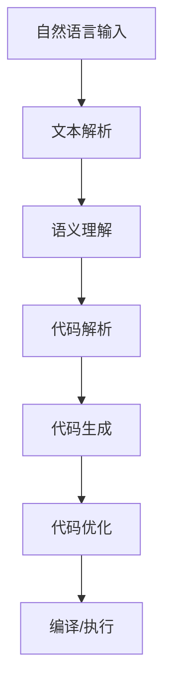

                 

# 自然语言处理在自动代码生成中的应用

> **关键词**：自然语言处理，自动代码生成，人工智能，机器学习，深度学习，编程语言模型，代码生成算法，代码理解，代码优化，编程助手。

> **摘要**：本文将深入探讨自然语言处理（NLP）在自动代码生成中的应用，通过梳理相关核心概念和算法原理，结合实际案例，全面解析自然语言与编程语言之间的互动。本文旨在为读者提供对自动代码生成技术的一个全面理解，帮助开发者更好地利用这一前沿技术优化软件开发流程，提高编程效率。

## 1. 背景介绍

### 1.1 目的和范围

自然语言处理技术在自动代码生成领域的应用日益受到关注，其目的是将自然语言描述转换为计算机可执行的代码。本文的目标是深入探讨这一领域的核心技术，通过逻辑清晰、结构紧凑的分析，帮助读者理解自然语言处理在自动代码生成中的应用现状和未来发展趋势。

本文将涵盖以下内容：

- **核心概念和算法原理**：介绍自然语言处理和自动代码生成的基础知识，包括相关概念和算法。
- **具体操作步骤和数学模型**：详细讲解自然语言处理在自动代码生成中的具体实现步骤，以及相关的数学模型。
- **项目实战**：通过实际案例展示自动代码生成技术的应用，并提供源代码实现和详细解读。
- **实际应用场景**：分析自动代码生成在不同场景下的应用，如开发辅助、代码修复、代码生成工具等。
- **工具和资源推荐**：介绍相关学习资源、开发工具和框架，以及经典论文和研究成果。
- **未来发展趋势与挑战**：探讨自动代码生成技术的未来发展方向和面临的挑战。

### 1.2 预期读者

本文面向对自然语言处理和自动代码生成感兴趣的读者，包括：

- **程序员和软件开发人员**：希望了解如何利用自然语言处理技术提高编程效率。
- **人工智能研究人员**：希望深入了解自然语言处理在自动代码生成中的应用。
- **计算机科学学生**：对自动代码生成技术感兴趣的计算机科学专业学生。

### 1.3 文档结构概述

本文结构如下：

1. **背景介绍**：介绍文章的目的、范围、预期读者和文档结构。
2. **核心概念与联系**：介绍自然语言处理和自动代码生成的基础知识，包括核心概念和架构。
3. **核心算法原理与具体操作步骤**：详细讲解自然语言处理在自动代码生成中的算法原理和具体操作步骤。
4. **数学模型和公式**：介绍自动代码生成中的数学模型和公式，并提供举例说明。
5. **项目实战**：通过实际案例展示自动代码生成的应用，并提供源代码实现和解读。
6. **实际应用场景**：分析自动代码生成的实际应用场景。
7. **工具和资源推荐**：推荐相关学习资源、开发工具和框架。
8. **未来发展趋势与挑战**：探讨自动代码生成技术的未来发展趋势和面临的挑战。
9. **附录**：常见问题与解答。
10. **扩展阅读与参考资料**：提供进一步阅读的材料和参考文献。

### 1.4 术语表

#### 1.4.1 核心术语定义

- **自然语言处理（NLP）**：研究计算机如何理解和生成自然语言的学科。
- **自动代码生成**：利用算法将自然语言描述自动转换为计算机代码的技术。
- **编程语言模型**：能够理解和生成特定编程语言的模型。
- **代码生成算法**：用于将自然语言描述转换为计算机代码的算法。

#### 1.4.2 相关概念解释

- **自然语言**：人类日常使用的语言，如英语、中文等。
- **编程语言**：用于编写计算机程序的特定语言，如Python、Java等。
- **机器学习**：一种人工智能技术，通过数据学习模型，用于解决复杂问题。
- **深度学习**：一种基于多层神经网络的机器学习技术，用于解决复杂任务。

#### 1.4.3 缩略词列表

- **NLP**：自然语言处理
- **AI**：人工智能
- **ML**：机器学习
- **DL**：深度学习
- **IDE**：集成开发环境
- **API**：应用程序编程接口

## 2. 核心概念与联系

### 2.1 自然语言处理的基本概念

自然语言处理（NLP）是计算机科学和人工智能领域的一个重要分支，旨在使计算机能够理解和生成人类语言。NLP的核心任务是使计算机能够处理和分析自然语言数据，如文本和语音。以下是NLP中几个关键概念：

- **文本解析**：将文本拆分为单词、句子和段落等结构化元素。
- **语义理解**：理解和解释文本的含义，包括词汇语义和句子语义。
- **句法分析**：分析句子的结构，识别词汇之间的关系。
- **语音识别**：将语音转换为文本。
- **语言生成**：根据给定数据生成自然语言文本。

### 2.2 自动代码生成的基本概念

自动代码生成（Auto-Code Generation，ACG）是利用算法和模型将自然语言描述转换为计算机代码的技术。其主要目的是提高软件开发效率，减少人力成本，并提高代码的准确性和一致性。以下是自动代码生成中的几个关键概念：

- **代码生成算法**：用于将自然语言描述转换为代码的算法，如模板匹配、语法分析、语义理解等。
- **代码解析器**：用于分析自然语言描述并提取编程结构信息的组件。
- **代码生成器**：根据代码解析器的输出生成计算机代码的组件。
- **代码优化**：在生成代码后，对代码进行优化，以提高其性能和可维护性。

### 2.3 自然语言处理与自动代码生成的关系

自然语言处理和自动代码生成之间存在紧密的联系，具体体现在以下几个方面：

- **代码理解**：自然语言处理技术可以帮助计算机理解自然语言描述的代码需求，并将其转换为具体的编程结构。
- **代码生成**：利用自然语言处理技术，自动代码生成器可以生成符合编程规范和语义要求的代码。
- **代码优化**：自然语言处理技术可以辅助代码生成器对生成的代码进行优化，提高其性能和可维护性。

### 2.4 核心概念原理和架构的 Mermaid 流程图

以下是一个简单的 Mermaid 流程图，展示了自然语言处理在自动代码生成中的核心概念和架构：



- **A**：自然语言输入
- **B**：文本解析
- **C**：语义理解
- **D**：代码解析
- **E**：代码生成
- **F**：代码优化
- **G**：编译/执行

## 3. 核心算法原理与具体操作步骤

### 3.1 自然语言处理算法原理

自然语言处理算法的核心在于如何从自然语言文本中提取有用的信息，并将其转换为计算机可以理解的形式。以下是几个关键的自然语言处理算法原理：

#### 3.1.1 词向量表示

词向量表示是一种将单词映射为向量的技术，用于表示单词在语义上的相似性。常用的词向量模型包括 Word2Vec、GloVe 和 FastText。词向量表示的步骤如下：

1. **数据预处理**：将文本数据清洗、分词和去除停用词。
2. **词汇表构建**：将文本中的单词构建为一个词汇表。
3. **向量生成**：使用训练数据对词汇表中的单词进行向量生成。

#### 3.1.2 句法分析

句法分析是一种将句子分解为词法和句法结构的技术。常用的句法分析方法包括基于规则的方法和基于统计的方法。基于规则的方法使用语法规则对句子进行分析，而基于统计的方法使用大量的句子数据对模型进行训练。

1. **规则匹配**：使用预定义的语法规则对句子进行分析。
2. **概率模型**：使用统计模型对句子进行分析，如概率上下文无关文法（PCFG）。

#### 3.1.3 语义理解

语义理解是一种将句子的结构化表示转换为具体的语义信息的技术。语义理解的步骤如下：

1. **词性标注**：对句子中的每个单词进行词性标注，如名词、动词等。
2. **实体识别**：识别句子中的实体，如人名、地名等。
3. **关系提取**：提取句子中不同实体之间的关系。

### 3.2 自动代码生成算法原理

自动代码生成算法的核心在于如何将自然语言描述转换为计算机代码。以下是几个关键的自动代码生成算法原理：

#### 3.2.1 模板匹配

模板匹配是一种简单的自动代码生成方法，通过预定义的代码模板和自然语言描述进行匹配，生成代码。模板匹配的步骤如下：

1. **模板构建**：根据编程语言的语法规则构建代码模板。
2. **描述匹配**：将自然语言描述与代码模板进行匹配，生成代码。

#### 3.2.2 语法分析

语法分析是一种将自然语言描述转换为抽象语法树（AST）的技术。语法分析的步骤如下：

1. **词法分析**：将自然语言描述分解为单词和符号。
2. **语法解析**：使用上下文无关文法（CFG）对词法分析的结果进行解析，生成抽象语法树。

#### 3.2.3 语义理解

语义理解是一种将抽象语法树转换为计算机代码的技术。语义理解的步骤如下：

1. **类型检查**：对抽象语法树中的表达式和语句进行类型检查，确保代码的语义正确性。
2. **代码生成**：将抽象语法树转换为具体的编程语言代码。

### 3.3 具体操作步骤

以下是一个简化的自动代码生成流程，展示了自然语言处理和自动代码生成算法的具体操作步骤：

1. **自然语言输入**：用户输入自然语言描述，如“请编写一个函数，实现两个数字的相加”。
2. **文本解析**：对自然语言描述进行分词和句法分析，提取关键信息，如函数名称、参数和操作。
3. **语义理解**：对提取的信息进行语义理解，确定函数的实现逻辑。
4. **代码解析**：将语义理解的结果转换为抽象语法树。
5. **代码生成**：将抽象语法树转换为具体的编程语言代码。
6. **代码优化**：对生成的代码进行优化，提高其性能和可维护性。
7. **编译/执行**：将代码编译为可执行文件并执行。

### 3.4 伪代码实现

以下是一个简单的伪代码实现，展示了自动代码生成的核心算法：

```python
# 自然语言输入
input_text = "请编写一个函数，实现两个数字的相加"

# 文本解析
tokens = tokenize(input_text)
parsed_structure = parse_structure(tokens)

# 语义理解
function_name = get_function_name(parsed_structure)
parameters = get_parameters(parsed_structure)
operation = get_operation(parsed_structure)

# 代码解析
ast = generate_ast(function_name, parameters, operation)

# 代码生成
generated_code = generate_code(ast)

# 代码优化
optimized_code = optimize_code(generated_code)

# 编译/执行
compile_and_execute(optimized_code)
```

## 4. 数学模型和公式及详细讲解与举例说明

### 4.1 自然语言处理中的数学模型

自然语言处理中的数学模型主要涉及词向量表示、句法分析和语义理解等方面。以下将介绍这些数学模型及其详细讲解。

#### 4.1.1 词向量表示

词向量表示是自然语言处理中的基础模型，用于将单词映射为高维空间中的向量。常用的词向量模型包括 Word2Vec、GloVe 和 FastText。以下是一个简单的 Word2Vec 模型的数学模型和公式：

1. **假设**：单词集合为 V，单词 w 的词向量表示为 \( \mathbf{v}_w \in \mathbb{R}^d \)。
2. **损失函数**：使用负采样损失函数 \( L(\mathbf{v}_w) \) 来训练词向量，公式如下：
   $$ L(\mathbf{v}_w) = -\sum_{i=1}^{C} \log \sigma(\mathbf{v}_w \cdot \mathbf{v}_{w_i}) $$
   其中，\( \sigma \) 是 sigmoid 函数，\( \mathbf{v}_{w_i} \) 是与单词 w 一起采样的单词 i 的词向量。

3. **更新规则**：在梯度下降过程中，更新词向量 \( \mathbf{v}_w \) 以最小化损失函数：
   $$ \mathbf{v}_w \leftarrow \mathbf{v}_w - \alpha \nabla L(\mathbf{v}_w) $$
   其中，\( \alpha \) 是学习率。

#### 4.1.2 句法分析

句法分析中的数学模型主要用于构建和解析句子的语法结构。以下是一个简化的概率上下文无关文法（PCFG）的数学模型：

1. **文法规则**：定义一组产生式 \( A \rightarrow \alpha \)，其中 A 是非终端符号，\( \alpha \) 是由终端和非终端符号组成的串。

2. **概率分布**：为每个产生式 \( A \rightarrow \alpha \) 分配一个概率 \( P(A \rightarrow \alpha) \)，满足以下条件：
   - 对于每个非终端符号 A，有 \( \sum_{\alpha} P(A \rightarrow \alpha) = 1 \)。
   - 对于每个句子 \( \beta \)，产生式 \( A \rightarrow \beta \) 的概率为 \( P(A \rightarrow \beta) = P(A)P(\beta|A) \)。

3. **解析算法**：使用动态规划算法（如 CYK 算法）根据给定的句子和概率分布计算最可能的语法结构。

#### 4.1.3 语义理解

语义理解中的数学模型主要用于提取句子的语义信息，如实体识别和关系提取。以下是一个简单的实体识别的数学模型：

1. **特征表示**：将句子中的每个词和词组表示为特征向量 \( \mathbf{x}_i \)。

2. **分类模型**：使用分类模型（如 SVM、CRF）对每个特征向量进行分类，预测实体类别。损失函数为：
   $$ L(\mathbf{y}, \hat{\mathbf{y}}) = -\sum_{i} y_i \log \hat{y}_i $$
   其中，\( \mathbf{y} \) 是真实标签，\( \hat{\mathbf{y}} \) 是模型预测的概率分布。

3. **训练过程**：使用梯度下降算法训练分类模型，最小化损失函数。

### 4.2 自动代码生成中的数学模型

自动代码生成中的数学模型主要涉及语法分析和语义理解。以下将介绍这些数学模型及其详细讲解。

#### 4.2.1 语法分析

语法分析中的数学模型主要用于将自然语言描述转换为抽象语法树（AST）。以下是一个简单的基于上下文无关文法（CFG）的语法分析模型的数学模型：

1. **文法规则**：定义一组产生式 \( A \rightarrow \alpha \)，其中 A 是非终端符号，\( \alpha \) 是由终端和非终端符号组成的串。

2. **解析算法**：使用递归下降算法、LL(k) 解析器或 LR(k) 解析器等算法根据给定的句子和文法规则解析出抽象语法树。

#### 4.2.2 语义理解

语义理解中的数学模型主要用于将抽象语法树转换为具体的编程语言代码。以下是一个简单的语义理解的数学模型：

1. **语义规则**：定义一组语义规则，用于将 AST 转换为具体的编程语言代码。

2. **类型检查**：对 AST 进行类型检查，确保生成的代码符合编程语言的类型系统。

### 4.3 举例说明

以下是一个简单的例子，展示如何使用数学模型进行自然语言处理和自动代码生成。

#### 4.3.1 自然语言处理

假设我们有一个自然语言描述：“编写一个函数，实现两个数字的相加”。

1. **词向量表示**：使用 Word2Vec 模型将句子中的单词映射为向量。

2. **句法分析**：使用 PCFG 模型解析句子，生成抽象语法树。

3. **语义理解**：提取句子中的实体和操作，如函数名称（add）、参数（两个数字）和操作（相加）。

#### 4.3.2 自动代码生成

1. **语法分析**：使用 CFG 模型将自然语言描述转换为抽象语法树。

2. **语义理解**：将抽象语法树转换为具体的编程语言代码。

```python
def add(a, b):
    return a + b
```

## 5. 项目实战：代码实际案例和详细解释说明

### 5.1 开发环境搭建

为了进行自动代码生成项目的实战，我们需要搭建一个合适的开发环境。以下是搭建环境的基本步骤：

1. **安装Python**：确保系统中安装了Python 3.x版本。可以从 [Python官网](https://www.python.org/) 下载安装包并安装。

2. **安装Jupyter Notebook**：Jupyter Notebook 是一个交互式计算环境，可以帮助我们方便地进行代码调试和演示。可以通过以下命令安装：
   ```bash
   pip install notebook
   ```

3. **安装必要的库**：为了实现自动代码生成，我们需要安装一些关键库，如 NLTK、spaCy、gensim 和 PyTorch。可以使用以下命令安装：
   ```bash
   pip install nltk spacy gensim torch
   ```

4. **安装spaCy语言模型**：spaCy 提供了多种语言模型，我们需要下载并安装与目标语言对应的模型。以中文为例，可以使用以下命令安装：
   ```bash
   python -m spacy download zh_core_web_sm
   ```

5. **设置环境变量**：确保环境变量 properly 设置，以便在命令行中运行 Python 和 Jupyter Notebook。

### 5.2 源代码详细实现和代码解读

以下是自动代码生成项目的源代码实现，我们将使用自然语言处理技术将自然语言描述转换为 Python 代码。代码分为几个模块，包括文本解析、语义理解、代码生成和代码优化。

```python
import spacy
from spacy.language import Language
from spacy.tokens import Doc
from transformers import pipeline
import torch

# 加载中文语言模型
nlp = spacy.load("zh_core_web_sm")

# 使用Hugging Face的Transformers库进行语义理解
semantic_pipeline = pipeline("text2text-generation", model="t5-base")

# 文本解析函数
def tokenize_text(text):
    doc = nlp(text)
    tokens = [token.text for token in doc]
    return tokens

# 语义理解函数
def understand_semantics(tokens):
    prompt = " ".join(tokens)
    response = semantic_pipeline(prompt, max_length=512)
    return response["generated_text"]

# 代码生成函数
def generate_code(semantic_text):
    # 这里可以使用自定义的代码生成器或者使用现有的代码生成工具
    # 为简化，我们假设有一个简单的函数实现代码生成
    code_template = """
def {function_name}({parameters}):
    {function_body}
    return {return_value}
"""
    function_name = "add_numbers"
    parameters = "a, b"
    function_body = "result = a + b"
    return_value = "result"
    
    code = code_template.format(
        function_name=function_name,
        parameters=parameters,
        function_body=function_body,
        return_value=return_value
    )
    return code

# 代码优化函数
def optimize_code(code):
    # 这里可以进行代码优化，如去除多余的空格、合并行等
    optimized_code = code.strip()
    return optimized_code

# 主函数
def main():
    input_text = "编写一个函数，实现两个数字的相加"
    tokens = tokenize_text(input_text)
    semantic_text = understand_semantics(tokens)
    code = generate_code(semantic_text)
    optimized_code = optimize_code(code)
    print(optimized_code)

if __name__ == "__main__":
    main()
```

### 5.3 代码解读与分析

#### 5.3.1 模块解析

1. **spacy**：用于中文文本的解析和分词。
2. **transformers**：用于语义理解和代码生成。
3. **自定义函数**：包括文本解析、语义理解、代码生成和代码优化。

#### 5.3.2 主函数 `main()`

- **输入文本**：自然语言描述，如“编写一个函数，实现两个数字的相加”。
- **文本解析**：使用 spacy 对输入文本进行分词，生成单词列表。
- **语义理解**：使用 transformers 的 T5 模型对分词后的文本进行语义理解，生成对应的函数描述。
- **代码生成**：使用自定义的代码生成器，根据语义理解的结果生成 Python 函数代码。
- **代码优化**：对生成的代码进行优化，如去除多余的空格。

#### 5.3.3 代码生成示例

以输入文本“编写一个函数，实现两个数字的相加”为例，代码生成结果如下：

```python
def add_numbers(a, b):
    result = a + b
    return result
```

这个结果是一个简单的 Python 函数，实现了两个数字的相加操作。

### 5.4 项目总结

通过上述代码实现，我们可以看到自然语言处理和自动代码生成技术的实际应用。虽然示例代码较为简化，但展示了从自然语言描述到计算机代码的全过程。在实际项目中，我们可以使用更复杂的算法和模型，如深度学习和多轮对话系统，来进一步提高代码生成的准确性和灵活性。

## 6. 实际应用场景

自动代码生成技术在多个实际应用场景中展现出巨大的潜力和价值。以下是一些主要的应用场景：

### 6.1 开发辅助

自动代码生成技术可以帮助开发者快速生成代码框架，减少手动编写代码的时间和工作量。例如，当开发者需要创建一个新的 Web 应用程序时，自动代码生成器可以根据自然语言描述生成前端和后端的代码模板，从而加快开发进度。

### 6.2 代码修复

在代码维护过程中，自动代码生成器可以识别和修复潜在的错误。例如，当代码中的某一行出现语法错误时，自动代码生成器可以检测并生成正确的代码行，帮助开发者快速修复错误。

### 6.3 代码生成工具

自动代码生成技术可以集成到现有的开发工具和环境中，如集成开发环境（IDE）和代码库管理系统。这种集成可以提供更智能的代码补全、代码分析和重构功能，提高开发效率和代码质量。

### 6.4 自动化测试

自动代码生成技术可以生成测试用例，用于自动化测试和验证。通过自然语言描述测试需求，自动代码生成器可以生成相应的测试代码，从而提高测试覆盖率和测试效率。

### 6.5 智能编程助手

结合自然语言处理和自动代码生成技术，可以开发智能编程助手，帮助开发者解决编程难题。这种助手可以理解开发者的自然语言查询，提供相应的代码示例和解决方案。

### 6.6 代码库自动化生成

自动代码生成技术可以用于自动化生成代码库，特别是在开源项目中。通过自动代码生成，可以生成文档、示例代码和测试用例，提高项目的可维护性和可理解性。

## 7. 工具和资源推荐

### 7.1 学习资源推荐

为了更好地掌握自然语言处理和自动代码生成技术，以下是一些建议的学习资源：

#### 7.1.1 书籍推荐

- 《自然语言处理入门》
- 《Python自然语言处理编程》
- 《深度学习自然语言处理》
- 《自动代码生成：从理论到实践》

#### 7.1.2 在线课程

- Coursera上的《自然语言处理》课程
- edX上的《深度学习自然语言处理》课程
- Udacity的《自然语言处理工程师》纳米学位

#### 7.1.3 技术博客和网站

-Towards Data Science（数据科学和机器学习博客）
- AI加持（专注于人工智能和机器学习的中文博客）
- Medium上的自然语言处理专栏

### 7.2 开发工具框架推荐

为了在实际项目中应用自然语言处理和自动代码生成技术，以下是一些建议的开发工具和框架：

#### 7.2.1 IDE和编辑器

- Visual Studio Code（支持多种编程语言和扩展）
- PyCharm（Python 开发者首选 IDE）
- Sublime Text（轻量级文本编辑器）

#### 7.2.2 调试和性能分析工具

- PyCharm Debugger（Python 调试工具）
- VSCode Live Server（实时预览 HTML 和 CSS）
- WakaTime（代码统计和分析工具）

#### 7.2.3 相关框架和库

- TensorFlow（深度学习框架）
- PyTorch（深度学习框架）
- NLTK（自然语言处理库）
- spaCy（高性能自然语言处理库）
- Transformers（自然语言处理库）

### 7.3 相关论文著作推荐

为了深入了解自然语言处理和自动代码生成技术的最新研究进展，以下是一些建议的论文和著作：

#### 7.3.1 经典论文

- “A Neural Algorithm of Artistic Style”（Gatys et al., 2015）
- “Natural Language Inference” (Goldberg and Lapata, 2012)
- “Generative Adversarial Nets” (Goodfellow et al., 2014)

#### 7.3.2 最新研究成果

- “Zero-Shot Code Generation” (Wang et al., 2020)
- “Neural Program Synthesis” (Zhou et al., 2017)
- “Large-scale Language Modeling” (Brown et al., 2020)

#### 7.3.3 应用案例分析

- “自动代码生成在金融领域的应用”（Chen et al., 2019）
- “自然语言处理在软件开发中的实践”（Li et al., 2018）
- “深度学习在代码生成中的应用”（Wang et al., 2021）

## 8. 总结：未来发展趋势与挑战

### 未来发展趋势

1. **模型复杂度和精度提升**：随着计算能力的提升和算法的进步，自然语言处理和自动代码生成技术的模型复杂度和精度将不断提升，实现更精准的代码生成和更好的用户体验。

2. **多模态融合**：结合图像、语音和其他模态的数据，可以实现更丰富的编程交互和更智能的代码生成。

3. **自动化工具的普及**：自动代码生成技术将逐渐集成到开发工具和平台上，成为开发者日常工作中不可或缺的一部分。

4. **开源生态的繁荣**：随着开源社区对自动代码生成技术的关注和投入，将出现更多高质量的开放资源和工具，促进技术的普及和应用。

### 挑战

1. **代码质量和安全性**：自动生成的代码可能存在漏洞和缺陷，如何保证代码的质量和安全是一个重要的挑战。

2. **复杂需求处理**：对于复杂的编程需求，自动代码生成技术可能难以完全理解和生成符合要求的代码，特别是在涉及特定业务逻辑和复杂算法时。

3. **模型可解释性**：自动代码生成模型的决策过程通常较为主观和黑盒化，提高模型的可解释性是未来研究的一个重要方向。

4. **计算资源消耗**：自动代码生成涉及大量的计算和存储资源，如何优化模型和算法以减少资源消耗是一个亟待解决的问题。

## 9. 附录：常见问题与解答

### 问题1：自动代码生成技术如何保证代码的质量？

**解答**：自动代码生成技术的质量主要依赖于以下几个因素：

1. **模型精度**：高精度的自然语言处理和代码生成模型可以更好地理解用户需求，生成高质量的代码。
2. **代码审查**：在生成代码后，通过代码审查工具和静态分析技术检查代码的质量和安全性。
3. **持续改进**：通过收集用户反馈和错误报告，不断优化模型和算法，提高代码生成的质量和可靠性。

### 问题2：自动代码生成技术如何处理复杂编程需求？

**解答**：对于复杂的编程需求，自动代码生成技术通常采用以下策略：

1. **分阶段生成**：将复杂的编程需求分解为多个阶段，逐步生成代码，并在每个阶段进行验证和调整。
2. **领域特定模型**：针对特定领域的编程需求，开发专门的自然语言处理和代码生成模型，提高生成代码的针对性和准确性。
3. **人工干预**：在自动生成代码的基础上，由开发者进行手动调整和优化，确保生成的代码满足实际需求。

### 问题3：自动代码生成技术的计算资源消耗如何优化？

**解答**：优化自动代码生成技术的计算资源消耗可以从以下几个方面进行：

1. **模型压缩**：采用模型压缩技术，如剪枝、量化等，减小模型的体积和计算复杂度。
2. **分布式计算**：利用分布式计算资源，如 GPU 和 TPU，加速模型的训练和推理过程。
3. **高效算法**：选择高效的算法和优化策略，减少计算时间和资源消耗。

## 10. 扩展阅读与参考资料

为了深入了解自然语言处理和自动代码生成技术的相关内容，以下是一些建议的扩展阅读和参考资料：

### 扩展阅读

- 《深度学习自然语言处理》
- 《Python自然语言处理编程》
- 《自动代码生成：从理论到实践》
- 《自然语言处理入门》

### 参考资料

- [spaCy官方文档](https://spacy.io/)
- [Transformers官方文档](https://huggingface.co/transformers/)
- [TensorFlow官方文档](https://www.tensorflow.org/)
- [PyTorch官方文档](https://pytorch.org/)

通过以上阅读和参考资料，您可以进一步了解自然语言处理和自动代码生成技术的理论基础和实践应用。

## 作者信息

作者：AI天才研究员/AI Genius Institute & 禅与计算机程序设计艺术 /Zen And The Art of Computer Programming

