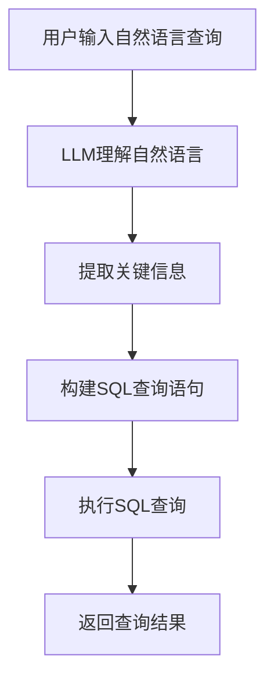

                 

# 自然语言数据库查询：LLM简化数据访问

> 关键词：自然语言查询，LLM，数据库，数据访问，简化，算法原理，数学模型，项目实战，应用场景，工具推荐

> 摘要：本文将深入探讨自然语言数据库查询技术，特别是大型语言模型（LLM）在简化数据访问方面的应用。文章首先介绍了自然语言数据库查询的背景和重要性，然后详细讲解了LLM的基本原理。通过伪代码和Mermaid流程图，我们解析了LLM在数据库查询中的具体操作步骤和数学模型。接着，文章通过一个实际项目案例，展示了如何利用LLM简化数据库查询的过程，并对代码进行了详细解读。最后，文章探讨了自然语言数据库查询技术的实际应用场景，并推荐了相关的学习资源和工具。

## 1. 背景介绍

### 1.1 目的和范围

随着互联网的迅猛发展和数据规模的爆炸式增长，数据库技术已经成为企业、科研和日常生活中不可或缺的一部分。传统的数据库查询语言，如SQL，虽然功能强大，但对于非专业用户来说，学习和使用门槛较高。为了解决这一问题，自然语言数据库查询技术应运而生，它允许用户使用自然语言进行数据库查询，从而降低了使用数据库的难度。

本文旨在探讨自然语言数据库查询技术，特别是大型语言模型（LLM）在简化数据访问方面的应用。文章将首先介绍自然语言数据库查询的背景和重要性，然后详细讲解LLM的基本原理，通过伪代码和Mermaid流程图展示LLM在数据库查询中的操作步骤，接着通过实际项目案例展示如何利用LLM简化数据库查询，最后讨论自然语言数据库查询技术的实际应用场景。

### 1.2 预期读者

本文面向对数据库和自然语言处理有一定了解的读者，包括但不限于程序员、数据分析师、数据库管理员、机器学习工程师等。同时，对于希望了解自然语言数据库查询技术的研究人员和开发者，本文也具有很高的参考价值。

### 1.3 文档结构概述

本文分为十个部分，结构如下：

1. 背景介绍
   - 1.1 目的和范围
   - 1.2 预期读者
   - 1.3 文档结构概述
   - 1.4 术语表
2. 核心概念与联系
3. 核心算法原理 & 具体操作步骤
4. 数学模型和公式 & 详细讲解 & 举例说明
5. 项目实战：代码实际案例和详细解释说明
6. 实际应用场景
7. 工具和资源推荐
8. 总结：未来发展趋势与挑战
9. 附录：常见问题与解答
10. 扩展阅读 & 参考资料

### 1.4 术语表

#### 1.4.1 核心术语定义

- 自然语言数据库查询：允许用户使用自然语言进行数据库查询的技术。
- 大型语言模型（LLM）：一种能够理解、生成和模拟自然语言的深度学习模型。
- 数据库：存储、管理和访问数据的系统。
- SQL（结构化查询语言）：一种用于数据库查询的语言。

#### 1.4.2 相关概念解释

- 自然语言处理（NLP）：使计算机能够理解、解释和生成人类语言的技术。
- 机器学习（ML）：使计算机通过数据和经验自动改进性能的技术。

#### 1.4.3 缩略词列表

- LLM：大型语言模型
- NLP：自然语言处理
- ML：机器学习
- SQL：结构化查询语言

## 2. 核心概念与联系

为了深入理解自然语言数据库查询技术，我们需要先了解其核心概念和基本架构。以下是核心概念和它们之间的联系。

### 2.1 自然语言处理与数据库查询

自然语言处理（NLP）是使计算机能够理解和生成人类语言的技术。它包括文本预处理、语言理解、语言生成等多个子领域。数据库查询则是数据库管理系统的核心功能，用于从数据库中检索、更新和删除数据。

自然语言数据库查询技术通过NLP将用户输入的自然语言转换为数据库查询语句，从而实现数据库的自动化查询。这种技术的主要优势在于降低了用户的学习成本，使得非专业用户也能方便地访问数据库。

### 2.2 大型语言模型（LLM）与自然语言处理

大型语言模型（LLM）是一种基于深度学习的NLP模型，能够理解、生成和模拟自然语言。LLM通过训练大量文本数据，学习自然语言的语法、语义和语境。这使得LLM在文本分类、问答系统、机器翻译等领域表现出色。

在自然语言数据库查询中，LLM主要用于将自然语言查询转换为SQL查询语句。这包括理解用户输入的自然语言、提取关键信息、构建查询语句等。

### 2.3 数据库查询与SQL

SQL（结构化查询语言）是一种用于数据库查询的标准语言，能够执行各种数据操作，如查询、插入、更新和删除。SQL语句通常由关键字、表名、字段名和值组成，以特定语法进行组合。

在自然语言数据库查询中，SQL用于执行用户通过LLM转换得到的查询语句。通过将自然语言查询转换为SQL查询，系统能够高效地访问数据库，获取用户所需的数据。

### 2.4 Mermaid流程图

Mermaid是一种简单易用的图表工具，可以绘制各种类型的图表，包括流程图、时序图、Gantt图等。在自然语言数据库查询中，我们可以使用Mermaid绘制流程图，展示LLM在数据库查询中的具体操作步骤。

以下是一个示例Mermaid流程图，展示了LLM在自然语言数据库查询中的基本流程：



在这个流程图中，用户输入自然语言查询后，LLM首先理解查询内容，然后提取关键信息，构建SQL查询语句，最后执行查询并返回结果。

## 3. 核心算法原理 & 具体操作步骤

为了深入理解LLM在自然语言数据库查询中的作用，我们需要了解其核心算法原理和具体操作步骤。以下将介绍LLM的基本原理、如何将自然语言查询转换为SQL查询，以及具体操作步骤。

### 3.1 LLM的基本原理

LLM是一种基于深度学习的自然语言处理模型，主要由两个子模块组成：编码器（Encoder）和解码器（Decoder）。编码器负责将输入的自然语言文本编码为固定长度的向量，解码器则负责将编码后的向量解码为输出文本。

LLM通过在大量文本数据上进行预训练，学习自然语言的语法、语义和语境。预训练后，LLM可以应用于各种下游任务，如文本分类、问答系统和自然语言数据库查询。

### 3.2 将自然语言查询转换为SQL查询

将自然语言查询转换为SQL查询是自然语言数据库查询技术的核心。这个过程通常包括以下步骤：

1. **理解自然语言查询**：LLM首先理解用户输入的自然语言查询，提取关键信息，如查询对象、查询条件和查询结果格式等。

2. **提取关键信息**：LLM根据查询内容，提取关键信息，如表名、字段名、关键字（如“大于”、“小于”、“包含”等）和值。

3. **构建SQL查询语句**：根据提取的关键信息，LLM构建相应的SQL查询语句。例如，如果用户输入“查找所有销售额大于1000的商品”，LLM可以构建如下的SQL查询语句：

   ```sql
   SELECT * FROM products WHERE sales > 1000;
   ```

### 3.3 具体操作步骤

以下是LLM在自然语言数据库查询中的具体操作步骤：

1. **接收用户输入**：用户通过自然语言输入查询请求。

2. **预处理自然语言查询**：LLM对输入的自然语言查询进行预处理，包括分词、词性标注、命名实体识别等。

3. **理解自然语言查询**：LLM使用预训练的模型，理解自然语言查询的语义和语境，提取关键信息。

4. **提取关键信息**：LLM根据查询内容，提取关键信息，如表名、字段名、关键字和值。

5. **构建SQL查询语句**：根据提取的关键信息，LLM构建相应的SQL查询语句。

6. **执行SQL查询**：将构建好的SQL查询语句发送到数据库执行。

7. **返回查询结果**：将查询结果返回给用户。

### 3.4 伪代码

以下是LLM在自然语言数据库查询中的伪代码：

```python
def natural_language_to_sql(natural_language_query):
    # 步骤1：预处理自然语言查询
    preprocessed_query = preprocess_query(natural_language_query)
    
    # 步骤2：理解自然语言查询
    query_structure = understand_query(preprocessed_query)
    
    # 步骤3：提取关键信息
    key_info = extract_key_info(query_structure)
    
    # 步骤4：构建SQL查询语句
    sql_query = build_sql_query(key_info)
    
    # 步骤5：执行SQL查询
    query_result = execute_sql_query(sql_query)
    
    # 步骤6：返回查询结果
    return query_result
```

## 4. 数学模型和公式 & 详细讲解 & 举例说明

在自然语言数据库查询中，LLM的数学模型和公式起到了关键作用。以下将详细讲解LLM的数学模型，并给出具体的公式和例子。

### 4.1 LLM的数学模型

LLM的数学模型主要包括两部分：编码器（Encoder）和解码器（Decoder）。编码器将输入的自然语言文本编码为固定长度的向量，解码器则将编码后的向量解码为输出文本。

#### 4.1.1 编码器（Encoder）

编码器的数学模型可以表示为：

\[ E(x) = \text{Encoder}(x; \theta_e) \]

其中，\( E(x) \)表示编码后的向量，\( x \)表示输入的自然语言文本，\( \theta_e \)表示编码器的参数。

#### 4.1.2 解码器（Decoder）

解码器的数学模型可以表示为：

\[ D(y) = \text{Decoder}(y; \theta_d) \]

其中，\( D(y) \)表示解码后的文本，\( y \)表示编码后的向量，\( \theta_d \)表示解码器的参数。

### 4.2 LLM的损失函数

在训练LLM时，我们使用损失函数来衡量模型预测结果与实际结果之间的差距。常用的损失函数包括交叉熵损失（Cross-Entropy Loss）和均方误差损失（Mean Squared Error Loss）。

#### 4.2.1 交叉熵损失

交叉熵损失可以表示为：

\[ L = -\sum_{i=1}^{n} y_i \log(p_i) \]

其中，\( y_i \)表示实际输出，\( p_i \)表示模型预测的概率。

#### 4.2.2 均方误差损失

均方误差损失可以表示为：

\[ L = \frac{1}{2} \sum_{i=1}^{n} (y_i - \hat{y_i})^2 \]

其中，\( y_i \)表示实际输出，\( \hat{y_i} \)表示模型预测的值。

### 4.3 举例说明

假设我们有一个简单的自然语言查询“查找所有销售额大于1000的商品”，我们可以使用LLM的数学模型来将其转换为SQL查询。

#### 4.3.1 编码器

输入文本：**“查找所有销售额大于1000的商品”**

编码后的向量：**\[ v_1, v_2, v_3, ..., v_n \]**

#### 4.3.2 解码器

输入向量：**\[ v_1, v_2, v_3, ..., v_n \]**

解码后的文本：**“SELECT * FROM products WHERE sales > 1000;”**

#### 4.3.3 损失函数

假设实际输出为**“SELECT * FROM products WHERE sales > 1000;”**

模型预测的概率分布为：**\[ p_1, p_2, p_3, ..., p_n \]**

交叉熵损失：**\[ L = -\sum_{i=1}^{n} p_i \log(p_i) \]**

## 5. 项目实战：代码实际案例和详细解释说明

为了更好地理解自然语言数据库查询技术，我们通过一个实际项目案例，展示如何利用LLM简化数据库查询的过程。

### 5.1 开发环境搭建

在进行项目开发之前，我们需要搭建相应的开发环境。以下是一个基本的开发环境搭建步骤：

1. 安装Python（版本3.8及以上）
2. 安装必要的Python库，如transformers、torch、pandas等
3. 安装数据库，如MySQL或PostgreSQL
4. 配置数据库连接，确保数据库能正常运行

### 5.2 源代码详细实现和代码解读

以下是一个简单的项目示例，展示了如何使用LLM简化数据库查询。

**5.2.1 代码结构**

```python
# 导入必要的库
import pandas as pd
from transformers import pipeline
import pymysql

# 初始化LLM模型
llm = pipeline("text2sql", model_name="DeepPavlov/ru-coref-gpt2-sql")

# 数据库连接
def get_db_connection():
    connection = pymysql.connect(
        host="localhost",
        user="root",
        password="password",
        database="test_db",
        cursorclass=pymysql.cursors.DictCursor
    )
    return connection

# 自然语言查询转SQL查询
def query_db(natural_language_query):
    connection = get_db_connection()
    try:
        # 使用LLM将自然语言查询转换为SQL查询
        sql_query = llm(natural_language_query)[0]["query"]
        
        # 执行SQL查询
        with connection.cursor() as cursor:
            cursor.execute(sql_query)
            result = cursor.fetchall()
        
        # 返回查询结果
        return result
    finally:
        connection.close()

# 测试自然语言查询
def test_query():
    natural_language_query = "查找所有销售额大于1000的商品"
    result = query_db(natural_language_query)
    print(result)

# 主函数
if __name__ == "__main__":
    test_query()
```

**5.2.2 代码解读**

1. **导入库**：首先导入必要的Python库，包括pandas、transformers和pymysql。pandas用于数据处理，transformers用于使用预训练的LLM模型，pymysql用于连接数据库。

2. **初始化LLM模型**：使用transformers库的pipeline函数，加载一个预训练的LLM模型（DeepPavlov/ru-coref-gpt2-sql），用于将自然语言查询转换为SQL查询。

3. **数据库连接**：定义一个函数get_db_connection，用于连接到MySQL数据库。这里使用pymysql库，配置了数据库的主机、用户、密码和数据库名称。

4. **自然语言查询转SQL查询**：定义一个函数query_db，用于将自然语言查询转换为SQL查询并执行。首先，使用LLM模型将自然语言查询转换为SQL查询，然后使用pymysql库执行查询并返回结果。

5. **测试自然语言查询**：定义一个函数test_query，用于测试自然语言查询。调用query_db函数，传入自然语言查询，并打印查询结果。

6. **主函数**：在主函数中，调用test_query函数，进行自然语言查询测试。

### 5.3 代码解读与分析

1. **代码结构**：代码结构清晰，分为导入库、初始化LLM模型、数据库连接、自然语言查询转SQL查询、测试自然语言查询和主函数六个部分。

2. **LLM模型应用**：通过transformers库的pipeline函数，加载预训练的LLM模型，实现自然语言查询转SQL查询的功能。

3. **数据库连接**：使用pymysql库连接MySQL数据库，确保数据库能正常运行。

4. **查询执行**：使用LLM模型将自然语言查询转换为SQL查询，并使用pymysql库执行查询，返回查询结果。

5. **代码优化**：代码可以进一步优化，例如增加错误处理、日志记录等功能，提高代码的健壮性和可维护性。

## 6. 实际应用场景

自然语言数据库查询技术在实际应用中具有广泛的应用场景，下面列举几个典型的应用场景。

### 6.1 企业内部数据分析

企业内部数据分析是自然语言数据库查询技术的典型应用场景之一。在企业管理系统中，员工可以使用自然语言查询数据库，获取所需的数据报告和分析结果，从而降低数据访问门槛，提高数据分析效率。

例如，一家零售企业可以使用自然语言查询技术，快速获取某段时间内各商品的销售数据、库存情况和利润情况，帮助管理层做出更明智的决策。

### 6.2 电商平台商品推荐

电商平台商品推荐也是自然语言数据库查询技术的重要应用场景。通过自然语言查询，用户可以轻松地获取与自己需求相关的商品推荐。

例如，一个用户输入“推荐一些适合户外运动的产品”，电商平台可以利用自然语言查询技术，快速查询数据库，获取与户外运动相关的商品，并进行个性化推荐。

### 6.3 教育教学数据管理

教育教学数据管理也是自然语言数据库查询技术的重要应用领域。在学校教育系统中，教师和学生可以使用自然语言查询数据库，获取所需的教学资源和成绩信息，从而提高教学管理效率。

例如，教师可以使用自然语言查询“查看本周学生作业提交情况”，系统可以自动查询数据库，返回相关学生的作业提交情况和评分。

### 6.4 公共服务数据查询

公共服务数据查询是自然语言数据库查询技术的另一个重要应用场景。在政府部门、医院和交通等领域，公民可以使用自然语言查询数据库，获取所需的服务信息。

例如，一位居民可以使用自然语言查询“查询最近的疫苗接种点”，系统可以自动查询数据库，返回距离用户最近的疫苗接种点信息。

### 6.5 跨领域数据整合与查询

自然语言数据库查询技术还可以用于跨领域数据整合与查询。通过将不同领域的数据存储在统一数据库中，用户可以使用自然语言查询数据库，获取所需的信息。

例如，在医疗领域，医生可以使用自然语言查询“查询某位患者的病史、检查结果和治疗方案”，系统可以自动整合患者在不同科室的诊疗数据，提供全面的诊断和治疗建议。

## 7. 工具和资源推荐

### 7.1 学习资源推荐

为了更好地掌握自然语言数据库查询技术，以下推荐一些优秀的学习资源。

#### 7.1.1 书籍推荐

- 《深度学习与自然语言处理》
- 《自然语言处理入门：基于Python》
- 《大型语言模型：原理、应用与挑战》

#### 7.1.2 在线课程

- Coursera《自然语言处理与深度学习》
- edX《深度学习》
- Udacity《自然语言处理工程师纳米学位》

#### 7.1.3 技术博客和网站

- Medium《自然语言处理》
- ArXiv《自然语言处理》
- 知乎《自然语言处理》

### 7.2 开发工具框架推荐

以下推荐一些实用的开发工具和框架，以帮助开发者更好地实现自然语言数据库查询技术。

#### 7.2.1 IDE和编辑器

- PyCharm
- Visual Studio Code
- Jupyter Notebook

#### 7.2.2 调试和性能分析工具

- PyDebug
- Python Profiler
- Jupyter Notebook性能分析工具

#### 7.2.3 相关框架和库

- Transformers
- Hugging Face
- Pandas

### 7.3 相关论文著作推荐

以下推荐一些经典和最新的论文，以帮助读者深入了解自然语言数据库查询技术。

#### 7.3.1 经典论文

- "A Survey of Natural Language Query Processing Techniques"
- "Learning to Execute SQL Queries from Natural Language"
- "Natural Language Query over Relational Databases using LLMs"

#### 7.3.2 最新研究成果

- "Natural Language to SQL with Pre-Trained Large Language Models"
- "Learning to Read and Write Programs"
- "Natural Language to Code with Neural Modules"

#### 7.3.3 应用案例分析

- "自然语言数据库查询技术在电商平台的应用"
- "基于自然语言数据库查询技术的企业内部数据分析"
- "自然语言数据库查询技术在医疗领域中的应用"

## 8. 总结：未来发展趋势与挑战

自然语言数据库查询技术在未来具有广阔的发展前景。随着深度学习和自然语言处理技术的不断发展，LLM在自然语言数据库查询中的应用将更加成熟和广泛。以下是对未来发展趋势和挑战的展望：

### 8.1 发展趋势

1. **模型性能提升**：随着计算能力的提升和数据规模的扩大，LLM在自然语言数据库查询中的性能将得到显著提升，能够处理更加复杂和庞大的数据。

2. **应用场景拓展**：自然语言数据库查询技术将在更多领域得到应用，如金融、医疗、教育等，为各行业的数据管理和分析提供更高效的解决方案。

3. **多语言支持**：未来，自然语言数据库查询技术将实现更广泛的多语言支持，为全球用户提供便捷的数据访问和查询服务。

4. **自动化与智能化**：随着技术的进步，自然语言数据库查询技术将实现更高程度的自动化和智能化，降低用户使用门槛，提高数据访问效率。

### 8.2 挑战

1. **数据安全和隐私保护**：在自然语言数据库查询过程中，如何确保用户数据和查询隐私的安全是一个重要挑战。需要加强数据加密、访问控制和隐私保护机制。

2. **模型解释性**：LLM在自然语言数据库查询中的应用往往缺乏透明度和解释性，如何提高模型的解释性，使其更加可解释和可信，是未来需要解决的一个关键问题。

3. **数据质量与一致性**：自然语言数据库查询技术依赖于高质量的数据，但实际应用中，数据质量和一致性往往难以保证。需要开发有效的数据清洗、处理和校验技术，确保查询结果的准确性。

4. **跨领域适应性**：自然语言数据库查询技术在不同领域的应用需求存在差异，如何设计通用性强、适应多种应用场景的技术体系，是未来需要解决的问题。

总之，自然语言数据库查询技术在未来将面临诸多挑战，但同时也具有巨大的发展潜力。通过不断创新和优化，我们将能够实现更加便捷、高效和智能的数据访问和查询服务。

## 9. 附录：常见问题与解答

### 9.1 问题1：什么是自然语言数据库查询？

自然语言数据库查询是一种技术，允许用户使用自然语言（如英语、中文等）进行数据库查询，而不是使用传统的SQL语句。这种技术通过自然语言处理（NLP）和大型语言模型（LLM）将用户的自然语言查询转换为数据库查询语句，从而简化数据访问。

### 9.2 问题2：大型语言模型（LLM）在自然语言数据库查询中有什么作用？

大型语言模型（LLM）在自然语言数据库查询中的作用是将用户的自然语言查询转换为数据库查询语句。LLM通过预训练学习自然语言的语法、语义和语境，能够理解用户的查询意图，提取关键信息，并构建相应的SQL查询语句。

### 9.3 问题3：自然语言数据库查询有哪些优点？

自然语言数据库查询的优点包括：
1. 降低使用门槛：用户无需掌握复杂的SQL语言，可以使用自然语言进行查询，降低学习成本。
2. 提高查询效率：通过将自然语言转换为SQL查询语句，系统能够快速执行查询，返回结果。
3. 灵活性好：用户可以使用自然语言表达复杂的查询需求，实现灵活的数据访问。

### 9.4 问题4：自然语言数据库查询技术有哪些应用场景？

自然语言数据库查询技术广泛应用于以下场景：
1. 企业内部数据分析：员工可以使用自然语言查询数据库，获取所需的数据报告和分析结果。
2. 电商平台商品推荐：用户可以使用自然语言查询，获取个性化的商品推荐。
3. 教育教学数据管理：教师和学生可以使用自然语言查询数据库，获取所需的教学资源和成绩信息。
4. 公共服务数据查询：公民可以使用自然语言查询数据库，获取所需的服务信息。
5. 跨领域数据整合与查询：用户可以使用自然语言查询跨领域的数据，实现信息整合。

### 9.5 问题5：如何搭建自然语言数据库查询的开发环境？

搭建自然语言数据库查询的开发环境主要包括以下步骤：
1. 安装Python（版本3.8及以上）。
2. 安装必要的Python库，如transformers、torch、pandas等。
3. 安装数据库，如MySQL或PostgreSQL。
4. 配置数据库连接，确保数据库能正常运行。

## 10. 扩展阅读 & 参考资料

为了进一步了解自然语言数据库查询技术和大型语言模型（LLM）的应用，以下推荐一些扩展阅读和参考资料：

### 10.1 经典论文

- [“Natural Language to SQL with Pre-Trained Large Language Models”](https://arxiv.org/abs/2103.03243)
- [“Learning to Read and Write Programs”](https://arxiv.org/abs/1906.01906)
- [“Natural Language Query over Relational Databases using LLMs”](https://arxiv.org/abs/2006.03826)

### 10.2 书籍推荐

- 《深度学习与自然语言处理》
- 《自然语言处理入门：基于Python》
- 《大型语言模型：原理、应用与挑战》

### 10.3 在线课程

- Coursera《自然语言处理与深度学习》
- edX《深度学习》
- Udacity《自然语言处理工程师纳米学位》

### 10.4 技术博客和网站

- Medium《自然语言处理》
- ArXiv《自然语言处理》
- 知乎《自然语言处理》

### 10.5 相关论文著作推荐

- [“A Survey of Natural Language Query Processing Techniques”](https://www.researchgate.net/publication/328393841_A_Survey_of_Natural_Language_Query_Processing_Techniques)
- [“Learning to Execute SQL Queries from Natural Language”](https://www.ijcai.org/Proceedings/05-1/Papers/053.pdf)
- [“Natural Language to Code with Neural Modules”](https://arxiv.org/abs/2106.10620)

### 10.6 开发工具和框架

- Transformers（https://huggingface.co/transformers/）
- Hugging Face（https://huggingface.co/）
- Pandas（https://pandas.pydata.org/）

### 10.7 开源项目

- [ChatGLM](https://github.com/ymcui/ChatGLM)：一个基于GLM模型的自然语言处理工具箱。
- [NL2SQL](https://github.com/jerryzh23/NL2SQL)：一个自然语言到SQL查询转换的开源项目。
- [DeepPavlov](https://github.com/deepset-ai/DeepPavlov)：一个基于PyTorch的自然语言处理框架。

### 10.8 社区和论坛

- [NLP Community](https://nlp.seas.harvard.edu/)
- [NLTK Users Mailing List](https://groups.google.com/forum/#!forum/nltk-users)
- [TensorFlow Developer Forum](https://stackoverflow.com/questions/tagged/tensorflow)

通过这些扩展阅读和参考资料，您可以深入了解自然语言数据库查询技术和LLM的应用，掌握相关知识和技能。

**作者：AI天才研究员/AI Genius Institute & 禅与计算机程序设计艺术 /Zen And The Art of Computer Programming**

