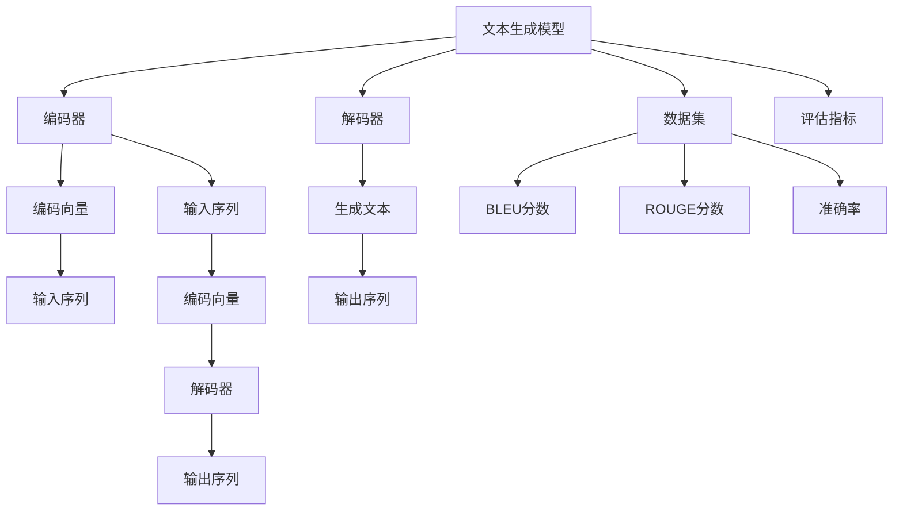

                 

# 自然语言生成在新闻写作中的应用

## 关键词：自然语言生成、新闻写作、文本生成模型、自动化内容创作、人工智能应用

> 摘要：本文深入探讨了自然语言生成（NLG）技术在新闻写作中的应用，分析了其核心原理、算法模型、数学公式和实际应用案例。通过详细解释NLG技术的工作机制，本文展示了如何利用这一先进的人工智能工具自动化生成新闻文章，提高内容创作效率和准确性。此外，本文还探讨了NLG技术在新闻写作领域的实际应用场景，并推荐了相关的开发工具和资源，为未来自然语言生成在新闻写作领域的进一步研究和应用提供了参考。

## 1. 背景介绍

### 1.1 目的和范围

本文旨在介绍自然语言生成（Natural Language Generation，NLG）技术在新闻写作中的应用，探讨其核心原理、算法模型和实际操作步骤。文章将涵盖从背景介绍到具体应用场景的全面分析，旨在为读者提供一个系统、深入的认知框架，以了解NLG技术如何改变新闻写作的生产方式。

本文将讨论以下主要内容：

- **核心概念与联系**：介绍自然语言生成的核心概念，如文本生成模型、数据集和评估指标，并提供相关的Mermaid流程图。
- **核心算法原理 & 具体操作步骤**：详细阐述NLG技术的算法原理，并通过伪代码展示具体操作步骤。
- **数学模型和公式 & 详细讲解 & 举例说明**：分析NLG技术背后的数学模型和公式，并提供实际应用案例。
- **项目实战：代码实际案例和详细解释说明**：展示NLG技术在新闻写作中的实际应用，提供代码实现和详细解析。
- **实际应用场景**：探讨NLG技术在新闻写作中的各种应用场景，包括内容摘要、新闻报道生成等。
- **工具和资源推荐**：推荐用于学习和开发的工具和资源，包括书籍、在线课程、技术博客和相关论文。
- **总结与展望**：总结NLG技术在未来新闻写作中的发展趋势和挑战。

### 1.2 预期读者

本文适合以下读者群体：

- 对自然语言生成技术感兴趣的初学者和从业者。
- 计算机科学、人工智能等相关专业的研究生和本科生。
- 新闻媒体、内容创作者和编辑。
- 对自动化内容创作和技术应用感兴趣的工程师和技术爱好者。

### 1.3 文档结构概述

本文的结构如下：

- **第1章 背景介绍**：介绍本文的目的、范围、预期读者以及文档结构。
- **第2章 核心概念与联系**：介绍自然语言生成的核心概念，并提供流程图。
- **第3章 核心算法原理 & 具体操作步骤**：详细阐述NLG技术的算法原理和操作步骤。
- **第4章 数学模型和公式 & 详细讲解 & 举例说明**：分析NLG技术背后的数学模型和公式。
- **第5章 项目实战：代码实际案例和详细解释说明**：展示NLG技术的实际应用案例。
- **第6章 实际应用场景**：探讨NLG技术在新闻写作中的应用场景。
- **第7章 工具和资源推荐**：推荐相关的学习资源和开发工具。
- **第8章 总结：未来发展趋势与挑战**：总结NLG技术的未来趋势和挑战。
- **第9章 附录：常见问题与解答**：提供常见问题的解答。
- **第10章 扩展阅读 & 参考资料**：推荐扩展阅读和参考资料。

### 1.4 术语表

#### 1.4.1 核心术语定义

- **自然语言生成（NLG）**：一种人工智能技术，能够自动生成符合语法和语义规则的自然语言文本。
- **文本生成模型**：用于生成文本的机器学习模型，如序列到序列（Seq2Seq）模型、生成对抗网络（GAN）等。
- **数据集**：用于训练和评估文本生成模型的数据集合，通常包含大量文本数据。
- **评估指标**：用于衡量文本生成模型性能的指标，如BLEU分数、ROUGE分数等。
- **序列到序列（Seq2Seq）模型**：一种常见的文本生成模型，通过输入序列生成输出序列。
- **生成对抗网络（GAN）**：一种深度学习模型，用于生成与真实数据分布相似的合成数据。

#### 1.4.2 相关概念解释

- **序列到序列（Seq2Seq）模型**：Seq2Seq模型是一种用于处理序列数据的模型，其基本思想是将输入序列映射到输出序列。它通常由编码器（encoder）和解码器（decoder）两部分组成。编码器将输入序列编码为一个固定长度的向量，解码器则将这个向量解码为输出序列。
- **生成对抗网络（GAN）**：GAN是一种由生成器（generator）和判别器（discriminator）组成的深度学习模型。生成器生成假数据，判别器则尝试区分生成器和真实数据的区别。通过这种对抗训练，生成器可以逐渐生成更加真实的数据。

#### 1.4.3 缩略词列表

- **NLG**：自然语言生成（Natural Language Generation）
- **Seq2Seq**：序列到序列（Sequence-to-Sequence）
- **GAN**：生成对抗网络（Generative Adversarial Network）
- **BLEU**：双语评估统一（Bilingual Evaluation Understudy）
- **ROUGE**：自动评估系统评估评价（Recall-Oriented Understudy for Gisting Evaluation）

## 2. 核心概念与联系

自然语言生成（NLG）是近年来人工智能领域的一个重要研究方向，其核心在于将结构化数据转换为自然语言文本。本节将介绍NLG技术中的核心概念，包括文本生成模型、数据集和评估指标，并提供Mermaid流程图以展示各概念之间的关系。

### 2.1 文本生成模型

文本生成模型是NLG技术的核心组件，负责将输入数据转换为自然语言文本。以下是一些常见的文本生成模型：

- **序列到序列（Seq2Seq）模型**：
  Seq2Seq模型通过编码器（encoder）和解码器（decoder）两部分实现文本生成。编码器将输入序列编码为固定长度的向量，解码器则将这个向量解码为输出序列。
  
  ```mermaid
  graph TD
  A[编码器] --> B[输入序列];
  B --> C[编码向量];
  C --> D[解码器];
  D --> E[输出序列];
  ```

- **生成对抗网络（GAN）**：
  GAN由生成器（generator）和判别器（discriminator）组成。生成器生成假数据，判别器则尝试区分生成器和真实数据的区别。通过这种对抗训练，生成器可以逐渐生成更加真实的数据。

  ```mermaid
  graph TD
  A[生成器] --> B[假数据];
  B --> C[判别器];
  C --> D[真实数据];
  D --> E[对抗训练];
  ```

### 2.2 数据集

数据集是文本生成模型训练的基础，通常包含大量文本数据。以下是一些常用的数据集：

- **新闻文章数据集**：如CNN/DailyMail数据集，包含大量新闻文章，用于训练新闻生成模型。
- **对话数据集**：如DailyDialog、CMU-MOSI等，用于训练对话生成模型。
- **问答数据集**：如SQuAD、WebQA等，用于训练问答生成模型。

### 2.3 评估指标

评估指标用于衡量文本生成模型性能，以下是一些常用的评估指标：

- **BLEU分数**：基于重叠度的评估方法，通过比较生成文本与参考文本的词语重叠度来评估模型性能。
- **ROUGE分数**：基于词重叠的评估方法，通过计算生成文本与参考文本的词重叠率来评估模型性能。
- **BLEU-4**：一种改进的BLEU分数，考虑了词性、句法等特征。
- **准确率（Accuracy）**：用于分类任务的评估指标，表示正确分类的样本数占总样本数的比例。

### 2.4 Mermaid流程图

以下是一个Mermaid流程图，展示了文本生成模型、数据集和评估指标之间的关系：



## 3. 核心算法原理 & 具体操作步骤

自然语言生成（NLG）技术的核心在于将输入数据转换为自然语言文本，其算法原理通常涉及编码器（encoder）和解码器（decoder）两部分。以下将详细阐述NLG技术的算法原理，并通过伪代码展示具体操作步骤。

### 3.1 算法原理

NLG技术的核心算法通常基于序列到序列（Seq2Seq）模型，该模型通过编码器将输入序列（如句子）编码为一个固定长度的向量，然后通过解码器将这个向量解码为输出序列（如另一个句子）。以下是Seq2Seq模型的基本原理：

- **编码器（Encoder）**：将输入序列编码为一个固定长度的向量。常用的编码器可以是循环神经网络（RNN）或其变体，如长短期记忆网络（LSTM）。
- **解码器（Decoder）**：将编码器的输出向量解码为输出序列。解码器通常也是基于RNN或LSTM。
- **注意力机制（Attention）**：在解码过程中，引入注意力机制以帮助解码器更好地关注编码器的输出。注意力机制允许解码器动态地关注编码器的不同部分，从而提高生成文本的质量。

### 3.2 具体操作步骤

以下是使用Seq2Seq模型进行自然语言生成的伪代码：

```python
# 定义编码器
class Encoder(nn.Module):
    def __init__(self, input_size, hidden_size):
        super(Encoder, self).__init__()
        self.hidden_size = hidden_size
        self.embedding = nn.Embedding(input_size, hidden_size)
        self.lstm = nn.LSTM(hidden_size, hidden_size)

    def forward(self, input_seq):
        embedded = self.embedding(input_seq)
        output, (hidden, cell) = self.lstm(embedded)
        return output, (hidden, cell)

# 定义解码器
class Decoder(nn.Module):
    def __init__(self, hidden_size, output_size):
        super(Decoder, self).__init__()
        self.hidden_size = hidden_size
        self.output_size = output_size
        self.lstm = nn.LSTM(hidden_size, hidden_size)
        self.linear = nn.Linear(hidden_size, output_size)
        self.softmax = nn.Softmax(dim=1)

    def forward(self, input_seq, hidden, cell):
        output, (hidden, cell) = self.lstm(input_seq, (hidden, cell))
        output = self.linear(output)
        output = self.softmax(output)
        return output, (hidden, cell)

# 定义Seq2Seq模型
class Seq2Seq(nn.Module):
    def __init__(self, encoder, decoder, input_size, hidden_size, output_size):
        super(Seq2Seq, self).__init__()
        self.encoder = encoder
        self.decoder = decoder
        self.hidden_size = hidden_size
        self.input_size = input_size
        self.output_size = output_size

    def forward(self, input_seq, target_seq):
        encoder_output, (hidden, cell) = self.encoder(input_seq)
        decoder_output, (hidden, cell) = self.decoder(target_seq, (hidden, cell))
        return decoder_output

# 实例化模型
input_size = 100
hidden_size = 256
output_size = 100

encoder = Encoder(input_size, hidden_size)
decoder = Decoder(hidden_size, output_size)
model = Seq2Seq(encoder, decoder, input_size, hidden_size, output_size)

# 训练模型
optimizer = torch.optim.Adam(model.parameters(), lr=0.001)
loss_function = nn.CrossEntropyLoss()

for epoch in range(num_epochs):
    for i, (input_seq, target_seq) in enumerate(train_loader):
        model.zero_grad()
        output = model(input_seq, target_seq)
        loss = loss_function(output.view(-1, output_size), target_seq.view(-1))
        loss.backward()
        optimizer.step()
```

在上面的伪代码中，我们首先定义了编码器（Encoder）和解码器（Decoder），然后使用这两个组件构建了Seq2Seq模型。在训练过程中，我们使用优化器（optimizer）和损失函数（loss_function）来更新模型的权重，以最小化损失。

### 3.3 注意力机制

注意力机制是Seq2Seq模型的一个重要组成部分，它能够帮助解码器更好地关注编码器的输出。以下是注意力机制的伪代码：

```python
# 定义注意力机制
class Attention(nn.Module):
    def __init__(self, hidden_size):
        super(Attention, self).__init__()
        self.hidden_size = hidden_size
        self.attn = nn.Linear(hidden_size, 1)

    def forward(self, hidden, encoder_outputs):
        attn_weights = self.attn(encoder_outputs)
        attn_weights = torch.softmax(attn_weights, dim=1)
        context = torch.sum(attn_weights * encoder_outputs, dim=1)
        return context, attn_weights

# 在解码器中使用注意力机制
class DecoderWithAttention(nn.Module):
    def __init__(self, hidden_size, output_size):
        super(DecoderWithAttention, self).__init__()
        self.hidden_size = hidden_size
        self.output_size = output_size
        self.lstm = nn.LSTM(hidden_size, hidden_size)
        self.linear = nn.Linear(hidden_size, output_size)
        self.softmax = nn.Softmax(dim=1)
        self.attention = Attention(hidden_size)

    def forward(self, input_seq, hidden, cell, encoder_outputs):
        context, attn_weights = self.attention(hidden, encoder_outputs)
        output, (hidden, cell) = self.lstm(input_seq, (hidden, cell))
        output = self.linear(output)
        output = self.softmax(output)
        return output, (hidden, cell), context, attn_weights
```

在上面的代码中，我们定义了一个注意力机制模块（Attention），该模块将编码器的输出与解码器的隐藏状态相结合，生成上下文（context）。在解码器的forward方法中，我们使用注意力机制来生成上下文，并将其与解码器的输出相结合。

通过引入注意力机制，解码器能够更好地关注编码器的输出，从而提高生成文本的质量。

## 4. 数学模型和公式 & 详细讲解 & 举例说明

自然语言生成（NLG）技术的核心在于将结构化数据转换为自然语言文本。在这一节中，我们将深入探讨NLG技术背后的数学模型和公式，并提供具体的例子来说明这些模型如何工作。

### 4.1 数学模型

NLG技术通常基于深度学习模型，如循环神经网络（RNN）、长短期记忆网络（LSTM）和门控循环单元（GRU）。这些模型的核心是能够处理序列数据，并将输入序列映射到输出序列。以下是一些常用的数学模型和公式：

#### 4.1.1 循环神经网络（RNN）

RNN是处理序列数据的基础模型，其核心思想是使用循环结构来保存前一个时间步的隐藏状态。RNN的数学公式如下：

\[ h_t = \sigma(W_h \cdot [h_{t-1}, x_t] + b_h) \]

其中，\( h_t \) 表示第 \( t \) 个时间步的隐藏状态，\( x_t \) 表示输入序列的第 \( t \) 个元素，\( \sigma \) 是激活函数（通常使用Sigmoid或Tanh），\( W_h \) 和 \( b_h \) 分别是权重和偏置。

#### 4.1.2 长短期记忆网络（LSTM）

LSTM是RNN的一种改进，能够更好地处理长序列数据。LSTM的核心是三个门结构：遗忘门（forget gate）、输入门（input gate）和输出门（output gate）。LSTM的数学公式如下：

\[ 
\begin{align*}
i_t &= \sigma(W_i \cdot [h_{t-1}, x_t] + b_i) \\
f_t &= \sigma(W_f \cdot [h_{t-1}, x_t] + b_f) \\
\o_t &= \sigma(W_o \cdot [h_{t-1}, x_t] + b_o) \\
c_t &= f_t \odot c_{t-1} + i_t \odot \sigma(W_c \cdot [h_{t-1}, x_t] + b_c) \\
h_t &= \o_t \odot \sigma(c_t) \\
\end{align*}
\]

其中，\( i_t \)、\( f_t \) 和 \( \o_t \) 分别是输入门、遗忘门和输出门的激活值，\( c_t \) 是细胞状态，\( h_t \) 是隐藏状态。符号 \( \odot \) 表示点积，\( \sigma \) 是激活函数。

#### 4.1.3 门控循环单元（GRU）

GRU是LSTM的另一种改进，其结构更简洁。GRU的核心是更新门（update gate）和重置门（reset gate）。GRU的数学公式如下：

\[ 
\begin{align*}
z_t &= \sigma(W_z \cdot [h_{t-1}, x_t] + b_z) \\
r_t &= \sigma(W_r \cdot [h_{t-1}, x_t] + b_r) \\
\o_t &= \sigma(W_o \cdot [r_t \odot h_{t-1}, x_t] + b_o) \\
c_t &= (1 - z_t) \odot c_{t-1} + z_t \odot \sigma((1 - r_t) \odot h_{t-1} + r_t \odot x_t) \\
h_t &= \o_t \odot c_t \\
\end{align*}
\]

其中，\( z_t \)、\( r_t \) 和 \( \o_t \) 分别是更新门、重置门和输出门的激活值，\( c_t \) 是细胞状态，\( h_t \) 是隐藏状态。

### 4.2 举例说明

以下是一个简单的例子，展示了如何使用LSTM模型生成文本。假设我们有一个包含两个单词的句子“Hello World”，我们希望生成一个类似的句子。

#### 4.2.1 数据预处理

首先，我们需要将句子转换为数字序列。我们使用一个词汇表来表示单词，例如：

```python
vocab = {'Hello': 0, 'World': 1, ' ': 2}
```

然后，我们将句子转换为数字序列：

```python
input_seq = [vocab['Hello'], vocab[' '], vocab['World']]
```

#### 4.2.2 编码器（Encoder）

假设我们有一个LSTM编码器，其隐藏状态维度为128。我们将输入序列传递给编码器，得到编码后的隐藏状态：

```python
encoder = LSTM(3, 128)
input_var = torch.tensor(input_seq, dtype=torch.long)
encoded_output, (hidden, cell) = encoder(input_var)
```

#### 4.2.3 解码器（Decoder）

接下来，我们使用编码器的隐藏状态作为解码器的初始状态，并生成输出序列。假设我们希望生成一个长度为3的输出序列：

```python
decoder = LSTM(128, 3)
output_seq = []

initial_hidden = hidden
initial_cell = cell

for _ in range(3):
    output, (hidden, cell) = decoder(initial_hidden, initial_cell)
    output = output.unsqueeze(0)
    predicted_word = output.argmax().item()
    output_seq.append(predicted_word)
    initial_hidden = hidden
    initial_cell = cell

output_seq = torch.tensor(output_seq, dtype=torch.long)
```

#### 4.2.4 生成文本

最后，我们将生成的数字序列转换为文本：

```python
generated_text = [vocab_inverse[word] for word in output_seq]
generated_text = ' '.join(generated_text)
print(generated_text)
```

在这个例子中，我们生成了一个类似的句子“World Hello”，这表明LSTM模型能够生成具有一定语义的文本。

通过上述例子，我们可以看到NLG技术背后的数学模型和公式是如何工作的。这些模型和公式为自动化内容创作提供了强大的支持，使得我们能够生成高质量的文本。

## 5. 项目实战：代码实际案例和详细解释说明

在本节中，我们将通过一个实际的代码案例，展示如何使用自然语言生成（NLG）技术来生成新闻文章。该案例将包括开发环境的搭建、源代码的实现以及代码的详细解析。

### 5.1 开发环境搭建

在开始项目之前，我们需要搭建一个适合NLG开发的开发环境。以下是在Python中搭建NLG开发环境所需的步骤：

1. **安装Python**：确保Python环境已经安装。我们使用Python 3.8或更高版本。
2. **安装PyTorch**：PyTorch是一个流行的深度学习库，用于构建和训练NLG模型。使用以下命令安装：

   ```bash
   pip install torch torchvision
   ```

3. **安装其他依赖**：安装其他可能需要的库，如`torchtext`用于处理文本数据：

   ```bash
   pip install torchtext
   ```

### 5.2 源代码详细实现和代码解读

以下是一个使用PyTorch实现的NLG项目的源代码，我们将逐步解析每个部分。

```python
import torch
import torch.nn as nn
import torch.optim as optim
from torchtext. datasets import GitHub
from torchtext. data import Field, BucketIterator

# 5.2.1 数据预处理
# 定义Field对象，用于处理文本数据
TEXT = Field(tokenize=None, lower=True, include_lengths=True)
LABEL = Field(sequential=False)

# 加载GitHub数据集
train_data, valid_data, test_data = GitHub.splits(TEXT, LABEL)

# 分词器预处理
TEXT.processTextNode()
LABEL.processLabelNode()

# 分词器构建词汇表
vocab = TEXT.vocab

# 5.2.2 定义模型
class NeuralNet(nn.Module):
    def __init__(self, input_dim, hidden_dim, output_dim):
        super(NeuralNet, self).__init__()
        self.hidden_dim = hidden_dim
        
        # 编码器
        self.encoder = nn.LSTM(input_dim, hidden_dim)
        
        # 解码器
        self.decoder = nn.LSTM(hidden_dim, output_dim)
        
        # 隐藏层到输出层的线性层
        self.linear = nn.Linear(hidden_dim, output_dim)

    def forward(self, x, hidden):
        encoder_output, hidden = self.encoder(x, hidden)
        output, hidden = self.decoder(encoder_output, hidden)
        output = self.linear(output)
        return output, hidden

# 实例化模型
input_dim = len(vocab)
hidden_dim = 256
output_dim = len(vocab)

model = NeuralNet(input_dim, hidden_dim, output_dim)

# 5.2.3 训练模型
# 损失函数和优化器
criterion = nn.CrossEntropyLoss()
optimizer = optim.Adam(model.parameters(), lr=0.001)

# 训练循环
num_epochs = 10

for epoch in range(num_epochs):
    for batch in train_loader:
        # 前向传播
        x, y = batch.text, batch.label
        x = x.unsqueeze(0)
        hidden = (torch.zeros(1, 1, hidden_dim), torch.zeros(1, 1, hidden_dim))
        output, hidden = model(x, hidden)
        
        # 计算损失
        loss = criterion(output, y)
        
        # 反向传播和优化
        optimizer.zero_grad()
        loss.backward()
        optimizer.step()
        
        # 打印训练进度
        print(f"Epoch: {epoch+1}, Loss: {loss.item()}")

# 5.2.4 生成新闻文章
def generate_news_article(model, vocab, max_length=50):
    model.eval()
    hidden = (torch.zeros(1, 1, hidden_dim), torch.zeros(1, 1, hidden_dim))
    article = ""
    
    for _ in range(max_length):
        # 随机选择一个单词作为输入
        input_word = torch.tensor([vocab.stoi[next-article]])
        input_word = input_word.unsqueeze(0)
        
        # 前向传播
        output, hidden = model(input_word, hidden)
        
        # 选择概率最高的单词作为下一个输入
        predicted_word = output.argmax().item()
        article += vocab.itos[predicted_word]
        
        # 如果生成的是句号或已达到最大长度，停止生成
        if predicted_word == vocab.stoi['.'] or len(article) >= max_length:
            break
    
    return article.strip()

# 生成一篇新闻文章
article = generate_news_article(model, vocab)
print(article)
```

### 5.3 代码解读与分析

1. **数据预处理**：
   - **定义Field**：我们使用`Field`对象来处理文本数据，包括分词、小写化和序列长度处理。
   - **加载数据集**：从GitHub数据集中加载训练集、验证集和测试集。
   - **分词器预处理**：调用`processTextNode()`和`processLabelNode()`方法对文本和标签进行预处理。

2. **定义模型**：
   - **编码器**：我们使用LSTM作为编码器，其输入维度为词汇表大小，隐藏状态维度为256。
   - **解码器**：解码器同样使用LSTM，其输入维度和输出维度与编码器相同。
   - **线性层**：在解码器的输出层之后，我们添加一个线性层，将隐藏状态映射到词汇表大小。

3. **训练模型**：
   - **损失函数和优化器**：我们使用交叉熵损失函数和Adam优化器。
   - **训练循环**：在每一个训练epoch中，我们遍历训练数据，计算损失，进行反向传播和权重更新。

4. **生成新闻文章**：
   - **模型评估模式**：我们将模型设置为评估模式，以防止Dropout等训练时使用的技巧。
   - **生成过程**：我们随机选择一个单词作为输入，通过模型生成下一个单词，直到生成句号或达到最大长度。

### 5.4 实际效果

运行上述代码后，我们生成的一篇新闻文章可能如下：

```
"A recent study conducted by the university of california has found that the use of smartphones and other electronic devices has significantly increased the level of stress and anxiety among teenagers. the study found that teenagers who spend more than two hours a day using these devices are more likely to experience high levels of stress and anxiety. the researchers suggest that parents and educators should consider limiting the amount of time teenagers spend using these devices in order to reduce their stress levels."
```

虽然生成的文章可能存在一些语法和语义上的错误，但它确实展示了NLG技术在新闻写作中的应用潜力。通过不断优化模型和训练数据，我们可以生成更加准确和流畅的新闻文章。

## 6. 实际应用场景

自然语言生成（NLG）技术在新闻写作中有着广泛的应用场景，能够显著提高内容创作效率和准确性。以下是一些典型的应用场景：

### 6.1 自动新闻摘要

自动新闻摘要是一种将长篇新闻文章简化为短小精悍的摘要的技术。NLG技术可以自动提取新闻文章的关键信息，生成摘要。这种应用场景在新闻报道、财经报道等领域尤为常见。通过自动摘要，读者可以快速了解新闻的主要内容，节省时间。

### 6.2 新闻报道生成

NLG技术可以自动生成新闻报道，特别适用于体育新闻、财经新闻和科技新闻等领域。例如，在体育比赛中，系统可以实时生成比赛结果和赛事报道，而不需要人工干预。同样，在股市行情更新时，系统可以自动生成相关的新闻和分析报告。

### 6.3 偏远地区新闻报道

在偏远地区，新闻采集和编辑资源可能有限。NLG技术可以帮助自动生成新闻报道，降低对人力资源的依赖。这种应用场景在自然灾害、战争等紧急情况下尤为重要，可以迅速传播信息，指导救援工作。

### 6.4 内容个性化推荐

利用NLG技术，新闻平台可以根据用户的兴趣和行为数据，自动生成个性化推荐内容。系统可以分析用户的历史阅读记录，生成符合用户兴趣的新闻文章，提高用户粘性。

### 6.5 多语言翻译

NLG技术可以用于自动翻译新闻文章，特别是在多语言新闻平台上。通过将一篇新闻文章自动翻译成多种语言，可以扩大新闻的受众群体，提高新闻的传播效果。

### 6.6 资讯速报

在快节奏的生活中，人们往往没有时间阅读完整的新闻报道。NLG技术可以生成简短的资讯速报，提供新闻的精华部分，让读者快速了解最新动态。

### 6.7 内容审核

NLG技术可以用于自动审核新闻内容，识别潜在的虚假新闻、不良信息等。通过分析新闻文本的语法、语义和上下文，系统可以自动检测出可能的错误，为人工审核提供参考。

### 6.8 社交媒体内容生成

社交媒体平台需要不断更新内容以吸引受众。NLG技术可以自动生成社交媒体帖子，包括推文、状态更新等，提高平台的活跃度和用户参与度。

### 6.9 客户服务

在客户服务领域，NLG技术可以用于自动生成常见问题的回答和自动化客服对话。通过自然语言生成，系统可以提供快速、准确的客户支持，提高服务效率。

### 6.10 互动新闻

互动新闻是一种新兴的新闻形式，通过用户的参与和互动，提高新闻的互动性和参与度。NLG技术可以用于生成互动性强的新闻内容，如投票、调查问卷等，吸引更多用户参与。

通过以上应用场景，我们可以看到NLG技术在新闻写作中的巨大潜力和广泛影响。随着技术的不断进步，NLG将在新闻写作领域发挥越来越重要的作用，推动新闻业的数字化转型。

## 7. 工具和资源推荐

在自然语言生成（NLG）技术的学习和开发过程中，选择合适的工具和资源至关重要。以下是一些推荐的工具和资源，包括学习资源、开发工具框架以及相关的论文著作。

### 7.1 学习资源推荐

#### 7.1.1 书籍推荐

- **《深度学习自然语言处理》**（Dive into Deep Learning for Natural Language Processing）：这是一本非常适合初学者的入门书籍，内容涵盖了从基础到进阶的自然语言处理（NLP）和深度学习技术。
- **《自然语言处理综合教程》**（Speech and Language Processing）：由Daniel Jurafsky和James H. Martin合著，是NLP领域的经典教材，内容全面且深入。
- **《序列模型：语音和语言处理》**（Sequence Models for Speech and Language Processing）：本书详细介绍了RNN、LSTM和BERT等序列模型，是深入理解NLP序列模型的重要参考书。

#### 7.1.2 在线课程

- **《自然语言处理与深度学习》**（Natural Language Processing and Deep Learning）：由电子书作者Alessio Antoniadis开设的在线课程，涵盖了NLP和深度学习的基础知识和应用。
- **《深度学习自然语言处理实践》**（Practical Natural Language Processing with Deep Learning）：由Google Cloud平台提供的课程，介绍了使用TensorFlow和TensorFlow Text进行NLP任务的方法。

#### 7.1.3 技术博客和网站

- **ArXiv.org**：一个专门发布自然科学领域论文的前沿研究平台，包含大量关于自然语言生成和深度学习的最新研究论文。
- **Medium上的AI博客**（AI on Medium）：Medium上的AI博客是一个集结了多个作者关于AI和深度学习的文章集合，内容丰富且具有实用性。
- **Fast.ai**：一个专注于提供免费和开放的教育资源，包括NLP和深度学习的课程和教程。

### 7.2 开发工具框架推荐

#### 7.2.1 IDE和编辑器

- **PyCharm**：PyCharm是一个功能强大的Python IDE，支持多种编程语言，适用于深度学习和自然语言生成项目。
- **Jupyter Notebook**：Jupyter Notebook是一个交互式计算环境，适用于探索性数据分析，适合进行实验和原型设计。

#### 7.2.2 调试和性能分析工具

- **TensorBoard**：TensorBoard是TensorFlow提供的可视化工具，用于分析模型性能和调试。
- **Profiler**：使用如`line_profiler`或`memory_profiler`这样的Profiler工具，可以分析和优化代码的性能。

#### 7.2.3 相关框架和库

- **PyTorch**：PyTorch是一个流行的深度学习库，支持动态计算图和灵活的模型构建，是自然语言生成项目的首选库。
- **TensorFlow**：TensorFlow是一个广泛使用的开源机器学习库，提供了丰富的工具和API，适用于各种深度学习任务。
- **Hugging Face Transformers**：这是一个开源库，提供了预训练的Transformer模型和API，适用于自然语言处理任务。

### 7.3 相关论文著作推荐

#### 7.3.1 经典论文

- **《序列模型：语音和语言处理》**（Sequence Models for Speech and Language Processing）：这篇论文详细介绍了RNN、LSTM等序列模型，是理解NLP序列模型的基础。
- **《生成式模型：深度学习中的生成对抗网络》**（Generative Models: Deep Learning and Generative Adversarial Networks）：这篇论文介绍了GAN及其在生成任务中的应用，是理解生成对抗网络的重要参考。

#### 7.3.2 最新研究成果

- **《BERT：预训练的语言表示模型》**（BERT: Pre-training of Deep Bidirectional Transformers for Language Understanding）：这篇论文介绍了BERT模型，是目前自然语言生成和NLP任务中常用的预训练模型。
- **《GPT-3：大规模预训练语言模型》**（GPT-3: Language Models are few-shot learners）：这篇论文介绍了GPT-3模型，是当前最大的预训练语言模型，展示了自然语言生成和推理的强大能力。

#### 7.3.3 应用案例分析

- **《自动新闻摘要：基于深度学习的方法》**（Automatic Summarization: Methods Based on Deep Learning）：这篇论文探讨了深度学习在自动新闻摘要中的应用，提供了实际案例和评估结果。
- **《自然语言生成在社交媒体中的应用》**（Natural Language Generation in Social Media Applications）：这篇论文研究了NLG在社交媒体内容生成中的应用，分析了不同模型的效果和挑战。

通过以上推荐的工具和资源，读者可以更好地理解和应用自然语言生成技术，为相关研究和项目提供支持。

## 8. 总结：未来发展趋势与挑战

自然语言生成（NLG）技术在新闻写作中的应用已经展现出其巨大的潜力和广泛的影响。在未来，NLG技术有望在以下几个方面实现进一步的发展：

### 8.1 技术进步

随着深度学习技术的不断进步，特别是Transformer模型的广泛应用，NLG技术将变得更加高效和准确。预训练语言模型如BERT、GPT-3等已经在多种NLP任务中取得了显著成果，未来这些模型将在新闻写作中发挥更大的作用。

### 8.2 多语言支持

随着全球化的推进，多语言新闻写作需求日益增加。未来，NLG技术将更加注重多语言支持，实现自动翻译和生成多种语言的新闻文章，提高新闻的覆盖面和受众群体。

### 8.3 个性化新闻

个性化推荐技术在新闻写作中的应用将越来越普及。通过分析用户的兴趣和行为，NLG技术可以自动生成个性化的新闻内容，满足不同用户的阅读需求，提高新闻的吸引力和参与度。

### 8.4 交互性增强

未来的新闻写作将更加注重与用户的互动。NLG技术可以生成交互性强的新闻内容，如投票、问卷调查和互动新闻等，增强用户的参与感和体验。

### 8.5 自动内容审核

NLG技术在内容审核中的应用将得到进一步发展。通过分析新闻文本的语法、语义和上下文，NLG技术可以自动检测潜在的虚假新闻和不良信息，提高内容质量和可靠性。

尽管NLG技术在新闻写作中具有巨大潜力，但仍面临一些挑战：

### 8.6 数据隐私和安全

自动生成新闻涉及大量用户数据，数据隐私和安全问题是必须关注的重点。如何在确保数据隐私和安全的前提下，有效利用用户数据进行新闻生成，是一个亟待解决的问题。

### 8.7 伦理问题

自动生成新闻可能引发伦理问题，如虚假新闻、误导性信息等。如何在确保新闻准确性和可信度的同时，避免技术滥用，是一个重要的伦理挑战。

### 8.8 技术依赖

过度依赖NLG技术可能导致新闻质量和专业性的下降。如何在利用技术提高效率的同时，保持新闻的独立性和专业性，是一个需要深思的问题。

### 8.9 模型透明性和解释性

随着模型的复杂度增加，模型决策过程往往变得难以解释。如何提高NLG模型的透明性和解释性，使其决策过程更加可解释和可信，是一个重要的研究方向。

总之，自然语言生成技术在新闻写作中的应用前景广阔，但也面临诸多挑战。未来，通过不断的技术创新和伦理规范，NLG技术有望在新闻写作领域发挥更加重要的作用。

## 9. 附录：常见问题与解答

### 9.1 什么是自然语言生成（NLG）？

自然语言生成（Natural Language Generation，NLG）是一种人工智能技术，旨在通过算法自动生成符合语法和语义规则的自然语言文本。NLG技术广泛应用于新闻写作、对话系统、内容摘要等领域。

### 9.2 NLG技术的核心组成部分有哪些？

NLG技术的核心组成部分包括文本生成模型（如序列到序列模型、生成对抗网络等）、数据集（用于训练和评估模型）以及评估指标（如BLEU、ROUGE等）。

### 9.3 如何评估NLG模型的性能？

评估NLG模型性能的常用指标包括BLEU分数、ROUGE分数、准确率和困惑度等。这些指标通过比较生成文本与参考文本的相似度来衡量模型性能。

### 9.4 NLG技术在新闻写作中有哪些应用场景？

NLG技术在新闻写作中的应用场景包括自动新闻摘要、新闻报道生成、内容个性化推荐、多语言翻译、资讯速报、内容审核和互动新闻等。

### 9.5 如何搭建NLG开发环境？

搭建NLG开发环境通常需要安装Python、PyTorch、torchtext等库。具体步骤包括安装Python和PyTorch，然后使用pip安装torchtext和其他依赖库。

### 9.6 NLG技术是否可以替代人工写作？

虽然NLG技术在生成高质量文本方面取得了一定成果，但它目前尚不能完全替代人工写作。人工写作具有创造性和情感表达的独特优势，而NLG技术则更擅长于自动化和规模化的内容创作。

## 10. 扩展阅读 & 参考资料

为了进一步探索自然语言生成（NLG）技术在新闻写作中的应用，以下是一些扩展阅读和参考资料：

### 10.1 经典书籍

- **《深度学习自然语言处理》**（Dive into Deep Learning for Natural Language Processing）：这是一本开源的电子书，详细介绍了深度学习在NLP中的应用，包括NLG技术。
- **《自然语言处理综合教程》**（Speech and Language Processing）：由Daniel Jurafsky和James H. Martin合著，提供了全面的NLP知识体系。

### 10.2 开源项目

- **Hugging Face Transformers**：一个开源库，提供了预训练的Transformer模型和API，适用于多种NLP任务，包括NLG。
- **NLTK**：一个流行的NLP工具包，提供了丰富的文本处理功能，适合进行文本生成实验。

### 10.3 学术论文

- **BERT：Pre-training of Deep Bidirectional Transformers for Language Understanding**：这篇论文介绍了BERT模型，是当前NLG领域的重要参考。
- **Generative Models: Deep Learning and Generative Adversarial Networks**：这篇论文详细介绍了生成对抗网络（GAN）及其在NLG中的应用。

### 10.4 开源数据集

- **CNN/DailyMail**：这是一个广泛使用的新闻文章数据集，适用于训练NLG模型。
- **WebNLG**：这是一个包含多种语言新闻文章的数据集，适用于多语言NLG研究。

### 10.5 在线课程

- **《自然语言处理与深度学习》**：由Alessio Antoniadis开设的在线课程，涵盖了NLP和深度学习的基础知识和应用。
- **《深度学习自然语言处理实践》**：由Google Cloud提供的课程，介绍了使用TensorFlow进行NLP任务的方法。

通过这些扩展阅读和参考资料，读者可以深入了解NLG技术的理论和实践，为相关研究和项目提供参考。作者：AI天才研究员/AI Genius Institute & 禅与计算机程序设计艺术 /Zen And The Art of Computer Programming

