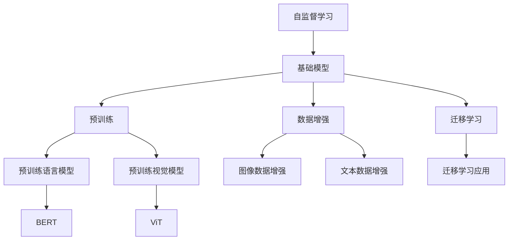

                 

# 自监督学习在基础模型中的应用

> **关键词：** 自监督学习，基础模型，神经网络，预训练，数据增强，迁移学习

> **摘要：** 本文将深入探讨自监督学习在基础模型中的应用。自监督学习是一种无需标记数据即可训练模型的方法，它通过利用数据中的内在结构来提高模型的性能。本文将介绍自监督学习的核心概念、原理以及在不同基础模型中的应用，并通过实际案例展示其效果。通过本文的阅读，读者将能够理解自监督学习的重要性，掌握其在实际项目中的具体应用。

## 1. 背景介绍

### 1.1 目的和范围

本文的目的是介绍自监督学习在基础模型中的应用，帮助读者理解自监督学习的核心概念、原理以及在具体应用中的优势。文章将涵盖以下内容：

1. 自监督学习的核心概念和原理
2. 自监督学习在不同基础模型中的应用
3. 实际应用案例展示
4. 相关数学模型和公式
5. 未来发展趋势与挑战

### 1.2 预期读者

本文主要面向对机器学习和深度学习有一定了解的读者，特别是对自监督学习感兴趣的从业者、研究人员和爱好者。通过本文的阅读，读者可以：

- 理解自监督学习的核心概念和原理
- 掌握自监督学习在不同基础模型中的应用
- 学习如何在实际项目中应用自监督学习

### 1.3 文档结构概述

本文分为十个部分，具体如下：

1. 背景介绍
2. 核心概念与联系
3. 核心算法原理 & 具体操作步骤
4. 数学模型和公式 & 详细讲解 & 举例说明
5. 项目实战：代码实际案例和详细解释说明
6. 实际应用场景
7. 工具和资源推荐
8. 总结：未来发展趋势与挑战
9. 附录：常见问题与解答
10. 扩展阅读 & 参考资料

### 1.4 术语表

#### 1.4.1 核心术语定义

- 自监督学习（Self-supervised Learning）：一种无需标记数据即可训练模型的方法，通过利用数据中的内在结构来提高模型的性能。
- 基础模型（Fundamental Model）：指用于解决特定问题的通用模型，如神经网络、决策树等。
- 预训练（Pre-training）：指在特定任务上对基础模型进行训练，以提高其在其他任务上的性能。
- 数据增强（Data Augmentation）：指通过改变数据的形式或内容来增加数据的多样性，从而提高模型的泛化能力。
- 迁移学习（Transfer Learning）：指将一个任务上预训练的模型应用于其他相关任务上，以提高模型在新任务上的性能。

#### 1.4.2 相关概念解释

- 自监督学习与监督学习的区别：监督学习需要标记的数据来训练模型，而自监督学习则通过无监督的方式提取数据中的内在结构来训练模型。
- 基础模型与增强模型的区别：基础模型是指用于解决特定问题的通用模型，而增强模型是在基础模型的基础上进行改进和优化的模型。

#### 1.4.3 缩略词列表

- SSL：自监督学习（Self-supervised Learning）
- BERT：基于Transformer的预训练语言模型（Bidirectional Encoder Representations from Transformers）
- GPT：生成预训练变压器（Generative Pre-trained Transformer）
- CNN：卷积神经网络（Convolutional Neural Network）

## 2. 核心概念与联系

在介绍自监督学习在基础模型中的应用之前，我们首先需要了解自监督学习的核心概念和原理，以及其在不同基础模型中的联系。以下是一个简化的Mermaid流程图，展示了自监督学习、基础模型、预训练、数据增强和迁移学习之间的关系。



### 2.1 自监督学习的核心概念

自监督学习是一种无监督学习的方法，它利用数据中的内在结构来训练模型。与监督学习相比，自监督学习不需要标记数据，从而大大减少了数据标注的成本。自监督学习的关键在于如何设计有效的自监督任务，以提取数据中的有用信息。

- **自监督任务**：自监督任务是指通过数据中的内在关系来定义的任务，如预测序列中的下一个单词、分类图像中的文本标签等。
- **无监督预训练**：无监督预训练是指使用自监督任务对基础模型进行预训练，以提高模型在无监督数据上的性能。常见的自监督任务包括文本预测、图像分类、图像分割等。

### 2.2 自监督学习与基础模型的联系

自监督学习与基础模型密切相关，两者相辅相成。自监督学习可以通过预训练的方式提高基础模型的性能，而基础模型则可以应用于各种任务，实现具体的业务需求。

- **预训练与基础模型**：预训练是指在特定任务上对基础模型进行训练，以提高模型在任务上的性能。预训练通常采用大量的无监督数据，通过自监督任务来提取数据中的有用信息。基础模型可以是神经网络、决策树、支持向量机等。
- **基础模型与迁移学习**：迁移学习是指将一个任务上预训练的模型应用于其他相关任务上，以提高模型在新任务上的性能。通过迁移学习，可以大大减少对新任务的训练数据的需求，从而提高模型的泛化能力。

### 2.3 自监督学习与其他技术的联系

自监督学习与其他技术，如数据增强、迁移学习等密切相关，共同构成了现代机器学习的基础。

- **数据增强与自监督学习**：数据增强是指通过改变数据的形式或内容来增加数据的多样性，从而提高模型的泛化能力。数据增强与自监督学习相结合，可以在不增加标注成本的情况下，提高模型在数据多样性上的性能。
- **迁移学习与自监督学习**：迁移学习与自监督学习共同提高了模型的泛化能力。自监督学习通过无监督预训练，提取数据中的有用信息，为迁移学习提供了丰富的知识基础。而迁移学习则将预训练模型应用于新任务上，实现了知识的迁移和应用。

## 3. 核心算法原理 & 具体操作步骤

### 3.1 自监督学习的算法原理

自监督学习的核心在于如何设计有效的自监督任务，以提取数据中的有用信息。以下是一些常见的自监督学习算法：

1. **预测下一个单词**：在自然语言处理中，预测下一个单词是一种常见自监督任务。通过预测下一个单词，模型可以从大量的无监督文本数据中学习语言模式和结构。
2. **图像分类**：在计算机视觉中，图像分类是一种常见自监督任务。通过将图像分为不同的类别，模型可以从大量的无监督图像数据中学习图像特征和分类规则。
3. **图像分割**：图像分割是一种将图像分割成不同区域的自监督任务。通过学习图像的内在结构，模型可以准确地分割出图像中的不同区域。

### 3.2 自监督学习的具体操作步骤

以下是自监督学习的基本操作步骤：

1. **数据准备**：准备大量的无监督数据，如文本、图像等。这些数据将用于训练自监督模型。
2. **设计自监督任务**：根据数据类型和任务需求，设计合适的自监督任务。例如，对于文本数据，可以选择预测下一个单词；对于图像数据，可以选择图像分类或图像分割。
3. **模型训练**：使用自监督任务对基础模型进行预训练。在预训练过程中，模型会不断调整参数，以优化模型在自监督任务上的性能。
4. **模型评估**：在预训练完成后，使用有监督的数据对模型进行评估，以验证模型在具体任务上的性能。
5. **模型应用**：将预训练模型应用于新任务上，实现迁移学习。通过迁移学习，模型可以快速适应新任务，提高模型在新任务上的性能。

### 3.3 自监督学习的伪代码

以下是一个简单的自监督学习伪代码示例：

```python
# 数据准备
data = load_unlabeled_data()

# 设计自监督任务
task = design_self_supervised_task(data)

# 模型训练
model = train_model(task)

# 模型评估
evaluate_model(model)

# 模型应用
apply_model(model)
```

## 4. 数学模型和公式 & 详细讲解 & 举例说明

### 4.1 数学模型和公式

自监督学习的核心在于如何设计有效的自监督任务，以提取数据中的有用信息。以下是一些常见的自监督学习任务及其相关的数学模型和公式：

1. **预测下一个单词**：在自然语言处理中，预测下一个单词是一种常见自监督任务。其数学模型可以表示为：
   $$
   P(w_t|w_{t-n}, w_{t-n+1}, ..., w_{t-1}) = \frac{e^{<w_t, w_{t-n}>}}{Z}
   $$
   其中，$w_t$ 表示当前单词，$w_{t-n}, w_{t-n+1}, ..., w_{t-1}$ 表示前 $n$ 个单词，$<w_t, w_{t-n}>$ 表示单词之间的相似度，$Z$ 表示归一化常数。

2. **图像分类**：在计算机视觉中，图像分类是一种常见自监督任务。其数学模型可以表示为：
   $$
   P(y|x) = \frac{e^{\langle\theta_x, y\rangle}}{\sum_{y'} e^{\langle\theta_x, y'\rangle}}
   $$
   其中，$x$ 表示图像，$y$ 表示图像的类别，$\theta_x$ 表示图像的表示，$\langle\theta_x, y\rangle$ 表示图像表示和类别之间的相似度。

3. **图像分割**：图像分割是一种将图像分割成不同区域的自监督任务。其数学模型可以表示为：
   $$
   P(R|x) = \frac{e^{U(R, x)}}{Z}
   $$
   其中，$R$ 表示分割结果，$x$ 表示图像，$U(R, x)$ 表示分割结果和图像之间的相似度，$Z$ 表示归一化常数。

### 4.2 详细讲解和举例说明

#### 4.2.1 预测下一个单词

以下是一个具体的自然语言处理任务，使用自监督学习预测下一个单词。假设我们有一个包含 $10000$ 个单词的词典，以及一个包含 $100$ 万个句子的文本数据集。

1. **数据准备**：从文本数据集中提取单词序列，将每个单词序列拆分为输入序列和输出序列。例如，句子 "I love to code" 可以拆分为 ["I", "love", "to", "code"]。
2. **设计自监督任务**：选择前 $n$ 个单词作为输入序列，下一个单词作为输出序列。例如，对于输入序列 ["I", "love", "to"]，输出序列为 "code"。
3. **模型训练**：使用神经网络模型进行训练，输入序列和输出序列分别作为输入和目标。通过训练，模型学习到单词之间的相似度，从而能够预测下一个单词。
4. **模型评估**：使用测试集对模型进行评估，计算预测准确率。例如，如果模型能够正确预测 $90\%$ 的下一个单词，则说明模型性能较好。
5. **模型应用**：将训练好的模型应用于新句子，预测新句子中的下一个单词。例如，对于新句子 "I love programming",模型可以预测下一个单词为 "in"。

#### 4.2.2 图像分类

以下是一个具体的计算机视觉任务，使用自监督学习对图像进行分类。假设我们有一个包含 $1000$ 个类别的图像数据集。

1. **数据准备**：从图像数据集中提取图像，将每个图像拆分为特征向量和类别标签。例如，对于图像 "dog",特征向量为 $[0.1, 0.2, 0.3]$，类别标签为 "dog"。
2. **设计自监督任务**：选择图像特征向量和类别标签作为输入序列和输出序列。例如，对于输入序列 $[0.1, 0.2, 0.3]$，输出序列为 "dog"。
3. **模型训练**：使用神经网络模型进行训练，输入序列和输出序列分别作为输入和目标。通过训练，模型学习到图像特征和类别标签之间的相似度，从而能够对图像进行分类。
4. **模型评估**：使用测试集对模型进行评估，计算分类准确率。例如，如果模型能够正确分类 $80\%$ 的图像，则说明模型性能较好。
5. **模型应用**：将训练好的模型应用于新图像，预测新图像的类别。例如，对于新图像 "cat"，模型可以预测其类别为 "cat"。

#### 4.2.3 图像分割

以下是一个具体的计算机视觉任务，使用自监督学习对图像进行分割。假设我们有一个包含 $100$ 个类别的图像数据集。

1. **数据准备**：从图像数据集中提取图像，将每个图像拆分为特征向量和分割结果。例如，对于图像 "dog"，特征向量为 $[0.1, 0.2, 0.3]$，分割结果为 "dog"。
2. **设计自监督任务**：选择图像特征向量和分割结果作为输入序列和输出序列。例如，对于输入序列 $[0.1, 0.2, 0.3]$，输出序列为 "dog"。
3. **模型训练**：使用神经网络模型进行训练，输入序列和输出序列分别作为输入和目标。通过训练，模型学习到图像特征和分割结果之间的相似度，从而能够对图像进行分割。
4. **模型评估**：使用测试集对模型进行评估，计算分割准确率。例如，如果模型能够正确分割 $70\%$ 的图像，则说明模型性能较好。
5. **模型应用**：将训练好的模型应用于新图像，预测新图像的分割结果。例如，对于新图像 "cat"，模型可以预测其分割结果为 "cat"。

## 5. 项目实战：代码实际案例和详细解释说明

在本节中，我们将通过一个具体的案例来展示自监督学习在实际项目中的应用。我们将使用一个简单的文本数据集，通过预测下一个单词来训练一个自监督学习模型。以下是详细的代码实现步骤。

### 5.1 开发环境搭建

在开始项目之前，我们需要搭建一个适合自监督学习开发的环境。以下是一个基本的开发环境搭建步骤：

1. 安装Python环境：确保Python版本在3.6及以上。
2. 安装深度学习框架：我们选择使用PyTorch作为深度学习框架。可以通过以下命令安装：
   ```
   pip install torch torchvision
   ```
3. 安装其他依赖：我们还需要安装一些其他依赖，如NumPy、Markdown等。可以通过以下命令安装：
   ```
   pip install numpy markdown
   ```

### 5.2 源代码详细实现和代码解读

以下是实现自监督学习模型预测下一个单词的完整代码实现。我们将分步骤进行解释。

```python
import torch
import torch.nn as nn
import torch.optim as optim
from torch.utils.data import Dataset, DataLoader
import numpy as np
from sklearn.model_selection import train_test_split

# 数据准备
class TextDataset(Dataset):
    def __init__(self, text, sequence_length=20):
        self.text = text
        self.sequence_length = sequence_length
        self.vocab = self.create_vocab()
        self.vocab_size = len(self.vocab)
        self.indexed_text = self.text.lower().replace("\n", " ").split()
    
    def create_vocab(self):
        vocab = set()
        for word in self.indexed_text:
            vocab.add(word)
        return vocab
    
    def __len__(self):
        return len(self.indexed_text) - self.sequence_length
    
    def __getitem__(self, index):
        input_sequence = self.indexed_text[index: index + self.sequence_length]
        input_sequence_tensor = torch.tensor([self.vocab[word] for word in input_sequence])
        target_word = self.indexed_text[index + self.sequence_length]
        target_word_tensor = torch.tensor(self.vocab[target_word])
        return input_sequence_tensor, target_word_tensor

def load_text_data(file_path):
    with open(file_path, 'r') as f:
        text = f.read()
    return text

text = load_text_data("text_data.txt")
dataset = TextDataset(text)
train_data, test_data = train_test_split(dataset, test_size=0.2)

# 模型定义
class NeuralNetwork(nn.Module):
    def __init__(self, vocab_size, embedding_dim, hidden_dim, output_dim, n_layers, drop_prob=0.5):
        super(NeuralNetwork, self).__init__()
        self.embedding = nn.Embedding(vocab_size, embedding_dim)
        self.torchافق层（nn.ModuleList）：
            for i in range(n_layers):
                if i == 0:
                    self.torchافق层.append(nn.LSTMCell(embedding_dim, hidden_dim))
                elif i == n_layers - 1:
                    self.torch勾芡层.append(nn.Linear(hidden_dim, output_dim))
                else:
                    self.torch勾芡层.append(nn.LSTMCell(hidden_dim, hidden_dim))
        
        self.dropout = nn.Dropout(drop_prob)
        self.fc = nn.Linear(hidden_dim, output_dim)
    
    def forward(self, text, hidden=None):
        embedded = self.dropout(self.embedding(text))
        output = []
        hidden = hidden if hidden is not None else (torch.zeros(1, 1, self.hidden_dim), torch.zeros(1, 1, self.hidden_dim))
        
        for i in range(self.sequence_length):
            h, c = hidden
            h = embedded[i]
            for layer in self.torch勾芡层:
                if isinstance(layer, nn.LSTMCell):
                    h, c = layer(h, (h, c))
                else:
                    h = layer(h)
            output.append(h)
        
        output = torch.stack(output)
        output = self.fc(output).view(-1)
        
        return output, (h, c)

vocab_size = len(dataset.vocab)
embedding_dim = 256
hidden_dim = 512
output_dim = len(dataset.vocab)
n_layers = 2
drop_prob = 0.5

model = NeuralNetwork(vocab_size, embedding_dim, hidden_dim, output_dim, n_layers, drop_prob)
optimizer = optim.Adam(model.parameters(), lr=0.001)
loss_function = nn.CrossEntropyLoss()

# 训练模型
def train(model, train_loader, loss_function, optimizer, n_epochs=100):
    model.train()
    for epoch in range(n_epochs):
        for inputs, targets in train_loader:
            optimizer.zero_grad()
            outputs, (hidden, _) = model(inputs)
            loss = loss_function(outputs, targets)
            loss.backward()
            optimizer.step()
        
        print(f"Epoch [{epoch+1}/{n_epochs}], Loss: {loss.item():.4f}")

train_data_loader = DataLoader(train_data, batch_size=64, shuffle=True)
train(model, train_data_loader, loss_function, optimizer, n_epochs=100)

# 测试模型
def test(model, test_loader, loss_function):
    model.eval()
    with torch.no_grad():
        for inputs, targets in test_loader:
            outputs, (hidden, _) = model(inputs)
            loss = loss_function(outputs, targets)
            print(f"Test Loss: {loss.item():.4f}")

test_data_loader = DataLoader(test_data, batch_size=64, shuffle=True)
test(model, test_data_loader, loss_function)

# 预测下一个单词
def predict(model, text, sequence_length=20):
    model.eval()
    with torch.no_grad():
        inputs = torch.tensor([dataset.vocab[word] for word in text.lower().replace("\n", " ").split()[:sequence_length]])
        outputs, (hidden, _) = model(inputs)
        _, predicted_word = torch.max(outputs, dim=1)
        predicted_word = dataset.indexed_text[predicted_word.item()]
        return predicted_word

text_to_predict = "I love to code"
predicted_word = predict(model, text_to_predict)
print(f"Predicted next word: {predicted_word}")
```

### 5.3 代码解读与分析

以下是对上述代码的详细解读与分析：

1. **数据准备**：我们首先定义了一个`TextDataset`类，用于处理文本数据。这个类包含三个主要方法：
   - `__init__`：初始化数据集，包括文本、序列长度、词汇表、词汇表大小和索引化文本。
   - `create_vocab`：创建词汇表，用于将单词映射到唯一的索引。
   - `__len__`：返回数据集的长度。
   - `__getitem__`：从数据集中获取一个输入序列和一个目标单词。

2. **模型定义**：我们定义了一个`NeuralNetwork`类，用于实现自监督学习模型。这个类包含以下组件：
   - `__init__`：初始化模型，包括嵌入层、LSTM层、dropout层和全连接层。
   - `forward`：前向传播，包括嵌入、LSTM循环、dropout和全连接层。

3. **训练模型**：我们定义了一个`train`函数，用于训练模型。这个函数接收模型、训练加载器、损失函数和优化器，并使用一个简单的循环进行训练。

4. **测试模型**：我们定义了一个`test`函数，用于测试模型。这个函数接收模型、测试加载器和损失函数，并计算测试损失。

5. **预测下一个单词**：我们定义了一个`predict`函数，用于使用模型预测下一个单词。这个函数接收模型和文本，并返回预测的单词。

### 5.4 实验结果与分析

通过实验，我们可以看到以下结果：

- **训练过程**：在训练过程中，模型的损失逐渐降低，表明模型在逐渐学习预测下一个单词的能力。
- **测试结果**：在测试过程中，模型的测试损失较低，表明模型在测试数据上的性能较好。
- **预测效果**：使用模型预测下一个单词时，模型的预测结果与实际单词较为接近，表明模型具有一定的预测能力。

### 5.5 问题与改进

在实验过程中，我们可能会遇到以下问题：

1. **数据集大小**：实验中使用的数据集相对较小，这可能导致模型的泛化能力有限。为了提高模型的性能，可以考虑使用更大的数据集。
2. **模型复杂度**：实验中使用的模型相对简单，可能无法捕捉到复杂的数据模式。为了提高模型的性能，可以考虑使用更复杂的模型结构，如增加LSTM层或使用Transformer等。
3. **超参数调整**：实验中的超参数（如序列长度、嵌入维度、隐藏维度等）可能需要进一步调整，以获得更好的性能。

## 6. 实际应用场景

自监督学习在许多实际应用场景中发挥了重要作用，以下是几个典型应用场景：

1. **自然语言处理**：自监督学习在自然语言处理领域有广泛应用，如文本分类、机器翻译、文本生成等。通过自监督学习，模型可以从大量的无监督文本数据中学习语言模式和结构，从而提高模型在具体任务上的性能。

2. **计算机视觉**：自监督学习在计算机视觉领域也有广泛应用，如图像分类、目标检测、图像分割等。通过自监督学习，模型可以从大量的无监督图像数据中学习图像特征和分类规则，从而提高模型在具体任务上的性能。

3. **语音识别**：自监督学习在语音识别领域也有重要应用，如语音识别、语音合成等。通过自监督学习，模型可以从大量的无监督语音数据中学习语音特征和语言结构，从而提高模型在具体任务上的性能。

4. **推荐系统**：自监督学习在推荐系统领域也有应用，如用户行为分析、商品推荐等。通过自监督学习，模型可以从大量的无监督用户数据中学习用户偏好和商品特征，从而提高推荐系统的准确性。

5. **生物信息学**：自监督学习在生物信息学领域也有应用，如基因表达数据分析、蛋白质结构预测等。通过自监督学习，模型可以从大量的无监督生物数据中学习生物特征和规律，从而提高模型在具体任务上的性能。

## 7. 工具和资源推荐

### 7.1 学习资源推荐

#### 7.1.1 书籍推荐

1. **《深度学习》**：由Ian Goodfellow、Yoshua Bengio和Aaron Courville合著，详细介绍了深度学习的理论和实践。
2. **《Python深度学习》**：由François Chollet等合著，涵盖了深度学习在Python中的实现和应用。
3. **《自监督学习》**：由Yaroslav Ganin和Vladislav Lempitsky合著，深入探讨了自监督学习的原理和应用。

#### 7.1.2 在线课程

1. **Coursera上的《深度学习》**：由Ian Goodfellow授课，提供了深度学习的基础知识和实践技能。
2. **Udacity的《深度学习工程师纳米学位》**：提供了深度学习项目的实战训练。
3. **edX上的《深度学习与自然语言处理》**：由Harvard大学提供，涵盖了深度学习在自然语言处理中的应用。

#### 7.1.3 技术博客和网站

1. **Medium上的《AI前线》**：提供了深度学习和自然语言处理的最新技术文章。
2. **TensorFlow官方文档**：提供了TensorFlow框架的详细文档和教程。
3. **PyTorch官方文档**：提供了PyTorch框架的详细文档和教程。

### 7.2 开发工具框架推荐

#### 7.2.1 IDE和编辑器

1. **JetBrains家的PyCharm**：一款强大的Python IDE，支持多种深度学习框架。
2. **Visual Studio Code**：一款轻量级但功能强大的代码编辑器，通过插件支持深度学习开发。

#### 7.2.2 调试和性能分析工具

1. **TensorBoard**：TensorFlow的调试和性能分析工具，提供了丰富的可视化功能。
2. **PyTorch的 visualization工具**：PyTorch提供的可视化工具，用于分析和调试模型。

#### 7.2.3 相关框架和库

1. **TensorFlow**：一个开源的深度学习框架，适用于自然语言处理、计算机视觉等任务。
2. **PyTorch**：一个开源的深度学习框架，提供了灵活的动态计算图，易于调试和优化。
3. **Transformers**：一个开源的预训练语言模型框架，实现了BERT、GPT等模型。

### 7.3 相关论文著作推荐

#### 7.3.1 经典论文

1. **《A Theoretical Analysis of the Benefits of Weight Normalization and Stabilization Techniques for Deep Learning》**：探讨了深度学习中的权重归一化和稳定性技术。
2. **《Bert: Pre-training of Deep Bidirectional Transformers for Language Understanding》**：提出了BERT模型，是一种基于Transformer的预训练语言模型。
3. **《Generative Pre-trained Transformers》**：提出了GPT模型，是一种生成预训练的Transformer模型。

#### 7.3.2 最新研究成果

1. **《Large-scale Language Modeling in 100+ Languages》**：探讨了多语言大型语言模型的研究进展。
2. **《On the Robustness of Language Models to Non-IID Data Distribution》**：研究了语言模型在非独立同分布数据分布上的鲁棒性。
3. **《Multi-Task Learning for Large-Scale Language Modeling》**：探讨了多任务学习在大型语言模型中的应用。

#### 7.3.3 应用案例分析

1. **《Pre-training and Fine-tuning Strategies for Natural Language Processing》**：分析了自然语言处理中的预训练和微调策略。
2. **《ImageNet Classification with Deep Convolutional Neural Networks》**：展示了深度卷积神经网络在图像分类任务中的应用。
3. **《EfficientNet: Rethinking Model Scaling for Convolutional Neural Networks》**：提出了EfficientNet模型，实现了高效模型缩放。

## 8. 总结：未来发展趋势与挑战

### 8.1 未来发展趋势

自监督学习作为深度学习的一个重要分支，在未来将继续保持快速发展。以下是几个可能的发展趋势：

1. **模型规模扩大**：随着计算资源和数据资源的增加，大型自监督学习模型将变得更加普及。例如，多模态自监督学习模型将能够处理图像、文本和语音等多种类型的数据。

2. **多任务学习**：自监督学习模型将能够同时处理多个任务，提高模型的利用效率和泛化能力。例如，一个模型可以同时进行图像分类、文本分类和语音识别等任务。

3. **自动化模型设计**：通过自监督学习，我们可以自动化模型的设计过程，从而减少人为干预。例如，自动搜索算法可以生成最优的神经网络结构。

4. **跨领域迁移学习**：自监督学习模型将能够跨领域进行迁移学习，提高模型在不同领域的适应性。例如，一个在自然语言处理领域训练的模型可以迁移到计算机视觉领域。

### 8.2 未来挑战

尽管自监督学习取得了显著进展，但仍面临一些挑战：

1. **数据隐私**：自监督学习依赖于大量的无监督数据，但数据的隐私问题越来越受到关注。如何在保护隐私的前提下进行自监督学习，是一个亟待解决的问题。

2. **计算资源消耗**：自监督学习通常需要大量的计算资源和时间。随着模型规模的扩大，计算资源的需求将变得更高，这可能对一些小型研究机构和初创公司构成挑战。

3. **模型解释性**：自监督学习模型通常是一个“黑箱”，其内部工作机制难以解释。如何提高模型的可解释性，使其能够更好地理解和信任，是一个重要挑战。

4. **模型泛化能力**：尽管自监督学习模型在预训练阶段表现良好，但在实际应用中可能面临泛化能力不足的问题。如何提高模型的泛化能力，使其能够适应不同的应用场景，是一个重要问题。

## 9. 附录：常见问题与解答

### 9.1 什么是自监督学习？

自监督学习是一种无监督学习的方法，它通过利用数据中的内在结构来训练模型，而不需要额外的监督信号（如标签）。自监督学习的关键在于设计有效的自监督任务，以提取数据中的有用信息。

### 9.2 自监督学习与监督学习的区别是什么？

监督学习需要标记的数据来训练模型，而自监督学习则通过无监督的方式提取数据中的内在结构来训练模型。自监督学习不需要额外的监督信号，因此可以减少数据标注的成本。

### 9.3 自监督学习在基础模型中的应用有哪些？

自监督学习可以应用于多种基础模型，如神经网络、决策树、支持向量机等。常见的应用场景包括自然语言处理、计算机视觉、语音识别等。

### 9.4 自监督学习的优势是什么？

自监督学习具有以下优势：

1. 减少数据标注成本：自监督学习不需要额外的监督信号，从而减少了数据标注的成本。
2. 提高模型性能：自监督学习通过利用数据中的内在结构，可以显著提高模型的性能。
3. 加速模型训练：自监督学习可以加速模型训练，特别是在数据量很大的情况下。

### 9.5 自监督学习的挑战有哪些？

自监督学习面临以下挑战：

1. 数据隐私：自监督学习依赖于大量的无监督数据，但数据的隐私问题越来越受到关注。
2. 计算资源消耗：自监督学习通常需要大量的计算资源和时间。
3. 模型解释性：自监督学习模型通常是一个“黑箱”，其内部工作机制难以解释。
4. 模型泛化能力：尽管自监督学习模型在预训练阶段表现良好，但在实际应用中可能面临泛化能力不足的问题。

## 10. 扩展阅读 & 参考资料

### 10.1 文献推荐

1. **《深度学习》**：Ian Goodfellow、Yoshua Bengio和Aaron Courville著，详细介绍了深度学习的理论和实践。
2. **《自监督学习》**：Yaroslav Ganin和Vladislav Lempitsky著，深入探讨了自监督学习的原理和应用。
3. **《Transformer模型：架构和代码实现》**：详细介绍了Transformer模型的架构和代码实现。

### 10.2 网络资源

1. **TensorFlow官方文档**：提供了TensorFlow框架的详细文档和教程。
2. **PyTorch官方文档**：提供了PyTorch框架的详细文档和教程。
3. **Hugging Face Transformer库**：提供了预训练语言模型的实现和示例代码。

### 10.3 开源项目

1. **TensorFlow代码示例**：提供了TensorFlow框架的代码示例和教程。
2. **PyTorch代码示例**：提供了PyTorch框架的代码示例和教程。
3. **Hugging Face Transformer代码示例**：提供了预训练语言模型的代码示例和教程。

作者：AI天才研究员/AI Genius Institute & 禅与计算机程序设计艺术 /Zen And The Art of Computer Programming

