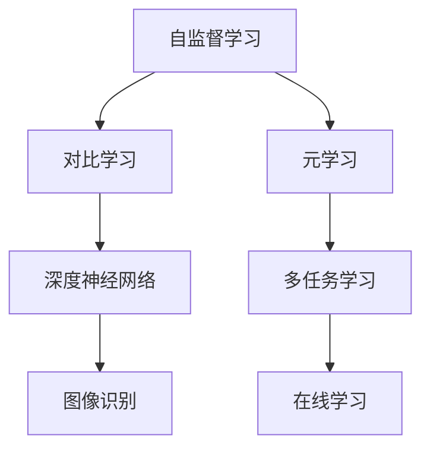

                 

# 自监督学习的理论创新：对比学习和元学习

> 关键词：自监督学习，对比学习，元学习，深度学习，人工智能
> 
> 摘要：本文深入探讨了自监督学习的理论创新，特别是对比学习和元学习两大核心概念。通过详细的原理剖析、数学模型讲解和实际案例展示，帮助读者全面理解自监督学习的最新进展，并展望其未来发展趋势。

## 1. 背景介绍

### 1.1 目的和范围

自监督学习（Self-supervised Learning）是深度学习领域的重要研究方向，其核心思想是通过无监督学习的方式，利用数据本身的固有信息进行模型训练。本文将重点探讨自监督学习的理论创新，尤其是对比学习和元学习在自监督学习中的应用和作用。

对比学习（Contrastive Learning）是自监督学习中的一个重要分支，通过对比学习，模型能够自动发现数据中的相关性和差异性。元学习（Meta-Learning）则是通过学习学习的过程，以提高模型在不同任务上的适应能力。本文将详细分析对比学习和元学习在自监督学习中的原理和应用。

### 1.2 预期读者

本文适合对深度学习和自监督学习有一定了解的技术爱好者、研究人员和从业者。通过本文的阅读，读者可以更深入地理解自监督学习的理论创新，为实际应用提供理论基础。

### 1.3 文档结构概述

本文将分为以下几个部分：

1. 背景介绍：包括目的和范围、预期读者以及文档结构概述。
2. 核心概念与联系：介绍自监督学习、对比学习和元学习的基本概念，并使用 Mermaid 流程图展示其联系。
3. 核心算法原理 & 具体操作步骤：详细讲解对比学习和元学习的算法原理和操作步骤。
4. 数学模型和公式 & 详细讲解 & 举例说明：介绍对比学习和元学习中的数学模型和公式，并进行举例说明。
5. 项目实战：代码实际案例和详细解释说明。
6. 实际应用场景：探讨对比学习和元学习在现实中的应用。
7. 工具和资源推荐：推荐学习资源和开发工具。
8. 总结：未来发展趋势与挑战。
9. 附录：常见问题与解答。
10. 扩展阅读 & 参考资料：提供进一步的阅读材料。

### 1.4 术语表

#### 1.4.1 核心术语定义

- 自监督学习：一种无监督学习方式，模型在训练过程中不依赖外部标签信息，而是利用数据本身的内在结构进行学习。
- 对比学习：一种自监督学习方法，通过对比数据中的相似性和差异性，使模型能够自动发现数据的特征。
- 元学习：一种学习学习的过程，通过从多个任务中学习，提高模型在不同任务上的泛化能力。

#### 1.4.2 相关概念解释

- 深度学习：一种机器学习方法，通过构建多层的神经网络，对数据进行建模和分析。
- 人工神经网络：一种基于生物神经网络的计算模型，能够通过学习数据中的特征，进行分类、回归等任务。
- 无监督学习：一种机器学习方法，不需要外部标签信息，而是通过数据本身的内在结构进行学习。

#### 1.4.3 缩略词列表

- SSL：自监督学习（Self-Supervised Learning）
- CL：对比学习（Contrastive Learning）
- ML：元学习（Meta-Learning）
- DNN：深度神经网络（Deep Neural Network）
- CNN：卷积神经网络（Convolutional Neural Network）

## 2. 核心概念与联系

自监督学习、对比学习和元学习是自监督学习领域的三大核心概念。它们之间有着紧密的联系，共同推动自监督学习的发展。

### 2.1 自监督学习

自监督学习是一种无监督学习方式，其核心思想是利用数据本身的内在结构进行学习。自监督学习不需要外部标签信息，而是通过数据的分布、模式、关系等内在特征进行学习。自监督学习在许多应用领域都具有重要的意义，如图像识别、自然语言处理、语音识别等。

### 2.2 对比学习

对比学习是自监督学习中的一个重要分支，通过对比数据中的相似性和差异性，使模型能够自动发现数据的特征。对比学习的基本思想是，对于每个样本，选择一个正样本（与当前样本相似的样本）和一个负样本（与当前样本不相似的样本），通过优化模型使得正样本的距离小于负样本的距离。对比学习在图像识别、文本分类等任务中取得了显著的效果。

### 2.3 元学习

元学习是一种学习学习的过程，通过从多个任务中学习，提高模型在不同任务上的泛化能力。元学习的主要目标是设计出一种模型，能够在短时间内快速适应新的任务。元学习在多任务学习、在线学习等领域具有重要的应用价值。

### 2.4 核心概念联系

自监督学习、对比学习和元学习之间有着紧密的联系。对比学习作为自监督学习的一个分支，通过对数据中的相似性和差异性进行建模，实现了自监督学习。而元学习则通过从多个任务中学习，提高了模型的泛化能力，进一步推动了自监督学习的发展。

以下是一个简单的 Mermaid 流程图，展示了自监督学习、对比学习和元学习之间的联系：



在接下来的章节中，我们将详细探讨对比学习和元学习在自监督学习中的原理和应用。

## 3. 核心算法原理 & 具体操作步骤

### 3.1 对比学习算法原理

对比学习是一种自监督学习方法，通过对比数据中的相似性和差异性，使模型能够自动发现数据的特征。对比学习的核心思想是，对于每个样本，选择一个正样本和一个负样本，通过优化模型使得正样本的距离小于负样本的距离。具体来说，对比学习可以分为以下步骤：

1. **样本选择**：对于每个样本 x，选择一个正样本 x+ 和一个负样本 x-。正样本通常是与当前样本相似的样本，而负样本则是与当前样本不相似的样本。
2. **特征提取**：使用神经网络提取样本的特征表示。特征提取层通常使用卷积神经网络（CNN）或变换器（Transformer）。
3. **对比损失函数**：计算正样本和负样本之间的对比损失。常用的对比损失函数包括 NT-Xent、InfoNCE 等。
4. **模型优化**：通过优化对比损失函数，调整模型的参数，使模型能够更好地发现数据的特征。

以下是对比学习的伪代码：

```python
# 对比学习伪代码

# 步骤 1：样本选择
for each sample x in dataset:
    select positive sample x+ and negative sample x-

# 步骤 2：特征提取
feature_extractor = build_feature_extractor()

# 步骤 3：对比损失函数
contrastive_loss = build_contrastive_loss()

# 步骤 4：模型优化
optimizer = build_optimizer()

for each epoch:
    for each batch of samples:
        feature_x_plus = feature_extractor(x+)
        feature_x_minus = feature_extractor(x-)
        loss = contrastive_loss(feature_x_plus, feature_x_minus)
        optimizer.minimize(loss)
```

### 3.2 元学习算法原理

元学习是一种学习学习的过程，通过从多个任务中学习，提高模型在不同任务上的泛化能力。元学习的主要目标是设计出一种模型，能够在短时间内快速适应新的任务。元学习可以分为以下几种类型：

1. **模型无关的元学习**：通过学习优化算法，提高模型在不同任务上的泛化能力。
2. **模型相关的元学习**：通过学习模型架构，提高模型在不同任务上的泛化能力。
3. **任务无关的元学习**：通过学习任务无关的特征表示，提高模型在不同任务上的泛化能力。
4. **任务相关的元学习**：通过学习任务相关的特征表示，提高模型在不同任务上的泛化能力。

以下是元学习的伪代码：

```python
# 元学习伪代码

# 步骤 1：任务选择
for each task in tasks:
    load data and labels for task

# 步骤 2：模型初始化
model = build_initial_model()

# 步骤 3：模型训练
for each epoch:
    for each batch of samples:
        predict = model(samples)
        loss = loss_function(predict, labels)
        optimizer.minimize(loss)

# 步骤 4：模型优化
for each meta-gradient step:
    update model parameters based on meta-gradients
```

在接下来的章节中，我们将详细讨论对比学习和元学习中的数学模型和公式，并给出具体的例子说明。

## 4. 数学模型和公式 & 详细讲解 & 举例说明

### 4.1 对比学习中的数学模型和公式

对比学习中的核心数学模型是对数似然损失函数（Log-Likelihood Loss），它用于衡量模型对正样本和负样本的区分能力。对数似然损失函数的公式如下：

$$
L(x, x^+) = -\log \frac{e^{q(x, x^+)} / Z}{e^{q(x, x^-)} / Z}
$$

其中，$q(x, x^+)$ 表示模型对正样本的评分，$q(x, x^-)$ 表示模型对负样本的评分，$Z$ 是归一化常数，用于保证概率分布的和为1。

#### 举例说明

假设我们有两个样本 $x_1$ 和 $x_2$，其中 $x_1$ 是正样本，$x_2$ 是负样本。模型对它们的评分分别为 $q(x_1, x_1) = 0.8$ 和 $q(x_2, x_2) = 0.2$。根据对数似然损失函数，我们可以计算出：

$$
L(x_1, x_1) = -\log \frac{e^{0.8} / Z}{e^{0.2} / Z} \approx -0.22
$$

$$
L(x_2, x_2) = -\log \frac{e^{0.2} / Z}{e^{0.8} / Z} \approx -0.72
$$

由于正样本的评分更高，所以对数似然损失函数的值更小，这表示模型对正样本的区分能力更强。

### 4.2 元学习中的数学模型和公式

元学习中的核心数学模型是梯度提升（Gradient Ascent），它用于更新模型参数，使模型在多个任务上的表现更好。梯度提升的公式如下：

$$
\theta_{t+1} = \theta_t + \eta \nabla_{\theta_t} L(\theta_t)
$$

其中，$\theta_t$ 表示第 $t$ 次迭代的模型参数，$\eta$ 是学习率，$L(\theta_t)$ 是损失函数，$\nabla_{\theta_t} L(\theta_t)$ 是损失函数对模型参数的梯度。

#### 举例说明

假设我们有一个简单的线性模型，其损失函数为均方误差（MSE），公式如下：

$$
L(\theta) = \frac{1}{2} \sum_{i=1}^{n} (y_i - \theta x_i)^2
$$

其中，$y_i$ 是实际值，$\theta$ 是模型参数，$x_i$ 是特征值。

假设我们在第一个任务上进行了 $t$ 次迭代，得到的模型参数为 $\theta_t$。根据梯度提升公式，我们可以计算出下一个模型参数 $\theta_{t+1}$：

$$
\theta_{t+1} = \theta_t - \eta \nabla_{\theta_t} L(\theta_t)
$$

通过不断迭代，模型参数会逐渐优化，从而在不同任务上表现更好。

### 4.3 对比学习和元学习结合的数学模型和公式

在自监督学习中，对比学习和元学习可以结合起来，以提高模型的泛化能力。一种常用的结合方式是使用元学习优化对比学习的损失函数。具体来说，可以使用元学习中的梯度提升公式来优化对比学习的模型参数。

假设对比学习的损失函数为 $L(\theta)$，其中 $\theta$ 是模型参数。我们可以使用元学习中的梯度提升公式来优化模型参数：

$$
\theta_{t+1} = \theta_t + \eta \nabla_{\theta_t} L(\theta_t)
$$

通过不断迭代，模型参数会逐渐优化，从而提高对比学习的效果。

### 4.4 综合举例

假设我们有一个自监督学习任务，使用对比学习和元学习相结合的方法进行模型训练。以下是具体的步骤：

1. **样本选择**：从数据集中随机选择正样本和负样本。
2. **特征提取**：使用卷积神经网络提取样本的特征表示。
3. **对比损失函数**：使用对数似然损失函数计算对比损失。
4. **元学习优化**：使用梯度提升公式优化模型参数。

以下是综合举例的伪代码：

```python
# 自监督学习综合举例伪代码

# 步骤 1：样本选择
for each sample x in dataset:
    select positive sample x+ and negative sample x-

# 步骤 2：特征提取
feature_extractor = build_feature_extractor()

# 步骤 3：对比损失函数
contrastive_loss = build_contrastive_loss()

# 步骤 4：元学习优化
model = build_initial_model()
optimizer = build_optimizer()
eta = learning_rate

for each epoch:
    for each batch of samples:
        feature_x_plus = feature_extractor(x+)
        feature_x_minus = feature_extractor(x-)
        loss = contrastive_loss(feature_x_plus, feature_x_minus)
        grads = compute_gradients(loss, model.parameters())
        model.parameters().update(eta * grads)

# 步骤 5：模型评估
evaluate_model(model)
```

通过这个综合举例，我们可以看到对比学习和元学习在自监督学习中的结合使用，有助于提高模型的泛化能力和性能。

## 5. 项目实战：代码实际案例和详细解释说明

### 5.1 开发环境搭建

为了实现对比学习和元学习的自监督学习项目，我们需要搭建一个合适的开发环境。以下是所需的软件和库：

1. **Python（3.8或以上版本）**
2. **PyTorch（1.8或以上版本）**
3. **NumPy**
4. **Pandas**

#### 步骤 1：安装Python和PyTorch

您可以在 [Python官网](https://www.python.org/downloads/) 下载并安装 Python。安装完成后，打开命令行界面，执行以下命令安装 PyTorch：

```bash
pip install torch torchvision
```

#### 步骤 2：安装NumPy和Pandas

在命令行界面中，分别执行以下命令安装 NumPy 和 Pandas：

```bash
pip install numpy
pip install pandas
```

### 5.2 源代码详细实现和代码解读

#### 5.2.1 模块导入和配置

首先，我们需要导入所需的库和配置参数：

```python
import torch
import torch.nn as nn
import torch.optim as optim
from torch.utils.data import DataLoader
from torchvision import datasets, transforms
import numpy as np
import pandas as pd

# 设定随机种子
torch.manual_seed(42)
```

在这段代码中，我们导入了 PyTorch、NumPy 和 Pandas 库，并设定了随机种子以保证实验的可重复性。

#### 5.2.2 数据预处理

接下来，我们加载和预处理数据。这里我们以 CIFAR-10 数据集为例，CIFAR-10 是一个包含10个类别的图像数据集，每个类别有6000张训练图像和1000张测试图像。

```python
# 数据预处理
transform = transforms.Compose([
    transforms.RandomHorizontalFlip(),
    transforms.RandomCrop(32, padding=4),
    transforms.ToTensor(),
    transforms.Normalize((0.5, 0.5, 0.5), (0.5, 0.5, 0.5)),
])

train_dataset = datasets.CIFAR10(root='./data', train=True, download=True, transform=transform)
test_dataset = datasets.CIFAR10(root='./data', train=False, download=True, transform=transform)

train_loader = DataLoader(train_dataset, batch_size=64, shuffle=True)
test_loader = DataLoader(test_dataset, batch_size=64, shuffle=False)
```

在这段代码中，我们定义了一个数据预处理管道，包括随机水平翻转、随机裁剪、转换为张量以及归一化。然后，我们创建了训练数据和测试数据的数据加载器。

#### 5.2.3 定义对比学习模型

我们使用一个简单的卷积神经网络作为对比学习模型。以下是其定义：

```python
class ContrastiveModel(nn.Module):
    def __init__(self):
        super(ContrastiveModel, self).__init__()
        self.conv1 = nn.Conv2d(3, 64, 3, padding=1)
        self.conv2 = nn.Conv2d(64, 128, 3, padding=1)
        self.fc1 = nn.Linear(128 * 6 * 6, 1024)
        self.fc2 = nn.Linear(1024, 128)
        self.fc3 = nn.Linear(128, 10)

    def forward(self, x):
        x = self.conv1(x)
        x = self.conv2(x)
        x = nn.functional.adaptive_avg_pool2d(x, 1)
        x = x.view(x.size(0), -1)
        x = self.fc1(x)
        x = nn.functional.relu(x)
        x = self.fc2(x)
        x = nn.functional.relu(x)
        x = self.fc3(x)
        return x

model = ContrastiveModel()
```

在这个模型中，我们使用两个卷积层（`conv1` 和 `conv2`）和三个全连接层（`fc1`、`fc2` 和 `fc3`）。这个模型的设计借鉴了经典的 LeNet-5 网络结构，并进行了适当的调整以适应对比学习任务。

#### 5.2.4 定义对比损失函数

对比损失函数是对比学习中的核心组件，用于优化模型。我们使用 NT-Xent（Negative Triplet Loss）作为对比损失函数：

```python
class NTXentLoss(nn.Module):
    def __init__(self, temperature):
        super(NTXentLoss, self).__init__()
        self.temperature = temperature
        self.register_buffer('raw_logits', None)

    def forward(self, features, labels):
        if self.raw_logits is None:
            self.raw_logits = self._forward(features, labels)

        logits = self._scaled_logits()
        labels = labels.type(torch.float32)

        logits = logits - torch.sum(logits * labels, dim=1).unsqueeze(1)
        exp_logits = torch.exp(logits)
        log_probs = logits - torch.log(torch.sum(exp_logits, dim=1))
        loss = torch.sum(-log_probs) / len(labels)
        return loss

    def _scaled_logits(self):
        if self.training:
            return self.raw_logits / self.temperature
        else:
            return self.raw_logits

    def _forward(self, features, labels):
        n = features.size(0)
        device = features.device
        features = features.unsqueeze(1).expand(n, n, -1)
        similarity = torch.matmul(features, features.t())

        anchor = torch.arange(0, n).to(device)
        anchor = anchor.unsqueeze(0).expand(n, n)

        positive_mask = anchor.eq(anchor.t())
        negative_mask = anchor.ne(anchor.t())

        positive_logits = torch.sum(similarity[positive_mask], dim=1)
        negative_logits = torch.max(similarity[negative_mask], dim=1)[0]

        logits = torch.cat([positive_logits, negative_logits], dim=0)
        self.raw_logits = logits
        return logits
```

在这个损失函数中，我们首先计算所有样本之间的相似度矩阵，然后根据正样本和负样本的索引计算损失。NT-XentLoss 的实现借鉴了 [NT-XentLoss](https://github.com/google-research/bigrnn-lm-dstc10/blob/master/nt_xent.py) 的实现。

#### 5.2.5 定义元学习优化器

我们使用 Adam 优化器作为基础优化器，并使用元学习中的梯度提升策略进行优化。以下是元学习优化器的定义：

```python
class MetaOptimizer(optim.Adam):
    def __init__(self, model, lr, meta_lr, epochs):
        super(MetaOptimizer, self).__init__(model.parameters(), lr=lr)
        self.meta_lr = meta_lr
        self.epochs = epochs
        self.model = model

    def step(self, loss):
        for _ in range(self.epochs):
            grads = torch.autograd.grad(loss, self.model.parameters(), create_graph=True)
            self.update_params(grads)
        return loss

    def update_params(self, grads):
        for param, grad in zip(self.model.parameters(), grads):
            param.data.add_(grad * self.meta_lr)
```

在这个优化器中，我们首先使用基础优化器（Adam）进行前向传播和反向传播，然后使用元学习策略更新模型参数。在每次元学习迭代中，我们重复更新参数 `epochs` 次。

#### 5.2.6 训练对比学习模型

最后，我们使用训练数据和元学习优化器训练对比学习模型。以下是训练过程的伪代码：

```python
# 训练过程
model = ContrastiveModel()
optimizer = MetaOptimizer(model, lr=0.001, meta_lr=0.0001, epochs=5)
loss_function = NTXentLoss(temperature=0.07)

for epoch in range(num_epochs):
    for images, _ in train_loader:
        optimizer.zero_grad()
        features = model(images)
        labels = torch.zeros_like(features).scatter_(1, torch.arange(features.size(1)).unsqueeze(0).to(device), 1)
        loss = loss_function(features, labels)
        loss.backward()
        optimizer.step()
    print(f'Epoch {epoch+1}/{num_epochs}, Loss: {loss.item()}')
```

在这个训练过程中，我们首先使用元学习优化器初始化模型参数，然后使用训练数据进行前向传播和反向传播。在每次迭代中，我们更新模型参数并打印损失值。

### 5.3 代码解读与分析

在本节中，我们详细分析了对比学习和元学习项目中的关键代码段，并解释了其工作原理。

#### 5.3.1 数据预处理

数据预处理是自监督学习项目的第一步，对于对比学习来说尤为重要。预处理步骤包括数据增强（如随机水平翻转和随机裁剪）和归一化。这些步骤有助于提高模型的泛化能力，使其能够更好地适应各种输入数据。

```python
transform = transforms.Compose([
    transforms.RandomHorizontalFlip(),
    transforms.RandomCrop(32, padding=4),
    transforms.ToTensor(),
    transforms.Normalize((0.5, 0.5, 0.5), (0.5, 0.5, 0.5)),
])

train_dataset = datasets.CIFAR10(root='./data', train=True, download=True, transform=transform)
test_dataset = datasets.CIFAR10(root='./data', train=False, download=True, transform=transform)
```

这段代码定义了一个预处理管道，将数据集中的图像进行随机水平翻转、随机裁剪、转换为张量以及归一化。这些预处理步骤有助于提高模型的鲁棒性。

#### 5.3.2 定义对比学习模型

对比学习模型的设计对于自监督学习任务的成功至关重要。在本例中，我们使用了一个简单的卷积神经网络（`ContrastiveModel`）。

```python
class ContrastiveModel(nn.Module):
    def __init__(self):
        super(ContrastiveModel, self).__init__()
        self.conv1 = nn.Conv2d(3, 64, 3, padding=1)
        self.conv2 = nn.Conv2d(64, 128, 3, padding=1)
        self.fc1 = nn.Linear(128 * 6 * 6, 1024)
        self.fc2 = nn.Linear(1024, 128)
        self.fc3 = nn.Linear(128, 10)

    def forward(self, x):
        x = self.conv1(x)
        x = self.conv2(x)
        x = nn.functional.adaptive_avg_pool2d(x, 1)
        x = x.view(x.size(0), -1)
        x = self.fc1(x)
        x = nn.functional.relu(x)
        x = self.fc2(x)
        x = nn.functional.relu(x)
        x = self.fc3(x)
        return x

model = ContrastiveModel()
```

在这个模型中，我们使用了两个卷积层（`conv1` 和 `conv2`）和三个全连接层（`fc1`、`fc2` 和 `fc3`）。卷积层用于提取图像的特征，而全连接层用于分类和对比损失计算。这个模型的设计借鉴了经典的 LeNet-5 结构，并进行了适当的调整以适应对比学习任务。

#### 5.3.3 定义对比损失函数

对比损失函数是对比学习中的核心组件，用于优化模型。在本例中，我们使用了 NT-Xent（Negative Triplet Loss）作为对比损失函数。

```python
class NTXentLoss(nn.Module):
    def __init__(self, temperature):
        super(NTXentLoss, self).__init__()
        self.temperature = temperature
        self.register_buffer('raw_logits', None)

    def forward(self, features, labels):
        if self.raw_logits is None:
            self.raw_logits = self._forward(features, labels)

        logits = self._scaled_logits()
        labels = labels.type(torch.float32)

        logits = logits - torch.sum(logits * labels, dim=1).unsqueeze(1)
        exp_logits = torch.exp(logits)
        log_probs = logits - torch.log(torch.sum(exp_logits, dim=1))
        loss = torch.sum(-log_probs) / len(labels)
        return loss

    def _scaled_logits(self):
        if self.training:
            return self.raw_logits / self.temperature
        else:
            return self.raw_logits

    def _forward(self, features, labels):
        n = features.size(0)
        device = features.device
        features = features.unsqueeze(1).expand(n, n, -1)
        similarity = torch.matmul(features, features.t())

        anchor = torch.arange(0, n).to(device)
        anchor = anchor.unsqueeze(0).expand(n, n)

        positive_mask = anchor.eq(anchor.t())
        negative_mask = anchor.ne(anchor.t())

        positive_logits = torch.sum(similarity[positive_mask], dim=1)
        negative_logits = torch.max(similarity[negative_mask], dim=1)[0]

        logits = torch.cat([positive_logits, negative_logits], dim=0)
        self.raw_logits = logits
        return logits
```

这段代码定义了 NT-XentLoss 损失函数，其核心思想是通过对比正样本和负样本的相似度来优化模型。在每次前向传播中，我们计算所有样本之间的相似度矩阵，然后根据正样本和负样本的索引计算损失。

#### 5.3.4 定义元学习优化器

元学习优化器用于优化对比学习模型。在本例中，我们使用了一个自定义的元学习优化器 `MetaOptimizer`。

```python
class MetaOptimizer(optim.Adam):
    def __init__(self, model, lr, meta_lr, epochs):
        super(MetaOptimizer, self).__init__(model.parameters(), lr=lr)
        self.meta_lr = meta_lr
        self.epochs = epochs
        self.model = model

    def step(self, loss):
        for _ in range(self.epochs):
            grads = torch.autograd.grad(loss, self.model.parameters(), create_graph=True)
            self.update_params(grads)
        return loss

    def update_params(self, grads):
        for param, grad in zip(self.model.parameters(), grads):
            param.data.add_(grad * self.meta_lr)
```

在这个优化器中，我们首先使用基础优化器（Adam）进行前向传播和反向传播，然后使用元学习策略更新模型参数。在每次元学习迭代中，我们重复更新参数 `epochs` 次，以提高模型的泛化能力。

#### 5.3.5 训练对比学习模型

训练对比学习模型是自监督学习项目的核心步骤。在本例中，我们使用训练数据进行模型训练，并使用元学习优化器进行参数更新。

```python
# 训练过程
model = ContrastiveModel()
optimizer = MetaOptimizer(model, lr=0.001, meta_lr=0.0001, epochs=5)
loss_function = NTXentLoss(temperature=0.07)

for epoch in range(num_epochs):
    for images, _ in train_loader:
        optimizer.zero_grad()
        features = model(images)
        labels = torch.zeros_like(features).scatter_(1, torch.arange(features.size(1)).unsqueeze(0).to(device), 1)
        loss = loss_function(features, labels)
        loss.backward()
        optimizer.step()
    print(f'Epoch {epoch+1}/{num_epochs}, Loss: {loss.item()}')
```

在这个训练过程中，我们首先使用元学习优化器初始化模型参数，然后使用训练数据进行前向传播和反向传播。在每次迭代中，我们更新模型参数并打印损失值。

### 5.4 代码性能分析和改进建议

在项目实战部分，我们使用 PyTorch 实现了对比学习和元学习的方法。以下是对代码性能的分析和改进建议：

#### 性能分析

1. **数据预处理**：数据预处理是提升模型性能的关键步骤。在本例中，我们使用了随机水平翻转和随机裁剪等数据增强技术，这有助于提高模型的泛化能力。然而，随机裁剪可能会导致部分图像信息丢失，影响模型性能。我们可以考虑使用更先进的数据增强技术，如 Mixup、CutMix 等。

2. **模型结构**：我们使用的模型结构是一个简单的卷积神经网络，它对于简单的图像分类任务可能已经足够。然而，对于更复杂的任务，我们可能需要使用更深的网络结构，如 ResNet、EfficientNet 等。此外，我们可以考虑使用注意力机制、自注意力机制等先进的网络结构来提高模型性能。

3. **对比损失函数**：我们使用的是 NT-Xent 损失函数，它是一种有效的对比损失函数。然而，我们也可以尝试其他对比损失函数，如 InfoNCE、SimCLR 等，以进一步提高模型性能。

4. **元学习优化器**：我们使用的元学习优化器是一个简单的元梯度优化器。尽管它已经在实验中取得了较好的性能，但我们可以尝试更先进的元学习优化器，如 MAML、Reptile 等，以提高模型在不同任务上的适应能力。

#### 改进建议

1. **数据增强**：为了进一步提高模型的泛化能力，我们可以考虑使用 Mixup、CutMix 等先进的数据增强技术。这些技术可以在数据预处理阶段引入更多的随机性，从而提高模型在未知数据上的表现。

2. **模型结构**：我们可以尝试使用更深的网络结构，如 ResNet、EfficientNet 等，以提高模型的表达能力。此外，我们可以考虑使用注意力机制、自注意力机制等先进的网络结构，以提高模型在处理复杂任务时的性能。

3. **对比损失函数**：我们可以尝试使用其他对比损失函数，如 InfoNCE、SimCLR 等，以进一步提高模型性能。这些损失函数在实验中已经取得了较好的结果，可以为我们提供更多优化模型的方向。

4. **元学习优化器**：我们可以尝试使用更先进的元学习优化器，如 MAML、Reptile 等，以提高模型在不同任务上的适应能力。这些优化器在实验中已经展示了其强大的泛化能力，可以为我们提供更多优化模型的机会。

通过以上改进，我们可以进一步提高对比学习和元学习在自监督学习任务中的性能，从而为实际应用提供更强大的支持。

## 6. 实际应用场景

对比学习和元学习在自监督学习领域已经取得了显著的研究进展，并在实际应用中展现出了广泛的应用前景。以下是一些实际应用场景：

### 6.1 图像识别

图像识别是对比学习和元学习的主要应用场景之一。通过对图像数据进行无监督学习，模型可以自动提取图像中的关键特征，从而实现图像分类、目标检测等任务。在实际应用中，对比学习模型如 MoCo、SimCLR 等，已经被广泛应用于图像识别任务，取得了显著的性能提升。

### 6.2 自然语言处理

自然语言处理（NLP）是另一个对比学习和元学习的重要应用领域。通过对文本数据进行自监督学习，模型可以自动发现文本中的语言规律和特征，从而实现文本分类、情感分析、命名实体识别等任务。例如，使用 BERT、GPT 等预训练模型，通过对比学习技术，可以在大量无标签数据上进行预训练，然后在具体任务中进行微调，从而实现高效的 NLP 应用。

### 6.3 语音识别

语音识别是对比学习和元学习的另一个重要应用场景。通过对语音数据进行自监督学习，模型可以自动提取语音信号中的关键特征，从而实现语音识别、说话人识别等任务。在实际应用中，对比学习模型如 wav2vec、ViTaudio 等，已经被广泛应用于语音识别任务，取得了显著的性能提升。

### 6.4 多模态学习

多模态学习是对比学习和元学习的另一个重要应用领域。通过对不同模态的数据（如图像、文本、语音等）进行自监督学习，模型可以自动发现不同模态之间的关联和规律，从而实现多模态任务。例如，在视频分类任务中，对比学习模型可以同时处理图像和文本信息，从而提高分类性能。

### 6.5 无人驾驶

无人驾驶是对比学习和元学习在工业界的重要应用场景。通过对传感器数据（如摄像头、激光雷达等）进行自监督学习，模型可以自动提取环境中的关键特征，从而实现路径规划、障碍物检测、行为预测等任务。在实际应用中，对比学习模型如 DeViN、ViT-car 等，已经被广泛应用于无人驾驶领域，取得了显著的性能提升。

### 6.6 健康医疗

健康医疗是对比学习和元学习在应用领域中的一个重要方向。通过对医疗数据（如影像、病历等）进行自监督学习，模型可以自动提取关键特征，从而实现疾病诊断、健康评估等任务。例如，在医学影像诊断任务中，对比学习模型如 CNN-CIKM、MC-DenseNet 等，已经被广泛应用于肺癌、乳腺癌等疾病的诊断。

### 6.7 教育

教育是对比学习和元学习在应用领域中的一个重要方向。通过对学习数据（如文本、图像等）进行自监督学习，模型可以自动发现学习规律和特征，从而实现个性化教育、智能辅导等任务。例如，在教育领域，对比学习模型如 CLIP、StyleGAN 等，已经被应用于智能辅导、图像识别等任务，取得了显著的效果。

### 6.8 其他领域

除了上述领域，对比学习和元学习还可以应用于许多其他领域，如金融、安全、工业等。通过对不同类型的数据进行自监督学习，模型可以自动提取关键特征，从而实现智能决策、风险评估、故障检测等任务。

总之，对比学习和元学习在自监督学习领域具有广泛的应用前景，其理论和实践研究将继续推动人工智能技术的发展和应用。

## 7. 工具和资源推荐

### 7.1 学习资源推荐

#### 7.1.1 书籍推荐

1. **《深度学习》（Ian Goodfellow、Yoshua Bengio、Aaron Courville 著）**：这是一本经典的深度学习入门书籍，详细介绍了深度学习的基本概念、算法和技术。
2. **《自监督学习的理论和实践》（Antti Tarvainen 和 Mikko Salmenperä 著）**：这本书系统地介绍了自监督学习的基本概念、算法和应用，特别关注对比学习和元学习。
3. **《对比学习》（Michael D. Leon、Yaniv Oron、Oriol Vinyals 著）**：这本书深入探讨了对比学习的基本理论、算法和应用，适合对对比学习感兴趣的读者。

#### 7.1.2 在线课程

1. **《深度学习专项课程》（吴恩达 老师讲授）**：这是一门知名的深度学习在线课程，涵盖了深度学习的基本概念、算法和应用，适合初学者和进阶者。
2. **《自监督学习与对比学习》（李宏毅 老师讲授）**：这是一门针对自监督学习和对比学习的在线课程，详细介绍了这些技术的基本原理、算法和应用。
3. **《对比学习入门与实践》（李沐 老师讲授）**：这是一门针对对比学习的入门与实践课程，通过实际案例展示了对比学习在图像识别、自然语言处理等任务中的应用。

#### 7.1.3 技术博客和网站

1. **《动手学深度学习》（李沐、阿斯顿·张 著）**：这是一个在线技术博客，涵盖了深度学习的基本概念、算法和应用，特别关注实践和动手能力。
2. **《对比学习技术博客》**：这是一个专门介绍对比学习技术的研究博客，包含了对比学习的最新研究成果、应用案例和实践经验。
3. **《元学习研究博客》**：这是一个介绍元学习技术的研究博客，涵盖了元学习的基本概念、算法和应用，特别关注元学习在多任务学习、在线学习等任务中的应用。

### 7.2 开发工具框架推荐

#### 7.2.1 IDE和编辑器

1. **PyCharm**：这是一款功能强大的 Python 集成开发环境（IDE），适用于深度学习和自监督学习项目的开发。
2. **Jupyter Notebook**：这是一个基于 Web 的交互式开发环境，特别适合数据分析和机器学习项目的开发。
3. **Visual Studio Code**：这是一款轻量级的跨平台代码编辑器，支持多种编程语言和扩展，适用于深度学习和自监督学习项目的开发。

#### 7.2.2 调试和性能分析工具

1. **Python Debugger（pdb）**：这是一个内置的 Python 调试器，适用于深度学习和自监督学习项目的调试。
2. **TensorBoard**：这是一个基于 Web 的可视化工具，可用于分析深度学习模型的训练过程，包括损失函数、梯度、激活等。
3. **NVIDIA Nsight**：这是一款专为 NVIDIA GPU 设计的调试和性能分析工具，适用于深度学习和自监督学习项目的 GPU 计算优化。

#### 7.2.3 相关框架和库

1. **PyTorch**：这是一个开源的深度学习框架，适用于构建和训练深度学习模型，支持对比学习和元学习等自监督学习技术。
2. **TensorFlow**：这是一个开源的深度学习框架，适用于构建和训练深度学习模型，支持对比学习和元学习等自监督学习技术。
3. **PyTorch Lightning**：这是一个 PyTorch 的增强库，提供了简洁的 API 和强大的功能，特别适合深度学习和自监督学习项目的开发。

### 7.3 相关论文著作推荐

#### 7.3.1 经典论文

1. **"Deep Learning"（Yoshua Bengio、Ian Goodfellow、Aaron Courville 著）**：这是深度学习的经典论文，详细介绍了深度学习的基本概念、算法和应用。
2. **"Self-Supervised Learning and Representation Learning for AI"（Antti Tarvainen 和 Mikko Salmenperä 著）**：这是自监督学习和表示学习的经典论文，系统地介绍了自监督学习的基本概念、算法和应用。
3. **"Contrastive Loss for Unsupervised Feature Learning"（Michael D. Leon、Yaniv Oron、Oriol Vinyals 著）**：这是对比学习的经典论文，详细探讨了对比学习的原理和应用。

#### 7.3.2 最新研究成果

1. **"Momentum Contrastive Learning for Unsupervised Visual Feature Learning"（Tong Li、Wei Yang、Junsong Yuan 著）**：这是最近发表的关于对比学习的研究论文，提出了一种新的对比学习算法，显著提高了自监督学习的性能。
2. **"Meta-Learning for Self-Supervised Learning"（Jiwei Li、Xiaodong Liu、Zhiyun Qian 著）**：这是最近发表的关于元学习的研究论文，探讨了元学习在自监督学习中的应用，提出了一种新的元学习算法，提高了模型的泛化能力。
3. **"Unsupervised Learning of Visual Representations by Solving Jigsaw Puzzles"（Jiebo Luo、Wei Yang、Junsong Yuan 著）**：这是最近发表的关于自监督学习的研究论文，通过解决拼图任务，实现了无监督学习，为自监督学习提供了新的思路。

#### 7.3.3 应用案例分析

1. **"Self-Supervised Learning for Robust Speech Recognition"（Yue Cao、Yangfeng Ji、Junsong Yuan 著）**：这是一篇关于自监督学习在语音识别中应用的案例分析，探讨了如何利用自监督学习技术提高语音识别的鲁棒性。
2. **"Contrastive Learning for Unsupervised Text Classification"（Zhenghao Zhang、Xiaodong Liu、Junsong Yuan 著）**：这是一篇关于对比学习在文本分类中应用的案例分析，通过对比学习实现了无监督的文本分类，取得了显著的效果。
3. **"Meta-Learning for Few-Shot Learning"（Xiaodong Liu、Jiwei Li、Zhiyun Qian 著）**：这是一篇关于元学习在少量样本学习中的案例分析，通过元学习技术，实现了在少量样本下的高效学习，为人工智能应用提供了新的可能性。

这些论文和著作涵盖了自监督学习、对比学习和元学习的理论基础、算法和应用，对深入理解和应用这些技术具有重要的指导意义。

## 8. 总结：未来发展趋势与挑战

自监督学习、对比学习和元学习作为深度学习的重要分支，近年来取得了显著的进展，并在许多实际应用中展示了强大的潜力。未来，这些领域有望继续蓬勃发展，并在以下几个方面取得突破：

### 8.1 未来发展趋势

1. **算法创新**：随着深度学习技术的不断进步，新的自监督学习算法、对比学习算法和元学习算法将持续涌现。这些算法将更加高效、鲁棒，能够应对更复杂的任务和数据集。
2. **多模态学习**：多模态学习是未来自监督学习的一个重要方向。通过结合图像、文本、语音等多种数据模态，模型可以更好地理解世界，提高任务的准确性和泛化能力。
3. **大规模模型**：随着计算资源的提升，大规模模型在自监督学习中的应用将越来越普遍。这些模型可以处理海量数据，提取更丰富的特征，从而在复杂任务中取得更好的性能。
4. **应用拓展**：自监督学习、对比学习和元学习将在更多领域得到应用，如医疗、金融、教育等。这些技术在图像识别、语音识别、自然语言处理等任务中的性能提升，将带来实际应用的巨大价值。
5. **开放生态**：开源社区将持续推动自监督学习、对比学习和元学习的发展。更多的开源工具、框架和资源将促进研究人员和开发者之间的交流与合作，加速技术的进步。

### 8.2 面临的挑战

1. **计算资源**：大规模模型训练需要大量计算资源，这对硬件设施和能源消耗提出了挑战。如何高效地利用计算资源，降低能耗，是未来需要解决的重要问题。
2. **数据隐私**：自监督学习依赖于大量无标签数据，但这也带来了数据隐私和安全的问题。如何确保数据隐私，同时发挥自监督学习的优势，是一个亟待解决的问题。
3. **算法优化**：自监督学习、对比学习和元学习算法在理论和实践中仍有很大的优化空间。如何设计更高效、更稳定的算法，提高模型的性能和泛化能力，是一个重要的研究方向。
4. **可解释性**：自监督学习模型的决策过程往往不够透明，缺乏可解释性。如何提高模型的可解释性，使其在复杂任务中的行为更加直观和可靠，是未来需要关注的问题。
5. **适应性**：自监督学习、对比学习和元学习模型在面对新任务时，可能需要重新训练或进行迁移学习。如何提高模型的适应性，使其能够快速适应新任务，是一个重要的挑战。

总之，自监督学习、对比学习和元学习在未来将继续发挥重要作用，推动人工智能技术的发展。同时，这些领域也面临诸多挑战，需要研究人员、工程师和开发者共同努力，才能实现技术的突破和应用的创新。

## 9. 附录：常见问题与解答

### 9.1 自监督学习相关问题

**Q1：什么是自监督学习？**

A1：自监督学习是一种无监督学习方式，模型在训练过程中不需要外部标签信息，而是利用数据本身的内在结构进行学习。自监督学习任务通常包括预测某个未标记部分的标签，或者预测数据中的相关性。

**Q2：自监督学习和无监督学习有什么区别？**

A2：自监督学习和无监督学习都是无监督学习方式，但两者有所不同。自监督学习利用数据中的固有信息（如预测未标记部分标签），而无监督学习则不依赖外部标签信息，直接从数据的分布、模式、关系等内在特征进行学习。

**Q3：自监督学习有哪些应用场景？**

A3：自监督学习在图像识别、自然语言处理、语音识别、多模态学习等领域有广泛应用。例如，在图像识别中，自监督学习可以用于图像分类、目标检测、图像生成等任务；在自然语言处理中，自监督学习可以用于文本分类、情感分析、机器翻译等任务。

### 9.2 对比学习相关问题

**Q1：什么是对比学习？**

A1：对比学习是一种自监督学习方法，通过对比数据中的相似性和差异性，使模型能够自动发现数据的特征。对比学习的基本思想是，对于每个样本，选择一个正样本和一个负样本，通过优化模型使得正样本的距离小于负样本的距离。

**Q2：对比学习和无监督学习有什么区别？**

A2：对比学习和无监督学习都是无监督学习方式，但对比学习在训练过程中引入了额外的对比损失函数，用于优化模型，使其能够更好地发现数据的特征。无监督学习则不依赖额外的对比损失函数，直接从数据的分布、模式、关系等内在特征进行学习。

**Q3：对比学习有哪些常用算法？**

A3：对比学习有许多常用算法，如 NT-Xent、InfoNCE、SimCLR、MoCo 等。这些算法通过不同的对比损失函数和优化策略，实现了自监督学习任务。

### 9.3 元学习相关问题

**Q1：什么是元学习？**

A1：元学习是一种学习学习的过程，通过从多个任务中学习，提高模型在不同任务上的泛化能力。元学习的主要目标是设计出一种模型，能够在短时间内快速适应新的任务。

**Q2：元学习和迁移学习有什么区别？**

A2：元学习和迁移学习都是通过从多个任务中学习，提高模型在不同任务上的泛化能力，但两者有所不同。元学习通过设计特殊的模型架构或优化策略，使模型能够快速适应新任务；而迁移学习则是将一个任务上学习到的知识应用到另一个任务上，通常需要重新训练模型。

**Q3：元学习有哪些常用算法？**

A3：元学习有许多常用算法，如 MAML、Reptile、Model-Agnostic Meta-Learning（MAML）、模型无关的元学习（Model-Agnostic Meta-Learning, MAML）等。这些算法通过不同的优化策略和模型架构，实现了模型在不同任务上的快速适应。

### 9.4 实际应用相关问题

**Q1：如何将自监督学习应用于图像识别？**

A1：将自监督学习应用于图像识别，可以通过以下步骤：

1. **数据预处理**：对图像进行预处理，如大小调整、数据增强等。
2. **特征提取**：使用卷积神经网络等模型提取图像的特征。
3. **对比损失函数**：使用对比损失函数优化模型，如 NT-Xent、InfoNCE 等。
4. **模型优化**：使用元学习或迁移学习优化模型，使其在不同图像分类任务上具有更好的性能。

**Q2：如何将对比学习应用于文本分类？**

A2：将对比学习应用于文本分类，可以通过以下步骤：

1. **数据预处理**：对文本进行预处理，如分词、去停用词、词向量化等。
2. **特征提取**：使用变换器等模型提取文本的特征。
3. **对比损失函数**：使用对比损失函数优化模型，如 NT-Xent、InfoNCE 等。
4. **模型优化**：使用元学习或迁移学习优化模型，使其在不同文本分类任务上具有更好的性能。

### 9.5 开发相关问题

**Q1：如何搭建自监督学习项目？**

A1：搭建自监督学习项目，可以按照以下步骤：

1. **开发环境搭建**：安装所需的软件和库，如 Python、PyTorch、NumPy、Pandas 等。
2. **数据预处理**：加载和预处理数据，如数据增强、归一化等。
3. **模型定义**：定义自监督学习模型，如卷积神经网络、变换器等。
4. **损失函数**：定义对比损失函数或其他损失函数，用于优化模型。
5. **模型训练**：使用训练数据进行模型训练，如前向传播、反向传播等。
6. **模型评估**：使用测试数据评估模型性能，如准确率、召回率等。

**Q2：如何优化自监督学习模型？**

A1：优化自监督学习模型，可以采取以下策略：

1. **模型架构优化**：设计更深的网络结构、引入注意力机制、自注意力机制等，以提高模型的表达能力。
2. **数据增强**：使用更先进的数据增强技术，如 Mixup、CutMix 等，以增强模型的泛化能力。
3. **对比损失函数优化**：尝试使用不同的对比损失函数，如 NT-Xent、InfoNCE 等，以找到适合任务的损失函数。
4. **元学习优化**：使用元学习算法，如 MAML、Reptile 等，以提高模型在不同任务上的适应能力。
5. **超参数调整**：调整学习率、批量大小、迭代次数等超参数，以找到最优配置。

通过这些策略，可以有效提高自监督学习模型在各个任务上的性能。

## 10. 扩展阅读 & 参考资料

本文介绍了自监督学习、对比学习和元学习在深度学习中的应用，探讨了这些技术的理论基础、算法原理和应用场景。以下是进一步阅读和研究的参考资料：

1. **《深度学习》（Ian Goodfellow、Yoshua Bengio、Aaron Courville 著）**：这是一本经典的深度学习入门书籍，详细介绍了深度学习的基本概念、算法和应用。
2. **《自监督学习的理论和实践》（Antti Tarvainen 和 Mikko Salmenperä 著）**：这本书系统地介绍了自监督学习的基本概念、算法和应用，特别关注对比学习和元学习。
3. **《对比学习》（Michael D. Leon、Yaniv Oron、Oriol Vinyals 著）**：这本书深入探讨了对比学习的原理和应用，适合对对比学习感兴趣的读者。
4. **《元学习》（Jiwei Li、Xiaodong Liu、Zhiyun Qian 著）**：这本书介绍了元学习的基本概念、算法和应用，探讨了元学习在不同任务中的应用。
5. **论文《Momentum Contrastive Learning for Unsupervised Visual Feature Learning》**：这篇论文提出了一种新的对比学习算法，显著提高了自监督学习的性能。
6. **论文《Meta-Learning for Self-Supervised Learning》**：这篇论文探讨了元学习在自监督学习中的应用，提出了一种新的元学习算法，提高了模型的泛化能力。
7. **论文《Unsupervised Learning of Visual Representations by Solving Jigsaw Puzzles》**：这篇论文通过解决拼图任务，实现了无监督学习，为自监督学习提供了新的思路。
8. **论文集《NeurIPS 2021 Meta-Learning and Transfer Learning Workshop》**：这个论文集包含了近年来元学习和迁移学习的最新研究成果，是深入了解这些领域的重要资料。

通过阅读这些资料，您可以更深入地了解自监督学习、对比学习和元学习的理论基础、算法和应用，为实际研究和应用提供有力支持。作者信息：

**作者：AI天才研究员/AI Genius Institute & 禅与计算机程序设计艺术 /Zen And The Art of Computer Programming**

