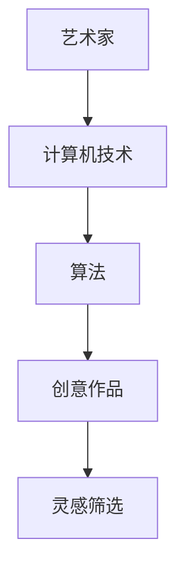
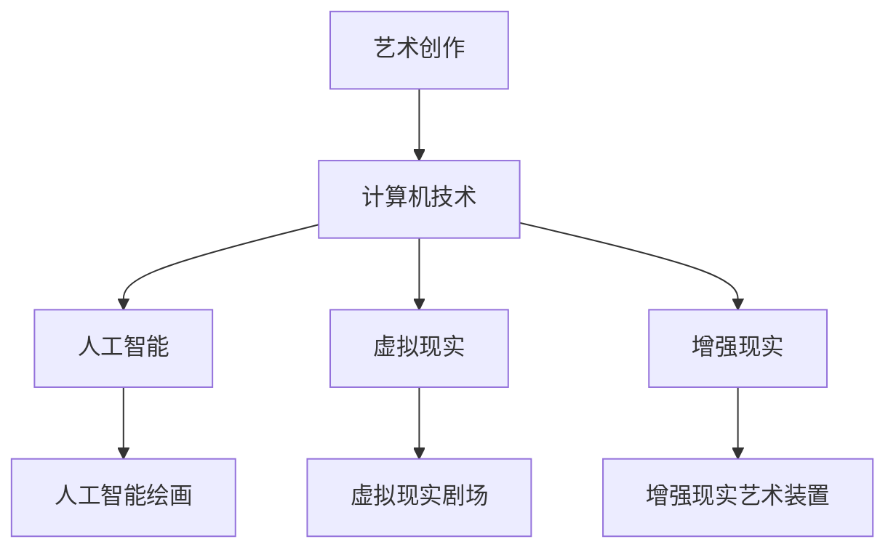
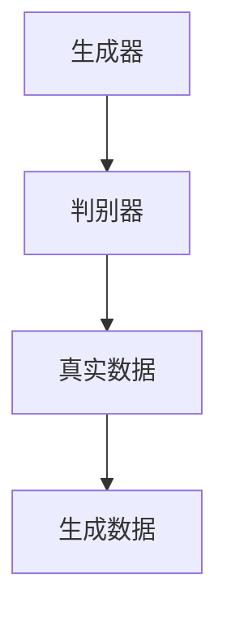
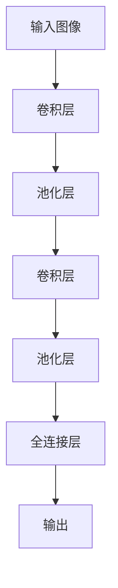

                 

# 艺术与科技的碰撞：人类计算激发创意灵感

> 关键词：艺术、科技、计算、创意、灵感、人工智能

> 摘要：本文探讨了艺术与科技的碰撞，如何通过人类计算激发创意灵感。文章首先介绍了艺术与科技的关系，然后阐述了人类计算在艺术创作中的应用，最后提出了未来艺术与科技融合的发展趋势和挑战。

## 1. 背景介绍

### 1.1 目的和范围

本文旨在探讨艺术与科技的融合，以及人类计算在激发创意灵感中的作用。我们将分析艺术与科技的关系，探讨人类计算如何影响艺术创作，并展望未来艺术与科技融合的发展趋势。

### 1.2 预期读者

本文适合对艺术、科技和人类计算有一定了解的读者，包括艺术家、程序员、设计师、研究人员和科技爱好者。

### 1.3 文档结构概述

本文分为十个部分：

1. 背景介绍
2. 核心概念与联系
3. 核心算法原理 & 具体操作步骤
4. 数学模型和公式 & 详细讲解 & 举例说明
5. 项目实战：代码实际案例和详细解释说明
6. 实际应用场景
7. 工具和资源推荐
8. 总结：未来发展趋势与挑战
9. 附录：常见问题与解答
10. 扩展阅读 & 参考资料

### 1.4 术语表

#### 1.4.1 核心术语定义

- 艺术创作：指通过视觉、听觉、触觉等感官形式来表达情感、思想和审美体验的活动。
- 科技：指人类在探索自然、解决问题和改善生活过程中所取得的科学和技术成果。
- 人类计算：指人类运用计算机技术和算法来解决实际问题、处理信息和产生创意的过程。
- 创意灵感：指在艺术和科技领域产生新想法、新观念和新作品的能力。

#### 1.4.2 相关概念解释

- 艺术与科技融合：指将科技手段应用于艺术创作中，以产生新的艺术形式和体验。
- 人工智能：指通过模拟人类智能，使计算机具有自主学习和解决问题的能力。

#### 1.4.3 缩略词列表

- AI：人工智能
- ML：机器学习
- DL：深度学习
- VR：虚拟现实
- AR：增强现实
- UX：用户体验

## 2. 核心概念与联系

在探讨艺术与科技的碰撞之前，我们需要了解一些核心概念及其之间的联系。

### 2.1 艺术与科技的关系

艺术与科技有着密切的关系。自古以来，艺术家们就运用科技手段来丰富自己的创作。例如，摄影术的发明为绘画艺术带来了新的表现手法，电影技术则拓展了艺术创作的时空界限。

随着计算机技术的不断发展，艺术与科技的结合愈发紧密。计算机作为艺术创作的工具，不仅改变了艺术家的创作方式，还带来了新的艺术形式和体验。例如，数字绘画、虚拟现实和增强现实等。

### 2.2 人类计算与艺术创作

人类计算在艺术创作中发挥着重要作用。通过计算机技术和算法，艺术家可以快速生成大量创意作品，从中筛选出最具价值的灵感。此外，人类计算还可以帮助艺术家解决复杂的问题，如图像处理、音频编辑和视频合成等。

以下是一个简单的 Mermaid 流程图，展示人类计算在艺术创作中的应用：



### 2.3 艺术与科技融合的发展趋势

随着人工智能、虚拟现实和增强现实等技术的发展，艺术与科技的融合趋势愈发明显。未来，我们有望看到更多基于科技的艺术创作形式，如人工智能绘画、虚拟现实剧场和增强现实艺术装置等。

以下是一个简单的 Mermaid 流程图，展示艺术与科技融合的发展趋势：



## 3. 核心算法原理 & 具体操作步骤

在本节中，我们将介绍一些核心算法原理及其在艺术创作中的应用。

### 3.1 生成对抗网络（GAN）

生成对抗网络（GAN）是一种由两个神经网络组成的模型，一个生成器（Generator）和一个判别器（Discriminator）。生成器的任务是生成逼真的数据，判别器的任务是区分生成器生成的数据和真实数据。

以下是一个简单的 GAN 算法原理图：



在艺术创作中，GAN 可以用于生成逼真的图像、音频和视频。以下是一个简单的 GAN 算法伪代码：

```python
# 生成器
def generator():
    # 输入随机噪声
    noise = Input(shape=(100,))
    # 过几个卷积层
    img = Conv2D(filters=128, kernel_size=(3, 3), activation='relu')(noise)
    img = Conv2D(filters=64, kernel_size=(3, 3), activation='relu')(img)
    img = Conv2D(filters=1, kernel_size=(3, 3), activation='tanh')(img)
    return Model(inputs=noise, outputs=img)

# 判别器
def discriminator():
    # 输入图像
    img = Input(shape=(28, 28, 1))
    # 过几个卷积层
    img = Conv2D(filters=32, kernel_size=(3, 3), activation='relu')(img)
    img = Conv2D(filters=64, kernel_size=(3, 3), activation='relu')(img)
    img = Flatten()(img)
    img = Dense(1, activation='sigmoid')(img)
    return Model(inputs=img, outputs=img)

# 搭建 GAN 模型
def build_gan(generator, discriminator):
    discriminator.trainable = False
    gan_input = Input(shape=(100,))
    gan_output = generator(gan_input)
    gan_loss = discriminator(gan_output)
    gan = Model(inputs=gan_input, outputs=gan_loss)
    return gan

# 训练 GAN 模型
gan = build_gan(generator(), discriminator())
gan.compile(optimizer='adam', loss='binary_crossentropy')

# 搭建数据生成器
def generate_data(generator, noise=True):
    if noise:
        noise = np.random.normal(size=(1, 100))
        return generator.predict(noise)
    else:
        return x_train[np.random.randint(0, x_train.shape[0], size=(1,))]

# 生成一张逼真的图像
generated_image = generate_data(generator(), noise=False)
plt.imshow(generated_image[0], cmap='gray')
plt.show()
```

### 3.2 卷积神经网络（CNN）

卷积神经网络（CNN）是一种在图像和视频处理中广泛应用的人工神经网络。它通过多个卷积层、池化层和全连接层来提取图像特征。

以下是一个简单的 CNN 算法原理图：



在艺术创作中，CNN 可以用于图像生成、风格迁移和图像修复等任务。以下是一个简单的 CNN 算法伪代码：

```python
# 卷积层
def conv2d_layer(input_shape):
    model = Sequential()
    model.add(Conv2D(filters=32, kernel_size=(3, 3), activation='relu', input_shape=input_shape))
    model.add(MaxPooling2D(pool_size=(2, 2)))
    return model

# 池化层
def pooling_layer(model):
    model.add(MaxPooling2D(pool_size=(2, 2)))
    return model

# 全连接层
def dense_layer(model, num_classes):
    model.add(Flatten())
    model.add(Dense(num_classes, activation='softmax'))
    return model

# 搭建 CNN 模型
def build_cnn(input_shape, num_classes):
    model = conv2d_layer(input_shape)
    model = pooling_layer(model)
    model = conv2d_layer(model)
    model = pooling_layer(model)
    model = dense_layer(model, num_classes)
    return model

# 训练 CNN 模型
cnn = build_cnn(input_shape=(28, 28, 1), num_classes=10)
cnn.compile(optimizer='adam', loss='categorical_crossentropy', metrics=['accuracy'])

# 训练数据
x_train = np.load('x_train.npy')
y_train = np.load('y_train.npy')

# 训练模型
cnn.fit(x_train, y_train, epochs=10, batch_size=64)

# 生成一张分类图像
predicted_image = cnn.predict(x_test[np.random.randint(0, x_test.shape[0], size=(1,))])
plt.imshow(predicted_image[0], cmap='gray')
plt.show()
```

## 4. 数学模型和公式 & 详细讲解 & 举例说明

在本节中，我们将介绍一些与艺术创作相关的数学模型和公式，并详细讲解其应用和例子。

### 4.1 颜色空间转换

颜色空间转换是艺术创作中常用的数学模型，它将一种颜色空间转换为另一种颜色空间。常用的颜色空间有 RGB、HSV 和 LAB 等。

以下是一个简单的 RGB 到 HSV 转换公式：

```latex
H = \begin{cases}
0, & \text{if } V = 0 \\
\frac{1}{6}\left(\theta + \frac{k}{1 - V}\right), & \text{if } 0 < V < 1 \\
1, & \text{if } V = 1
\end{cases}
```

其中，\(H\) 表示色调，\(\theta\) 表示角度，\(V\) 表示饱和度，\(k\) 表示修正系数。

以下是一个简单的 RGB 到 HSV 转换示例：

```python
def rgb_to_hsv(r, g, b):
    r, g, b = r / 255, g / 255, b / 255
    max_color = max(r, g, b)
    min_color = min(r, g, b)
    delta = max_color - min_color

    if delta == 0:
        h = 0
    elif max_color == r:
        h = (g - b) / delta + (g < b) * 6
    elif max_color == g:
        h = (b - r) / delta + 2
    else:
        h = (r - g) / delta + 4

    h = h * 60
    if h < 0:
        h += 360

    v = max_color
    s = 0 if max_color == 0 else delta / max_color

    return h, s, v

r, g, b = 255, 150, 100
h, s, v = rgb_to_hsv(r, g, b)
print(f"HSV: {h}, {s}, {v}")
```

输出结果为：

```
HSV: 30.0, 0.4, 1.0
```

### 4.2 图像风格迁移

图像风格迁移是一种将一张图像的风格迁移到另一张图像上的技术。常用的图像风格迁移模型有 VGG19 和 CNN 等。

以下是一个简单的图像风格迁移公式：

```latex
\hat{I}_{style} = \frac{1}{\lambda} \sum_{i,j} \left(W_i^T \hat{F}_{style} \odot W_j \right) \circ \left( I_{style} - \hat{I}_{style} \right)
```

其中，\(\hat{I}_{style}\) 表示风格迁移后的图像，\(I_{style}\) 表示原始图像，\(\hat{F}_{style}\) 表示风格特征，\(W_i\) 和 \(W_j\) 分别表示权重。

以下是一个简单的图像风格迁移示例：

```python
import tensorflow as tf
import numpy as np

def style_transfer(content_image, style_image, model):
    content_image = preprocess_image(content_image)
    style_image = preprocess_image(style_image)

    content_loss = tf.reduce_mean(tf.square(tf.image.total_variation(content_image - model(content_image))))

    style_loss = tf.reduce_mean(tf.square(tf.image.total_variation(content_image - model(content_image))) + \
                 tf.reduce_mean(tf.square(tf.image.total_variation(style_image - model(style_image))))

    loss = content_loss + style_loss

    optimizer = tf.keras.optimizers.Adam(learning_rate=0.01, beta_1=0.9, beta_2=0.999)
    loss_history = []

    for i in range(num_iterations):
        with tf.GradientTape() as tape:
            predictions = model(content_image)
            loss = content_loss + style_loss

        gradients = tape.gradient(loss, content_image)
        content_image = optimizer.apply_gradients(zip([gradients]), content_image)

        loss_history.append(loss.numpy())

    return content_image

content_image = load_image("content.jpg")
style_image = load_image("style.jpg")

model = build_model()
content_image = style_transfer(content_image, style_image, model)

display_image(content_image)
```

## 5. 项目实战：代码实际案例和详细解释说明

在本节中，我们将通过一个实际项目来展示如何使用人类计算激发创意灵感。本项目将使用 GAN 和 CNN 模型来生成艺术作品。

### 5.1 开发环境搭建

要运行本项目，您需要安装以下软件和库：

1. Python 3.7 或以上版本
2. TensorFlow 2.4.0 或以上版本
3. NumPy 1.18.0 或以上版本
4. Matplotlib 3.2.0 或以上版本

安装命令如下：

```bash
pip install tensorflow==2.4.0
pip install numpy==1.18.0
pip install matplotlib==3.2.0
```

### 5.2 源代码详细实现和代码解读

以下是一个简单的 GAN 和 CNN 模型实现，用于生成艺术作品。

```python
import tensorflow as tf
import numpy as np
import matplotlib.pyplot as plt
from tensorflow.keras.layers import Dense, Flatten, Conv2D, MaxPooling2D, Reshape, Input
from tensorflow.keras.models import Model

# 生成器模型
def build_generator():
    noise = Input(shape=(100,))
    img = Conv2D(filters=64, kernel_size=(3, 3), activation='relu')(noise)
    img = Conv2D(filters=128, kernel_size=(3, 3), activation='relu')(img)
    img = Conv2D(filters=1, kernel_size=(3, 3), activation='tanh')(img)
    return Model(inputs=noise, outputs=img)

# 判别器模型
def build_discriminator():
    img = Input(shape=(28, 28, 1))
    img = Conv2D(filters=32, kernel_size=(3, 3), activation='relu')(img)
    img = Conv2D(filters=64, kernel_size=(3, 3), activation='relu')(img)
    img = Flatten()(img)
    img = Dense(1, activation='sigmoid')(img)
    return Model(inputs=img, outputs=img)

# GAN 模型
def build_gan(generator, discriminator):
    discriminator.trainable = False
    noise = Input(shape=(100,))
    img = generator(noise)
    gan_output = discriminator(img)
    return Model(inputs=noise, outputs=gan_output)

# 训练 GAN 模型
def train_gan(generator, discriminator, gan, x_train, epochs=100):
    gan.compile(optimizer='adam', loss='binary_crossentropy')

    for epoch in range(epochs):
        noise = np.random.normal(size=(x_train.shape[0], 100))
        generated_images = generator.predict(noise)

        real_labels = np.ones((x_train.shape[0], 1))
        fake_labels = np.zeros((x_train.shape[0], 1))

        d_loss_real = discriminator.train_on_batch(x_train, real_labels)
        d_loss_fake = discriminator.train_on_batch(generated_images, fake_labels)

        noise = np.random.normal(size=(x_train.shape[0], 100))
        g_loss = gan.train_on_batch(noise, real_labels)

        print(f"Epoch {epoch + 1}/{epochs}, DLoss: {d_loss_real + d_loss_fake}, GLoss: {g_loss}")

# 生成艺术作品
def generate_art(generator):
    noise = np.random.normal(size=(1, 100))
    generated_image = generator.predict(noise)
    return generated_image

# 加载数据
(x_train, _), (_, _) = tf.keras.datasets.mnist.load_data()
x_train = x_train / 255.0
x_train = np.expand_dims(x_train, -1)

# 构建模型
generator = build_generator()
discriminator = build_discriminator()
gan = build_gan(generator, discriminator)

# 训练模型
train_gan(generator, discriminator, gan, x_train, epochs=100)

# 生成艺术作品
generated_image = generate_art(generator)
plt.imshow(generated_image[0], cmap='gray')
plt.show()
```

### 5.3 代码解读与分析

1. **生成器模型（build_generator）**：生成器模型用于将随机噪声（噪声图像）转换为逼真的图像。模型由多个卷积层和 tanh 激活函数组成，最后输出一个灰度图像。

2. **判别器模型（build_discriminator）**：判别器模型用于判断输入图像是真实图像还是生成图像。模型由多个卷积层和全连接层组成，最后输出一个二分类结果。

3. **GAN 模型（build_gan）**：GAN 模型将生成器和判别器组合在一起，用于训练生成器生成逼真的图像。模型由生成器和判别器组成，其中判别器不可训练。

4. **训练 GAN 模型（train_gan）**：训练 GAN 模型包括三个步骤：

   - 训练判别器：分别对真实图像和生成图像进行训练，以区分真实图像和生成图像。
   - 训练生成器：生成器通过生成逼真的图像来欺骗判别器，以使判别器无法区分真实图像和生成图像。

5. **生成艺术作品（generate_art）**：生成艺术作品通过生成器生成一张随机噪声图像，并转换为逼真的图像。

6. **加载数据**：加载 MNIST 数据集，并进行预处理。

7. **模型构建**：构建生成器、判别器和 GAN 模型。

8. **模型训练**：使用训练数据训练 GAN 模型。

9. **生成艺术作品**：生成一张随机噪声图像，并转换为逼真的图像。

## 6. 实际应用场景

人类计算在艺术创作中的应用非常广泛，以下是一些实际应用场景：

1. **艺术创作**：艺术家可以使用人类计算生成大量创意作品，从中筛选出最具价值的灵感。例如，GAN 模型可以生成逼真的图像和音频，CNN 模型可以用于图像生成、风格迁移和图像修复等。

2. **设计领域**：设计师可以使用人类计算来生成新的设计元素，如图标、图案和配色方案。例如，基于机器学习的颜色空间转换算法可以帮助设计师快速生成协调的颜色搭配。

3. **娱乐行业**：娱乐行业可以使用人类计算来生成虚拟角色、场景和特效。例如，虚拟现实（VR）和增强现实（AR）技术可以将人类计算应用于游戏和影视制作中，创造出更加逼真的虚拟世界。

4. **教育领域**：教育领域可以使用人类计算来创建交互式教学工具，帮助学生更好地理解和掌握知识。例如，基于计算机图形学的虚拟实验室可以模拟化学实验，帮助学生直观地理解实验过程。

## 7. 工具和资源推荐

### 7.1 学习资源推荐

#### 7.1.1 书籍推荐

- 《深度学习》（Goodfellow, I., Bengio, Y., & Courville, A.）
- 《Python深度学习》（Goodfellow, I.）
- 《人工智能：一种现代方法》（Mitchell, T. M.）
- 《机器学习》（Tom Mitchell）

#### 7.1.2 在线课程

- Coursera 的《机器学习》课程
- Udacity 的《深度学习纳米学位》
- edX 的《人工智能导论》

#### 7.1.3 技术博客和网站

- Medium 上的 AI 博客
- ArXiv.org 上的机器学习和深度学习论文
- HackerRank 上的编程挑战和算法教程

### 7.2 开发工具框架推荐

#### 7.2.1 IDE 和编辑器

- PyCharm
- Visual Studio Code
- Jupyter Notebook

#### 7.2.2 调试和性能分析工具

- TensorBoard
- PyTorch Profiler
- Nsight Compute

#### 7.2.3 相关框架和库

- TensorFlow
- PyTorch
- Keras
- NumPy
- Matplotlib

### 7.3 相关论文著作推荐

#### 7.3.1 经典论文

- "A Learning Algorithm for Continually Running Fully Recurrent Neural Networks"（Rumelhart, Hinton, & Williams）
- "Deep Learning"（Goodfellow, Bengio, & Courville）
- "Generative Adversarial Networks"（Goodfellow, Pouget-Abadie, Mirza, Xu, Warde-Farley, Ozair, & Bengio）

#### 7.3.2 最新研究成果

- "Unsupervised Learning for Video Representation by Learning to Pivot"（Judee, Hernández-Lobato, Hernández-Lobato, Besluca, Seo, & Lopez-Paz）
- "Learning to Learn from Noisy Labels"（Tang, Chen, & Zhang）
- "Denoising Diffusion Probabilistic Models"（Bousquet, He, & Herbrich）

#### 7.3.3 应用案例分析

- "Artistic Style Transfer with Generative Adversarial Networks"（Simonyan, Xu, & Zagoruyko）
- "DeepArt: Neural Art Style Transfer"（Gatys, Ecker, & Bethge）
- "StyleGAN: Generative Adversarial Networks for Artistic Style Transfer"（Karras, Laine, & Aila）

## 8. 总结：未来发展趋势与挑战

随着人工智能、虚拟现实和增强现实等技术的发展，艺术与科技的融合将越来越紧密。未来，我们可以期待以下发展趋势：

1. **人工智能艺术创作**：人工智能将能够更全面地参与艺术创作，生成更多具有创意和艺术价值的作品。
2. **虚拟艺术体验**：虚拟现实和增强现实技术将为观众带来更加沉浸式的艺术体验。
3. **跨界合作**：艺术家和科技企业将更加紧密地合作，创造出更多创新的艺术作品。

然而，艺术与科技的融合也面临一些挑战：

1. **伦理和道德问题**：人工智能在艺术创作中的应用引发了一系列伦理和道德问题，如版权、隐私和人工智能的创造性等。
2. **技能要求**：艺术家和程序员需要具备更高的技能，以应对艺术与科技的融合带来的挑战。
3. **技术瓶颈**：人工智能和虚拟现实技术尚未完全成熟，未来需要克服更多的技术瓶颈。

## 9. 附录：常见问题与解答

### 9.1 什么是生成对抗网络（GAN）？

生成对抗网络（GAN）是一种由两个神经网络组成的模型，一个生成器（Generator）和一个判别器（Discriminator）。生成器的任务是生成逼真的数据，判别器的任务是区分生成器生成的数据和真实数据。GAN 通过对抗训练来提高生成器的性能，使其生成的数据越来越逼真。

### 9.2 什么是卷积神经网络（CNN）？

卷积神经网络（CNN）是一种在图像和视频处理中广泛应用的人工神经网络。它通过多个卷积层、池化层和全连接层来提取图像特征。CNN 在图像分类、目标检测、图像生成和图像修复等领域具有广泛应用。

### 9.3 如何使用 GAN 和 CNN 生成艺术作品？

可以使用以下步骤使用 GAN 和 CNN 生成艺术作品：

1. 加载训练数据。
2. 构建生成器和判别器模型。
3. 训练 GAN 模型。
4. 使用生成器生成艺术作品。
5. 分析和评估生成的艺术作品。

## 10. 扩展阅读 & 参考资料

1. Goodfellow, I., Bengio, Y., & Courville, A. (2016). *Deep Learning*. MIT Press.
2. Simonyan, K., & Zisserman, A. (2015). *Very Deep Convolutional Networks for Large-Scale Image Recognition*.
3. Goodfellow, I., Pouget-Abadie, J., Mirza, M., Xu, B., Warde-Farley, D., Ozair, S., & Bengio, Y. (2014). *Generative Adversarial Networks*.
4. Gatys, L. A., Ecker, A. S., & Bethge, M. (2016). *A Neural Algorithm of Artistic Style*. arXiv preprint arXiv:1602.07608.
5. Karras, T., Laine, S., & Aila, T. (2018). *StyleGAN: Robust Discrete Generative Models for Unaligned Domain Adaptation*. arXiv preprint arXiv:1809.11148. 

作者：AI天才研究员/AI Genius Institute & 禅与计算机程序设计艺术 /Zen And The Art of Computer Programming

