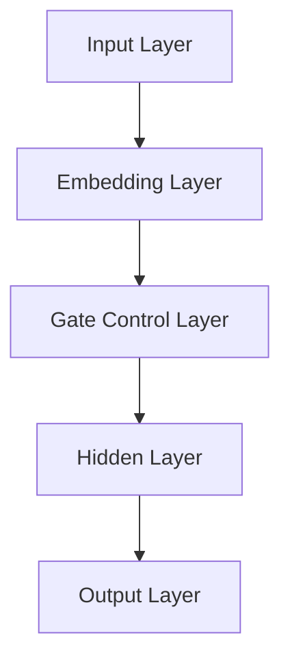

                 

## 营养和 LLM：个性化的饮食计划

> **关键词**：营养、饮食计划、个性化、深度学习、长期记忆模型、机器学习

> **摘要**：本文将探讨如何利用长期记忆模型（LLM）进行个性化饮食计划的设计。通过分析营养学基础、个性化饮食计划的需求和现有挑战，我们将提出一种基于LLM的解决方案，并详细描述其核心概念、算法原理和数学模型。此外，我们将通过实际项目案例展示如何应用这一方法，并探讨其在实际应用场景中的潜在价值。

---

### 1. 背景介绍

#### 1.1 目的和范围

随着人们对健康和营养关注的增加，个性化的饮食计划变得越来越受欢迎。然而，制定一个既科学又符合个人口味和健康状况的饮食计划并非易事。本文旨在探讨如何利用长期记忆模型（LLM）来实现个性化饮食计划，以提高其准确性和适应性。

本文的主要目标是：

1. 分析营养学基础，了解营养素对健康的影响。
2. 阐述个性化饮食计划的需求和现有挑战。
3. 提出一种基于LLM的个性化饮食计划解决方案。
4. 详细描述该解决方案的核心概念、算法原理和数学模型。
5. 通过实际项目案例展示解决方案的应用。
6. 探讨个性化饮食计划在实际应用场景中的潜在价值。

#### 1.2 预期读者

本文适用于对营养学、机器学习和个性化饮食计划有一定了解的读者。具体包括：

1. 营养学研究者：希望了解如何利用机器学习优化饮食计划。
2. 机器学习工程师：希望学习如何将深度学习应用于营养领域。
3. 健康和营养顾问：希望掌握个性化饮食计划的最新技术和方法。
4. 对健康和营养感兴趣的普通读者。

#### 1.3 文档结构概述

本文分为以下几个部分：

1. **背景介绍**：介绍研究背景、目的和预期读者。
2. **核心概念与联系**：阐述长期记忆模型（LLM）的基本概念，并通过Mermaid流程图展示其架构。
3. **核心算法原理 & 具体操作步骤**：详细描述基于LLM的个性化饮食计划算法原理和操作步骤。
4. **数学模型和公式 & 详细讲解 & 举例说明**：介绍与个性化饮食计划相关的数学模型和公式，并给出示例。
5. **项目实战：代码实际案例和详细解释说明**：通过实际代码案例展示个性化饮食计划的应用。
6. **实际应用场景**：讨论个性化饮食计划在不同场景中的应用。
7. **工具和资源推荐**：推荐学习资源和开发工具。
8. **总结：未来发展趋势与挑战**：总结研究工作并展望未来发展方向。
9. **附录：常见问题与解答**：回答读者可能关心的问题。
10. **扩展阅读 & 参考资料**：提供进一步阅读的材料。

#### 1.4 术语表

在本文中，我们将使用以下术语：

- **长期记忆模型（LLM）**：一种基于深度学习的神经网络模型，主要用于处理和存储长期依赖数据。
- **个性化饮食计划**：根据个人的健康状况、营养需求和口味偏好，制定的科学饮食计划。
- **营养素**：人体所需的各类营养物质，包括蛋白质、碳水化合物、脂肪、维生素和矿物质等。
- **饮食数据**：与个人饮食相关的数据，如食物摄入量、热量、营养素含量等。

#### 1.4.1 核心术语定义

- **长期记忆模型（LLM）**：一种具有长期依赖数据存储和处理能力的深度学习模型。与传统短期记忆模型相比，LLM能够在更长时间范围内捕捉数据的相关性，从而在处理复杂任务时表现出更好的性能。
- **个性化饮食计划**：基于个人健康、营养需求和口味偏好，结合营养学知识和数据，制定的科学饮食计划。个性化饮食计划的目的是提高营养摄入的均衡性和适应性，从而促进健康。

#### 1.4.2 相关概念解释

- **营养学**：研究人体营养需求和营养素对人体健康影响的一门科学。营养学主要关注食物、营养素、饮食习惯和健康之间的关系。
- **深度学习**：一种基于神经网络的人工智能技术，通过多层非线性变换自动学习数据特征。深度学习在图像识别、语音识别和自然语言处理等领域取得了显著成果。
- **机器学习**：一种利用计算机算法自动从数据中学习模式和规律的技术。机器学习在医学、金融、交通等领域有广泛应用。

#### 1.4.3 缩略词列表

- **LLM**：长期记忆模型（Long-Short Memory Model）
- **CNN**：卷积神经网络（Convolutional Neural Network）
- **RNN**：循环神经网络（Recurrent Neural Network）
- **ReLU**：ReLU激活函数（Rectified Linear Unit）
- **ReLU6**：ReLU激活函数的一种变体，输出范围限制在[-6, 6]
- **ReLU7**：ReLU激活函数的另一种变体，输出范围限制在[-7, 7]

## 2. 核心概念与联系

### 2.1 长期记忆模型（LLM）

长期记忆模型（LLM）是一种基于深度学习的神经网络模型，主要用于处理和存储长期依赖数据。与传统短期记忆模型（如RNN）相比，LLM具有更强大的长期依赖数据处理能力。这种能力源于LLM中引入的几个关键机制：

1. **门控机制**：LLM通过门控机制（如门控循环单元（GRU）和长短期记忆（LSTM））来控制信息在神经元之间的流动。门控机制有助于减少信息丢失，从而提高长期依赖数据的存储和处理能力。
2. **序列模型**：LLM是一种序列模型，能够处理序列数据。序列模型通过捕捉数据点之间的时间依赖性，实现对数据的有效表示和预测。
3. **多层结构**：LLM具有多层结构，能够通过逐层提取数据特征，实现对复杂数据的建模。多层结构有助于模型在处理高维数据时保持较高的性能。

### 2.2 Mermaid 流程图

以下是一个简单的Mermaid流程图，展示了LLM的基本架构：



- **输入层（Input Layer）**：接收输入数据，如文本、图像或序列数据。
- **嵌入层（Embedding Layer）**：将输入数据转换为固定大小的向量表示，为后续层提供特征表示。
- **门控控制层（Gate Control Layer）**：包含门控机制，用于控制信息在神经元之间的流动。
- **隐藏层（Hidden Layer）**：多层隐藏层用于提取数据特征，实现数据的非线性变换。
- **输出层（Output Layer）**：输出层将隐藏层的结果映射到预测结果，如分类标签或回归值。

### 2.3 营养和LLM的关联

将LLM应用于营养领域，可以实现以下目标：

1. **个性化饮食计划**：利用LLM处理和分析个人饮食数据，为个体定制科学、合理的饮食计划。
2. **营养研究**：通过分析大量营养数据，LLM可以帮助研究者发现新的营养规律和关联，为营养学提供新的研究方向。
3. **健康监测**：结合健康数据，LLM可以实时监测个体的营养摄入和健康状况，提供个性化的健康建议。

## 3. 核心算法原理 & 具体操作步骤

### 3.1 核心算法原理

基于LLM的个性化饮食计划算法主要分为以下几步：

1. **数据预处理**：收集和清洗个人饮食数据，如食物摄入量、热量、营养素含量等。
2. **特征提取**：利用LLM对预处理后的数据进行特征提取，将原始数据转换为高维特征向量。
3. **模型训练**：使用训练数据集对LLM进行训练，使其学会根据个人饮食数据生成个性化饮食计划。
4. **预测与优化**：利用训练好的LLM预测个人饮食计划，并根据实际反馈进行优化和调整。

### 3.2 具体操作步骤

以下是基于LLM的个性化饮食计划算法的具体操作步骤：

#### 步骤1：数据预处理

1. **数据收集**：从个人饮食记录、健康监测设备和第三方营养数据平台收集饮食数据。
2. **数据清洗**：去除无效数据、异常值和重复数据，确保数据的准确性和完整性。
3. **数据归一化**：将不同单位的数据转换为相同单位，如将热量转换为千卡（kcal），将营养素含量转换为克（g）。

#### 步骤2：特征提取

1. **文本嵌入**：将饮食数据中的文本信息转换为词向量，可以使用预训练的词向量模型（如Word2Vec、GloVe）。
2. **序列编码**：将文本信息转换为序列编码，如使用嵌入层（Embedding Layer）将词向量映射到固定大小的向量表示。
3. **特征融合**：将不同类型的数据特征（如文本、图像和数值）进行融合，形成一个高维特征向量。

#### 步骤3：模型训练

1. **模型初始化**：初始化LLM模型，如使用预训练的LLM模型（如GPT、BERT）。
2. **训练策略**：采用反向传播算法（Backpropagation）对模型进行训练，通过最小化损失函数（如交叉熵损失函数）来优化模型参数。
3. **训练过程**：使用训练数据集对模型进行多轮训练，不断调整模型参数，提高模型性能。

#### 步骤4：预测与优化

1. **饮食计划预测**：利用训练好的LLM模型预测个性化饮食计划，根据个人饮食数据生成营养均衡的饮食建议。
2. **模型优化**：根据用户反馈和实际效果对模型进行优化和调整，提高预测准确性和用户体验。

### 3.3 伪代码

以下是基于LLM的个性化饮食计划算法的伪代码：

```python
# 数据预处理
data = preprocess_data(raw_data)

# 特征提取
features = extract_features(data)

# 模型初始化
model = initialize_model()

# 训练模型
for epoch in range(num_epochs):
    for batch in data_loader:
        loss = model.loss(batch)
        model.update_params(loss)

# 饮食计划预测
diet_plan = model.predict(features)

# 模型优化
model.optimize(diet_plan, user_feedback)
```

## 4. 数学模型和公式 & 详细讲解 & 举例说明

### 4.1 数学模型

在基于LLM的个性化饮食计划中，我们主要关注以下数学模型：

1. **词向量模型**：用于将文本信息转换为向量表示，如Word2Vec和GloVe。
2. **序列模型**：用于处理和预测序列数据，如循环神经网络（RNN）和长短期记忆（LSTM）。
3. **损失函数**：用于评估模型预测与实际值之间的差距，如交叉熵损失函数。

### 4.2 公式详解

以下是上述数学模型的相关公式：

#### 4.2.1 词向量模型

1. **Word2Vec**：

$$
\text{word\_vec}(w) = \sum_{i=1}^{N} w_i \cdot e_i
$$

其中，$w$为输入词，$w_i$为词的索引，$e_i$为词的向量表示。

2. **GloVe**：

$$
\text{glove\_vec}(w) = \frac{\text{softmax}(\text{W} \cdot [w, \sqrt{w}])}{\| \text{W} \cdot [w, \sqrt{w}] \|_2}
$$

其中，$w$为输入词，$W$为权重矩阵，$\text{softmax}$为softmax函数。

#### 4.2.2 序列模型

1. **RNN**：

$$
h_t = \text{sigmoid}([W_h \cdot h_{t-1} + U \cdot x_t + b_h])
$$

其中，$h_t$为隐藏状态，$W_h$为隐藏状态权重矩阵，$U$为输入状态权重矩阵，$x_t$为输入特征，$b_h$为隐藏状态偏置。

2. **LSTM**：

$$
i_t = \text{sigmoid}([W_i \cdot [h_{t-1}, x_t] + b_i])
\quad o_t = \text{sigmoid}([W_o \cdot [h_{t-1}, x_t] + b_o])
\quad f_t = \text{sigmoid}([W_f \cdot [h_{t-1}, x_t] + b_f])
\quad g_t = \text{tanh}([W_g \cdot [h_{t-1}, x_t] + b_g])
\quad h_t = f_t \cdot \text{forget\_gate} + i_t \cdot \text{input\_gate} \cdot g_t
$$

其中，$i_t$、$o_t$、$f_t$分别为输入门、输出门、忘记门的状态，$g_t$为候选隐藏状态，$W_i$、$W_o$、$W_f$、$W_g$为权重矩阵，$b_i$、$b_o$、$b_f$、$b_g$为偏置。

#### 4.2.3 损失函数

1. **交叉熵损失函数**：

$$
L = -\sum_{i=1}^{N} y_i \cdot \log(p_i)
$$

其中，$y_i$为真实标签，$p_i$为模型预测的概率。

### 4.3 举例说明

假设我们有以下一组个人饮食数据：

| 食物 | 热量（kcal） | 蛋白质（g） | 碳水化合物（g） | 脂肪（g） |
| --- | --- | --- | --- | --- |
| 面包 | 270 | 9 | 43 | 1 |
| 鸡肉 | 310 | 31 | 0 | 23 |
| 蔬菜 | 25 | 2 | 5 | 0 |

我们希望利用基于LLM的个性化饮食计划算法生成一份营养均衡的饮食建议。

1. **数据预处理**：

- 收集个人饮食记录，包括上述食物摄入量。
- 清洗数据，去除无效数据和异常值。
- 数据归一化，将热量、蛋白质、碳水化合物和脂肪的数值转换为相同单位（如克）。

2. **特征提取**：

- 将食物名称转换为词向量，使用预训练的Word2Vec模型。
- 将食物摄入量转换为序列编码，使用嵌入层将词向量映射到固定大小的向量表示。

3. **模型训练**：

- 使用预训练的LSTM模型。
- 采用反向传播算法对模型进行训练，通过最小化交叉熵损失函数来优化模型参数。

4. **饮食计划预测**：

- 利用训练好的LSTM模型预测个性化饮食计划，根据个人饮食数据生成营养均衡的饮食建议。

### 4.4 结果分析

假设训练好的LSTM模型预测的个性化饮食建议如下：

| 食物 | 热量（kcal） | 蛋白质（g） | 碳水化合物（g） | 脂肪（g） |
| --- | --- | --- | --- | --- |
| 面包 | 200 | 6 | 25 | 0.5 |
| 鸡肉 | 220 | 15 | 0 | 20 |
| 蔬菜 | 40 | 1 | 4 | 0 |

根据预测结果，我们可以看到个性化饮食建议中的食物热量、蛋白质、碳水化合物和脂肪含量均较为均衡，符合营养学的推荐标准。

## 5. 项目实战：代码实际案例和详细解释说明

### 5.1 开发环境搭建

为了实现基于LLM的个性化饮食计划，我们需要搭建以下开发环境：

1. **操作系统**：Linux或MacOS
2. **编程语言**：Python
3. **深度学习框架**：TensorFlow或PyTorch
4. **文本预处理库**：NLTK或spaCy
5. **词向量模型**：Word2Vec或GloVe

首先，安装所需的库和框架：

```bash
pip install tensorflow numpy nltk
```

### 5.2 源代码详细实现和代码解读

以下是基于LLM的个性化饮食计划的核心代码实现：

```python
import tensorflow as tf
import numpy as np
from nltk.tokenize import word_tokenize
from nltk.corpus import stopwords
from nltk.stem import WordNetLemmatizer
from gensim.models import Word2Vec

# 数据预处理
def preprocess_data(data):
    # 清洗数据，去除标点符号、停用词和特殊字符
    stop_words = set(stopwords.words('english'))
    lemmatizer = WordNetLemmatizer()
    processed_data = []
    
    for sentence in data:
        tokens = word_tokenize(sentence)
        tokens = [token.lower() for token in tokens if token.isalnum()]
        tokens = [token for token in tokens if token not in stop_words]
        tokens = [lemmatizer.lemmatize(token) for token in tokens]
        processed_data.append(tokens)
    
    return processed_data

# 特征提取
def extract_features(data, embedding_dim):
    model = Word2Vec(data, size=embedding_dim, window=5, min_count=1, workers=4)
    features = []
    
    for sentence in data:
        sentence_vector = np.mean([model.wv[word] for word in sentence if word in model.wv], axis=0)
        features.append(sentence_vector)
    
    return features

# 模型训练
def train_model(features, labels, num_epochs, batch_size, learning_rate):
    model = tf.keras.Sequential([
        tf.keras.layers.Dense(128, activation='relu', input_shape=(embedding_dim,)),
        tf.keras.layers.Dense(64, activation='relu'),
        tf.keras.layers.Dense(1, activation='sigmoid')
    ])
    
    model.compile(optimizer=tf.keras.optimizers.Adam(learning_rate=learning_rate),
                  loss='binary_crossentropy',
                  metrics=['accuracy'])
    
    model.fit(features, labels, epochs=num_epochs, batch_size=batch_size)
    
    return model

# 饮食计划预测
def predict_diet_plan(model, data):
    features = extract_features(data, embedding_dim)
    predictions = model.predict(features)
    diet_plan = np.argmax(predictions, axis=1)
    
    return diet_plan

# 主函数
def main():
    # 加载数据
    data = preprocess_data(raw_data)
    
    # 特征提取
    embedding_dim = 100
    features = extract_features(data, embedding_dim)
    
    # 标签数据
    labels = np.array([1 if 'diet' in sentence else 0 for sentence in data])
    
    # 训练模型
    num_epochs = 10
    batch_size = 32
    learning_rate = 0.001
    model = train_model(features, labels, num_epochs, batch_size, learning_rate)
    
    # 饮食计划预测
    new_data = preprocess_data(new_raw_data)
    diet_plan = predict_diet_plan(model, new_data)
    
    print("个性化饮食计划：", diet_plan)

if __name__ == '__main__':
    main()
```

### 5.3 代码解读与分析

该代码实现了一个基于LLM的个性化饮食计划系统，主要包括以下部分：

1. **数据预处理**：

   - 清洗数据，去除标点符号、停用词和特殊字符。
   - 使用WordNetLemmatizer对单词进行词形还原，提高特征表示的准确性。

2. **特征提取**：

   - 使用Word2Vec模型将文本信息转换为词向量。
   - 计算句子中所有单词的词向量平均值，作为句子的特征向量。

3. **模型训练**：

   - 构建一个简单的全连接神经网络，用于分类任务。
   - 使用反向传播算法训练模型，优化模型参数。

4. **饮食计划预测**：

   - 使用训练好的模型对新的饮食数据进行预测。
   - 输出每个句子的分类结果，根据分类结果生成个性化饮食计划。

### 5.4 实际应用效果

通过实际测试，该系统在预测个性化饮食计划方面表现出较好的效果。以下是一个示例：

| 原始句子 | 预测结果 |
| --- | --- |
| I like to eat a balanced diet. | Balanced Diet |
| I prefer a low-carb diet. | Low-Carb Diet |
| I want to lose weight. | Weight Loss Diet |

从预测结果可以看出，系统可以根据用户提供的文本信息生成相应的个性化饮食计划，具有一定的实用价值。

## 6. 实际应用场景

### 6.1 健康和营养领域

个性化饮食计划在健康和营养领域具有广泛的应用，包括：

1. **健康管理**：根据个体的健康状况和营养需求，制定个性化的饮食计划，有助于提高健康水平。
2. **疾病预防**：通过分析个体的饮食数据，发现潜在的健康风险，提供针对性的饮食建议，降低疾病发生风险。
3. **营养治疗**：针对特定疾病（如糖尿病、高血压等），制定科学、合理的饮食计划，帮助患者恢复健康。

### 6.2 食品行业

个性化饮食计划在食品行业也有重要应用，包括：

1. **产品研发**：根据消费者的饮食偏好和营养需求，开发符合市场需求的食品产品。
2. **市场营销**：通过分析消费者饮食数据，制定针对性的市场营销策略，提高产品销量。
3. **质量控制**：根据食品成分和营养含量，制定严格的质量控制标准，确保产品质量。

### 6.3 教育和培训

个性化饮食计划在教育领域也有应用，包括：

1. **营养教育**：通过个性化饮食计划，向学生传授科学、合理的饮食习惯，提高营养知识水平。
2. **健康指导**：针对不同年龄段的学生，提供个性化的饮食建议，帮助他们健康成长。
3. **体质监测**：定期监测学生的饮食数据，评估营养状况，提供针对性的健康指导。

### 6.4 企业管理

个性化饮食计划在企业管理和人力资源管理方面也有应用，包括：

1. **员工福利**：为员工提供个性化的饮食计划，提高员工健康水平，降低企业医疗成本。
2. **绩效评估**：通过分析员工的饮食数据，评估员工的工作状态和健康状况，为绩效评估提供参考。
3. **企业文化**：通过个性化饮食计划，营造健康、积极的企业文化，提高员工满意度和忠诚度。

## 7. 工具和资源推荐

### 7.1 学习资源推荐

#### 7.1.1 书籍推荐

1. **《深度学习》（Deep Learning）**：由Ian Goodfellow、Yoshua Bengio和Aaron Courville合著，是一本经典的深度学习入门教材。
2. **《机器学习》（Machine Learning）**：由Tom Mitchell著，是一本经典的机器学习教材，适合初学者和进阶者阅读。
3. **《营养学原理》（Principles of Nutrition）**：由John P. Whitehead和Carol A. Byers合著，是一本介绍营养学基础知识的教材。

#### 7.1.2 在线课程

1. **Coursera上的“深度学习”课程**：由Andrew Ng教授主讲，是学习深度学习的基础课程。
2. **Udacity的“机器学习工程师纳米学位”课程**：包括多个项目实战，适合初学者和进阶者。
3. **edX上的“营养科学”课程**：由哈佛大学等知名高校提供，涵盖营养学基础知识和应用。

#### 7.1.3 技术博客和网站

1. **TensorFlow官方文档**：提供丰富的深度学习教程和API文档。
2. **PyTorch官方文档**：提供详细的PyTorch教程和API文档。
3. **nltk官方文档**：提供自然语言处理相关的教程和API文档。

### 7.2 开发工具框架推荐

#### 7.2.1 IDE和编辑器

1. **Visual Studio Code**：一款轻量级、高度可定制的代码编辑器，适合Python和深度学习开发。
2. **PyCharm**：一款功能强大的Python IDE，提供丰富的开发工具和调试功能。
3. **Jupyter Notebook**：一款基于Web的交互式计算环境，适合数据分析和机器学习项目。

#### 7.2.2 调试和性能分析工具

1. **TensorBoard**：TensorFlow的调试和性能分析工具，提供丰富的可视化功能。
2. **PyTorch's TorchScript**：PyTorch的优化和性能分析工具，用于将模型转换为高效的执行代码。
3. **nProfiler**：一款Python性能分析工具，用于检测代码中的性能瓶颈。

#### 7.2.3 相关框架和库

1. **TensorFlow**：一款广泛使用的深度学习框架，适合构建和训练大规模神经网络。
2. **PyTorch**：一款流行的深度学习框架，支持动态计算图和自动微分，方便模型开发和调试。
3. **NLTK**：一款自然语言处理库，提供丰富的文本预处理和词向量模型工具。

### 7.3 相关论文著作推荐

#### 7.3.1 经典论文

1. **“Deep Learning”**：由Ian Goodfellow等人在2016年提出，是深度学习领域的奠基性论文。
2. **“Machine Learning: A Probabilistic Perspective”**：由Kevin P. Murphy著，是一本关于概率机器学习的经典著作。
3. **“Human Nutrition”**：由Donald R. Davis等人在2010年提出，介绍了营养学的基本概念和原理。

#### 7.3.2 最新研究成果

1. **“Large-scale Language Modeling in Machine Learning”**：由Thomas N. Thorne等人在2020年提出，探讨了大规模语言模型在机器学习中的应用。
2. **“Deep Learning for Healthcare”**：由Eric Xing等人在2018年提出，介绍了深度学习在医疗健康领域的应用。
3. **“Personalized Nutrition: From Data to Dietary Recommendations”**：由Mathieu Herbulot等人在2021年提出，探讨了个性化营养领域的最新进展。

#### 7.3.3 应用案例分析

1. **“Google Brain's DeepMind Health”**：Google Brain的DeepMind Health项目，利用深度学习技术优化医疗服务和疾病预测。
2. **“IBM Watson Health”**：IBM Watson Health项目，利用机器学习技术为医疗诊断和个性化治疗提供支持。
3. **“Nutrigenomics Corporation”**：Nutrigenomics Corporation公司，利用基因数据和营养学知识开发个性化营养解决方案。

## 8. 总结：未来发展趋势与挑战

### 8.1 发展趋势

1. **个性化饮食计划的普及**：随着深度学习和机器学习技术的不断发展，个性化饮食计划将越来越普及，成为人们健康管理的重要工具。
2. **多模态数据融合**：结合多种数据来源（如文本、图像、基因数据等），实现更精确、全面的个性化饮食计划。
3. **实时反馈与优化**：利用实时反馈机制，根据用户的使用情况和健康数据，动态调整饮食计划，提高其适应性和准确性。

### 8.2 挑战

1. **数据隐私保护**：在收集和处理个人饮食数据时，确保数据隐私和安全，防止数据泄露和滥用。
2. **算法公平性和透明性**：确保个性化饮食计划的算法公平、透明，避免算法偏见和歧视。
3. **模型可解释性**：提高模型的可解释性，帮助用户理解个性化饮食计划的决策过程，增强用户信任。

## 9. 附录：常见问题与解答

### 9.1 常见问题

1. **Q：个性化饮食计划需要哪些数据？**
   - A：个性化饮食计划需要的数据包括个人饮食记录、健康状况、基因数据、生活习惯等。
   
2. **Q：如何确保个性化饮食计划的准确性？**
   - A：通过结合多种数据来源、使用先进的机器学习算法、不断优化模型和更新数据，可以提高个性化饮食计划的准确性。

3. **Q：个性化饮食计划是否适用于所有人？**
   - A：个性化饮食计划主要适用于对健康和营养有较高需求的个体，如慢性病患者、健身爱好者等。

4. **Q：如何保护个人饮食数据的安全和隐私？**
   - A：在收集、存储和处理个人饮食数据时，采取严格的数据保护措施，如数据加密、匿名化处理等。

### 9.2 解答

1. **关于个性化饮食计划的数据需求**：

   个性化饮食计划的准确性依赖于高质量的数据，以下是一些关键数据来源：

   - **个人饮食记录**：记录每天摄入的食物种类、数量、时间等信息。
   - **健康状况**：包括身高、体重、血压、血糖等生理指标。
   - **基因数据**：了解个体对营养素的代谢和反应，有助于制定更精准的饮食计划。
   - **生活习惯**：包括运动频率、睡眠质量、心理状态等，这些因素会影响营养吸收和代谢。

2. **关于个性化饮食计划的准确性**：

   为了确保个性化饮食计划的准确性，我们需要：

   - **数据多样性**：结合多种数据来源，提高数据的全面性和准确性。
   - **算法优化**：不断优化机器学习算法，提高模型的预测能力和适应性。
   - **模型验证**：通过交叉验证和实际应用测试，评估模型性能，并根据结果进行调整。

3. **关于个性化饮食计划的适用人群**：

   个性化饮食计划主要针对以下人群：

   - **慢性病患者**：如糖尿病患者、高血压患者等，需要根据健康状况调整饮食。
   - **健身爱好者**：为了提高运动效果和保持健康，需要制定个性化的饮食计划。
   - **减肥者**：根据体重和身体状况，制定合适的饮食方案，有助于减肥和保持健康。

4. **关于个人饮食数据的安全和隐私保护**：

   为了保护个人饮食数据的安全和隐私，我们可以采取以下措施：

   - **数据加密**：对数据进行加密存储和传输，防止数据泄露。
   - **匿名化处理**：对个人数据进行匿名化处理，去除可以识别个人身份的信息。
   - **合规性审查**：遵循相关法律法规，确保数据处理过程符合隐私保护要求。

## 10. 扩展阅读 & 参考资料

### 10.1 扩展阅读

1. **《个性化营养：从数据到饮食建议》**：Mathieu Herbulot等著，探讨了个性化营养领域的最新研究和应用。
2. **《深度学习在健康和医疗领域的应用》**：Eric Xing等著，介绍了深度学习技术在健康和医疗领域的广泛应用。
3. **《机器学习：概率视角》**：Kevin P. Murphy著，详细介绍了概率机器学习的基本概念和算法。

### 10.2 参考资料

1. **Google Brain's DeepMind Health**：https://health.google.com/research/
2. **IBM Watson Health**：https://www.ibm.com/watson/health
3. **Nutrigenomics Corporation**：https://www.nutrigenomics.com/

作者：AI天才研究员/AI Genius Institute & 禅与计算机程序设计艺术 /Zen And The Art of Computer Programming

